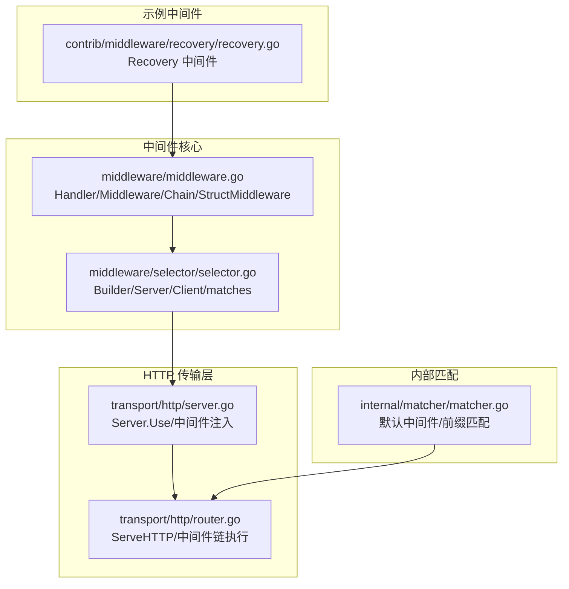
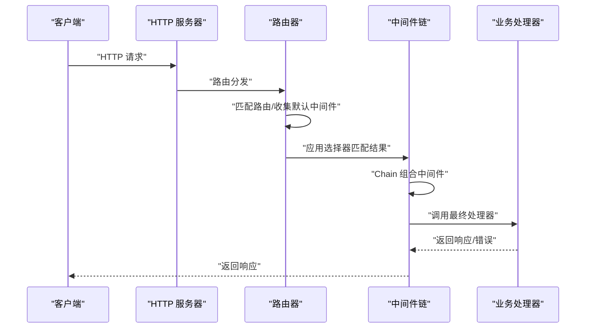
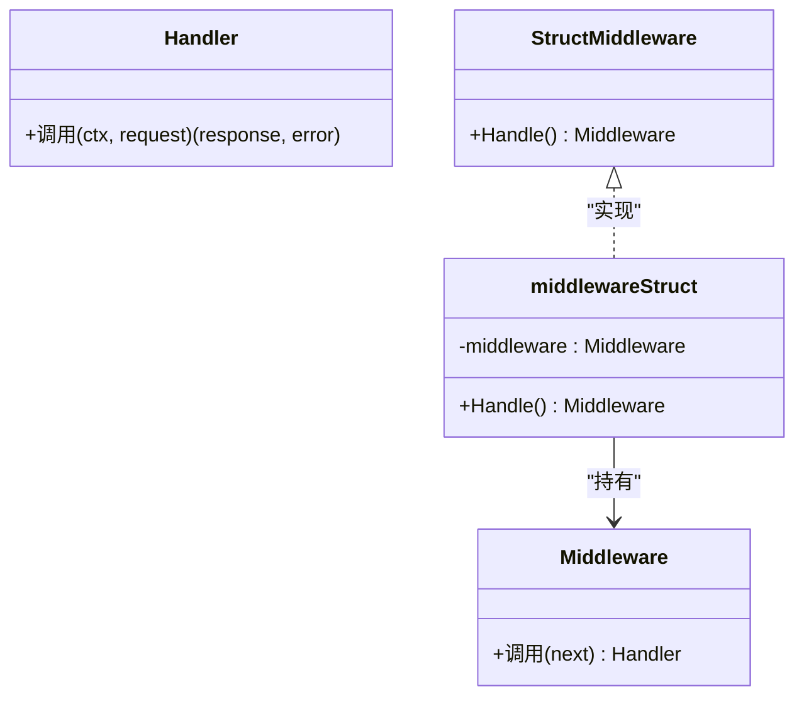
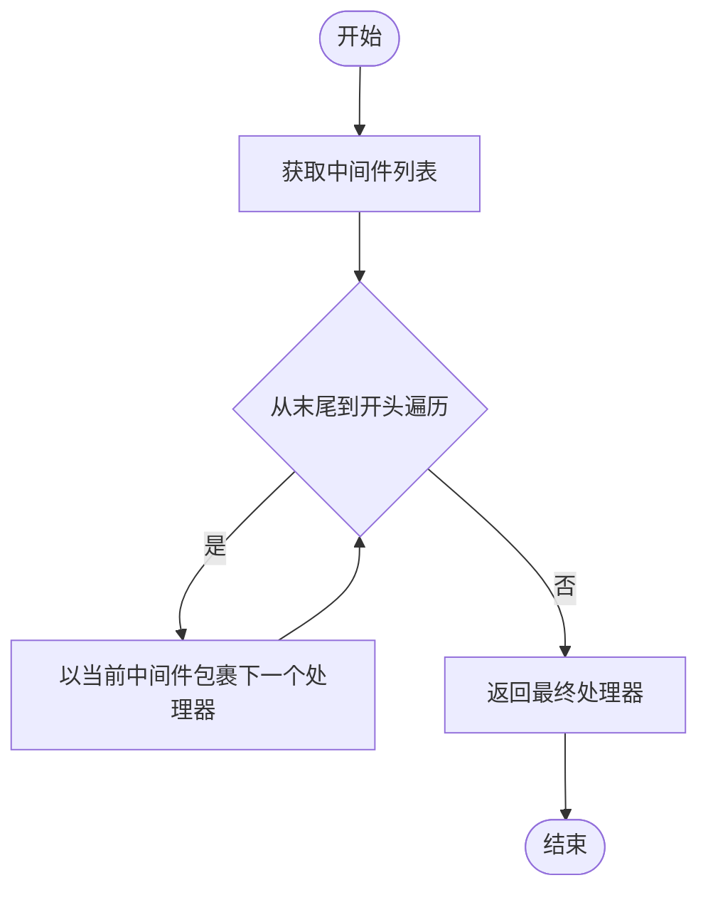
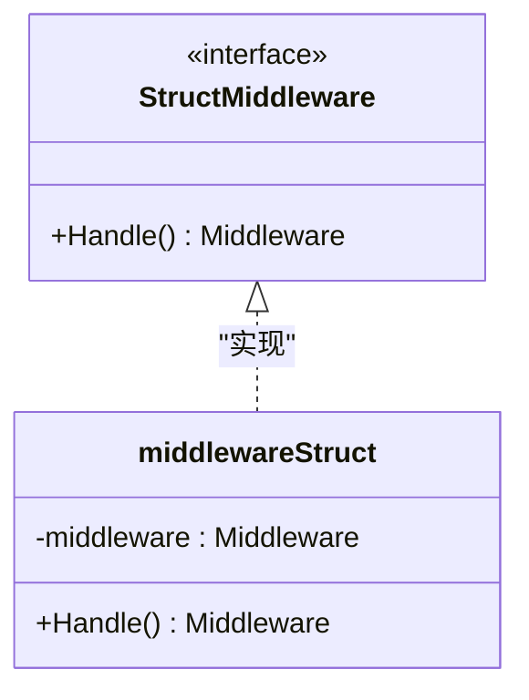
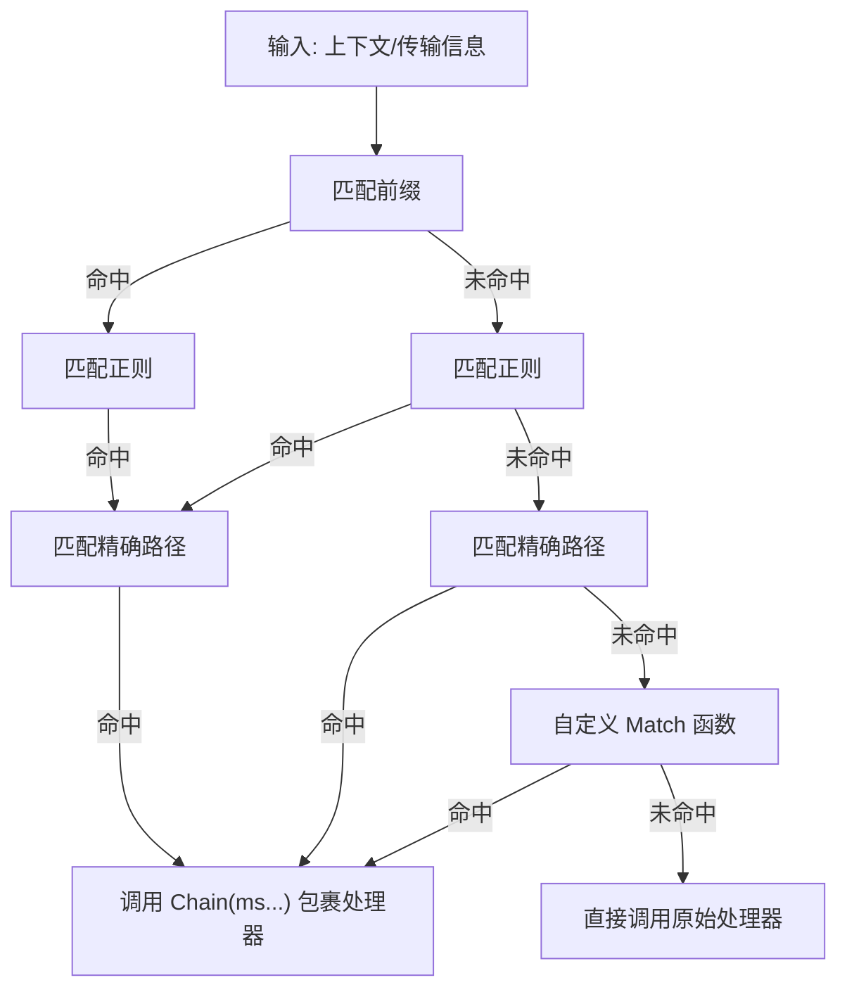
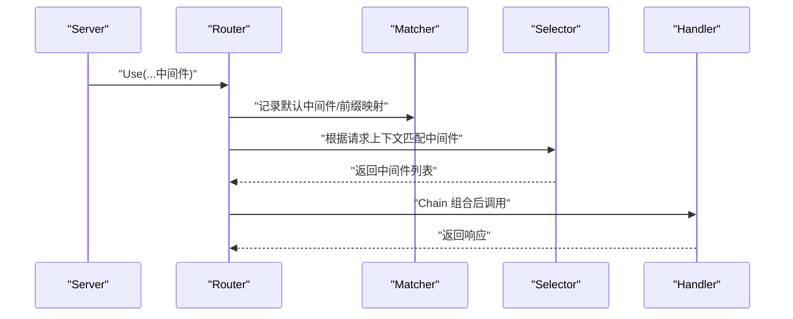
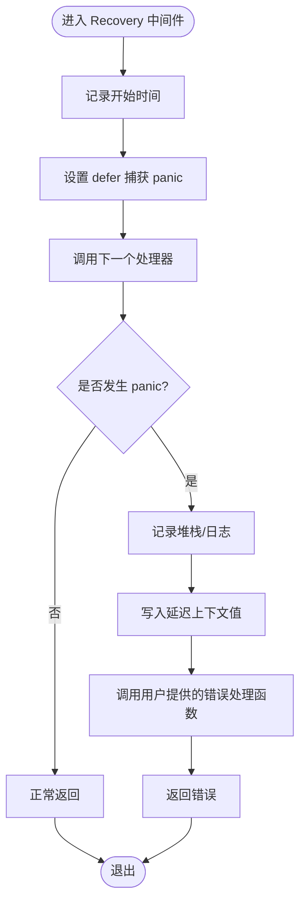

# 中间件框架核心

<cite>
**本文引用的文件列表**
- [middleware.go](file://middleware/middleware.go)
- [selector.go](file://middleware/selector/selector.go)
- [recovery.go](file://contrib/middleware/recovery/recovery.go)
- [server.go](file://transport/http/server.go)
- [router.go](file://transport/http/router.go)
- [matcher.go](file://internal/matcher/matcher.go)
</cite>

## 目录
1. [简介](#简介)
2. [项目结构](#项目结构)
3. [核心组件](#核心组件)
4. [架构总览](#架构总览)
5. [详细组件分析](#详细组件分析)
6. [依赖关系分析](#依赖关系分析)
7. [性能考量](#性能考量)
8. [故障排查指南](#故障排查指南)
9. [结论](#结论)
10. [附录：基础示例与最佳实践](#附录基础示例与最佳实践)

## 简介
本技术文档聚焦于 Go Fox 中间件框架的核心设计与实现，系统性阐述以下主题：
- Handler 函数签名与 Middleware 函数类型定义
- 中间件链构建机制（Chain）与执行顺序
- 结构体中间件接口 StructMiddleware 的设计思路与工厂函数 NewStructMiddleware
- 中间件选择器 Selector 的匹配策略与在 HTTP 传输中的集成
- 基础中间件开发示例（日志、认证、异常恢复）
- 参数传递与上下文传播机制

通过本文件，读者可以快速掌握中间件链的工作原理，并据此扩展出符合业务需求的中间件体系。

## 项目结构
围绕中间件的核心代码主要分布在如下模块：
- middleware：中间件类型定义、链式组合与结构体中间件包装
- middleware/selector：基于路径前缀、正则、精确路径与自定义匹配函数的中间件选择器
- contrib/middleware/recovery：异常恢复中间件示例
- transport/http：HTTP 服务器对中间件的接入与路由处理流程
- internal/matcher：内部匹配器，用于默认中间件与前缀匹配

图表来源
- [middleware.go](file://middleware/middleware.go#L28-L66)
- [selector.go](file://middleware/selector/selector.go#L27-L127)
- [server.go](file://transport/http/server.go#L159-L204)
- [router.go](file://transport/http/router.go#L79-L128)
- [matcher.go](file://internal/matcher/matcher.go#L40-L88)
- [recovery.go](file://contrib/middleware/recovery/recovery.go#L54-L79)

章节来源
- [middleware.go](file://middleware/middleware.go#L28-L66)
- [selector.go](file://middleware/selector/selector.go#L27-L127)
- [server.go](file://transport/http/server.go#L159-L204)
- [router.go](file://transport/http/router.go#L79-L128)
- [matcher.go](file://internal/matcher/matcher.go#L40-L88)
- [recovery.go](file://contrib/middleware/recovery/recovery.go#L54-L79)

## 核心组件
本节对中间件框架的关键类型与函数进行深入解析，帮助开发者建立统一的认知模型。

- Handler 函数签名
  - 定义：接收上下文与请求对象，返回响应对象与错误
  - 作用：作为中间件链末端的“最终处理器”，承载业务逻辑
  - 参考路径：[Handler 类型定义](file://middleware/middleware.go#L29)

- Middleware 函数类型
  - 定义：接收 Handler 并返回新的 Handler
  - 作用：将“下一个处理器”包裹为“带前置/后置逻辑的新处理器”
  - 参考路径：[Middleware 类型定义](file://middleware/middleware.go#L32)

- 结构体中间件接口 StructMiddleware
  - 接口：提供 Handle 方法，返回一个 Middleware
  - 设计目的：将任意函数签名适配为标准 Middleware，便于统一注入与组合
  - 参考路径：[StructMiddleware 接口](file://middleware/middleware.go#L35-L37)

- 结构体中间件工厂 NewStructMiddleware
  - 功能：将任意 Middleware 封装为 StructMiddleware 实例
  - 使用场景：面向对象风格的中间件封装，便于在不同容器或框架中复用
  - 参考路径：[NewStructMiddleware 工厂](file://middleware/middleware.go#L48-L52)

- 中间件链 Chain
  - 功能：将多个 Middleware 组合成一个单一的 Middleware
  - 关键点：逆序组合，确保外层中间件先执行，内层后执行
  - 参考路径：[Chain 实现](file://middleware/middleware.go#L59-L66)

章节来源
- [middleware.go](file://middleware/middleware.go#L28-L66)

## 架构总览
中间件链在 HTTP 传输层的典型工作流如下：
- HTTP 服务器在启动时注入全局中间件
- 路由匹配到具体 Handler 后，将默认中间件与前缀匹配中间件合并
- 通过选择器（Selector）判断是否应用特定中间件
- 使用 Chain 将中间件按顺序组合，形成最终的处理器
- 执行过程中，上下文携带传输信息（如操作名、路径模板），供中间件读取

图表来源
- [server.go](file://transport/http/server.go#L159-L204)
- [router.go](file://transport/http/router.go#L79-L128)
- [selector.go](file://middleware/selector/selector.go#L118-L127)
- [middleware.go](file://middleware/middleware.go#L59-L66)

## 详细组件分析

### Handler 与 Middleware 类型体系
Handler 与 Middleware 的类型定义构成了中间件链的基石。Handler 是“最终处理器”，Middleware 则是“处理器的装饰器”。二者通过闭包与函数组合，实现了可插拔、可叠加的横切能力。

图表来源
- [middleware.go](file://middleware/middleware.go#L28-L52)

章节来源
- [middleware.go](file://middleware/middleware.go#L28-L52)

### Chain 中间件链构建机制
Chain 的核心思想是“逆序组合”。传入的中间件数组从最后一个开始包裹下一个处理器，逐步向前，最终得到一个单一的 Middleware。该机制保证了外层中间件先执行、内层后执行的语义。

图表来源
- [middleware.go](file://middleware/middleware.go#L59-L66)

章节来源
- [middleware.go](file://middleware/middleware.go#L59-L66)

### 结构体中间件接口与工厂
结构体中间件通过接口抽象，将任意函数签名转换为标准 Middleware；工厂函数负责实例化，便于在不同上下文中复用。

图表来源
- [middleware.go](file://middleware/middleware.go#L35-L52)

章节来源
- [middleware.go](file://middleware/middleware.go#L35-L52)

### 选择器 Selector：匹配与应用
选择器 Builder 提供多种匹配条件（前缀、正则、精确路径、自定义函数），并在匹配成功时通过 Chain 应用中间件；否则直接调用原始处理器。

图表来源
- [selector.go](file://middleware/selector/selector.go#L84-L127)

章节来源
- [selector.go](file://middleware/selector/selector.go#L27-L127)

### HTTP 服务器中的中间件接入
HTTP 服务器在初始化阶段会将配置的中间件注入到路由系统中；路由在每次请求到来时，会将默认中间件与前缀匹配中间件合并，并通过选择器决定是否应用额外中间件。

图表来源
- [server.go](file://transport/http/server.go#L159-L204)
- [router.go](file://transport/http/router.go#L79-L128)
- [matcher.go](file://internal/matcher/matcher.go#L40-L88)
- [selector.go](file://middleware/selector/selector.go#L118-L127)

章节来源
- [server.go](file://transport/http/server.go#L159-L204)
- [router.go](file://transport/http/router.go#L79-L128)
- [matcher.go](file://internal/matcher/matcher.go#L40-L88)
- [selector.go](file://middleware/selector/selector.go#L118-L127)

### 异常恢复中间件 Recovery 示例
Recovery 中间件演示了典型的“前置逻辑（捕获 panic）+ 后置逻辑（构造响应）”模式，展示了如何在中间件中处理异常并回传给上层。

图表来源
- [recovery.go](file://contrib/middleware/recovery/recovery.go#L54-L79)

章节来源
- [recovery.go](file://contrib/middleware/recovery/recovery.go#L54-L79)

## 依赖关系分析
中间件框架与传输层、匹配器之间存在清晰的依赖关系：
- middleware：定义 Handler/Middleware/Chain/StructMiddleware
- middleware/selector：基于传输上下文与匹配规则生成中间件包装器
- transport/http：在服务器初始化与路由处理中使用中间件
- internal/matcher：提供默认中间件与前缀匹配能力
- contrib/middleware/recovery：提供异常恢复中间件示例

图表来源
- [middleware.go](file://middleware/middleware.go#L28-L66)
- [selector.go](file://middleware/selector/selector.go#L27-L127)
- [server.go](file://transport/http/server.go#L159-L204)
- [router.go](file://transport/http/router.go#L79-L128)
- [matcher.go](file://internal/matcher/matcher.go#L40-L88)
- [recovery.go](file://contrib/middleware/recovery/recovery.go#L54-L79)

章节来源
- [middleware.go](file://middleware/middleware.go#L28-L66)
- [selector.go](file://middleware/selector/selector.go#L27-L127)
- [server.go](file://transport/http/server.go#L159-L204)
- [router.go](file://transport/http/router.go#L79-L128)
- [matcher.go](file://internal/matcher/matcher.go#L40-L88)
- [recovery.go](file://contrib/middleware/recovery/recovery.go#L54-L79)

## 性能考量
- 中间件链的组合成本：Chain 在编译期将多个中间件组合为单个处理器，运行时仅一次函数调用开销
- 选择器匹配：前缀/正则/精确路径匹配在路由阶段完成，避免在每个请求中重复计算
- 上下文传递：通过 context 传递数据，避免额外的内存拷贝
- 异常恢复：Recovery 使用 defer 捕获 panic，尽量减少对正常路径的影响

## 故障排查指南
- 中间件未生效
  - 检查是否正确注入到 HTTP 服务器的 Use 流程
  - 确认选择器匹配条件是否满足
  - 参考路径：[HTTP 服务器中间件注入](file://transport/http/server.go#L159-L204)，[选择器匹配](file://middleware/selector/selector.go#L84-L127)

- 中间件执行顺序不符合预期
  - Chain 采用逆序组合，确认中间件传入顺序
  - 参考路径：[Chain 实现](file://middleware/middleware.go#L59-L66)

- 异常未被捕获
  - 确认 Recovery 中间件已正确包裹处理器
  - 参考路径：[Recovery 中间件](file://contrib/middleware/recovery/recovery.go#L54-L79)

- 上下文信息缺失
  - 确认路由处理中已将传输信息写入上下文
  - 参考路径：[路由上下文设置](file://transport/http/router.go#L105-L126)

章节来源
- [server.go](file://transport/http/server.go#L159-L204)
- [selector.go](file://middleware/selector/selector.go#L84-L127)
- [middleware.go](file://middleware/middleware.go#L59-L66)
- [recovery.go](file://contrib/middleware/recovery/recovery.go#L54-L79)
- [router.go](file://transport/http/router.go#L105-L126)

## 结论
Go Fox 中间件框架以 Handler/Middleware/Chain/StructMiddleware 为核心，结合选择器与 HTTP 传输层，提供了灵活、可扩展的中间件体系。通过 Chain 的逆序组合与选择器的多维匹配，开发者可以轻松构建复杂的横切逻辑；通过 StructMiddleware 工厂，可将任意函数签名适配为标准中间件，提升复用性与一致性。

## 附录：基础示例与最佳实践
- 日志中间件
  - 思路：在处理器前后记录请求/响应与耗时
  - 关键点：利用上下文传递请求标识，避免阻塞
  - 参考路径：[Recovery 中间件（异常捕获与日志）](file://contrib/middleware/recovery/recovery.go#L54-L79)

- 认证中间件
  - 思路：从上下文读取传输信息，校验令牌并写入用户信息
  - 关键点：失败时尽早返回错误，避免继续执行后续中间件
  - 参考路径：[选择器匹配（按路径应用中间件）](file://middleware/selector/selector.go#L84-L127)

- 异常恢复中间件
  - 思路：使用 defer 捕获 panic，记录堆栈并调用错误处理函数
  - 参考路径：[Recovery 中间件](file://contrib/middleware/recovery/recovery.go#L54-L79)

- 中间件开发最佳实践
  - 明确职责边界：每个中间件只做一件事
  - 保持幂等：中间件多次执行不应产生副作用
  - 正确传递上下文：使用 context 传递必要信息
  - 注意性能：避免在中间件中进行昂贵的同步操作
  - 参考路径：[Chain 组合](file://middleware/middleware.go#L59-L66)，[HTTP 路由处理](file://transport/http/router.go#L79-L128)

章节来源
- [recovery.go](file://contrib/middleware/recovery/recovery.go#L54-L79)
- [selector.go](file://middleware/selector/selector.go#L84-L127)
- [middleware.go](file://middleware/middleware.go#L59-L66)
- [router.go](file://transport/http/router.go#L79-L128)