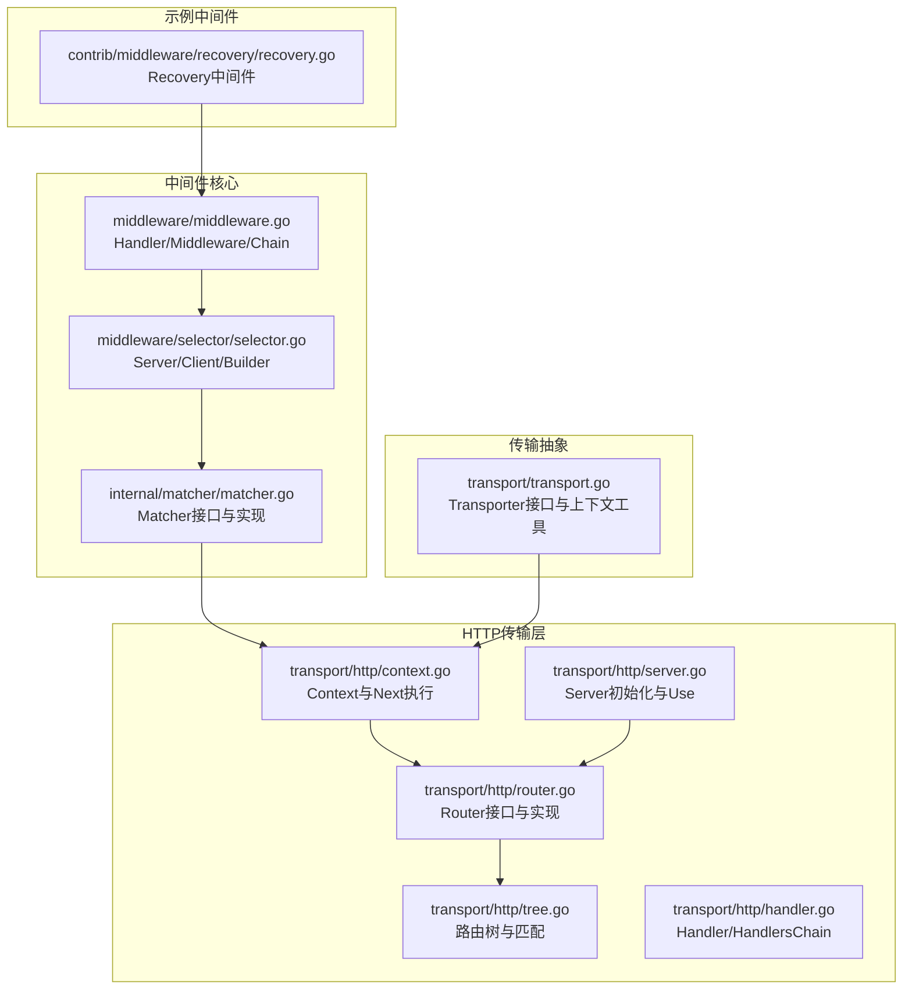
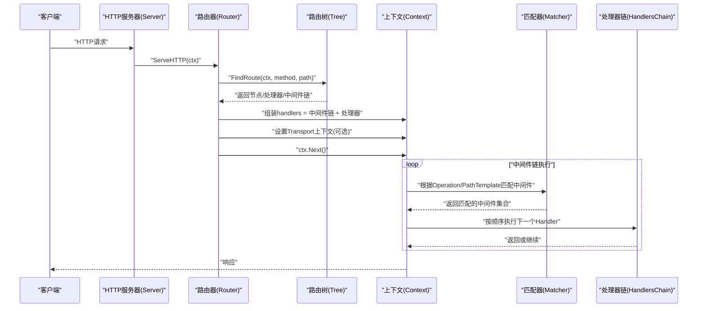
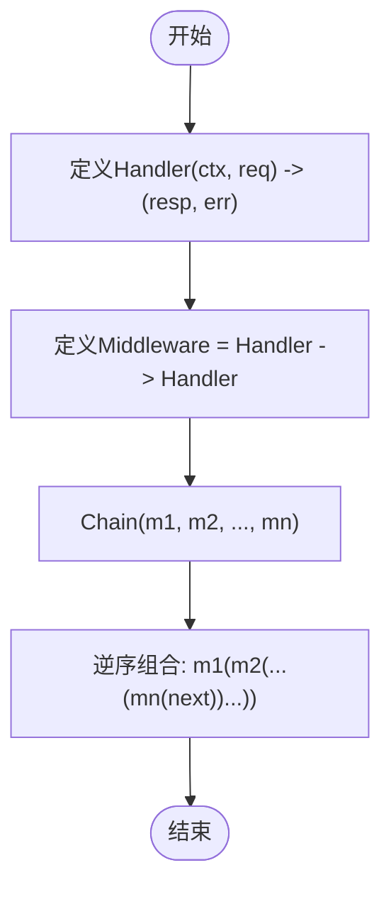
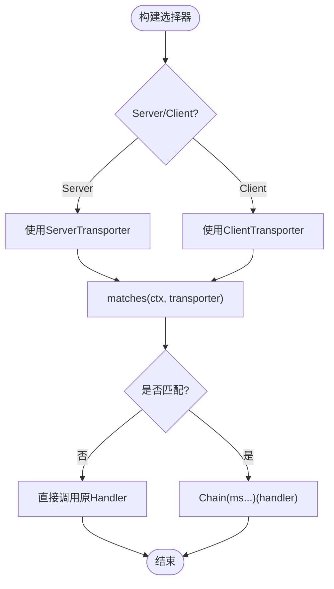
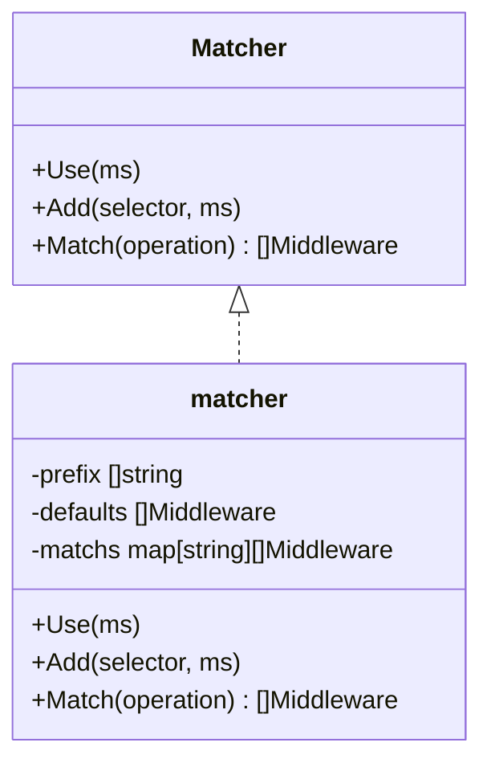
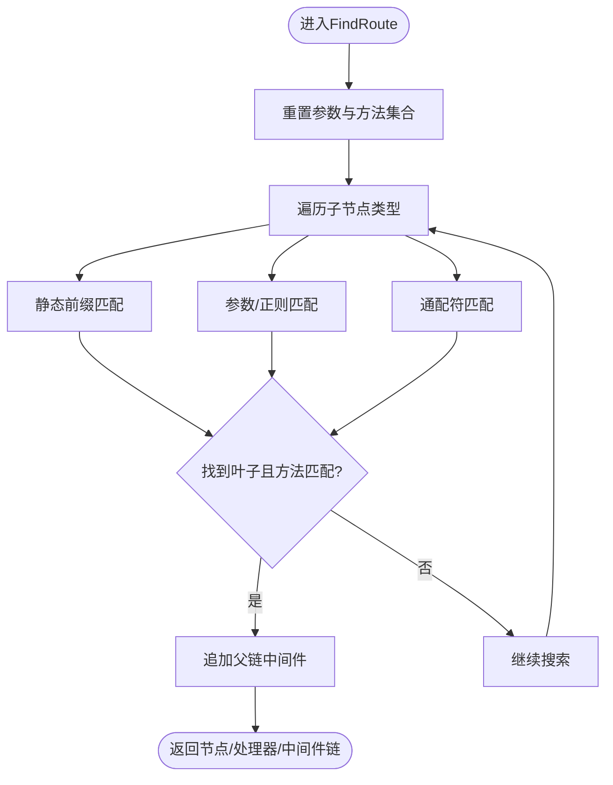
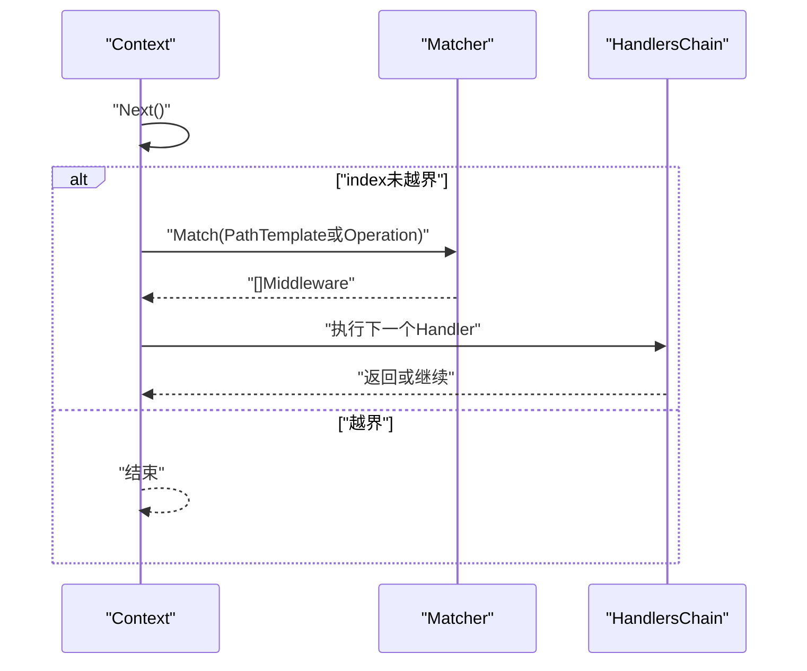

# 中间件系统

<cite>
**本文引用的文件列表**
- [middleware.go](file://middleware/middleware.go)
- [selector.go](file://middleware/selector/selector.go)
- [router.go](file://transport/http/router.go)
- [tree.go](file://transport/http/tree.go)
- [context.go](file://transport/http/context.go)
- [handler.go](file://transport/http/handler.go)
- [transport.go](file://transport/transport.go)
- [matcher.go](file://internal/matcher/matcher.go)
- [server.go](file://transport/http/server.go)
- [recovery.go](file://contrib/middleware/recovery/recovery.go)
</cite>

## 目录
1. [简介](#简介)
2. [项目结构](#项目结构)
3. [核心组件](#核心组件)
4. [架构总览](#架构总览)
5. [组件详解](#组件详解)
6. [依赖关系分析](#依赖关系分析)
7. [性能考量](#性能考量)
8. [故障排查指南](#故障排查指南)
9. [结论](#结论)
10. [附录：常见中间件示例与最佳实践](#附录常见中间件示例与最佳实践)

## 简介
本文件面向Go Fox中间件系统的使用者与贡献者，系统化阐述中间件框架的设计思想、执行机制、选择器中间件的条件匹配策略、路由匹配与参数提取、以及自定义中间件的开发方法。文档同时提供架构图、序列图、流程图与依赖关系图，帮助读者从高层到代码级全面理解中间件链的构建与调用流程，并给出性能优化与最佳实践建议。

## 项目结构
中间件系统主要由以下模块构成：
- 中间件核心：定义Handler与Middleware类型、链式组合函数
- 选择器中间件：按前缀/正则/路径/自定义函数动态选择性应用中间件
- HTTP传输层：路由树、上下文、处理器链、服务器集成
- 匹配器：根据操作名（或路径模板）匹配中间件集合
- 示例中间件：恢复中间件等

图表来源
- [middleware.go](file://middleware/middleware.go#L28-L66)
- [selector.go](file://middleware/selector/selector.go#L27-L82)
- [matcher.go](file://internal/matcher/matcher.go#L33-L88)
- [router.go](file://transport/http/router.go#L41-L128)
- [tree.go](file://transport/http/tree.go#L33-L234)
- [context.go](file://transport/http/context.go#L59-L150)
- [handler.go](file://transport/http/handler.go#L26-L38)
- [server.go](file://transport/http/server.go#L53-L133)
- [transport.go](file://transport/transport.go#L64-L113)
- [recovery.go](file://contrib/middleware/recovery/recovery.go#L53-L79)

章节来源
- [middleware.go](file://middleware/middleware.go#L28-L66)
- [selector.go](file://middleware/selector/selector.go#L27-L144)
- [matcher.go](file://internal/matcher/matcher.go#L33-L88)
- [router.go](file://transport/http/router.go#L41-L128)
- [tree.go](file://transport/http/tree.go#L33-L234)
- [context.go](file://transport/http/context.go#L59-L150)
- [handler.go](file://transport/http/handler.go#L26-L38)
- [server.go](file://transport/http/server.go#L53-L133)
- [transport.go](file://transport/transport.go#L64-L113)
- [recovery.go](file://contrib/middleware/recovery/recovery.go#L53-L79)

## 核心组件
- Handler与Middleware
  - Handler：接收上下文与请求对象，返回响应与错误
  - Middleware：对Handler进行包装，形成洋葱模型
  - Chain：将多个中间件逆序组合为单一中间件
- 选择器中间件
  - Builder支持Server/Client两种场景
  - 支持前缀、正则、路径、自定义Match函数
  - 基于Transporter提供的Operation或路径模板进行匹配
- 匹配器Matcher
  - 默认中间件集合与精确/前缀映射
  - 按操作名（或路径模板）返回匹配的中间件链
- HTTP路由与上下文
  - 路由树支持静态、参数、正则、通配符节点
  - Context维护handlers链、索引、参数、路径模板等
  - Next顺序执行handlers链

章节来源
- [middleware.go](file://middleware/middleware.go#L28-L66)
- [selector.go](file://middleware/selector/selector.go#L27-L144)
- [matcher.go](file://internal/matcher/matcher.go#L33-L88)
- [router.go](file://transport/http/router.go#L41-L128)
- [tree.go](file://transport/http/tree.go#L33-L234)
- [context.go](file://transport/http/context.go#L59-L150)
- [handler.go](file://transport/http/handler.go#L26-L38)

## 架构总览
下图展示从请求进入HTTP服务器到路由匹配、中间件链执行、处理器调用的整体流程。

图表来源
- [server.go](file://transport/http/server.go#L101-L133)
- [router.go](file://transport/http/router.go#L79-L128)
- [tree.go](file://transport/http/tree.go#L200-L234)
- [context.go](file://transport/http/context.go#L118-L150)
- [matcher.go](file://internal/matcher/matcher.go#L74-L88)

## 组件详解

### 中间件核心：Handler、Middleware与Chain
- Handler签名统一，便于在不同传输层复用
- Middleware采用函数式包装，形成洋葱模型
- Chain逆序组合，保证先声明的中间件在外层，后声明的在内层

图表来源
- [middleware.go](file://middleware/middleware.go#L28-L66)

章节来源
- [middleware.go](file://middleware/middleware.go#L28-L66)

### 选择器中间件：按条件选择性应用中间件
- Builder支持Server/Client两类场景
- 支持前缀、正则、路径、自定义Match函数
- 匹配成功时，将目标中间件链包裹在当前Handler外层；否则直接透传

图表来源
- [selector.go](file://middleware/selector/selector.go#L27-L144)

章节来源
- [selector.go](file://middleware/selector/selector.go#L27-L144)

### 匹配器：基于操作名/路径模板的中间件选择
- 默认中间件集合与精确匹配
- 前缀匹配优先级高于默认集合
- 返回合并后的中间件数组供链式组合

图表来源
- [matcher.go](file://internal/matcher/matcher.go#L33-L88)

章节来源
- [matcher.go](file://internal/matcher/matcher.go#L33-L88)

### HTTP路由与参数提取：树形结构与路径模板
- 路由树支持静态、参数、正则、通配符节点
- 匹配过程中提取路径参数并注入上下文
- 记录路由模式与路径模板，用于中间件匹配

图表来源
- [tree.go](file://transport/http/tree.go#L200-L353)

章节来源
- [tree.go](file://transport/http/tree.go#L33-L234)
- [router.go](file://transport/http/router.go#L79-L128)

### 上下文与中间件链执行：Next与Transport上下文
- Context维护handlers链与index，Next顺序执行
- Middleware方法根据Transport上下文或路径模板匹配中间件
- 支持挂载子路由的中间件叠加

图表来源
- [context.go](file://transport/http/context.go#L118-L150)
- [matcher.go](file://internal/matcher/matcher.go#L74-L88)

章节来源
- [context.go](file://transport/http/context.go#L59-L150)
- [matcher.go](file://internal/matcher/matcher.go#L33-L88)

### 传输抽象：Transporter与上下文工具
- Transporter提供Kind、RemoteAddr、Endpoint、Operation、Header等能力
- 提供FromServerContext/FromClientContext等工具函数
- 为选择器中间件提供Operation字符串，作为匹配依据

章节来源
- [transport.go](file://transport/transport.go#L64-L113)

## 依赖关系分析
- 中间件核心依赖匹配器以实现按操作名/路径模板选择中间件
- 选择器中间件依赖Transporter与匹配器
- HTTP路由与上下文依赖匹配器与传输抽象
- 服务器初始化阶段将HTTP中间件注册到路由器

图表来源
- [middleware.go](file://middleware/middleware.go#L28-L66)
- [selector.go](file://middleware/selector/selector.go#L27-L82)
- [matcher.go](file://internal/matcher/matcher.go#L33-L88)
- [context.go](file://transport/http/context.go#L59-L150)
- [router.go](file://transport/http/router.go#L41-L128)
- [tree.go](file://transport/http/tree.go#L33-L234)
- [server.go](file://transport/http/server.go#L53-L133)
- [transport.go](file://transport/transport.go#L64-L113)

章节来源
- [middleware.go](file://middleware/middleware.go#L28-L66)
- [selector.go](file://middleware/selector/selector.go#L27-L144)
- [matcher.go](file://internal/matcher/matcher.go#L33-L88)
- [context.go](file://transport/http/context.go#L59-L150)
- [router.go](file://transport/http/router.go#L41-L128)
- [tree.go](file://transport/http/tree.go#L33-L234)
- [server.go](file://transport/http/server.go#L53-L133)
- [transport.go](file://transport/transport.go#L64-L113)

## 性能考量
- 路由树匹配
  - 使用静态/参数/正则/通配符节点的有序存储与二分查找，减少不必要分支
  - 参数提取避免跨段匹配，降低回溯成本
- 中间件链
  - Chain逆序组合，仅在入口处做一次组合，后续执行为线性调用
  - 选择器中间件仅在匹配成功时包裹链路，避免不必要的包装
- 上下文池化
  - Context通过对象池复用，减少GC压力
- 编解码与绑定
  - 绑定过程按需解析查询、表单、变量与请求体，避免重复解析

章节来源
- [tree.go](file://transport/http/tree.go#L617-L656)
- [context.go](file://transport/http/context.go#L53-L100)
- [router.go](file://transport/http/router.go#L176-L236)

## 故障排查指南
- 404/405错误
  - 路由未匹配或方法不支持：路由层会返回相应状态码
- 中间件未生效
  - 检查选择器匹配条件（前缀/正则/路径/自定义）
  - 确认Transport上下文中的Operation或路径模板是否正确
- Panic导致的异常
  - 使用恢复中间件捕获panic并记录堆栈
- 请求超时/头部过大
  - 服务器层对底层错误进行分类并转换为标准错误

章节来源
- [router.go](file://transport/http/router.go#L96-L103)
- [recovery.go](file://contrib/middleware/recovery/recovery.go#L53-L79)
- [server.go](file://transport/http/server.go#L135-L174)

## 结论
Go Fox中间件系统通过Handler/Middleware抽象、选择器中间件与匹配器的结合，实现了灵活而高效的中间件链构建与执行。路由树采用多节点类型与参数提取机制，确保高性能与高可用。配合上下文与传输抽象，系统在HTTP与gRPC等传输层均可复用中间件能力。建议在实际项目中遵循“先声明外层、后声明内层”的设计原则，合理使用选择器中间件与匹配器，以获得清晰的控制流与良好的性能表现。

## 附录：常见中间件示例与最佳实践

### 自定义中间件开发步骤
- 定义中间件函数：接收Handler并返回新的Handler
- 在合适的位置包裹：通常在路由注册或服务器初始化阶段
- 错误处理：将错误转换为可识别的状态码或统一错误格式
- 参数传递：通过上下文或Transporter携带运行时信息

章节来源
- [middleware.go](file://middleware/middleware.go#L28-L66)
- [context.go](file://transport/http/context.go#L118-L150)

### 常见中间件示例
- 日志中间件
  - 记录请求方法、路径、耗时、状态码
  - 可结合上下文中的路径模板进行结构化输出
- 身份认证中间件
  - 从请求头或上下文中提取令牌，校验有效性
  - 将用户信息写入上下文，供后续处理器使用
- CORS中间件
  - 设置允许的源、方法、头与凭据
  - 对预检请求快速返回
- 恢复中间件
  - 捕获panic，记录堆栈，返回统一错误响应

章节来源
- [recovery.go](file://contrib/middleware/recovery/recovery.go#L53-L79)

### 最佳实践
- 中间件顺序
  - 先全局再局部，先通用后专用
  - 将昂贵操作置于内层，尽早短路失败路径
- 选择器中间件
  - 使用前缀匹配快速过滤无关路径
  - 正则表达式应简洁明确，避免回溯风暴
- 路由设计
  - 合理拆分路径段，避免过深嵌套
  - 参数命名唯一，避免冲突
- 性能优化
  - 复用编解码器与绑定器
  - 减少反射与字符串拼接
  - 合理使用上下文池化与对象池