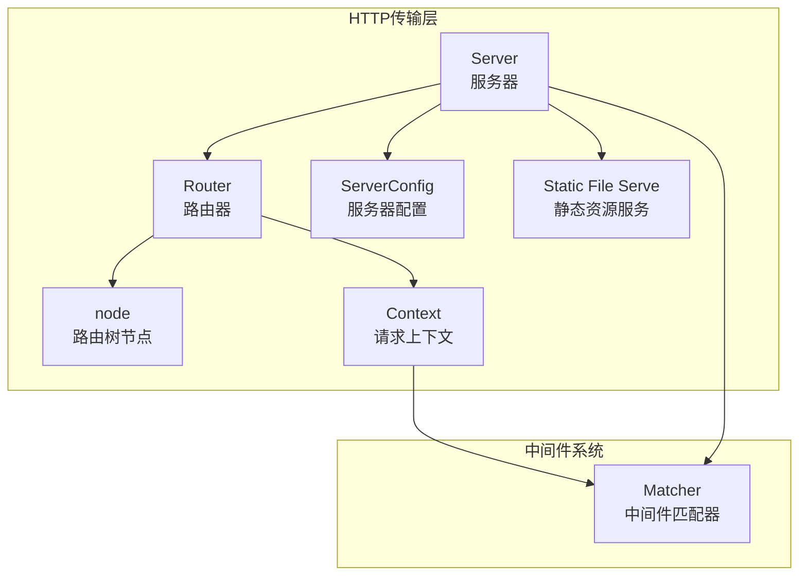
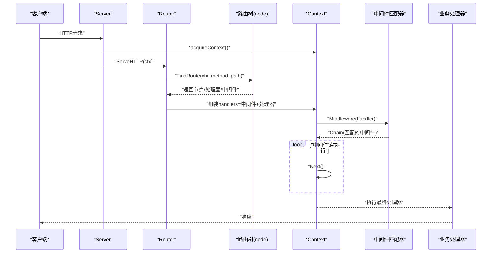
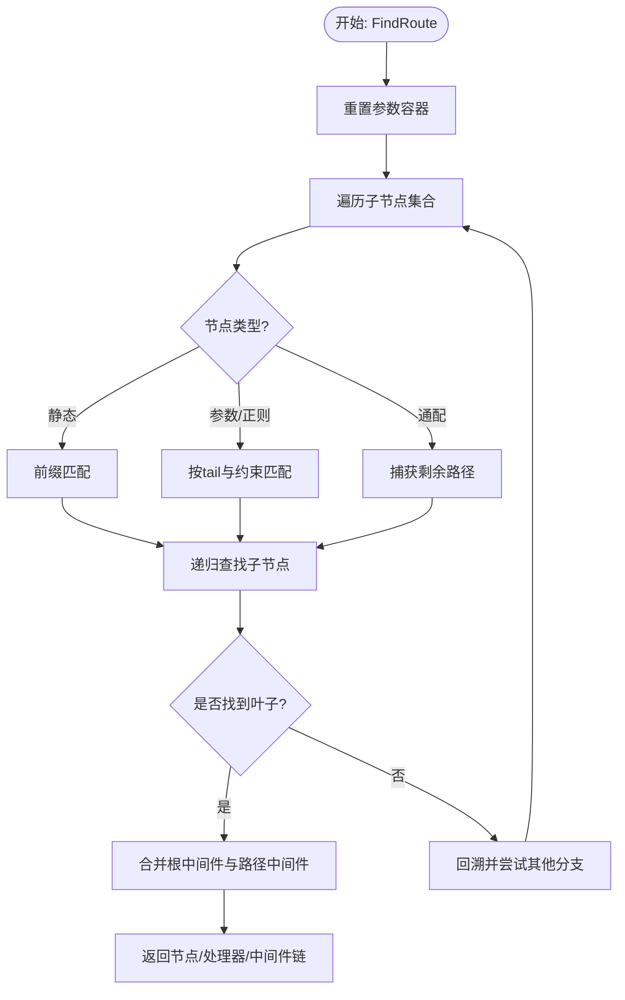
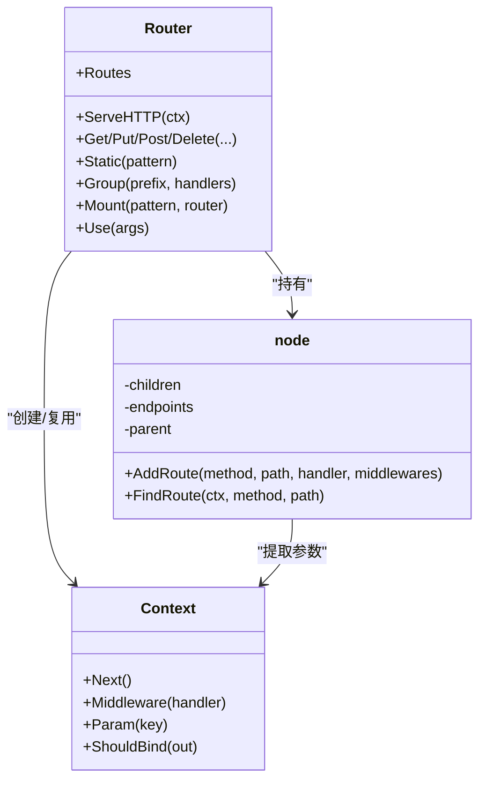
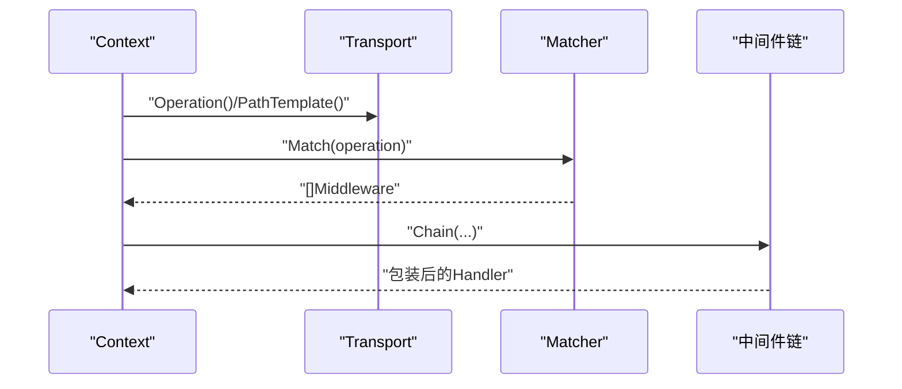
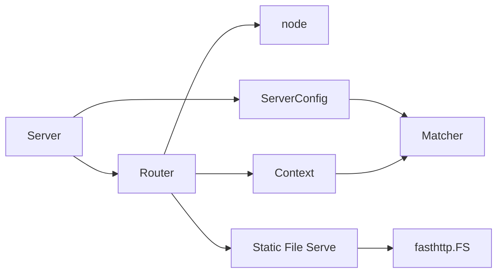

# 路由匹配机制

<cite>
**本文引用的文件**
- [transport/http/router.go](file://transport/http/router.go)
- [transport/http/tree.go](file://transport/http/tree.go)
- [transport/http/context.go](file://transport/http/context.go)
- [transport/http/server.go](file://transport/http/server.go)
- [transport/http/handler.go](file://transport/http/handler.go)
- [transport/http/static.go](file://transport/http/static.go)
- [transport/http/serveroptions.go](file://transport/http/serveroptions.go)
- [transport/http/fsoptions.go](file://transport/http/fsoptions.go)
- [internal/matcher/matcher.go](file://internal/matcher/matcher.go)
- [transport/http/router_test.go](file://transport/http/router_test.go)
- [transport/http/tree_test.go](file://transport/http/tree_test.go)
</cite>

## 目录
1. [简介](#简介)
2. [项目结构](#项目结构)
3. [核心组件](#核心组件)
4. [架构总览](#架构总览)
5. [详细组件分析](#详细组件分析)
6. [依赖关系分析](#依赖关系分析)
7. [性能考量](#性能考量)
8. [故障排查指南](#故障排查指南)
9. [结论](#结论)
10. [附录](#附录)

## 简介
本文件面向Go Fox的HTTP路由系统，系统性解析其路由树构建与查找算法、URL模式匹配规则（静态路由、动态参数路由、正则路由、通配符路由）、路由参数提取与处理、处理器绑定流程、路由配置示例、性能优化策略以及与中间件系统的集成方式。文档以代码级细节为基础，辅以图示帮助读者快速理解从请求进入、路由匹配、参数提取、中间件链路到最终处理器执行的完整流程。

## 项目结构
Go Fox的HTTP路由位于transport/http目录下，核心文件包括：
- 路由器与服务器：router.go、server.go
- 路由树与节点：tree.go
- 请求上下文：context.go
- 处理器与链路：handler.go
- 静态资源：static.go
- 服务器配置：serveroptions.go、fsoptions.go
- 中间件匹配器：internal/matcher/matcher.go
- 测试用例：router_test.go、tree_test.go

图表来源
- [transport/http/server.go](file://transport/http/server.go#L54-L133)
- [transport/http/router.go](file://transport/http/router.go#L70-L128)
- [transport/http/tree.go](file://transport/http/tree.go#L36-L68)
- [transport/http/context.go](file://transport/http/context.go#L60-L100)
- [transport/http/serveroptions.go](file://transport/http/serveroptions.go#L38-L77)
- [transport/http/static.go](file://transport/http/static.go#L40-L168)
- [internal/matcher/matcher.go](file://internal/matcher/matcher.go#L33-L89)

章节来源
- [transport/http/server.go](file://transport/http/server.go#L54-L133)
- [transport/http/router.go](file://transport/http/router.go#L41-L128)
- [transport/http/tree.go](file://transport/http/tree.go#L36-L68)
- [transport/http/context.go](file://transport/http/context.go#L60-L100)
- [transport/http/serveroptions.go](file://transport/http/serveroptions.go#L38-L77)
- [transport/http/static.go](file://transport/http/static.go#L40-L168)
- [internal/matcher/matcher.go](file://internal/matcher/matcher.go#L33-L89)

## 核心组件
- 路由接口与路由器实现：Router接口定义了路由注册、分组、挂载、静态资源等能力；router结构体承载路由树、中间件栈、父/子关系等。
- 路由树节点：node结构体采用多叉分支存储静态段、参数段、正则段、通配段，支持按标签二分查找与尾部排序，确保遍历顺序可控。
- 上下文Context：封装fasthttp上下文、请求方法、路由参数、中间件匹配器、路径模板等，负责中间件链执行与响应编码。
- 服务器Server：基于fasthttp封装，初始化路由树、设置错误处理、启动监听、挂载中间件。
- 中间件匹配器Matcher：根据操作名或路径前缀选择性应用中间件链。
- 静态资源服务：基于fasthttp.FS实现，支持缓存控制、压缩、字节范围、下载等选项。

章节来源
- [transport/http/router.go](file://transport/http/router.go#L41-L128)
- [transport/http/tree.go](file://transport/http/tree.go#L36-L68)
- [transport/http/context.go](file://transport/http/context.go#L60-L100)
- [transport/http/server.go](file://transport/http/server.go#L54-L133)
- [internal/matcher/matcher.go](file://internal/matcher/matcher.go#L33-L89)
- [transport/http/static.go](file://transport/http/static.go#L40-L168)

## 架构总览
请求生命周期概览：
- Server接收请求，创建/复用Context
- Router根据方法映射到methodType，调用路由树查找
- 路由树按节点类型优先匹配，动态参数/正则/通配符按约束提取参数
- 合并根中间件与路径中间件，形成HandlersChain
- Context.Next()依次执行中间件与最终Handler
- 中间件通过Matcher按操作名或路径前缀选择

图表来源
- [transport/http/server.go](file://transport/http/server.go#L101-L133)
- [transport/http/router.go](file://transport/http/router.go#L79-L128)
- [transport/http/tree.go](file://transport/http/tree.go#L200-L234)
- [transport/http/context.go](file://transport/http/context.go#L118-L150)
- [internal/matcher/matcher.go](file://internal/matcher/matcher.go#L74-L88)

## 详细组件分析

### 路由树与查找算法
- 节点类型与边集
  - 静态段(ntStatic)：普通路径段
  - 参数段(ntParam)：形如{key}或{key:regexp}
  - 正则段(ntRegexp)：形如{key:regexp}，内部编译正则表达式
  - 通配段(ntCatchAll)：形如*
  - 子路由(subroutes)：挂载其他Router实例
- 边与标签
  - 每个节点记录label(首字符)、tail(尾字符)、prefix(公共前缀)
  - 子节点数组按label排序，通配段尾部排序至末尾，保证遍历顺序
- 插入算法
  - AddRoute递归查找插入位置，若公共前缀不等于当前节点prefix则分裂节点
  - 对于含参数/正则/通配的前缀，先建立参数节点，再追加静态后缀
  - 重复注册同模式时，最新注册覆盖旧处理器
- 查找算法
  - FindRoute重置参数容器，从根开始按children遍历
  - 静态段按前缀匹配；参数/正则段按tail与正则约束匹配，避免跨段匹配
  - 通配段捕获剩余路径，作为最后一个参数
  - 收集路径上的中间件链，合并根中间件与节点中间件
  - 若仅找到路径但不支持该方法，标记methodNotAllowed并收集允许的方法列表

图表来源
- [transport/http/tree.go](file://transport/http/tree.go#L200-L353)
- [transport/http/tree.go](file://transport/http/tree.go#L430-L513)
- [transport/http/tree.go](file://transport/http/tree.go#L533-L603)

章节来源
- [transport/http/tree.go](file://transport/http/tree.go#L36-L68)
- [transport/http/tree.go](file://transport/http/tree.go#L119-L198)
- [transport/http/tree.go](file://transport/http/tree.go#L200-L353)
- [transport/http/tree.go](file://transport/http/tree.go#L430-L513)
- [transport/http/tree.go](file://transport/http/tree.go#L533-L603)

### URL模式匹配规则
- 静态路由：直接按路径段匹配，要求完全一致
- 动态参数路由：形如{id}或{user:regexp}，按tail与可选正则约束提取
- 通配符路由：形如*，捕获剩余路径作为最后一个参数
- 路径段边界：参数/正则匹配避免跨路径段，确保{id}/sub与{id//sub}的区别
- 重复注册：后注册覆盖先注册的处理器
- 错误处理：未找到处理器返回404；方法不被支持返回405

章节来源
- [transport/http/tree.go](file://transport/http/tree.go#L255-L350)
- [transport/http/tree.go](file://transport/http/tree.go#L533-L603)
- [transport/http/router.go](file://transport/http/router.go#L95-L128)

### 路由参数提取与处理
- 参数容器：Context维护routeParams与urlParams两套键值对，分别记录路由阶段与URL阶段参数
- 提取逻辑：在参数/正则节点匹配成功时，将匹配片段压入values；通配段捕获剩余路径
- 合并策略：最终将routeParams合并到urlParams，形成最终参数集合
- 类型转换与验证：参数提取为字符串，具体类型转换与校验由绑定器完成（见绑定章节）

章节来源
- [transport/http/context.go](file://transport/http/context.go#L60-L116)
- [transport/http/context.go](file://transport/http/context.go#L244-L253)
- [transport/http/tree.go](file://transport/http/tree.go#L288-L314)

### 处理器绑定与调用
- 绑定流程：router.handler将中间件与处理器写入节点端点表，支持ALL与STUB标记
- 调用链路：Router.ServeHTTP组装handlers，Context.Next()逐个执行
- 中间件链：根中间件与路径中间件合并，按父节点链向上累加

图表来源
- [transport/http/router.go](file://transport/http/router.go#L41-L128)
- [transport/http/tree.go](file://transport/http/tree.go#L36-L68)
- [transport/http/context.go](file://transport/http/context.go#L118-L150)

章节来源
- [transport/http/router.go](file://transport/http/router.go#L421-L427)
- [transport/http/router.go](file://transport/http/router.go#L79-L128)
- [transport/http/context.go](file://transport/http/context.go#L118-L150)

### 中间件系统集成
- 中间件匹配器：根据操作名或路径前缀选择中间件，支持默认中间件与前缀排序
- 服务器配置：ServerConfig中包含中间件匹配器，Server.Use支持按选择器挂载
- 执行时机：Context.Middleware在处理器执行前，按操作名或路径模板匹配中间件链

图表来源
- [transport/http/context.go](file://transport/http/context.go#L137-L150)
- [internal/matcher/matcher.go](file://internal/matcher/matcher.go#L74-L88)
- [transport/http/serveroptions.go](file://transport/http/serveroptions.go#L58-L76)

章节来源
- [internal/matcher/matcher.go](file://internal/matcher/matcher.go#L33-L89)
- [transport/http/serveroptions.go](file://transport/http/serveroptions.go#L58-L76)
- [transport/http/context.go](file://transport/http/context.go#L137-L150)

### 静态资源路由
- 注册方式：Static(pattern)自动注册HEAD与GET处理器
- 实现机制：fileServe基于fasthttp.FS，支持缓存控制、压缩、字节范围、下载、目录浏览等
- 路径重写：PathRewrite根据前缀裁剪实际访问路径，支持根为文件的情况

章节来源
- [transport/http/router.go](file://transport/http/router.go#L342-L348)
- [transport/http/static.go](file://transport/http/static.go#L40-L168)
- [transport/http/fsoptions.go](file://transport/http/fsoptions.go#L33-L100)

### 路由配置示例
- 基础RESTful路由：在Group下注册GET/POST/PUT/DELETE等方法
- 分组与中间件：Group(prefix, handlers...)为子路由注入中间件
- 子路由挂载：Mount(pattern, router)将另一个Router挂载到指定路径
- 静态资源：Static("/files/*", FSRootPath("./static"))提供静态文件服务
- 示例参考测试用例：包含分组、挂载、静态资源与参数提取的组合场景

章节来源
- [transport/http/router_test.go](file://transport/http/router_test.go#L33-L96)
- [transport/http/router.go](file://transport/http/router.go#L243-L271)
- [transport/http/router.go](file://transport/http/router.go#L350-L410)

## 依赖关系分析
- 路由树依赖fasthttp进行底层网络处理
- 中间件匹配器与ServerConfig耦合，Server.Use支持按选择器挂载
- Context与中间件匹配器交互，按操作名或路径模板生成中间件链
- 静态资源服务依赖fasthttp.FS，支持多种文件系统接口

图表来源
- [transport/http/router.go](file://transport/http/router.go#L70-L128)
- [transport/http/server.go](file://transport/http/server.go#L54-L133)
- [transport/http/serveroptions.go](file://transport/http/serveroptions.go#L38-L77)
- [transport/http/static.go](file://transport/http/static.go#L40-L168)

章节来源
- [transport/http/router.go](file://transport/http/router.go#L70-L128)
- [transport/http/server.go](file://transport/http/server.go#L54-L133)
- [transport/http/serveroptions.go](file://transport/http/serveroptions.go#L38-L77)
- [transport/http/static.go](file://transport/http/static.go#L40-L168)

## 性能考量
- 路由树构建
  - 静态前缀共享：通过公共前缀分裂节点，减少重复存储
  - 子节点排序：按label排序，二分查找定位子节点，降低查找复杂度
  - 尾部排序：通配段尾部排序至末尾，避免过早匹配导致的回溯
- 路由查找
  - 优先静态段匹配，减少参数/正则匹配次数
  - 通配段最后尝试，避免阻塞更精确的匹配
  - 参数/正则匹配时限制跨段，减少无效尝试
- 中间件链
  - 中间件按操作名或路径模板匹配，避免不必要的链路拼接
  - 默认中间件与前缀中间件分离，减少每次匹配成本
- 静态资源
  - fasthttp.FS内置缓存与压缩，支持字节范围请求，减少带宽占用
  - 缓存控制头按配置设置，提升浏览器缓存命中率

章节来源
- [transport/http/tree.go](file://transport/http/tree.go#L617-L656)
- [transport/http/tree.go](file://transport/http/tree.go#L762-L776)
- [transport/http/static.go](file://transport/http/static.go#L78-L130)
- [internal/matcher/matcher.go](file://internal/matcher/matcher.go#L60-L88)

## 故障排查指南
- 方法不被支持
  - 现象：返回405，同时收集允许的方法列表
  - 排查：确认路由是否注册了对应方法，或是否被其他中间件拦截
- 未找到处理器
  - 现象：返回404
  - 排查：检查路由树是否正确构建，是否存在重复注册覆盖
- 参数提取异常
  - 现象：参数为空或类型不符
  - 排查：确认参数段定义与请求路径一致，必要时使用正则约束
- 中间件未生效
  - 现象：中间件未执行
  - 排查：确认ServerConfig中中间件匹配器配置，选择器是否匹配操作名或路径模板
- 静态资源问题
  - 现象：404或缓存异常
  - 排查：确认FSRootPath、缓存控制、压缩与字节范围配置

章节来源
- [transport/http/router.go](file://transport/http/router.go#L95-L128)
- [transport/http/context.go](file://transport/http/context.go#L137-L150)
- [transport/http/static.go](file://transport/http/static.go#L131-L168)

## 结论
Go Fox的路由系统以高效、可扩展为核心目标：通过多叉路由树实现O(logN)级别的路径匹配，结合参数/正则/通配符的灵活模式，满足RESTful与静态资源等多样化需求；通过中间件匹配器与上下文链路，实现按操作名或路径模板的精准中间件装配；配合fasthttp.FS与缓存/压缩等特性，兼顾性能与易用性。建议在高并发场景下充分利用参数/正则约束与静态段优先匹配策略，合理组织路由分组与中间件选择器，以获得最佳性能与可维护性。

## 附录
- 绑定与参数处理：Context.ShouldBind整合变量、查询、表单与请求体绑定，支持自定义解码器
- 测试用例：router_test.go与tree_test.go提供了典型路由注册、参数提取与挂载场景的验证

章节来源
- [transport/http/context.go](file://transport/http/context.go#L168-L204)
- [transport/http/router_test.go](file://transport/http/router_test.go#L33-L96)
- [transport/http/tree_test.go](file://transport/http/tree_test.go#L10-L96)