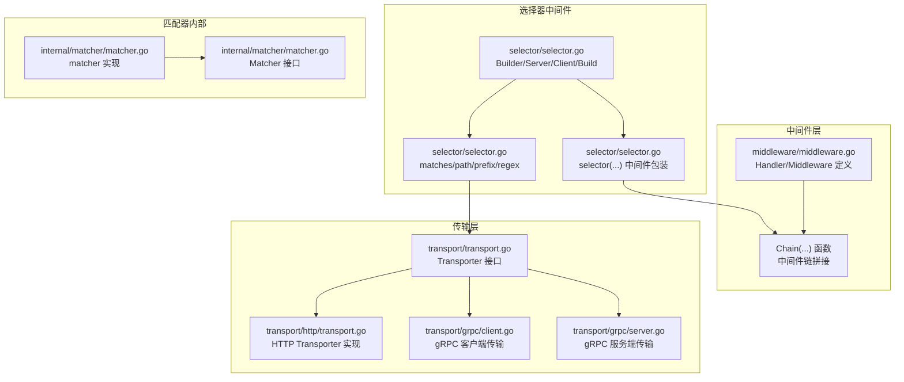
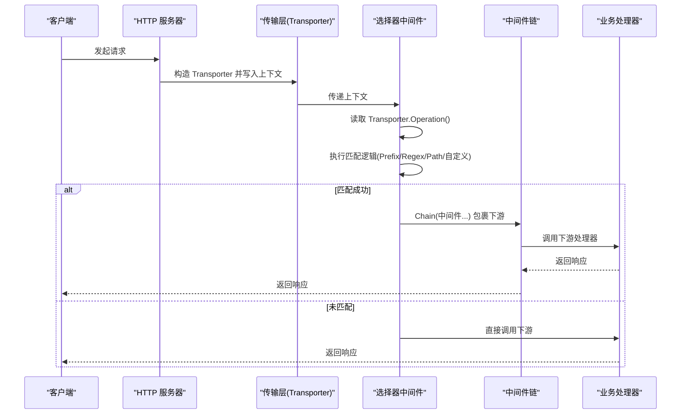
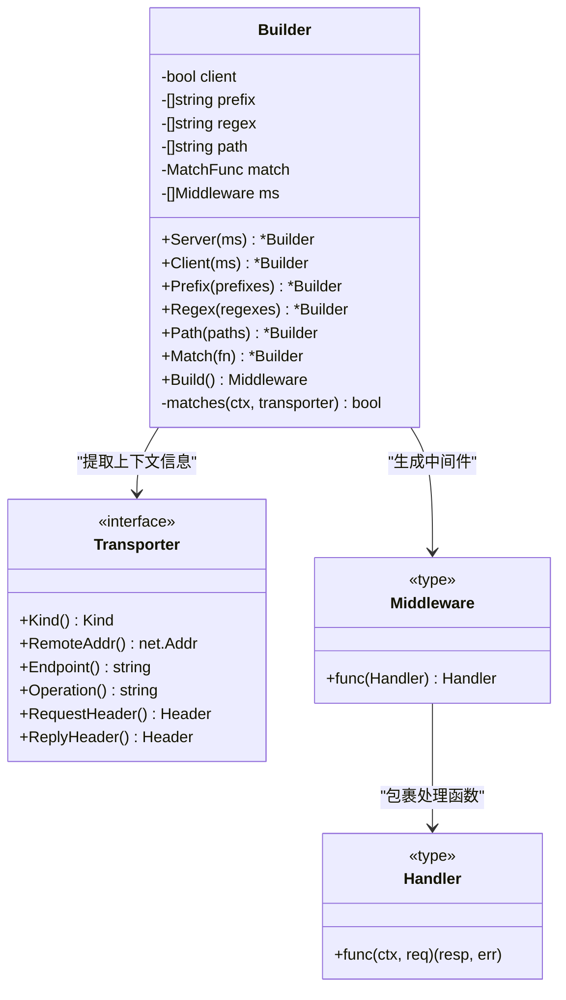
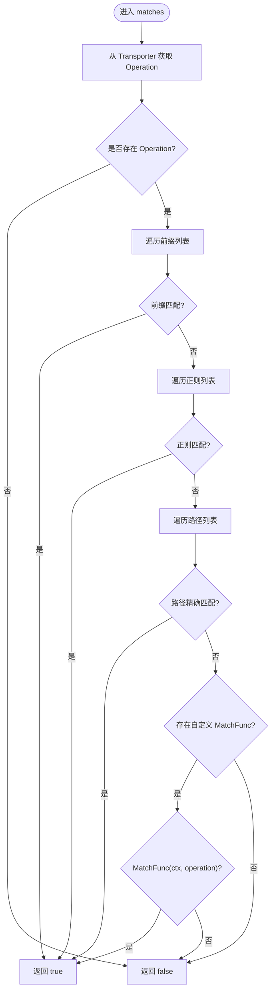
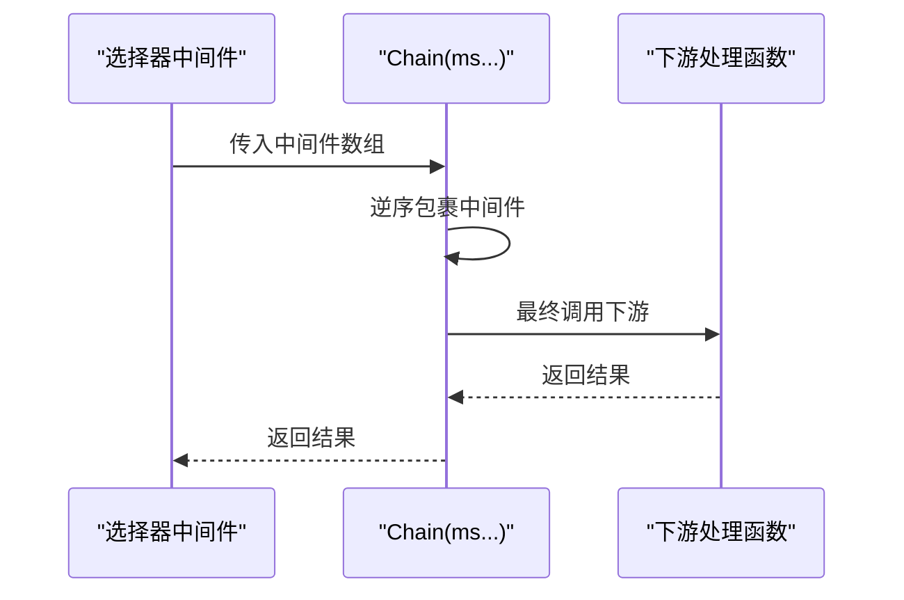
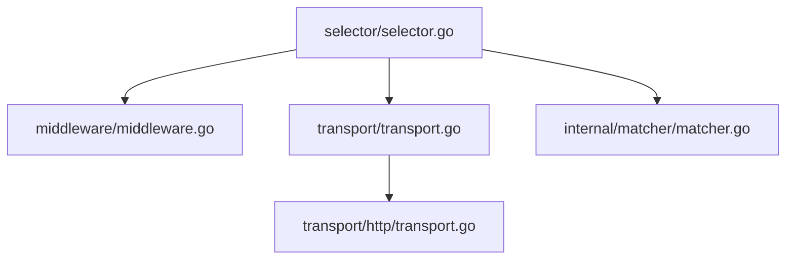

# 选择器中间件

<cite>
**本文档引用的文件**
- [middleware/selector/selector.go](file://middleware/selector/selector.go)
- [middleware/middleware.go](file://middleware/middleware.go)
- [transport/transport.go](file://transport/transport.go)
- [transport/http/transport.go](file://transport/http/transport.go)
- [transport/grpc/client.go](file://transport/grpc/client.go)
- [transport/grpc/server.go](file://transport/grpc/server.go)
- [internal/matcher/matcher.go](file://internal/matcher/matcher.go)
- [transport/http/server.go](file://transport/http/server.go)
- [transport/http/serveroptions.go](file://transport/http/serveroptions.go)
</cite>

## 目录
1. [简介](#简介)
2. [项目结构](#项目结构)
3. [核心组件](#核心组件)
4. [架构总览](#架构总览)
5. [详细组件分析](#详细组件分析)
6. [依赖关系分析](#依赖关系分析)
7. [性能考虑](#性能考虑)
8. [故障排查指南](#故障排查指南)
9. [结论](#结论)
10. [附录](#附录)

## 简介
本技术文档围绕 Go Fox 的选择器中间件展开，系统性阐述其工作原理、设计模式与使用方式。选择器中间件的核心目标是：基于运行时上下文中的传输信息（如操作名、路径、前缀、正则表达式）对中间件进行条件性应用，从而实现“按需”中间件装配，提升系统的灵活性与可维护性。文档将重点解析以下内容：
- 选择器中间件的控制流与匹配机制
- Selector 接口与 Builder 模式的实现细节
- 常见匹配类型：路径匹配、前缀匹配、正则匹配、自定义匹配
- 在中间件链中的位置与协作关系
- 配置语法与参数设置
- 实际使用示例与最佳实践

## 项目结构
选择器中间件位于 middleware/selector 子目录中，配合通用中间件框架 middleware/middleware.go 与传输层 transport 提供的 Transporter 接口共同工作。下图展示了与选择器中间件直接相关的模块关系：

图表来源
- [middleware/selector/selector.go](file://middleware/selector/selector.go#L1-L144)
- [middleware/middleware.go](file://middleware/middleware.go#L24-L67)
- [transport/transport.go](file://transport/transport.go#L64-L86)
- [transport/http/transport.go](file://transport/http/transport.go#L34-L67)
- [transport/grpc/client.go](file://transport/grpc/client.go#L1-L50)
- [transport/grpc/server.go](file://transport/grpc/server.go#L1-L50)
- [internal/matcher/matcher.go](file://internal/matcher/matcher.go#L33-L88)

章节来源
- [middleware/selector/selector.go](file://middleware/selector/selector.go#L1-L144)
- [middleware/middleware.go](file://middleware/middleware.go#L24-L67)
- [transport/transport.go](file://transport/transport.go#L64-L86)

## 核心组件
- Builder：用于构建选择器中间件，支持 Server/Client 两种模式，提供 Prefix、Regex、Path、Match 等匹配条件配置，并最终 Build 生成一个中间件实例。
- Transporter 抽象：通过上下文提取当前传输层信息（包含 Operation 字符串），作为匹配依据。
- 匹配算法：依次尝试前缀匹配、正则匹配、路径精确匹配，最后可选地执行自定义 MatchFunc。
- 中间件链：当匹配成功时，将目标中间件链拼接到原始处理流程之前；否则直接透传到下游。

章节来源
- [middleware/selector/selector.go](file://middleware/selector/selector.go#L27-L82)
- [middleware/selector/selector.go](file://middleware/selector/selector.go#L84-L115)
- [middleware/selector/selector.go](file://middleware/selector/selector.go#L117-L127)

## 架构总览
选择器中间件在请求生命周期中的位置如下：
- 在 HTTP/gRPC 传输层完成路由解析后，会将 Transporter 写入上下文
- 选择器中间件从上下文中读取 Transporter，提取 Operation 字符串
- 根据 Builder 配置的匹配规则进行判断
- 若匹配成功，则将一组中间件以链式方式包裹在下游处理函数之前；否则直接调用下游

图表来源
- [transport/transport.go](file://transport/transport.go#L93-L113)
- [middleware/selector/selector.go](file://middleware/selector/selector.go#L117-L127)
- [middleware/middleware.go](file://middleware/middleware.go#L54-L66)

## 详细组件分析

### 1) Selector 接口与 Builder 设计
- 接口职责：Selector 是一个中间件包装器，其核心在于根据条件决定是否应用一组中间件。
- Builder 模式：提供链式配置方法，支持 Server/Client 两种场景，分别从不同上下文提取 Transporter。
- 匹配集合：Builder 维护前缀、正则、路径三类预设匹配集，以及一个可选的自定义 MatchFunc。

图表来源
- [middleware/selector/selector.go](file://middleware/selector/selector.go#L27-L82)
- [transport/transport.go](file://transport/transport.go#L64-L86)
- [middleware/middleware.go](file://middleware/middleware.go#L28-L32)

章节来源
- [middleware/selector/selector.go](file://middleware/selector/selector.go#L27-L82)
- [transport/transport.go](file://transport/transport.go#L64-L86)
- [middleware/middleware.go](file://middleware/middleware.go#L28-L32)

### 2) 匹配机制与算法
- 匹配顺序：前缀匹配 -> 正则匹配 -> 路径精确匹配 -> 自定义 MatchFunc
- 前缀匹配：字符串前缀判断
- 正则匹配：编译正则表达式，若编译失败则视为不匹配
- 路径匹配：严格相等
- 自定义匹配：由用户提供的 MatchFunc(ctx, operation) 判断

图表来源
- [middleware/selector/selector.go](file://middleware/selector/selector.go#L84-L115)
- [middleware/selector/selector.go](file://middleware/selector/selector.go#L129-L143)

章节来源
- [middleware/selector/selector.go](file://middleware/selector/selector.go#L84-L115)
- [middleware/selector/selector.go](file://middleware/selector/selector.go#L129-L143)

### 3) 中间件链与执行顺序
- 当匹配成功时，选择器中间件通过 Chain(ms...) 将一组中间件按逆序包裹在下游处理函数之外，形成“外层先执行”的效果。
- 当未匹配时，直接透传到下游，不改变原有执行路径。

图表来源
- [middleware/selector/selector.go](file://middleware/selector/selector.go#L117-L127)
- [middleware/middleware.go](file://middleware/middleware.go#L54-L66)

章节来源
- [middleware/selector/selector.go](file://middleware/selector/selector.go#L117-L127)
- [middleware/middleware.go](file://middleware/middleware.go#L54-L66)

### 4) 常见选择器类型与使用场景
- 路径匹配(Path)：适用于精确路由匹配，例如针对某个具体方法或资源路径启用特定中间件。
- 前缀匹配(Prefix)：适用于按命名空间或服务前缀批量启用中间件，例如 /com.example.UserService/*。
- 正则匹配(Regex)：适用于复杂模式匹配，例如按版本号或方法名模式筛选。
- 自定义匹配(Match)：适用于需要结合上下文信息（如请求头、认证状态等）进行动态判断的场景。

章节来源
- [middleware/selector/selector.go](file://middleware/selector/selector.go#L49-L71)
- [middleware/selector/selector.go](file://middleware/selector/selector.go#L84-L115)

### 5) 配置语法与参数设置
- Server()/Client()：选择器中间件的入口，分别面向服务端与客户端上下文。
- Prefix()/Regex()/Path()：添加匹配条件。
- Match(fn)：注册自定义匹配函数。
- Build()：生成最终的中间件实例。

章节来源
- [middleware/selector/selector.go](file://middleware/selector/selector.go#L39-L82)

### 6) 在中间件链中的位置与协作关系
- 位置：通常置于更通用的中间件之后，以便优先对特定路由或请求类型应用差异化中间件。
- 协作：与传输层的 Transporter 密切相关，依赖 Operation 字符串进行匹配；与内部匹配器（internal/matcher）在概念上互补，但选择器中间件更偏向于运行时动态匹配。

章节来源
- [transport/transport.go](file://transport/transport.go#L74-L76)
- [internal/matcher/matcher.go](file://internal/matcher/matcher.go#L33-L38)

### 7) 实际使用示例（基于代码结构）
以下示例展示如何在 HTTP 服务器中使用选择器中间件，结合路由前缀进行差异化中间件装配（示例仅描述步骤，不包含具体代码内容）：
- 步骤一：定义一组中间件（如鉴权、限流、日志等）
- 步骤二：使用 Server(ms...).Prefix("/api").Build() 构建选择器中间件
- 步骤三：在 HTTP 服务器中注册该中间件，使其仅对 /api 前缀的路由生效
- 步骤四：对于其他路由，保持默认处理流程

章节来源
- [transport/http/server.go](file://transport/http/server.go#L159-L204)
- [transport/http/serveroptions.go](file://transport/http/serveroptions.go#L32-L77)
- [middleware/selector/selector.go](file://middleware/selector/selector.go#L39-L82)

## 依赖关系分析
- 选择器中间件依赖：
  - middleware/middleware.go：提供 Handler/Middleware 类型与 Chain(...) 工具
  - transport/transport.go：提供 Transporter 接口及上下文存取工具
  - transport/http/transport.go：HTTP 传输层的 Transporter 实现，提供 Operation 字符串
  - internal/matcher/matcher.go：内部匹配器接口与实现，与选择器中间件在功能上互补
- 外部依赖：
  - 正则库：用于正则匹配
  - 字符串库：用于前缀匹配

图表来源
- [middleware/selector/selector.go](file://middleware/selector/selector.go#L1-L144)
- [middleware/middleware.go](file://middleware/middleware.go#L24-L67)
- [transport/transport.go](file://transport/transport.go#L64-L86)
- [transport/http/transport.go](file://transport/http/transport.go#L34-L67)
- [internal/matcher/matcher.go](file://internal/matcher/matcher.go#L33-L38)

章节来源
- [middleware/selector/selector.go](file://middleware/selector/selector.go#L1-L144)
- [middleware/middleware.go](file://middleware/middleware.go#L24-L67)
- [transport/transport.go](file://transport/transport.go#L64-L86)
- [transport/http/transport.go](file://transport/http/transport.go#L34-L67)
- [internal/matcher/matcher.go](file://internal/matcher/matcher.go#L33-L38)

## 性能考虑
- 匹配顺序与短路：前缀匹配优先，一旦命中即短路返回，避免不必要的正则与路径比较。
- 正则编译缓存：当前实现每次匹配都会重新编译正则，建议在高频场景下对正则表达式进行复用或预编译以减少开销。
- 字符串比较成本：前缀与精确匹配为 O(n) 字符串比较，建议在高并发场景下尽量减少冗余匹配条件。
- 中间件链长度：链越长，包裹层级越多，建议按需组合中间件，避免过度嵌套。

## 故障排查指南
- 未匹配到中间件：
  - 检查上下文是否正确注入了 Transporter
  - 确认 Operation 字符串是否符合预期格式
- 正则匹配异常：
  - 检查正则表达式合法性，非法表达式会导致匹配失败
- 前缀/路径匹配不生效：
  - 确认前缀或路径与 Operation 完全一致
  - 注意大小写与特殊字符
- 自定义匹配逻辑问题：
  - 确保 MatchFunc(ctx, operation) 返回值符合预期
  - 检查上下文中的其他信息是否影响匹配结果

章节来源
- [middleware/selector/selector.go](file://middleware/selector/selector.go#L137-L143)
- [transport/transport.go](file://transport/transport.go#L93-L113)

## 结论
选择器中间件通过 Builder 模式与 Transporter 抽象，实现了对中间件的条件化应用。其匹配机制清晰、扩展性强，能够灵活适配多种路由与请求类型的差异化需求。在实际工程中，建议结合路由前缀、正则表达式与自定义匹配函数，合理组织中间件链，以达到性能与可维护性的平衡。

## 附录
- 关键 API 参考
  - Server(ms ...Middleware)：构建服务端选择器中间件
  - Client(ms ...Middleware)：构建客户端选择器中间件
  - Prefix(...string)：添加前缀匹配条件
  - Regex(...string)：添加正则匹配条件
  - Path(...string)：添加路径精确匹配条件
  - Match(func(ctx, operation) bool)：添加自定义匹配函数
  - Build()：生成最终中间件

章节来源
- [middleware/selector/selector.go](file://middleware/selector/selector.go#L39-L82)