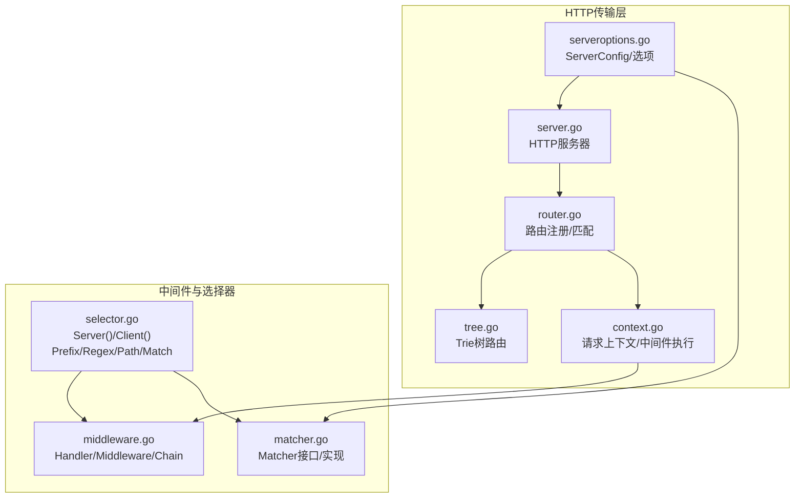
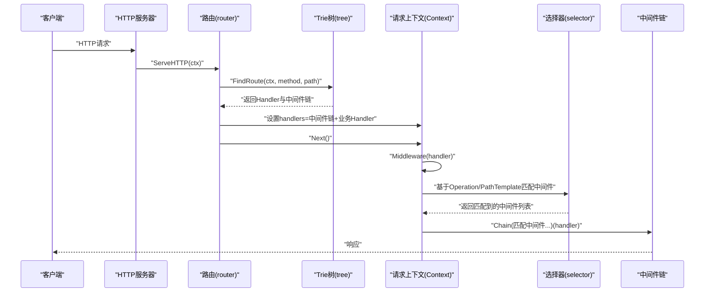
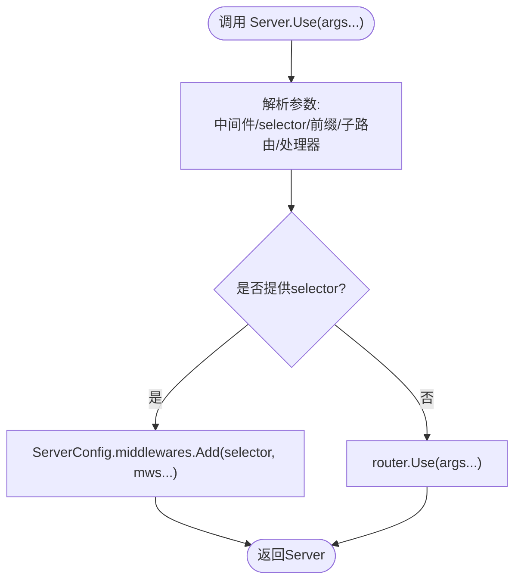
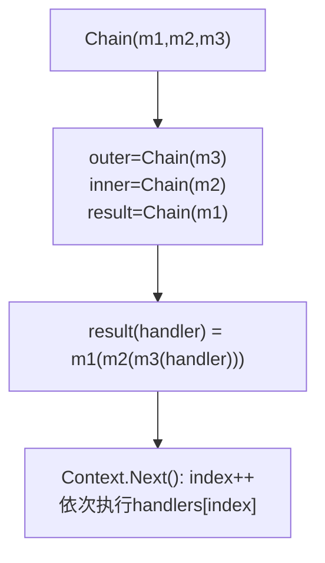
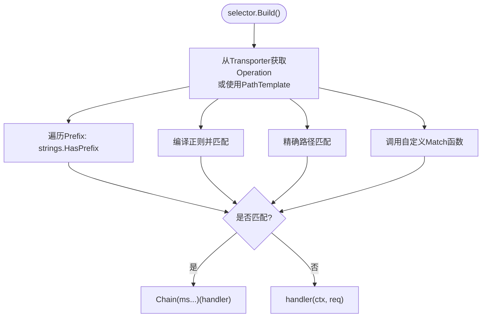
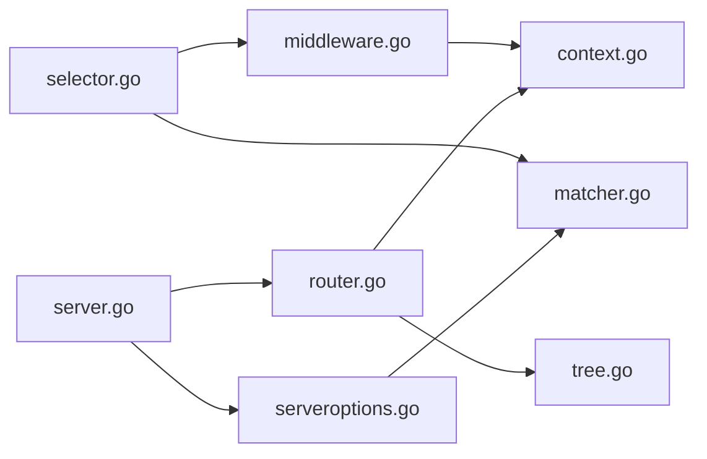

# HTTP中间件集成

<cite>
**本文档引用的文件**
- [middleware.go](file://fox/middleware/middleware.go)
- [selector.go](file://fox/middleware/selector/selector.go)
- [matcher.go](file://fox/internal/matcher/matcher.go)
- [router.go](file://fox/transport/http/router.go)
- [server.go](file://fox/transport/http/server.go)
- [context.go](file://fox/transport/http/context.go)
- [tree.go](file://fox/transport/http/tree.go)
- [serveroptions.go](file://fox/transport/http/serveroptions.go)
- [router_test.go](file://fox/transport/http/router_test.go)
</cite>

## 目录
1. [简介](#简介)
2. [项目结构](#项目结构)
3. [核心组件](#核心组件)
4. [架构总览](#架构总览)
5. [详细组件分析](#详细组件分析)
6. [依赖关系分析](#依赖关系分析)
7. [性能考量](#性能考量)
8. [故障排查指南](#故障排查指南)
9. [结论](#结论)
10. [附录](#附录)

## 简介
本文件面向Go Fox HTTP中间件集成系统，系统性阐述中间件注册机制（Use方法）、中间件链构建过程、选择器匹配（按路径前缀/正则/精确路径）、执行顺序与上下文传递、HTTP中间件与通用中间件的差异与转换、最佳实践（错误处理与性能优化）、完整开发示例与调试技巧，以及生命周期管理与资源清理。

## 项目结构
Go Fox将HTTP传输层与中间件抽象解耦：HTTP路由与请求上下文在transport/http包中实现；通用中间件与选择器在middleware与internal/matcher中实现；Server通过ServerConfig统一注入中间件与配置。

**图表来源**
- [router.go](file://fox/transport/http/router.go#L176-L236)
- [server.go](file://fox/transport/http/server.go#L186-L204)
- [context.go](file://fox/transport/http/context.go#L137-L150)
- [middleware.go](file://fox/middleware/middleware.go#L28-L66)
- [selector.go](file://fox/middleware/selector/selector.go#L27-L82)
- [matcher.go](file://fox/internal/matcher/matcher.go#L33-L88)
- [serveroptions.go](file://fox/transport/http/serveroptions.go#L37-L60)

**章节来源**
- [router.go](file://fox/transport/http/router.go#L176-L236)
- [server.go](file://fox/transport/http/server.go#L186-L204)
- [context.go](file://fox/transport/http/context.go#L137-L150)
- [middleware.go](file://fox/middleware/middleware.go#L28-L66)
- [selector.go](file://fox/middleware/selector/selector.go#L27-L82)
- [matcher.go](file://fox/internal/matcher/matcher.go#L33-L88)
- [serveroptions.go](file://fox/transport/http/serveroptions.go#L37-L60)

## 核心组件
- 中间件抽象与链式组合
  - Handler与Middleware类型定义，以及Chain函数实现从外到内的包裹式组合。
- 选择器与匹配
  - Selector Builder支持Server/Client两类，提供Prefix/Regex/Path/Match四种匹配方式，最终生成一个Middleware。
- 匹配器
  - Matcher接口与实现，支持Add(selector, ...Middleware)与Match(operation)。
- HTTP路由与上下文
  - router.Use注册HTTP中间件；Context.Next驱动中间件链执行；Context.Middleware根据Operation或PathTemplate动态拼接匹配到的中间件。
- 服务器配置
  - ServerConfig持有matcher.Matcher，Server.Use支持直接注册通用中间件或通过selector绑定到特定前缀。

**章节来源**
- [middleware.go](file://fox/middleware/middleware.go#L28-L66)
- [selector.go](file://fox/middleware/selector/selector.go#L27-L127)
- [matcher.go](file://fox/internal/matcher/matcher.go#L33-L88)
- [router.go](file://fox/transport/http/router.go#L176-L236)
- [context.go](file://fox/transport/http/context.go#L137-L150)
- [serveroptions.go](file://fox/transport/http/serveroptions.go#L37-L60)

## 架构总览
HTTP中间件集成的关键流程：
- 服务器启动时，ServerConfig初始化matcher.Matcher，并在Server.init中将配置的httpMiddlewares转换为HTTP Handler链并注册到router.Use。
- 路由匹配阶段，router.ServeHTTP从Trie树找到Handler与中间件链，设置Context.handlers并调用ctx.Next。
- Context.Middleware根据当前请求的Operation或PathTemplate，从matcher.Matcher中匹配出应生效的中间件，再通过Chain组合形成最终的处理链。
- 选择器selector根据transport.Transporter提供的Operation进行匹配，决定是否包裹指定中间件。

**图表来源**
- [router.go](file://fox/transport/http/router.go#L79-L128)
- [tree.go](file://fox/transport/http/tree.go#L200-L234)
- [context.go](file://fox/transport/http/context.go#L137-L150)
- [selector.go](file://fox/middleware/selector/selector.go#L74-L127)

## 详细组件分析

### 中间件注册机制与Use方法
- 服务器级Use
  - Server.Use支持两种模式：仅传入中间件时，直接委托给router.Use；当同时传入selector字符串与中间件时，将中间件注册到ServerConfig.middlewares（matcher.Matcher）。
  - Server.init在初始化时会将ServerConfig.httpMiddlewares转换为HTTP Handler并调用router.Use注册为全局HTTP中间件。
- 路由级Use
  - router.Use支持字符串前缀、[]string前缀集合、Router子路由、Handler/func(...)等多种参数形式，内部统一解析并调用handler方法注册到Trie树节点。
  - 支持mount子路由，自动处理通配符与斜杠规范化。

**图表来源**
- [server.go](file://fox/transport/http/server.go#L186-L204)
- [server.go](file://fox/transport/http/server.go#L101-L133)
- [router.go](file://fox/transport/http/router.go#L176-L236)

**章节来源**
- [server.go](file://fox/transport/http/server.go#L186-L204)
- [server.go](file://fox/transport/http/server.go#L101-L133)
- [router.go](file://fox/transport/http/router.go#L176-L236)

### 中间件链构建与执行顺序
- Chain实现
  - Chain从最后一个中间件开始向前包裹，形成“外层先入栈、内层先执行”的洋葱模型。
- Context.Next
  - Context.index自增，依次调用handlers中的下一个Handler，直至结束。
- 路由匹配与中间件拼接
  - Trie树在FindRoute时收集从根到叶子的中间件链，router.ServeHTTP将其与业务Handler合并为最终handlers。
- 上下文传递
  - Context封装fasthttp.RequestCtx，提供SetContext/Context以传递context.Context；PathTemplate用于匹配器选择。

**图表来源**
- [middleware.go](file://fox/middleware/middleware.go#L54-L66)
- [context.go](file://fox/transport/http/context.go#L118-L125)
- [tree.go](file://fox/transport/http/tree.go#L225-L234)

**章节来源**
- [middleware.go](file://fox/middleware/middleware.go#L54-L66)
- [context.go](file://fox/transport/http/context.go#L118-L125)
- [tree.go](file://fox/transport/http/tree.go#L225-L234)

### 中间件选择器机制与路径匹配
- 选择器类型
  - Server()/Client()分别针对服务端/客户端Transporter。
- 匹配策略
  - Prefix/Regex/Path三种预设匹配；Match函数可自定义匹配逻辑。
  - 匹配成功时，selector返回的Middleware会通过Chain(ms...)(handler)，否则直接调用handler。
- 匹配依据
  - 优先从transport.Transporter提取Operation；若不可用则回退到PathTemplate。

**图表来源**
- [selector.go](file://fox/middleware/selector/selector.go#L27-L127)
- [selector.go](file://fox/middleware/selector/selector.go#L84-L115)
- [context.go](file://fox/transport/http/context.go#L137-L150)

**章节来源**
- [selector.go](file://fox/middleware/selector/selector.go#L27-L127)
- [context.go](file://fox/transport/http/context.go#L137-L150)

### HTTP中间件与通用中间件的区别与转换
- 通用中间件
  - 定义于middleware包，Handler签名接受context.Context与任意request，返回response与error。
- HTTP中间件
  - 定义于transport/http，Handler签名接受*Context与返回error，用于HTTP请求处理。
- 转换与注入
  - ServerConfig.httpMiddlewares为HTTP Handler切片，Server.init时调用router.Use注册为全局HTTP中间件。
  - Server.Use(selector, mws...)将通用中间件注册到matcher.Matcher，后续通过Context.Middleware按Operation/PathTemplate动态拼接。

**章节来源**
- [middleware.go](file://fox/middleware/middleware.go#L28-L32)
- [router.go](file://fox/transport/http/router.go#L105-L127)
- [server.go](file://fox/transport/http/server.go#L101-L133)
- [serveroptions.go](file://fox/transport/http/serveroptions.go#L50-L58)

### 上下文传递与生命周期管理
- 上下文传递
  - Context封装fasthttp.RequestCtx，提供SetContext/Context以传递context.Context；PathTemplate用于匹配器选择。
- 生命周期
  - Server启动/停止：Start/Stop负责监听与优雅关闭。
  - 请求上下文池化：Context对象通过spool复用，减少GC压力。
- 资源清理
  - Context.reset在归还池前重置状态；Server.Stop触发fasthttp.Server Shutdown。

**章节来源**
- [context.go](file://fox/transport/http/context.go#L80-L116)
- [context.go](file://fox/transport/http/context.go#L127-L135)
- [server.go](file://fox/transport/http/server.go#L211-L234)

## 依赖关系分析
- 组件耦合
  - router依赖tree进行路由匹配；router依赖matcher.Matcher在运行时拼接中间件。
  - context在执行阶段调用matcher.Matcher与selector，形成运行时选择。
  - server通过ServerConfig注入matcher与HTTP过滤器。
- 可能的循环依赖
  - 当前模块划分清晰，未见直接循环导入。

**图表来源**
- [middleware.go](file://fox/middleware/middleware.go#L28-L66)
- [selector.go](file://fox/middleware/selector/selector.go#L27-L82)
- [matcher.go](file://fox/internal/matcher/matcher.go#L33-L88)
- [router.go](file://fox/transport/http/router.go#L79-L128)
- [tree.go](file://fox/transport/http/tree.go#L200-L234)
- [context.go](file://fox/transport/http/context.go#L137-L150)
- [server.go](file://fox/transport/http/server.go#L186-L204)
- [serveroptions.go](file://fox/transport/http/serveroptions.go#L37-L60)

**章节来源**
- [router.go](file://fox/transport/http/router.go#L79-L128)
- [server.go](file://fox/transport/http/server.go#L186-L204)
- [context.go](file://fox/transport/http/context.go#L137-L150)
- [middleware.go](file://fox/middleware/middleware.go#L28-L66)
- [selector.go](file://fox/middleware/selector/selector.go#L27-L127)
- [matcher.go](file://fox/internal/matcher/matcher.go#L33-L88)
- [serveroptions.go](file://fox/transport/http/serveroptions.go#L37-L60)

## 性能考量
- 中间件链长度控制：Chain采用逆序包裹，建议保持中间件数量适中，避免过深链导致调用开销。
- 匹配器前缀排序：matcher在添加以“*”结尾的selector时会按前缀长度降序排序，确保更具体的前缀优先匹配。
- 上下文池化：Context通过spool复用，降低频繁分配带来的GC压力。
- Trie树匹配：tree.FindRoute采用分段匹配与二分查找优化，路径越短、分支越少，匹配效率越高。
- 服务器配置：ServerConfig提供并发、缓冲区大小、内存使用等参数，可根据场景调整。

**章节来源**
- [matcher.go](file://fox/internal/matcher/matcher.go#L60-L72)
- [context.go](file://fox/transport/http/context.go#L53-L57)
- [tree.go](file://fox/transport/http/tree.go#L617-L656)
- [serveroptions.go](file://fox/transport/http/serveroptions.go#L100-L168)

## 故障排查指南
- 404/405处理
  - router.ServeHTTP在未找到Handler时返回默认404/405响应；可通过自定义错误编码器覆盖。
- 错误捕获
  - Server.fastHTTPErrorHandler将底层错误映射为标准HTTP错误码并交由配置的错误编码器处理。
- 调试技巧
  - 使用router_test示例验证中间件链与子路由挂载行为；通过Group与Mount组合复杂路由结构。
  - 在中间件中打印Operation/PathTemplate，结合selector的Prefix/Regex/Path进行定位。

**章节来源**
- [router.go](file://fox/transport/http/router.go#L96-L103)
- [server.go](file://fox/transport/http/server.go#L153-L174)
- [router_test.go](file://fox/transport/http/router_test.go#L33-L96)

## 结论
Go Fox的HTTP中间件集成通过清晰的抽象与模块化设计，实现了灵活的中间件注册、强大的选择器匹配、可靠的上下文传递与高效的执行链路。开发者可基于matcher与selector快速构建按路径前缀生效的中间件体系，结合ServerConfig与Server.Use实现全局与局部中间件的协同工作。

## 附录

### 开发最佳实践
- 错误处理
  - 在中间件中尽早返回错误，利用ServerConfig.ene统一编码；避免吞掉错误。
- 性能优化
  - 控制中间件链长度；合理使用前缀匹配；避免在中间件中做阻塞操作。
- 可观测性
  - 在关键中间件记录Operation/PathTemplate与耗时，便于问题定位。
- 安全性
  - 对输入参数进行严格校验与限流；必要时在selector中按前缀隔离敏感路径。

### 完整开发示例（步骤说明）
- 全局HTTP中间件
  - 使用Server.Use注册HTTP Handler作为全局过滤器。
- 按前缀选择中间件
  - 使用Server.Use("/api", middleware1, middleware2)将通用中间件绑定到"/api"前缀。
- 自定义匹配逻辑
  - 使用selector.Server(mw1, mw2).Prefix("/api").Regex("^/api/v\\d+/users").Path("/health").Build()生成中间件并注入。
- 子路由与挂载
  - 使用router.Group与router.Mount组织复杂路由结构，中间件链自动继承父级。

**章节来源**
- [server.go](file://fox/transport/http/server.go#L186-L204)
- [router.go](file://fox/transport/http/router.go#L244-L271)
- [router.go](file://fox/transport/http/router.go#L350-L410)
- [selector.go](file://fox/middleware/selector/selector.go#L27-L82)