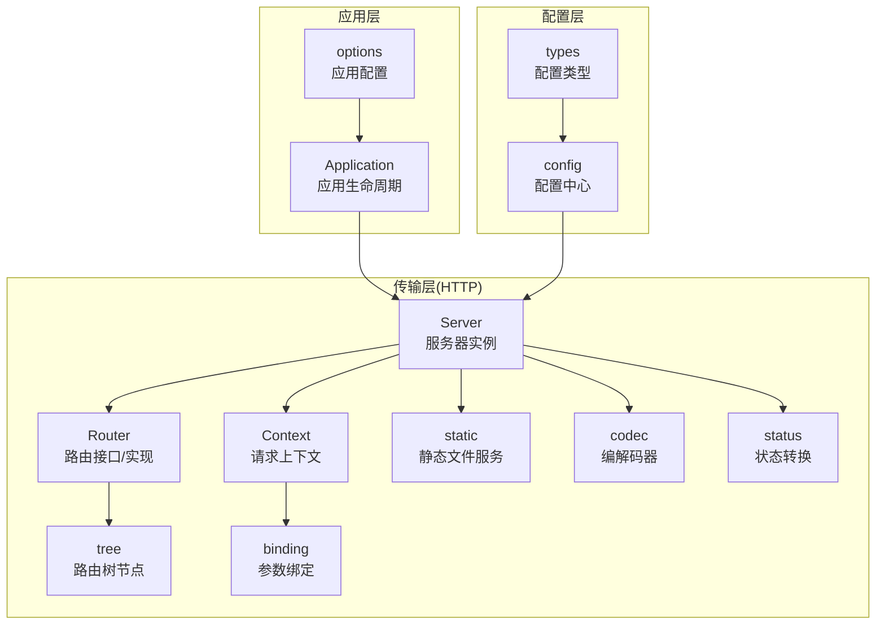
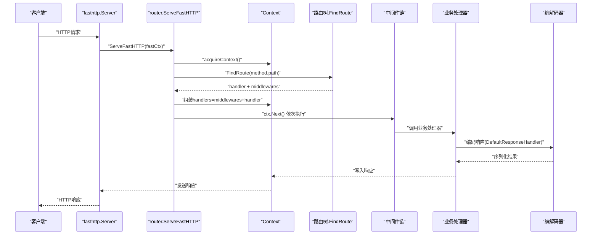
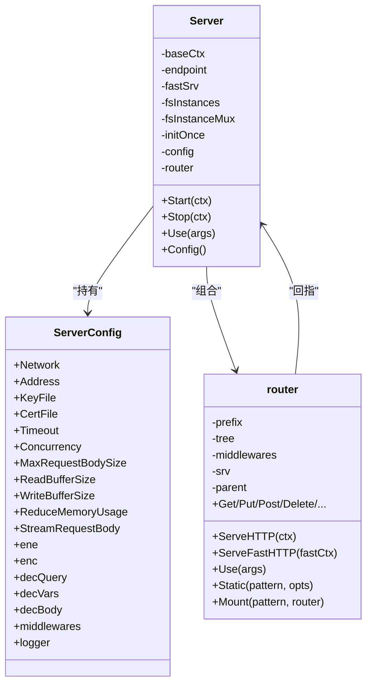
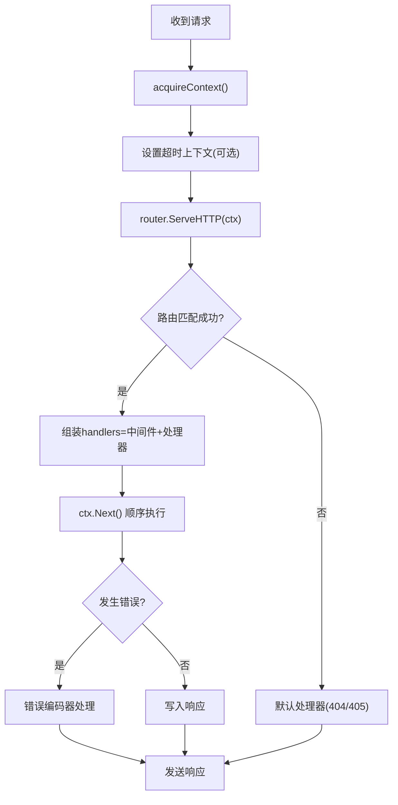
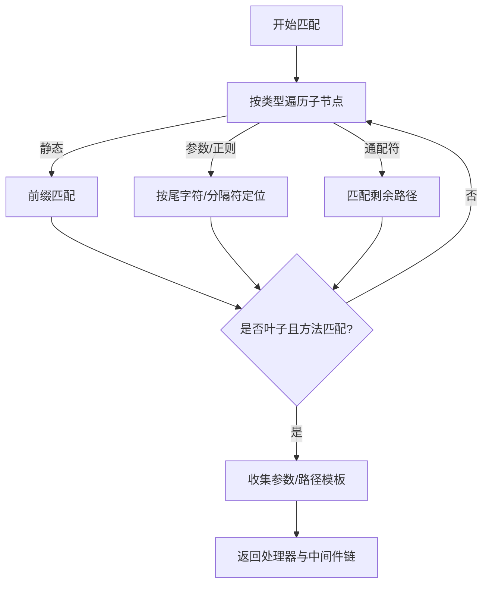
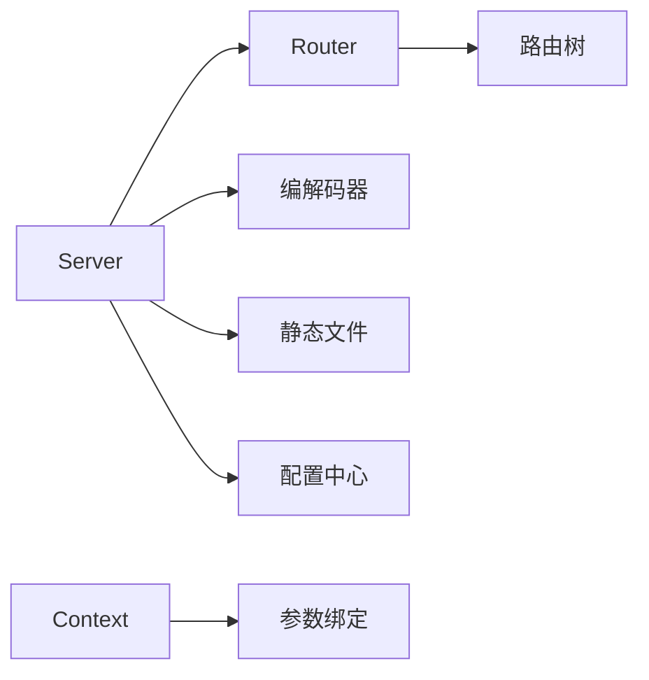

# HTTP服务器实现

<cite>
**本文档引用的文件**
- [server.go](file://transport/http/server.go)
- [router.go](file://transport/http/router.go)
- [serveroptions.go](file://transport/http/serveroptions.go)
- [context.go](file://transport/http/context.go)
- [tree.go](file://transport/http/tree.go)
- [codec.go](file://transport/http/codec.go)
- [binding.go](file://transport/http/binding/binding.go)
- [static.go](file://transport/http/static.go)
- [status.go](file://transport/http/status/status.go)
- [router_test.go](file://transport/http/router_test.go)
- [app.go](file://app.go)
- [options.go](file://options.go)
- [config.go](file://config/config.go)
- [types.go](file://config/types.go)
</cite>

## 目录
1. [引言](#引言)
2. [项目结构](#项目结构)
3. [核心组件](#核心组件)
4. [架构总览](#架构总览)
5. [详细组件分析](#详细组件分析)
6. [依赖关系分析](#依赖关系分析)
7. [性能考量](#性能考量)
8. [故障排查指南](#故障排查指南)
9. [结论](#结论)
10. [附录](#附录)

## 引言
本文件面向Go Fox HTTP服务器实现，系统性阐述其架构设计与实现原理，覆盖Server结构体组成、请求处理流程、路由匹配机制（静态/动态/通配符）、中间件集成与执行顺序、HTTP编解码器配置、服务器配置项、使用示例与性能优化建议，以及状态码与错误响应格式等细节。

## 项目结构
Go Fox将HTTP传输层置于transport/http包中，围绕Server、Router、Context、编解码器与绑定模块构建高性能HTTP服务。整体采用fasthttp作为底层网络引擎，结合自研路由树与中间件选择器，提供灵活的路由与中间件能力。

图表来源
- [server.go](file://transport/http/server.go#L53-L133)
- [router.go](file://transport/http/router.go#L41-L128)
- [context.go](file://transport/http/context.go#L59-L116)
- [tree.go](file://transport/http/tree.go#L36-L77)
- [static.go](file://transport/http/static.go#L40-L168)
- [codec.go](file://transport/http/codec.go#L44-L100)
- [binding.go](file://transport/http/binding/binding.go#L35-L49)
- [status.go](file://transport/http/status/status.go#L9-L23)
- [app.go](file://app.go#L52-L77)
- [options.go](file://options.go#L50-L71)
- [config.go](file://config/config.go#L52-L86)
- [types.go](file://config/types.go#L32-L62)

章节来源
- [server.go](file://transport/http/server.go#L24-L133)
- [router.go](file://transport/http/router.go#L41-L128)
- [context.go](file://transport/http/context.go#L59-L116)
- [tree.go](file://transport/http/tree.go#L36-L77)
- [static.go](file://transport/http/static.go#L40-L168)
- [codec.go](file://transport/http/codec.go#L44-L100)
- [binding.go](file://transport/http/binding/binding.go#L35-L49)
- [status.go](file://transport/http/status/status.go#L9-L23)
- [app.go](file://app.go#L52-L77)
- [options.go](file://options.go#L50-L71)
- [config.go](file://config/config.go#L52-L86)
- [types.go](file://config/types.go#L32-L62)

## 核心组件
- Server：HTTP服务器主体，封装fasthttp.Server、路由树、中间件选择器、TLS配置、监听器与端点信息，负责启动、停止与请求入口分发。
- Router：路由接口与实现，提供HTTP方法映射、静态文件、子路由挂载、中间件组合、路由遍历等功能。
- Context：请求上下文，封装fasthttp.RequestCtx、路由参数、中间件链、编解码器调用、响应写入等。
- 路由树：基于多叉树的高效路由匹配结构，支持静态、参数、正则与通配符节点，按标签排序与尾字符优先策略提升查找效率。
- 编解码器：统一的请求/响应编解码接口，默认支持JSON、表单、XML等；错误编码器统一输出标准错误格式。
- 绑定模块：将查询、路径参数、表单与请求体绑定到目标结构体。
- 静态文件：基于fasthttp.FS的静态资源服务，支持缓存控制、字节范围、压缩与下载附件等。
- 状态转换：提供HTTP与gRPC状态码互转工具。

章节来源
- [server.go](file://transport/http/server.go#L53-L133)
- [router.go](file://transport/http/router.go#L41-L128)
- [context.go](file://transport/http/context.go#L59-L116)
- [tree.go](file://transport/http/tree.go#L36-L77)
- [codec.go](file://transport/http/codec.go#L44-L100)
- [binding.go](file://transport/http/binding/binding.go#L35-L49)
- [static.go](file://transport/http/static.go#L40-L168)
- [status.go](file://transport/http/status/status.go#L9-L23)

## 架构总览
下图展示从请求进入至响应返回的全链路：

图表来源
- [server.go](file://transport/http/server.go#L130-L151)
- [router.go](file://transport/http/router.go#L79-L128)
- [tree.go](file://transport/http/tree.go#L200-L234)
- [context.go](file://transport/http/context.go#L118-L125)
- [codec.go](file://transport/http/codec.go#L83-L100)

## 详细组件分析

### Server结构体与初始化
- 字段职责
  - baseCtx：基础上下文
  - endpoint：服务端点URL（含协议与地址）
  - fastSrv：底层fasthttp.Server实例
  - fsInstances/fsInstanceMux：静态文件服务实例缓存与互斥锁
  - initOnce：初始化保护
  - config：服务器配置（网络、地址、TLS、超时、缓冲区、内存优化、请求体流式处理、中间件、编解码器、日志等）
  - router：路由树包装
- 初始化流程
  - 若未提供listener，根据Network/Address创建监听
  - 若未提供TLS证书，尝试加载Key/Cert文件生成tls.Config
  - 构建fasthttp.Server：设置Handler、ErrorHandler、并发度、缓冲区大小、内存优化、请求体流式处理等
  - 注册HTTP中间件（httpMiddlewares）到路由层
- 启停流程
  - Start：监听并记录端口；若配置TLS则用tls.NewListener包装
  - Stop：通过ShutdownWithContext优雅关闭

图表来源
- [server.go](file://transport/http/server.go#L53-L133)
- [serveroptions.go](file://transport/http/serveroptions.go#L37-L60)
- [router.go](file://transport/http/router.go#L70-L77)

章节来源
- [server.go](file://transport/http/server.go#L53-L133)
- [serveroptions.go](file://transport/http/serveroptions.go#L37-L77)

### 请求处理流程
- 入口
  - fasthttp.Server.Handler指向router.ServeFastHTTP
  - 该方法从Server池化获取Context，设置超时上下文（可选），调用router.ServeHTTP
- 路由解析
  - router.ServeHTTP：提取请求方法与路径，调用路由树FindRoute定位处理器与中间件
  - 若未找到，返回默认404或405处理器
- 中间件与处理器
  - 将中间件链与最终处理器合并为handlers
  - 通过ctx.Next()顺序执行，支持在处理器内部再次调用ctx.Next()实现“后置”逻辑
- 错误处理
  - fastHTTPErrorHandler：将底层错误映射为HTTP错误码并交由错误编码器处理
  - router.ServeFastHTTP捕获异常并调用错误编码器

图表来源
- [router.go](file://transport/http/router.go#L79-L151)
- [server.go](file://transport/http/server.go#L130-L174)

章节来源
- [router.go](file://transport/http/router.go#L79-L151)
- [server.go](file://transport/http/server.go#L130-L174)

### 路由匹配机制
- 节点类型
  - ntStatic：静态路径
  - ntParam：参数占位（如{id}）
  - ntRegexp：正则参数（如{id:[0-9]+}）
  - ntCatchAll：通配符（如/*）
- 匹配策略
  - 按首字节与尾字符排序，优先匹配更具体的节点
  - 对于参数/正则节点，检查分段边界避免跨段匹配
  - 通配符节点匹配剩余路径
- 参数收集
  - 在匹配过程中累积路径参数与URL参数，最终注入Context供处理器使用
- 子路由挂载
  - 支持将另一个Router作为子路由挂载，自动清理通配符参数并传递挂载中间件

图表来源
- [tree.go](file://transport/http/tree.go#L237-L353)

章节来源
- [tree.go](file://transport/http/tree.go#L36-L77)
- [tree.go](file://transport/http/tree.go#L200-L234)
- [tree.go](file://transport/http/tree.go#L237-L353)

### 中间件集成与执行顺序
- 中间件来源
  - Server级中间件：通过ServerConfig.middlewares（基于selector）按操作名匹配
  - 路由级中间件：通过router.Use(args...)注册，支持字符串前缀、处理器列表与子路由
  - 子路由挂载：Mount时将子路由中间件追加到挂载点
- 执行顺序
  - Context.Middleware根据当前操作名（PathTemplate/Operation）从匹配器链中拼接中间件
  - handlers链为“父中间件 + 子中间件 + 路由中间件 + 处理器”
  - 通过ctx.Next()逐个执行，支持短路与错误传播

章节来源
- [router.go](file://transport/http/router.go#L176-L236)
- [router.go](file://transport/http/router.go#L350-L410)
- [context.go](file://transport/http/context.go#L137-L150)

### HTTP编解码器与参数绑定
- 编解码器
  - 默认响应编码：根据Accept头选择编解码器，设置Content-Type并序列化
  - 默认请求解码：根据Content-Type选择编解码器，反序列化请求体
  - 默认错误编码：将错误对象序列化为Accept指定格式
- 参数绑定
  - ShouldBind：依次绑定路径参数、查询参数、表单与请求体
  - BindVars/BindQuery/BindForm/BindBody：分别对应不同来源
- 静态文件
  - 支持缓存控制、字节范围、压缩、索引页与下载附件等选项

章节来源
- [codec.go](file://transport/http/codec.go#L65-L138)
- [codec.go](file://transport/http/codec.go#L140-L197)
- [binding.go](file://transport/http/binding/binding.go#L35-L49)
- [context.go](file://transport/http/context.go#L168-L204)
- [static.go](file://transport/http/static.go#L40-L168)

### 配置选项详解
- 基础网络
  - Network：网络类型（默认tcp）
  - Address：监听地址（默认0.0.0.0:0）
  - Listener：外部传入的net.Listener（优先级高于Address）
- 安全与性能
  - KeyFile/CertFile：TLS证书与私钥文件（同时存在时自动加载）
  - TLSConfig：外部TLS配置
  - Concurrency：并发连接数
  - MaxRequestBodySize/ReadBufferSize/WriteBufferSize：请求体大小与缓冲区
  - ReduceMemoryUsage/StreamRequestBody：内存优化与请求体流式处理
- 超时与中间件
  - Timeout：请求处理超时（为0表示无限制）
  - Middleware/UseMiddleware：全局与按路径选择的中间件
  - WithFilter：HTTP过滤器（Handler）
- 编解码与日志
  - ErrorEncoder/ResponseEncode：错误与响应编码器
  - Logger：日志记录器

章节来源
- [serveroptions.go](file://transport/http/serveroptions.go#L37-L77)
- [serveroptions.go](file://transport/http/serveroptions.go#L97-L231)

### 使用示例
- 基本路由与中间件
  - 参考测试用例：注册静态文件、分组中间件、子路由挂载、遍历路由与启动服务
- 应用集成
  - 通过Application与options.Option将HTTP服务器纳入应用生命周期管理

章节来源
- [router_test.go](file://transport/http/router_test.go#L33-L96)
- [app.go](file://app.go#L184-L221)
- [options.go](file://options.go#L188-L193)

## 依赖关系分析
- 组件耦合
  - Server与Router强关联：Server持有Router并委托请求处理
  - Router与Context弱耦合：通过Context传递请求上下文与中间件链
  - 编解码器与绑定模块独立：通过接口抽象解耦
- 外部依赖
  - fasthttp：高性能HTTP引擎
  - selector/matcher：中间件选择器
  - codec：多种内容类型的编解码器
  - config：配置中心与类型系统

图表来源
- [server.go](file://transport/http/server.go#L53-L133)
- [router.go](file://transport/http/router.go#L70-L77)
- [context.go](file://transport/http/context.go#L59-L116)
- [codec.go](file://transport/http/codec.go#L44-L100)
- [static.go](file://transport/http/static.go#L40-L168)
- [config.go](file://config/config.go#L52-L86)

章节来源
- [server.go](file://transport/http/server.go#L53-L133)
- [router.go](file://transport/http/router.go#L70-L77)
- [context.go](file://transport/http/context.go#L59-L116)
- [codec.go](file://transport/http/codec.go#L44-L100)
- [static.go](file://transport/http/static.go#L40-L168)
- [config.go](file://config/config.go#L52-L86)

## 性能考量
- 并发与内存
  - 合理设置Concurrency以匹配CPU核心数
  - 开启ReduceMemoryUsage降低内存占用
  - 流式请求体（StreamRequestBody）适合大文件上传场景
- 缓冲区
  - 根据请求/响应规模调整ReadBufferSize/WriteBufferSize
- 编解码与绑定
  - 选择合适的编解码器（JSON/表单/XML）并复用实例
  - 避免在中间件中进行昂贵的字符串拼接与反射
- 静态文件
  - 启用压缩与缓存（CacheDuration/Max-Age）减少带宽
  - 使用字节范围（AcceptByteRange）支持断点续传
- 路由树
  - 路由模式尽量避免深层嵌套与重复前缀，减少匹配开销

## 故障排查指南
- 常见错误与处理
  - 请求头过大：映射为“请求头字段过大”，检查MaxRequestBodySize与ReadBufferSize
  - 请求超时：映射为“请求超时”，检查Timeout与上游依赖
  - 请求体过大：映射为“实体过大”，检查MaxRequestBodySize
  - 方法不允许：映射为“方法不允许”，检查路由定义与方法匹配
  - 编解码失败：检查Content-Type与Accept头，确认已注册对应编解码器
- 日志与观测
  - 使用Logger输出启动/停止信息与错误
  - 结合配置中心动态观察关键参数变化

章节来源
- [server.go](file://transport/http/server.go#L153-L174)
- [codec.go](file://transport/http/codec.go#L153-L163)

## 结论
Go Fox HTTP服务器以fasthttp为核心，结合自研路由树与中间件选择器，提供了高性能、可扩展的HTTP服务框架。通过清晰的Server/Router/Context分层、完善的编解码与绑定机制、灵活的中间件与静态文件支持，以及丰富的配置选项，能够满足从简单REST服务到复杂微服务网关的多样化需求。

## 附录

### HTTP状态码与错误响应格式
- 默认错误编码器会根据Accept头选择编解码器，序列化错误对象并设置对应HTTP状态码
- 提供HTTP与gRPC状态码互转工具，便于多协议场景统一错误语义

章节来源
- [codec.go](file://transport/http/codec.go#L153-L163)
- [status.go](file://transport/http/status/status.go#L9-L23)
- [status.go](file://transport/http/status/status.go#L30-L102)