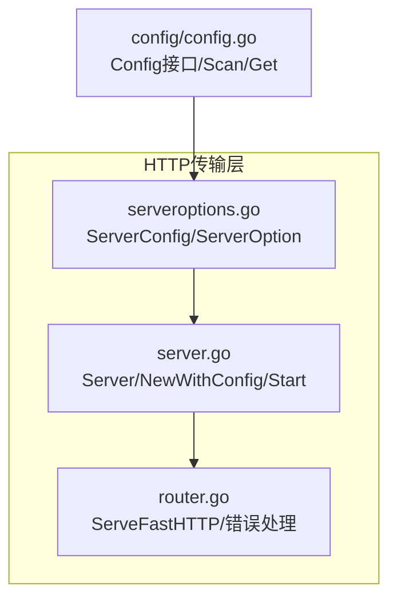
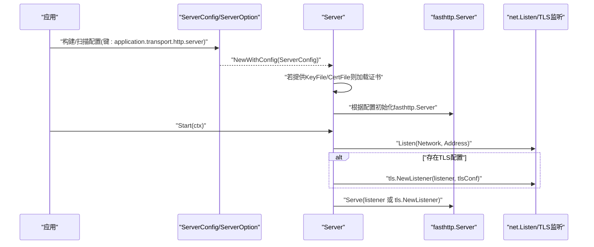
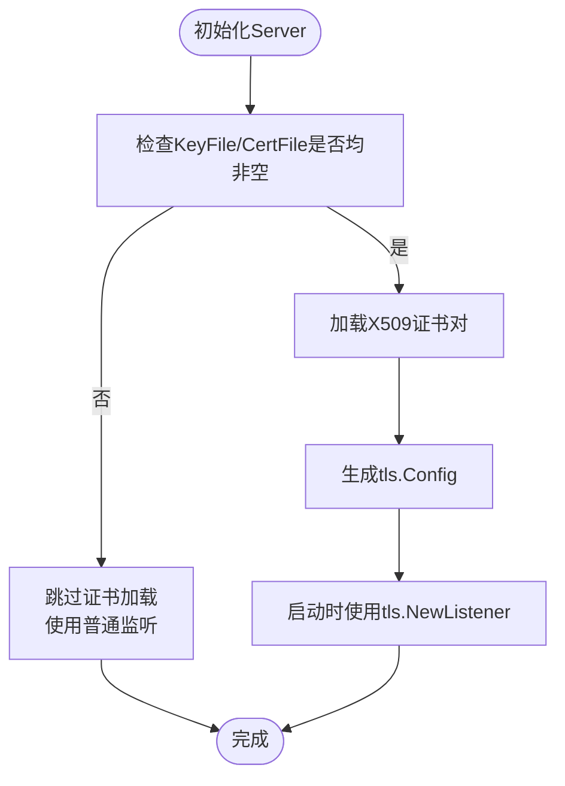
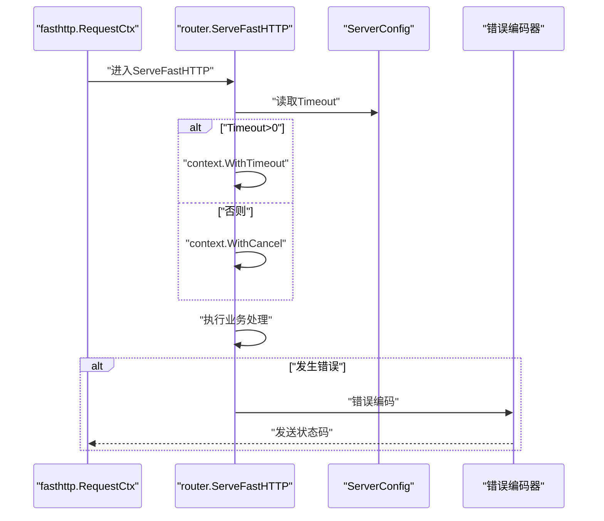
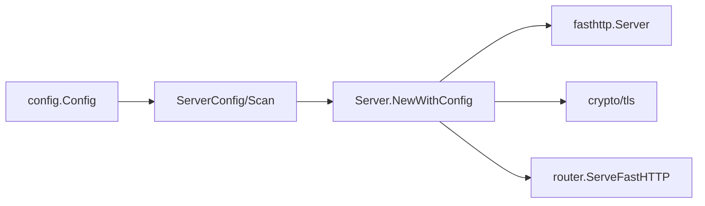

# HTTP服务器配置

<cite>
**本文引用的文件**
- [transport/http/serveroptions.go](file://transport/http/serveroptions.go)
- [transport/http/server.go](file://transport/http/server.go)
- [transport/http/router.go](file://transport/http/router.go)
- [config/config.go](file://config/config.go)
- [transport/http/router_test.go](file://transport/http/router_test.go)
</cite>

## 目录
1. [简介](#简介)
2. [项目结构](#项目结构)
3. [核心组件](#核心组件)
4. [架构总览](#架构总览)
5. [详细组件分析](#详细组件分析)
6. [依赖分析](#依赖分析)
7. [性能考量](#性能考量)
8. [故障排查指南](#故障排查指南)
9. [结论](#结论)
10. [附录：配置示例与最佳实践](#附录配置示例与最佳实践)

## 简介
本技术文档聚焦于 Go Fox 的 HTTP 服务器配置系统，围绕 ServerConfig 结构体及其相关选项展开，系统性解释网络与监听、TLS 证书加载、请求处理与缓冲区、并发与内存策略等关键配置项的作用、默认值、相互依赖与约束，并给出常见场景的配置示例与最佳实践。

## 项目结构
与 HTTP 服务器配置直接相关的代码主要位于 transport/http 包中，核心文件如下：
- serveroptions.go：定义 ServerConfig 及其默认值、扫描配置、构造器与各类 ServerOption
- server.go：基于 ServerConfig 构建并启动 HTTP 服务器，含 TLS 证书加载、监听与启动流程
- router.go：路由层与请求上下文集成，负责超时控制与错误编码
- config/config.go：通用配置系统，支持多源合并、键扫描与动态监听

**图表来源**
- [transport/http/serveroptions.go](file://transport/http/serveroptions.go#L37-L95)
- [transport/http/server.go](file://transport/http/server.go#L79-L133)
- [transport/http/router.go](file://transport/http/router.go#L130-L174)
- [config/config.go](file://config/config.go#L52-L123)

**章节来源**
- [transport/http/serveroptions.go](file://transport/http/serveroptions.go#L37-L95)
- [transport/http/server.go](file://transport/http/server.go#L79-L133)
- [transport/http/router.go](file://transport/http/router.go#L130-L174)
- [config/config.go](file://config/config.go#L52-L123)

## 核心组件
- ServerConfig：HTTP 服务器的配置载体，包含网络、地址、TLS、超时、并发、请求体大小限制、读写缓冲区、内存优化、流式请求体以及中间件等字段
- Server：基于 ServerConfig 构建 fasthttp.Server 并完成监听、启动与停止
- Router：路由与中间件挂载，负责请求分发与超时控制
- Config（配置系统）：提供键扫描与值解析能力，用于从配置源加载 ServerConfig

**章节来源**
- [transport/http/serveroptions.go](file://transport/http/serveroptions.go#L37-L95)
- [transport/http/server.go](file://transport/http/server.go#L53-L133)
- [transport/http/router.go](file://transport/http/router.go#L130-L174)
- [config/config.go](file://config/config.go#L52-L123)

## 架构总览
下图展示从配置到服务器启动的关键交互路径：

**图表来源**
- [transport/http/serveroptions.go](file://transport/http/serveroptions.go#L79-L95)
- [transport/http/server.go](file://transport/http/server.go#L79-L133)
- [transport/http/server.go](file://transport/http/server.go#L211-L228)

## 详细组件分析

### ServerConfig 字段详解与默认值
- Network：网络类型，默认 tcp
- Address：监听地址，默认 0.0.0.0:0
- Timeout：请求处理超时，默认 3 秒；路由层据此设置上下文超时
- Concurrency：并发处理上限，透传至 fasthttp.Server
- MaxRequestBodySize：最大请求体大小（字节），透传至 fasthttp.Server
- ReadBufferSize/WriteBufferSize：读写缓冲区大小（字节），透传至 fasthttp.Server
- ReduceMemoryUsage：是否降低内存占用，透传至 fasthttp.Server
- StreamRequestBody：是否流式读取请求体，透传至 fasthttp.Server
- KeyFile/CertFile：TLS 证书私钥与证书文件路径；当两者均非空且未显式提供 tls.Config 时，自动加载并生成 tls.Config
- 其他内部字段：listener、tlsConf、中间件匹配器、编码器/解码器、日志器等

默认值由 DefaultServerConfig 提供，扫描配置通过 ScanServerConfig/RawServerConfig 完成。

**章节来源**
- [transport/http/serveroptions.go](file://transport/http/serveroptions.go#L37-L77)
- [transport/http/serveroptions.go](file://transport/http/serveroptions.go#L79-L95)
- [transport/http/server.go](file://transport/http/server.go#L90-L96)

### TLS 配置与证书加载机制
- 当同时提供 KeyFile 与 CertFile 且未显式设置 tls.Config 时，服务器在初始化阶段加载证书并生成 tls.Config
- 启动时若存在 tls.Config，则通过 tls.NewListener 包裹底层 listener；否则直接 Serve 普通 listener
- 该机制确保“零样板”地启用 HTTPS，同时允许外部注入自定义 tls.Config

**图表来源**
- [transport/http/server.go](file://transport/http/server.go#L90-L96)
- [transport/http/server.go](file://transport/http/server.go#L219-L223)

**章节来源**
- [transport/http/server.go](file://transport/http/server.go#L90-L96)
- [transport/http/server.go](file://transport/http/server.go#L219-L223)

### 请求处理与超时控制
- 路由层在每次请求进入时，依据 ServerConfig.Timeout 创建带超时的上下文；若未设置超时，则使用取消上下文
- fasthttp 错误处理会将特定错误映射为标准错误类型，并交由错误编码器处理

**图表来源**
- [transport/http/router.go](file://transport/http/router.go#L130-L174)

**章节来源**
- [transport/http/router.go](file://transport/http/router.go#L130-L174)

### 性能相关配置项
- Concurrency：限制并发请求数，避免过载
- MaxRequestBodySize：限制请求体大小，防止内存膨胀
- ReadBufferSize/WriteBufferSize：调整读写缓冲区大小，平衡吞吐与内存
- ReduceMemoryUsage：开启后减少内存占用，可能略微降低吞吐
- StreamRequestBody：启用后以流式方式读取请求体，适合大体积上传但需业务侧配合

这些配置项均透传给 fasthttp.Server，最终影响底层连接处理与内存分配策略。

**章节来源**
- [transport/http/server.go](file://transport/http/server.go#L109-L125)

## 依赖分析
- ServerConfig 依赖配置系统（Config）进行键扫描与解析
- Server 在初始化时依赖 crypto/tls 加载证书
- Server 将配置传递给 fasthttp.Server，后者决定实际运行行为
- Router 依赖 ServerConfig 的超时与错误编码器

**图表来源**
- [transport/http/serveroptions.go](file://transport/http/serveroptions.go#L79-L95)
- [transport/http/server.go](file://transport/http/server.go#L79-L133)
- [transport/http/router.go](file://transport/http/router.go#L130-L174)

**章节来源**
- [transport/http/serveroptions.go](file://transport/http/serveroptions.go#L79-L95)
- [transport/http/server.go](file://transport/http/server.go#L79-L133)
- [transport/http/router.go](file://transport/http/router.go#L130-L174)

## 性能考量
- 缓冲区大小：在高并发或大流量场景下适当增大 ReadBufferSize/WriteBufferSize，可提升吞吐；但需评估内存占用
- 内存优化：ReduceMemoryUsage 开启后可降低峰值内存，适用于资源受限环境
- 并发控制：Concurrency 应结合 CPU 核数与业务特征设置，避免过度竞争
- 请求体大小：合理设置 MaxRequestBodySize，防止异常请求导致内存压力
- 流式处理：对大文件上传启用 StreamRequestBody，减少驻留内存

[本节为通用性能建议，不直接分析具体文件]

## 故障排查指南
- TLS 加载失败：当 KeyFile/CertFile 非法或权限不足时，服务器初始化会抛出错误；请确认文件路径正确与权限足够
- 监听失败：Address 已被占用或权限不足会导致 net.Listen 失败；检查端口与防火墙
- 超时错误：路由层将超时映射为 REQUEST_TIMEOUT；可通过调整 Timeout 或优化业务逻辑解决
- 请求体过大：超过 MaxRequestBodySize 会被视为 BODY_TOO_LARGE；应调整阈值或优化客户端

**章节来源**
- [transport/http/server.go](file://transport/http/server.go#L90-L96)
- [transport/http/server.go](file://transport/http/server.go#L137-L142)
- [transport/http/router.go](file://transport/http/router.go#L153-L174)

## 结论
Go Fox 的 HTTP 服务器配置体系以 ServerConfig 为核心，通过 ServerOption 与配置系统无缝衔接，既保证了灵活性又提供了合理的默认值。TLS 证书加载与 fasthttp 参数透传使性能与易用性兼顾。建议在生产环境中结合业务特征与资源状况，审慎设置并发、缓冲区与请求体大小，并启用合适的内存优化策略。

[本节为总结性内容，不直接分析具体文件]

## 附录：配置示例与最佳实践

### 常见配置场景与要点
- 明确监听网络与地址：Network 与 Address 组合决定监听行为
- 启用 HTTPS：提供 KeyFile 与 CertFile 即可自动加载证书；也可通过 TLSConfig 注入自定义配置
- 控制请求体大小：根据业务接口的最大负载设置 MaxRequestBodySize
- 调整缓冲区与内存：在高并发或大流量场景适度增大缓冲区，必要时开启 ReduceMemoryUsage
- 设置超时：Timeout 用于保护业务处理，避免长时间占用连接
- 中间件与路由：通过 ServerOption 注入全局过滤器与中间件，按需选择流式请求体

### 使用配置系统加载 ServerConfig
- 键名约定：默认键 application.transport.http.server，可通过 ScanServerConfig 指定子键
- 解析流程：配置系统将数据源合并后，通过 Scan 将值填充到 ServerConfig

**章节来源**
- [transport/http/serveroptions.go](file://transport/http/serveroptions.go#L79-L95)
- [config/config.go](file://config/config.go#L117-L123)

### 示例参考（路径）
- 基础监听与路由示例：参见测试文件中的服务器创建与路由挂载
  - [transport/http/router_test.go](file://transport/http/router_test.go#L57-L96)

[本节仅提供示例文件路径，不包含具体代码内容]