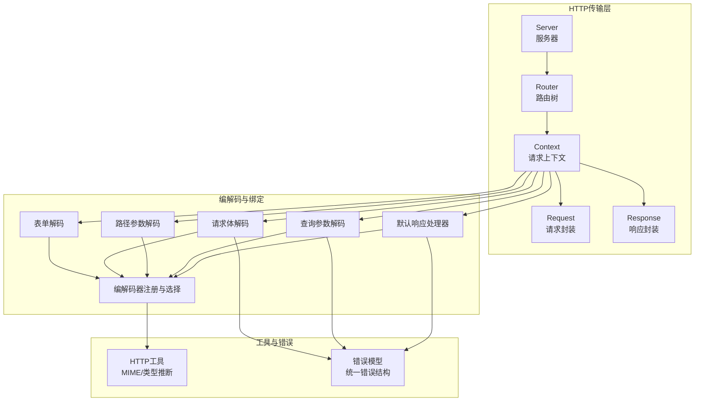
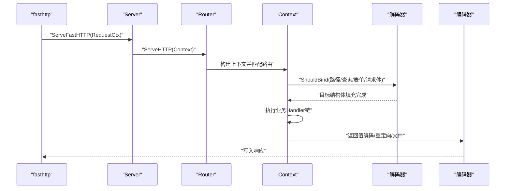
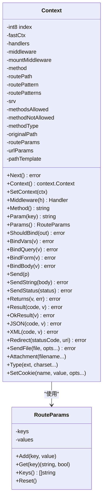
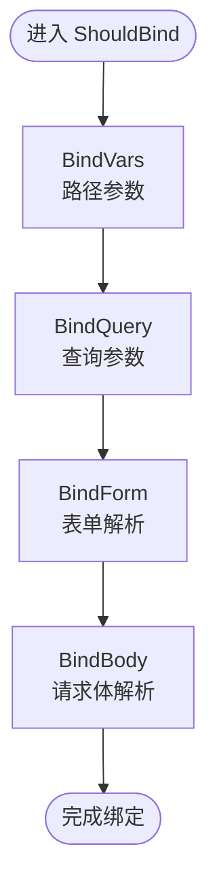
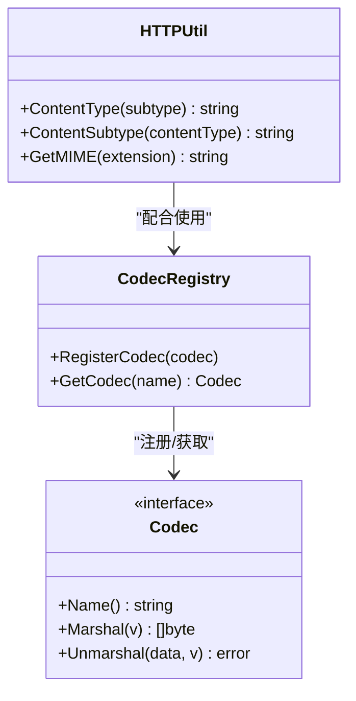
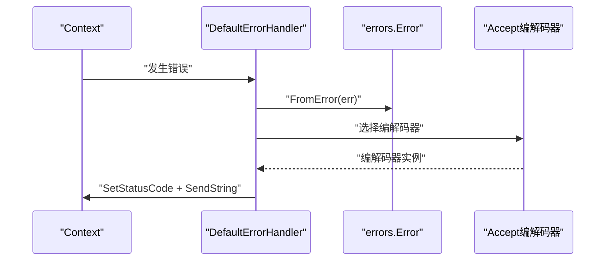
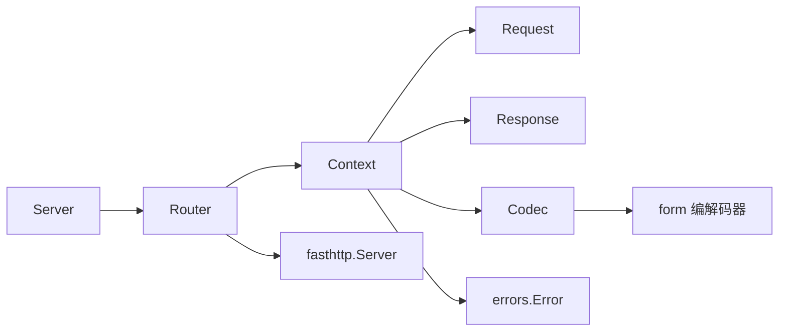

# HTTP请求响应处理

<cite>
**本文引用的文件**
- [transport/http/context.go](file://transport/http/context.go)
- [transport/http/request.go](file://transport/http/request.go)
- [transport/http/response.go](file://transport/http/response.go)
- [transport/http/binding/binding.go](file://transport/http/binding/binding.go)
- [transport/http/binding/encode.go](file://transport/http/binding/encode.go)
- [transport/http/server.go](file://transport/http/server.go)
- [transport/http/codec.go](file://transport/http/codec.go)
- [transport/http/router.go](file://transport/http/router.go)
- [transport/http/handler.go](file://transport/http/handler.go)
- [transport/http/serveroptions.go](file://transport/http/serveroptions.go)
- [transport/http/params.go](file://transport/http/params.go)
- [transport/http/status/status.go](file://transport/http/status/status.go)
- [internal/httputil/http.go](file://internal/httputil/http.go)
- [codec/codec.go](file://codec/codec.go)
- [errors/errors.go](file://errors/errors.go)
</cite>

## 目录
1. [引言](#引言)
2. [项目结构](#项目结构)
3. [核心组件](#核心组件)
4. [架构总览](#架构总览)
5. [详细组件分析](#详细组件分析)
6. [依赖关系分析](#依赖关系分析)
7. [性能考量与内存管理](#性能考量与内存管理)
8. [故障排查指南](#故障排查指南)
9. [结论](#结论)
10. [附录：请求处理示例与最佳实践](#附录请求处理示例与最佳实践)

## 引言
本文件系统性梳理 Go Fox 的 HTTP 请求响应处理机制，围绕以下主题展开：
- HTTP 上下文 Context 的设计与实现（Request/Response 封装）
- 请求解析流程（URL 参数、查询参数、表单与请求体）
- 响应构造机制（状态码、头部、响应体编码）
- 编解码器（Codec）的集成与选择策略
- 错误处理与异常响应的标准化
- 性能优化与内存管理建议
- 完整的请求处理示例与常见场景处理方案

## 项目结构
Go Fox 的 HTTP 子系统以 fasthttp 为核心，通过 Server/Router/Context/Request/Response 等模块协同工作，并通过编解码器与绑定层完成请求解析与响应序列化。

图示来源
- [transport/http/server.go](file://transport/http/server.go#L101-L133)
- [transport/http/router.go](file://transport/http/router.go#L79-L128)
- [transport/http/context.go](file://transport/http/context.go#L289-L297)
- [transport/http/codec.go](file://transport/http/codec.go#L83-L138)
- [codec/codec.go](file://codec/codec.go#L31-L61)
- [internal/httputil/http.go](file://internal/httputil/http.go#L32-L86)
- [errors/errors.go](file://errors/errors.go#L27-L32)

章节来源
- [transport/http/server.go](file://transport/http/server.go#L101-L133)
- [transport/http/router.go](file://transport/http/router.go#L79-L128)
- [transport/http/context.go](file://transport/http/context.go#L289-L297)
- [transport/http/codec.go](file://transport/http/codec.go#L83-L138)
- [codec/codec.go](file://codec/codec.go#L31-L61)
- [internal/httputil/http.go](file://internal/httputil/http.go#L32-L86)
- [errors/errors.go](file://errors/errors.go#L27-L32)

## 核心组件
- Server：基于 fasthttp 的 HTTP 服务端，负责监听、初始化、路由分发与错误处理桥接。
- Router：基于前缀树的路由匹配器，支持静态资源、子路由挂载、中间件组合。
- Context：请求上下文，封装 fasthttp.RequestCtx，提供参数绑定、响应写入、重定向、文件发送等能力。
- Request/Response：对 fasthttp.Request/fasthttp.Response 的轻量别名封装，便于池化与统一接口。
- 编解码器与绑定：内置 JSON/XML/Form 等编解码器，以及查询/表单/路径/请求体的默认解码函数。
- 错误模型：统一的错误结构，支持 gRPC 状态码映射与堆栈记录。

章节来源
- [transport/http/server.go](file://transport/http/server.go#L53-L63)
- [transport/http/router.go](file://transport/http/router.go#L41-L63)
- [transport/http/context.go](file://transport/http/context.go#L59-L78)
- [transport/http/request.go](file://transport/http/request.go#L31-L39)
- [transport/http/response.go](file://transport/http/response.go#L31-L39)
- [transport/http/codec.go](file://transport/http/codec.go#L44-L64)
- [errors/errors.go](file://errors/errors.go#L27-L32)

## 架构总览
请求从 fasthttp 进入，Server 通过 Router 匹配到 Handler，Context 负责参数绑定与响应写入；编解码器根据请求头自动选择；错误统一由默认错误处理器输出。

图示来源
- [transport/http/router.go](file://transport/http/router.go#L130-L151)
- [transport/http/context.go](file://transport/http/context.go#L168-L190)
- [transport/http/codec.go](file://transport/http/codec.go#L102-L151)
- [transport/http/codec.go](file://transport/http/codec.go#L83-L100)

章节来源
- [transport/http/router.go](file://transport/http/router.go#L130-L151)
- [transport/http/context.go](file://transport/http/context.go#L168-L190)
- [transport/http/codec.go](file://transport/http/codec.go#L83-L100)

## 详细组件分析

### HTTP 上下文 Context 设计与实现
- 生命周期与复用：通过对象池减少 GC 压力，acquire/release 在每次请求开始/结束时调用。
- 中间件链：HandlersChain 支持 Next 顺序执行，结合匹配器按路径或操作选择中间件。
- 请求/响应封装：暴露 Request()/Response() 与底层 fasthttp 对象互操作；提供便捷方法如 SetStatusCode、SetResponseHeader、Send、SendString、Redirect、JSON/XML、SendFile、Attachment 等。
- 参数绑定：ShouldBind 统一调用 BindVars/BindQuery/BindForm/BindBody，分别处理路径参数、查询参数、表单与请求体。
- 文件服务：SendFile 内部复用 fasthttp.FS 并缓存实例，支持下载、缓存控制、压缩与字节范围。

图示来源
- [transport/http/context.go](file://transport/http/context.go#L59-L116)
- [transport/http/params.go](file://transport/http/params.go#L26-L63)

章节来源
- [transport/http/context.go](file://transport/http/context.go#L80-L100)
- [transport/http/context.go](file://transport/http/context.go#L118-L125)
- [transport/http/context.go](file://transport/http/context.go#L168-L204)
- [transport/http/context.go](file://transport/http/context.go#L314-L390)
- [transport/http/context.go](file://transport/http/context.go#L404-L532)
- [transport/http/params.go](file://transport/http/params.go#L26-L63)

### 请求解析流程（URL/查询/表单/请求体）
- 路径参数：在路由匹配后，Context 通过 urlParams 提供 Param/Params 访问。
- 查询参数：DefaultDecodeRequestQuery 从 URI.QueryArgs 抽取键值对，交由 form 编解码器反序列化。
- 表单：parseForm 统一处理 application/x-www-form-urlencoded 与 multipart/form-data；随后使用 binding.BindForm。
- 请求体：根据 Content-Type 自动选择编解码器，若未注册则返回 400；空体直接跳过。

图示来源
- [transport/http/context.go](file://transport/http/context.go#L168-L190)
- [transport/http/context.go](file://transport/http/context.go#L206-L237)
- [transport/http/codec.go](file://transport/http/codec.go#L102-L151)
- [transport/http/binding/binding.go](file://transport/http/binding/binding.go#L35-L49)

章节来源
- [transport/http/context.go](file://transport/http/context.go#L168-L204)
- [transport/http/context.go](file://transport/http/context.go#L206-L237)
- [transport/http/codec.go](file://transport/http/codec.go#L102-L151)
- [transport/http/binding/binding.go](file://transport/http/binding/binding.go#L35-L49)

### 响应构造机制（状态码/头部/响应体）
- 状态码：SetStatusCode 直接设置响应状态码；SendStatus/SendString 提供便捷方法。
- 头部：SetResponseHeader/SetCanonical/SetCookie 等覆盖常见场景。
- 响应体：Returns/Result/OkResult 统一走 enc 编码器；JSON/XML 直接设置 Content-Type 并写入；Redirect 自动设置 Location 与合适的状态码。
- 文件：SendFile 使用 fasthttp.FS 并支持缓存控制、压缩、下载附件等。

章节来源
- [transport/http/context.go](file://transport/http/context.go#L314-L390)
- [transport/http/context.go](file://transport/http/context.go#L404-L532)
- [transport/http/codec.go](file://transport/http/codec.go#L83-L100)

### 编解码器集成与使用
- 编解码器注册：codec.RegisterCodec 注册具体实现（如 json/xml/form/proto），GetCodec 按名称检索。
- 请求侧：CodecForRequest 根据 Accept 或 Content-Type 推断编解码器；DefaultRequestEncoder/DefaultDecodeRequestBody 基于该选择进行 Marshal/Unmarshal。
- 响应侧：DefaultResponseHandler 根据 Accept 选择编解码器并设置 Content-Type。
- MIME 类型：internal/httputil 提供 ContentSubtype/ContentType/MIME 推断辅助。

图示来源
- [codec/codec.go](file://codec/codec.go#L33-L61)
- [transport/http/codec.go](file://transport/http/codec.go#L65-L81)
- [internal/httputil/http.go](file://internal/httputil/http.go#L37-L86)

章节来源
- [codec/codec.go](file://codec/codec.go#L33-L61)
- [transport/http/codec.go](file://transport/http/codec.go#L65-L100)
- [internal/httputil/http.go](file://internal/httputil/http.go#L37-L86)

### 错误处理与异常响应标准化
- 默认错误处理器：DefaultErrorHandler 将错误转为统一结构，按 Accept 编码并设置状态码。
- 错误模型：errors.Error 包含 Code/Reason/Message/Metadata，并可携带 cause 与 stack；支持 gRPC 状态映射。
- fasthttp 错误桥接：Server.fastHTTPErrorHandler 将底层错误转换为统一错误类型并交给 ene 处理器。

图示来源
- [transport/http/codec.go](file://transport/http/codec.go#L153-L163)
- [errors/errors.go](file://errors/errors.go#L147-L174)
- [transport/http/router.go](file://transport/http/router.go#L153-L174)

章节来源
- [transport/http/codec.go](file://transport/http/codec.go#L153-L163)
- [errors/errors.go](file://errors/errors.go#L147-L174)
- [transport/http/router.go](file://transport/http/router.go#L153-L174)

### 路由与中间件
- 路由树：Router 基于前缀树匹配，支持任意方法、静态资源、子路由挂载与通配符。
- 中间件：Server.Use/Router.Use 支持按路径前缀选择中间件；Context.Middleware 根据当前操作或路径模板匹配。
- 超时与取消：ServeFastHTTP 基于 ServerConfig.Timeout 创建带超时的 context。

章节来源
- [transport/http/router.go](file://transport/http/router.go#L41-L63)
- [transport/http/router.go](file://transport/http/router.go#L197-L236)
- [transport/http/context.go](file://transport/http/context.go#L137-L150)
- [transport/http/server.go](file://transport/http/server.go#L135-L151)

## 依赖关系分析
- Server 依赖 fasthttp.Server 与 Router；Router 依赖 Context；Context 依赖 Request/Response 与编解码器。
- 解码器与绑定：查询/表单/路径/请求体解码均依赖 form 编解码器；响应编码依赖编解码器注册表。
- 错误模型：统一错误结构贯穿解码/编码与错误处理器。

图示来源
- [transport/http/server.go](file://transport/http/server.go#L101-L133)
- [transport/http/router.go](file://transport/http/router.go#L79-L128)
- [transport/http/context.go](file://transport/http/context.go#L289-L297)
- [transport/http/codec.go](file://transport/http/codec.go#L65-L100)
- [transport/http/binding/binding.go](file://transport/http/binding/binding.go#L35-L49)
- [errors/errors.go](file://errors/errors.go#L27-L32)

章节来源
- [transport/http/server.go](file://transport/http/server.go#L101-L133)
- [transport/http/router.go](file://transport/http/router.go#L79-L128)
- [transport/http/context.go](file://transport/http/context.go#L289-L297)
- [transport/http/codec.go](file://transport/http/codec.go#L65-L100)
- [transport/http/binding/binding.go](file://transport/http/binding/binding.go#L35-L49)
- [errors/errors.go](file://errors/errors.go#L27-L32)

## 性能考量与内存管理
- 对象池：Context/Request/Response 均通过池化降低分配与 GC 压力，Server.acquireContext/releaseContext 控制生命周期。
- 流式处理：ServerConfig.StreamRequestBody 可开启流式请求体，适合大体积上传；ReduceMemoryUsage 降低内存占用。
- 缓冲区：ReadBufferSize/WriteBufferSize 可按场景调优；MaxRequestBodySize 限制请求体大小避免内存膨胀。
- 编解码器选择：按 Accept/Content-Type 动态选择，避免不必要的拷贝；JSON/XML 等编解码器内部已做高效实现。
- 文件服务：SendFile 复用 fasthttp.FS 实例并设置 Cache-Control，减少重复初始化成本。

章节来源
- [transport/http/context.go](file://transport/http/context.go#L53-L57)
- [transport/http/request.go](file://transport/http/request.go#L31-L35)
- [transport/http/response.go](file://transport/http/response.go#L31-L35)
- [transport/http/server.go](file://transport/http/server.go#L109-L125)
- [transport/http/serveroptions.go](file://transport/http/serveroptions.go#L37-L77)
- [transport/http/context.go](file://transport/http/context.go#L404-L532)

## 故障排查指南
- 404/405：路由未匹配或方法不被允许时，Router.ServeHTTP 返回相应状态与默认消息。
- 请求头过大/超时/实体过大：Server.fastHTTPErrorHandler 将底层错误映射为统一错误类型并交给 ene 处理器。
- 编解码失败：DefaultDecodeRequestBody/DefaultDecodeRequestQuery 在无法识别 Content-Type 或反序列化失败时返回 400。
- 文件不存在：SendFile 在 fasthttp 返回 404 时转换为统一错误。

章节来源
- [transport/http/router.go](file://transport/http/router.go#L96-L102)
- [transport/http/router.go](file://transport/http/router.go#L153-L174)
- [transport/http/codec.go](file://transport/http/codec.go#L124-L138)
- [transport/http/context.go](file://transport/http/context.go#L514-L516)

## 结论
Go Fox 的 HTTP 层以 fasthttp 为基础，通过 Context/Router/Server 协同实现了高性能、可扩展的请求处理链；编解码器与绑定层提供了灵活的请求解析与响应序列化能力；统一错误模型与默认处理器确保了异常响应的一致性。结合对象池、流式处理与缓冲区配置，可在保证性能的同时提升稳定性。

## 附录：请求处理示例与最佳实践
- 示例场景
  - 绑定与返回：使用 ShouldBind 绑定路径/查询/表单/请求体，返回数据通过 Returns/Result/OkResult 编码。
  - JSON/XML 响应：直接调用 JSON/XML 方法设置 Content-Type 并写入。
  - 重定向：Redirect 设置 Location 与状态码。
  - 文件下载：SendFile 支持缓存控制与下载附件。
- 最佳实践
  - 明确 Content-Type 与 Accept，避免编解码失败。
  - 合理设置 ServerConfig.Timeout/MaxRequestBodySize，防止慢请求与大体积请求影响性能。
  - 使用对象池与流式处理，避免频繁分配与内存峰值。
  - 通过中间件链实现鉴权、限流、日志等横切关注点。

章节来源
- [transport/http/context.go](file://transport/http/context.go#L168-L190)
- [transport/http/context.go](file://transport/http/context.go#L360-L390)
- [transport/http/context.go](file://transport/http/context.go#L325-L346)
- [transport/http/context.go](file://transport/http/context.go#L404-L532)
- [transport/http/serveroptions.go](file://transport/http/serveroptions.go#L62-L77)