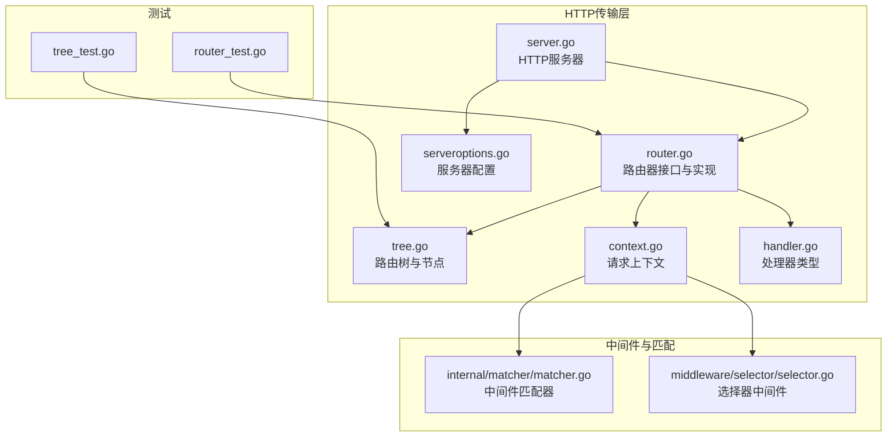
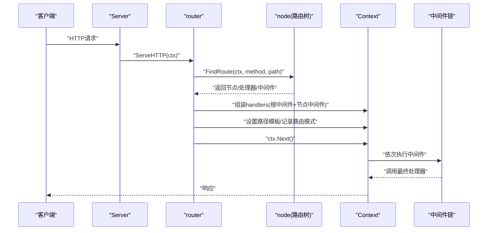
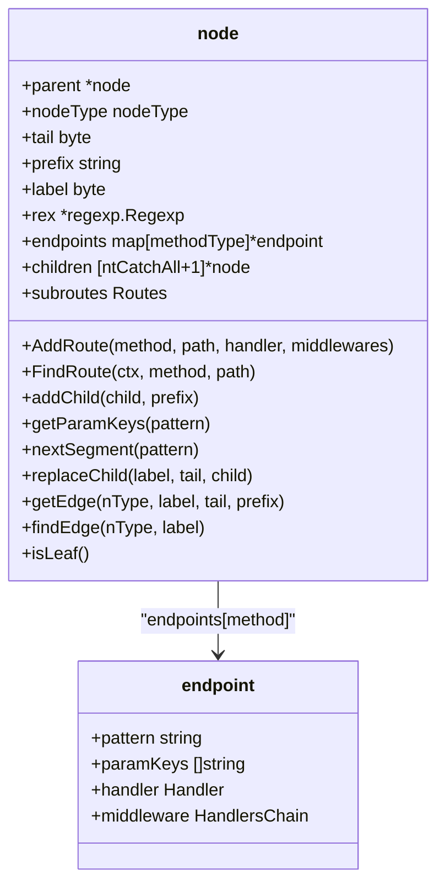
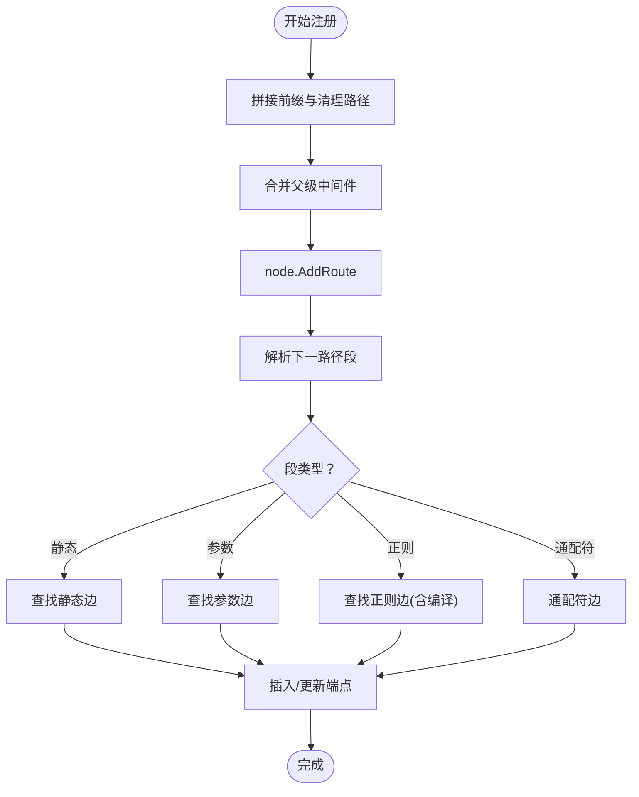
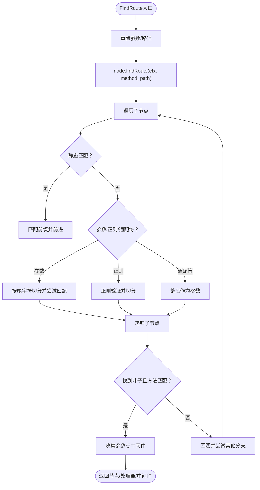
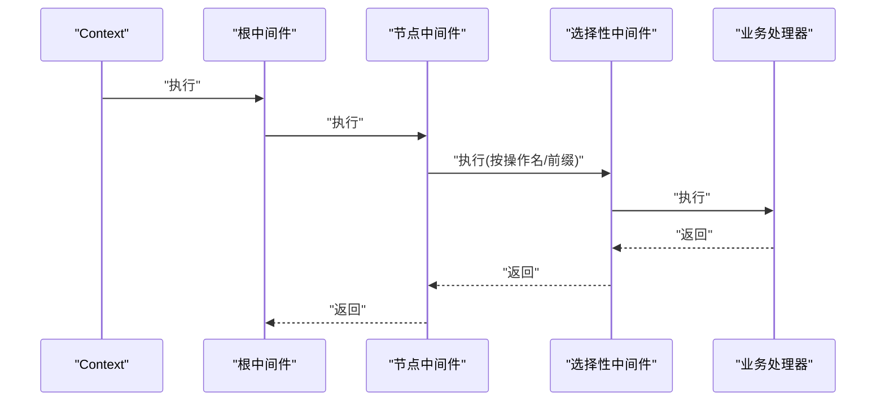
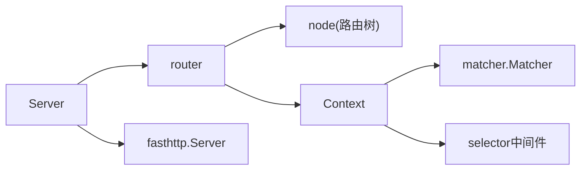

# HTTP路由系统

<cite>
**本文引用的文件列表**
- [router.go](file://transport/http/router.go)
- [tree.go](file://transport/http/tree.go)
- [context.go](file://transport/http/context.go)
- [server.go](file://transport/http/server.go)
- [serveroptions.go](file://transport/http/serveroptions.go)
- [handler.go](file://transport/http/handler.go)
- [router_test.go](file://transport/http/router_test.go)
- [tree_test.go](file://transport/http/tree_test.go)
- [matcher.go](file://internal/matcher/matcher.go)
- [selector.go](file://middleware/selector/selector.go)
</cite>

## 目录
1. [简介](#简介)
2. [项目结构](#项目结构)
3. [核心组件](#核心组件)
4. [架构总览](#架构总览)
5. [详细组件分析](#详细组件分析)
6. [依赖关系分析](#依赖关系分析)
7. [性能考量](#性能考量)
8. [故障排查指南](#故障排查指南)
9. [结论](#结论)
10. [附录](#附录)

## 简介
本文件面向Go Fox HTTP路由系统，提供从架构到实现细节的完整技术文档。重点覆盖：
- 路由树的节点设计与插入/查找算法
- 静态路由、动态参数、正则参数、通配符路由的实现机制
- 路由注册流程（HTTP方法匹配与路径解析）
- 路由查找的性能优化策略与复杂度分析
- 路由最佳实践与命名规范
- 复杂路由场景（嵌套子路由、挂载子服务、条件中间件）
- 中间件集成方式与执行顺序

## 项目结构
HTTP路由系统位于transport/http目录下，核心文件包括：
- 路由器与服务器：router.go、server.go、serveroptions.go
- 路由树与节点：tree.go
- 请求上下文：context.go
- 中间件匹配器：internal/matcher/matcher.go
- 路由选择器中间件：middleware/selector/selector.go
- 测试用例：router_test.go、tree_test.go

图表来源
- [router.go](file://transport/http/router.go#L41-L128)
- [tree.go](file://transport/http/tree.go#L33-L68)
- [context.go](file://transport/http/context.go#L59-L116)
- [server.go](file://transport/http/server.go#L53-L133)
- [serveroptions.go](file://transport/http/serveroptions.go#L37-L77)
- [handler.go](file://transport/http/handler.go#L26-L31)
- [matcher.go](file://internal/matcher/matcher.go#L33-L88)
- [selector.go](file://middleware/selector/selector.go#L118-L143)

章节来源
- [router.go](file://transport/http/router.go#L41-L128)
- [tree.go](file://transport/http/tree.go#L33-L68)
- [context.go](file://transport/http/context.go#L59-L116)
- [server.go](file://transport/http/server.go#L53-L133)
- [serveroptions.go](file://transport/http/serveroptions.go#L37-L77)
- [handler.go](file://transport/http/handler.go#L26-L31)
- [matcher.go](file://internal/matcher/matcher.go#L33-L88)
- [selector.go](file://middleware/selector/selector.go#L118-L143)

## 核心组件
- 路由器接口与实现：Router接口定义路由注册、静态资源、挂载子路由、分组与全局中间件等能力；具体实现router封装了路由树与中间件链。
- 路由树与节点：node结构体表示路由树节点，支持静态、参数、正则、通配符四种节点类型；提供AddRoute与FindRoute两大核心方法。
- 上下文Context：承载一次请求的生命周期，维护方法、路径、参数、中间件链与响应写入等。
- 服务器Server：基于fasthttp封装，负责初始化路由树、处理请求、错误处理与启动停止。
- 中间件匹配器：根据操作名或前缀选择性应用中间件链。

章节来源
- [router.go](file://transport/http/router.go#L41-L128)
- [tree.go](file://transport/http/tree.go#L33-L68)
- [context.go](file://transport/http/context.go#L59-L116)
- [server.go](file://transport/http/server.go#L53-L133)
- [matcher.go](file://internal/matcher/matcher.go#L33-L88)

## 架构总览
HTTP请求在服务器中流转如下：
- Server接收请求，通过router.ServeHTTP进行路由匹配
- 路由树node.FindRoute按路径与方法查找处理器与中间件
- Context.Next按顺序执行中间件链与最终处理器
- 中间件可基于操作名或前缀进行选择性应用

图表来源
- [router.go](file://transport/http/router.go#L79-L128)
- [tree.go](file://transport/http/tree.go#L200-L234)
- [context.go](file://transport/http/context.go#L118-L125)

章节来源
- [router.go](file://transport/http/router.go#L79-L128)
- [tree.go](file://transport/http/tree.go#L200-L234)
- [context.go](file://transport/http/context.go#L118-L125)

## 详细组件分析

### 路由树与节点设计
- 节点类型
  - 静态节点(ntStatic)：普通静态路径段
  - 参数节点(ntParam)：形如{key}的动态参数
  - 正则节点(ntRegexp)：形如{key:reg}的正则约束参数
  - 通配符节点(ntCatchAll)：形如*的任意剩余路径
- 关键字段
  - parent：父节点指针
  - nodeType：节点类型
  - prefix/tail/label：前缀、尾字符、标签字节，用于快速定位
  - children：按类型分组的子节点数组
  - endpoints：按HTTP方法存储的处理器与中间件
  - rex：正则表达式缓存
- 方法
  - AddRoute：构建路由树，支持路径分段解析、参数/正则/通配符识别、前缀共享与节点分裂
  - FindRoute：递归查找，按静态/参数/正则/通配符分支尝试匹配，收集参数与中间件链

图表来源
- [tree.go](file://transport/http/tree.go#L33-L68)
- [tree.go](file://transport/http/tree.go#L119-L198)
- [tree.go](file://transport/http/tree.go#L200-L234)

章节来源
- [tree.go](file://transport/http/tree.go#L33-L68)
- [tree.go](file://transport/http/tree.go#L119-L198)
- [tree.go](file://transport/http/tree.go#L200-L234)

### 路由注册与路径解析
- 注册入口
  - router.handler统一处理前缀拼接与中间件合并，委托给node.AddRoute
  - 支持所有HTTP方法与Any全量方法注册
  - Static静态资源注册为HEAD/GET两条路由
- 路径解析
  - nextSegment解析下一个段：参数、正则、通配符
  - addChild根据段类型创建子节点，必要时对正则编译并缓存
  - getParamKeys提取参数键集合，重复键会触发异常
- 前缀与重复校验
  - findPattern用于挂载子路由前检查是否已存在相同前缀

图表来源
- [router.go](file://transport/http/router.go#L421-L427)
- [tree.go](file://transport/http/tree.go#L119-L198)
- [tree.go](file://transport/http/tree.go#L430-L513)
- [tree.go](file://transport/http/tree.go#L533-L603)

章节来源
- [router.go](file://transport/http/router.go#L273-L348)
- [router.go](file://transport/http/router.go#L421-L427)
- [tree.go](file://transport/http/tree.go#L119-L198)
- [tree.go](file://transport/http/tree.go#L430-L513)
- [tree.go](file://transport/http/tree.go#L533-L603)

### 路由匹配算法
- 匹配流程
  - FindRoute重置参数与路径，调用内部findRoute
  - 按类型遍历子节点：静态、参数、正则、通配符
  - 对于参数/正则节点，按尾字符分割搜索串，避免跨段匹配
  - 递归进入子节点，若到达叶子且方法匹配则返回
  - 若未找到处理器但存在其他方法，标记methodNotAllowed
- 中间件收集
  - getMiddleware自底向上收集节点中间件，形成完整链路
- 参数收集
  - 在匹配过程中累积参数键值，最终合并到Context.urlParams

图表来源
- [tree.go](file://transport/http/tree.go#L200-L234)
- [tree.go](file://transport/http/tree.go#L236-L353)
- [tree.go](file://transport/http/tree.go#L225-L234)

章节来源
- [tree.go](file://transport/http/tree.go#L200-L234)
- [tree.go](file://transport/http/tree.go#L236-L353)
- [tree.go](file://transport/http/tree.go#L225-L234)

### 静态路由、动态参数、通配符路由
- 静态路由
  - 通过静态边直接匹配前缀，适合固定路径
- 动态参数
  - 形如{key}，按尾字符切分，避免跨段
  - 可重复定义不同参数键，但同一模式内不允许重复键
- 正则参数
  - 形如{key:reg}，编译后缓存，匹配时验证
- 通配符路由
  - 仅允许出现在路径末尾，作为剩余路径整体捕获

章节来源
- [tree.go](file://transport/http/tree.go#L100-L105)
- [tree.go](file://transport/http/tree.go#L533-L603)
- [tree.go](file://transport/http/tree.go#L451-L458)

### 路由查找与性能优化
- 时间复杂度
  - 插入：O(L)，L为路径长度，受节点分裂影响
  - 查找：O(L)，每步按类型选择子节点，静态边二分查找，参数/正则边线性扫描
- 优化策略
  - 子节点排序与尾字符优先：尾字符为'/'的参数节点被推至末尾，减少跨段误匹配
  - 静态边二分查找：静态边按label排序，查找效率高
  - 正则预编译：首次遇到正则参数时编译并缓存
  - 参数键去重：同一模式内重复参数键直接报错，避免歧义

章节来源
- [tree.go](file://transport/http/tree.go#L762-L776)
- [tree.go](file://transport/http/tree.go#L630-L656)
- [tree.go](file://transport/http/tree.go#L451-L458)
- [tree.go](file://transport/http/tree.go#L515-L531)

### 路由注册与挂载子路由
- 路由注册
  - router.handler统一处理前缀与中间件合并，调用node.AddRoute
- 挂载子路由
  - Mount在指定前缀下挂载另一个Router实例
  - 自动处理通配符尾部与子路由前缀传递
  - 挂载前检查是否存在冲突路径

章节来源
- [router.go](file://transport/http/router.go#L350-L410)
- [tree.go](file://transport/http/tree.go#L355-L395)

### 中间件集成与执行顺序
- 中间件链
  - Context.handlers由根中间件与节点中间件拼接而成
  - Context.Next按索引顺序依次执行
- 选择性中间件
  - 通过Server.Use(selector, ...middleware)按操作名或前缀选择中间件
  - Context.Middleware根据当前操作名或路径模板组合挂载中间件链

图表来源
- [context.go](file://transport/http/context.go#L118-L125)
- [context.go](file://transport/http/context.go#L137-L150)
- [server.go](file://transport/http/server.go#L186-L204)
- [matcher.go](file://internal/matcher/matcher.go#L74-L88)

章节来源
- [context.go](file://transport/http/context.go#L118-L125)
- [context.go](file://transport/http/context.go#L137-L150)
- [server.go](file://transport/http/server.go#L186-L204)
- [matcher.go](file://internal/matcher/matcher.go#L74-L88)

### 复杂路由场景示例
- 嵌套路由与分组
  - Group创建带前缀的子路由，继承父级中间件并叠加新中间件
- 条件路由
  - 使用selector中间件按路径、前缀或正则匹配选择性应用中间件
- 静态资源
  - Static注册HEAD/GET两条路由，支持文件下载与缓存控制

章节来源
- [router.go](file://transport/http/router.go#L243-L256)
- [router.go](file://transport/http/router.go#L342-L348)
- [selector.go](file://middleware/selector/selector.go#L118-L143)

## 依赖关系分析
- 组件耦合
  - router依赖node进行路由树操作
  - Context依赖Server配置与中间件匹配器
  - Server聚合router并持有fasthttp服务
- 外部依赖
  - fasthttp用于高性能HTTP处理
  - 内置编码/解码器与绑定工具

图表来源
- [server.go](file://transport/http/server.go#L53-L133)
- [router.go](file://transport/http/router.go#L70-L77)
- [context.go](file://transport/http/context.go#L59-L116)
- [matcher.go](file://internal/matcher/matcher.go#L33-L88)
- [selector.go](file://middleware/selector/selector.go#L118-L143)

章节来源
- [server.go](file://transport/http/server.go#L53-L133)
- [router.go](file://transport/http/router.go#L70-L77)
- [context.go](file://transport/http/context.go#L59-L116)
- [matcher.go](file://internal/matcher/matcher.go#L33-L88)
- [selector.go](file://middleware/selector/selector.go#L118-L143)

## 性能考量
- 路由树查询
  - 静态边采用二分查找，参数/正则边线性扫描，整体O(L)
- 内存占用
  - 节点按类型分组，children数组按label排序，减少比较次数
  - 正则表达式编译后缓存，避免重复开销
- 并发与缓冲
  - Server配置支持并发、读写缓冲、内存优化与请求体流式处理
- 编码与解码
  - 默认编码器与解码器可替换，减少序列化成本

章节来源
- [tree.go](file://transport/http/tree.go#L630-L656)
- [tree.go](file://transport/http/tree.go#L451-L458)
- [serveroptions.go](file://transport/http/serveroptions.go#L37-L77)
- [server.go](file://transport/http/server.go#L102-L133)

## 故障排查指南
- 路由未命中
  - 检查HTTP方法是否正确，确认FindRoute返回的methodsAllowed
  - 确认路径大小写与尾斜杠差异
- 参数缺失
  - 确认参数键唯一，避免重复定义
  - 检查参数尾字符是否导致跨段匹配
- 正则不生效
  - 确认正则表达式合法且以^$包裹
- 挂载冲突
  - 挂载前检查是否已有相同前缀路径
- 中间件未生效
  - 确认操作名或前缀选择器匹配逻辑
  - 检查Context.Middleware组合顺序

章节来源
- [tree.go](file://transport/http/tree.go#L326-L336)
- [tree.go](file://transport/http/tree.go#L515-L531)
- [tree.go](file://transport/http/tree.go#L451-L458)
- [router.go](file://transport/http/router.go#L367-L371)
- [context.go](file://transport/http/context.go#L137-L150)

## 结论
Go Fox HTTP路由系统以高效路由树为核心，结合灵活的中间件匹配与挂载机制，提供了高性能、易扩展的HTTP路由能力。通过静态/参数/正则/通配符多形态支持与完善的性能优化策略，能够满足复杂业务场景下的路由需求。建议在实际使用中遵循参数键唯一、路径规范化与中间件选择器明确的原则，以获得更佳的稳定性与可维护性。

## 附录
- 最佳实践与命名规范
  - 参数键：使用小写字母与下划线，避免重复
  - 路径：统一使用小写，尾斜杠保持一致
  - 中间件：按功能模块拆分，选择器前缀尽量精确
  - 路由分组：按业务域划分，合理使用Group与Mount
- 示例参考
  - 基础路由与静态资源：见router_test.go
  - 路由树行为验证：见tree_test.go

章节来源
- [router_test.go](file://transport/http/router_test.go#L33-L96)
- [tree_test.go](file://transport/http/tree_test.go#L10-L96)