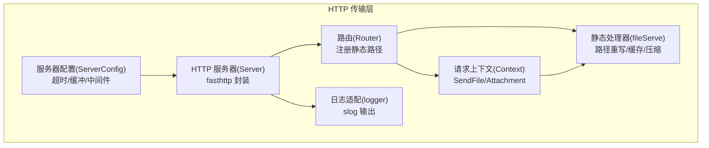
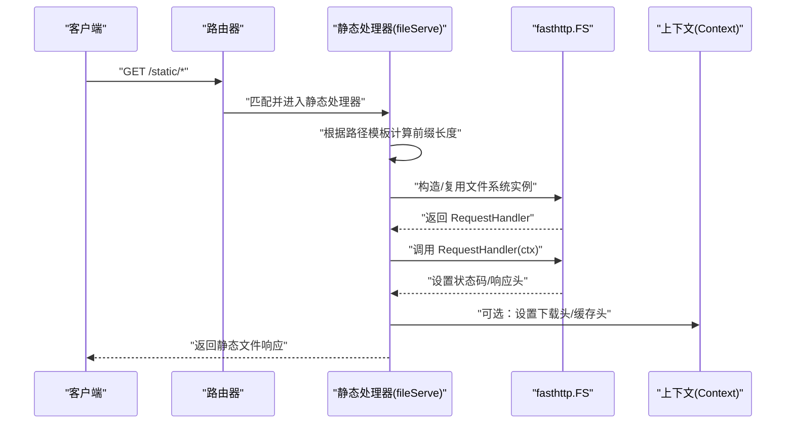
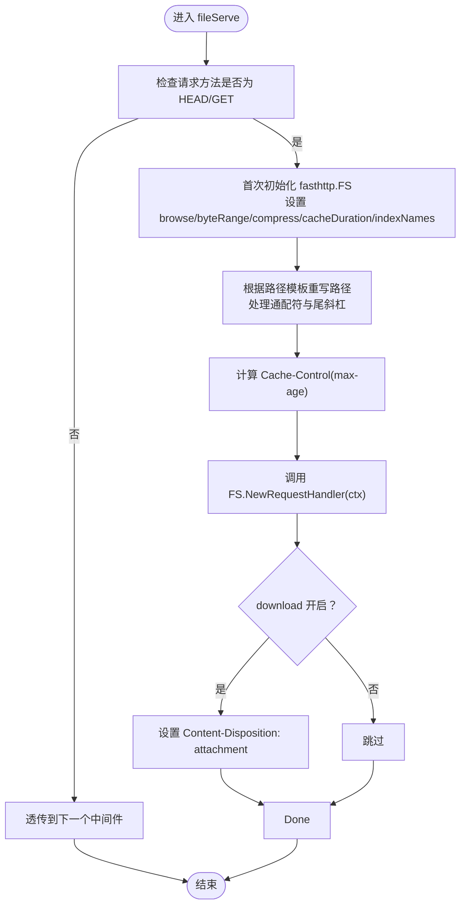
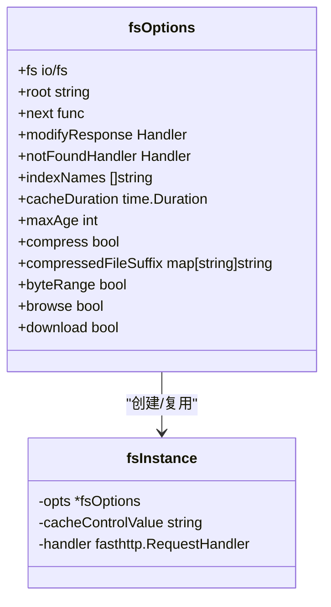
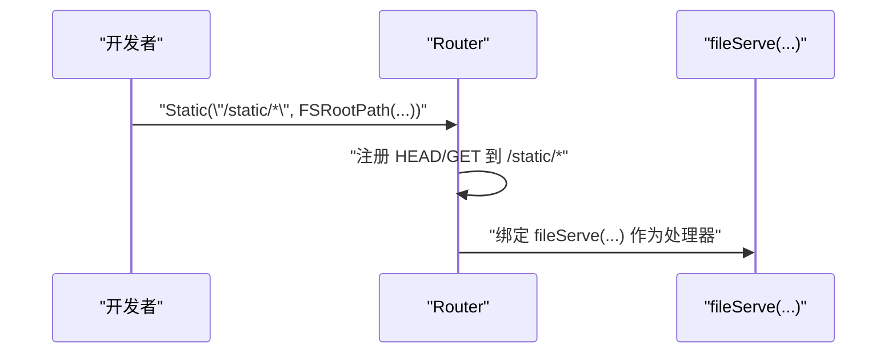
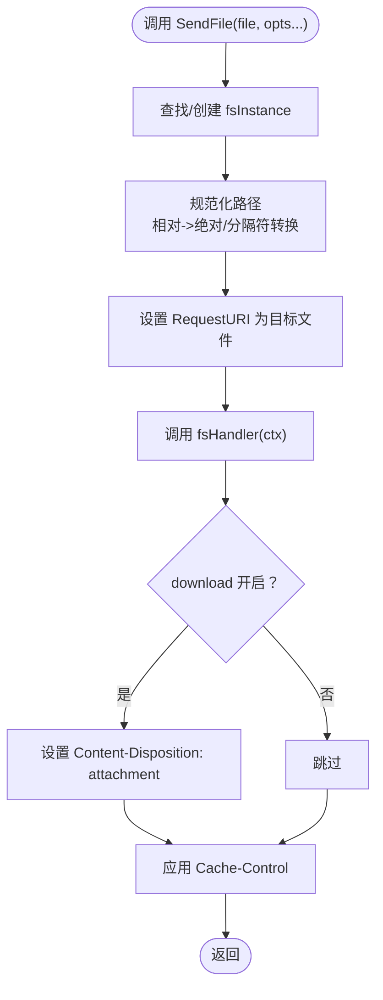
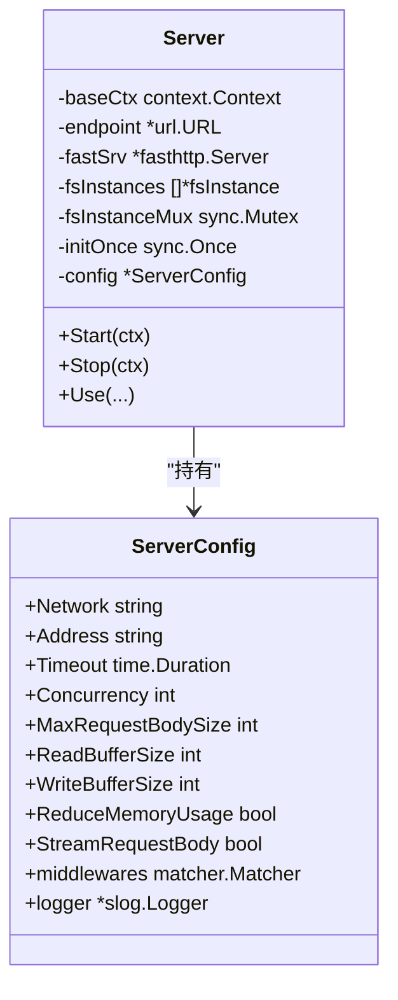
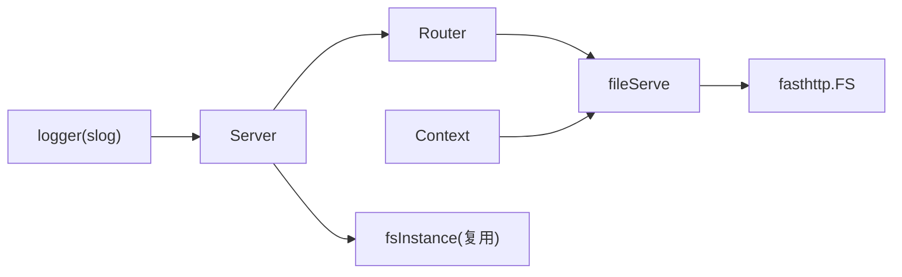

# 静态文件服务

<cite>
**本文引用的文件**
- [static.go](file://transport/http/static.go)
- [fsoptions.go](file://transport/http/fsoptions.go)
- [router.go](file://transport/http/router.go)
- [context.go](file://transport/http/context.go)
- [server.go](file://transport/http/server.go)
- [serveroptions.go](file://transport/http/serveroptions.go)
- [logger.go](file://transport/http/logger.go)
- [10086.txt](file://transport/http/static/10086.txt)
- [10086.json](file://transport/http/static/10086.json)
- [excel.xlsx](file://transport/http/static/excel.xlsx)
</cite>

## 目录
1. [简介](#简介)
2. [项目结构](#项目结构)
3. [核心组件](#核心组件)
4. [架构总览](#架构总览)
5. [详细组件分析](#详细组件分析)
6. [依赖关系分析](#依赖关系分析)
7. [性能考量](#性能考量)
8. [故障排查指南](#故障排查指南)
9. [结论](#结论)
10. [附录](#附录)

## 简介
本技术文档围绕 Go Fox 的 HTTP 静态文件服务进行深入解析，涵盖以下方面：
- 静态文件服务的实现机制：文件系统实例管理、路径映射与重写、响应头处理
- 配置选项详解：根目录、索引文件、缓存策略、压缩、字节范围、下载模式等
- 安全机制：路径规范化、根目录限制、访问控制与中间件集成
- 性能优化：文件缓存、压缩传输、并发与内存使用
- 文件上传/下载能力：基于表单的二进制文件上传、直接下载附件
- 日志与监控：内置日志适配、错误处理与可观测性

## 项目结构
静态文件服务位于 HTTP 传输层，核心文件如下：
- 路由注册与静态资源绑定：router.go
- 静态文件处理器与选项：static.go、fsoptions.go
- 请求上下文与文件发送：context.go
- HTTP 服务器与配置：server.go、serveroptions.go
- 日志适配：logger.go
- 示例静态资源：transport/http/static/*.txt、*.json、*.xlsx

**图表来源**
- [router.go](file://transport/http/router.go#L342-L348)
- [static.go](file://transport/http/static.go#L40-L168)
- [context.go](file://transport/http/context.go#L404-L532)
- [server.go](file://transport/http/server.go#L53-L133)
- [serveroptions.go](file://transport/http/serveroptions.go#L37-L77)
- [logger.go](file://transport/http/logger.go#L35-L42)

**章节来源**
- [router.go](file://transport/http/router.go#L342-L348)
- [static.go](file://transport/http/static.go#L40-L168)
- [context.go](file://transport/http/context.go#L404-L532)
- [server.go](file://transport/http/server.go#L53-L133)
- [serveroptions.go](file://transport/http/serveroptions.go#L37-L77)
- [logger.go](file://transport/http/logger.go#L35-L42)

## 核心组件
- 静态处理器 fileServe：封装 fasthttp.FS，支持路径重写、缓存控制、压缩、字节范围、下载模式等
- 静态选项 fsOptions：集中定义根目录、索引文件、缓存时长、压缩策略、下载开关等
- 路由器 Static 方法：将指定路径前缀绑定到静态处理器
- 上下文 SendFile：面向业务代码的文件直发接口，支持按需创建文件系统实例
- 服务器与配置：fasthttp 封装、超时、缓冲区大小、内存优化、TLS、中间件等
- 日志适配：将 fasthttp 日志桥接到 slog

**章节来源**
- [static.go](file://transport/http/static.go#L40-L168)
- [fsoptions.go](file://transport/http/fsoptions.go#L33-L167)
- [router.go](file://transport/http/router.go#L342-L348)
- [context.go](file://transport/http/context.go#L404-L532)
- [server.go](file://transport/http/server.go#L53-L133)
- [serveroptions.go](file://transport/http/serveroptions.go#L37-L77)
- [logger.go](file://transport/http/logger.go#L35-L42)

## 架构总览
静态文件服务在请求生命周期中的关键流转如下：

**图表来源**
- [router.go](file://transport/http/router.go#L342-L348)
- [static.go](file://transport/http/static.go#L40-L168)
- [context.go](file://transport/http/context.go#L404-L532)

## 详细组件分析

### 组件一：静态处理器 fileServe
- 功能要点
  - 仅对 HEAD/GET 方法生效，其他方法透传给下一个中间件
  - 使用 sync.Once 在首次请求时初始化 fasthttp.FS 实例
  - 路径重写：根据路由模板前缀裁剪请求路径，支持通配符前缀
  - 支持目录浏览、字节范围请求、压缩（含 Brotli）、缓存时长、索引文件名
  - 下载模式：通过 Content-Disposition attachment 强制下载
  - 自定义 404 处理器与响应修改钩子
- 关键行为
  - 当根为文件时，统一将路径重写为“/”
  - 若根为目录，去除前缀并确保以“/”结尾
  - 计算 Cache-Control 头部值（max-age）
  - 返回自定义 404 或回退到默认 OK 空体

**图表来源**
- [static.go](file://transport/http/static.go#L40-L168)

**章节来源**
- [static.go](file://transport/http/static.go#L40-L168)

### 组件二：静态选项 fsOptions 与工厂函数
- 选项清单
  - FS：io/fs 兼容文件系统（如 embed.FS、os.DirFS）
  - root：根目录或根文件路径
  - next：跳过中间件的条件函数
  - modifyResponse：响应修改钩子
  - notFoundHandler：自定义 404 处理器
  - indexNames：目录索引文件名列表
  - cacheDuration：文件处理器缓存时长（负数禁用缓存）
  - maxAge：Cache-Control 中 max-age 秒数
  - compress：启用压缩与 Brotli
  - compressedFileSuffix：压缩文件后缀映射
  - byteRange：启用字节范围请求
  - browse：启用目录浏览
  - download：启用下载模式
- 默认值
  - root="."
  - indexNames=["index.html"]
  - cacheDuration=10s
  - compressedFileSuffix={"gzip":".fox.gz","br":".fox.br","zstd":".fox.zst"}

**图表来源**
- [fsoptions.go](file://transport/http/fsoptions.go#L33-L167)

**章节来源**
- [fsoptions.go](file://transport/http/fsoptions.go#L33-L167)

### 组件三：路由器 Static 方法
- 将指定路径前缀绑定到静态处理器，同时注册 HEAD/GET 两个方法
- 路由模板用于计算前缀长度，从而正确重写请求路径

**图表来源**
- [router.go](file://transport/http/router.go#L342-L348)

**章节来源**
- [router.go](file://transport/http/router.go#L342-L348)

### 组件四：上下文 SendFile 与下载附件
- 作用
  - 面向业务代码的文件直发接口，内部按需创建/复用文件系统实例
  - 支持相对路径自动转绝对路径、跨平台路径分隔符转换
  - 可选下载模式（attachment），自动设置 Content-Type 与 Content-Disposition
  - 应用缓存控制头（Cache-Control）
- 错误处理
  - 文件不存在返回 404
  - 路径解析失败返回 500

**图表来源**
- [context.go](file://transport/http/context.go#L404-L532)

**章节来源**
- [context.go](file://transport/http/context.go#L404-L532)

### 组件五：服务器与配置
- 服务器
  - 基于 fasthttp.Server，支持并发、缓冲区大小、内存优化、请求体流式处理
  - 内置错误处理与日志适配
- 服务器配置
  - 网络、地址、TLS、超时、中间件、编码器/解码器、日志等
  - 提供 WithOption 与 Build 快速构建

**图表来源**
- [server.go](file://transport/http/server.go#L53-L133)
- [serveroptions.go](file://transport/http/serveroptions.go#L37-L77)

**章节来源**
- [server.go](file://transport/http/server.go#L53-L133)
- [serveroptions.go](file://transport/http/serveroptions.go#L37-L77)

### 组件六：日志适配
- 将 fasthttp.Logger 接口桥接至 slog，统一日志输出格式

**章节来源**
- [logger.go](file://transport/http/logger.go#L35-L42)

## 依赖关系分析
- 路由器依赖静态处理器；静态处理器依赖 fasthttp.FS；上下文提供 SendFile；服务器承载路由与配置；日志适配贯穿运行期
- 文件系统实例在服务器级共享，避免重复创建

**图表来源**
- [router.go](file://transport/http/router.go#L342-L348)
- [static.go](file://transport/http/static.go#L40-L168)
- [context.go](file://transport/http/context.go#L404-L532)
- [server.go](file://transport/http/server.go#L53-L133)
- [logger.go](file://transport/http/logger.go#L35-L42)

**章节来源**
- [router.go](file://transport/http/router.go#L342-L348)
- [static.go](file://transport/http/static.go#L40-L168)
- [context.go](file://transport/http/context.go#L404-L532)
- [server.go](file://transport/http/server.go#L53-L133)
- [logger.go](file://transport/http/logger.go#L35-L42)

## 性能考量
- 文件缓存
  - 通过 cacheDuration 控制文件处理器缓存时长；负值禁用缓存
  - 服务器级 fsInstances 复用，减少重复初始化开销
- 压缩传输
  - 启用 compress 与 Brotli 支持；可配置压缩文件后缀映射
  - 当未启用压缩时，会清理 Accept-Encoding 头以避免不必要的协商
- 并发与内存
  - fasthttp 并发模型与缓冲区配置；ReduceMemoryUsage 降低内存占用
  - StreamRequestBody 流式处理请求体，适合大文件上传
- 字节范围
  - byteRange 支持 Range 请求，提升断点续传体验

**章节来源**
- [fsoptions.go](file://transport/http/fsoptions.go#L63-L99)
- [static.go](file://transport/http/static.go#L78-L89)
- [context.go](file://transport/http/context.go#L467-L471)
- [serveroptions.go](file://transport/http/serveroptions.go#L128-L168)

## 故障排查指南
- 404 未找到
  - 静态处理器：当路径不存在时返回 404；可提供自定义 notFoundHandler
  - SendFile：若 fsStatus 为 404 且原始状态非 404，返回 404 错误
- 500 路径解析失败
  - SendFile：相对路径转绝对路径失败时返回 500
- 缓存与压缩异常
  - 检查 cacheDuration 与 maxAge；确认压缩开关与后缀映射
- 下载模式无效
  - 确认 download 选项已开启；检查 Content-Disposition 是否被后续中间件覆盖
- 日志定位
  - 服务器启动监听、停止日志；fasthttp 错误通过内置错误处理器转换为统一错误对象

**章节来源**
- [static.go](file://transport/http/static.go#L90-L93)
- [context.go](file://transport/http/context.go#L514-L516)
- [server.go](file://transport/http/server.go#L212-L228)
- [server.go](file://transport/http/server.go#L153-L174)

## 结论
Go Fox 的静态文件服务以 fasthttp.FS 为核心，结合路由与上下文，提供了高并发、低内存占用的静态资源服务能力。通过灵活的配置选项与安全机制（路径规范化、可选下载、自定义 404），满足生产环境的多样化需求。配合压缩、缓存与字节范围支持，进一步优化传输效率与用户体验。

## 附录

### 配置项一览（静态文件服务）
- 根目录：FSRootPath(root)
- 索引文件：indexNames（默认 ["index.html"]）
- 缓存策略：cacheDuration（秒），maxAge（秒）
- 压缩：compress，compressedFileSuffix 映射
- 功能开关：browse（目录浏览），byteRange（字节范围），download（强制下载）
- 高级：fs（io/fs 兼容文件系统），next（跳过条件），modifyResponse（响应修改），notFoundHandler（自定义 404）

**章节来源**
- [fsoptions.go](file://transport/http/fsoptions.go#L33-L167)
- [static.go](file://transport/http/static.go#L78-L89)

### 部署建议
- 生产环境建议
  - 启用压缩与合适的缓存时长
  - 使用 io/fs（如 embed.FS）将静态资源打包进二进制，简化部署
  - 通过中间件实现访问控制与鉴权
  - 配置合理的并发与缓冲区大小，结合 ReduceMemoryUsage
- 安全建议
  - 严格限制 root 范围，避免暴露敏感目录
  - 使用 download 选项控制可下载文件范围
  - 对外暴露的静态目录不启用 browse

**章节来源**
- [serveroptions.go](file://transport/http/serveroptions.go#L128-L168)
- [static.go](file://transport/http/static.go#L78-L89)

### 示例静态资源
- 文本文件：10086.txt
- JSON 文件：10086.json
- Excel 文件：excel.xlsx

**章节来源**
- [10086.txt](file://transport/http/static/10086.txt#L1-L2)
- [10086.json](file://transport/http/static/10086.json)
- [excel.xlsx](file://transport/http/static/excel.xlsx)