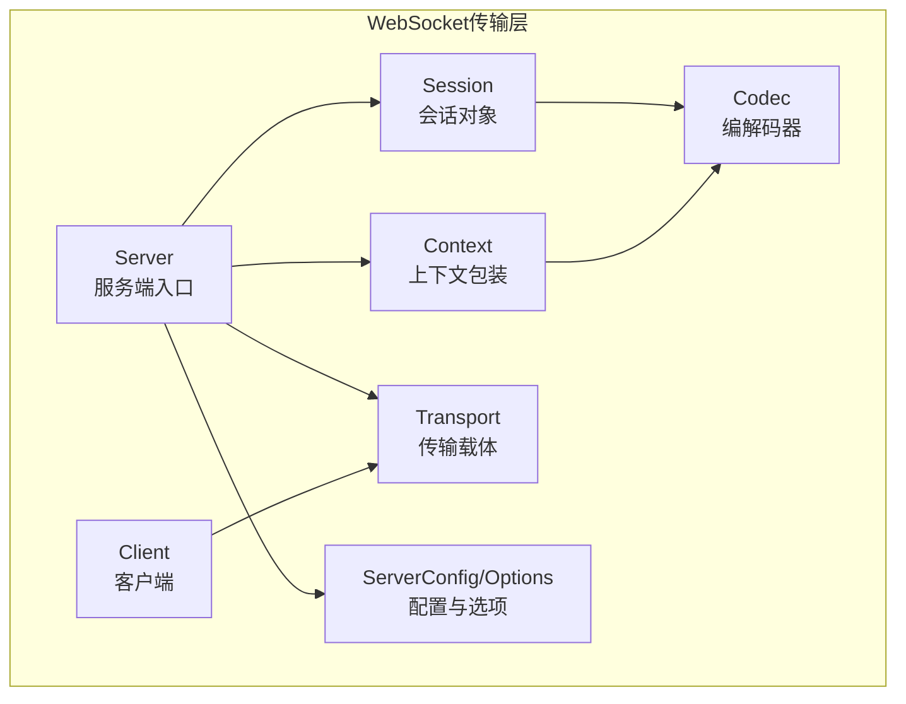
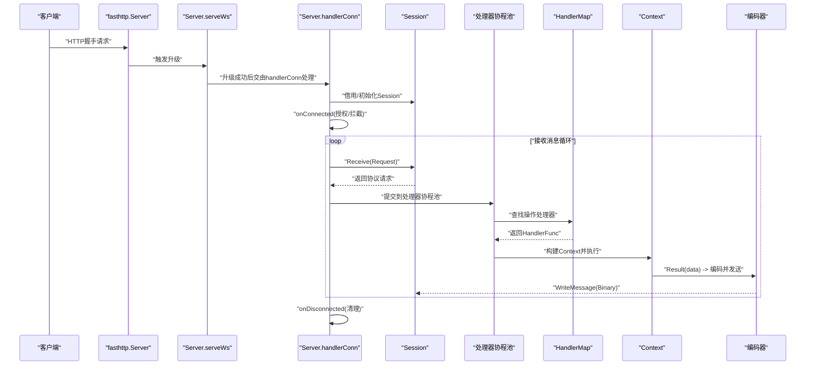
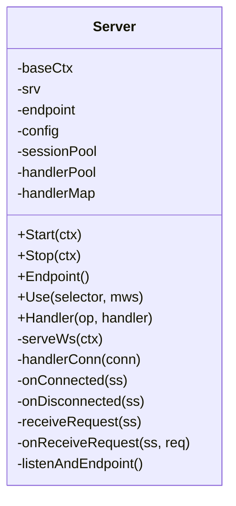
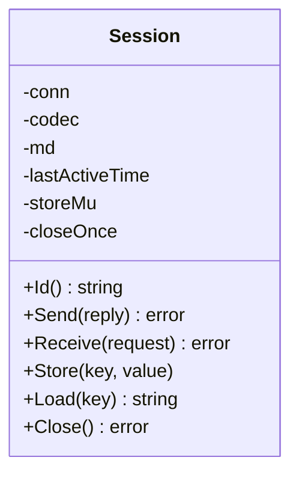
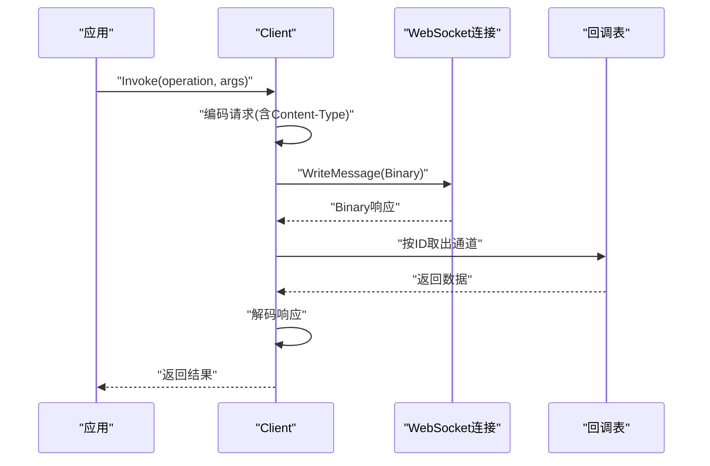
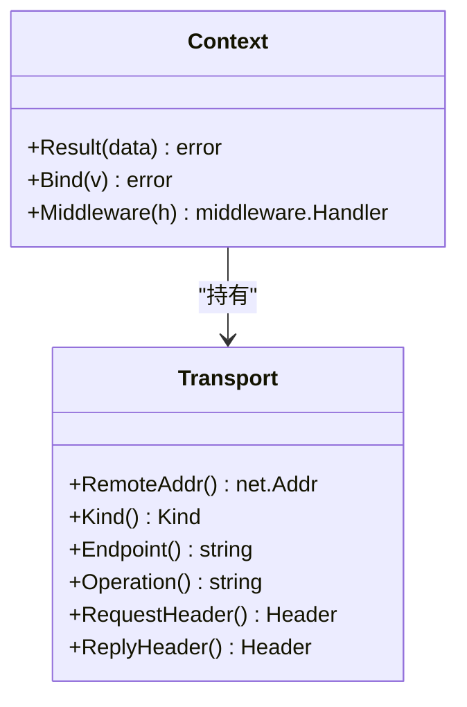
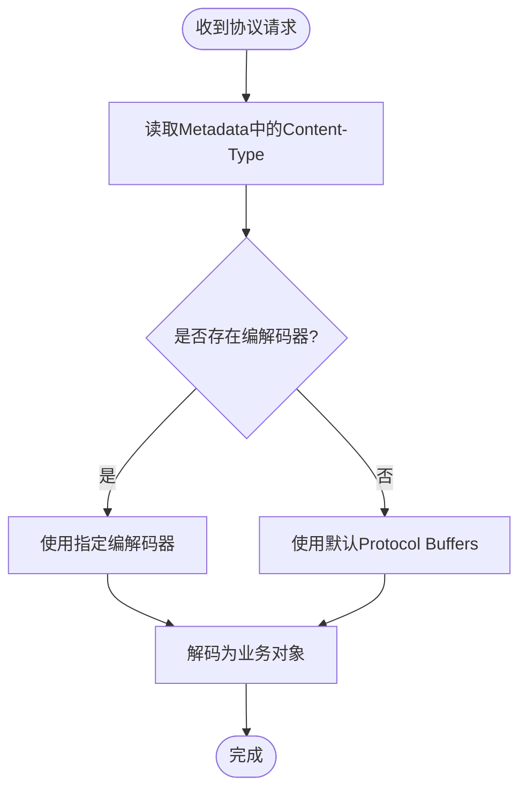
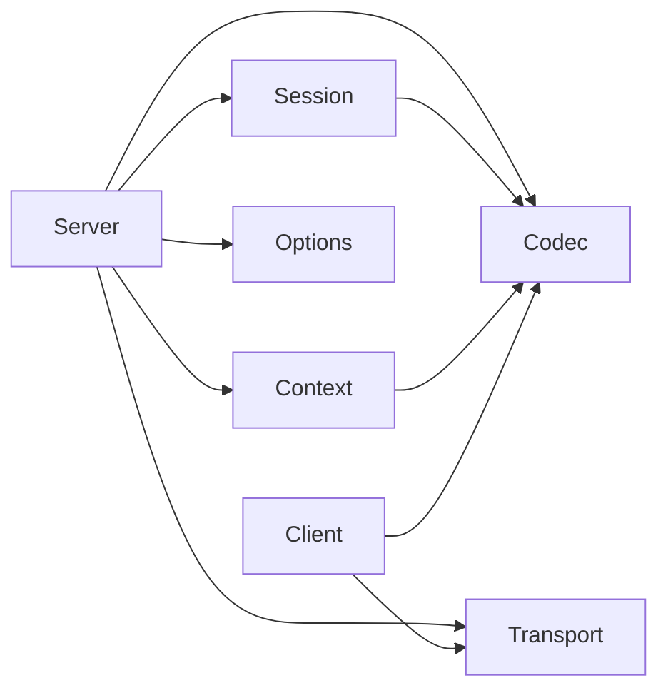

# WebSocket服务器实现

<cite>
**本文引用的文件**
- [transport/websocket/server.go](file://transport/websocket/server.go)
- [transport/websocket/session.go](file://transport/websocket/session.go)
- [transport/websocket/client.go](file://transport/websocket/client.go)
- [transport/websocket/codec.go](file://transport/websocket/codec.go)
- [transport/websocket/serveroption.go](file://transport/websocket/serveroption.go)
- [transport/websocket/context.go](file://transport/websocket/context.go)
- [transport/websocket/transport.go](file://transport/websocket/transport.go)
- [transport/websocket/clientoption.go](file://transport/websocket/clientoption.go)
- [transport/websocket/calloption.go](file://transport/websocket/calloption.go)
- [transport/websocket/handler.go](file://transport/websocket/handler.go)
</cite>

## 目录
1. [引言](#引言)
2. [项目结构](#项目结构)
3. [核心组件](#核心组件)
4. [架构总览](#架构总览)
5. [组件详解](#组件详解)
6. [依赖关系分析](#依赖关系分析)
7. [性能考量](#性能考量)
8. [故障排查指南](#故障排查指南)
9. [结论](#结论)
10. [附录](#附录)

## 引言
本文件面向Go Fox框架中的WebSocket子系统，提供从协议实现到运行时管理的完整技术文档。内容覆盖：
- WebSocket协议实现与连接管理机制
- 会话生命周期（建立、消息收发、断开）
- 消息编解码与多格式支持
- 客户端与服务端的会话维护
- 与HTTP协议的差异与兼容处理
- 配置项与性能调优
- 实际应用场景与最佳实践
- 错误处理、重连与心跳等高级能力

## 项目结构
WebSocket相关代码集中在transport/websocket目录，采用“按功能分层”的组织方式：
- 服务端：Server、Session、上下文与传输载体
- 客户端：Client、请求/响应编解码与回调管理
- 编解码：默认编解码器与内容类型协商
- 配置：ServerConfig与各类ServerOption
- 传输接口：统一的Transporter接口与Header承载

图表来源
- [transport/websocket/server.go](file://transport/websocket/server.go#L56-L114)
- [transport/websocket/session.go](file://transport/websocket/session.go#L55-L86)
- [transport/websocket/context.go](file://transport/websocket/context.go#L45-L87)
- [transport/websocket/transport.go](file://transport/websocket/transport.go#L43-L79)
- [transport/websocket/client.go](file://transport/websocket/client.go#L49-L86)
- [transport/websocket/codec.go](file://transport/websocket/codec.go#L33-L88)
- [transport/websocket/serveroption.go](file://transport/websocket/serveroption.go#L50-L93)

章节来源
- [transport/websocket/server.go](file://transport/websocket/server.go#L1-L302)
- [transport/websocket/session.go](file://transport/websocket/session.go#L1-L166)
- [transport/websocket/client.go](file://transport/websocket/client.go#L1-L204)
- [transport/websocket/codec.go](file://transport/websocket/codec.go#L1-L89)
- [transport/websocket/serveroption.go](file://transport/websocket/serveroption.go#L1-L193)
- [transport/websocket/context.go](file://transport/websocket/context.go#L1-L88)
- [transport/websocket/transport.go](file://transport/websocket/transport.go#L1-L120)
- [transport/websocket/clientoption.go](file://transport/websocket/clientoption.go#L1-L110)
- [transport/websocket/calloption.go](file://transport/websocket/calloption.go#L1-L51)
- [transport/websocket/handler.go](file://transport/websocket/handler.go#L1-L31)

## 核心组件
- Server：基于fasthttp的WebSocket服务端，负责监听、升级、会话分发与请求处理
- Session：单个客户端连接的会话抽象，封装底层连接、元数据、编解码与活跃时间
- Client：WebSocket客户端，支持请求编码、发送、回调等待与响应解码
- Context：处理器上下文，提供Result/Bind能力与中间件链
- Transport：传输载体，暴露远端地址、操作名、请求/响应头等
- Codec：编解码器，默认使用Protocol Buffers，支持通过Content-Type动态选择
- ServerConfig/Options：服务端配置与可插拔扩展点（授权、拦截器、中间件、超时、TLS等）

章节来源
- [transport/websocket/server.go](file://transport/websocket/server.go#L56-L114)
- [transport/websocket/session.go](file://transport/websocket/session.go#L55-L166)
- [transport/websocket/client.go](file://transport/websocket/client.go#L49-L204)
- [transport/websocket/context.go](file://transport/websocket/context.go#L45-L88)
- [transport/websocket/transport.go](file://transport/websocket/transport.go#L43-L120)
- [transport/websocket/codec.go](file://transport/websocket/codec.go#L33-L89)
- [transport/websocket/serveroption.go](file://transport/websocket/serveroption.go#L50-L193)

## 架构总览
WebSocket在Go Fox中以“传输层”形式存在，既可作为独立服务，也可嵌入到更上层的服务框架中。其关键流程如下：

图表来源
- [transport/websocket/server.go](file://transport/websocket/server.go#L161-L282)
- [transport/websocket/session.go](file://transport/websocket/session.go#L108-L139)
- [transport/websocket/context.go](file://transport/websocket/context.go#L60-L87)
- [transport/websocket/codec.go](file://transport/websocket/codec.go#L42-L66)

## 组件详解

### 服务端Server
- 职责
  - 监听网络地址，启动fasthttp服务
  - 处理HTTP到WebSocket的升级请求
  - 管理会话生命周期与请求分发
  - 提供中间件、授权、拦截器等扩展点
- 关键点
  - 使用FastHTTPUpgrader进行升级，支持读写缓冲区配置
  - 会话与请求处理分别使用独立的goroutine池，避免阻塞
  - 支持TLS证书加载与HTTPS监听
  - 通过HandlerMap按Operation路由到具体处理器

图表来源
- [transport/websocket/server.go](file://transport/websocket/server.go#L56-L301)

章节来源
- [transport/websocket/server.go](file://transport/websocket/server.go#L67-L149)
- [transport/websocket/serveroption.go](file://transport/websocket/serveroption.go#L77-L193)

### 会话Session
- 职责
  - 封装底层websocket.Conn，提供Send/Receive
  - 维护会话元数据（metadata）、活跃时间、唯一ID
  - 通过编解码器对请求/响应进行序列化/反序列化
- 关键点
  - 使用对象池复用Session实例，降低GC压力
  - Receive在读取到二进制帧后解码为协议请求
  - Send将响应编码为字节并写入二进制帧
  - Close保证幂等关闭

图表来源
- [transport/websocket/session.go](file://transport/websocket/session.go#L55-L166)

章节来源
- [transport/websocket/session.go](file://transport/websocket/session.go#L67-L166)

### 客户端Client
- 职责
  - 建立WebSocket连接，维护回调映射
  - 编码请求、发送二进制帧、等待响应并解码
  - 支持中间件链与超时控制
- 关键点
  - 通过回调通道按请求ID匹配响应
  - 默认使用Protocol Buffers编解码
  - 支持自定义编码器/解码器与内容类型

图表来源
- [transport/websocket/client.go](file://transport/websocket/client.go#L88-L154)
- [transport/websocket/clientoption.go](file://transport/websocket/clientoption.go#L41-L71)

章节来源
- [transport/websocket/client.go](file://transport/websocket/client.go#L63-L204)
- [transport/websocket/clientoption.go](file://transport/websocket/clientoption.go#L73-L110)

### 上下文Context与传输Transport
- Context
  - 包装标准Context，提供Result(data)与Bind(v)能力
  - 通过中间件链增强处理逻辑
- Transport
  - 暴露RemoteAddr、Kind、Endpoint、Operation
  - RequestHeader/ReplyHeader以键值形式承载元数据

图表来源
- [transport/websocket/context.go](file://transport/websocket/context.go#L45-L87)
- [transport/websocket/transport.go](file://transport/websocket/transport.go#L43-L120)

章节来源
- [transport/websocket/context.go](file://transport/websocket/context.go#L45-L88)
- [transport/websocket/transport.go](file://transport/websocket/transport.go#L43-L120)

### 编解码Codec与内容类型
- 默认编解码器
  - 默认使用Protocol Buffers
  - 可通过请求元数据中的Content-Type动态切换
- 请求解码
  - 依据Content-Type选择对应编解码器
- 响应编码
  - 将返回值编码为二进制帧并设置Content-Type元数据

图表来源
- [transport/websocket/codec.go](file://transport/websocket/codec.go#L68-L88)

章节来源
- [transport/websocket/codec.go](file://transport/websocket/codec.go#L33-L89)

### 配置与选项
- ServerConfig字段
  - 网络、地址、TLS证书、读写缓冲区
  - 会话池大小、处理器池大小、超时
  - 授权、连接/断开拦截器、中间件匹配器
  - 默认编解码器、请求/响应/错误编码器
- 常用ServerOption
  - TLSConfig、Codec、Authorization、OnConnected/Disconnected
  - Network、Address、Middleware/AddMiddleware
  - SessionPoolSize、HandlerPoolSize、Timeout、Upgrader、Logger

章节来源
- [transport/websocket/serveroption.go](file://transport/websocket/serveroption.go#L50-L193)

## 依赖关系分析
- 组件耦合
  - Server依赖Session池、处理器池、HandlerMap、编解码器与中间件
  - Session依赖底层websocket.Conn与编解码器
  - Client依赖WebSocket连接、回调表、编解码器与中间件
  - Context与Transport贯穿请求处理链
- 外部依赖
  - fasthttp/websocket用于协议升级与消息收发
  - ants/v2用于协程池
  - go-fox内部codec、errors、transport等模块

图表来源
- [transport/websocket/server.go](file://transport/websocket/server.go#L56-L114)
- [transport/websocket/session.go](file://transport/websocket/session.go#L55-L86)
- [transport/websocket/client.go](file://transport/websocket/client.go#L49-L86)
- [transport/websocket/context.go](file://transport/websocket/context.go#L45-L87)
- [transport/websocket/transport.go](file://transport/websocket/transport.go#L43-L79)
- [transport/websocket/codec.go](file://transport/websocket/codec.go#L33-L88)
- [transport/websocket/serveroption.go](file://transport/websocket/serveroption.go#L50-L93)

## 性能考量
- 协程池
  - 会话池与处理器池默认设为最大整型，实际部署需根据CPU与内存限制合理设置
  - 建议结合QPS与消息大小评估，避免过度并发导致上下文切换开销
- 缓冲区
  - FastHTTPUpgrader的读写缓冲区默认2KB，可根据消息体大小调整
- 对象池
  - Session与Context均使用对象池减少GC压力
- 编解码
  - Protocol Buffers在二进制体积与性能上表现良好，适合高频实时场景
- TLS
  - 启用TLS会增加CPU消耗，建议配合硬件加速或合理的证书缓存策略

## 故障排查指南
- 常见错误与定位
  - 升级失败：检查HTTP状态码与日志输出，确认路径与头部正确
  - 接收异常：区分客户端主动关闭与网络错误，客户端主动关闭会返回特定错误类型
  - 处理器未找到：确认HandlerMap是否注册了对应Operation
  - 编解码失败：核对Content-Type与编解码器一致性
- 日志与监控
  - 服务端在关键路径记录错误堆栈，便于快速定位
  - 可通过中间件注入统计与追踪
- 断线与重连
  - 客户端侧可在连接断开后进行指数退避重连
  - 服务端侧可通过拦截器实现限流与熔断

章节来源
- [transport/websocket/server.go](file://transport/websocket/server.go#L161-L196)
- [transport/websocket/session.go](file://transport/websocket/session.go#L108-L139)
- [transport/websocket/client.go](file://transport/websocket/client.go#L156-L173)

## 结论
Go Fox的WebSocket实现以清晰的分层与可插拔设计为核心，兼顾易用性与高性能。通过Server/Session/Client三者协作，结合编解码器与传输载体，能够满足多样化的实时通信需求。建议在生产环境中结合业务流量特征，合理配置协程池、缓冲区与编解码策略，并配套完善的监控与告警体系。

## 附录

### WebSocket与HTTP协议区别与兼容
- 协议差异
  - HTTP为请求-响应模式；WebSocket为全双工长连接
  - 握手阶段通过Upgrade头完成协议切换
- 兼容处理
  - 服务端仍可同时提供HTTP静态资源与WebSocket服务
  - 通过不同路径或中间件策略区分处理逻辑

章节来源
- [transport/websocket/server.go](file://transport/websocket/server.go#L161-L166)
- [transport/websocket/transport.go](file://transport/websocket/transport.go#L56-L79)

### 配置项速查
- 服务端
  - Network/Address：监听网络与地址
  - SessionPoolSize/HandlerPoolSize：会话与处理器协程池大小
  - Timeout：请求处理超时
  - TLS证书：CertFile/KeyFile或直接传入tls.Config
  - Upgrader：读写缓冲区
  - 中间件：Middleware/AddMiddleware
  - 授权与拦截器：Authorization/OnConnected/OnDisconnected
- 客户端
  - WithEndpoint：目标地址
  - WithTimeout：请求超时
  - WithCodec/WithRequestEncoder/WithResponseDecoder：编解码定制

章节来源
- [transport/websocket/serveroption.go](file://transport/websocket/serveroption.go#L77-L193)
- [transport/websocket/clientoption.go](file://transport/websocket/clientoption.go#L73-L110)

### 实际应用场景与示例路径
- 实时聊天室
  - 服务端注册消息广播处理器，客户端订阅频道并发送消息
  - 示例路径参考：[服务端处理器注册](file://transport/websocket/server.go#L156-L159)
- 实时推送
  - 服务端按用户会话ID定向推送，客户端按Operation处理
  - 示例路径参考：[会话元数据存储](file://transport/websocket/session.go#L141-L157)
- RPC风格调用
  - 客户端通过Invoke发起请求，服务端按Operation路由到处理器
  - 示例路径参考：[客户端调用流程](file://transport/websocket/client.go#L88-L154)