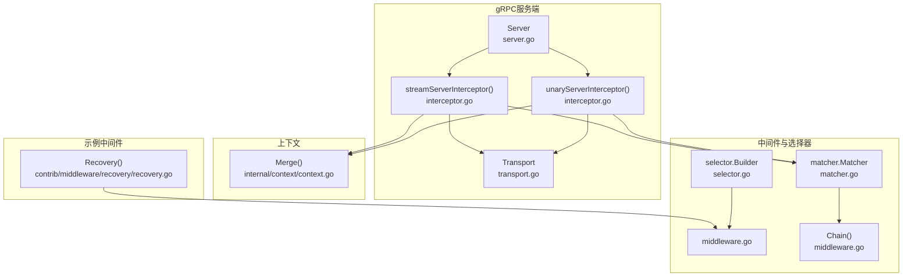
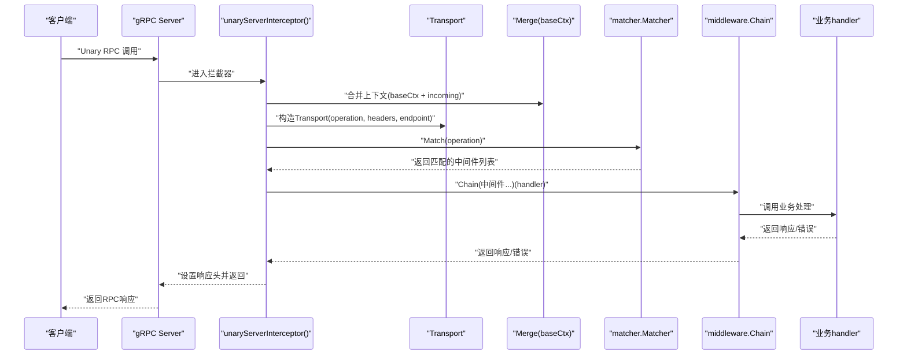
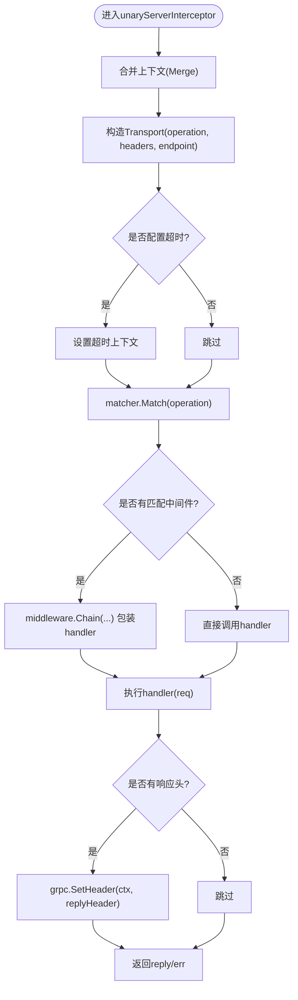
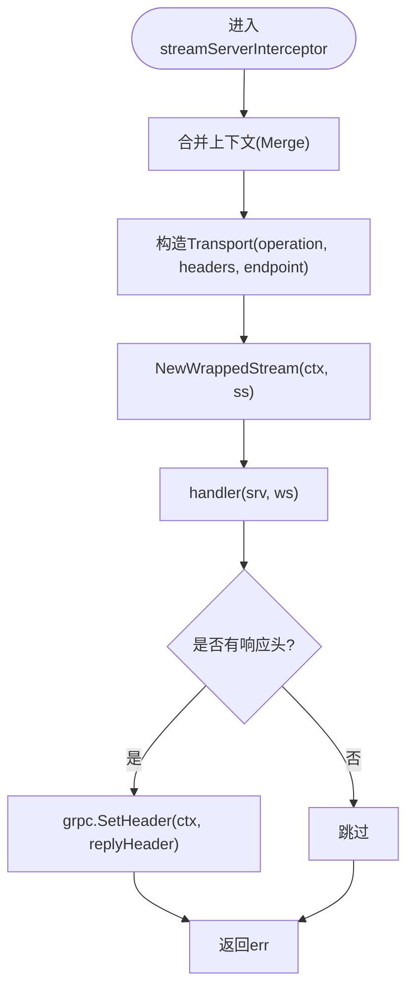
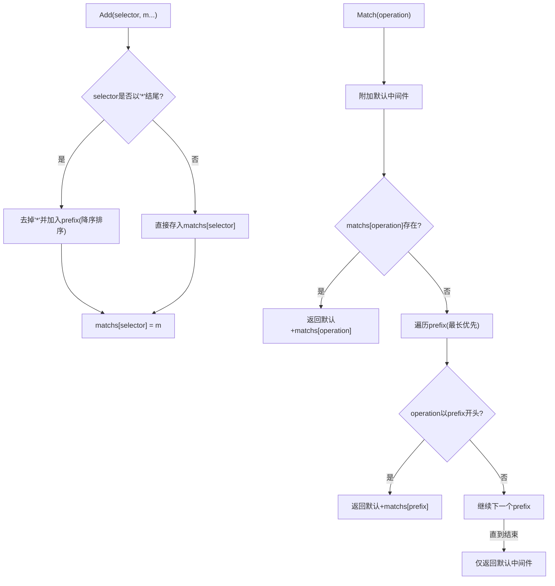
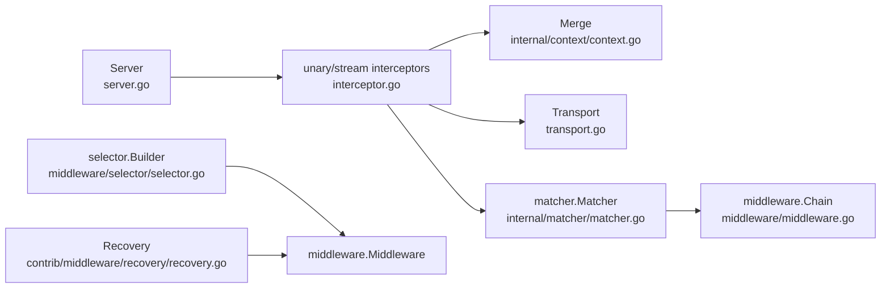

# gRPC拦截器机制

<cite>
**本文引用的文件列表**
- [transport/grpc/interceptor.go](file://transport/grpc/interceptor.go)
- [transport/grpc/server.go](file://transport/grpc/server.go)
- [transport/grpc/options.go](file://transport/grpc/options.go)
- [transport/grpc/transport.go](file://transport/grpc/transport.go)
- [internal/matcher/matcher.go](file://internal/matcher/matcher.go)
- [middleware/selector/selector.go](file://middleware/selector/selector.go)
- [middleware/middleware.go](file://middleware/middleware.go)
- [internal/context/context.go](file://internal/context/context.go)
- [contrib/middleware/recovery/recovery.go](file://contrib/middleware/recovery/recovery.go)
</cite>

## 目录
1. [简介](#简介)
2. [项目结构](#项目结构)
3. [核心组件](#核心组件)
4. [架构总览](#架构总览)
5. [组件详解](#组件详解)
6. [依赖关系分析](#依赖关系分析)
7. [性能与并发特性](#性能与并发特性)
8. [故障排查与调试](#故障排查与调试)
9. [结论](#结论)
10. [附录：通配符匹配规则与示例](#附录通配符匹配规则与示例)

## 简介
本文件面向Go Fox框架中的gRPC拦截器系统，系统性阐述：
- 拦截器工作原理与执行流程
- UnaryServerInterceptor与StreamServerInterceptor的差异与适用场景
- 拦截器链的构建机制与执行顺序
- matcher.Matcher在拦截器选择中的作用与通配符匹配规则
- 自定义拦截器/中间件的开发指南与最佳实践
- 上下文传递、错误处理与性能考量
- 调试与监控建议

## 项目结构
围绕gRPC拦截器的关键代码主要位于以下模块：
- transport/grpc：gRPC服务端、拦截器、传输层封装
- internal/matcher：基于选择器的中间件匹配器
- middleware：通用中间件抽象与链式组合
- internal/context：上下文合并工具
- contrib/middleware/recovery：恢复型中间件示例

图表来源
- [transport/grpc/server.go](file://transport/grpc/server.go#L50-L119)
- [transport/grpc/interceptor.go](file://transport/grpc/interceptor.go#L39-L119)
- [transport/grpc/transport.go](file://transport/grpc/transport.go#L39-L82)
- [internal/matcher/matcher.go](file://internal/matcher/matcher.go#L33-L88)
- [middleware/selector/selector.go](file://middleware/selector/selector.go#L27-L82)
- [middleware/middleware.go](file://middleware/middleware.go#L28-L66)
- [internal/context/context.go](file://internal/context/context.go#L45-L90)
- [contrib/middleware/recovery/recovery.go](file://contrib/middleware/recovery/recovery.go#L53-L79)

章节来源
- [transport/grpc/server.go](file://transport/grpc/server.go#L50-L119)
- [transport/grpc/interceptor.go](file://transport/grpc/interceptor.go#L39-L119)
- [transport/grpc/transport.go](file://transport/grpc/transport.go#L39-L82)
- [internal/matcher/matcher.go](file://internal/matcher/matcher.go#L33-L88)
- [middleware/selector/selector.go](file://middleware/selector/selector.go#L27-L82)
- [middleware/middleware.go](file://middleware/middleware.go#L28-L66)
- [internal/context/context.go](file://internal/context/context.go#L45-L90)
- [contrib/middleware/recovery/recovery.go](file://contrib/middleware/recovery/recovery.go#L53-L79)

## 核心组件
- Server：gRPC服务端，负责拦截器注册、健康检查、监听与启动
- unaryServerInterceptor/streamServerInterceptor：分别包装Unary/Stream请求，注入Transport上下文并按选择器匹配中间件
- matcher.Matcher：根据operation字符串进行匹配，支持“默认中间件”和“前缀匹配”
- middleware.Chain：将多个中间件按逆序组合成拦截器链
- Transport：承载operation、headers、endpoint、remoteAddr等传输信息
- internal/context.Merge：合并两个上下文，确保超时、取消信号正确传播

章节来源
- [transport/grpc/server.go](file://transport/grpc/server.go#L50-L119)
- [transport/grpc/interceptor.go](file://transport/grpc/interceptor.go#L39-L119)
- [transport/grpc/transport.go](file://transport/grpc/transport.go#L39-L82)
- [internal/matcher/matcher.go](file://internal/matcher/matcher.go#L33-L88)
- [middleware/middleware.go](file://middleware/middleware.go#L54-L66)
- [internal/context/context.go](file://internal/context/context.go#L45-L90)

## 架构总览
下面的序列图展示了Unary请求从进入gRPC服务端到执行业务处理的完整链路，以及中间件链的装配与执行时机。

图表来源
- [transport/grpc/interceptor.go](file://transport/grpc/interceptor.go#L40-L77)
- [transport/grpc/server.go](file://transport/grpc/server.go#L69-L119)
- [internal/context/context.go](file://internal/context/context.go#L45-L90)
- [internal/matcher/matcher.go](file://internal/matcher/matcher.go#L74-L88)
- [middleware/middleware.go](file://middleware/middleware.go#L54-L66)

## 组件详解

### 1) Server与拦截器注册
- Server在初始化时创建Unary与Stream拦截器切片，并通过grpc.ChainUnaryInterceptor/ChainStreamInterceptor串联
- 默认拦截器由Server内部实现，随后可追加外部拦截器
- 提供Use(selector, ...middleware)用于按选择器绑定中间件

章节来源
- [transport/grpc/server.go](file://transport/grpc/server.go#L69-L119)
- [transport/grpc/server.go](file://transport/grpc/server.go#L129-L136)

### 2) UnaryServerInterceptor执行流程
- 合并incoming上下文与baseCtx，确保生命周期与超时策略一致
- 从gRPC元数据中提取请求头，构造Transport并注入Server上下文
- 若配置了全局超时，为当前请求设置超时上下文
- 通过matcher.Matcher按operation匹配中间件，若存在则用middleware.Chain逆序组合
- 调用原始handler并设置响应头

图表来源
- [transport/grpc/interceptor.go](file://transport/grpc/interceptor.go#L40-L77)
- [internal/context/context.go](file://internal/context/context.go#L45-L90)
- [internal/matcher/matcher.go](file://internal/matcher/matcher.go#L74-L88)
- [middleware/middleware.go](file://middleware/middleware.go#L54-L66)

章节来源
- [transport/grpc/interceptor.go](file://transport/grpc/interceptor.go#L40-L77)

### 3) StreamServerInterceptor执行流程
- 合并incoming上下文与baseCtx
- 构造Transport并注入Server上下文
- 将ServerStream包装为新的Stream，使其Context返回已注入Transport的上下文
- 调用原始handler，最后设置响应头

图表来源
- [transport/grpc/interceptor.go](file://transport/grpc/interceptor.go#L97-L119)

章节来源
- [transport/grpc/interceptor.go](file://transport/grpc/interceptor.go#L97-L119)

### 4) matcher.Matcher匹配机制
- 支持默认中间件Use与按selector添加中间件Add
- Add时对以“*”结尾的选择器去除“*”，记录为前缀集合并降序排序，优先匹配更长的前缀
- Match时先附加默认中间件，再按精确匹配或前缀匹配返回中间件列表

图表来源
- [internal/matcher/matcher.go](file://internal/matcher/matcher.go#L60-L88)

章节来源
- [internal/matcher/matcher.go](file://internal/matcher/matcher.go#L33-L88)

### 5) 中间件链与上下文传递
- middleware.Chain采用逆序组合，即最靠近handler的中间件最先执行
- internal/context.Merge确保incoming与baseCtx的Deadline、Cancel、Value正确合并
- Transport在Server上下文中携带operation、headers、endpoint、remoteAddr，便于中间件读取

章节来源
- [middleware/middleware.go](file://middleware/middleware.go#L54-L66)
- [internal/context/context.go](file://internal/context/context.go#L45-L90)
- [transport/grpc/transport.go](file://transport/grpc/transport.go#L39-L82)

### 6) 自定义拦截器与中间件开发指南
- 定义中间件：实现middleware.Middleware类型，接收一个Handler并返回另一个Handler
- 组合中间件：使用middleware.Chain将多个中间件按需要顺序组合
- 选择器中间件：可参考selector.Builder，支持前缀、路径、正则与自定义Match函数
- 示例中间件：contrib/middleware/recovery提供了异常恢复与日志记录的中间件模板

章节来源
- [middleware/middleware.go](file://middleware/middleware.go#L28-L66)
- [middleware/selector/selector.go](file://middleware/selector/selector.go#L27-L127)
- [contrib/middleware/recovery/recovery.go](file://contrib/middleware/recovery/recovery.go#L53-L79)

### 7) 错误处理与性能考虑
- 错误处理：在中间件中捕获panic并通过Recovery中间件统一转换为标准错误；可在中间件中记录延迟、堆栈等信息
- 性能：避免在中间件中做昂贵的同步操作；合理使用context超时；尽量减少不必要的header拷贝与字符串拼接

章节来源
- [contrib/middleware/recovery/recovery.go](file://contrib/middleware/recovery/recovery.go#L53-L79)

## 依赖关系分析
- Server依赖matcher.Matcher进行中间件选择
- 拦截器依赖internal/context.Merge进行上下文合并
- Transport作为上下文载体，贯穿拦截器与业务处理
- middleware.Chain提供统一的中间件组合能力

图表来源
- [transport/grpc/server.go](file://transport/grpc/server.go#L69-L119)
- [transport/grpc/interceptor.go](file://transport/grpc/interceptor.go#L39-L119)
- [internal/context/context.go](file://internal/context/context.go#L45-L90)
- [transport/grpc/transport.go](file://transport/grpc/transport.go#L39-L82)
- [internal/matcher/matcher.go](file://internal/matcher/matcher.go#L33-L88)
- [middleware/middleware.go](file://middleware/middleware.go#L54-L66)
- [middleware/selector/selector.go](file://middleware/selector/selector.go#L27-L127)
- [contrib/middleware/recovery/recovery.go](file://contrib/middleware/recovery/recovery.go#L53-L79)

章节来源
- [transport/grpc/server.go](file://transport/grpc/server.go#L69-L119)
- [transport/grpc/interceptor.go](file://transport/grpc/interceptor.go#L39-L119)
- [internal/context/context.go](file://internal/context/context.go#L45-L90)
- [transport/grpc/transport.go](file://transport/grpc/transport.go#L39-L82)
- [internal/matcher/matcher.go](file://internal/matcher/matcher.go#L33-L88)
- [middleware/middleware.go](file://middleware/middleware.go#L54-L66)
- [middleware/selector/selector.go](file://middleware/selector/selector.go#L27-L127)
- [contrib/middleware/recovery/recovery.go](file://contrib/middleware/recovery/recovery.go#L53-L79)

## 性能与并发特性
- 上下文合并：Merge在两个父上下文任一完成时触发，避免重复等待，降低阻塞风险
- 中间件链：Chain逆序组合，保证中间件执行顺序符合预期；建议将高频低成本中间件置于链前端
- 超时控制：拦截器可为每个请求设置独立超时，防止慢请求拖垮服务
- Header传递：响应头在拦截器链末端设置，避免重复设置带来的开销

章节来源
- [internal/context/context.go](file://internal/context/context.go#L45-L90)
- [middleware/middleware.go](file://middleware/middleware.go#L54-L66)
- [transport/grpc/interceptor.go](file://transport/grpc/interceptor.go#L61-L64)

## 故障排查与调试
- 开启健康检查：默认注册健康检查服务，可通过配置关闭
- 记录启动地址：Server.Start会输出监听地址，便于定位
- 异常恢复：使用Recovery中间件捕获panic并记录堆栈，统一返回错误
- 调试建议：
  - 在关键中间件中记录operation、耗时、请求头关键字段
  - 使用selector.Builder的Match函数自定义复杂匹配逻辑
  - 对长前缀匹配进行性能评估，必要时拆分选择器

章节来源
- [transport/grpc/server.go](file://transport/grpc/server.go#L114-L118)
- [transport/grpc/server.go](file://transport/grpc/server.go#L138-L147)
- [contrib/middleware/recovery/recovery.go](file://contrib/middleware/recovery/recovery.go#L53-L79)
- [middleware/selector/selector.go](file://middleware/selector/selector.go#L67-L127)

## 结论
Go Fox的gRPC拦截器体系通过Server内置拦截器、matcher.Matcher选择器、middleware.Chain链式组合与Transport上下文，实现了灵活、可扩展且高性能的请求处理链。开发者可基于selector.Builder与自定义中间件快速实现认证、限流、监控、异常恢复等功能，并通过通配符匹配规则精准控制中间件生效范围。

## 附录：通配符匹配规则与示例
- “/*”：匹配任意前缀下的所有方法
- “/helloworld.v1.Greeter/*”：匹配指定服务下的所有方法
- “/helloworld.v1.Greeter/SayHello”：精确匹配某个具体方法

匹配优先级：
- 精确匹配优先于前缀匹配
- 前缀匹配按最长前缀优先（降序排序）

章节来源
- [transport/grpc/server.go](file://transport/grpc/server.go#L129-L136)
- [internal/matcher/matcher.go](file://internal/matcher/matcher.go#L60-L88)