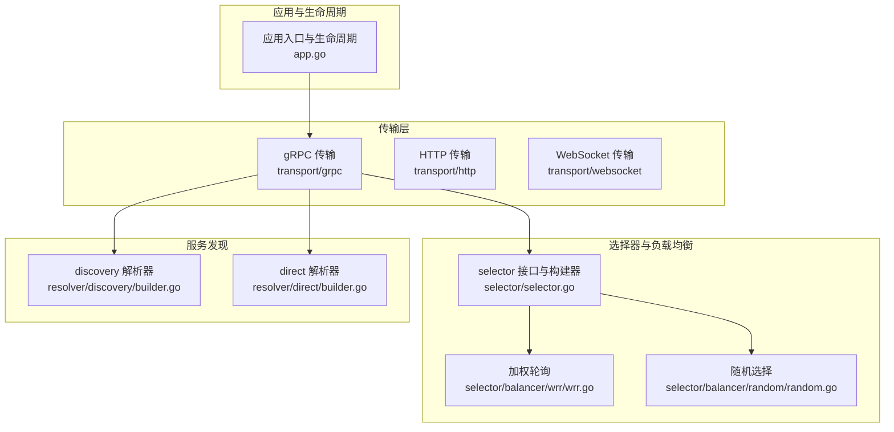
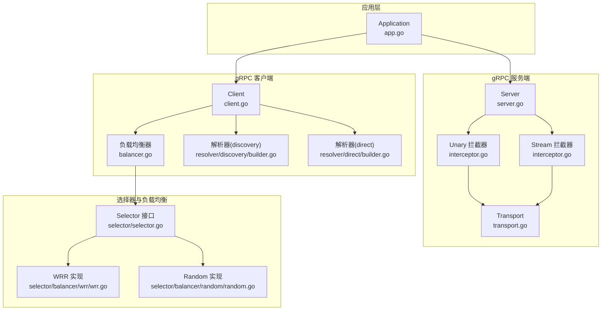
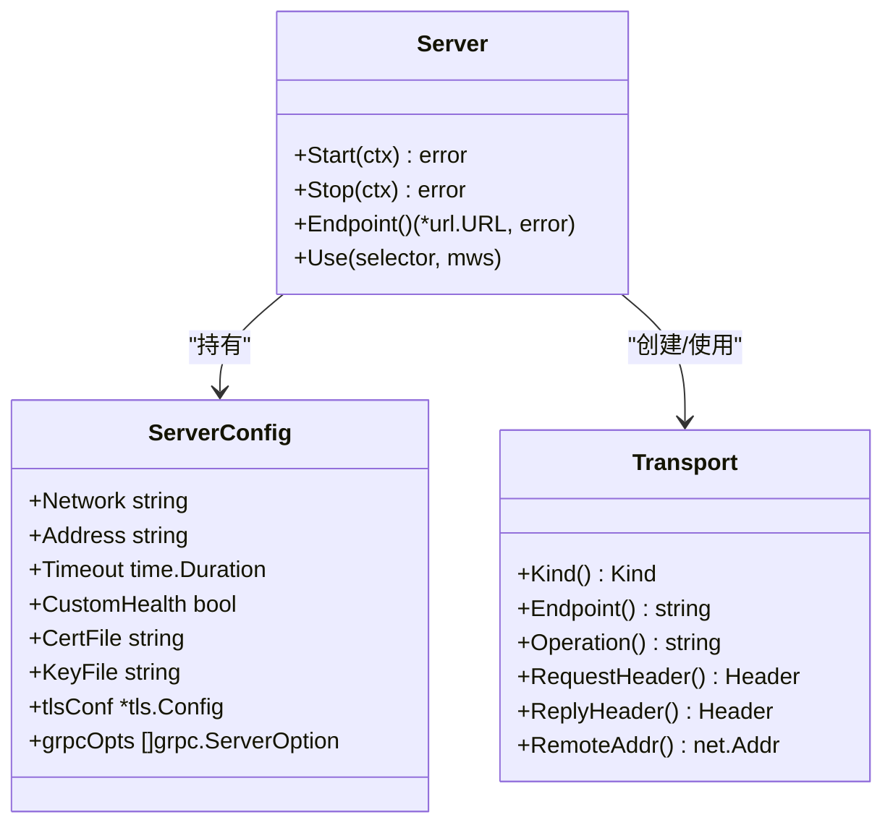
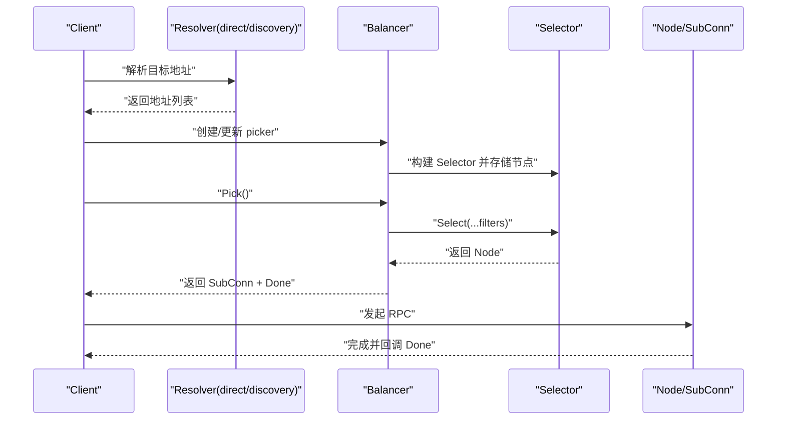
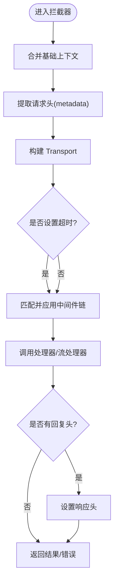
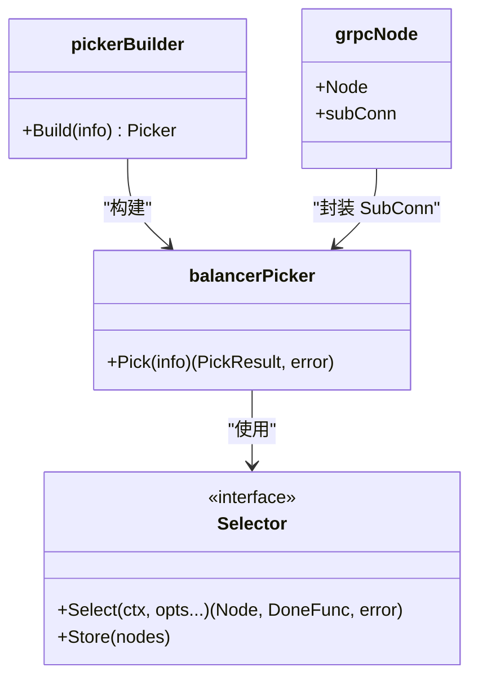
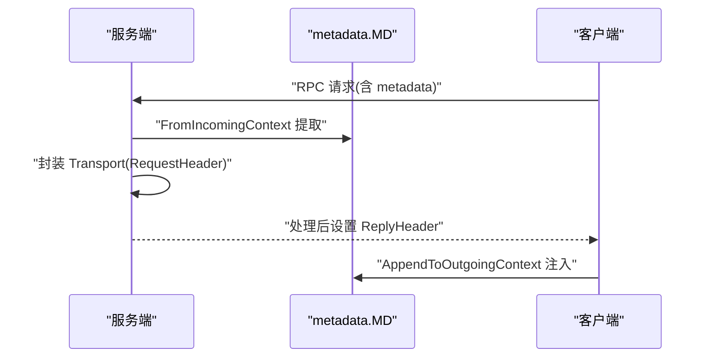
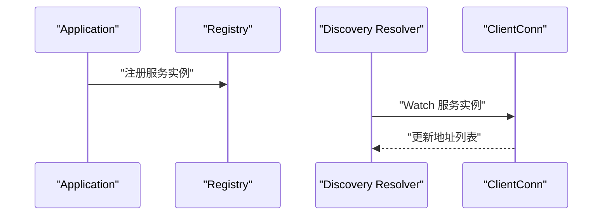
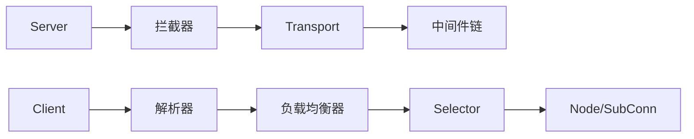

# gRPC服务器实现

<cite>
**本文引用的文件**
- [server.go](file://transport/grpc/server.go)
- [client.go](file://transport/grpc/client.go)
- [options.go](file://transport/grpc/options.go)
- [interceptor.go](file://transport/grpc/interceptor.go)
- [balancer.go](file://transport/grpc/balancer.go)
- [transport.go](file://transport/grpc/transport.go)
- [builder.go（discovery）](file://transport/grpc/resolver/discovery/builder.go)
- [builder.go（direct）](file://transport/grpc/resolver/direct/builder.go)
- [wrr.go](file://selector/balancer/wrr/wrr.go)
- [random.go](file://selector/balancer/random/random.go)
- [middleware.go](file://middleware/middleware.go)
- [transport.go（通用传输接口）](file://transport/transport.go)
- [selector.go](file://selector/selector.go)
- [app.go](file://app.go)
- [test.proto（绑定测试）](file://internal/testdata/binding/test.proto)
- [test.proto（编码测试）](file://internal/testdata/encoding/test.proto)
</cite>

## 目录
1. [简介](#简介)
2. [项目结构](#项目结构)
3. [核心组件](#核心组件)
4. [架构总览](#架构总览)
5. [组件详解](#组件详解)
6. [依赖关系分析](#依赖关系分析)
7. [性能与并发特性](#性能与并发特性)
8. [故障排查指南](#故障排查指南)
9. [结论](#结论)
10. [附录：配置与使用示例](#附录配置与使用示例)

## 简介
本技术文档围绕 Go Fox 的 gRPC 传输层实现进行系统化梳理，重点覆盖以下方面：
- gRPC 服务器架构与 Protocol Buffers 集成机制
- 服务注册与服务发现流程
- 拦截器体系（客户端/服务端）的实现原理与使用方式
- 连接管理与负载均衡策略
- metadata 的使用与传递机制
- 服务器配置项（端口、TLS、超时、拦截器链等）
- Protocol Buffers 消息编解码细节
- 实际开发示例与最佳实践
- 错误处理与状态码管理

## 项目结构
本仓库采用“按传输协议分层”的组织方式，gRPC 相关代码集中在 transport/grpc 目录下，并通过 selector 与 registry 提供负载均衡与服务发现能力。

图表来源
- [server.go](file://transport/grpc/server.go#L1-L175)
- [client.go](file://transport/grpc/client.go#L1-L184)
- [options.go](file://transport/grpc/options.go#L1-L343)
- [balancer.go](file://transport/grpc/balancer.go#L1-L125)
- [wrr.go](file://selector/balancer/wrr/wrr.go#L1-L69)
- [random.go](file://selector/balancer/random/random.go#L1-L68)
- [builder.go（discovery）](file://transport/grpc/resolver/discovery/builder.go#L1-L104)
- [builder.go（direct）](file://transport/grpc/resolver/direct/builder.go#L1-L64)
- [app.go](file://app.go#L1-L312)

章节来源
- [server.go](file://transport/grpc/server.go#L1-L175)
- [client.go](file://transport/grpc/client.go#L1-L184)
- [options.go](file://transport/grpc/options.go#L1-L343)
- [balancer.go](file://transport/grpc/balancer.go#L1-L125)
- [transport.go（通用传输接口）](file://transport/transport.go#L1-L125)
- [selector.go](file://selector/selector.go#L1-L96)
- [app.go](file://app.go#L1-L312)

## 核心组件
- gRPC 服务器：负责监听、TLS 配置、健康检查、拦截器链与服务注册
- gRPC 客户端：负责连接建立、metadata 注入、拦截器链、负载均衡与服务发现
- Transport 抽象：统一请求/响应头、操作名、远端地址等传输上下文
- 拦截器：服务端/客户端统一的中间件链式处理
- 选择器与负载均衡：基于权重或随机策略的节点选择
- 解析器：支持 discovery 与 direct 两种解析模式
- 应用生命周期：统一启动、注册、停止流程

章节来源
- [server.go](file://transport/grpc/server.go#L50-L119)
- [client.go](file://transport/grpc/client.go#L55-L134)
- [transport.go](file://transport/grpc/transport.go#L39-L118)
- [interceptor.go](file://transport/grpc/interceptor.go#L39-L119)
- [balancer.go](file://transport/grpc/balancer.go#L43-L125)
- [options.go](file://transport/grpc/options.go#L42-L343)

## 架构总览
下图展示 gRPC 服务端与客户端在框架中的交互关系，以及与选择器、解析器、应用生命周期的协作。

图表来源
- [app.go](file://app.go#L184-L221)
- [server.go](file://transport/grpc/server.go#L60-L119)
- [interceptor.go](file://transport/grpc/interceptor.go#L39-L119)
- [transport.go](file://transport/grpc/transport.go#L39-L118)
- [client.go](file://transport/grpc/client.go#L61-L134)
- [balancer.go](file://transport/grpc/balancer.go#L73-L112)
- [selector.go](file://selector/selector.go#L84-L96)
- [wrr.go](file://selector/balancer/wrr/wrr.go#L18-L26)
- [random.go](file://selector/balancer/random/random.go#L41-L49)
- [builder.go（discovery）](file://transport/grpc/resolver/discovery/builder.go#L48-L99)
- [builder.go（direct）](file://transport/grpc/resolver/direct/builder.go#L42-L63)

## 组件详解

### 1) gRPC 服务器实现
- 服务器配置与构建
  - 默认网络、地址、超时、日志、中间件匹配器、TLS 配置等
  - 支持自定义 grpc.ServerOption 与拦截器注入
- 健康检查
  - 默认注册标准健康检查服务；可通过配置关闭以使用自定义实现
- 监听与端点
  - 自动监听指定网络与地址，生成统一的 endpoint URL
- 生命周期
  - Start：监听、恢复健康检查、启动服务
  - Stop：优雅停止、关闭健康检查

图表来源
- [server.go](file://transport/grpc/server.go#L50-L119)
- [options.go](file://transport/grpc/options.go#L42-L179)
- [transport.go](file://transport/grpc/transport.go#L39-L82)

章节来源
- [server.go](file://transport/grpc/server.go#L60-L175)
- [options.go](file://transport/grpc/options.go#L42-L179)
- [transport.go](file://transport/grpc/transport.go#L39-L82)

### 2) gRPC 客户端实现
- 客户端配置与构建
  - 端点、超时、负载均衡名称、TLS、调试开关、拦截器链、节点过滤器、健康检查配置
  - 支持 discovery 与 direct 解析器
- 连接与拦截器
  - 统一的 unary/stream 客户端拦截器链
  - 将请求头注入 outgoing metadata
  - 透传节点过滤器到负载均衡器
- 负载均衡
  - 基于 selector 的 picker 构建，结合 grpc SubConn 与 Done 回调

图表来源
- [client.go](file://transport/grpc/client.go#L61-L134)
- [balancer.go](file://transport/grpc/balancer.go#L73-L112)
- [builder.go（discovery）](file://transport/grpc/resolver/discovery/builder.go#L62-L99)
- [builder.go（direct）](file://transport/grpc/resolver/direct/builder.go#L47-L58)

章节来源
- [client.go](file://transport/grpc/client.go#L61-L184)
- [balancer.go](file://transport/grpc/balancer.go#L43-L125)
- [builder.go（discovery）](file://transport/grpc/resolver/discovery/builder.go#L48-L104)
- [builder.go（direct）](file://transport/grpc/resolver/direct/builder.go#L42-L63)

### 3) 拦截器实现与使用
- 服务端拦截器
  - 合并基础上下文、提取 incoming metadata、构造 Transport、注入超时
  - 基于匹配器选择中间件链，设置回复头
- 客户端拦截器
  - 在调用前注入 Transport 到客户端上下文，必要时追加 outgoing metadata
  - 支持超时、节点过滤器、中间件链

图表来源
- [interceptor.go](file://transport/grpc/interceptor.go#L39-L119)
- [transport.go](file://transport/grpc/transport.go#L39-L82)
- [middleware.go](file://middleware/middleware.go#L54-L66)

章节来源
- [interceptor.go](file://transport/grpc/interceptor.go#L39-L119)
- [transport.go](file://transport/grpc/transport.go#L39-L118)
- [middleware.go](file://middleware/middleware.go#L28-L66)

### 4) 负载均衡与连接管理
- 负载均衡器
  - 基于 selector.Selector 的 picker 构建，将 ReadySCs 转换为节点集合
  - Pick 返回 SubConn 与 Done 回调，用于统计字节数与追踪元数据
- 选择器实现
  - 加权轮询（WRR）与随机策略（Random），均通过 selector.Register 注册
- 连接管理
  - 通过 grpc 的 HealthCheck 与 Balancer 配置启用健康检查

图表来源
- [balancer.go](file://transport/grpc/balancer.go#L43-L112)
- [selector.go](file://selector/selector.go#L84-L96)
- [wrr.go](file://selector/balancer/wrr/wrr.go#L28-L69)
- [random.go](file://selector/balancer/random/random.go#L51-L68)

章节来源
- [balancer.go](file://transport/grpc/balancer.go#L43-L125)
- [selector.go](file://selector/selector.go#L84-L96)
- [wrr.go](file://selector/balancer/wrr/wrr.go#L18-L69)
- [random.go](file://selector/balancer/random/random.go#L41-L68)

### 5) metadata 使用与传递机制
- 服务端
  - 从 incoming context 提取 metadata，封装为 Transport 的 RequestHeader
  - 可设置 ReplyHeader，在处理完成后通过 grpc.SetHeader 写回
- 客户端
  - 从 Transport 的 RequestHeader 中读取键值对，注入 outgoing metadata
  - 通过 selector.Peer 上下文传递节点选择信息

图表来源
- [interceptor.go](file://transport/grpc/interceptor.go#L40-L76)
- [client.go](file://transport/grpc/client.go#L136-L168)
- [transport.go](file://transport/grpc/transport.go#L84-L118)

章节来源
- [interceptor.go](file://transport/grpc/interceptor.go#L40-L76)
- [client.go](file://transport/grpc/client.go#L136-L168)
- [transport.go](file://transport/grpc/transport.go#L84-L118)

### 6) Protocol Buffers 消息编解码
- 编解码器注册
  - 通用传输层在初始化时注册多种编解码器（json、proto、toml、xml、yaml）
- 与 gRPC 的关系
  - gRPC 默认使用 proto 编解码；本框架通过统一编解码器接口支持多格式
- 示例模型
  - 测试用 proto 文件展示了字段掩码、可选字段、重复字段与映射类型等

章节来源
- [transport.go（通用传输接口）](file://transport/transport.go#L30-L36)
- [test.proto（绑定测试）](file://internal/testdata/binding/test.proto#L10-L23)
- [test.proto（编码测试）](file://internal/testdata/encoding/test.proto#L9-L19)

### 7) 服务注册与服务发现
- 服务端
  - 通过应用生命周期在启动后注册服务实例到注册中心
- 客户端
  - discovery 解析器通过 Watch 订阅服务实例变更，动态更新地址列表
  - direct 解析器直接从目标路径解析静态地址列表

图表来源
- [app.go](file://app.go#L208-L221)
- [builder.go（discovery）](file://transport/grpc/resolver/discovery/builder.go#L62-L99)
- [builder.go（direct）](file://transport/grpc/resolver/direct/builder.go#L47-L58)

章节来源
- [app.go](file://app.go#L208-L221)
- [builder.go（discovery）](file://transport/grpc/resolver/discovery/builder.go#L48-L104)
- [builder.go（direct）](file://transport/grpc/resolver/direct/builder.go#L42-L63)

### 8) 配置选项与最佳实践
- 服务器配置
  - 网络、地址、超时、自定义健康检查、证书文件、TLS 配置、拦截器链、grpc 选项
- 客户端配置
  - 端点、超时、负载均衡名称、安全模式、调试、证书、拦截器链、健康检查、节点过滤器、grpc 选项
- 最佳实践
  - 明确中间件作用域（如按服务/方法匹配）
  - 合理设置超时与健康检查
  - 使用 metadata 传递追踪与鉴权信息
  - 优先使用 discovery 解析器以获得动态扩缩容能力

章节来源
- [options.go](file://transport/grpc/options.go#L42-L343)
- [server.go](file://transport/grpc/server.go#L60-L119)
- [client.go](file://transport/grpc/client.go#L61-L134)

## 依赖关系分析
- 低耦合高内聚
  - 传输层抽象（Transporter/Header）屏蔽不同协议差异
  - 选择器与解析器通过接口解耦具体实现
- 关键依赖链
  - Server -> Interceptor -> Transport -> Middleware
  - Client -> Resolver -> Balancer -> Selector -> Node
- 循环依赖风险
  - 未见直接循环依赖；selector 与 transport 通过接口交互

图表来源
- [server.go](file://transport/grpc/server.go#L91-L113)
- [interceptor.go](file://transport/grpc/interceptor.go#L39-L119)
- [transport.go](file://transport/grpc/transport.go#L39-L118)
- [client.go](file://transport/grpc/client.go#L100-L134)
- [balancer.go](file://transport/grpc/balancer.go#L73-L112)
- [selector.go](file://selector/selector.go#L84-L96)

章节来源
- [server.go](file://transport/grpc/server.go#L91-L113)
- [interceptor.go](file://transport/grpc/interceptor.go#L39-L119)
- [transport.go](file://transport/grpc/transport.go#L39-L118)
- [client.go](file://transport/grpc/client.go#L100-L134)
- [balancer.go](file://transport/grpc/balancer.go#L73-L112)
- [selector.go](file://selector/selector.go#L84-L96)

## 性能与并发特性
- 并发控制
  - 服务器默认超时控制请求生命周期，避免资源长期占用
  - 客户端支持全局超时与 per-RPC 超时
- 负载均衡
  - WRR 与 Random 两种策略，可根据场景切换
  - 健康检查开启后自动剔除不健康节点
- 连接复用
  - gRPC 默认连接复用与 keepalive；结合解析器与负载均衡提升可用性

章节来源
- [options.go](file://transport/grpc/options.go#L59-L86)
- [client.go](file://transport/grpc/client.go#L200-L208)
- [balancer.go](file://transport/grpc/balancer.go#L108-L112)

## 故障排查指南
- 常见问题定位
  - TLS 证书加载失败：检查证书与私钥路径及权限
  - 解析器超时：确认 discovery 服务可用与 Watch 成功
  - 负载均衡无可用节点：检查节点过滤器与健康状态
- 日志与监控
  - 服务器启动与停止日志、健康检查状态
  - 客户端调用统计（字节发送/接收）、错误码与元数据

章节来源
- [server.go](file://transport/grpc/server.go#L157-L175)
- [client.go](file://transport/grpc/client.go#L78-L85)
- [builder.go（discovery）](file://transport/grpc/resolver/discovery/builder.go#L77-L87)
- [balancer.go](file://transport/grpc/balancer.go#L55-L71)

## 结论
Go Fox 的 gRPC 传输层通过清晰的抽象与模块化设计，提供了完善的服务器与客户端能力：
- 统一的 Transport 抽象与中间件链，简化了跨协议开发
- 健壮的服务发现与负载均衡，满足生产级可用性需求
- 完整的 metadata 传递与拦截器机制，便于扩展认证、追踪与治理
- 丰富的配置项与默认策略，兼顾易用性与灵活性

## 附录：配置与使用示例

### 1) 服务器配置要点
- 端口与网络：设置监听网络与地址
- TLS：提供证书与私钥文件，或传入自定义 tls.Config
- 健康检查：默认启用标准健康检查，可关闭以使用自定义实现
- 中间件：按服务/方法匹配中间件链

章节来源
- [options.go](file://transport/grpc/options.go#L42-L179)
- [server.go](file://transport/grpc/server.go#L60-L119)

### 2) 客户端配置要点
- 端点：支持 discovery 与 direct 两种解析器
- 负载均衡：默认使用加权轮询，可切换为随机策略
- 安全：支持明文与 TLS；可配置证书文件
- 超时与健康检查：合理设置全局与 per-call 超时

章节来源
- [options.go](file://transport/grpc/options.go#L181-L343)
- [client.go](file://transport/grpc/client.go#L61-L134)
- [wrr.go](file://selector/balancer/wrr/wrr.go#L18-L26)
- [random.go](file://selector/balancer/random/random.go#L41-L49)

### 3) Protocol Buffers 模型参考
- 字段掩码、可选字段、重复字段与映射类型等在测试模型中均有体现，便于验证编解码行为

章节来源
- [test.proto（绑定测试）](file://internal/testdata/binding/test.proto#L10-L23)
- [test.proto（编码测试）](file://internal/testdata/encoding/test.proto#L9-L19)