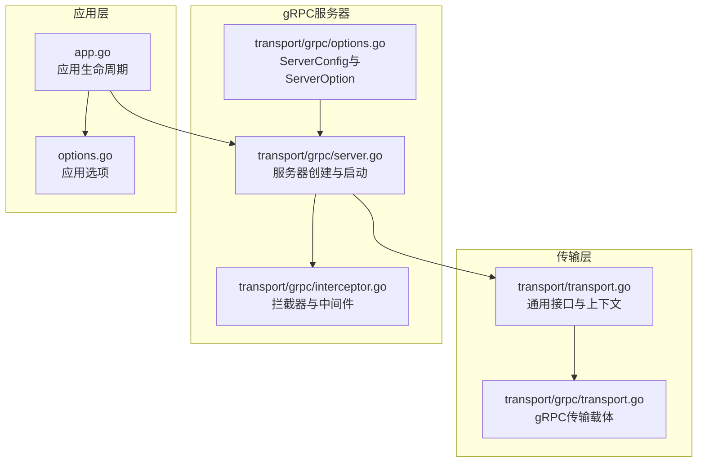
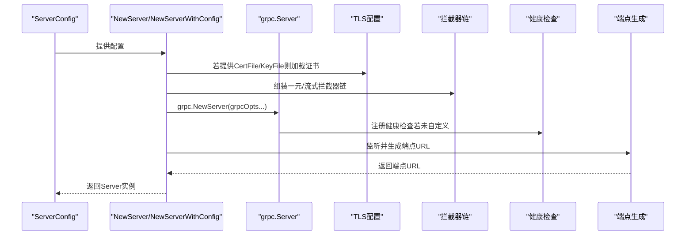
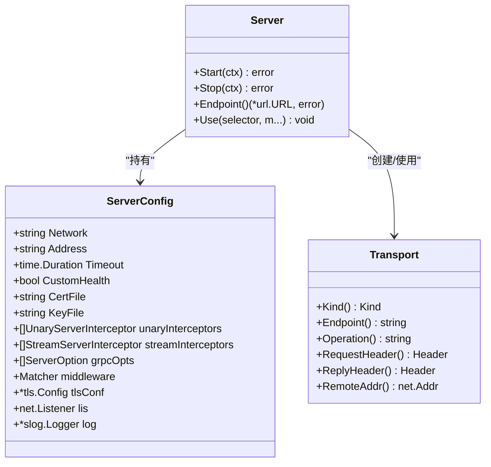

# gRPC服务器配置

<cite>
**本文引用的文件列表**
- [transport/grpc/options.go](file://transport/grpc/options.go)
- [transport/grpc/server.go](file://transport/grpc/server.go)
- [transport/grpc/interceptor.go](file://transport/grpc/interceptor.go)
- [transport/grpc/transport.go](file://transport/grpc/transport.go)
- [transport/transport.go](file://transport/transport.go)
- [app.go](file://app.go)
- [options.go](file://options.go)
</cite>

## 目录
1. [简介](#简介)
2. [项目结构](#项目结构)
3. [核心组件](#核心组件)
4. [架构总览](#架构总览)
5. [详细组件分析](#详细组件分析)
6. [依赖关系分析](#依赖关系分析)
7. [性能考量](#性能考量)
8. [故障排查指南](#故障排查指南)
9. [结论](#结论)
10. [附录](#附录)

## 简介
本文件面向Go Fox框架中的gRPC服务器配置系统，系统性地解析ServerConfig结构体的设计与各配置项的作用，涵盖网络配置、TLS配置、拦截器配置以及GRPC选项配置等关键要素。文档同时阐述默认配置生成机制、配置优先级规则、配置验证与错误处理机制，并提供多种实际配置场景示例与最佳实践建议，帮助开发者在不同运行环境中高效、安全地部署gRPC服务。

## 项目结构
围绕gRPC服务器配置的关键文件主要位于transport/grpc目录，配合transport通用接口、应用生命周期管理模块共同构成完整的配置与运行体系：
- transport/grpc/options.go：定义ServerConfig结构体及ServerOption构建器，提供默认配置、扫描配置、链式配置能力
- transport/grpc/server.go：实现gRPC服务器创建、监听、端点生成、健康检查注册等核心逻辑
- transport/grpc/interceptor.go：实现gRPC拦截器（一元与流式），注入中间件、超时控制、传输上下文
- transport/grpc/transport.go：定义gRPC传输载体Transport，封装请求头、响应头、操作名、远端地址等
- transport/transport.go：定义通用传输接口与上下文工具，统一Server/Client端的传输抽象
- app.go与options.go：应用生命周期与全局配置，负责服务编排与启动停止流程

图表来源
- [transport/grpc/options.go](file://transport/grpc/options.go#L42-L102)
- [transport/grpc/server.go](file://transport/grpc/server.go#L50-L119)
- [transport/grpc/interceptor.go](file://transport/grpc/interceptor.go#L39-L119)
- [transport/grpc/transport.go](file://transport/grpc/transport.go#L39-L118)
- [transport/transport.go](file://transport/transport.go#L44-L124)
- [app.go](file://app.go#L184-L221)
- [options.go](file://options.go#L54-L89)

章节来源
- [transport/grpc/options.go](file://transport/grpc/options.go#L42-L102)
- [transport/grpc/server.go](file://transport/grpc/server.go#L50-L119)
- [transport/grpc/interceptor.go](file://transport/grpc/interceptor.go#L39-L119)
- [transport/grpc/transport.go](file://transport/grpc/transport.go#L39-L118)
- [transport/transport.go](file://transport/transport.go#L44-L124)
- [app.go](file://app.go#L184-L221)
- [options.go](file://options.go#L54-L89)

## 核心组件
本节聚焦ServerConfig结构体及其相关ServerOption，解释每个字段的含义、默认值、作用范围与优先级。

- 结构体字段与默认值
  - Network：网络协议，默认“tcp”
  - Address：监听地址，默认“0.0.0.0:0”（随机端口）
  - Timeout：请求超时，默认3秒；用于在拦截器中为每个请求设置上下文超时
  - CustomHealth：是否启用自定义健康检查，默认false（即注册标准健康检查服务）
  - CertFile/KeyFile：TLS证书与私钥文件路径；当两者均非空且未显式提供tlsConf时，自动加载证书并启用TLS
  - unaryInterceptors/streamInterceptors：一元与流式拦截器切片；可追加自定义拦截器
  - grpcOpts：直接透传给grpc.NewServer的ServerOption切片
  - middleware：匹配器，用于按选择器（如服务或方法）绑定中间件
  - tlsConf：TLS配置对象；可由外部传入或由CertFile/KeyFile自动填充
  - lis：net.Listener；可由外部传入以接管监听
  - log：日志记录器

- 默认配置生成
  - DefaultSeverConfig返回默认ServerConfig，包含Network、Address、Timeout、matcher与日志器
  - RawServerConfig与ScanServerConfig从配置源扫描到ServerConfig，支持命名空间拼接

- 配置优先级规则
  - 显式ServerOption覆盖默认值
  - NewServerWithConfig传入的ServerConfig优先于DefaultSeverConfig
  - 当CertFile与KeyFile存在且未提供tlsConf时，自动加载证书并启用TLS
  - 自定义拦截器会追加到内置拦截器之后，形成链式调用

章节来源
- [transport/grpc/options.go](file://transport/grpc/options.go#L42-L102)
- [transport/grpc/options.go](file://transport/grpc/options.go#L59-L86)
- [transport/grpc/options.go](file://transport/grpc/options.go#L104-L179)
- [transport/grpc/server.go](file://transport/grpc/server.go#L70-L119)

## 架构总览
下图展示gRPC服务器从配置到启动的完整流程，包括拦截器链、TLS启用、健康检查注册与端点生成。

图表来源
- [transport/grpc/server.go](file://transport/grpc/server.go#L70-L119)
- [transport/grpc/server.go](file://transport/grpc/server.go#L121-L174)
- [transport/grpc/options.go](file://transport/grpc/options.go#L146-L151)

章节来源
- [transport/grpc/server.go](file://transport/grpc/server.go#L70-L174)
- [transport/grpc/options.go](file://transport/grpc/options.go#L146-L151)

## 详细组件分析

### ServerConfig与ServerOption设计
- 设计要点
  - ServerConfig采用可选字段与ServerOption函数式组合，便于链式配置与灵活扩展
  - 提供RawServerConfig/ScanServerConfig以对接配置中心或配置文件
  - 支持自定义Listener与TLS配置，满足高级部署需求
  - 内置中间件匹配器，支持按服务或方法粒度绑定中间件

- 关键字段详解
  - Network/Address：决定监听协议与地址
  - Timeout：影响拦截器中的上下文超时
  - CustomHealth：控制是否注册标准健康检查服务
  - CertFile/KeyFile/tlsConf：TLS启用与证书加载
  - unaryInterceptors/streamInterceptors：拦截器链
  - grpcOpts：底层gRPC选项透传
  - middleware：中间件选择器
  - lis/log：监听器与日志

- 默认生成与扫描
  - DefaultSeverConfig提供基础默认值
  - ScanServerConfig根据命名空间从配置源扫描到ServerConfig

章节来源
- [transport/grpc/options.go](file://transport/grpc/options.go#L42-L102)
- [transport/grpc/options.go](file://transport/grpc/options.go#L59-L86)
- [transport/grpc/options.go](file://transport/grpc/options.go#L70-L86)

### TLS配置与HTTP/1.1支持
- 自动TLS启用机制
  - 当同时提供CertFile与KeyFile且未显式提供tlsConf时，自动创建tls.Config并加载证书
  - 在tls.Config中显式添加“http/1.1”到NextProtos，以支持HTTP/1.1协议协商
  - 加载失败时触发panic，确保问题被及时暴露

- 配置优先级
  - 若显式提供tlsConf，则忽略CertFile/KeyFile
  - 若仅提供其一或为空，则不启用TLS

- 实际场景
  - 使用自定义证书：通过TLSConfig传入自定义tls.Config
  - 使用文件证书：提供CertFile与KeyFile，自动加载并启用TLS

章节来源
- [transport/grpc/server.go](file://transport/grpc/server.go#L81-L90)
- [transport/grpc/server.go](file://transport/grpc/server.go#L107-L109)
- [transport/grpc/options.go](file://transport/grpc/options.go#L146-L151)

### 拦截器配置与中间件链
- 内置拦截器
  - 一元拦截器：注入Transport上下文、提取请求头、设置响应头、合并基础上下文、可选超时控制、匹配并应用中间件
  - 流式拦截器：类似处理，但针对流式调用，包装ServerStream以传递上下文

- 拦截器链构建
  - 内置拦截器始终在链首
  - 自定义拦截器通过UnaryInterceptor/StreamInterceptor追加至链尾
  - 中间件通过selector按服务或方法匹配，形成中间件链

- 超时控制
  - 若ServerConfig.Timeout大于0，在拦截器中为每个请求创建带超时的上下文

- 实际场景
  - 访问控制：在中间件中校验令牌
  - 日志与追踪：在中间件中记录请求与响应头
  - 并发控制：在中间件中限制并发请求数

章节来源
- [transport/grpc/interceptor.go](file://transport/grpc/interceptor.go#L39-L77)
- [transport/grpc/interceptor.go](file://transport/grpc/interceptor.go#L97-L119)
- [transport/grpc/server.go](file://transport/grpc/server.go#L91-L102)
- [transport/grpc/options.go](file://transport/grpc/options.go#L160-L172)
- [transport/grpc/options.go](file://transport/grpc/options.go#L132-L144)

### GRPC选项配置与端点生成
- GRPC选项配置
  - 通过Options透传grpc.ServerOption，实现对底层gRPC行为的精细控制
  - 与内置拦截器链、TLS配置共同组成grpc.NewServer的参数集

- 端点生成
  - Start阶段先确保监听器存在，再从监听器与Address推导出最终端点URL
  - 端点scheme根据是否存在TLS自动选择“grpc”或“grpcs”

- 健康检查
  - 默认注册标准健康检查服务；若CustomHealth为true，则跳过注册

章节来源
- [transport/grpc/server.go](file://transport/grpc/server.go#L103-L118)
- [transport/grpc/server.go](file://transport/grpc/server.go#L138-L155)
- [transport/grpc/server.go](file://transport/grpc/server.go#L157-L174)

### 传输载体与上下文
- Transport结构体
  - 封装endpoint、operation、请求头、响应头、节点过滤器、远端地址等
  - 实现Transporter接口，提供Kind、Endpoint、Operation、RequestHeader、ReplyHeader等方法

- 上下文工具
  - NewServerContext/FromServerContext用于在gRPC上下文中传递Transport信息
  - 与拦截器配合，使业务逻辑可访问传输细节

章节来源
- [transport/grpc/transport.go](file://transport/grpc/transport.go#L39-L118)
- [transport/transport.go](file://transport/transport.go#L93-L124)

### 应用生命周期与服务编排
- 应用启动
  - Application在startServers中遍历配置的服务，逐一启动
  - 启动后向注册中心注册服务实例信息

- 应用停止
  - Stop阶段注销服务实例并优雅停止所有服务

- 与gRPC服务器集成
  - 通过options.go中的Server选项注入transport.Server实现（含gRPC服务器）

章节来源
- [app.go](file://app.go#L184-L221)
- [app.go](file://app.go#L254-L282)
- [options.go](file://options.go#L188-L193)

## 依赖关系分析
- 组件耦合
  - ServerConfig与ServerOption解耦配置与创建过程
  - Server依赖grpc.Server、健康检查、拦截器与中间件匹配器
  - Transport实现通用Transporter接口，便于跨传输层复用

- 外部依赖
  - gRPC核心库用于服务器创建与拦截器链
  - 标准库net用于监听与地址解析
  - slog用于日志输出

图表来源
- [transport/grpc/options.go](file://transport/grpc/options.go#L42-L57)
- [transport/grpc/server.go](file://transport/grpc/server.go#L50-L58)
- [transport/grpc/transport.go](file://transport/grpc/transport.go#L39-L47)

章节来源
- [transport/grpc/options.go](file://transport/grpc/options.go#L42-L57)
- [transport/grpc/server.go](file://transport/grpc/server.go#L50-L58)
- [transport/grpc/transport.go](file://transport/grpc/transport.go#L39-L47)

## 性能考量
- 监听与端点
  - Address使用“0.0.0.0:0”可让系统分配可用端口，适合容器化部署
  - 监听器可由外部注入，便于复用或自定义监听策略

- 超时控制
  - 通过Timeout统一设置请求超时，避免长时间阻塞
  - 在高并发场景下，建议结合中间件进行限流与熔断

- 拦截器与中间件
  - 拦截器链顺序固定，内置拦截器在前，自定义拦截器在后
  - 中间件按selector匹配，避免对全量请求施加不必要的处理

- TLS性能
  - 自动加载证书并启用TLS，建议使用硬件加速或缓存证书以降低开销
  - NextProtos包含“http/1.1”，有助于兼容性与性能优化

- 健康检查
  - 默认注册标准健康检查服务，便于运维监控
  - 自定义健康检查可按需减少额外开销

[本节为通用性能建议，无需特定文件引用]

## 故障排查指南
- TLS证书加载失败
  - 现象：启动时panic
  - 排查：确认CertFile与KeyFile路径正确、权限可读、证书格式有效
  - 参考：证书加载与panic处理逻辑

- 监听失败
  - 现象：Start阶段返回错误
  - 排查：检查Network与Address是否合法、端口占用、权限问题
  - 参考：监听器创建与错误返回

- 健康检查冲突
  - 现象：自定义健康检查未生效
  - 排查：确认CustomHealth设置为true
  - 参考：健康检查注册逻辑

- 中间件未生效
  - 现象：selector匹配不到中间件
  - 排查：确认selector模式正确（如“/*”、“/pkg.Svc/*”、“/pkg.Svc/Method”）
  - 参考：中间件匹配器与Use方法

章节来源
- [transport/grpc/server.go](file://transport/grpc/server.go#L81-L90)
- [transport/grpc/server.go](file://transport/grpc/server.go#L157-L174)
- [transport/grpc/server.go](file://transport/grpc/server.go#L115-L117)
- [transport/grpc/server.go](file://transport/grpc/server.go#L129-L136)

## 结论
Go Fox的gRPC服务器配置系统通过ServerConfig与ServerOption实现了清晰、可扩展的配置模型。默认配置与扫描机制降低了接入成本，TLS自动加载与HTTP/1.1支持增强了兼容性，拦截器与中间件链提供了强大的横切能力。结合应用生命周期管理，开发者可在不同环境下快速部署高性能、可观测、可维护的gRPC服务。

[本节为总结性内容，无需特定文件引用]

## 附录

### 配置场景示例（路径指引）
以下示例均通过ServerConfig与ServerOption完成，具体实现请参考对应文件路径。

- HTTP/1.1协议支持
  - 通过提供CertFile与KeyFile，自动启用TLS并在tls.Config中添加“http/1.1”
  - 参考：证书加载与TLS启用逻辑

- 自定义TLS证书
  - 使用TLSConfig传入自定义tls.Config，覆盖默认证书加载
  - 参考：TLS配置选项

- 并发控制
  - 在中间件中实现并发限制与限流，按selector匹配到目标服务或方法
  - 参考：中间件匹配器与Use方法

- 健康检查
  - 默认注册标准健康检查服务；如需自定义，设置CustomHealth为true并自行实现
  - 参考：健康检查注册逻辑

- 配置扫描与命名空间
  - 使用ScanServerConfig按命名空间扫描配置，支持多实例配置
  - 参考：配置扫描与命名空间拼接

章节来源
- [transport/grpc/server.go](file://transport/grpc/server.go#L81-L90)
- [transport/grpc/server.go](file://transport/grpc/server.go#L115-L117)
- [transport/grpc/options.go](file://transport/grpc/options.go#L146-L151)
- [transport/grpc/options.go](file://transport/grpc/options.go#L79-L86)
- [transport/grpc/server.go](file://transport/grpc/server.go#L129-L136)