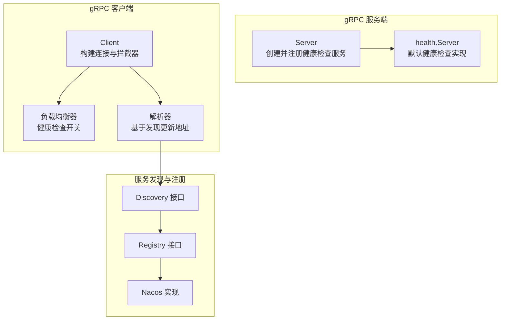
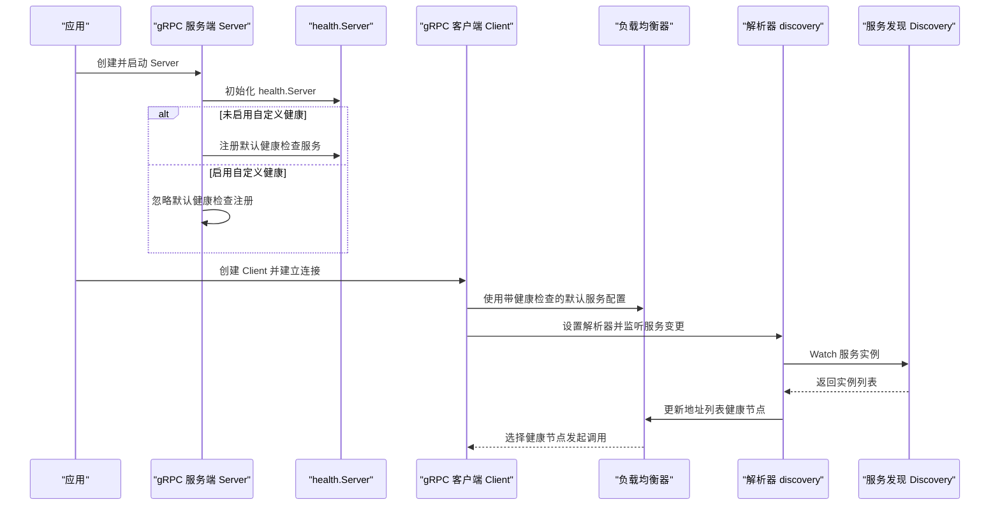
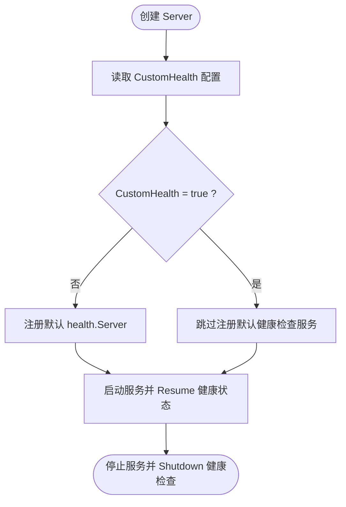
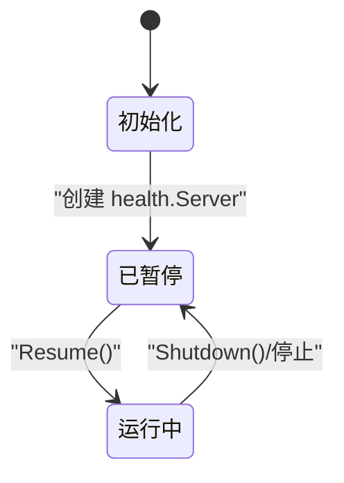
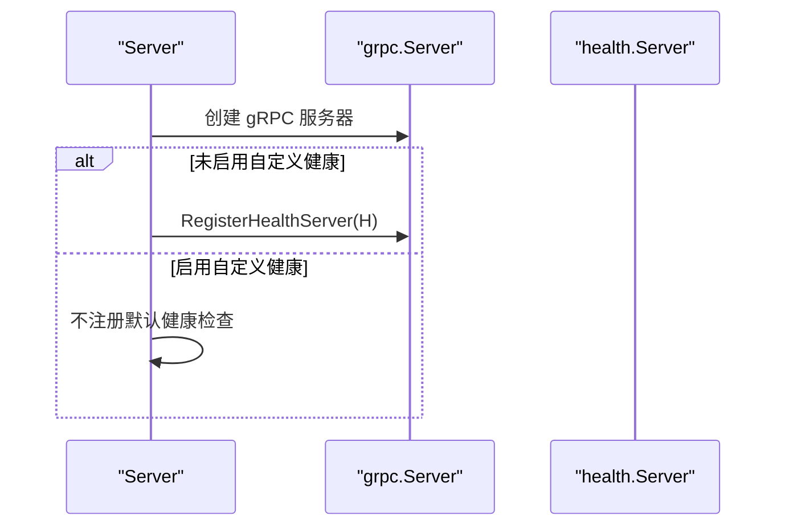
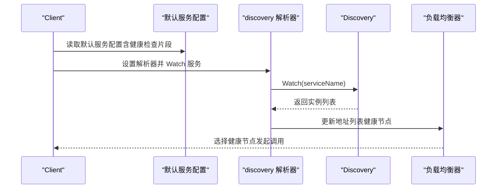
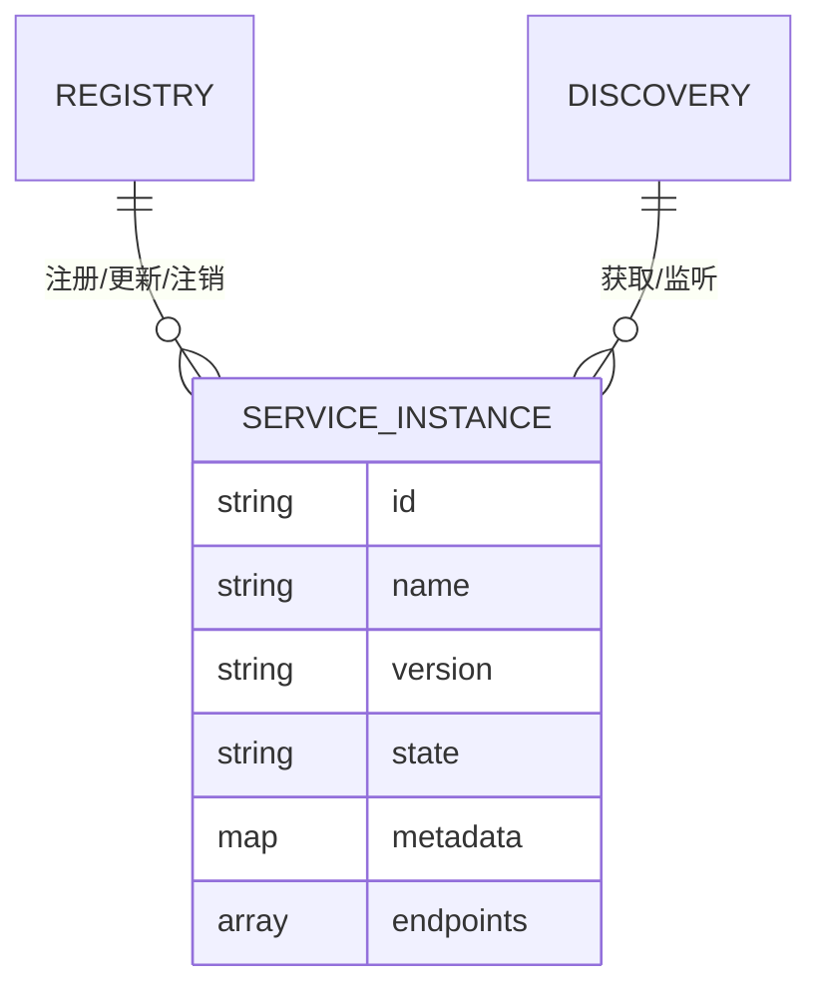
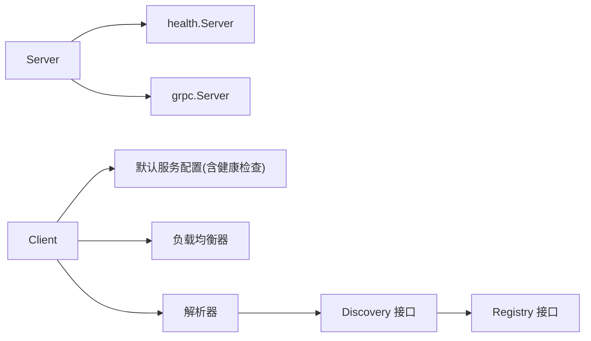

# 健康检查服务

<cite>
**本文引用的文件**
- [transport/grpc/server.go](file://transport/grpc/server.go)
- [transport/grpc/options.go](file://transport/grpc/options.go)
- [transport/grpc/client.go](file://transport/grpc/client.go)
- [transport/grpc/balancer.go](file://transport/grpc/balancer.go)
- [transport/grpc/resolver/discovery/builder.go](file://transport/grpc/resolver/discovery/builder.go)
- [transport/grpc/resolver/discovery/resolver.go](file://transport/grpc/resolver/discovery/resolver.go)
- [registry/registry.go](file://registry/registry.go)
- [contrib/registry/nacos/registry.go](file://contrib/registry/nacos/registry.go)
</cite>

## 目录
1. [简介](#简介)
2. [项目结构](#项目结构)
3. [核心组件](#核心组件)
4. [架构总览](#架构总览)
5. [组件详解](#组件详解)
6. [依赖关系分析](#依赖关系分析)
7. [性能考量](#性能考量)
8. [故障排查指南](#故障排查指南)
9. [结论](#结论)
10. [附录](#附录)

## 简介
本文件面向 Go Fox 的 gRPC 健康检查服务，系统性说明以下内容：
- health.Server 的集成与使用方式
- 默认健康检查服务的启用与禁用机制（CustomHealth 配置）
- 健康检查的状态管理（Healthy、Unhealthy、ServingStatus 等）
- HealthServer 的注册流程与与 gRPC 服务器的集成
- 自定义健康检查逻辑的实现思路与示例路径
- 健康检查在服务注册发现中的作用与客户端健康检查的实现
- 健康检查监控与故障诊断方法

## 项目结构
围绕健康检查的关键模块分布如下：
- 传输层 gRPC 服务端：负责创建并注册默认健康检查服务或允许自定义健康服务接管
- 传输层 gRPC 客户端：通过服务配置开启/关闭健康检查，并结合负载均衡器进行健康节点选择
- 服务发现与注册：提供服务实例状态与端点信息，供客户端健康检查与负载均衡使用
- 解析器：基于服务发现结果动态更新解析状态，支持健康节点筛选

图表来源
- [transport/grpc/server.go](file://transport/grpc/server.go#L50-L119)
- [transport/grpc/client.go](file://transport/grpc/client.go#L70-L134)
- [transport/grpc/balancer.go](file://transport/grpc/balancer.go#L102-L112)
- [transport/grpc/resolver/discovery/builder.go](file://transport/grpc/resolver/discovery/builder.go#L62-L99)
- [transport/grpc/resolver/discovery/resolver.go](file://transport/grpc/resolver/discovery/resolver.go#L107-L130)
- [registry/registry.go](file://registry/registry.go#L17-L55)
- [contrib/registry/nacos/registry.go](file://contrib/registry/nacos/registry.go#L212-L239)

章节来源
- [transport/grpc/server.go](file://transport/grpc/server.go#L50-L119)
- [transport/grpc/options.go](file://transport/grpc/options.go#L42-L123)
- [transport/grpc/client.go](file://transport/grpc/client.go#L70-L134)
- [transport/grpc/balancer.go](file://transport/grpc/balancer.go#L102-L112)
- [transport/grpc/resolver/discovery/builder.go](file://transport/grpc/resolver/discovery/builder.go#L62-L99)
- [transport/grpc/resolver/discovery/resolver.go](file://transport/grpc/resolver/discovery/resolver.go#L107-L130)
- [registry/registry.go](file://registry/registry.go#L17-L55)
- [contrib/registry/nacos/registry.go](file://contrib/registry/nacos/registry.go#L212-L239)

## 核心组件
- gRPC 服务端 Server：负责创建 gRPC 服务器实例，按配置决定是否注册默认健康检查服务；启动时恢复健康状态，停止时优雅关闭健康检查
- ServerConfig：包含 CustomHealth 字段用于控制是否启用默认健康检查服务
- gRPC 客户端 Client：根据配置生成 gRPC 连接，默认服务配置中包含健康检查配置片段；结合负载均衡器与解析器实现健康节点选择
- 负载均衡器：启用健康检查功能，确保仅向健康节点发起请求
- 解析器 discovery：从服务发现获取实例列表，过滤并更新解析状态，供负载均衡器选择
- 注册中心与服务发现接口：统一的服务实例模型与发现/注册能力

章节来源
- [transport/grpc/server.go](file://transport/grpc/server.go#L50-L119)
- [transport/grpc/options.go](file://transport/grpc/options.go#L42-L123)
- [transport/grpc/client.go](file://transport/grpc/client.go#L70-L134)
- [transport/grpc/balancer.go](file://transport/grpc/balancer.go#L102-L112)
- [transport/grpc/resolver/discovery/builder.go](file://transport/grpc/resolver/discovery/builder.go#L62-L99)
- [transport/grpc/resolver/discovery/resolver.go](file://transport/grpc/resolver/discovery/resolver.go#L107-L130)
- [registry/registry.go](file://registry/registry.go#L17-L55)

## 架构总览
下图展示健康检查在服务端与客户端的整体交互流程，以及与服务发现的协作关系。

图表来源
- [transport/grpc/server.go](file://transport/grpc/server.go#L75-L119)
- [transport/grpc/options.go](file://transport/grpc/options.go#L118-L123)
- [transport/grpc/client.go](file://transport/grpc/client.go#L100-L105)
- [transport/grpc/balancer.go](file://transport/grpc/balancer.go#L108-L111)
- [transport/grpc/resolver/discovery/builder.go](file://transport/grpc/resolver/discovery/builder.go#L62-L99)
- [transport/grpc/resolver/discovery/resolver.go](file://transport/grpc/resolver/discovery/resolver.go#L107-L130)

## 组件详解

### 1) 健康检查服务端集成与启用/禁用机制
- 默认行为：服务端在创建 gRPC 服务器后，若未启用自定义健康（CustomHealth=false），则注册默认的 health.Server 到 gRPC 服务器
- 自定义健康：当设置 CustomHealth=true 时，服务端不注册默认健康检查服务，允许业务自行实现健康检查逻辑
- 启停流程：服务启动时调用健康检查服务的 Resume 恢复状态；服务停止时调用 Shutdown 关闭健康检查

图表来源
- [transport/grpc/server.go](file://transport/grpc/server.go#L75-L119)
- [transport/grpc/options.go](file://transport/grpc/options.go#L118-L123)

章节来源
- [transport/grpc/server.go](file://transport/grpc/server.go#L75-L119)
- [transport/grpc/options.go](file://transport/grpc/options.go#L42-L123)

### 2) 健康检查状态管理
- 默认健康检查服务采用 gRPC 官方 health 包，支持 Healthy、Unhealthy、ServingStatus 等状态
- 服务端启动时调用 Resume 恢复健康状态；停止时调用 Shutdown 关闭健康检查
- 客户端侧通过负载均衡器的健康检查能力，自动剔除不健康节点，仅向健康节点发起请求

图表来源
- [transport/grpc/server.go](file://transport/grpc/server.go#L143-L152)
- [transport/grpc/balancer.go](file://transport/grpc/balancer.go#L108-L111)

章节来源
- [transport/grpc/server.go](file://transport/grpc/server.go#L143-L152)
- [transport/grpc/balancer.go](file://transport/grpc/balancer.go#L108-L111)

### 3) HealthServer 注册与与 gRPC 服务器集成
- 在 NewServerWithConfig 中创建 gRPC 服务器后，依据 CustomHealth 决定是否注册默认健康检查服务
- 注册位置：使用官方 grpc_health_v1.RegisterHealthServer 将 health.Server 注册到当前 gRPC 服务器

图表来源
- [transport/grpc/server.go](file://transport/grpc/server.go#L113-L117)

章节来源
- [transport/grpc/server.go](file://transport/grpc/server.go#L113-L117)

### 4) 客户端健康检查与服务发现集成
- 客户端默认服务配置包含健康检查配置片段，启用 gRPC 客户端侧健康检查
- 客户端通过 discovery 解析器订阅服务实例变化，解析器根据服务发现返回的实例列表更新地址状态
- 负载均衡器启用健康检查，仅将请求路由至健康节点

图表来源
- [transport/grpc/client.go](file://transport/grpc/client.go#L100-L105)
- [transport/grpc/resolver/discovery/builder.go](file://transport/grpc/resolver/discovery/builder.go#L62-L99)
- [transport/grpc/resolver/discovery/resolver.go](file://transport/grpc/resolver/discovery/resolver.go#L107-L130)
- [transport/grpc/balancer.go](file://transport/grpc/balancer.go#L108-L111)

章节来源
- [transport/grpc/client.go](file://transport/grpc/client.go#L100-L105)
- [transport/grpc/resolver/discovery/builder.go](file://transport/grpc/resolver/discovery/builder.go#L62-L99)
- [transport/grpc/resolver/discovery/resolver.go](file://transport/grpc/resolver/discovery/resolver.go#L107-L130)
- [transport/grpc/balancer.go](file://transport/grpc/balancer.go#L108-L111)

### 5) 自定义健康检查逻辑实现示例（步骤指引）
- 步骤一：在服务端创建 Server 时，将 CustomHealth 设为 true，以禁用默认健康检查注册
- 步骤二：在业务层实现自定义健康检查服务，参考默认 health.Server 的接口契约，注册到 gRPC 服务器
- 步骤三：在服务启停阶段，按需调用健康检查服务的 Resume/Shutdown，保持与默认行为一致

参考路径
- [transport/grpc/server.go](file://transport/grpc/server.go#L75-L119)
- [transport/grpc/options.go](file://transport/grpc/options.go#L118-L123)

章节来源
- [transport/grpc/server.go](file://transport/grpc/server.go#L75-L119)
- [transport/grpc/options.go](file://transport/grpc/options.go#L118-L123)

### 6) 健康检查在服务注册发现中的作用
- 服务实例模型包含状态字段，客户端可据此过滤不可用实例
- 解析器从服务发现获取实例列表，更新解析状态；负载均衡器启用健康检查，避免将请求发往不健康节点
- 注册中心实现示例（如 Nacos）提供注册、更新与注销能力，配合健康检查提升整体可用性

图表来源
- [registry/registry.go](file://registry/registry.go#L76-L95)
- [contrib/registry/nacos/registry.go](file://contrib/registry/nacos/registry.go#L212-L239)

章节来源
- [registry/registry.go](file://registry/registry.go#L76-L95)
- [contrib/registry/nacos/registry.go](file://contrib/registry/nacos/registry.go#L212-L239)

## 依赖关系分析
- 服务端对健康检查的依赖：直接依赖 gRPC 官方 health 包与 grpc_health_v1 协议
- 客户端对健康检查的依赖：通过默认服务配置片段启用健康检查；依赖负载均衡器与解析器完成健康节点选择
- 服务发现与注册：客户端通过 Discovery 接口获取实例，解析器将实例转换为地址并更新状态

图表来源
- [transport/grpc/server.go](file://transport/grpc/server.go#L75-L119)
- [transport/grpc/client.go](file://transport/grpc/client.go#L100-L105)
- [transport/grpc/balancer.go](file://transport/grpc/balancer.go#L108-L111)
- [transport/grpc/resolver/discovery/builder.go](file://transport/grpc/resolver/discovery/builder.go#L62-L99)
- [registry/registry.go](file://registry/registry.go#L17-L55)

章节来源
- [transport/grpc/server.go](file://transport/grpc/server.go#L75-L119)
- [transport/grpc/client.go](file://transport/grpc/client.go#L100-L105)
- [transport/grpc/balancer.go](file://transport/grpc/balancer.go#L108-L111)
- [transport/grpc/resolver/discovery/builder.go](file://transport/grpc/resolver/discovery/builder.go#L62-L99)
- [registry/registry.go](file://registry/registry.go#L17-L55)

## 性能考量
- 健康检查开销：默认健康检查由 gRPC 官方实现，性能开销较低；自定义实现需避免频繁 IO 或阻塞操作
- 负载均衡与健康检查：启用健康检查会增加节点筛选成本，但能显著降低失败请求比例
- 服务发现与解析：解析器基于 Watch 机制增量更新，建议合理设置超时与重试策略，避免频繁全量拉取
- TLS 与证书：服务端/客户端启用 TLS 会带来额外握手与加解密开销，应结合业务场景权衡安全与性能

## 故障排查指南
- 无法获取健康状态
  - 确认服务端未启用自定义健康（CustomHealth=false），否则不会注册默认健康检查服务
  - 检查服务端启动日志，确认 Resume 是否被调用
- 客户端总是连接失败
  - 检查默认服务配置中的健康检查片段是否正确注入
  - 确认负载均衡器已启用健康检查，且解析器成功更新了地址列表
- 服务实例状态异常
  - 核对服务实例状态字段与注册中心实现，确保状态流转正确
  - 检查解析器输出的日志，确认实例列表是否为空或不完整

章节来源
- [transport/grpc/server.go](file://transport/grpc/server.go#L113-L117)
- [transport/grpc/server.go](file://transport/grpc/server.go#L143-L152)
- [transport/grpc/client.go](file://transport/grpc/client.go#L100-L105)
- [transport/grpc/balancer.go](file://transport/grpc/balancer.go#L108-L111)
- [transport/grpc/resolver/discovery/resolver.go](file://transport/grpc/resolver/discovery/resolver.go#L107-L130)
- [registry/registry.go](file://registry/registry.go#L76-L95)

## 结论
Go Fox 的 gRPC 健康检查服务通过默认健康检查服务与自定义健康检查两种模式，为服务端与客户端提供了完善的健康保障。结合服务发现与负载均衡的健康检查能力，能够有效提升系统的可用性与稳定性。建议在生产环境中：
- 默认启用健康检查，确保服务端与客户端均具备健康感知能力
- 对自定义健康检查进行轻量化设计，避免引入额外延迟
- 配合服务发现与注册中心，完善服务状态治理与可观测性

## 附录
- 关键实现路径参考
  - 服务端健康检查注册与启停：[transport/grpc/server.go](file://transport/grpc/server.go#L75-L152)
  - 自定义健康开关配置：[transport/grpc/options.go](file://transport/grpc/options.go#L42-L123)
  - 客户端健康检查配置与连接构建：[transport/grpc/client.go](file://transport/grpc/client.go#L70-L134)
  - 负载均衡器健康检查启用：[transport/grpc/balancer.go](file://transport/grpc/balancer.go#L108-L111)
  - 解析器与服务发现集成：[transport/grpc/resolver/discovery/builder.go](file://transport/grpc/resolver/discovery/builder.go#L62-L99)、[transport/grpc/resolver/discovery/resolver.go](file://transport/grpc/resolver/discovery/resolver.go#L107-L130)
  - 服务实例与注册接口：[registry/registry.go](file://registry/registry.go#L76-L95)
  - 注册中心实现示例（Nacos）：[contrib/registry/nacos/registry.go](file://contrib/registry/nacos/registry.go#L212-L239)