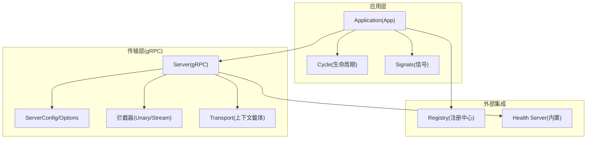
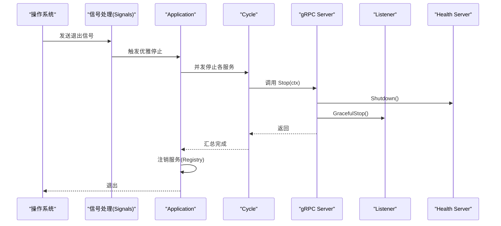
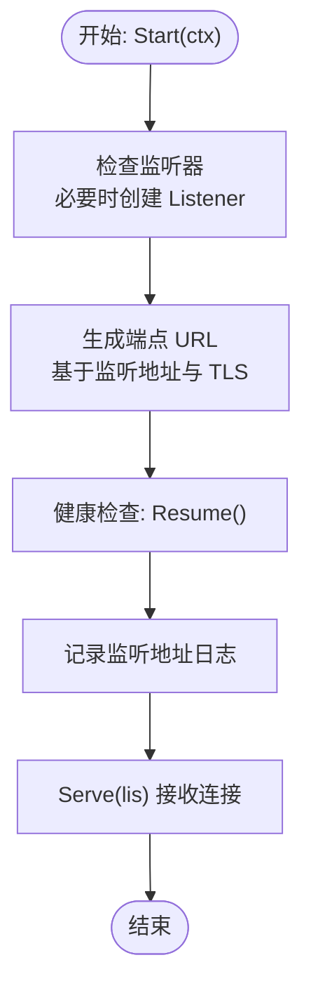
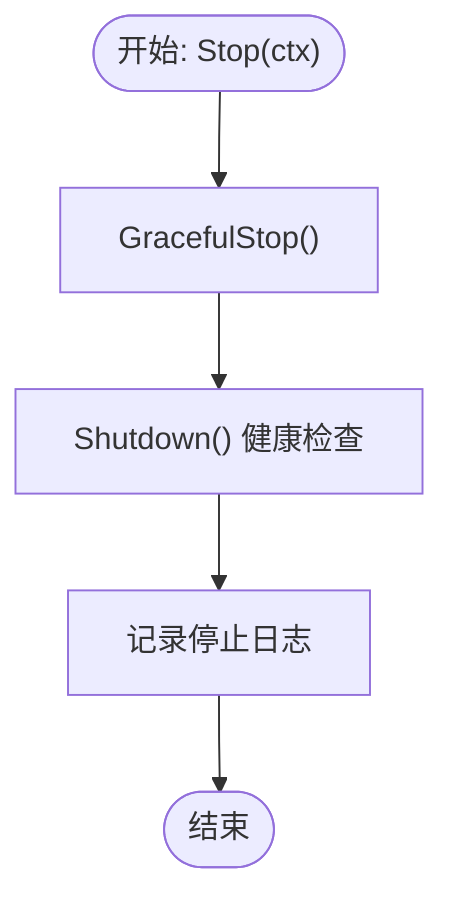
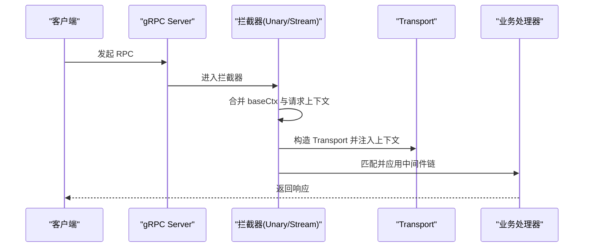
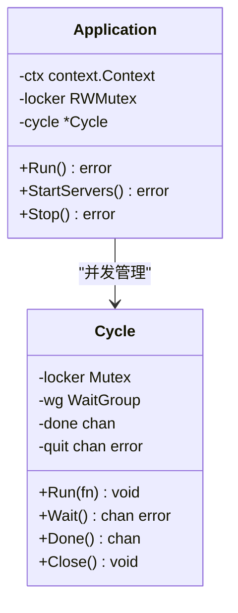
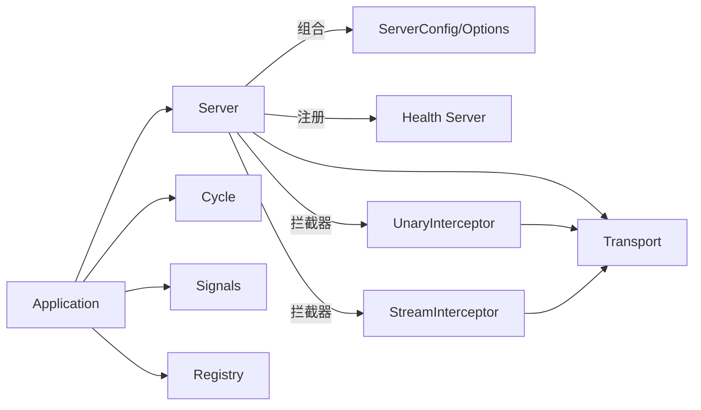

# 服务器生命周期

<cite>
**本文引用的文件**
- [transport/grpc/server.go](file://transport/grpc/server.go)
- [transport/grpc/options.go](file://transport/grpc/options.go)
- [transport/grpc/interceptor.go](file://transport/grpc/interceptor.go)
- [transport/grpc/transport.go](file://transport/grpc/transport.go)
- [transport/transport.go](file://transport/transport.go)
- [app.go](file://app.go)
- [options.go](file://options.go)
- [internal/cycle/cycle.go](file://internal/cycle/cycle.go)
- [internal/signals/signals.go](file://internal/signals/signals.go)
- [internal/signals/signal_posix.go](file://internal/signals/signal_posix.go)
- [internal/signals/signal_windows.go](file://internal/signals/signal_windows.go)
</cite>

## 目录
1. [引言](#引言)
2. [项目结构](#项目结构)
3. [核心组件](#核心组件)
4. [架构总览](#架构总览)
5. [详细组件分析](#详细组件分析)
6. [依赖关系分析](#依赖关系分析)
7. [性能考量](#性能考量)
8. [故障排查指南](#故障排查指南)
9. [结论](#结论)
10. [附录](#附录)

## 引言
本文件聚焦于 Go Fox 框架中的 gRPC 服务器生命周期管理，系统性阐述服务器启动与停止流程、监听器与端点生成、健康检查机制、baseCtx 上下文作用与生命周期管理、状态与并发安全、错误处理、监控与状态查询、以及重启与故障恢复策略。目标是帮助读者在不深入源码细节的前提下，也能准确把握服务器运行机制，并在实践中高效排障与优化。

## 项目结构
围绕 gRPC 服务器生命周期的关键模块如下：
- 传输层 gRPC 服务器实现：负责监听、Serve、健康检查、拦截器链路与端点生成
- 应用层生命周期编排：负责信号捕获、服务注册/注销、并发生命周期管理
- 传输接口与上下文：统一抽象传输能力与上下文注入
- 信号与平台差异：跨平台信号处理
- 循环与并发：生命周期并发控制与错误传播

图表来源
- [app.go](file://app.go#L158-L221)
- [transport/grpc/server.go](file://transport/grpc/server.go#L50-L119)
- [transport/grpc/options.go](file://transport/grpc/options.go#L42-L100)
- [transport/grpc/interceptor.go](file://transport/grpc/interceptor.go#L39-L119)
- [transport/grpc/transport.go](file://transport/grpc/transport.go#L39-L83)
- [internal/cycle/cycle.go](file://internal/cycle/cycle.go#L31-L98)
- [internal/signals/signals.go](file://internal/signals/signals.go#L32-L45)

章节来源
- [app.go](file://app.go#L158-L221)
- [transport/grpc/server.go](file://transport/grpc/server.go#L50-L119)
- [transport/grpc/options.go](file://transport/grpc/options.go#L42-L100)
- [transport/grpc/interceptor.go](file://transport/grpc/interceptor.go#L39-L119)
- [transport/grpc/transport.go](file://transport/grpc/transport.go#L39-L83)
- [internal/cycle/cycle.go](file://internal/cycle/cycle.go#L31-L98)
- [internal/signals/signals.go](file://internal/signals/signals.go#L32-L45)

## 核心组件
- gRPC 服务器 Server：封装 grpc.Server、健康检查、端点、baseCtx、中间件匹配器
- ServerConfig/ServerOption：配置网络、地址、TLS、拦截器、日志、监听器等
- Application/App：应用生命周期编排、信号处理、服务注册/注销、并发控制
- Cycle：并发生命周期管理，统一收集 goroutine 错误并广播
- Signals：跨平台信号捕获与优雅停机触发
- Transport：将 gRPC 请求上下文包装为可查询的传输上下文（Kind、Endpoint、Header 等）

章节来源
- [transport/grpc/server.go](file://transport/grpc/server.go#L50-L119)
- [transport/grpc/options.go](file://transport/grpc/options.go#L42-L100)
- [app.go](file://app.go#L52-L78)
- [internal/cycle/cycle.go](file://internal/cycle/cycle.go#L31-L98)
- [internal/signals/signals.go](file://internal/signals/signals.go#L32-L45)
- [transport/grpc/transport.go](file://transport/grpc/transport.go#L39-L83)

## 架构总览
下图展示从应用启动到服务停止的全链路交互：

图表来源
- [internal/signals/signals.go](file://internal/signals/signals.go#L32-L45)
- [app.go](file://app.go#L253-L282)
- [internal/cycle/cycle.go](file://internal/cycle/cycle.go#L53-L97)
- [transport/grpc/server.go](file://transport/grpc/server.go#L149-L155)

## 详细组件分析

### gRPC 服务器启动流程（Start 方法）
- 监听器创建与端点生成
  - 若未显式设置监听器，则根据配置的网络与地址创建 net.Listener
  - 使用工具函数解析最终监听地址并生成 grpc scheme 的端点 URL
- 健康检查启动
  - 默认注册内置 Health Server；若启用自定义健康检查则跳过默认注册
- 上下文与服务启动
  - 将传入的 ctx 赋给 baseCtx，用于后续拦截器合并请求上下文
  - 调用健康服务 Resume，恢复健康检查状态
  - 记录监听地址日志
  - 调用 Serve(lis) 开始接受连接

图表来源
- [transport/grpc/server.go](file://transport/grpc/server.go#L138-L147)
- [transport/grpc/server.go](file://transport/grpc/server.go#L157-L174)
- [transport/grpc/server.go](file://transport/grpc/server.go#L114-L118)

章节来源
- [transport/grpc/server.go](file://transport/grpc/server.go#L138-L147)
- [transport/grpc/server.go](file://transport/grpc/server.go#L157-L174)
- [transport/grpc/server.go](file://transport/grpc/server.go#L114-L118)

### gRPC 服务器停止流程（Stop 方法）
- 优雅关闭
  - 调用 grpc.Server 的 GracefulStop，允许在途请求完成
- 健康检查关闭
  - 调用健康服务 Shutdown，停止对外健康检查响应
- 资源清理与日志
  - 输出停止日志
- 注意
  - 未显式关闭监听器，由 Serve 的优雅停机机制接管

图表来源
- [transport/grpc/server.go](file://transport/grpc/server.go#L149-L155)

章节来源
- [transport/grpc/server.go](file://transport/grpc/server.go#L149-L155)

### baseCtx 上下文的作用与生命周期管理
- 作用
  - 在拦截器中与每个请求上下文合并，确保请求级超时、日志与追踪等可按需覆盖
- 生命周期
  - 启动时由 Start(ctx) 赋值给 baseCtx
  - 拦截器内部通过合并上下文，形成新的请求上下文，支持超时控制与传输上下文注入
- 与传输上下文的关系
  - 拦截器将 Transport（包含 Kind、Endpoint、Header 等）注入到请求上下文中，便于下游中间件与业务逻辑使用

图表来源
- [transport/grpc/interceptor.go](file://transport/grpc/interceptor.go#L40-L77)
- [transport/grpc/interceptor.go](file://transport/grpc/interceptor.go#L98-L119)
- [transport/grpc/transport.go](file://transport/grpc/transport.go#L39-L83)

章节来源
- [transport/grpc/interceptor.go](file://transport/grpc/interceptor.go#L40-L77)
- [transport/grpc/interceptor.go](file://transport/grpc/interceptor.go#L98-L119)
- [transport/grpc/transport.go](file://transport/grpc/transport.go#L39-L83)

### 服务器状态管理与并发安全性
- 状态
  - 服务器本身无显式“状态枚举”，通过健康检查服务与 Serve 的阻塞行为体现运行/停止状态
- 并发
  - Application 启动阶段使用 WaitGroup 等待所有服务协程就绪
  - 停止阶段通过 Cycle 统一并发停止各服务，收集错误并广播
  - 读写锁保护服务实例信息访问
- 错误传播
  - Cycle 将首个错误通过 Wait 通道返回，保证上层能感知失败

图表来源
- [app.go](file://app.go#L52-L78)
- [app.go](file://app.go#L184-L221)
- [app.go](file://app.go#L253-L282)
- [internal/cycle/cycle.go](file://internal/cycle/cycle.go#L31-L98)

章节来源
- [app.go](file://app.go#L52-L78)
- [app.go](file://app.go#L184-L221)
- [app.go](file://app.go#L253-L282)
- [internal/cycle/cycle.go](file://internal/cycle/cycle.go#L31-L98)

### 错误处理机制
- 启动阶段
  - 监听器创建失败会直接返回错误
  - 端点生成失败同样返回错误
  - 服务注册失败会记录错误并继续后续流程
- 停止阶段
  - 健康检查 Shutdown 与 Serve GracefulStop 不抛出错误，仅记录日志
- 生命周期错误
  - Cycle 通过 quit 通道传播首个错误，Run/Wait/Close 协调退出

章节来源
- [transport/grpc/server.go](file://transport/grpc/server.go#L157-L174)
- [app.go](file://app.go#L210-L215)
- [internal/cycle/cycle.go](file://internal/cycle/cycle.go#L94-L97)

### 监控与状态查询
- 健康检查
  - 默认注册内置 Health Server，可通过 gRPC Health V1 查询服务健康状态
  - 可通过配置禁用默认健康检查，接入自定义健康检查
- 端点暴露
  - Endpoint() 方法返回服务器监听地址（含 scheme 与 TLS 标识），可用于注册中心与外部探测
- 传输上下文
  - Transport 提供 Kind、Endpoint、Operation、Header 等信息，便于中间件与监控采集

章节来源
- [transport/grpc/server.go](file://transport/grpc/server.go#L114-L118)
- [transport/grpc/server.go](file://transport/grpc/server.go#L121-L127)
- [transport/grpc/transport.go](file://transport/grpc/transport.go#L39-L83)

### 重启与故障恢复策略
- 信号驱动的优雅停机
  - 支持 SIGTERM、SIGINT、SIGQUIT 等信号，二次信号强制退出
- 应用级重启
  - Application.Run 启动完成后等待信号，触发 Stop 后退出；可由进程外管理器拉起
- 服务级恢复
  - 建议结合注册中心与探活机制，配合健康检查与端点变更实现快速摘流与重试
- 建议
  - 在 Stop 中增加更细粒度的资源回收（如连接池、缓存等）以缩短恢复时间

章节来源
- [internal/signals/signals.go](file://internal/signals/signals.go#L32-L45)
- [internal/signals/signal_posix.go](file://internal/signals/signal_posix.go#L35)
- [internal/signals/signal_windows.go](file://internal/signals/signal_windows.go#L35)
- [app.go](file://app.go#L253-L282)

## 依赖关系分析
- Server 对 grpc.Server、Health Server、Matcher、TLS Config、日志进行组合
- Application 依赖 Cycle、Signals、Registry、Server 列表
- Transport 作为拦截器产物注入到请求上下文，贯穿中间件链
- Options/ServerConfig 提供配置化能力，支持 TLS、拦截器、监听器等

图表来源
- [transport/grpc/server.go](file://transport/grpc/server.go#L50-L119)
- [transport/grpc/options.go](file://transport/grpc/options.go#L42-L100)
- [transport/grpc/interceptor.go](file://transport/grpc/interceptor.go#L39-L119)
- [transport/grpc/transport.go](file://transport/grpc/transport.go#L39-L83)
- [app.go](file://app.go#L184-L221)

章节来源
- [transport/grpc/server.go](file://transport/grpc/server.go#L50-L119)
- [transport/grpc/options.go](file://transport/grpc/options.go#L42-L100)
- [transport/grpc/interceptor.go](file://transport/grpc/interceptor.go#L39-L119)
- [transport/grpc/transport.go](file://transport/grpc/transport.go#L39-L83)
- [app.go](file://app.go#L184-L221)

## 性能考量
- 监听器与端点生成仅在首次启动时执行，避免重复开销
- 拦截器链在请求路径中最小化额外分配，Header Carrier 采用 metadata.MD 直接承载
- 健康检查默认启用，有助于快速发现异常并降低无效流量
- 建议结合注册中心与探活策略，减少故障节点对整体吞吐的影响

## 故障排查指南
- 启动失败
  - 检查监听地址是否被占用或权限不足
  - 确认 TLS 证书与密钥文件路径正确
- 健康检查异常
  - 若启用自定义健康检查，请确认未重复注册默认 Health Server
  - 使用 Health V1 客户端验证服务状态
- 停止卡顿
  - 检查是否存在长时间阻塞的请求或未及时取消的上下文
  - 关注日志中“停止”记录，确认健康检查已关闭
- 注册/注销问题
  - 确认注册中心配置与网络连通性
  - 查看注销超时配置，避免因超时导致残留实例

章节来源
- [transport/grpc/server.go](file://transport/grpc/server.go#L157-L174)
- [transport/grpc/server.go](file://transport/grpc/server.go#L149-L155)
- [app.go](file://app.go#L210-L215)
- [options.go](file://options.go#L65-L88)

## 结论
Go Fox 的 gRPC 服务器生命周期管理以清晰的职责划分与稳健的并发模型为基础：Server 负责监听、健康检查与拦截器链，Application 负责信号、注册与生命周期编排，Cycle 提供统一的并发与错误传播。通过 baseCtx 与 Transport 的上下文注入，系统在保证可观测性的同时，也为中间件扩展提供了稳定基础。建议在生产环境中结合注册中心与探活策略，完善健康检查与优雅停机流程，以获得更高的可用性与可维护性。

## 附录
- 配置项要点
  - 网络与地址：决定监听套接字与端点
  - TLS：证书与密钥文件或自定义 TLS 配置
  - 自定义健康检查：可禁用默认 Health Server
  - 拦截器：支持链式 Unary 与 Stream 拦截器
- 常用方法路径
  - 启动：[Start](file://transport/grpc/server.go#L138-L147)
  - 停止：[Stop](file://transport/grpc/server.go#L149-L155)
  - 端点：[Endpoint](file://transport/grpc/server.go#L121-L127)
  - 健康检查注册：[NewServerWithConfig](file://transport/grpc/server.go#L69-L119)
  - 应用启动与停止：[Run/Stop](file://app.go#L158-L175), [Stop](file://app.go#L253-L282)
  - 生命周期并发：[Cycle](file://internal/cycle/cycle.go#L53-L97)
  - 信号处理：[Shutdown](file://internal/signals/signals.go#L32-L45)