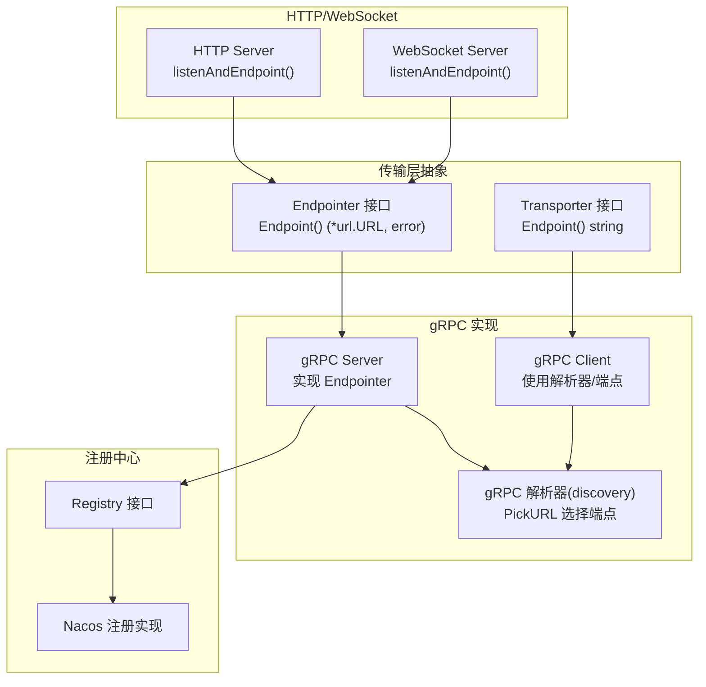
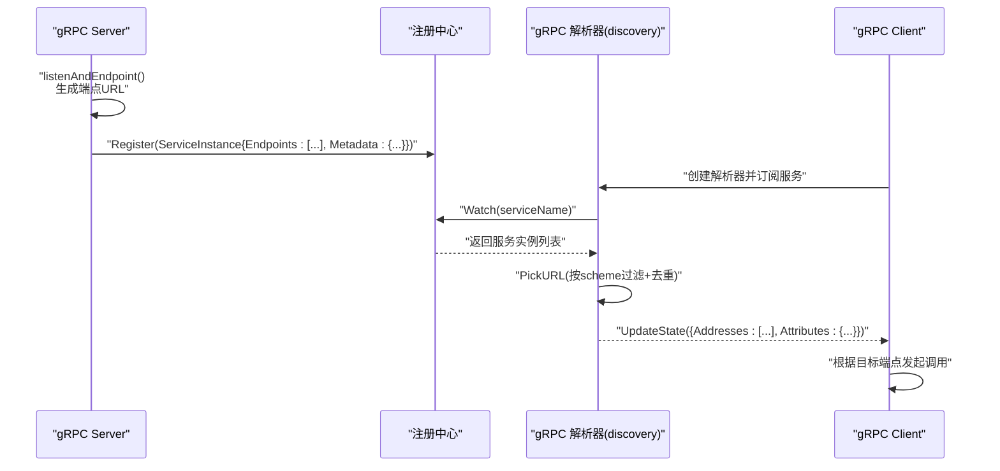
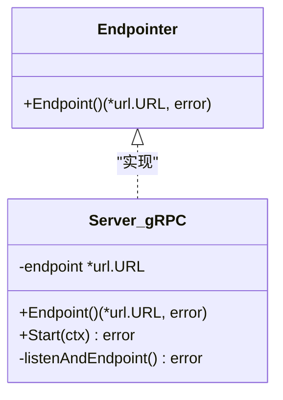
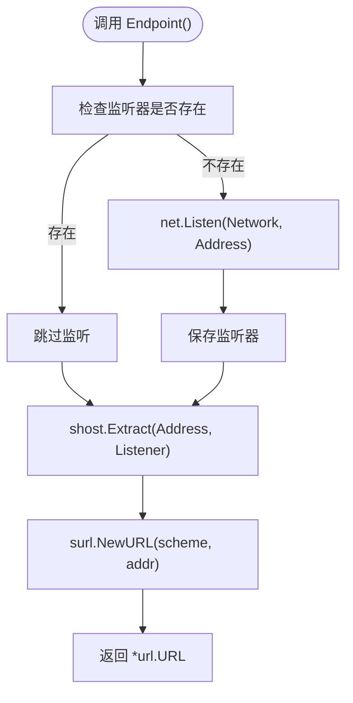
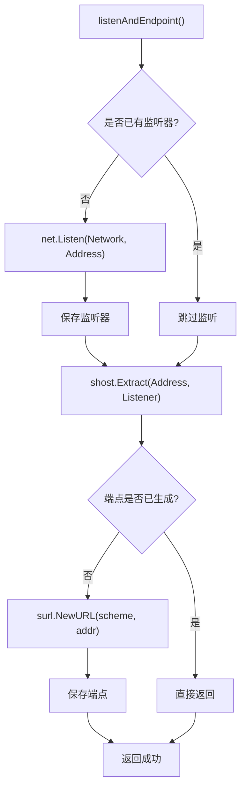
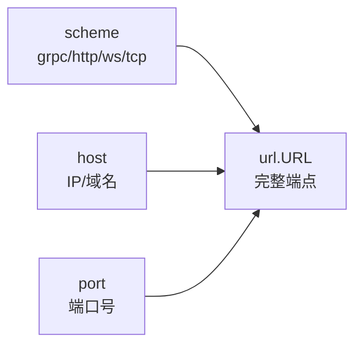
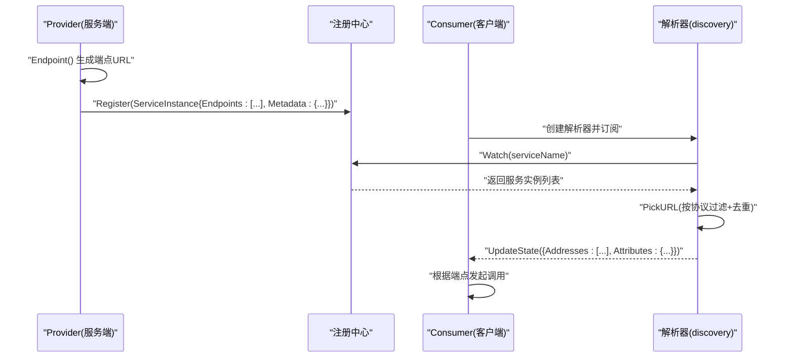
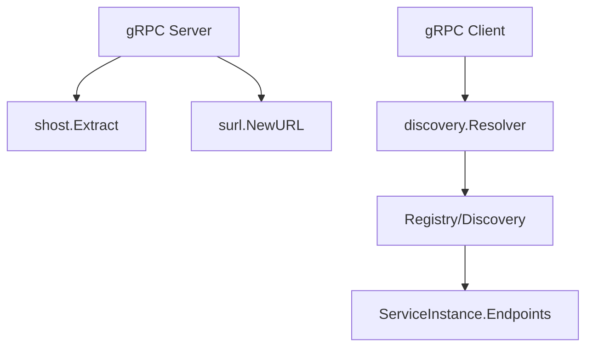

# 端点管理

<cite>
**本文引用的文件**
- [transport/transport.go](file://transport/transport.go)
- [transport/grpc/server.go](file://transport/grpc/server.go)
- [transport/grpc/options.go](file://transport/grpc/options.go)
- [transport/grpc/client.go](file://transport/grpc/client.go)
- [transport/grpc/resolver/discovery/resolver.go](file://transport/grpc/resolver/discovery/resolver.go)
- [transport/grpc/transport.go](file://transport/grpc/transport.go)
- [transport/http/server.go](file://transport/http/server.go)
- [transport/websocket/server.go](file://transport/websocket/server.go)
- [registry/registry.go](file://registry/registry.go)
- [contrib/registry/nacos/registry.go](file://contrib/registry/nacos/registry.go)
</cite>

## 目录
1. [简介](#简介)
2. [项目结构](#项目结构)
3. [核心组件](#核心组件)
4. [架构总览](#架构总览)
5. [详细组件分析](#详细组件分析)
6. [依赖关系分析](#依赖关系分析)
7. [性能考量](#性能考量)
8. [故障排查指南](#故障排查指南)
9. [结论](#结论)
10. [附录](#附录)

## 简介
本文件围绕 Go Fox 的 gRPC 端点管理系统，系统化梳理 Endpointer 接口设计与实现、Endpoint() 方法工作原理、listenAndEndpoint() 函数的控制流、端点 URL 的生成与格式、以及端点在服务注册与发现中的传递机制。同时提供可操作的使用示例、最佳实践与扩展性建议，帮助读者快速理解并正确使用该端点管理体系。

## 项目结构
本节聚焦与端点管理直接相关的模块与文件组织方式：
- 传输层抽象：统一的 Endpointer 接口与 Transporter 抽象，位于 transport 层
- gRPC 服务端与客户端：分别实现 Endpointer，并通过 listenAndEndpoint() 生成端点 URL
- 解析器与发现：基于服务发现的 gRPC 解析器，从服务实例集合中挑选合适端点
- 注册中心：服务实例包含多个端点 URL，注册/反注册时按端点拆分处理

**图表来源**
- [transport/transport.go](file://transport/transport.go#L59-L91)
- [transport/grpc/server.go](file://transport/grpc/server.go#L45-L58)
- [transport/grpc/client.go](file://transport/grpc/client.go#L107-L115)
- [transport/grpc/resolver/discovery/resolver.go](file://transport/grpc/resolver/discovery/resolver.go#L91-L115)
- [transport/http/server.go](file://transport/http/server.go#L135-L152)
- [transport/websocket/server.go](file://transport/websocket/server.go#L284-L301)
- [registry/registry.go](file://registry/registry.go#L17-L55)
- [contrib/registry/nacos/registry.go](file://contrib/registry/nacos/registry.go#L110-L161)

**章节来源**
- [transport/transport.go](file://transport/transport.go#L59-L91)
- [transport/grpc/server.go](file://transport/grpc/server.go#L45-L58)
- [transport/grpc/client.go](file://transport/grpc/client.go#L107-L115)
- [transport/grpc/resolver/discovery/resolver.go](file://transport/grpc/resolver/discovery/resolver.go#L91-L115)
- [transport/http/server.go](file://transport/http/server.go#L135-L152)
- [transport/websocket/server.go](file://transport/websocket/server.go#L284-L301)
- [registry/registry.go](file://registry/registry.go#L76-L95)
- [contrib/registry/nacos/registry.go](file://contrib/registry/nacos/registry.go#L110-L161)

## 核心组件
- Endpointer 接口：统一的服务端“端点”能力抽象，返回标准 URL
- gRPC Server：实现 Endpointer，负责监听与端点生成
- gRPC Client：支持直连端点或通过解析器从服务发现获取端点
- gRPC 解析器：从服务实例集合中按 scheme 过滤并去重，更新 gRPC 客户端状态
- 传输上下文 Transporter：在请求生命周期内携带端点、操作、头部等信息
- 注册中心：服务实例包含多个端点 URL，注册/反注册时按端点拆分处理

**章节来源**
- [transport/transport.go](file://transport/transport.go#L59-L91)
- [transport/grpc/server.go](file://transport/grpc/server.go#L45-L58)
- [transport/grpc/client.go](file://transport/grpc/client.go#L107-L115)
- [transport/grpc/resolver/discovery/resolver.go](file://transport/grpc/resolver/discovery/resolver.go#L91-L115)
- [transport/grpc/transport.go](file://transport/grpc/transport.go#L59-L82)
- [registry/registry.go](file://registry/registry.go#L76-L95)

## 架构总览
下图展示端点管理在 gRPC 场景下的整体交互：服务端生成端点 URL 并注册到注册中心；客户端通过解析器订阅服务变更，动态选择可用端点进行调用。

**图表来源**
- [transport/grpc/server.go](file://transport/grpc/server.go#L121-L174)
- [transport/grpc/resolver/discovery/resolver.go](file://transport/grpc/resolver/discovery/resolver.go#L66-L130)
- [contrib/registry/nacos/registry.go](file://contrib/registry/nacos/registry.go#L110-L161)

## 详细组件分析

### Endpointer 接口设计与实现
- 设计意图：统一不同传输协议的“端点”抽象，便于上层以一致方式获取服务端暴露的访问地址
- 关键方法：Endpoint() 返回标准 URL，错误时返回具体错误
- 实现主体：gRPC Server 显式实现该接口，确保服务启动后可查询自身端点

**图表来源**
- [transport/transport.go](file://transport/transport.go#L59-L62)
- [transport/grpc/server.go](file://transport/grpc/server.go#L45-L58)
- [transport/grpc/server.go](file://transport/grpc/server.go#L121-L174)

**章节来源**
- [transport/transport.go](file://transport/transport.go#L59-L62)
- [transport/grpc/server.go](file://transport/grpc/server.go#L45-L58)
- [transport/grpc/server.go](file://transport/grpc/server.go#L121-L174)

### Endpoint() 方法的工作原理与端点 URL 生成
- 调用时机：首次访问端点时触发监听与地址提取
- 生成流程：
  - 若未显式设置监听器，则按配置的 Network/Address 执行网络监听
  - 使用地址提取工具从监听器与配置地址中推导最终对外可见地址
  - 基于 scheme 与 TLS 配置构造标准 URL（如 grpc:// 或 http://）
- 返回值：标准 URL 对象，供注册与外部感知

**图表来源**
- [transport/grpc/server.go](file://transport/grpc/server.go#L121-L174)

**章节来源**
- [transport/grpc/server.go](file://transport/grpc/server.go#L121-L174)

### listenAndEndpoint() 函数的实现逻辑
- 共同行为：在 gRPC、HTTP、WebSocket 三类服务中均提供相同职责的函数，用于完成监听与端点生成
- 关键步骤：
  - 若未设置监听器则创建监听
  - 若尚未生成端点，则提取地址并构造 URL
  - scheme 由传输类型与 TLS 配置共同决定
- 错误处理：任何一步失败均向上返回错误，避免后续流程使用不完整状态

**图表来源**
- [transport/grpc/server.go](file://transport/grpc/server.go#L157-L174)
- [transport/http/server.go](file://transport/http/server.go#L135-L152)
- [transport/websocket/server.go](file://transport/websocket/server.go#L284-L301)

**章节来源**
- [transport/grpc/server.go](file://transport/grpc/server.go#L157-L174)
- [transport/http/server.go](file://transport/http/server.go#L135-L152)
- [transport/websocket/server.go](file://transport/websocket/server.go#L284-L301)

### 端点 URL 的格式与组成部分
- 组成部分：
  - scheme：由传输类型与 TLS 配置共同决定（如 grpc、http）
  - host/port：通过地址提取工具从监听器与配置地址中确定
- 用途：
  - 服务端自描述：Endpoint() 返回的标准 URL 可用于注册中心
  - 客户端消费：解析器从服务实例集合中挑选匹配 scheme 的端点
  - 传输上下文：在请求上下文中携带端点字符串，便于日志与追踪

**图表来源**
- [transport/grpc/server.go](file://transport/grpc/server.go#L167-L171)
- [transport/http/server.go](file://transport/http/server.go#L144-L149)
- [transport/websocket/server.go](file://transport/websocket/server.go#L293-L298)
- [transport/grpc/transport.go](file://transport/grpc/transport.go#L59-L62)

**章节来源**
- [transport/grpc/server.go](file://transport/grpc/server.go#L167-L171)
- [transport/http/server.go](file://transport/http/server.go#L144-L149)
- [transport/websocket/server.go](file://transport/websocket/server.go#L293-L298)
- [transport/grpc/transport.go](file://transport/grpc/transport.go#L59-L62)

### 端点在服务注册中的作用与传递机制
- 服务端注册：
  - 服务实例包含多个端点 URL（可能包含多种 scheme），注册时逐个解析并上报到注册中心
  - 注册中心通常以“服务名.协议”作为键，便于客户端按协议筛选
- 客户端消费：
  - 客户端可直接指定端点，也可启用解析器从注册中心订阅服务变更
  - 解析器从服务实例集合中按协议筛选端点，去重后更新 gRPC 客户端状态
- 传输上下文：
  - 在请求上下文中携带端点字符串，便于中间件与日志记录

**图表来源**
- [transport/grpc/server.go](file://transport/grpc/server.go#L121-L174)
- [transport/grpc/resolver/discovery/resolver.go](file://transport/grpc/resolver/discovery/resolver.go#L91-L130)
- [registry/registry.go](file://registry/registry.go#L76-L95)
- [contrib/registry/nacos/registry.go](file://contrib/registry/nacos/registry.go#L110-L161)

**章节来源**
- [transport/grpc/server.go](file://transport/grpc/server.go#L121-L174)
- [transport/grpc/resolver/discovery/resolver.go](file://transport/grpc/resolver/discovery/resolver.go#L91-L130)
- [registry/registry.go](file://registry/registry.go#L76-L95)
- [contrib/registry/nacos/registry.go](file://contrib/registry/nacos/registry.go#L110-L161)

### 端点管理的实际使用示例与最佳实践
- 服务端示例要点：
  - 在应用启动阶段调用 Endpoint() 或 Start()，确保端点生成与监听完成
  - 将返回的端点 URL 用于注册中心注册
- 客户端示例要点：
  - 直连模式：通过 WithEndpoint 指定目标端点
  - 发现模式：启用 WithDiscovery，解析器自动拉取并更新端点
  - TLS/非安全：根据业务需要设置 Insecure 或 TLS 配置
- 最佳实践：
  - 明确区分服务端与客户端的端点生成策略
  - 在多协议场景下，确保服务实例 Endpoints 包含所有期望的 scheme
  - 使用解析器时开启调试选项以便定位端点选择问题
  - 结合中间件在请求上下文中记录端点与操作，提升可观测性

**章节来源**
- [transport/grpc/server.go](file://transport/grpc/server.go#L121-L174)
- [transport/grpc/client.go](file://transport/grpc/client.go#L107-L134)
- [transport/grpc/options.go](file://transport/grpc/options.go#L244-L277)

### 端点配置的灵活性与扩展性
- 灵活配置：
  - 支持自定义 Network/Address、TLS、超时、拦截器、负载均衡器等
  - 客户端可按服务名启用解析器，或直接指定端点
- 扩展性：
  - 新增传输类型时，只需实现 Endpointer 与 listenAndEndpoint() 即可复用注册/发现链路
  - 解析器可按需扩展，支持更多协议与过滤规则

**章节来源**
- [transport/grpc/options.go](file://transport/grpc/options.go#L43-L99)
- [transport/grpc/options.go](file://transport/grpc/options.go#L181-L242)
- [transport/grpc/resolver/discovery/resolver.go](file://transport/grpc/resolver/discovery/resolver.go#L91-L115)

## 依赖关系分析
- 低耦合高内聚：
  - 传输层抽象独立于具体协议，便于替换与扩展
  - gRPC Server 仅依赖监听与地址提取工具，端点生成逻辑清晰
- 关键依赖链：
  - gRPC Server -> 监听器 -> 地址提取 -> URL 构造
  - gRPC Client -> 解析器 -> 注册中心 -> 端点列表
  - 注册中心 -> 服务实例 Endpoints -> 端点拆分与注册

**图表来源**
- [transport/grpc/server.go](file://transport/grpc/server.go#L157-L174)
- [transport/grpc/resolver/discovery/resolver.go](file://transport/grpc/resolver/discovery/resolver.go#L91-L115)
- [registry/registry.go](file://registry/registry.go#L76-L95)

**章节来源**
- [transport/grpc/server.go](file://transport/grpc/server.go#L157-L174)
- [transport/grpc/resolver/discovery/resolver.go](file://transport/grpc/resolver/discovery/resolver.go#L91-L115)
- [registry/registry.go](file://registry/registry.go#L76-L95)

## 性能考量
- 端点生成成本低：监听与地址提取为本地操作，开销极小
- 解析器更新频率：服务变更时批量更新，避免频繁抖动
- 负载均衡：结合权重轮询等策略，提升整体吞吐与稳定性
- TLS 开销：生产环境建议开启 TLS，但注意证书加载与握手成本

## 故障排查指南
- 端点为空或不可达：
  - 检查监听器创建是否成功，确认 Address 是否被占用
  - 核对地址提取逻辑与网络配置
- 注册中心无端点：
  - 确认服务实例 Endpoints 是否包含期望的 scheme
  - 检查注册中心键命名（服务名.协议）是否正确
- 客户端无法解析：
  - 启用解析器调试日志，确认 Watch 是否正常返回
  - 核对 PickURL 过滤条件与去重逻辑
- TLS 相关错误：
  - 确认证书路径与密钥正确，或启用 Insecure 模式验证问题范围

**章节来源**
- [transport/grpc/server.go](file://transport/grpc/server.go#L157-L174)
- [transport/grpc/resolver/discovery/resolver.go](file://transport/grpc/resolver/discovery/resolver.go#L73-L83)
- [contrib/registry/nacos/registry.go](file://contrib/registry/nacos/registry.go#L110-L161)

## 结论
Go Fox 的端点管理体系通过统一的 Endpointer 抽象与标准化的 URL 生成流程，实现了 gRPC 服务端与客户端在端点管理上的高度一致性。结合服务注册与发现机制，系统能够在多协议、多负载均衡策略下稳定运行。遵循本文的最佳实践与扩展建议，可进一步提升系统的可观测性、可维护性与弹性。

## 附录
- 相关接口与类型参考：
  - Endpointer：统一端点抽象
  - Transporter：传输上下文接口
  - ServiceInstance：包含多个端点 URL 的服务实例
  - Registry/Discovery：注册与发现接口

**章节来源**
- [transport/transport.go](file://transport/transport.go#L59-L91)
- [registry/registry.go](file://registry/registry.go#L76-L95)