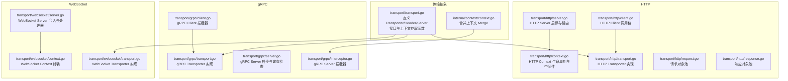
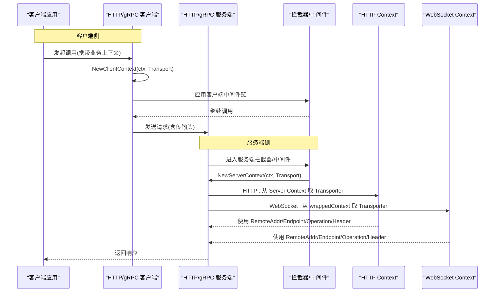
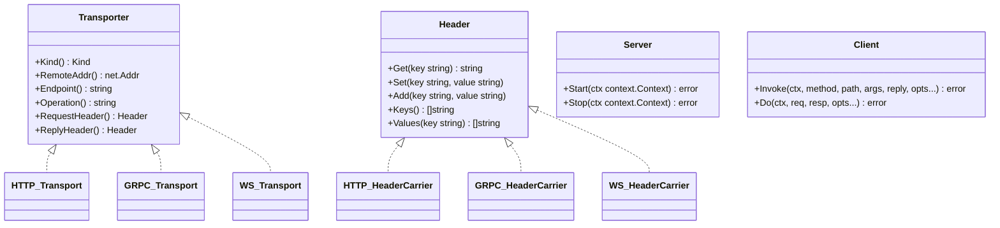
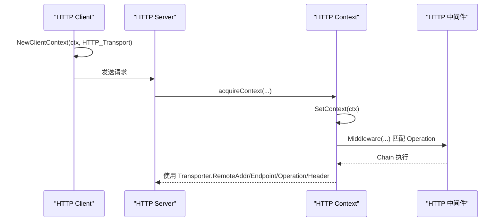
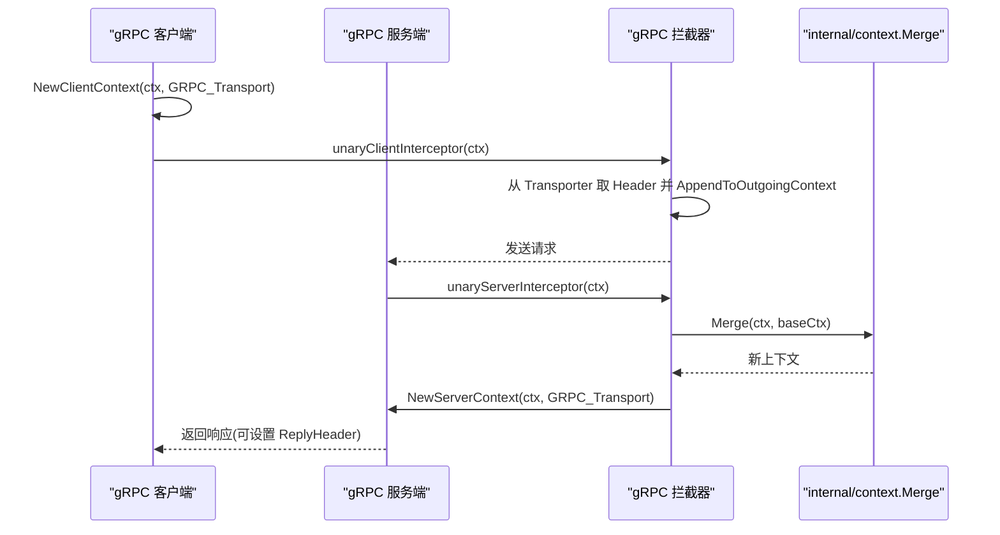
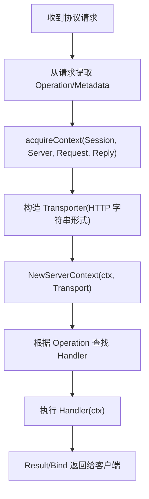
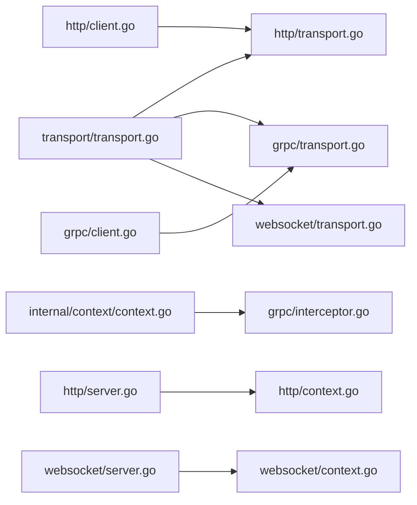

# 传输上下文管理

<cite>
**本文引用的文件**
- [transport.go](file://transport/transport.go)
- [context.go](file://internal/context/context.go)
- [http/transport.go](file://transport/http/transport.go)
- [http/context.go](file://transport/http/context.go)
- [http/server.go](file://transport/http/server.go)
- [http/client.go](file://transport/http/client.go)
- [http/request.go](file://transport/http/request.go)
- [http/response.go](file://transport/http/response.go)
- [grpc/transport.go](file://transport/grpc/transport.go)
- [grpc/server.go](file://transport/grpc/server.go)
- [grpc/client.go](file://transport/grpc/client.go)
- [grpc/interceptor.go](file://transport/grpc/interceptor.go)
- [websocket/transport.go](file://transport/websocket/transport.go)
- [websocket/context.go](file://transport/websocket/context.go)
- [websocket/server.go](file://transport/websocket/server.go)
</cite>

## 目录
1. [简介](#简介)
2. [项目结构](#项目结构)
3. [核心组件](#核心组件)
4. [架构总览](#架构总览)
5. [组件详解](#组件详解)
6. [依赖关系分析](#依赖关系分析)
7. [性能考量](#性能考量)
8. [故障排查指南](#故障排查指南)
9. [结论](#结论)
10. [附录：最佳实践与示例路径](#附录最佳实践与示例路径)

## 简介
本技术文档围绕 Go Fox 的“传输上下文管理”展开，系统阐述以下主题：
- 传输上下文的概念与作用，区分 Server Context 与 Client Context
- Transporter 接口的实现与上下文值的存储机制
- 不同传输协议（HTTP、gRPC、WebSocket）下的上下文管理差异
- 关键信息的获取与使用：RemoteAddr、Endpoint、Operation、Header
- Header 接口在各协议中的实现方式
- 上下文传递的最佳实践、性能优化与生命周期管理
- 实际使用示例与常见问题的解决方案

## 项目结构
本仓库采用按协议分层的组织方式，核心传输抽象位于 transport 包，具体协议实现分别在 transport/http、transport/grpc、transport/websocket 下。内部上下文合并工具位于 internal/context。

图表来源
- [transport.go](file://transport/transport.go#L44-L125)
- [context.go](file://internal/context/context.go#L46-L139)
- [http/transport.go](file://transport/http/transport.go#L34-L137)
- [http/context.go](file://transport/http/context.go#L53-L136)
- [http/server.go](file://transport/http/server.go#L53-L235)
- [http/client.go](file://transport/http/client.go#L43-L224)
- [http/request.go](file://transport/http/request.go#L31-L39)
- [http/response.go](file://transport/http/response.go#L31-L39)
- [grpc/transport.go](file://transport/grpc/transport.go#L34-L118)
- [grpc/server.go](file://transport/grpc/server.go#L50-L175)
- [grpc/client.go](file://transport/grpc/client.go#L55-L184)
- [grpc/interceptor.go](file://transport/grpc/interceptor.go#L39-L120)
- [websocket/transport.go](file://transport/websocket/transport.go#L34-L120)
- [websocket/context.go](file://transport/websocket/context.go#L35-L88)
- [websocket/server.go](file://transport/websocket/server.go#L56-L302)

章节来源
- [transport.go](file://transport/transport.go#L44-L125)
- [http/transport.go](file://transport/http/transport.go#L34-L137)
- [grpc/transport.go](file://transport/grpc/transport.go#L34-L118)
- [websocket/transport.go](file://transport/websocket/transport.go#L34-L120)

## 核心组件
- Transporter 接口：统一抽象不同传输协议的上下文能力，包括 Kind、RemoteAddr、Endpoint、Operation、RequestHeader、ReplyHeader。
- Header 接口：统一抽象请求/响应头的读写与枚举。
- Server/Client 接口：统一抽象服务端与客户端生命周期。
- 上下文存取函数：NewServerContext/NewClientContext/FromServerContext/FromClientContext 提供 Transporter 在 context 中的存取。
- 内部上下文合并：Merge 提供将多个父上下文合并为一个新上下文的能力，便于在 gRPC Server 拦截器中融合 baseCtx 与传入 ctx。

章节来源
- [transport.go](file://transport/transport.go#L44-L125)
- [context.go](file://internal/context/context.go#L46-L139)

## 架构总览
下图展示跨协议的上下文注入与传递流程，强调 Server Context 与 Client Context 的注入点与使用点。

图表来源
- [http/client.go](file://transport/http/client.go#L101-L142)
- [grpc/client.go](file://transport/grpc/client.go#L136-L169)
- [grpc/interceptor.go](file://transport/grpc/interceptor.go#L39-L77)
- [http/context.go](file://transport/http/context.go#L127-L150)
- [websocket/server.go](file://transport/websocket/server.go#L247-L282)

## 组件详解

### Transporter 接口与上下文存取
- Transporter 定义了传输层通用能力：Kind、RemoteAddr、Endpoint、Operation、RequestHeader、ReplyHeader。
- Server Context 与 Client Context 分别通过 NewServerContext/NewClientContext 注入到 context；FromServerContext/FromClientContext 取出。
- Peer 信息通过 NewPeerClient/FromPeerContext 存取，用于负载均衡与节点选择。

图表来源
- [transport.go](file://transport/transport.go#L44-L125)
- [http/transport.go](file://transport/http/transport.go#L34-L137)
- [grpc/transport.go](file://transport/grpc/transport.go#L34-L118)
- [websocket/transport.go](file://transport/websocket/transport.go#L34-L120)

章节来源
- [transport.go](file://transport/transport.go#L44-L125)

### HTTP 协议上下文管理
- HTTP Transporter 实现：封装请求/响应头、远端地址、操作名、路径模板与端点字符串。
- HeaderCarrier 将 fasthttp 请求/响应头适配为 Header 接口。
- 服务端：ServeFastHTTP 中构建 Context，注入 Server Context；中间件通过 FromServerContext 获取 Transporter 并按 Operation 匹配。
- 客户端：Invoke 时构造 Transporter 并通过 NewClientContext 注入；随后进入中间件链与网络调用。

图表来源
- [http/client.go](file://transport/http/client.go#L101-L142)
- [http/server.go](file://transport/http/server.go#L101-L133)
- [http/context.go](file://transport/http/context.go#L80-L150)
- [http/transport.go](file://transport/http/transport.go#L34-L137)

章节来源
- [http/transport.go](file://transport/http/transport.go#L34-L137)
- [http/context.go](file://transport/http/context.go#L53-L150)
- [http/server.go](file://transport/http/server.go#L53-L133)
- [http/client.go](file://transport/http/client.go#L43-L142)
- [http/request.go](file://transport/http/request.go#L31-L39)
- [http/response.go](file://transport/http/response.go#L31-L39)

### gRPC 协议上下文管理
- gRPC Transporter 实现：基于 metadata.MD 存储请求/响应头，记录远端地址与方法名。
- 服务端拦截器：从 incoming metadata 构造 Transporter，注入 Server Context；可设置 ReplyHeader 并与 baseCtx 合并。
- 客户端拦截器：构造 Transporter 并注入 Client Context；将 Header 写入 outgoing metadata。

图表来源
- [grpc/client.go](file://transport/grpc/client.go#L136-L169)
- [grpc/interceptor.go](file://transport/grpc/interceptor.go#L39-L77)
- [context.go](file://internal/context/context.go#L46-L139)
- [grpc/transport.go](file://transport/grpc/transport.go#L34-L118)

章节来源
- [grpc/transport.go](file://transport/grpc/transport.go#L34-L118)
- [grpc/interceptor.go](file://transport/grpc/interceptor.go#L39-L120)
- [grpc/client.go](file://transport/grpc/client.go#L55-L184)
- [grpc/server.go](file://transport/grpc/server.go#L50-L175)

### WebSocket 协议上下文管理
- WebSocket Transporter 实现：基于自定义协议消息的元数据 map 存储请求/响应头。
- 服务端：连接建立后，从请求协议消息提取操作名与元数据，构造 wrappedContext 并注入 Server Context；按操作名路由到处理器。
- Context 封装：wrappedContext 暴露 Result/Bind 等便捷方法，屏蔽底层 Session 与编解码细节。

图表来源
- [websocket/server.go](file://transport/websocket/server.go#L247-L282)
- [websocket/transport.go](file://transport/websocket/transport.go#L34-L120)
- [websocket/context.go](file://transport/websocket/context.go#L35-L88)

章节来源
- [websocket/transport.go](file://transport/websocket/transport.go#L34-L120)
- [websocket/context.go](file://transport/websocket/context.go#L35-L88)
- [websocket/server.go](file://transport/websocket/server.go#L56-L302)

### Header 接口在不同协议中的实现
- HTTP：headerCarrier 包装 fasthttp 请求/响应头，实现 Header 接口。
- gRPC：headerCarrier 包装 metadata.MD，实现 Header 接口。
- WebSocket：headerCarrier 为 map[string]string，实现 Header 接口。

章节来源
- [http/transport.go](file://transport/http/transport.go#L79-L125)
- [grpc/transport.go](file://transport/grpc/transport.go#L84-L118)
- [websocket/transport.go](file://transport/websocket/transport.go#L81-L120)

### 关键信息的获取与使用
- RemoteAddr：HTTP 与 gRPC 由 Transporter 直接返回 net.Addr；WebSocket 由 Session 的底层连接返回。
- Endpoint：HTTP/gRPC 为字符串端点；WebSocket 为服务端监听地址字符串。
- Operation：HTTP 由路由或 SetOperation 设置；gRPC 为 FullMethod；WebSocket 为协议请求的 Operation。
- Header：RequestHeader/ReplyHeader 由各协议 Transporter 提供，支持 Get/Set/Add/Keys/Values。

章节来源
- [http/transport.go](file://transport/http/transport.go#L34-L137)
- [grpc/transport.go](file://transport/grpc/transport.go#L34-L118)
- [websocket/transport.go](file://transport/websocket/transport.go#L34-L120)

## 依赖关系分析
- 传输抽象层（transport）被各协议实现依赖，提供统一接口与上下文存取。
- gRPC 服务端拦截器依赖 internal/context.Merge 将 baseCtx 与传入 ctx 合并。
- HTTP 与 WebSocket 服务端通过 Context 生命周期管理中间件与资源回收。
- 客户端在拦截器/中间件中读取 Transporter 的 Header 并写入 outgoing 上下文。

图表来源
- [transport.go](file://transport/transport.go#L44-L125)
- [context.go](file://internal/context/context.go#L46-L139)
- [http/transport.go](file://transport/http/transport.go#L34-L137)
- [grpc/transport.go](file://transport/grpc/transport.go#L34-L118)
- [websocket/transport.go](file://transport/websocket/transport.go#L34-L120)
- [grpc/interceptor.go](file://transport/grpc/interceptor.go#L39-L120)
- [http/server.go](file://transport/http/server.go#L53-L133)
- [http/context.go](file://transport/http/context.go#L53-L150)
- [websocket/server.go](file://transport/websocket/server.go#L56-L114)
- [websocket/context.go](file://transport/websocket/context.go#L35-L88)
- [http/client.go](file://transport/http/client.go#L43-L142)
- [grpc/client.go](file://transport/grpc/client.go#L55-L184)

章节来源
- [transport.go](file://transport/transport.go#L44-L125)
- [context.go](file://internal/context/context.go#L46-L139)
- [grpc/interceptor.go](file://transport/grpc/interceptor.go#L39-L120)
- [http/context.go](file://transport/http/context.go#L53-L150)
- [websocket/server.go](file://transport/websocket/server.go#L56-L114)

## 性能考量
- 对象池化：HTTP 请求/响应使用对象池减少 GC 压力，提升吞吐。
- 上下文合并：gRPC 拦截器使用 internal/context.Merge 合并 baseCtx 与传入 ctx，避免重复创建上下文。
- Header 访问：各协议 HeaderCarrier 采用直接映射，避免额外拷贝与转换。
- 超时控制：HTTP/WebSocket 支持配置超时，gRPC 客户端/服务端支持超时拦截与设置。
- 资源释放：HTTP/WS Context 生命周期内正确归还对象池与关闭连接，防止资源泄露。

章节来源
- [http/request.go](file://transport/http/request.go#L31-L39)
- [http/response.go](file://transport/http/response.go#L31-L39)
- [context.go](file://internal/context/context.go#L46-L139)
- [websocket/server.go](file://transport/websocket/server.go#L168-L197)

## 故障排查指南
- 无法获取 Transporter：确认是否正确调用 NewServerContext/NewClientContext 注入，以及在正确的阶段调用 FromServerContext/FromClientContext。
- Header 为空：检查客户端是否将 Header 写入 Transporter，gRPC 是否通过 AppendToOutgoingContext 写入 outgoing metadata。
- Operation 匹配失败：HTTP 中可通过 SetOperation 动态设置；gRPC 与 WebSocket 由框架自动设置，确认匹配规则与前缀。
- 超时未生效：确认客户端/服务端是否设置了超时拦截器或上下文超时。
- WebSocket 未路由到处理器：检查请求的 Operation 是否与注册一致，以及 handlerMap 是否已注册。

章节来源
- [transport.go](file://transport/transport.go#L93-L124)
- [http/transport.go](file://transport/http/transport.go#L127-L137)
- [grpc/client.go](file://transport/grpc/client.go#L136-L169)
- [websocket/server.go](file://transport/websocket/server.go#L247-L282)

## 结论
Go Fox 的传输上下文管理通过统一的 Transporter 接口与 Header 抽象，实现了 HTTP、gRPC、WebSocket 三类协议的一致性上下文承载。借助 Server/Client Context 注入与中间件/拦截器链路，开发者可以在不感知底层协议的情况下完成远程地址、端点、操作名与头部信息的读取与写入。配合对象池化、上下文合并与超时控制，整体具备良好的性能与可维护性。

## 附录：最佳实践与示例路径
- 最佳实践
  - 在服务端入口尽早注入 Server Context，确保中间件链可访问 Transporter。
  - 在客户端入口注入 Client Context，并在拦截器中读取/写入 Header。
  - 使用 SetOperation 动态覆盖 HTTP 的 Operation，保证中间件匹配准确。
  - 合理设置超时与并发参数，避免阻塞与资源耗尽。
  - 正确释放对象池与连接，避免内存泄漏。
- 示例路径
  - HTTP 客户端调用与上下文注入：[http/client.go](file://transport/http/client.go#L101-L142)
  - gRPC 客户端拦截器与 Header 写入：[grpc/client.go](file://transport/grpc/client.go#L136-L169)
  - gRPC 服务端拦截器与上下文合并：[grpc/interceptor.go](file://transport/grpc/interceptor.go#L39-L77)
  - HTTP 中间件按 Operation 匹配：[http/context.go](file://transport/http/context.go#L137-L150)
  - WebSocket 服务端按 Operation 路由：[websocket/server.go](file://transport/websocket/server.go#L247-L282)
  - Header 接口在各协议中的实现：[http/transport.go](file://transport/http/transport.go#L79-L125)、[grpc/transport.go](file://transport/grpc/transport.go#L84-L118)、[websocket/transport.go](file://transport/websocket/transport.go#L81-L120)