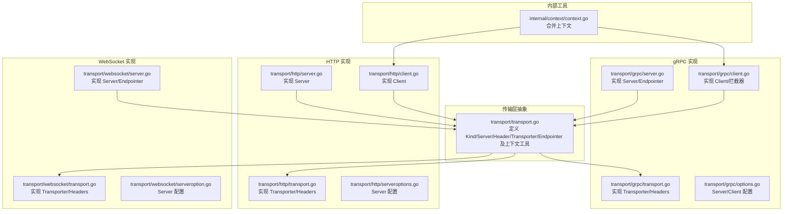
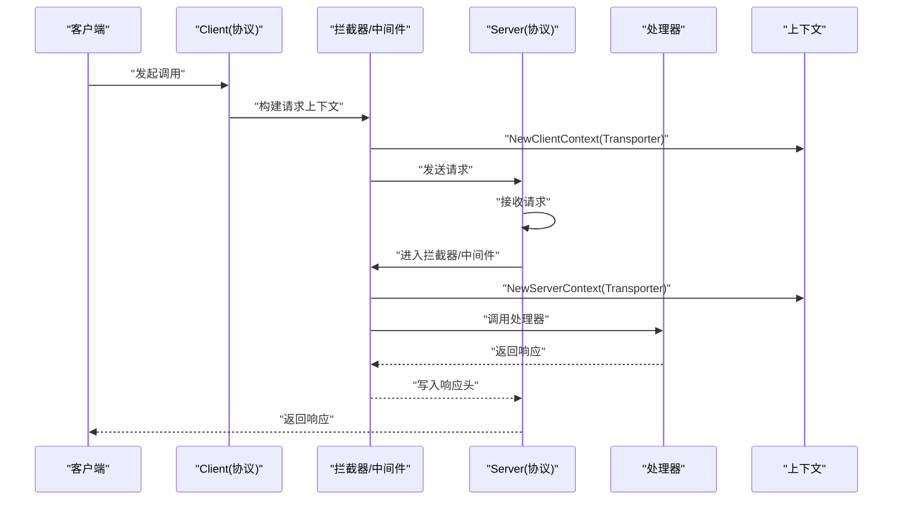
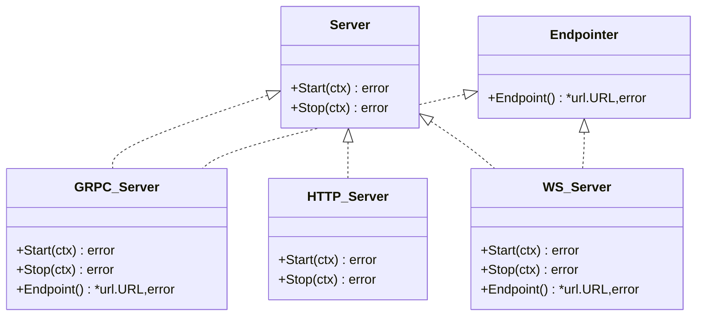
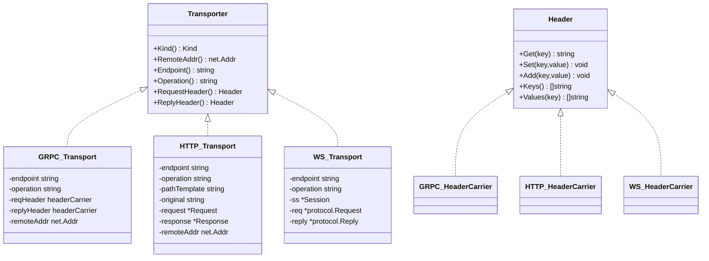
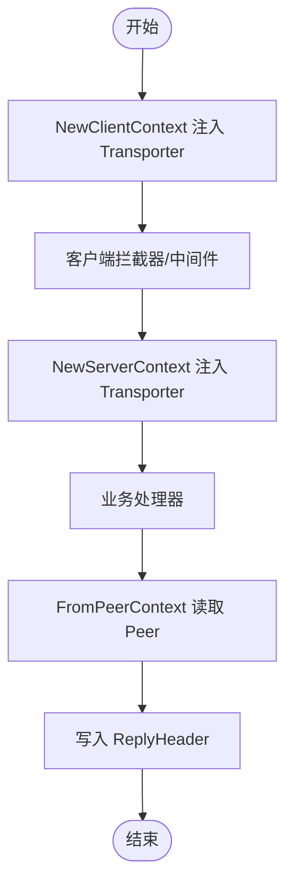
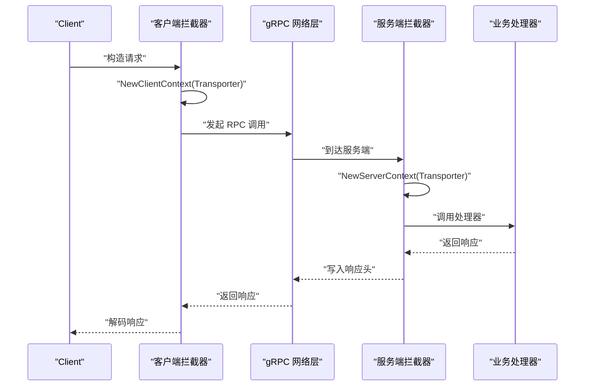
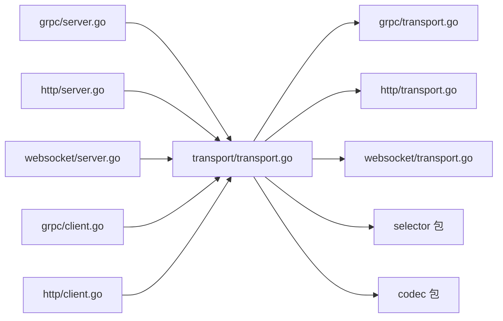

# 传输层抽象设计

<cite>
**本文引用的文件**
- [transport.go](file://transport/transport.go)
- [grpc/transport.go](file://transport/grpc/transport.go)
- [http/transport.go](file://transport/http/transport.go)
- [websocket/transport.go](file://transport/websocket/transport.go)
- [grpc/server.go](file://transport/grpc/server.go)
- [http/server.go](file://transport/http/server.go)
- [websocket/server.go](file://transport/websocket/server.go)
- [grpc/client.go](file://transport/grpc/client.go)
- [http/client.go](file://transport/http/client.go)
- [grpc/options.go](file://transport/grpc/options.go)
- [http/serveroptions.go](file://transport/http/serveroptions.go)
- [websocket/serveroption.go](file://transport/websocket/serveroption.go)
- [internal/context/context.go](file://internal/context/context.go)
</cite>

## 目录
1. [简介](#简介)
2. [项目结构](#项目结构)
3. [核心组件](#核心组件)
4. [架构总览](#架构总览)
5. [详细组件分析](#详细组件分析)
6. [依赖关系分析](#依赖关系分析)
7. [性能考量](#性能考量)
8. [故障排查指南](#故障排查指南)
9. [结论](#结论)
10. [附录](#附录)

## 简介
本文件系统性梳理 Go Fox 传输层抽象的设计与实现，围绕核心接口与类型展开：Server 接口、Transporter 接口、Header 接口、Kind 类型以及 Endpointer 接口；阐释如何通过统一的上下文管理机制（NewServerContext、FromServerContext、NewClientContext、FromClientContext、NewPeerClient、FromPeerContext）在不同传输协议之间共享传输上下文；并结合 gRPC、HTTP、WebSocket 的具体实现，说明多协议支持的策略与最佳实践。

## 项目结构
传输层抽象位于 transport 包中，各子协议（grpc、http、websocket）分别实现 Server、Client、Transporter、Header 等类型，形成“统一抽象 + 协议特化”的分层设计。

图表来源
- [transport.go](file://transport/transport.go#L39-L124)
- [grpc/transport.go](file://transport/grpc/transport.go#L34-L117)
- [http/transport.go](file://transport/http/transport.go#L34-L136)
- [websocket/transport.go](file://transport/websocket/transport.go#L34-L119)
- [grpc/server.go](file://transport/grpc/server.go#L45-L174)
- [http/server.go](file://transport/http/server.go#L44-L234)
- [websocket/server.go](file://transport/websocket/server.go#L49-L301)
- [grpc/client.go](file://transport/grpc/client.go#L55-L183)
- [http/client.go](file://transport/http/client.go#L43-L223)
- [grpc/options.go](file://transport/grpc/options.go#L42-L342)
- [http/serveroptions.go](file://transport/http/serveroptions.go#L37-L230)
- [websocket/serveroption.go](file://transport/websocket/serveroption.go#L50-L192)
- [internal/context/context.go](file://internal/context/context.go#L45-L138)

章节来源
- [transport.go](file://transport/transport.go#L39-L124)
- [grpc/server.go](file://transport/grpc/server.go#L45-L174)
- [http/server.go](file://transport/http/server.go#L44-L234)
- [websocket/server.go](file://transport/websocket/server.go#L49-L301)

## 核心组件
- Kind 类型：用于标识传输协议种类，如 "GRPC"、"http"、"websocket"，统一在各协议实现中定义常量。
- Server 接口：统一的服务生命周期管理（Start/Stop），由各协议的 Server 实现。
- Transporter 接口：统一的传输上下文载体，提供 Kind、RemoteAddr、Endpoint、Operation、RequestHeader、ReplyHeader 等能力。
- Header 接口：统一的头部读写抽象，屏蔽底层协议差异（metadata.MD、http.Header、自定义 map 等）。
- Endpointer 接口：统一暴露服务端监听地址（返回 *url.URL），便于注册中心或客户端发现。
- 上下文工具：NewServerContext/FromServerContext、NewClientContext/FromClientContext、NewPeerClient/FromPeerContext，用于在中间件、拦截器、处理器间传递 Transporter 和 Peer 信息。

章节来源
- [transport.go](file://transport/transport.go#L39-L124)
- [grpc/transport.go](file://transport/grpc/transport.go#L34-L117)
- [http/transport.go](file://transport/http/transport.go#L34-L136)
- [websocket/transport.go](file://transport/websocket/transport.go#L34-L119)

## 架构总览
传输层抽象以“统一接口 + 协议实现”为核心，通过 Server/Transporter/Header/Endpointer 四大抽象，屏蔽 gRPC、HTTP、WebSocket 的差异，使上层业务仅面向接口编程。客户端与服务端均通过拦截器/中间件注入 Transporter 到 context，从而在调用链路中可读取传输元数据（如远端地址、操作名、头部等）。

图表来源
- [grpc/client.go](file://transport/grpc/client.go#L136-L168)
- [http/client.go](file://transport/http/client.go#L101-L167)
- [websocket/server.go](file://transport/websocket/server.go#L247-L282)
- [transport.go](file://transport/transport.go#L93-L124)

## 详细组件分析

### Kind 类型与多协议支持
- 定义位置：transport/transport.go 中的 Kind 类型。
- 各协议实现：
  - gRPC：常量 KindGRPC，值为 "GRPC"
  - HTTP：常量 KindHttp，值为 "http"
  - WebSocket：常量 KindWebsocket，值为 "websocket"
- 多协议支持策略：
  - 通过 Kind 统一标识协议类型，便于日志、指标、路由选择等场景使用。
  - 在客户端/服务端根据 Kind 决定序列化/反序列化、头部封装、负载均衡策略等。

章节来源
- [transport.go](file://transport/transport.go#L39-L42)
- [grpc/transport.go](file://transport/grpc/transport.go#L34-L35)
- [http/transport.go](file://transport/http/transport.go#L34-L35)
- [websocket/transport.go](file://transport/websocket/transport.go#L34-L34)

### Server 接口与 Endpointer
- Server 接口：统一 Start/Stop 生命周期，由各协议 Server 实现。
- Endpointer 接口：统一 Endpoint() 返回 *url.URL，便于服务发现与客户端解析。
- 典型实现：
  - gRPC Server：实现 Server 与 Endpointer，监听网络端口，生成 endpoint URL。
  - HTTP Server：实现 Server，内部使用 fasthttp，支持 TLS、中间件、路由树。
  - WebSocket Server：实现 Server 与 Endpointer，基于 fasthttp 升级为 WebSocket，维护会话池与处理池。

图表来源
- [transport.go](file://transport/transport.go#L44-L62)
- [grpc/server.go](file://transport/grpc/server.go#L45-L58)
- [http/server.go](file://transport/http/server.go#L44-L63)
- [websocket/server.go](file://transport/websocket/server.go#L49-L65)

章节来源
- [transport.go](file://transport/transport.go#L44-L62)
- [grpc/server.go](file://transport/grpc/server.go#L121-L174)
- [http/server.go](file://transport/http/server.go#L135-L234)
- [websocket/server.go](file://transport/websocket/server.go#L116-L301)

### Transporter 接口与 Header 抽象
- Transporter 接口：统一 Kind、RemoteAddr、Endpoint、Operation、RequestHeader、ReplyHeader 能力。
- Header 接口：统一 Get/Set/Add/Keys/Values，屏蔽底层头部实现差异。
- 各协议实现要点：
  - gRPC Transporter：基于 metadata.MD 封装 headerCarrier，实现 Header 接口。
  - HTTP Transporter：基于 fasthttp 的 header 接口，通过 newHeaderCarrier 实现 Header。
  - WebSocket Transporter：基于 map[string]string 实现 headerCarrier，满足 Header 接口。

图表来源
- [transport.go](file://transport/transport.go#L64-L86)
- [grpc/transport.go](file://transport/grpc/transport.go#L39-L117)
- [http/transport.go](file://transport/http/transport.go#L39-L125)
- [websocket/transport.go](file://transport/websocket/transport.go#L43-L119)

章节来源
- [transport.go](file://transport/transport.go#L50-L86)
- [grpc/transport.go](file://transport/grpc/transport.go#L84-L117)
- [http/transport.go](file://transport/http/transport.go#L79-L125)
- [websocket/transport.go](file://transport/websocket/transport.go#L81-L119)

### 传输上下文管理机制
- NewServerContext/FromServerContext：在服务端接收请求时注入 Transporter，供后续中间件/处理器读取。
- NewClientContext/FromClientContext：在客户端发起请求时注入 Transporter，供拦截器/中间件读取。
- NewPeerClient/FromPeerContext：注入 selector.Peer，用于负载均衡与节点选择。
- 内部上下文合并：internal/context/Merge 提供合并两个 context 的能力，常用于拦截器/中间件组合场景。

图表来源
- [transport.go](file://transport/transport.go#L93-L124)
- [internal/context/context.go](file://internal/context/context.go#L45-L138)

章节来源
- [transport.go](file://transport/transport.go#L88-L124)
- [internal/context/context.go](file://internal/context/context.go#L45-L138)

### 客户端与服务端交互流程（以 gRPC 为例）

图表来源
- [grpc/client.go](file://transport/grpc/client.go#L136-L168)
- [grpc/server.go](file://transport/grpc/server.go#L91-L106)

章节来源
- [grpc/client.go](file://transport/grpc/client.go#L136-L168)
- [grpc/server.go](file://transport/grpc/server.go#L91-L106)

### HTTP 客户端调用流程
- 客户端构造请求，设置 Content-Type、User-Agent 等头部。
- 通过 Transporter 注入到上下文，随后进入中间件链。
- 若启用服务发现与选择器，会从 selector 选择目标节点并设置 Host/URI。
- 最终通过 fasthttp HostClient 发送请求，解码响应并返回。

章节来源
- [http/client.go](file://transport/http/client.go#L101-L223)

### WebSocket 服务端处理流程
- 服务端升级 HTTP 连接为 WebSocket，维护会话池与处理池。
- 接收消息后，构造 Transporter 并注入上下文，按操作名分发到对应处理器。
- 支持连接/断开拦截器、授权回调、编解码器等配置。

章节来源
- [websocket/server.go](file://transport/websocket/server.go#L161-L282)
- [websocket/serveroption.go](file://transport/websocket/serveroption.go#L50-L192)

## 依赖关系分析
- 传输层抽象依赖：
  - codec 包初始化（JSON/Proto/TOML/XML/YAML），用于 HTTP/WS 编解码。
  - selector 包，用于客户端节点选择与过滤。
- 协议实现依赖：
  - gRPC：google.golang.org/grpc、metadata、health。
  - HTTP：fasthttp、net/http。
  - WebSocket：fasthttp/websocket、ants 协程池。

图表来源
- [transport.go](file://transport/transport.go#L26-L36)
- [grpc/transport.go](file://transport/grpc/transport.go#L26-L31)
- [http/transport.go](file://transport/http/transport.go#L26-L31)
- [websocket/transport.go](file://transport/websocket/transport.go#L26-L31)

章节来源
- [transport.go](file://transport/transport.go#L26-L36)
- [grpc/transport.go](file://transport/grpc/transport.go#L26-L31)
- [http/transport.go](file://transport/http/transport.go#L26-L31)
- [websocket/transport.go](file://transport/websocket/transport.go#L26-L31)

## 性能考量
- 连接与资源复用：
  - gRPC：使用 grpc.Server/ClientConn，内置连接池与负载均衡。
  - HTTP：fasthttp 作为高性能 HTTP 库，支持并发控制、缓冲区大小、内存优化等参数。
  - WebSocket：会话池与处理池，避免频繁创建 goroutine。
- 头部与编解码：
  - Header 抽象避免重复适配，减少协议切换成本。
  - 编解码器按需加载，HTTP/WS 默认使用 proto 编解码。
- 上下文合并：
  - internal/context/Merge 提供高效的上下文合并，降低中间件链路的上下文拷贝成本。

章节来源
- [http/server.go](file://transport/http/server.go#L102-L132)
- [websocket/server.go](file://transport/websocket/server.go#L82-L113)
- [internal/context/context.go](file://internal/context/context.go#L45-L138)

## 故障排查指南
- 服务端无法启动：
  - 检查 ServerConfig 的 Network/Address/TLS 配置是否正确。
  - gRPC/HTTP/WS 的监听端口冲突或权限不足。
- 客户端调用失败：
  - 确认 Endpoint/Target 解析正确，必要时检查服务发现与节点选择器。
  - 检查超时配置与中间件链是否导致请求被提前取消。
- 头部丢失或异常：
  - 确认客户端/服务端是否正确注入/读取 Transporter。
  - 检查 Header 实现是否覆盖了 Keys/Values 等方法。
- WebSocket 断连：
  - 查看连接/断开拦截器与授权回调逻辑。
  - 关注会话池与处理池大小配置。

章节来源
- [grpc/options.go](file://transport/grpc/options.go#L42-L179)
- [http/serveroptions.go](file://transport/http/serveroptions.go#L37-L230)
- [websocket/serveroption.go](file://transport/websocket/serveroption.go#L50-L192)
- [http/client.go](file://transport/http/client.go#L181-L223)
- [websocket/server.go](file://transport/websocket/server.go#L168-L223)

## 结论
Go Fox 传输层抽象通过统一的接口与上下文机制，实现了对 gRPC、HTTP、WebSocket 的多协议支持。开发者只需面向接口编程，即可在不改变业务逻辑的前提下切换传输协议。配合丰富的配置项与中间件体系，传输层既保证了易用性，也兼顾了性能与可扩展性。

## 附录
- 配置扫描与构建：
  - gRPC：RawServerConfig/ScanServerConfig、RawClientConfig/ScanClientConfig。
  - HTTP：ScanServerConfig/RawServerConfig。
  - WebSocket：默认配置与选项方法。
- 最佳实践：
  - 在客户端统一通过 NewClientContext 注入 Transporter，避免在业务层重复构造。
  - 在服务端使用 NewServerContext 与 FromServerContext 获取传输元数据，避免直接依赖具体协议实现。
  - 使用 Endpointer 暴露服务地址，便于注册中心与客户端发现。
  - 对于高并发场景，合理配置 fasthttp/协程池参数与负载均衡策略。

章节来源
- [grpc/options.go](file://transport/grpc/options.go#L70-L342)
- [http/serveroptions.go](file://transport/http/serveroptions.go#L79-L230)
- [websocket/serveroption.go](file://transport/websocket/serveroption.go#L77-L192)