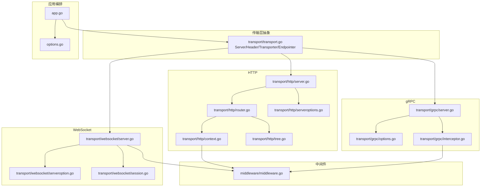
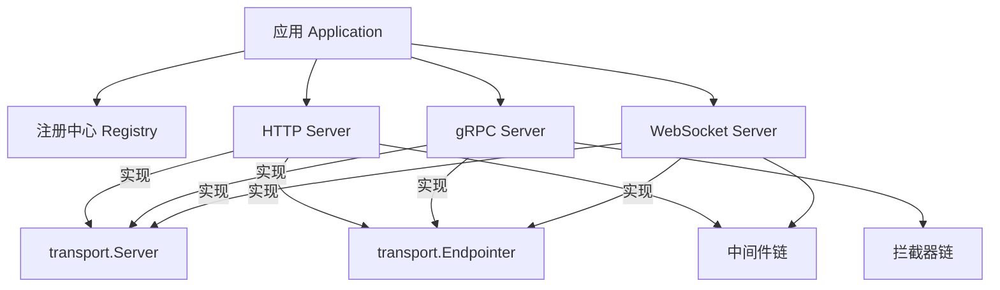
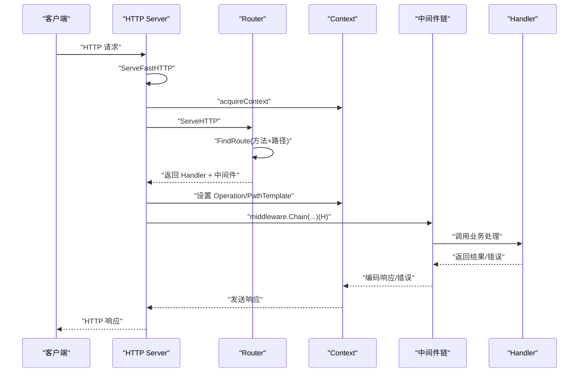
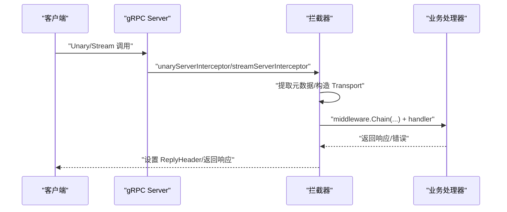
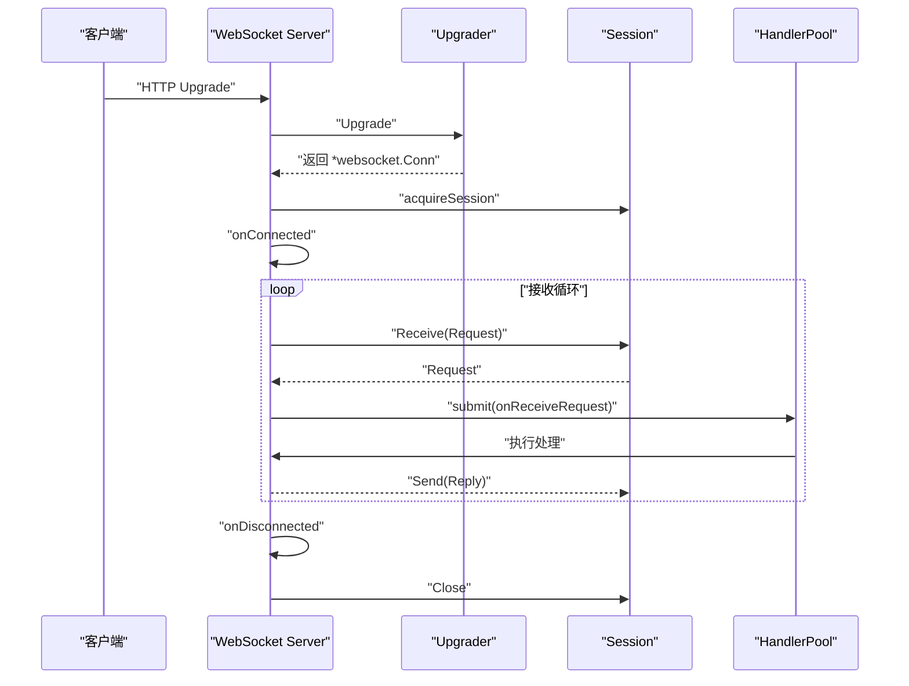
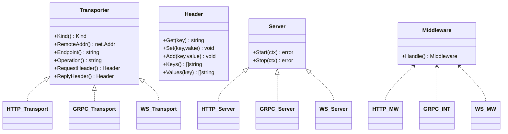
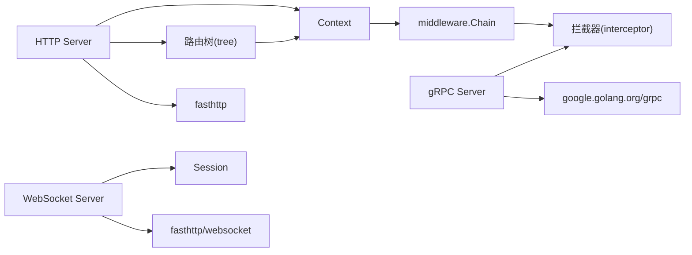

# 传输层架构

<cite>
**本文引用的文件**   
- [transport/transport.go](file://transport/transport.go)
- [transport/http/server.go](file://transport/http/server.go)
- [transport/http/context.go](file://transport/http/context.go)
- [transport/http/router.go](file://transport/http/router.go)
- [transport/http/serveroptions.go](file://transport/http/serveroptions.go)
- [transport/http/tree.go](file://transport/http/tree.go)
- [transport/grpc/server.go](file://transport/grpc/server.go)
- [transport/grpc/options.go](file://transport/grpc/options.go)
- [transport/grpc/interceptor.go](file://transport/grpc/interceptor.go)
- [transport/websocket/server.go](file://transport/websocket/server.go)
- [transport/websocket/serveroption.go](file://transport/websocket/serveroption.go)
- [transport/websocket/session.go](file://transport/websocket/session.go)
- [middleware/middleware.go](file://middleware/middleware.go)
- [app.go](file://app.go)
- [options.go](file://options.go)
</cite>

## 目录
1. [简介](#简介)
2. [项目结构](#项目结构)
3. [核心组件](#核心组件)
4. [架构总览](#架构总览)
5. [详细组件分析](#详细组件分析)
6. [依赖关系分析](#依赖关系分析)
7. [性能考量](#性能考量)
8. [故障排查指南](#故障排查指南)
9. [结论](#结论)
10. [附录：使用示例与集成方案](#附录使用示例与集成方案)

## 简介
本文件系统性梳理 Go Fox 的传输层架构，围绕统一的传输抽象、HTTP/ gRPC/ WebSocket 三类传输实现、中间件与拦截器机制、以及跨协议的传输上下文共享进行深入解析。目标是帮助读者从基础概念到高级用法，全面掌握该传输层的设计思想与工程实践。

## 项目结构
传输层位于 transport 目录下，按协议划分子包：
- transport/transport.go：定义通用接口与上下文工具（Server、Header、Transporter、Endpointer 等）
- transport/http：基于 fasthttp 的高性能 HTTP 实现，含路由树、上下文、静态资源、绑定解码等
- transport/grpc：基于 google.golang.org/grpc 的 gRPC 实现，含拦截器、健康检查、端点注册
- transport/websocket：基于 fasthttp/websocket 的 WebSocket 实现实时通信，含会话池、消息编解码、拦截器
- middleware：通用中间件链定义与组合
- app.go 与 options.go：应用生命周期与传输层服务编排入口

图表来源
- [transport/transport.go](file://transport/transport.go#L44-L86)
- [transport/http/server.go](file://transport/http/server.go#L53-L99)
- [transport/http/router.go](file://transport/http/router.go#L41-L77)
- [transport/http/context.go](file://transport/http/context.go#L59-L96)
- [transport/http/serveroptions.go](file://transport/http/serveroptions.go#L37-L60)
- [transport/http/tree.go](file://transport/http/tree.go#L33-L68)
- [transport/grpc/server.go](file://transport/grpc/server.go#L50-L80)
- [transport/grpc/options.go](file://transport/grpc/options.go#L42-L57)
- [transport/grpc/interceptor.go](file://transport/grpc/interceptor.go#L39-L77)
- [transport/websocket/server.go](file://transport/websocket/server.go#L56-L114)
- [transport/websocket/serveroption.go](file://transport/websocket/serveroption.go#L50-L72)
- [transport/websocket/session.go](file://transport/websocket/session.go#L55-L86)
- [middleware/middleware.go](file://middleware/middleware.go#L28-L66)
- [app.go](file://app.go#L52-L77)
- [options.go](file://options.go#L50-L71)

章节来源
- [transport/transport.go](file://transport/transport.go#L44-L125)
- [transport/http/server.go](file://transport/http/server.go#L53-L235)
- [transport/grpc/server.go](file://transport/grpc/server.go#L50-L175)
- [transport/websocket/server.go](file://transport/websocket/server.go#L56-L302)
- [middleware/middleware.go](file://middleware/middleware.go#L28-L66)
- [app.go](file://app.go#L52-L312)
- [options.go](file://options.go#L50-L208)

## 核心组件
- 传输抽象与上下文
  - Server：统一的 Start/Stop 生命周期接口
  - Transporter：跨协议的传输上下文载体，提供 Kind、RemoteAddr、Endpoint、Operation、RequestHeader、ReplyHeader 等
  - Header：统一的请求/响应头访问接口
  - Endpointer：暴露服务端监听地址的能力
  - 上下文工具：NewServerContext/FromServerContext、NewClientContext/FromClientContext、NewPeerClient/FromPeerContext
- 中间件与拦截器
  - middleware.Middleware 与 middleware.Chain 提供可组合的中间件链
  - HTTP 使用 matcher.Matcher 按路径模板或操作名选择中间件
  - gRPC 使用 grpc.UnaryServerInterceptor/StreamServerInterceptor 包装业务处理
  - WebSocket 支持连接/断开拦截器与授权回调
- 协议实现
  - HTTP：基于 fasthttp 的高性能服务，内置路由树、静态文件、绑定解码、错误编码
  - gRPC：基于 google.golang.org/grpc，支持 TLS、健康检查、拦截器链、端点注册
  - WebSocket：基于 fasthttp/websocket，支持会话池、消息编解码、连接生命周期管理

章节来源
- [transport/transport.go](file://transport/transport.go#L44-L125)
- [middleware/middleware.go](file://middleware/middleware.go#L28-L66)

## 架构总览
传输层通过统一抽象屏蔽底层差异，配合中间件/拦截器实现横切关注点（鉴权、限流、日志、监控）。应用层以 Application 聚合多个 transport.Server，统一启动/停止与注册。

图表来源
- [app.go](file://app.go#L184-L221)
- [transport/transport.go](file://transport/transport.go#L44-L86)
- [transport/http/server.go](file://transport/http/server.go#L44-L46)
- [transport/grpc/server.go](file://transport/grpc/server.go#L45-L48)
- [transport/websocket/server.go](file://transport/websocket/server.go#L49-L52)

## 详细组件分析

### HTTP 传输层
- 设计要点
  - 基于 fasthttp 的高性能 HTTP 服务器，支持并发、内存优化、请求体流式处理
  - 内置路由树（基于静态/参数/正则/通配符），支持方法匹配、参数提取、中间件挂载
  - 统一的 Context 封装，提供绑定解码、静态文件、Cookie、重定向、编码输出等能力
  - 错误处理：统一的错误编码器与 fasthttp 错误映射
- 关键流程
  - 请求进入：ServeFastHTTP -> acquireContext -> ServeHTTP -> 路由查找 -> 中间件链 -> Handler
  - 中间件选择：优先根据 Operation（路径模板）匹配，其次回退到 PathTemplate
  - 绑定与解码：支持路径参数、查询参数、表单、Body 的多源绑定
  - 静态文件：按需构建 fasthttp.FS 实例，支持缓存控制、压缩、字节范围等

图表来源
- [transport/http/server.go](file://transport/http/server.go#L101-L133)
- [transport/http/router.go](file://transport/http/router.go#L79-L128)
- [transport/http/context.go](file://transport/http/context.go#L118-L150)

章节来源
- [transport/http/server.go](file://transport/http/server.go#L53-L235)
- [transport/http/router.go](file://transport/http/router.go#L41-L477)
- [transport/http/context.go](file://transport/http/context.go#L59-L583)
- [transport/http/serveroptions.go](file://transport/http/serveroptions.go#L37-L231)
- [transport/http/tree.go](file://transport/http/tree.go#L33-L852)

### gRPC 传输层
- 设计要点
  - 基于 google.golang.org/grpc，支持 TLS、健康检查、拦截器链
  - 通过 unaryServerInterceptor/streamServerInterceptor 将传输上下文注入业务处理
  - 支持自定义拦截器与中间件选择（按 FullMethod）
- 关键流程
  - 拦截器：从 incoming metadata 提取请求头，构造 Transport，注入 ReplyHeader，合并 baseCtx 与超时
  - 流式包装：NewWrappedStream 将上下文透传给 ServerStream
  - 端点注册：实现 Endpointer，暴露服务监听地址

图表来源
- [transport/grpc/interceptor.go](file://transport/grpc/interceptor.go#L39-L119)
- [transport/grpc/server.go](file://transport/grpc/server.go#L138-L155)

章节来源
- [transport/grpc/server.go](file://transport/grpc/server.go#L50-L175)
- [transport/grpc/options.go](file://transport/grpc/options.go#L42-L343)
- [transport/grpc/interceptor.go](file://transport/grpc/interceptor.go#L39-L120)

### WebSocket 传输层
- 设计要点
  - 基于 fasthttp/websocket，支持升级、连接生命周期管理、消息编解码
  - 会话池与处理池：降低 goroutine 开销，提升吞吐
  - 连接拦截器/授权回调：onConnected/onDisconnected/authorization
  - 操作路由：HandlerMap 按 Operation 分发消息
- 关键流程
  - 升级：upgrade -> handlerConn
  - 会话：acquireSession -> onConnected -> receiveRequest -> onReceiveRequest -> handlerPool -> onReceiveRequest
  - 断开：onDisconnected -> session.Close

图表来源
- [transport/websocket/server.go](file://transport/websocket/server.go#L161-L282)
- [transport/websocket/session.go](file://transport/websocket/session.go#L67-L139)

章节来源
- [transport/websocket/server.go](file://transport/websocket/server.go#L56-L302)
- [transport/websocket/serveroption.go](file://transport/websocket/serveroption.go#L50-L193)
- [transport/websocket/session.go](file://transport/websocket/session.go#L55-L166)

### 传输上下文与中间件/拦截器
- 传输上下文
  - HTTP：在 ServeHTTP 中根据 PathTemplate 构造 Transport 并注入 ServerContext
  - gRPC：在拦截器中从 metadata 构造 Transport 并注入 ServerContext
  - WebSocket：在 onReceiveRequest 中构造 Transport 并注入 ServerContext
- 中间件/拦截器
  - HTTP：matcher.Matcher 按 Operation 或 PathTemplate 选择中间件，middleware.Chain 组合
  - gRPC：按 FullMethod 匹配中间件，chain 后包裹 handler
  - WebSocket：支持连接/断开拦截器与授权回调

图表来源
- [transport/transport.go](file://transport/transport.go#L44-L86)
- [transport/http/context.go](file://transport/http/context.go#L137-L150)
- [transport/grpc/interceptor.go](file://transport/grpc/interceptor.go#L68-L70)
- [transport/websocket/server.go](file://transport/websocket/server.go#L247-L282)

章节来源
- [transport/transport.go](file://transport/transport.go#L64-L125)
- [transport/http/context.go](file://transport/http/context.go#L137-L150)
- [transport/grpc/interceptor.go](file://transport/grpc/interceptor.go#L39-L119)
- [transport/websocket/server.go](file://transport/websocket/server.go#L247-L282)

## 依赖关系分析
- 组件耦合
  - HTTP 路由树与 Context 紧密耦合，Context 负责参数提取、中间件选择、编码输出
  - gRPC 拦截器与中间件强关联，通过 metadata 传递请求头，ReplyHeader 作为响应头返回
  - WebSocket 通过 Session 管理会话状态，HandlerMap 实现操作分发
- 外部依赖
  - HTTP 基于 fasthttp；gRPC 基于 google.golang.org/grpc；WebSocket 基于 fasthttp/websocket
  - 中间件链依赖 middleware.Chain；路由树依赖 internal/matcher

图表来源
- [transport/http/server.go](file://transport/http/server.go#L35-L42)
- [transport/grpc/server.go](file://transport/grpc/server.go#L35-L43)
- [transport/websocket/server.go](file://transport/websocket/server.go#L34-L47)
- [transport/http/context.go](file://transport/http/context.go#L48-L49)
- [transport/grpc/interceptor.go](file://transport/grpc/interceptor.go#L36-L37)

章节来源
- [transport/http/server.go](file://transport/http/server.go#L35-L42)
- [transport/grpc/server.go](file://transport/grpc/server.go#L35-L43)
- [transport/websocket/server.go](file://transport/websocket/server.go#L34-L47)

## 性能考量
- HTTP
  - 并发与内存：通过 Concurrency、ReduceMemoryUsage、ReadBufferSize/WriteBufferSize 控制
  - 请求体：StreamRequestBody 适合大体积上传；MaxRequestBodySize 限制防止内存膨胀
  - 路由匹配：静态/参数/正则/通配符混合树，建议合理规划路径避免过多通配符
- gRPC
  - TLS 与健康检查：启用 TLS 提升安全性；健康检查便于服务治理
  - 拦截器链：尽量精简，避免在热路径做昂贵操作
- WebSocket
  - 会话池与处理池：SessionPoolSize/HandlerPoolSize 控制并发与资源占用
  - 编解码：选择合适的 Codec（如 proto）减少序列化开销
  - 超时：Timeout 控制单次消息处理时长，防止阻塞

章节来源
- [transport/http/serveroptions.go](file://transport/http/serveroptions.go#L37-L231)
- [transport/grpc/options.go](file://transport/grpc/options.go#L42-L343)
- [transport/websocket/serveroption.go](file://transport/websocket/serveroption.go#L50-L193)

## 故障排查指南
- HTTP
  - 常见错误：请求头过大、请求超时、实体过大、方法不被允许；均映射为标准错误并交由错误编码器处理
  - 排查要点：检查 fastHTTPErrorHandler 映射逻辑、错误编码器是否正确返回状态码
- gRPC
  - 常见问题：TLS 证书加载失败、健康检查未启用导致探活异常
  - 排查要点：确认 TLS 配置、证书路径、拦截器链顺序
- WebSocket
  - 常见问题：升级失败、客户端主动关闭、消息编解码错误
  - 排查要点：检查 Upgrader 配置、授权回调、连接/断开拦截器、Codec 是否匹配

章节来源
- [transport/http/server.go](file://transport/http/server.go#L153-L174)
- [transport/grpc/server.go](file://transport/grpc/server.go#L157-L174)
- [transport/websocket/server.go](file://transport/websocket/server.go#L284-L301)

## 结论
Go Fox 的传输层以统一抽象为核心，结合高性能实现与灵活的中间件/拦截器机制，实现了 HTTP、gRPC、WebSocket 的一致体验。通过传输上下文在不同协议间共享状态，开发者可以专注于业务逻辑，同时获得良好的性能与可观测性。

## 附录：使用示例与集成方案
- 应用编排
  - 在 Application 中通过 Server(...) 选项注册多个 transport.Server，运行时统一启动与停止
  - 可选注册中心：通过 Registry 注册服务实例与端点
- HTTP
  - 新建 Server 并配置网络、监听、TLS、超时、中间件、编码器、解码器
  - 使用 Router 定义路由，支持静态文件、分组、挂载子路由
- gRPC
  - 新建 Server 并配置网络、监听、TLS、健康检查、拦截器、中间件
  - 通过 Use(selector, middleware...) 按服务/方法粒度挂载中间件
- WebSocket
  - 新建 Server 并配置网络、监听、TLS、编解码、授权回调、连接/断开拦截器
  - 通过 Handler(operator, handler) 注册操作处理器，按 Operation 分发消息

章节来源
- [app.go](file://app.go#L184-L221)
- [options.go](file://options.go#L188-L208)
- [transport/http/serveroptions.go](file://transport/http/serveroptions.go#L227-L231)
- [transport/grpc/options.go](file://transport/grpc/options.go#L96-L99)
- [transport/websocket/serveroption.go](file://transport/websocket/serveroption.go#L187-L193)