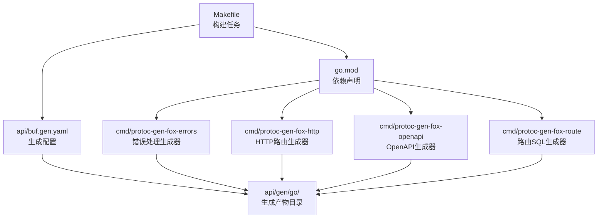
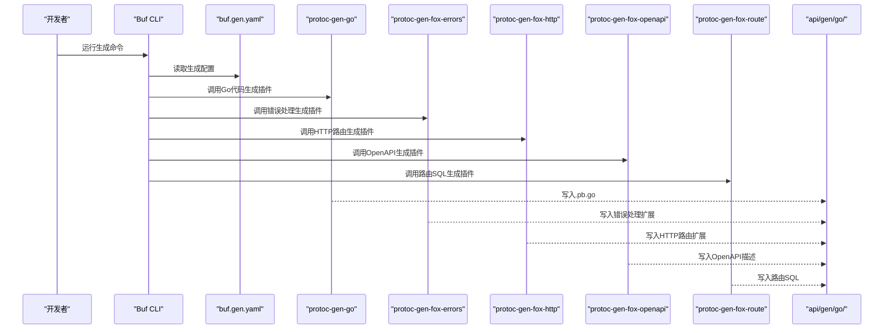
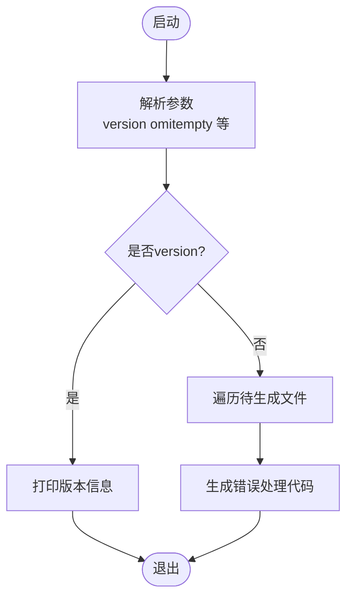
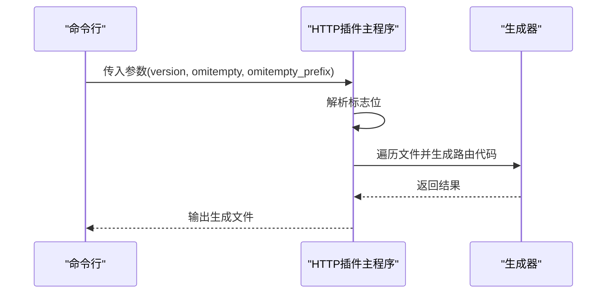
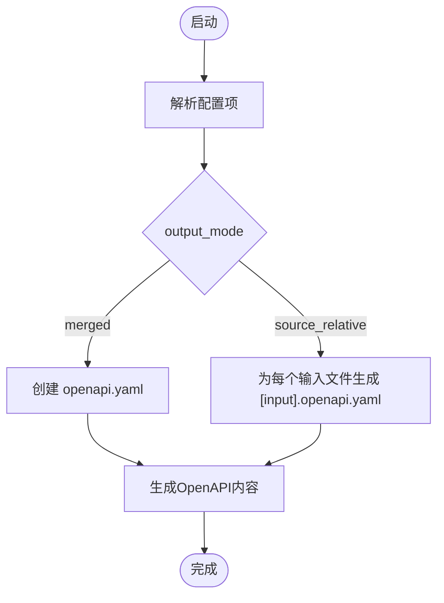
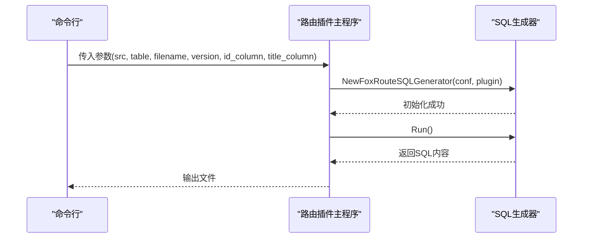
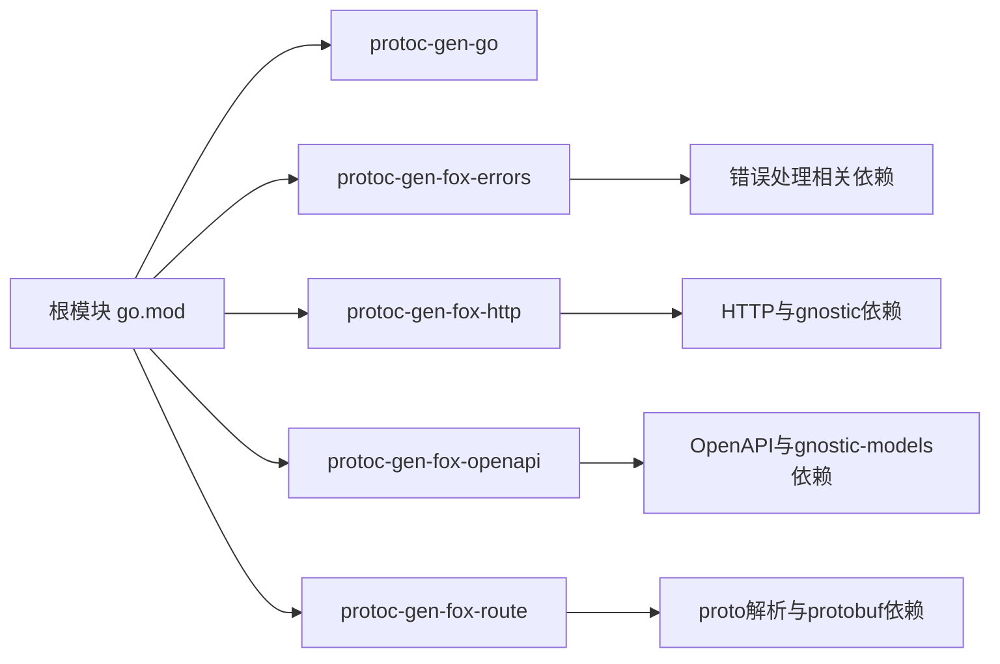

# Buf配置与使用

<cite>
**本文引用的文件**
- [api/buf.gen.yaml](file://api/buf.gen.yaml)
- [api/gen/go/file/file.go](file://api/gen/go/file/file.go)
- [api/gen/go/pagination/convert.go](file://api/gen/go/pagination/convert.go)
- [cmd/protoc-gen-fox-errors/main.go](file://cmd/protoc-gen-fox-errors/main.go)
- [cmd/protoc-gen-fox-http/main.go](file://cmd/protoc-gen-fox-http/main.go)
- [cmd/protoc-gen-fox-openapi/main.go](file://cmd/protoc-gen-fox-openapi/main.go)
- [cmd/protoc-gen-fox-route/main.go](file://cmd/protoc-gen-fox-route/main.go)
- [go.mod](file://go.mod)
- [Makefile](file://Makefile)
</cite>

## 目录
1. [简介](#简介)
2. [项目结构](#项目结构)
3. [核心组件](#核心组件)
4. [架构总览](#架构总览)
5. [详细组件分析](#详细组件分析)
6. [依赖关系分析](#依赖关系分析)
7. [性能考量](#性能考量)
8. [故障排查指南](#故障排查指南)
9. [结论](#结论)
10. [附录](#附录)

## 简介
本文件面向使用Buf进行Protocol Buffers代码生成的开发者，系统性讲解以下内容：
- buf.gen.yaml配置文件的结构与参数含义（版本、托管模式、插件列表、输出目录、选项）
- 生成代码在api/gen/go/目录下的组织方式与各子模块职责
- 如何扩展生成目标：Go代码、错误处理代码、HTTP路由代码、OpenAPI描述等
- 完整配置示例与在不同项目中的定制化思路
- Buf工具链安装与使用、与protoc的集成方案
- 生成代码的质量控制与版本管理策略

## 项目结构
本仓库采用“按功能域分层+生成产物隔离”的组织方式：
- 配置与生成：api/buf.gen.yaml定义生成规则；生成产物位于api/gen/go/
- 自定义protoc插件：cmd/protoc-gen-fox-* 提供错误处理、HTTP路由、OpenAPI等扩展生成能力
- 根级构建与依赖：go.mod统一管理依赖；Makefile提供常用构建任务（含旧版protoc命令示例）

**图表来源**
- [api/buf.gen.yaml](file://api/buf.gen.yaml#L1-L15)
- [cmd/protoc-gen-fox-errors/main.go](file://cmd/protoc-gen-fox-errors/main.go#L1-L57)
- [cmd/protoc-gen-fox-http/main.go](file://cmd/protoc-gen-fox-http/main.go#L1-L36)
- [cmd/protoc-gen-fox-openapi/main.go](file://cmd/protoc-gen-fox-openapi/main.go#L1-L70)
- [cmd/protoc-gen-fox-route/main.go](file://cmd/protoc-gen-fox-route/main.go#L1-L45)
- [go.mod](file://go.mod#L1-L39)
- [Makefile](file://Makefile#L1-L70)

**章节来源**
- [api/buf.gen.yaml](file://api/buf.gen.yaml#L1-L15)
- [go.mod](file://go.mod#L1-L39)
- [Makefile](file://Makefile#L1-L70)

## 核心组件
- 生成配置文件：api/buf.gen.yaml
  - 版本字段：用于声明生成器兼容性
  - 托管模式：启用受控模块清单，可选择性禁用特定模块
  - 插件列表：定义本地或远程插件、输出目录、插件选项
- 生成产物：api/gen/go/ 下按包名划分的子目录，包含.pb.go及配套业务扩展代码
- 自定义插件：错误处理、HTTP路由、OpenAPI、路由SQL等，均通过protoc-gen-*形式提供

**章节来源**
- [api/buf.gen.yaml](file://api/buf.gen.yaml#L1-L15)
- [api/gen/go/file/file.go](file://api/gen/go/file/file.go#L1-L30)
- [api/gen/go/pagination/convert.go](file://api/gen/go/pagination/convert.go#L1-L42)
- [cmd/protoc-gen-fox-errors/main.go](file://cmd/protoc-gen-fox-errors/main.go#L1-L57)
- [cmd/protoc-gen-fox-http/main.go](file://cmd/protoc-gen-fox-http/main.go#L1-L36)
- [cmd/protoc-gen-fox-openapi/main.go](file://cmd/protoc-gen-fox-openapi/main.go#L1-L70)
- [cmd/protoc-gen-fox-route/main.go](file://cmd/protoc-gen-fox-route/main.go#L1-L45)

## 架构总览
下图展示了从配置到生成产物的整体流程，以及自定义插件的参与方式。

**图表来源**
- [api/buf.gen.yaml](file://api/buf.gen.yaml#L1-L15)
- [cmd/protoc-gen-fox-errors/main.go](file://cmd/protoc-gen-fox-errors/main.go#L1-L57)
- [cmd/protoc-gen-fox-http/main.go](file://cmd/protoc-gen-fox-http/main.go#L1-L36)
- [cmd/protoc-gen-fox-openapi/main.go](file://cmd/protoc-gen-fox-openapi/main.go#L1-L70)
- [cmd/protoc-gen-fox-route/main.go](file://cmd/protoc-gen-fox-route/main.go#L1-L45)

## 详细组件分析

### 1) 生成配置文件：api/buf.gen.yaml
- 版本（version）：声明生成器版本，确保与Buf版本兼容
- 托管模式（managed）：启用后可对模块进行启用/禁用控制，避免引入不期望的依赖
- 插件（plugins）：
  - 本地插件：通过本地命令运行，如Go插件
  - 输出目录（out）：指定生成产物根目录
  - 插件选项（opt）：例如paths=source_relative，控制生成路径策略

建议实践：
- 将所有插件集中配置于plugins列表，明确输出目录与选项
- 在托管模式下，对第三方模块进行白/黑名单管理，减少意外依赖

**章节来源**
- [api/buf.gen.yaml](file://api/buf.gen.yaml#L1-L15)

### 2) 生成产物：api/gen/go/ 目录结构与职责
- file 子模块：提供文件操作辅助，如保存文件、自动补全扩展名、创建目录等
- pagination 子模块：提供分页请求与查询条件的转换逻辑，便于业务层复用
- 其他子模块：protocol、status、migrate 等，均为对应Proto消息的.pb.go与配套扩展

质量要点：
- 生成文件遵循source_relative策略，便于与源码同目录管理
- 扩展代码（如file.go、convert.go）与.pb.go并存，保持清晰边界

**章节来源**
- [api/gen/go/file/file.go](file://api/gen/go/file/file.go#L1-L30)
- [api/gen/go/pagination/convert.go](file://api/gen/go/pagination/convert.go#L1-L42)

### 3) 自定义插件：错误处理生成（protoc-gen-fox-errors）
- 功能：基于Proto文件生成错误处理相关的Go代码
- 启动流程：解析命令行参数，支持打印版本；遍历待生成文件，逐个生成
- 适配特性：声明支持proto3 optional特性

**图表来源**
- [cmd/protoc-gen-fox-errors/main.go](file://cmd/protoc-gen-fox-errors/main.go#L1-L57)

**章节来源**
- [cmd/protoc-gen-fox-errors/main.go](file://cmd/protoc-gen-fox-errors/main.go#L1-L57)

### 4) 自定义插件：HTTP路由生成（protoc-gen-fox-http）
- 功能：根据Proto注解生成HTTP路由相关代码
- 关键参数：omitempty、omitempty_prefix
- 启动流程：解析参数，支持打印版本；遍历文件生成路由代码

**图表来源**
- [cmd/protoc-gen-fox-http/main.go](file://cmd/protoc-gen-fox-http/main.go#L1-L36)

**章节来源**
- [cmd/protoc-gen-fox-http/main.go](file://cmd/protoc-gen-fox-http/main.go#L1-L36)

### 5) 自定义插件：OpenAPI生成（protoc-gen-fox-openapi）
- 功能：将Proto定义导出为OpenAPI v3 YAML
- 关键参数：version、title、description、naming、fq_schema_naming、enum_type、depth、default_response、output_mode
- 输出模式：支持合并输出或按源文件相对路径输出

**图表来源**
- [cmd/protoc-gen-fox-openapi/main.go](file://cmd/protoc-gen-fox-openapi/main.go#L1-L70)

**章节来源**
- [cmd/protoc-gen-fox-openapi/main.go](file://cmd/protoc-gen-fox-openapi/main.go#L1-L70)

### 6) 自定义插件：路由SQL生成（protoc-gen-fox-route）
- 功能：从Proto定义生成路由表SQL插入/更新脚本
- 关键参数：src、table、filename、version、id_column、title_column
- 启动流程：解析参数，初始化生成器，执行Run生成SQL

**图表来源**
- [cmd/protoc-gen-fox-route/main.go](file://cmd/protoc-gen-fox-route/main.go#L1-L45)

**章节来源**
- [cmd/protoc-gen-fox-route/main.go](file://cmd/protoc-gen-fox-route/main.go#L1-L45)

## 依赖关系分析
- 根模块依赖：统一声明Google Protobuf、gRPC及相关生态依赖
- 插件模块依赖：各自声明所需外部库（如gnostic、gnostic-models、genproto等）
- 构建与集成：Makefile提供旧版protoc示例命令，便于理解与迁移

**图表来源**
- [go.mod](file://go.mod#L1-L39)
- [cmd/protoc-gen-fox-errors/go.mod](file://cmd/protoc-gen-fox-errors/go.mod#L1-L24)
- [cmd/protoc-gen-fox-http/go.mod](file://cmd/protoc-gen-fox-http/go.mod#L1-L15)
- [cmd/protoc-gen-fox-openapi/go.mod](file://cmd/protoc-gen-fox-openapi/go.mod#L1-L14)
- [cmd/protoc-gen-fox-route/go.mod](file://cmd/protoc-gen-fox-route/go.mod#L1-L10)

**章节来源**
- [go.mod](file://go.mod#L1-L39)
- [Makefile](file://Makefile#L46-L51)

## 性能考量
- 插件并行化：多个protoc-gen-*插件可并行运行，缩短整体生成时间
- 输出目录规划：统一输出到api/gen/go/，配合source_relative策略，减少路径冲突与重复编译
- 依赖精简：仅引入必要插件与依赖，避免生成无关文件导致的I/O开销
- 缓存与增量：在CI中缓存生成中间产物，结合Git钩子实现增量生成

## 故障排查指南
- 插件未找到或版本不匹配
  - 检查插件是否已安装且在PATH中
  - 确认插件版本与Buf版本兼容
- 生成路径异常
  - 确认opt中包含paths=source_relative
  - 检查out目录权限与存在性
- OpenAPI输出不符合预期
  - 检查output_mode参数与naming策略
  - 确认枚举序列化类型与循环深度设置合理
- HTTP路由生成问题
  - 核对google.api注解是否规范
  - 检查omitempty与omitempty_prefix参数组合

**章节来源**
- [api/buf.gen.yaml](file://api/buf.gen.yaml#L1-L15)
- [cmd/protoc-gen-fox-openapi/main.go](file://cmd/protoc-gen-fox-openapi/main.go#L31-L70)
- [cmd/protoc-gen-fox-http/main.go](file://cmd/protoc-gen-fox-http/main.go#L11-L36)

## 结论
通过buf.gen.yaml集中管理生成规则，并结合自定义protoc-gen-*插件，可以高效地从Proto定义生成多形态产物（Go代码、错误处理、HTTP路由、OpenAPI、路由SQL）。建议在团队内统一配置与依赖版本，配合CI缓存与增量生成，持续提升开发效率与代码质量。

## 附录

### A. 安装与使用（Buf）
- 安装Buf：参考官方安装指南
- 基本命令：在项目根目录执行Buf生成命令，读取api/buf.gen.yaml
- 升级与兼容：升级Buf时检查version字段与插件版本

### B. 与protoc集成方案
- 旧版protoc命令示例可参考Makefile中的proto任务，便于理解生成流程与参数
- 建议逐步迁移到Buf，利用其托管模式与插件生态

**章节来源**
- [Makefile](file://Makefile#L46-L51)

### C. 配置示例与定制化思路
- Go代码生成：在plugins中添加本地Go插件，设置out与opt（如paths=source_relative）
- 错误处理代码：添加protoc-gen-fox-errors插件，按需调整参数
- HTTP路由代码：添加protoc-gen-fox-http插件，配置omitempty与omitempty_prefix
- OpenAPI描述：添加protoc-gen-fox-openapi插件，选择merged或source_relative输出模式
- 路由SQL：添加protoc-gen-fox-route插件，配置table、filename、列名等

**章节来源**
- [api/buf.gen.yaml](file://api/buf.gen.yaml#L1-L15)
- [cmd/protoc-gen-fox-errors/main.go](file://cmd/protoc-gen-fox-errors/main.go#L1-L57)
- [cmd/protoc-gen-fox-http/main.go](file://cmd/protoc-gen-fox-http/main.go#L1-L36)
- [cmd/protoc-gen-fox-openapi/main.go](file://cmd/protoc-gen-fox-openapi/main.go#L1-L70)
- [cmd/protoc-gen-fox-route/main.go](file://cmd/protoc-gen-fox-route/main.go#L1-L45)

### D. 生成代码的质量控制与版本管理
- 质量控制：在CI中加入格式化、静态检查与单元测试
- 版本管理：通过Git标签与提交信息控制版本号，Makefile提供版本注入示例
- 依赖治理：统一在go.mod中管理，定期tidy与更新

**章节来源**
- [go.mod](file://go.mod#L1-L39)
- [Makefile](file://Makefile#L1-L70)