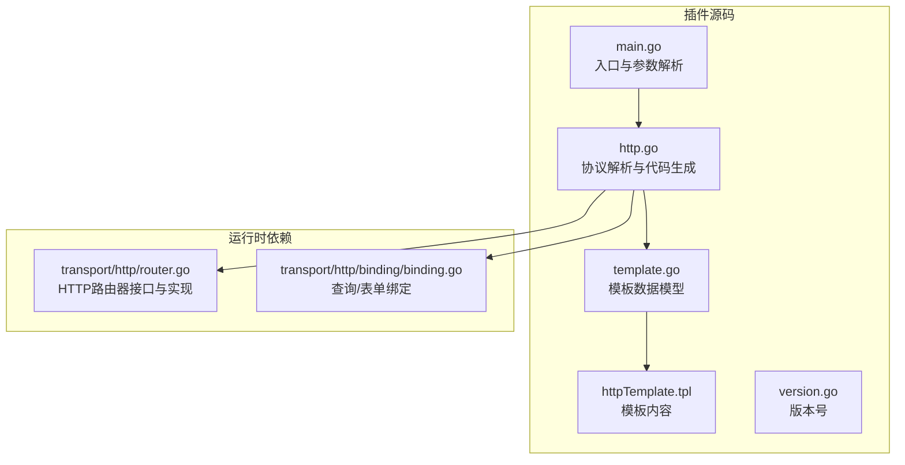
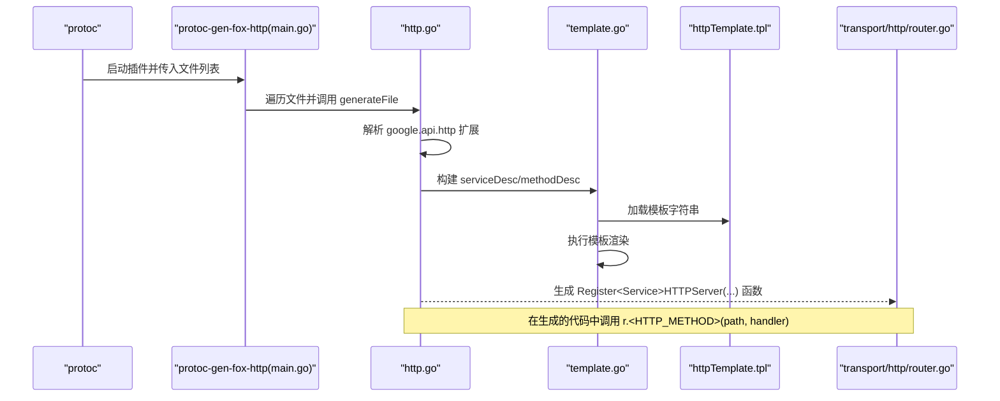
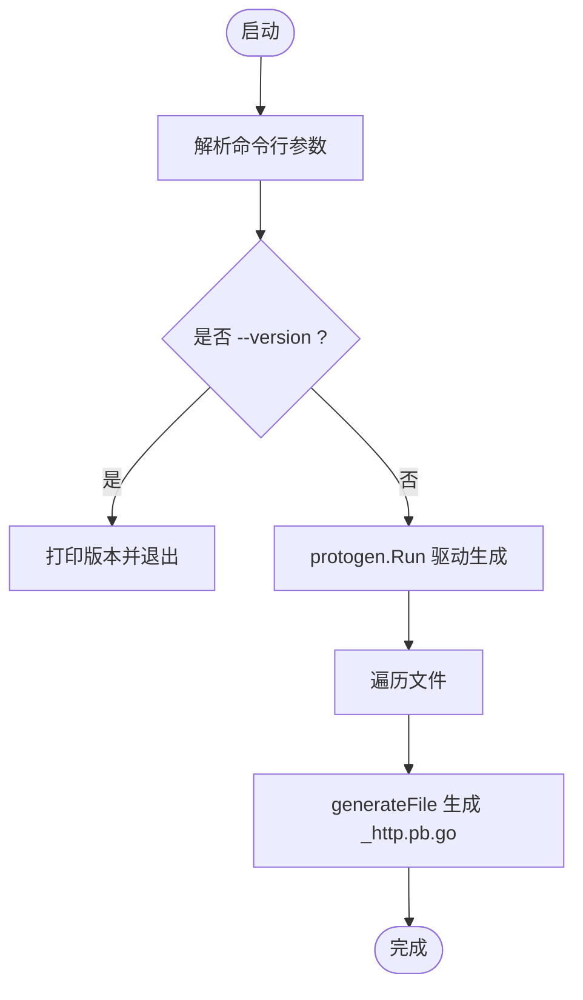
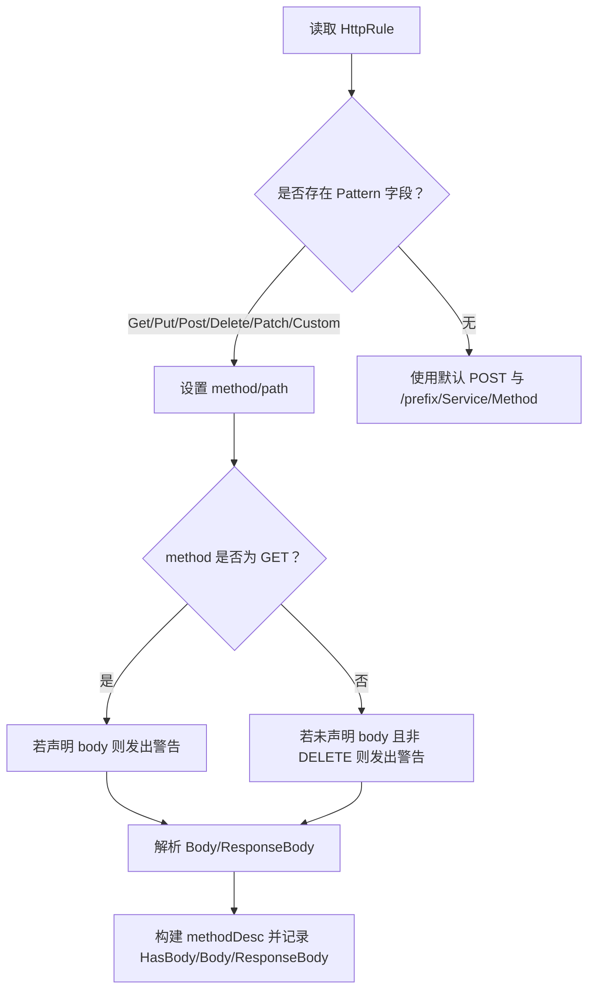
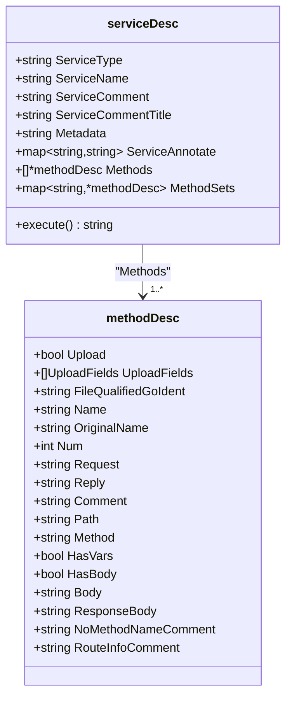
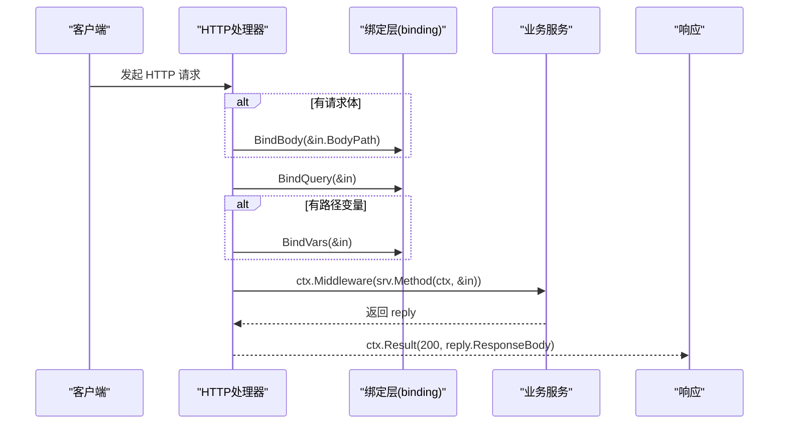
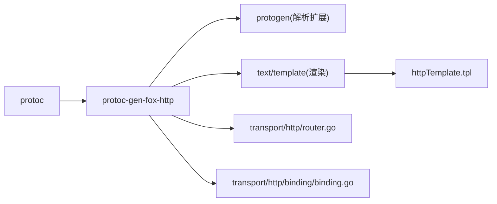

# HTTP路由插件 (protoc-gen-fox-http)

<cite>
**本文引用的文件**
- [main.go](file://cmd/protoc-gen-fox-http/main.go)
- [http.go](file://cmd/protoc-gen-fox-http/http.go)
- [template.go](file://cmd/protoc-gen-fox-http/template.go)
- [httpTemplate.tpl](file://cmd/protoc-gen-fox-http/httpTemplate.tpl)
- [version.go](file://cmd/protoc-gen-fox-http/version.go)
- [http_test.go](file://cmd/protoc-gen-fox-http/http_test.go)
- [router.go](file://transport/http/router.go)
- [binding.go](file://transport/http/binding/binding.go)
</cite>

## 目录
1. [简介](#简介)
2. [项目结构](#项目结构)
3. [核心组件](#核心组件)
4. [架构总览](#架构总览)
5. [详细组件分析](#详细组件分析)
6. [依赖关系分析](#依赖关系分析)
7. [性能考量](#性能考量)
8. [故障排查指南](#故障排查指南)
9. [结论](#结论)
10. [附录：使用示例与最佳实践](#附录使用示例与最佳实践)

## 简介
本文件系统性阐述 protoc-gen-fox-http 插件的工作原理与使用方法，重点覆盖以下方面：
- 如何将 Protocol Buffers 中的 RPC 方法自动转换为 HTTP 路由处理函数
- HTTP 方法映射规则（GET、POST、PUT、DELETE、PATCH、自定义）
- URL 路径生成策略与路径变量校验
- 查询参数与请求体的绑定与处理
- httpTemplate.tpl 模板的设计与执行流程
- RESTful 规范支持（资源命名、状态码、错误响应）
- 完整使用示例与最佳实践（路由中间件、参数校验、响应格式化）

## 项目结构
protoc-gen-fox-http 是一个基于 protoc 的插件，负责读取编译器提供的 .proto 文件元数据，解析 google.api.http 扩展，并通过模板生成 HTTP 路由注册与处理器代码。

**图表来源**
- [main.go](file://cmd/protoc-gen-fox-http/main.go#L17-L35)
- [http.go](file://cmd/protoc-gen-fox-http/http.go#L31-L51)
- [template.go](file://cmd/protoc-gen-fox-http/template.go#L10-L11)
- [router.go](file://transport/http/router.go#L42-L63)
- [binding.go](file://transport/http/binding/binding.go#L35-L49)

**章节来源**
- [main.go](file://cmd/protoc-gen-fox-http/main.go#L1-L36)
- [http.go](file://cmd/protoc-gen-fox-http/http.go#L31-L51)
- [template.go](file://cmd/protoc-gen-fox-http/template.go#L10-L11)
- [router.go](file://transport/http/router.go#L42-L63)
- [binding.go](file://transport/http/binding/binding.go#L35-L49)

## 核心组件
- 插件入口与参数解析：解析命令行参数（版本、omitempty、omitempty_prefix），驱动 protogen 运行。
- 协议解析与生成：遍历文件与服务，提取 google.api.http 扩展，构建 serviceDesc/methodDesc，生成路由注册与处理器。
- 模板引擎：加载 httpTemplate.tpl，将 serviceDesc 渲染为 Go 代码。
- 运行时绑定：利用 transport/http/binding 提供的 BindQuery/BindForm 将请求参数绑定到消息对象；利用 transport/http/router 提供的 Router 接口进行路由注册。

**章节来源**
- [main.go](file://cmd/protoc-gen-fox-http/main.go#L11-L22)
- [http.go](file://cmd/protoc-gen-fox-http/http.go#L96-L106)
- [template.go](file://cmd/protoc-gen-fox-http/template.go#L55-L69)
- [router.go](file://transport/http/router.go#L42-L63)
- [binding.go](file://transport/http/binding/binding.go#L35-L49)

## 架构总览
下图展示了从 .proto 到生成的 HTTP 路由代码的整体流程。

**图表来源**
- [main.go](file://cmd/protoc-gen-fox-http/main.go#L23-L34)
- [http.go](file://cmd/protoc-gen-fox-http/http.go#L96-L106)
- [template.go](file://cmd/protoc-gen-fox-http/template.go#L55-L69)
- [httpTemplate.tpl](file://cmd/protoc-gen-fox-http/httpTemplate.tpl#L19-L24)
- [router.go](file://transport/http/router.go#L288-L333)

## 详细组件分析

### 组件一：插件入口与控制流
- 参数解析：支持 -version、-omitempty、-omitempty_prefix。
- 插件主循环：遍历所有待生成文件，若文件包含服务且满足条件则生成对应 _http.pb.go。
- 版本输出：打印当前插件版本。

**图表来源**
- [main.go](file://cmd/protoc-gen-fox-http/main.go#L17-L35)

**章节来源**
- [main.go](file://cmd/protoc-gen-fox-http/main.go#L11-L22)
- [main.go](file://cmd/protoc-gen-fox-http/main.go#L23-L34)

### 组件二：HTTP 方法映射与路径生成
- HTTP 方法映射：根据 google.api.http 的 Get/Put/Post/Delete/Patch/Custom 字段映射到标准 HTTP 方法；未显式指定时默认 POST。
- 路径生成：优先使用规则中的 path；若为空则按 omitemptyPrefix/serviceFullName/methodName 生成。
- 路径变量解析：支持 {message.field} 与 {message.field=正则} 两种形式；对路径末尾斜杠给出警告；对路径中的 map/list 字段给出警告。
- 请求体与响应体：Body/ResponseBody 支持 "*" 表示全部字段；其他情况将字段路径转为驼峰风格用于代码生成。

**图表来源**
- [http.go](file://cmd/protoc-gen-fox-http/http.go#L127-L189)
- [http.go](file://cmd/protoc-gen-fox-http/http.go#L270-L286)

**章节来源**
- [http.go](file://cmd/protoc-gen-fox-http/http.go#L127-L189)
- [http.go](file://cmd/protoc-gen-fox-http/http.go#L270-L286)

### 组件三：模板设计与路由注册
- 模板数据模型：serviceDesc 包含服务类型、名称、注释、元数据、方法集合等；methodDesc 描述每个方法的路径、HTTP 方法、是否带体、body/respBody 路径片段等。
- 路由注册：Register<Service>HTTPServer 在模板中生成，内部通过 r.<Method>(path, handler) 注册。
- 处理器函数：每个方法生成一个 _<Service>_<Method><Num>_HTTP_Handler，内部完成参数绑定、中间件链路、调用服务接口、返回结果。
- 客户端：生成 HTTP 客户端接口与实现，使用 binding.EncodeURL 与 http.Client.Invoke 发起请求。

**图表来源**
- [template.go](file://cmd/protoc-gen-fox-http/template.go#L13-L53)

**章节来源**
- [template.go](file://cmd/protoc-gen-fox-http/template.go#L13-L53)
- [httpTemplate.tpl](file://cmd/protoc-gen-fox-http/httpTemplate.tpl#L19-L24)
- [httpTemplate.tpl](file://cmd/protoc-gen-fox-http/httpTemplate.tpl#L26-L113)
- [httpTemplate.tpl](file://cmd/protoc-gen-fox-http/httpTemplate.tpl#L115-L146)

### 组件四：处理器函数的封装与中间件集成
- 参数绑定顺序：先 BindBody（仅在有请求体时），再 BindQuery（查询参数），最后 BindVars（路径变量）。
- 中间件链：通过 ctx.Middleware 包裹业务调用，便于统一鉴权、日志、限流等横切能力。
- 响应返回：统一使用 ctx.Result(200, reply[.ResponseBody]) 返回。
- 上传场景：当存在 binary 格式的文件字段时，走 multipart/form-data 分支，手动读取文件头并填充结构体。

**图表来源**
- [httpTemplate.tpl](file://cmd/protoc-gen-fox-http/httpTemplate.tpl#L83-L111)
- [binding.go](file://transport/http/binding/binding.go#L35-L49)

**章节来源**
- [httpTemplate.tpl](file://cmd/protoc-gen-fox-http/httpTemplate.tpl#L83-L111)
- [binding.go](file://transport/http/binding/binding.go#L35-L49)

### 组件五：RESTful 规范与错误处理
- 资源命名：路径通常采用 /{serviceFullName}/{method} 的形式；可通过 http.rule 自定义路径。
- 状态码：生成代码统一返回 200；具体业务状态建议在业务层通过响应体或上下文传递。
- 错误响应：运行时错误由 transport/http/router 的 ServeHTTP 与错误处理器统一捕获并返回相应状态码与错误信息。

**章节来源**
- [http.go](file://cmd/protoc-gen-fox-http/http.go#L164-L172)
- [router.go](file://transport/http/router.go#L95-L127)
- [router.go](file://transport/http/router.go#L153-L174)

## 依赖关系分析
- 插件依赖 protogen 读取 .proto 元数据与扩展。
- 生成代码依赖 transport/http/router 的 Router 接口与 transport/http/binding 的绑定工具。
- 模板通过 go:embed 内嵌 httpTemplate.tpl，运行时动态渲染。

**图表来源**
- [main.go](file://cmd/protoc-gen-fox-http/main.go#L3-L8)
- [http.go](file://cmd/protoc-gen-fox-http/http.go#L12-L16)
- [template.go](file://cmd/protoc-gen-fox-http/template.go#L10-L11)
- [router.go](file://transport/http/router.go#L42-L63)
- [binding.go](file://transport/http/binding/binding.go#L25-L33)

**章节来源**
- [main.go](file://cmd/protoc-gen-fox-http/main.go#L3-L8)
- [http.go](file://cmd/protoc-gen-fox-http/http.go#L12-L16)
- [template.go](file://cmd/protoc-gen-fox-http/template.go#L10-L11)
- [router.go](file://transport/http/router.go#L42-L63)
- [binding.go](file://transport/http/binding/binding.go#L25-L33)

## 性能考量
- 路由匹配：基于树形结构的快速查找，支持分组与中间件链，开销主要取决于中间件数量与路径复杂度。
- 参数绑定：查询/表单绑定使用统一编解码器，避免重复解析；路径变量绑定在处理器内按需执行。
- 生成代码：模板一次性渲染，生成的处理器函数直接调用绑定与服务接口，避免反射开销。

[本节为通用指导，无需特定文件分析]

## 故障排查指南
- 路径末尾斜杠：路径以 "/" 结尾会触发警告，请移除末尾斜杠。
- 路径变量类型：路径中出现 map 或 list 字段会触发警告，请改用标量字段或调整设计。
- GET 请求体：GET 不应声明 body，若声明会触发警告。
- 非 GET 缺少 body：除 DELETE 外，其他方法未声明 body 会触发警告。
- 字段不存在：路径中引用的字段在消息中不存在时会报错并退出。
- 测试用例参考：提供了路径变量解析与替换的单元测试，可对照验证行为。

**章节来源**
- [http.go](file://cmd/protoc-gen-fox-http/http.go#L270-L286)
- [http.go](file://cmd/protoc-gen-fox-http/http.go#L237-L249)
- [http.go](file://cmd/protoc-gen-fox-http/http.go#L164-L172)
- [http_test.go](file://cmd/protoc-gen-fox-http/http_test.go#L8-L100)

## 结论
protoc-gen-fox-http 将 Protocol Buffers 的 RPC 定义与 HTTP 路由生成紧密耦合，通过解析 google.api.http 扩展与模板渲染，实现了从 .proto 到可运行 HTTP 服务的自动化。其设计兼顾了 RESTful 规范与易用性，配合运行时的绑定与中间件机制，能够快速构建一致性的 HTTP API。

[本节为总结性内容，无需特定文件分析]

## 附录：使用示例与最佳实践

### 使用步骤
- 在 .proto 中为方法添加 google.api.http 扩展，定义 HTTP 方法与路径。
- 安装并运行 protoc-gen-fox-http，生成 _http.pb.go。
- 在业务代码中实现生成的 HTTPServer 接口，并调用 Register<Service>HTTPServer 完成路由注册。
- 可选：通过 ctx.Middleware 注入全局中间件，实现统一鉴权、日志、限流等。

### 最佳实践
- 路由中间件集成：在处理器外层通过 ctx.Middleware 包裹业务调用，保证横切关注点的一致性。
- 参数验证：在服务方法内部对输入参数进行校验，必要时结合 binding 工具进行二次校验。
- 响应格式化：统一在服务层构造响应体，模板层仅负责返回 200 与序列化。
- 错误处理：利用运行时错误处理器统一捕获异常，返回标准化错误响应。

**章节来源**
- [httpTemplate.tpl](file://cmd/protoc-gen-fox-http/httpTemplate.tpl#L66-L70)
- [httpTemplate.tpl](file://cmd/protoc-gen-fox-http/httpTemplate.tpl#L100-L103)
- [router.go](file://transport/http/router.go#L153-L174)