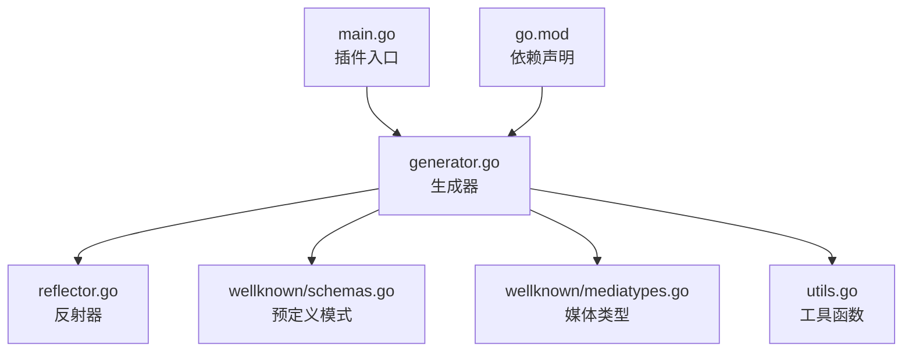
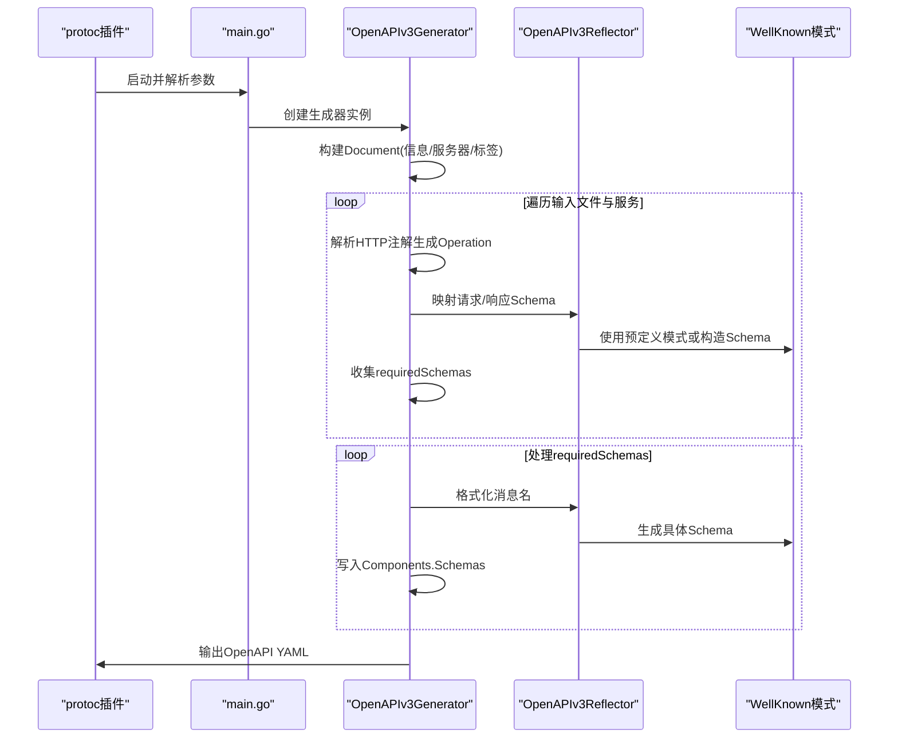
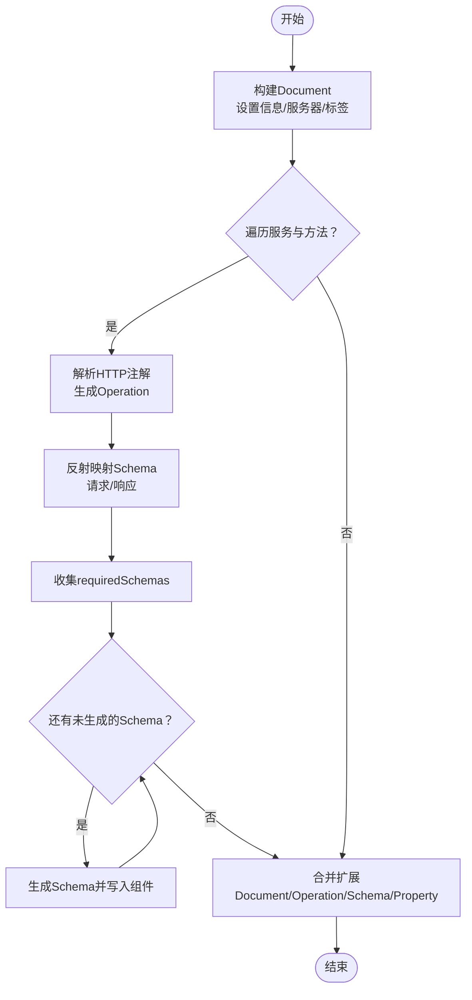
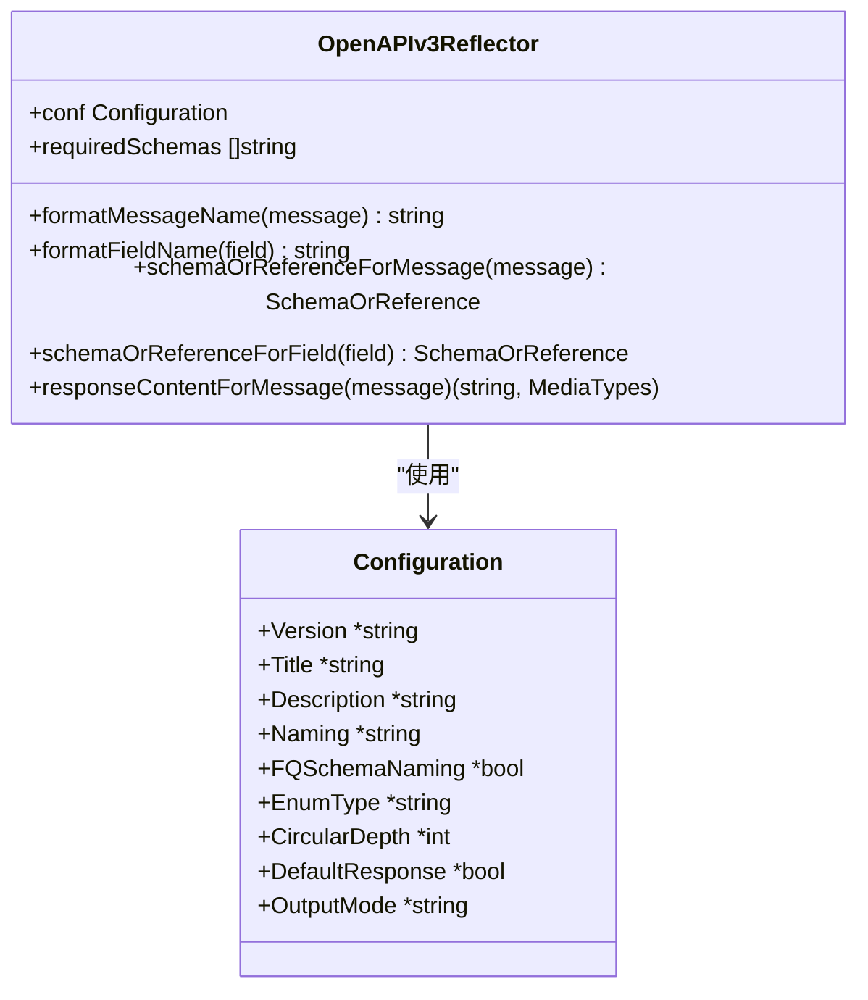
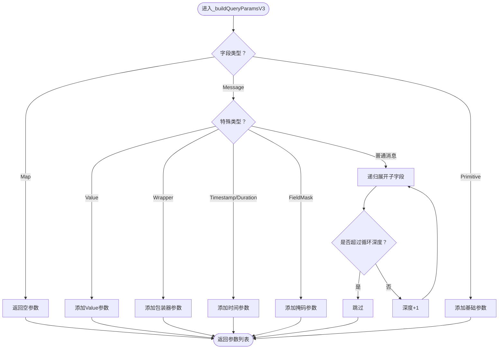
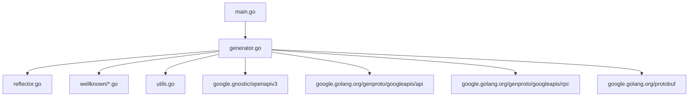

# OpenAPI文档插件 (protoc-gen-fox-openapi)

<cite>
**本文引用的文件**
- [main.go](file://cmd/protoc-gen-fox-openapi/main.go)
- [generator.go](file://cmd/protoc-gen-fox-openapi/generator/generator.go)
- [reflector.go](file://cmd/protoc-gen-fox-openapi/generator/reflector.go)
- [utils.go](file://cmd/protoc-gen-fox-openapi/generator/utils.go)
- [schemas.go](file://cmd/protoc-gen-fox-openapi/generator/wellknown/schemas.go)
- [mediatypes.go](file://cmd/protoc-gen-fox-openapi/generator/wellknown/mediatypes.go)
- [go.mod](file://cmd/protoc-gen-fox-openapi/go.mod)
- [README.md](file://cmd/protoc-gen-fox-openapi/README.md)
- [test.proto](file://internal/testdata/binding/test.proto)
- [buf.gen.yaml](file://api/buf.gen.yaml)
</cite>

## 目录
1. [简介](#简介)
2. [项目结构](#项目结构)
3. [核心组件](#核心组件)
4. [架构总览](#架构总览)
5. [组件详解](#组件详解)
6. [依赖关系分析](#依赖关系分析)
7. [性能与复杂度](#性能与复杂度)
8. [故障排查指南](#故障排查指南)
9. [结论](#结论)
10. [附录：使用示例与最佳实践](#附录使用示例与最佳实践)

## 简介
本插件用于从Protocol Buffers定义自动生成符合OpenAPI 3.0规范的YAML文档。它通过解析服务方法上的HTTP注解（google.api.http）自动发现API端点，结合消息类型推导请求/响应模式，并对Well-Known类型进行特殊映射，最终输出可直接用于Swagger UI等工具的OpenAPI文档。

## 项目结构
- 插件入口位于cmd/protoc-gen-fox-openapi/main.go，负责解析命令行参数并驱动生成流程。
- 核心生成逻辑在generator/generator.go中，包含文档构建、路径与操作生成、模式收集与排序等。
- 反射与模式生成策略在generator/reflector.go中，负责将proto类型映射到OpenAPI Schema或引用。
- Well-Known类型与媒体类型的预定义模式在generator/wellknown目录下。
- 工具函数在generator/utils.go中，提供通用辅助能力。
- 依赖声明在go.mod中，使用gnostic与google.golang.org/protobuf等库。

图表来源
- [main.go](file://cmd/protoc-gen-fox-openapi/main.go#L31-L69)
- [generator.go](file://cmd/protoc-gen-fox-openapi/generator/generator.go#L93-L103)
- [reflector.go](file://cmd/protoc-gen-fox-openapi/generator/reflector.go#L34-L47)
- [schemas.go](file://cmd/protoc-gen-fox-openapi/generator/wellknown/schemas.go#L23-L80)
- [mediatypes.go](file://cmd/protoc-gen-fox-openapi/generator/wellknown/mediatypes.go#L22-L44)
- [utils.go](file://cmd/protoc-gen-fox-openapi/generator/utils.go#L24-L65)
- [go.mod](file://cmd/protoc-gen-fox-openapi/go.mod#L5-L11)

章节来源
- [main.go](file://cmd/protoc-gen-fox-openapi/main.go#L31-L69)
- [generator.go](file://cmd/protoc-gen-fox-openapi/generator/generator.go#L93-L103)
- [go.mod](file://cmd/protoc-gen-fox-openapi/go.mod#L5-L11)

## 核心组件
- 配置对象Configuration：承载版本、标题、描述、命名约定、枚举序列化方式、循环深度、默认响应开关、输出模式等。
- OpenAPIv3Generator：主生成器，负责构建Document、遍历服务与方法、解析HTTP注解、生成Operation与路径、收集所需Schema并写入组件。
- OpenAPIv3Reflector：反射器，负责将proto类型映射为OpenAPI Schema或引用，处理Well-Known类型、字段行为、列表包装等。
- WellKnown模式与媒体类型：提供字符串、布尔、数值、枚举、数组、时间戳、持续时间、日期时间、字段掩码、结构体、任意类型、状态等预定义Schema及application/json与HttpBody媒体类型。
- 工具函数：包含去重、单数化、包含判断、获取wrapper值字段等。

章节来源
- [generator.go](file://cmd/protoc-gen-fox-openapi/generator/generator.go#L39-L50)
- [generator.go](file://cmd/protoc-gen-fox-openapi/generator/generator.go#L62-L90)
- [reflector.go](file://cmd/protoc-gen-fox-openapi/generator/reflector.go#L34-L47)
- [schemas.go](file://cmd/protoc-gen-fox-openapi/generator/wellknown/schemas.go#L23-L80)
- [utils.go](file://cmd/protoc-gen-fox-openapi/generator/utils.go#L24-L65)

## 架构总览
插件运行时序如下：

图表来源
- [main.go](file://cmd/protoc-gen-fox-openapi/main.go#L48-L68)
- [generator.go](file://cmd/protoc-gen-fox-openapi/generator/generator.go#L135-L279)
- [generator.go](file://cmd/protoc-gen-fox-openapi/generator/generator.go#L751-L829)
- [generator.go](file://cmd/protoc-gen-fox-openapi/generator/generator.go#L856-L981)
- [reflector.go](file://cmd/protoc-gen-fox-openapi/generator/reflector.go#L104-L179)
- [schemas.go](file://cmd/protoc-gen-fox-openapi/generator/wellknown/schemas.go#L82-L167)

## 组件详解

### 生成器核心流程（generator.go）
- 文档构建：设置OpenAPI版本、信息、空路径与组件容器；合并文件级Document扩展；遍历服务与方法，解析HTTP注解生成Operation并挂载到路径项。
- 路径与参数：支持简单路径参数与命名路径参数（如{name=...}），自动单数化命名并生成对应参数Schema；查询参数递归展开（受循环深度限制）。
- 请求体与媒体类型：根据body字段选择整包或子字段作为请求体；检测二进制属性以决定multipart/form-data；默认application/json。
- 响应：默认200响应，针对google.api.HttpBody返回通配媒体类型；针对google.protobuf.Empty返回空内容；默认application/json。
- 默认错误响应：当开启默认响应时，注入google.rpc.Status与google.protobuf.Any的Schema，并在默认响应中引用。
- 服务器与标签：自动提升同构服务器至API级；按字母序排序标签、路径与Schema。

图表来源
- [generator.go](file://cmd/protoc-gen-fox-openapi/generator/generator.go#L135-L279)
- [generator.go](file://cmd/protoc-gen-fox-openapi/generator/generator.go#L751-L829)
- [generator.go](file://cmd/protoc-gen-fox-openapi/generator/generator.go#L856-L981)

章节来源
- [generator.go](file://cmd/protoc-gen-fox-openapi/generator/generator.go#L135-L279)
- [generator.go](file://cmd/protoc-gen-fox-openapi/generator/generator.go#L751-L829)
- [generator.go](file://cmd/protoc-gen-fox-openapi/generator/generator.go#L856-L981)

### 反射器与Schema生成策略（reflector.go）
- 消息与字段命名：支持“json”和“proto”两种命名约定；可启用完全限定Schema命名（含包名前缀）。
- Well-Known类型映射：对Timestamp、Duration、Date、DateTime、FieldMask、Struct、Value、Any、Empty等进行精确Schema映射。
- 字段类型映射：字符串、整型、浮点、布尔、字节、枚举、消息、列表等；列表外层包裹数组Schema。
- 引用策略：复杂类型返回#/components/schemas下的引用，简单类型直接内联Schema；记录requiredSchemas以便后续生成。

图表来源
- [reflector.go](file://cmd/protoc-gen-fox-openapi/generator/reflector.go#L34-L88)
- [generator.go](file://cmd/protoc-gen-fox-openapi/generator/generator.go#L39-L50)

章节来源
- [reflector.go](file://cmd/protoc-gen-fox-openapi/generator/reflector.go#L60-L179)

### Well-Known模式与媒体类型（wellknown）
- 基础类型：字符串、布尔、字节数组、整数、数值、枚举、数组等。
- 时间与格式：Timestamp/Duration/Date/DateTime/FieldMask采用字符串格式；Duration带有正则约束。
- 结构与动态：Struct为对象；Value描述动态类型；Any包含@type与额外属性。
- 错误模型：Status包含code/message/details（details为Any数组）。
- 媒体类型：application/json与google.api.HttpBody的通配媒体类型。

章节来源
- [schemas.go](file://cmd/protoc-gen-fox-openapi/generator/wellknown/schemas.go#L23-L305)
- [mediatypes.go](file://cmd/protoc-gen-fox-openapi/generator/wellknown/mediatypes.go#L22-L44)

### 查询参数递归展开算法（generator.go）
- 对消息字段递归展开，支持wrapper类型与特定Well-Known类型；禁止map类型出现在查询参数中；对FieldMask直接作为字符串参数。
- 通过深度控制避免无限递归，支持命名路径参数转换为多段路径参数。

图表来源
- [generator.go](file://cmd/protoc-gen-fox-openapi/generator/generator.go#L318-L469)
- [utils.go](file://cmd/protoc-gen-fox-openapi/generator/utils.go#L42-L54)

章节来源
- [generator.go](file://cmd/protoc-gen-fox-openapi/generator/generator.go#L318-L469)
- [utils.go](file://cmd/protoc-gen-fox-openapi/generator/utils.go#L42-L54)

### 关键实现片段路径
- 插件入口与参数解析：[main.go](file://cmd/protoc-gen-fox-openapi/main.go#L31-L69)
- 文档构建与路径/操作生成：[generator.go](file://cmd/protoc-gen-fox-openapi/generator/generator.go#L135-L279), [generator.go](file://cmd/protoc-gen-fox-openapi/generator/generator.go#L751-L829)
- Schema收集与写入：[generator.go](file://cmd/protoc-gen-fox-openapi/generator/generator.go#L856-L981)
- 反射映射策略：[reflector.go](file://cmd/protoc-gen-fox-openapi/generator/reflector.go#L104-L179)
- Well-Known模式与媒体类型：[schemas.go](file://cmd/protoc-gen-fox-openapi/generator/wellknown/schemas.go#L82-L167), [mediatypes.go](file://cmd/protoc-gen-fox-openapi/generator/wellknown/mediatypes.go#L22-L44)
- 工具函数：[utils.go](file://cmd/protoc-gen-fox-openapi/generator/utils.go#L24-L65)

## 依赖关系分析
- 依赖gnostic与gnostic-models生成OpenAPI 3.0文档对象。
- 依赖google.golang.org/genproto/googleapis/api与rpc提供HTTP注解与状态模型。
- 依赖google.golang.org/protobuf进行proto反射与注解解析。

图表来源
- [go.mod](file://cmd/protoc-gen-fox-openapi/go.mod#L5-L11)
- [generator.go](file://cmd/protoc-gen-fox-openapi/generator/generator.go#L18-L37)

章节来源
- [go.mod](file://cmd/protoc-gen-fox-openapi/go.mod#L5-L11)

## 性能与复杂度
- 时间复杂度：整体与消息数量、字段数量线性相关；查询参数递归展开受CircularDepth限制，避免指数膨胀。
- 空间复杂度：Components.Schemas与requiredSchemas随Schema数量增长；路径与标签排序为O(n log n)。
- 优化建议：合理设置CircularDepth；避免过度嵌套的消息；利用FQSchemaNaming减少冲突但可能增加Schema名称长度。

## 故障排查指南
- 未生成任何路径：确认方法上存在有效的google.api.http注解且非流式。
- 查询参数异常：检查字段是否为不支持的map类型；确认循环深度足够。
- 二进制上传未识别：确认字段上OpenAPI属性format为binary。
- 默认错误响应缺失：确认开启DefaultResponse选项并使用google.rpc.Status。
- 命名不一致：调整Naming与FQSchemaNaming选项以匹配团队规范。

章节来源
- [generator.go](file://cmd/protoc-gen-fox-openapi/generator/generator.go#L690-L718)
- [generator.go](file://cmd/protoc-gen-fox-openapi/generator/generator.go#L608-L634)

## 结论
protoc-gen-fox-openapi通过严谨的反射映射与Well-Known类型处理，实现了从Protocol Buffers到OpenAPI 3.0的高保真转换。其模块化设计便于扩展与维护，配合丰富的配置选项可满足不同团队的文档规范需求。

## 附录：使用示例与最佳实践

### 使用示例
- 安装插件后，在protoc中注册该插件并指定输出文件名（默认openapi.yaml）。
- 在proto方法上添加google.api.http注解以声明REST风格路由。
- 使用google.protobuf.field_mask等Well-Known类型提升API表达力。
- 如需二进制上传，为字段设置OpenAPI属性format为binary。

章节来源
- [main.go](file://cmd/protoc-gen-fox-openapi/main.go#L48-L68)
- [test.proto](file://internal/testdata/binding/test.proto#L10-L19)

### 配置选项速查
- version：API版本号
- title：API标题
- description：API描述
- naming：字段命名约定（json/proto）
- fq_schema_naming：Schema是否带完全限定名
- enum_type：枚举序列化方式（integer/string）
- depth：查询参数递归深度
- default_response：是否添加默认错误响应
- output_mode：输出模式（merged/source_relative）

章节来源
- [main.go](file://cmd/protoc-gen-fox-openapi/main.go#L32-L42)

### 生成与集成
- 生成OpenAPI文档后，可直接导入Swagger UI或Redoc进行展示。
- 建议在CI中校验生成的OpenAPI YAML语法正确性。
- 版本管理：每次proto变更同步更新OpenAPI文档，保持前后端一致性。

### 最佳实践
- 规范化注释：为服务与方法编写清晰的Leading注释，插件会解析为描述与关键字元数据。
- 字段行为标注：使用FieldBehavior标记INPUT_ONLY/OUTPUT_ONLY/REQUIRED，增强Schema语义。
- HTTP注解规范：GET方法避免body；POST/PUT/PATCH明确body字段；必要时使用ResponseBody。
- Well-Known类型优先：使用Timestamp/Datetime/Duration/FieldMask等提升互操作性。
- 测试与验证：对关键接口编写契约测试，确保生成文档与实际实现一致。