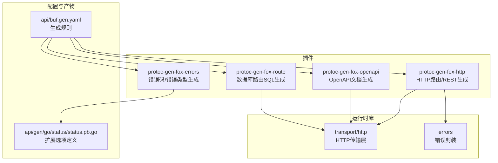
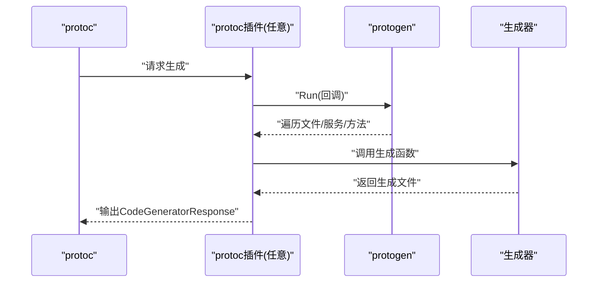
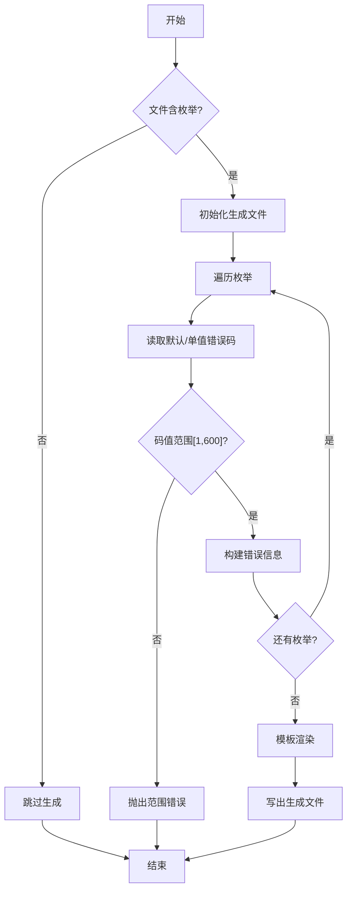
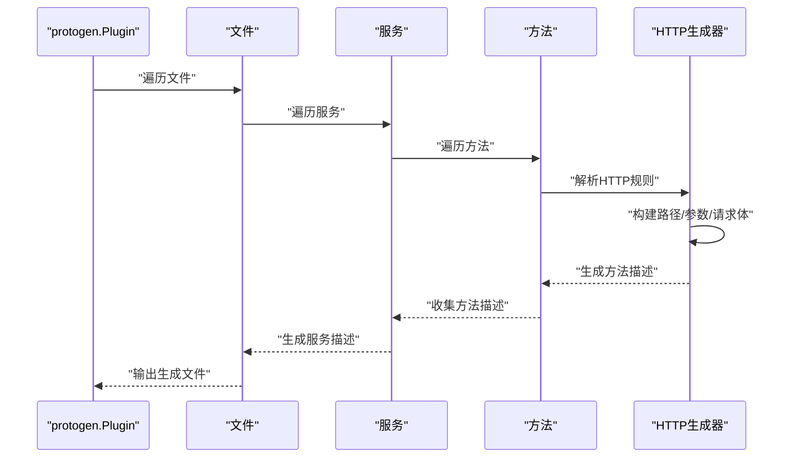
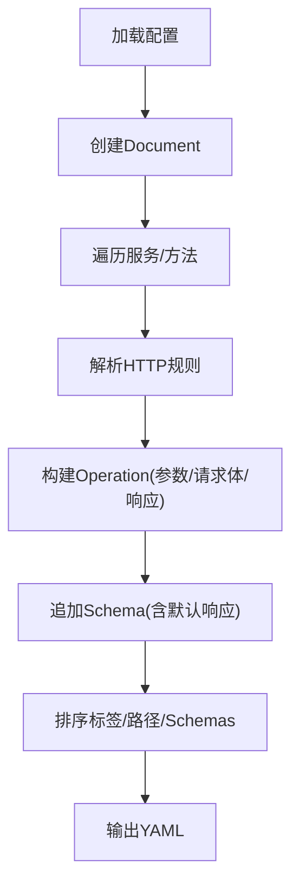
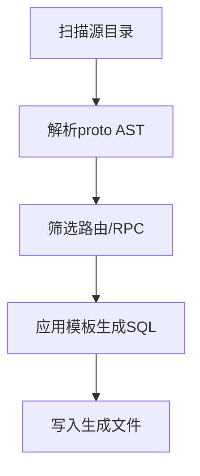
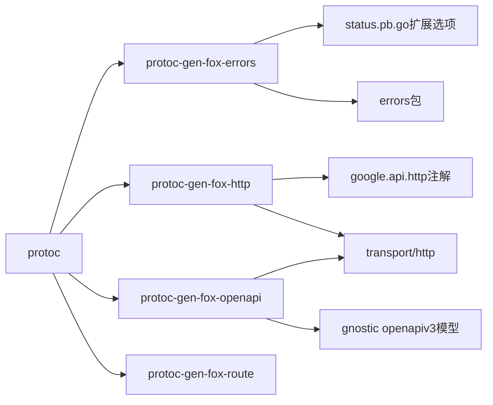

# 协议生成工具

<cite>
**本文引用的文件**
- [cmd/protoc-gen-fox-errors/main.go](file://cmd/protoc-gen-fox-errors/main.go)
- [cmd/protoc-gen-fox-errors/generator.go](file://cmd/protoc-gen-fox-errors/generator.go)
- [cmd/protoc-gen-fox-errors/template.go](file://cmd/protoc-gen-fox-errors/template.go)
- [cmd/protoc-gen-fox-errors/version.go](file://cmd/protoc-gen-fox-errors/version.go)
- [cmd/protoc-gen-fox-http/main.go](file://cmd/protoc-gen-fox-http/main.go)
- [cmd/protoc-gen-fox-http/http.go](file://cmd/protoc-gen-fox-http/http.go)
- [cmd/protoc-gen-fox-http/template.go](file://cmd/protoc-gen-fox-http/template.go)
- [cmd/protoc-gen-fox-openapi/main.go](file://cmd/protoc-gen-fox-openapi/main.go)
- [cmd/protoc-gen-fox-openapi/generator/generator.go](file://cmd/protoc-gen-fox-openapi/generator/generator.go)
- [cmd/protoc-gen-fox-openapi/generator/reflector.go](file://cmd/protoc-gen-fox-openapi/generator/reflector.go)
- [cmd/protoc-gen-fox-route/main.go](file://cmd/protoc-gen-fox-route/main.go)
- [cmd/protoc-gen-fox-route/generator/generator.go](file://cmd/protoc-gen-fox-route/generator/generator.go)
- [cmd/protoc-gen-fox-route/generator/template.go.tpl](file://cmd/protoc-gen-fox-route/generator/template.go.tpl)
- [api/buf.gen.yaml](file://api/buf.gen.yaml)
- [api/gen/go/status/status.pb.go](file://api/gen/go/status/status.pb.go)
</cite>

## 目录
1. [简介](#简介)
2. [项目结构](#项目结构)
3. [核心组件](#核心组件)
4. [架构总览](#架构总览)
5. [详细组件分析](#详细组件分析)
6. [依赖关系分析](#依赖关系分析)
7. [性能考量](#性能考量)
8. [故障排查指南](#故障排查指南)
9. [结论](#结论)
10. [附录：使用示例与最佳实践](#附录使用示例与最佳实践)

## 简介
本文件面向Go Fox协议生成工具链，系统化阐述四个protoc插件的实现机制与使用方法：
- 错误码与错误类型自动生成：protoc-gen-fox-errors
- HTTP路由与RESTful API标准化：protoc-gen-fox-http
- OpenAPI文档自动生成：protoc-gen-fox-openapi
- 数据库迁移脚本路由插入：protoc-gen-fox-route
同时给出buf.gen.yaml配置、Protocol Buffers定义最佳实践、完整使用示例与集成方案，帮助开发者提升开发效率。

## 项目结构
仓库采用按功能模块划分的多插件组织方式，核心在cmd/protoc-gen-*目录中，每个插件独立构建为protoc可执行插件；api/目录包含生成产物与通用配置；其余为运行时库与中间件。

图表来源
- [cmd/protoc-gen-fox-errors/main.go](file://cmd/protoc-gen-fox-errors/main.go#L36-L56)
- [cmd/protoc-gen-fox-http/main.go](file://cmd/protoc-gen-fox-http/main.go#L17-L35)
- [cmd/protoc-gen-fox-openapi/main.go](file://cmd/protoc-gen-fox-openapi/main.go#L31-L68)
- [cmd/protoc-gen-fox-route/main.go](file://cmd/protoc-gen-fox-route/main.go#L17-L43)
- [api/buf.gen.yaml](file://api/buf.gen.yaml#L1-L15)
- [api/gen/go/status/status.pb.go](file://api/gen/go/status/status.pb.go#L93-L122)

章节来源
- [api/buf.gen.yaml](file://api/buf.gen.yaml#L1-L15)

## 核心组件
- protoc-gen-fox-errors：基于枚举扩展选项生成错误码常量与错误类型代码，支持默认错误码与单值覆盖，范围校验与标题化处理。
- protoc-gen-fox-http：解析google.api.http注解，生成HTTP路由绑定与请求/响应编解码辅助，支持路径参数、请求体、上传文件、注解关键字提取等。
- protoc-gen-fox-openapi：从服务与消息反射生成OpenAPI 3.0.3文档，自动处理查询参数、请求体媒体类型、默认错误响应、标签排序与服务器配置合并。
- protoc-gen-fox-route：扫描proto源码，提取HTTP路由或显式路由标记，生成数据库迁移SQL（Up/Down），用于初始化路由表。

章节来源
- [cmd/protoc-gen-fox-errors/generator.go](file://cmd/protoc-gen-fox-errors/generator.go#L48-L133)
- [cmd/protoc-gen-fox-http/http.go](file://cmd/protoc-gen-fox-http/http.go#L30-L125)
- [cmd/protoc-gen-fox-openapi/generator/generator.go](file://cmd/protoc-gen-fox-openapi/generator/generator.go#L92-L103)
- [cmd/protoc-gen-fox-route/generator/generator.go](file://cmd/protoc-gen-fox-route/generator/generator.go#L80-L112)

## 架构总览
四个插件均遵循protoc插件协议，通过protogen读取文件集合并生成目标语言代码。OpenAPI插件额外引入gnostic模型进行YAML序列化；HTTP插件依赖内部HTTP传输层与绑定工具；错误插件依赖状态扩展选项定义。

图表来源
- [cmd/protoc-gen-fox-errors/main.go](file://cmd/protoc-gen-fox-errors/main.go#L44-L55)
- [cmd/protoc-gen-fox-http/main.go](file://cmd/protoc-gen-fox-http/main.go#L23-L34)
- [cmd/protoc-gen-fox-openapi/main.go](file://cmd/protoc-gen-fox-openapi/main.go#L48-L68)
- [cmd/protoc-gen-fox-route/main.go](file://cmd/protoc-gen-fox-route/main.go#L31-L43)

## 详细组件分析

### 错误码与错误类型生成（protoc-gen-fox-errors）
- 功能要点
  - 仅对存在枚举的文件生成错误代码。
  - 通过扩展选项读取默认错误码与单值错误码，范围限制在1~600。
  - 将枚举值转为驼峰标识，生成错误包装模板代码。
  - 若所有枚举均无有效错误码则跳过生成。
- 关键流程
  - 解析文件枚举，逐项提取错误码与注释。
  - 校验错误码范围，异常时抛出错误。
  - 使用模板渲染生成文件内容。
- 复杂度
  - 时间复杂度O(F×E)，F为文件数，E为枚举数。
  - 空间复杂度O(E)用于缓存错误信息。

图表来源
- [cmd/protoc-gen-fox-errors/generator.go](file://cmd/protoc-gen-fox-errors/generator.go#L48-L133)
- [api/gen/go/status/status.pb.go](file://api/gen/go/status/status.pb.go#L93-L122)

章节来源
- [cmd/protoc-gen-fox-errors/generator.go](file://cmd/protoc-gen-fox-errors/generator.go#L48-L133)
- [cmd/protoc-gen-fox-errors/template.go](file://cmd/protoc-gen-fox-errors/template.go#L36-L59)
- [cmd/protoc-gen-fox-errors/version.go](file://cmd/protoc-gen-fox-errors/version.go#L30-L31)
- [api/gen/go/status/status.pb.go](file://api/gen/go/status/status.pb.go#L93-L122)

### HTTP路由与REST生成（protoc-gen-fox-http）
- 功能要点
  - 仅当存在HTTP规则或允许忽略模式时生成。
  - 支持GET/POST/PUT/DELETE/PATCH与自定义方法，自动推断路径与请求体字段。
  - 提取注释中的关键字生成路由元数据注释。
  - 自动检测上传字段（binary格式的fox.file.FoxFile）并生成上传处理逻辑。
- 关键流程
  - 遍历服务与方法，解析google.api.http规则。
  - 构建路径变量、请求体与响应体映射。
  - 渲染模板生成路由绑定代码。
- 复杂度
  - 时间复杂度O(S×M)，S为服务数，M为方法数。
  - 空间复杂度O(M)存储方法描述。

图表来源
- [cmd/protoc-gen-fox-http/http.go](file://cmd/protoc-gen-fox-http/http.go#L70-L110)
- [cmd/protoc-gen-fox-http/http.go](file://cmd/protoc-gen-fox-http/http.go#L127-L189)
- [cmd/protoc-gen-fox-http/template.go](file://cmd/protoc-gen-fox-http/template.go#L55-L69)

章节来源
- [cmd/protoc-gen-fox-http/main.go](file://cmd/protoc-gen-fox-http/main.go#L17-L35)
- [cmd/protoc-gen-fox-http/http.go](file://cmd/protoc-gen-fox-http/http.go#L30-L125)
- [cmd/protoc-gen-fox-http/http.go](file://cmd/protoc-gen-fox-http/http.go#L127-L189)
- [cmd/protoc-gen-fox-http/http.go](file://cmd/protoc-gen-fox-http/http.go#L191-L207)
- [cmd/protoc-gen-fox-http/http.go](file://cmd/protoc-gen-fox-http/http.go#L209-L268)
- [cmd/protoc-gen-fox-http/http.go](file://cmd/protoc-gen-fox-http/http.go#L270-L300)
- [cmd/protoc-gen-fox-http/http.go](file://cmd/protoc-gen-fox-http/http.go#L309-L337)
- [cmd/protoc-gen-fox-http/http.go](file://cmd/protoc-gen-fox-http/http.go#L339-L359)
- [cmd/protoc-gen-fox-http/http.go](file://cmd/protoc-gen-fox-http/http.go#L369-L423)
- [cmd/protoc-gen-fox-http/http.go](file://cmd/protoc-gen-fox-http/http.go#L435-L445)
- [cmd/protoc-gen-fox-http/template.go](file://cmd/protoc-gen-fox-http/template.go#L13-L53)

### OpenAPI文档生成（protoc-gen-fox-openapi）
- 功能要点
  - 支持版本、标题、描述、命名策略、枚举序列化、循环深度、默认响应等配置。
  - 输出模式支持“合并”或“源相对”两种。
  - 反射消息与字段，自动识别查询参数、请求体媒体类型（application/json或multipart/form-data）。
  - 自动生成默认错误响应（google.rpc.Status）与Well-Known Schema。
- 关键流程
  - 初始化配置与反射器，构建Document。
  - 遍历服务与方法，解析HTTP规则，生成Operation。
  - 追加必要Schema，排序并输出YAML。
- 复杂度
  - 时间复杂度近似O(S×M×F)，S为服务数，M为方法数，F为消息字段平均数。
  - 空间复杂度与Schema数量相关。

图表来源
- [cmd/protoc-gen-fox-openapi/main.go](file://cmd/protoc-gen-fox-openapi/main.go#L31-L68)
- [cmd/protoc-gen-fox-openapi/generator/generator.go](file://cmd/protoc-gen-fox-openapi/generator/generator.go#L92-L103)
- [cmd/protoc-gen-fox-openapi/generator/generator.go](file://cmd/protoc-gen-fox-openapi/generator/generator.go#L135-L279)
- [cmd/protoc-gen-fox-openapi/generator/generator.go](file://cmd/protoc-gen-fox-openapi/generator/generator.go#L471-L720)
- [cmd/protoc-gen-fox-openapi/generator/reflector.go](file://cmd/protoc-gen-fox-openapi/generator/reflector.go#L104-L116)
- [cmd/protoc-gen-fox-openapi/generator/reflector.go](file://cmd/protoc-gen-fox-openapi/generator/reflector.go#L181-L240)

章节来源
- [cmd/protoc-gen-fox-openapi/main.go](file://cmd/protoc-gen-fox-openapi/main.go#L31-L68)
- [cmd/protoc-gen-fox-openapi/generator/generator.go](file://cmd/protoc-gen-fox-openapi/generator/generator.go#L92-L103)
- [cmd/protoc-gen-fox-openapi/generator/generator.go](file://cmd/protoc-gen-fox-openapi/generator/generator.go#L135-L279)
- [cmd/protoc-gen-fox-openapi/generator/generator.go](file://cmd/protoc-gen-fox-openapi/generator/generator.go#L471-L720)
- [cmd/protoc-gen-fox-openapi/generator/reflector.go](file://cmd/protoc-gen-fox-openapi/generator/reflector.go#L104-L116)
- [cmd/protoc-gen-fox-openapi/generator/reflector.go](file://cmd/protoc-gen-fox-openapi/generator/reflector.go#L181-L240)

### 数据库路由SQL生成（protoc-gen-fox-route）
- 功能要点
  - 递归扫描proto源码，解析服务与RPC。
  - 优先解析显式路由选项，其次回退到google.api.http规则。
  - 生成带时间戳的迁移SQL文件，包含Up/Down两部分。
- 关键流程
  - 读取源目录下所有proto，解析AST。
  - 提取满足条件的路由项，填充模板。
  - 写入生成文件。
- 复杂度
  - 时间复杂度O(N)，N为proto文件数与元素总数。
  - 空间复杂度O(R)，R为路由条目数。

图表来源
- [cmd/protoc-gen-fox-route/generator/generator.go](file://cmd/protoc-gen-fox-route/generator/generator.go#L80-L112)
- [cmd/protoc-gen-fox-route/generator/generator.go](file://cmd/protoc-gen-fox-route/generator/generator.go#L114-L159)
- [cmd/protoc-gen-fox-route/generator/generator.go](file://cmd/protoc-gen-fox-route/generator/generator.go#L202-L234)
- [cmd/protoc-gen-fox-route/generator/template.go.tpl](file://cmd/protoc-gen-fox-route/generator/template.go.tpl#L1-L9)

章节来源
- [cmd/protoc-gen-fox-route/main.go](file://cmd/protoc-gen-fox-route/main.go#L17-L43)
- [cmd/protoc-gen-fox-route/generator/generator.go](file://cmd/protoc-gen-fox-route/generator/generator.go#L80-L112)
- [cmd/protoc-gen-fox-route/generator/generator.go](file://cmd/protoc-gen-fox-route/generator/generator.go#L114-L159)
- [cmd/protoc-gen-fox-route/generator/generator.go](file://cmd/protoc-gen-fox-route/generator/generator.go#L202-L234)
- [cmd/protoc-gen-fox-route/generator/template.go.tpl](file://cmd/protoc-gen-fox-route/generator/template.go.tpl#L1-L9)

## 依赖关系分析
- 插件与protoc
  - 四个插件均通过protogen.Run注册回调，读取插件请求并生成响应。
- 插件与扩展选项
  - 错误插件依赖status.pb.go中定义的扩展选项（默认码、单值码）。
  - HTTP插件依赖google.api.http注解。
  - OpenAPI插件依赖gnostic openapiv3模型与well-known schemas。
- 插件与运行时库
  - HTTP插件依赖内部transport/http与binding工具。
  - 错误插件依赖errors包的兼容性常量。
- 配置与生成规则
  - buf.gen.yaml统一声明生成器、输出目录与opt参数，确保一致性。

图表来源
- [cmd/protoc-gen-fox-errors/main.go](file://cmd/protoc-gen-fox-errors/main.go#L44-L55)
- [cmd/protoc-gen-fox-http/main.go](file://cmd/protoc-gen-fox-http/main.go#L23-L34)
- [cmd/protoc-gen-fox-openapi/main.go](file://cmd/protoc-gen-fox-openapi/main.go#L48-L68)
- [cmd/protoc-gen-fox-route/main.go](file://cmd/protoc-gen-fox-route/main.go#L31-L43)
- [api/gen/go/status/status.pb.go](file://api/gen/go/status/status.pb.go#L93-L122)

章节来源
- [api/buf.gen.yaml](file://api/buf.gen.yaml#L10-L15)

## 性能考量
- 生成器遍历文件、服务、方法与消息字段，整体复杂度与输入规模线性相关。
- OpenAPI生成涉及Schema去重与排序，建议控制消息嵌套深度与循环引用数量。
- HTTP生成器在路径解析与注释关键字提取上存在正则匹配，建议保持注释简洁。
- 错误生成器与路由生成器均为单次扫描，开销较小。

## 故障排查指南
- 错误码范围异常
  - 现象：生成时抛出错误，提示码值超出[1,600]。
  - 排查：检查枚举扩展选项是否越界，修正后重新生成。
- HTTP路径变量不匹配
  - 现象：生成器提示找不到对应字段或路径中出现map/list。
  - 排查：确认路径变量与消息字段一致，避免map与list出现在路径中。
- OpenAPI默认响应缺失
  - 现象：期望看到默认错误响应但未生成。
  - 排查：确认已启用默认响应选项，并确保消息中包含google.rpc.Status。
- 路由SQL未生成
  - 现象：未产出迁移文件。
  - 排查：确认proto中存在显式路由选项或google.api.http规则，且注释非空。

章节来源
- [cmd/protoc-gen-fox-errors/generator.go](file://cmd/protoc-gen-fox-errors/generator.go#L93-L107)
- [cmd/protoc-gen-fox-http/http.go](file://cmd/protoc-gen-fox-http/http.go#L236-L249)
- [cmd/protoc-gen-fox-openapi/generator/generator.go](file://cmd/protoc-gen-fox-openapi/generator/generator.go#L608-L633)
- [cmd/protoc-gen-fox-route/generator/generator.go](file://cmd/protoc-gen-fox-route/generator/generator.go#L134-L152)

## 结论
本工具链以插件化方式将Protocol Buffers定义转化为HTTP路由、OpenAPI文档与数据库迁移脚本，显著降低重复劳动并保证规范一致性。通过扩展选项与注解驱动，开发者只需专注业务模型设计，即可获得高质量的生成物。建议结合buf.gen.yaml统一管理生成规则，并遵循本文最佳实践以获得最佳效果。

## 附录：使用示例与最佳实践

### 使用步骤
- 安装插件
  - 将四个插件二进制置于PATH或使用本地运行方式。
- 编写buf.gen.yaml
  - 参考现有配置，设置输出目录与opt参数。
- 编写proto
  - 在枚举上添加错误码扩展选项；在方法上添加HTTP注解；在需要的字段上添加OpenAPI属性扩展。
- 生成
  - 运行protoc并指定相应插件，生成目标文件。

章节来源
- [api/buf.gen.yaml](file://api/buf.gen.yaml#L1-L15)

### 最佳实践与命名规范
- 错误定义
  - 枚举命名采用语义化英文，推荐使用名词短语；值命名使用全大写下划线风格。
  - 为枚举设置默认错误码，为关键值设置覆盖码，确保范围在[1,600]。
- HTTP注解
  - GET请求避免声明body；POST/PUT/DELETE/PATCH根据实际需求声明body字段。
  - 路径中使用明确的变量名，避免map与list出现在路径段中。
- OpenAPI
  - 合理使用注释关键字，便于生成路由元数据。
  - 对上传场景，使用binary格式的文件字段并配合multipart/form-data。
- 路由
  - 显式标注路由选项，确保生成SQL包含所需路由条目。
  - 统一注释风格，保证标题可读性。

### 集成方案
- CI流水线
  - 在构建阶段自动执行protoc与各插件生成，校验生成产物。
- 文档同步
  - 使用OpenAPI插件生成文档并与前端联调，确保接口一致性。
- 迁移自动化
  - 使用路由插件生成迁移脚本，配合数据库迁移工具完成路由初始化。