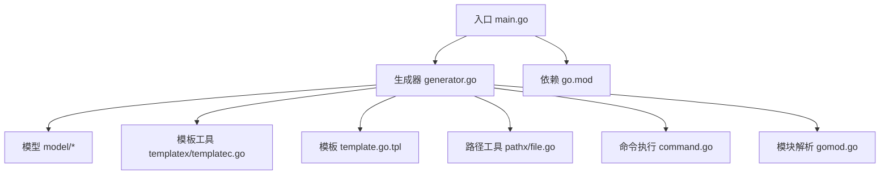
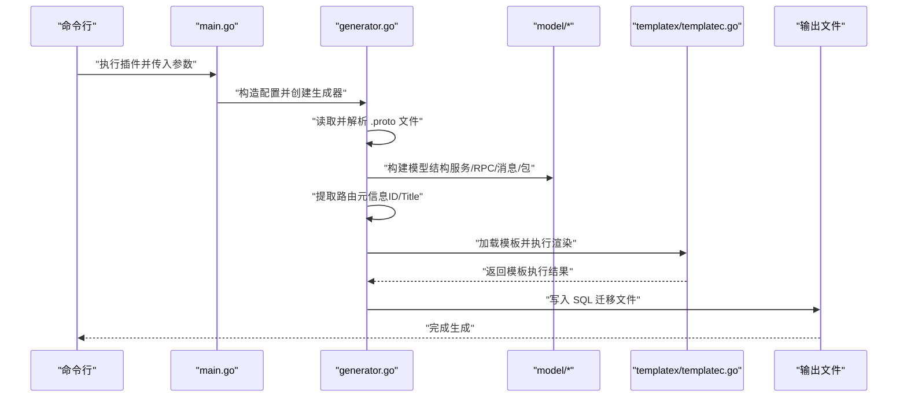
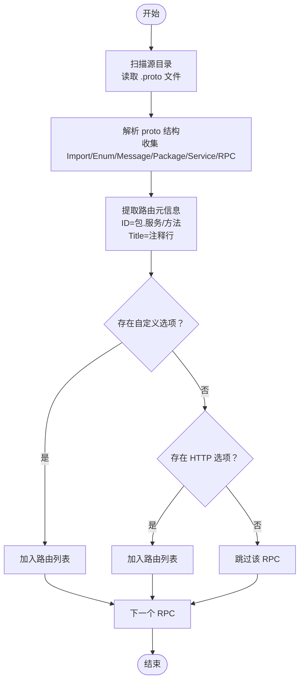
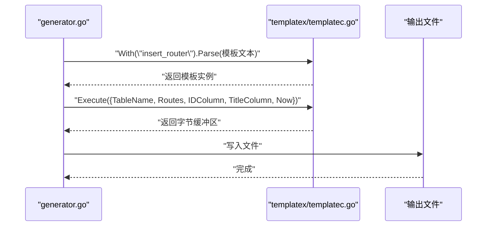
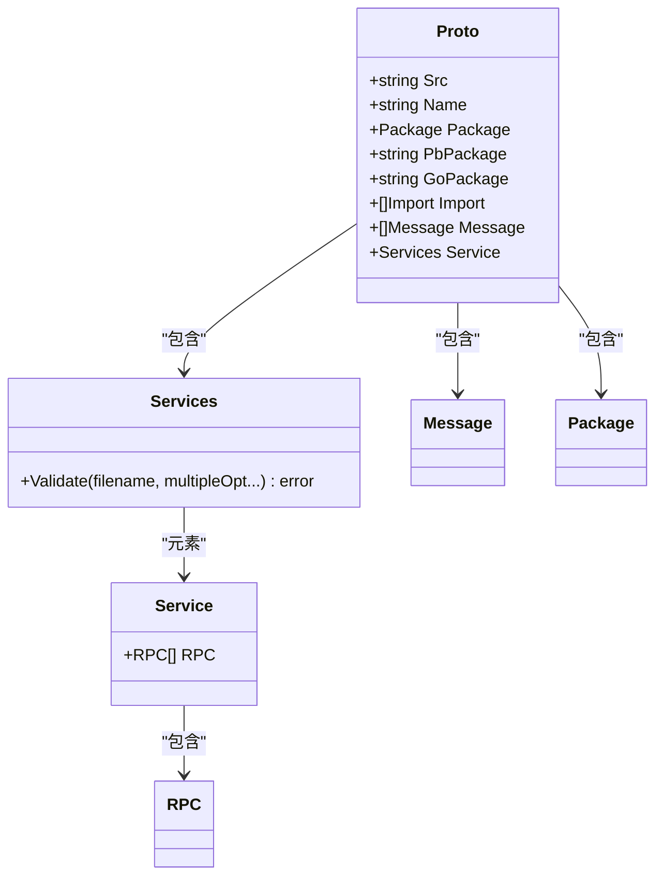
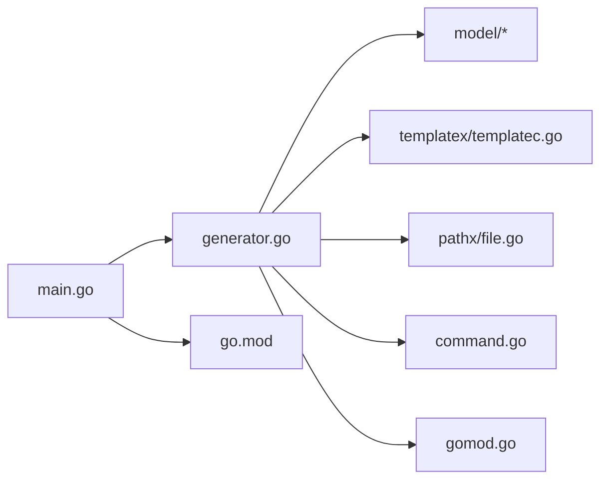

# 路由生成插件 (protoc-gen-fox-route)

<cite>
**本文引用的文件**
- [main.go](file://cmd/protoc-gen-fox-route/main.go)
- [generator.go](file://cmd/protoc-gen-fox-route/generator/generator.go)
- [template.go.tpl](file://cmd/protoc-gen-fox-route/generator/template.go.tpl)
- [go.mod](file://cmd/protoc-gen-fox-route/go.mod)
- [rpc.go](file://cmd/protoc-gen-fox-route/generator/model/rpc.go)
- [service.go](file://cmd/protoc-gen-fox-route/generator/model/service.go)
- [message.go](file://cmd/protoc-gen-fox-route/generator/model/message.go)
- [package.go](file://cmd/protoc-gen-fox-route/generator/model/package.go)
- [proto.go](file://cmd/protoc-gen-fox-route/generator/model/proto.go)
- [file.go](file://cmd/protoc-gen-fox-route/generator/pathx/file.go)
- [templatec.go](file://cmd/protoc-gen-fox-route/generator/templatex/templatec.go)
- [command.go](file://cmd/protoc-gen-fox-route/generator/command.go)
- [gomod.go](file://cmd/protoc-gen-fox-route/generator/gomod.go)
- [test.proto](file://internal/testdata/binding/test.proto)
- [test.proto](file://internal/testdata/encoding/test.proto)
</cite>

## 目录
1. [简介](#简介)
2. [项目结构](#项目结构)
3. [核心组件](#核心组件)
4. [架构总览](#架构总览)
5. [详细组件分析](#详细组件分析)
6. [依赖关系分析](#依赖关系分析)
7. [性能考虑](#性能考虑)
8. [故障排查指南](#故障排查指南)
9. [结论](#结论)
10. [附录：使用示例与最佳实践](#附录使用示例与最佳实践)

## 简介
本文件为 protoc-gen-fox-route 插件的全面技术文档。该插件用于从 Protocol Buffers 定义中提取路由元数据，并生成数据库迁移脚本（基于 goose 的 SQL 迁移）。其核心目标是将 RPC 方法与其路由元信息关联起来，形成可执行的数据库插入/删除语句，便于在应用启动时初始化路由表。

插件通过解析 .proto 文件中的服务与 RPC，识别特定选项以决定是否纳入路由生成；随后使用模板引擎渲染 SQL 迁移文件，实现“声明式”路由注册。

## 项目结构
protoc-gen-fox-route 位于 cmd/protoc-gen-fox-route 目录，主要由以下部分组成：
- 入口程序：main.go
- 生成器：generator/generator.go
- 模板：generator/template.go.tpl
- 模型层：generator/model/*（封装 proto 结构）
- 模板工具：generator/templatex/templatec.go
- 路径工具：generator/pathx/file.go
- 命令执行与模块解析：generator/command.go、generator/gomod.go
- 依赖声明：go.mod

图表来源
- [main.go](file://cmd/protoc-gen-fox-route/main.go#L1-L45)
- [generator.go](file://cmd/protoc-gen-fox-route/generator/generator.go#L1-L307)
- [template.go.tpl](file://cmd/protoc-gen-fox-route/generator/template.go.tpl#L1-L9)
- [templatec.go](file://cmd/protoc-gen-fox-route/generator/templatex/templatec.go#L1-L116)
- [file.go](file://cmd/protoc-gen-fox-route/generator/pathx/file.go#L1-L27)
- [command.go](file://cmd/protoc-gen-fox-route/generator/command.go#L1-L50)
- [gomod.go](file://cmd/protoc-gen-fox-route/generator/gomod.go#L1-L77)
- [go.mod](file://cmd/protoc-gen-fox-route/go.mod#L1-L10)

章节来源
- [main.go](file://cmd/protoc-gen-fox-route/main.go#L1-L45)
- [go.mod](file://cmd/protoc-gen-fox-route/go.mod#L1-L10)

## 核心组件
- 入口与参数配置：main.go 中定义了源目录、表名、输出文件名、列名等参数，并通过 protogen 运行生成器。
- 生成器：generator.go 实现了读取 proto 文件、解析服务与 RPC、提取路由元信息、渲染模板并输出 SQL 文件的完整流程。
- 模型层：model 包对 proto 的服务、消息、包、RPC 等进行轻量封装，便于后续处理。
- 模板系统：template.go.tpl 提供 SQL 插入/删除模板；templatex/templatec.go 提供模板解析、格式化与保存能力。
- 工具模块：pathx/file.go 提供文件存在性判断；command.go 提供跨平台命令执行；gomod.go 提供模块信息解析。

章节来源
- [generator.go](file://cmd/protoc-gen-fox-route/generator/generator.go#L1-L307)
- [rpc.go](file://cmd/protoc-gen-fox-route/generator/model/rpc.go#L1-L24)
- [service.go](file://cmd/protoc-gen-fox-route/generator/model/service.go#L1-L68)
- [message.go](file://cmd/protoc-gen-fox-route/generator/model/message.go#L1-L24)
- [package.go](file://cmd/protoc-gen-fox-route/generator/model/package.go#L1-L24)
- [proto.go](file://cmd/protoc-gen-fox-route/generator/model/proto.go#L1-L29)
- [template.go.tpl](file://cmd/protoc-gen-fox-route/generator/template.go.tpl#L1-L9)
- [templatec.go](file://cmd/protoc-gen-fox-route/generator/templatex/templatec.go#L1-L116)
- [file.go](file://cmd/protoc-gen-fox-route/generator/pathx/file.go#L1-L27)
- [command.go](file://cmd/protoc-gen-fox-route/generator/command.go#L1-L50)
- [gomod.go](file://cmd/protoc-gen-fox-route/generator/gomod.go#L1-L77)

## 架构总览
插件运行时序如下：

图表来源
- [main.go](file://cmd/protoc-gen-fox-route/main.go#L17-L44)
- [generator.go](file://cmd/protoc-gen-fox-route/generator/generator.go#L80-L112)
- [templatec.go](file://cmd/protoc-gen-fox-route/generator/templatex/templatec.go#L83-L107)

## 详细组件分析

### 入口与配置（main.go）
- 参数定义：支持源目录、表名、输出文件名、版本查询、ID 列名、标题列名等。
- 启动流程：启用 proto3 可选特性，创建生成器并执行 Run。
- 版本输出：当传入版本标志时打印当前版本。

章节来源
- [main.go](file://cmd/protoc-gen-fox-route/main.go#L13-L44)

### 生成器核心逻辑（generator.go）
- 配置结构：包含源目录、表名、包名、文件名、版本开关、ID 列、标题列等。
- 生成器结构：持有 protogen 插件实例、配置、解析出的 proto 列表、模块信息等。
- Run 流程：
  - 解析路由：调用 parserRoute 提取所有候选路由。
  - 加载模板：通过 templatex.With 加载模板字符串。
  - 渲染输出：根据模板变量渲染 SQL 并写入生成文件。
- 路由解析策略：
  - 遍历每个 proto 的服务与 RPC。
  - 优先检查自定义选项以决定是否纳入路由。
  - 若无自定义选项，则回退到标准 HTTP 选项。
  - ID 采用“包名.服务名/方法名”的形式，Title 来自注释行。
- 模型解析：
  - 使用 emicklei/proto 对 proto 进行遍历，收集 Import、Enum、Message、Package、Service、RPC 等。
  - 通过 model 包的结构体对原始 proto 结构进行封装，便于后续处理。
- 文件扫描与解析：
  - readParser 递归扫描源目录，读取 .proto 文件并解析。
- 模块与导入：
  - getEntPath 与 getEntImport 用于定位 ent 目录并计算导入路径，便于扩展。
- 命名转换：
  - ToCamelCase 提供下划线转驼峰的通用工具。

图表来源
- [generator.go](file://cmd/protoc-gen-fox-route/generator/generator.go#L114-L159)

章节来源
- [generator.go](file://cmd/protoc-gen-fox-route/generator/generator.go#L33-L112)
- [generator.go](file://cmd/protoc-gen-fox-route/generator/generator.go#L114-L159)
- [generator.go](file://cmd/protoc-gen-fox-route/generator/generator.go#L161-L200)
- [generator.go](file://cmd/protoc-gen-fox-route/generator/generator.go#L202-L234)
- [generator.go](file://cmd/protoc-gen-fox-route/generator/generator.go#L236-L274)
- [generator.go](file://cmd/protoc-gen-fox-route/generator/generator.go#L276-L306)

### 模板系统（template.go.tpl 与 templatex/templatec.go）
- 模板内容：提供 Up/Down 两段 SQL，按路由列表循环插入或删除记录，并设置创建与更新时间。
- 模板变量：表名、ID 列、标题列、当前时间戳、路由列表。
- 模板工具：
  - With/Parse：设置模板名称与文本。
  - Execute：执行模板渲染，支持 Go 源码格式化（可选）。
  - SaveTo：将渲染结果写入目标路径，支持覆盖策略。
  - GetHead：生成头部注释，提示文件由工具生成。

图表来源
- [generator.go](file://cmd/protoc-gen-fox-route/generator/generator.go#L87-L111)
- [templatec.go](file://cmd/protoc-gen-fox-route/generator/templatex/templatec.go#L45-L107)

章节来源
- [template.go.tpl](file://cmd/protoc-gen-fox-route/generator/template.go.tpl#L1-L9)
- [templatec.go](file://cmd/protoc-gen-fox-route/generator/templatex/templatec.go#L38-L116)

### 模型设计（model/*）
- Proto：封装 proto 文件的包、Go 包名、导入、消息、服务等。
- Service：封装服务及其 RPC 列表。
- RPC：封装 RPC。
- Message：封装消息。
- Package：封装包。
- 校验：Services.Validate 对请求/返回类型进行约束校验，确保类型定义在当前文件内。

图表来源
- [proto.go](file://cmd/protoc-gen-fox-route/generator/model/proto.go#L18-L28)
- [service.go](file://cmd/protoc-gen-fox-route/generator/model/service.go#L26-L35)
- [rpc.go](file://cmd/protoc-gen-fox-route/generator/model/rpc.go#L20-L23)
- [message.go](file://cmd/protoc-gen-fox-route/generator/model/message.go#L18-L23)
- [package.go](file://cmd/protoc-gen-fox-route/generator/model/package.go#L18-L23)

章节来源
- [proto.go](file://cmd/protoc-gen-fox-route/generator/model/proto.go#L1-L29)
- [service.go](file://cmd/protoc-gen-fox-route/generator/model/service.go#L1-L68)
- [rpc.go](file://cmd/protoc-gen-fox-route/generator/model/rpc.go#L1-L24)
- [message.go](file://cmd/protoc-gen-fox-route/generator/model/message.go#L1-L24)
- [package.go](file://cmd/protoc-gen-fox-route/generator/model/package.go#L1-L24)

### 路径与文件工具（pathx/file.go）
- FileExists：判断文件是否存在，用于控制是否覆盖写入。

章节来源
- [file.go](file://cmd/protoc-gen-fox-route/generator/pathx/file.go#L22-L26)

### 命令执行与模块解析（command.go、gomod.go）
- Exec：跨平台执行 shell/cmd 命令，捕获标准输出与错误。
- 模块解析：通过 go list 获取模块信息，辅助定位 ent 目录与导入路径。

章节来源
- [command.go](file://cmd/protoc-gen-fox-route/generator/command.go#L19-L49)
- [gomod.go](file://cmd/protoc-gen-fox-route/generator/gomod.go#L12-L76)

## 依赖关系分析
- 外部依赖：emicklei/proto 用于解析 proto；google.golang.org/protobuf 用于插件框架；github.com/pkg/errors 用于错误包装。
- 内部依赖：generator.go 依赖 model/*、templatex、pathx、command、gomod。
- 模块边界：插件通过 protogen 接口与编译器交互，生成文件写入到插件生成的文件集合中。

图表来源
- [go.mod](file://cmd/protoc-gen-fox-route/go.mod#L5-L9)
- [main.go](file://cmd/protoc-gen-fox-route/main.go#L3-L11)
- [generator.go](file://cmd/protoc-gen-fox-route/generator/generator.go#L3-L21)

章节来源
- [go.mod](file://cmd/protoc-gen-fox-route/go.mod#L1-L10)

## 性能考虑
- 解析复杂度：readParser 递归扫描目录并逐个解析 .proto 文件，整体复杂度近似 O(N)（N 为 proto 数量），但解析本身受文件大小影响。
- 模板渲染：模板执行为线性遍历路由列表，复杂度 O(R)（R 为路由数量）。
- I/O 开销：生成文件写入磁盘，建议批量写入并在必要时启用 Go 格式化（可能带来额外 CPU 开销）。
- 建议：
  - 控制源目录范围，避免不必要的子目录扫描。
  - 合理选择模板变量，减少不必要的字符串拼接。
  - 在 CI 中缓存依赖与中间产物，提升重复生成速度。

## 故障排查指南
- 未找到 go.mod：模块解析失败会报错，需确认工作目录存在 go.mod 或通过参数调整源目录。
- 模板解析错误：templatex 在解析模板时会返回错误信息，检查模板语法与变量名。
- 路由提取为空：确认 .proto 中存在符合要求的 RPC 选项（自定义选项或 HTTP 选项），并确保注释行存在。
- 文件写入失败：检查输出路径权限与磁盘空间；若文件已存在且未强制覆盖，将跳过写入。
- 跨平台命令执行：Windows/macOS/Linux 的命令行差异可能导致执行失败，检查命令与环境。

章节来源
- [gomod.go](file://cmd/protoc-gen-fox-route/generator/gomod.go#L21-L62)
- [templatec.go](file://cmd/protoc-gen-fox-route/generator/templatex/templatec.go#L83-L107)
- [generator.go](file://cmd/protoc-gen-fox-route/generator/generator.go#L114-L159)
- [file.go](file://cmd/protoc-gen-fox-route/generator/pathx/file.go#L22-L26)
- [command.go](file://cmd/protoc-gen-fox-route/generator/command.go#L19-L49)

## 结论
protoc-gen-fox-route 插件通过解析 .proto 中的服务与 RPC，结合自定义或标准 HTTP 选项，将路由元信息转化为 SQL 迁移脚本，实现了声明式的路由注册流程。其模块化设计（模型、模板、工具）使得扩展与维护较为便利。在实际工程中，建议配合数据库迁移工具（如 goose）统一管理路由初始化与回滚。

## 附录：使用示例与最佳实践

### 如何定义路由规范
- 在 .proto 中定义服务与 RPC，并添加路由选项：
  - 自定义选项：用于显式标记需要生成路由的 RPC。
  - 标准 HTTP 选项：作为回退方案，自动纳入路由生成。
- 注释行：用于生成路由标题（Title），建议简洁明确。
- 示例参考：
  - [binding/test.proto](file://internal/testdata/binding/test.proto#L1-L24)
  - [encoding/test.proto](file://internal/testdata/encoding/test.proto#L1-L20)

章节来源
- [generator.go](file://cmd/protoc-gen-fox-route/generator/generator.go#L114-L159)
- [test.proto](file://internal/testdata/binding/test.proto#L1-L24)
- [test.proto](file://internal/testdata/encoding/test.proto#L1-L20)

### 生成的路由代码结构
- 输出文件：由模板渲染生成的 SQL 文件，包含 Up/Down 两段迁移脚本。
- 字段映射：
  - ID：采用“包名.服务名/方法名”的唯一标识。
  - 标题：来自注释行。
  - 时间：创建与更新时间由模板注入。
- 示例模板变量：
  - 表名、ID 列、标题列、当前时间戳、路由列表。

章节来源
- [template.go.tpl](file://cmd/protoc-gen-fox-route/generator/template.go.tpl#L1-L9)
- [generator.go](file://cmd/protoc-gen-fox-route/generator/generator.go#L87-L111)

### 最佳实践
- 路由命名规范：保持包名与服务名清晰，避免同名冲突。
- 注释一致性：为每个路由提供简短、准确的标题注释。
- 选项选择：优先使用自定义选项明确标注路由，减少误判。
- 路径与模块：确保 go.mod 存在且路径正确，以便插件解析模块信息。
- 中间件集成：可在应用启动阶段执行生成的 SQL，完成路由初始化；后续通过中间件统一处理路由匹配与鉴权。
- 性能优化：控制路由数量与模板复杂度，避免在模板中进行重型计算。