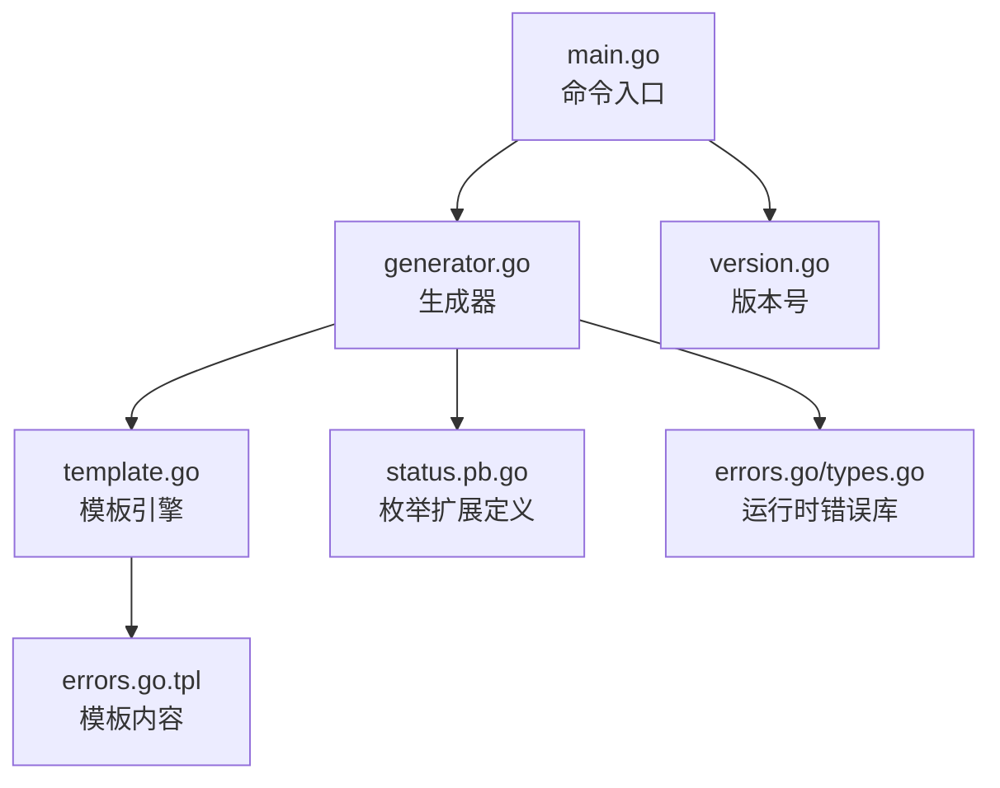
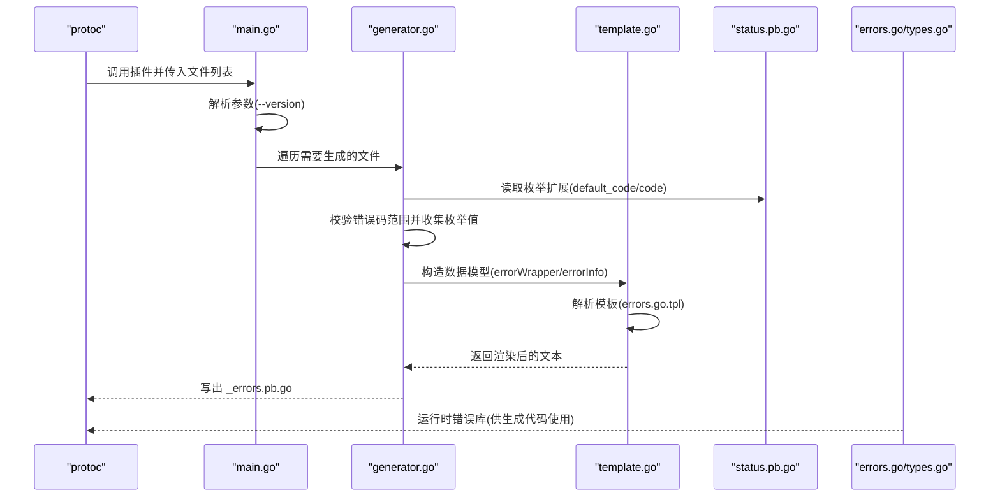
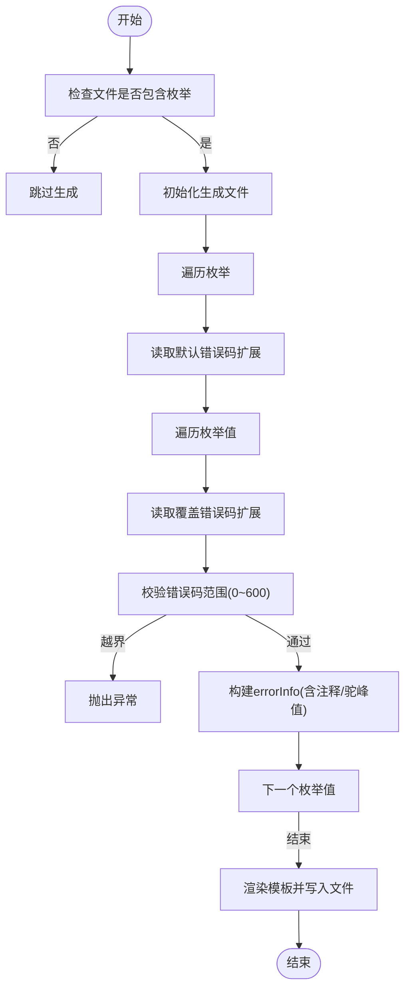
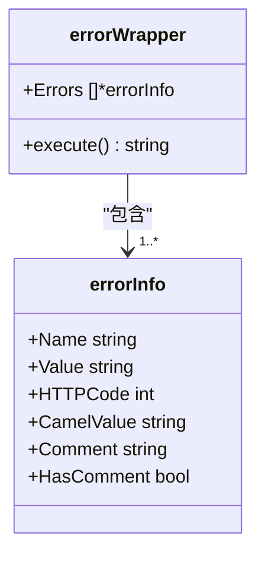
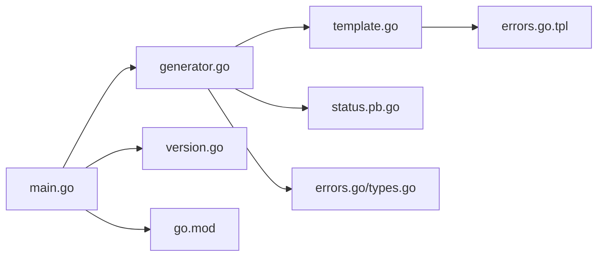

# 错误处理插件（protoc-gen-fox-errors）

<cite>
**本文引用的文件**
- [main.go](file://cmd/protoc-gen-fox-errors/main.go)
- [generator.go](file://cmd/protoc-gen-fox-errors/generator.go)
- [template.go](file://cmd/protoc-gen-fox-errors/template.go)
- [version.go](file://cmd/protoc-gen-fox-errors/version.go)
- [errors.go.tpl](file://cmd/protoc-gen-fox-errors/errors.go.tpl)
- [go.mod](file://cmd/protoc-gen-fox-errors/go.mod)
- [status.pb.go](file://api/gen/go/status/status.pb.go)
- [errors.go](file://errors/errors.go)
- [types.go](file://errors/types.go)
</cite>

## 目录
1. [简介](#简介)
2. [项目结构](#项目结构)
3. [核心组件](#核心组件)
4. [架构总览](#架构总览)
5. [详细组件分析](#详细组件分析)
6. [依赖关系分析](#依赖关系分析)
7. [性能考量](#性能考量)
8. [故障排查指南](#故障排查指南)
9. [结论](#结论)
10. [附录：使用示例与最佳实践](#附录使用示例与最佳实践)

## 简介
本文件面向开发者，系统性阐述 protoc-gen-fox-errors 插件的实现原理与使用方法。该插件基于 Protocol Buffers 的枚举扩展，从 .proto 文件中提取错误规范，自动生成 Go 错误处理代码，包括：
- 错误类型与错误码的定义
- 错误码范围校验与默认值策略
- 生成的 Go 函数：错误构造与错误判断
- 模板引擎工作流与变量替换机制
- 命令行参数与版本控制
- 使用示例与最佳实践

注意：当前仓库未发现对错误消息本地化的直接支持；插件生成的错误消息由调用方传入，不包含多语言资源文件。

## 项目结构
protoc-gen-fox-errors 位于 cmd/protoc-gen-fox-errors 目录，核心文件如下：
- main.go：命令入口，解析参数、运行 protogen 并遍历生成文件
- generator.go：核心生成逻辑，读取枚举扩展、构建错误信息、写出 Go 文件
- template.go：模板加载与执行，定义数据模型 errorWrapper/errorInfo
- errors.go.tpl：模板文件，定义生成函数的结构与变量替换
- version.go：版本号来源
- go.mod：模块与依赖声明

图表来源
- [main.go](file://cmd/protoc-gen-fox-errors/main.go#L36-L56)
- [generator.go](file://cmd/protoc-gen-fox-errors/generator.go#L48-L85)
- [template.go](file://cmd/protoc-gen-fox-errors/template.go#L27-L59)
- [errors.go.tpl](file://cmd/protoc-gen-fox-errors/errors.go.tpl#L1-L18)
- [status.pb.go](file://api/gen/go/status/status.pb.go#L93-L122)
- [errors.go](file://errors/errors.go#L27-L104)
- [types.go](file://errors/types.go#L28-L175)

章节来源
- [main.go](file://cmd/protoc-gen-fox-errors/main.go#L36-L56)
- [generator.go](file://cmd/protoc-gen-fox-errors/generator.go#L48-L85)
- [template.go](file://cmd/protoc-gen-fox-errors/template.go#L27-L59)
- [errors.go.tpl](file://cmd/protoc-gen-fox-errors/errors.go.tpl#L1-L18)
- [go.mod](file://cmd/protoc-gen-fox-errors/go.mod#L1-L24)

## 核心组件
- 命令入口与参数
  - 支持 --version 输出版本后退出
  - 通过 protogen.Run 驱动插件，设置 SupportedFeatures，并遍历需要生成的文件
- 生成器
  - 为每个包含枚举的文件生成 _errors.pb.go
  - 读取枚举扩展：默认错误码与单个枚举值的覆盖错误码
  - 校验错误码范围（0~600），越界则抛出异常
  - 将枚举值转换为驼峰命名，用于生成函数名
  - 构造 errorWrapper/errorInfo 数据模型，交由模板渲染
- 模板引擎
  - 加载 errors.go.tpl
  - 渲染生成两个函数族：IsXxx 与 ErrorXxx
- 运行时错误库
  - 提供 errors.New、FromError、GRPCStatus 等能力
  - 生成的代码通过 errors 包进行错误构造与判断

章节来源
- [main.go](file://cmd/protoc-gen-fox-errors/main.go#L34-L56)
- [generator.go](file://cmd/protoc-gen-fox-errors/generator.go#L48-L160)
- [template.go](file://cmd/protoc-gen-fox-errors/template.go#L33-L59)
- [errors.go](file://errors/errors.go#L27-L104)
- [types.go](file://errors/types.go#L28-L175)

## 架构总览
下图展示了从 .proto 到生成代码的端到端流程：

图表来源
- [main.go](file://cmd/protoc-gen-fox-errors/main.go#L36-L56)
- [generator.go](file://cmd/protoc-gen-fox-errors/generator.go#L87-L133)
- [template.go](file://cmd/protoc-gen-fox-errors/template.go#L49-L59)
- [status.pb.go](file://api/gen/go/status/status.pb.go#L93-L122)
- [errors.go](file://errors/errors.go#L94-L104)

## 详细组件分析

### 命令入口与参数
- 参数
  - --version：打印版本后退出
- 控制流
  - flag.Parse 解析参数
  - 若指定版本，则输出版本并返回
  - 否则，使用 protogen.Options 配置参数解析回调，进入 Run 回调
  - 在回调中设置 SupportedFeatures，遍历 gen.Files，仅对 f.Generate=true 的文件调用 generateFile

章节来源
- [main.go](file://cmd/protoc-gen-fox-errors/main.go#L34-L56)

### 生成器：错误码与函数生成
- 文件级生成
  - 若文件无枚举，跳过生成
  - 生成文件名规则：file.GeneratedFilenamePrefix + "_errors.pb.go"
  - 写入包声明与兼容性断言
- 枚举级生成
  - 读取枚举默认错误码扩展（0 表示未设置）
  - 对每个枚举值读取覆盖错误码扩展（0 表示继承默认）
  - 校验错误码范围（0~600），越界抛出异常
  - 忽略值为 0 的枚举项（不生成对应函数）
  - 收集注释与驼峰化后的值名，构建 errorInfo 列表
- 输出策略
  - 若所有枚举均未产生有效错误项，调用 g.Skip() 跳过生成
  - 否则将 errorWrapper 渲染到生成文件

图表来源
- [generator.go](file://cmd/protoc-gen-fox-errors/generator.go#L48-L133)

章节来源
- [generator.go](file://cmd/protoc-gen-fox-errors/generator.go#L48-L133)

### 模板引擎与变量替换
- 模板加载
  - 使用 go:embed 导入 errors.go.tpl 字符串
  - 通过 text/template.New("errors").Parse(...) 解析
- 数据模型
  - errorWrapper：包含 Errors 切片
  - errorInfo：包含 Name、Value、HTTPCode、CamelValue、Comment、HasComment
- 变量替换
  - {{ range .Errors }}：遍历错误项
  - {{ if .HasComment }}：若存在注释则输出注释
  - IsCamelValue：根据 CamelValue 生成 IsXxx 判断函数
  - ErrorCamelValue：根据 CamelValue 生成 ErrorXxx 构造函数
  - {{ .Name }}_{{ .Value }}：拼接枚举常量名
  - {{ .HTTPCode }}：注入错误码

图表来源
- [template.go](file://cmd/protoc-gen-fox-errors/template.go#L36-L59)
- [errors.go.tpl](file://cmd/protoc-gen-fox-errors/errors.go.tpl#L1-L18)

章节来源
- [template.go](file://cmd/protoc-gen-fox-errors/template.go#L33-L59)
- [errors.go.tpl](file://cmd/protoc-gen-fox-errors/errors.go.tpl#L1-L18)

### 错误码分配机制与范围校验
- 默认错误码
  - 从枚举选项读取默认错误码，未设置则为 0
- 单值覆盖
  - 从枚举值选项读取覆盖错误码，未设置则继承默认
- 范围约束
  - 错误码必须满足 0 < code <= 600，否则抛出异常
  - 为避免遗漏，值为 0 的枚举项不会生成对应函数
- 驼峰化
  - 将枚举值名转换为驼峰形式，作为生成函数名的基础

章节来源
- [generator.go](file://cmd/protoc-gen-fox-errors/generator.go#L87-L133)

### 生成的 Go 函数语义
- 判断函数 IsXxx(err error) bool
  - 作用：判断传入错误是否匹配特定错误码与错误原因
  - 实现要点：先将任意 error 转换为内部错误对象，再比较 Reason 与 Code
- 构造函数 ErrorXxx(format string, args ...interface{}) *errors.Error
  - 作用：以指定错误码与错误原因构造错误对象
  - 实现要点：调用 errors.New(code, reason, message)，并自动附加堆栈

章节来源
- [errors.go.tpl](file://cmd/protoc-gen-fox-errors/errors.go.tpl#L3-L15)
- [errors.go](file://errors/errors.go#L94-L104)

### 版本控制与输出选项
- 版本
  - 通过 version.go 从 fox.VersionFox() 获取版本号
  - 命令行 --version 打印版本后退出
- 输出
  - 生成文件名：file.GeneratedFilenamePrefix + "_errors.pb.go"
  - 仅当至少一个枚举项生成了有效函数时才输出文件
  - 未生成任何有效函数时跳过输出

章节来源
- [version.go](file://cmd/protoc-gen-fox-errors/version.go#L30-L31)
- [main.go](file://cmd/protoc-gen-fox-errors/main.go#L34-L41)
- [generator.go](file://cmd/protoc-gen-fox-errors/generator.go#L54-L84)

## 依赖关系分析
- 外部依赖
  - google.golang.org/protobuf：protogen、proto 扩展读取
  - golang.org/x/text：标题大小写转换（驼峰化）
  - github.com/go-fox/fox：错误库与状态定义
- 内部依赖
  - api/gen/go/status：枚举扩展定义（default_code/code）
  - errors：运行时错误库（New、FromError、GRPCStatus 等）

图表来源
- [main.go](file://cmd/protoc-gen-fox-errors/main.go#L26-L32)
- [generator.go](file://cmd/protoc-gen-fox-errors/generator.go#L27-L39)
- [template.go](file://cmd/protoc-gen-fox-errors/template.go#L27-L31)
- [go.mod](file://cmd/protoc-gen-fox-errors/go.mod#L5-L9)

章节来源
- [go.mod](file://cmd/protoc-gen-fox-errors/go.mod#L1-L24)
- [status.pb.go](file://api/gen/go/status/status.pb.go#L93-L122)

## 性能考量
- 生成阶段
  - 仅对 f.Generate=true 的文件进行处理，避免无关文件开销
  - 错误码范围校验与驼峰化均为 O(n) 操作，复杂度可接受
- 运行时
  - 生成的判断函数 IsXxx 仅做一次 FromError 转换与字段比较，成本低
  - 错误构造函数 ErrorXxx 自动附加堆栈，便于定位但会引入少量开销

## 故障排查指南
- 生成文件为空
  - 检查 .proto 中是否存在枚举且至少有一个枚举值的错误码大于 0
  - 确认枚举或枚举值已正确设置扩展（default_code/code）
- 错误码越界
  - 报错提示枚举错误码必须在 0~600 范围内
  - 请修正 default_code 或具体枚举值的 code 扩展
- 生成函数未出现
  - 若枚举值错误码为 0，将被忽略（不生成对应函数）
  - 请为该枚举值设置非零 code 扩展
- 版本信息
  - 使用 --version 查看插件版本，确认与项目依赖一致

章节来源
- [generator.go](file://cmd/protoc-gen-fox-errors/generator.go#L93-L107)
- [generator.go](file://cmd/protoc-gen-fox-errors/generator.go#L108-L110)
- [main.go](file://cmd/protoc-gen-fox-errors/main.go#L34-L41)

## 结论
protoc-gen-fox-errors 通过枚举扩展将错误规范与代码生成紧密结合，提供了简洁高效的错误处理工具链。其设计要点包括：
- 明确的错误码范围与默认值策略
- 基于模板的可扩展输出格式
- 与运行时错误库无缝衔接
- 良好的边界条件与错误提示

建议在团队内统一错误规范，明确枚举命名与注释，以获得更清晰的生成结果与更强的可维护性。

## 附录：使用示例与最佳实践

### 如何在 .proto 中定义错误规范
- 在枚举上设置默认错误码扩展（可选）
- 在枚举值上设置覆盖错误码扩展（必填，非零）
- 可添加注释，生成的代码会保留注释以便阅读

参考扩展定义位置：
- 枚举默认错误码扩展：[status.pb.go](file://api/gen/go/status/status.pb.go#L93-L122)

### 生成的 Go 代码结构与调用方式
- 生成文件：_errors.pb.go
- 生成函数族：
  - 判断函数：IsXxx(err error) bool
  - 构造函数：ErrorXxx(format string, args ...interface{}) *errors.Error
- 运行时错误库：
  - 错误构造：errors.New(code, reason, message)
  - 错误转换：errors.FromError(err)
  - gRPC 映射：errors.GRPCStatus()

参考生成模板与运行时库：
- 模板内容：[errors.go.tpl](file://cmd/protoc-gen-fox-errors/errors.go.tpl#L1-L18)
- 运行时错误库：[errors.go](file://errors/errors.go#L94-L104)、[types.go](file://errors/types.go#L28-L175)

### 命令行参数与版本
- --version：打印版本并退出
- 生成文件：按文件前缀 + "_errors.pb.go" 输出

参考入口与版本：
- 命令入口：[main.go](file://cmd/protoc-gen-fox-errors/main.go#L34-L56)
- 版本来源：[version.go](file://cmd/protoc-gen-fox-errors/version.go#L30-L31)

### 最佳实践
- 统一错误码范围与命名风格，避免重复与冲突
- 为每个错误项编写清晰的注释，提升可读性
- 使用驼峰化的枚举值名，保证生成函数名符合 Go 命名规范
- 在团队内约定错误规范的评审流程，确保一致性