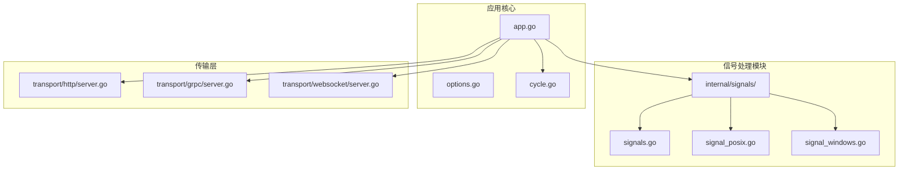
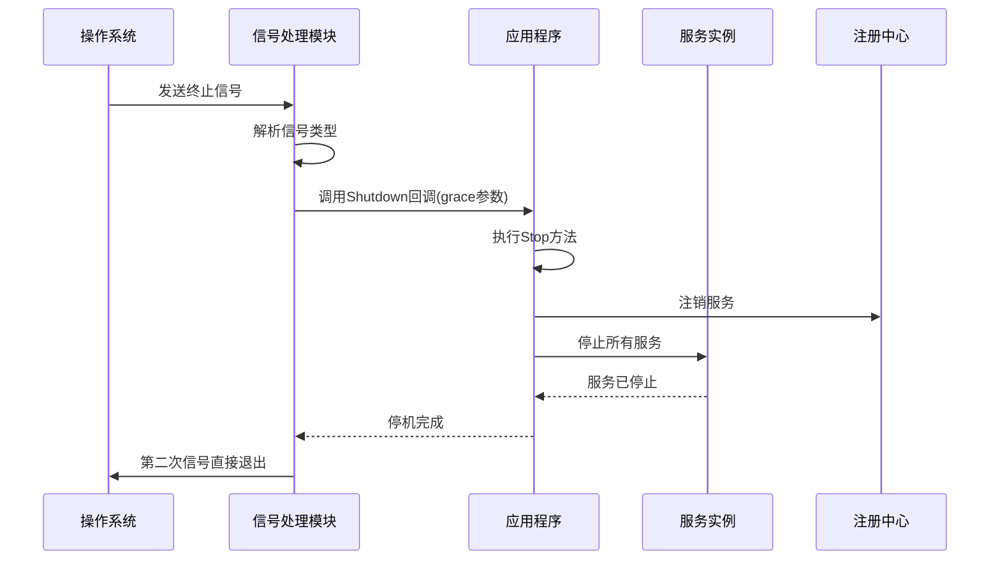
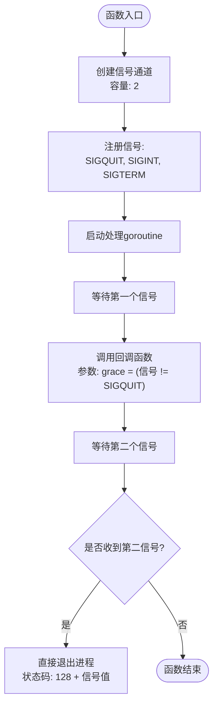
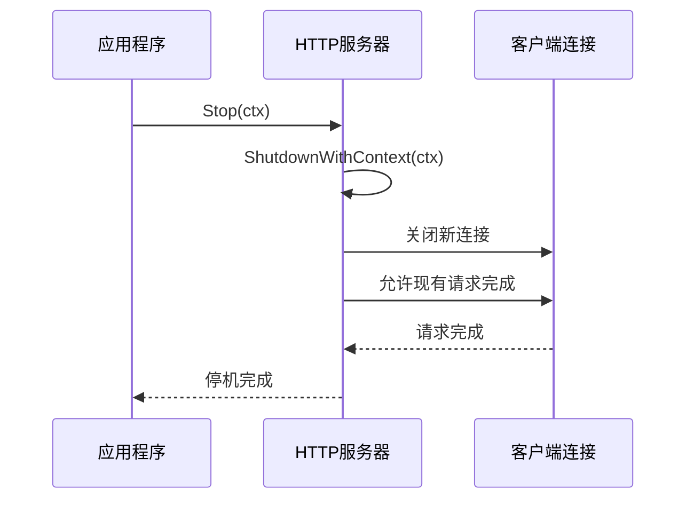
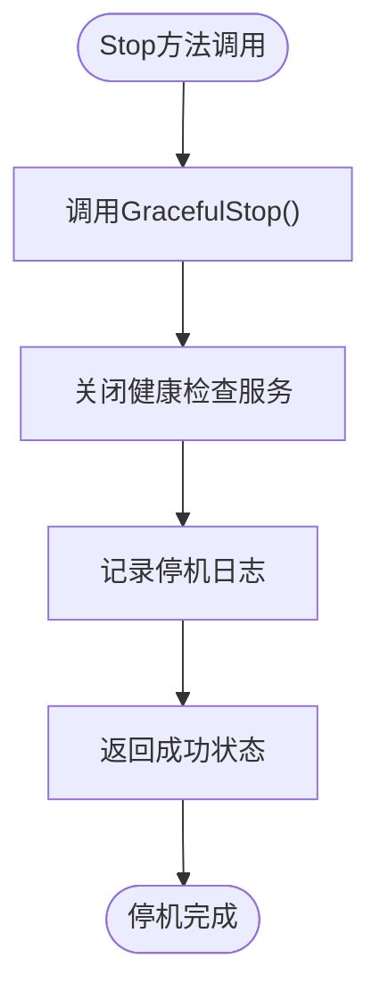
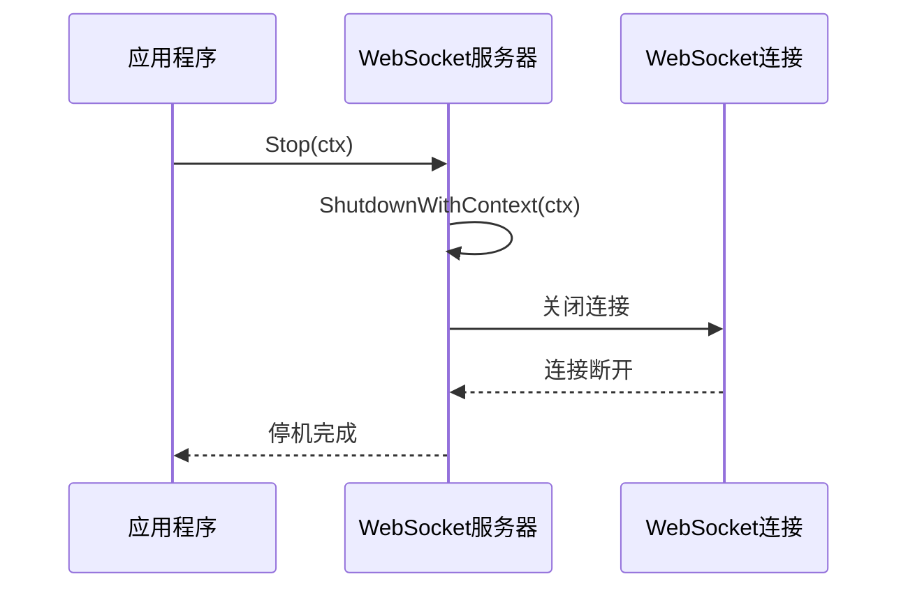
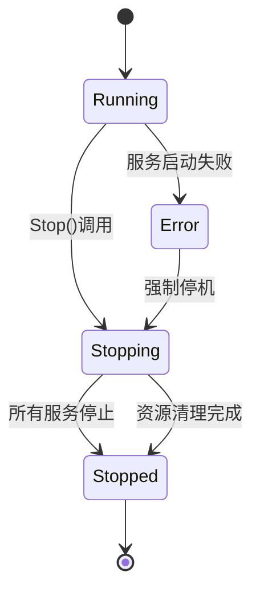
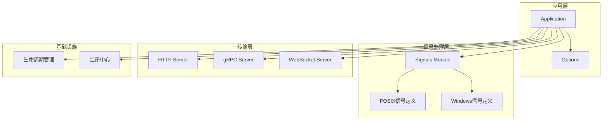

# 信号处理机制

<cite>
**本文档引用的文件**
- [signals.go](file://internal/signals/signals.go)
- [signal_posix.go](file://internal/signals/signal_posix.go)
- [signal_windows.go](file://internal/signals/signal_windows.go)
- [app.go](file://app.go)
- [options.go](file://options.go)
- [cycle.go](file://internal/cycle/cycle.go)
- [server.go](file://transport/http/server.go)
- [server.go](file://transport/grpc/server.go)
- [server.go](file://transport/websocket/server.go)
</cite>

## 目录
1. [简介](#简介)
2. [项目结构](#项目结构)
3. [核心组件](#核心组件)
4. [架构概览](#架构概览)
5. [详细组件分析](#详细组件分析)
6. [依赖关系分析](#依赖关系分析)
7. [性能考虑](#性能考虑)
8. [故障排除指南](#故障排除指南)
9. [结论](#结论)
10. [附录](#附录)

## 简介

Go Fox框架的信号处理机制是其优雅停机能力的核心组成部分。该机制通过捕获操作系统信号（如SIGTERM、SIGINT、SIGQUIT）来实现应用程序的平滑关闭，确保在接收到终止信号时能够正确地清理资源、注销服务、停止监听器并释放所有系统资源。

本文档深入解析了waitSignals()方法如何实现优雅的进程终止，详细说明了Shutdown回调函数的工作原理，以及信号处理与应用生命周期之间的关系。同时提供了实际应用场景和配置示例，包括容器环境下的最佳实践和长时间运行任务的中断处理策略。

## 项目结构

Go Fox的信号处理机制主要分布在以下模块中：



**图表来源**
- [signals.go](file://internal/signals/signals.go#L1-L46)
- [app.go](file://app.go#L1-L312)

**章节来源**
- [signals.go](file://internal/signals/signals.go#L1-L46)
- [app.go](file://app.go#L1-L312)

## 核心组件

### 信号处理核心

Go Fox的信号处理机制由三个关键组件构成：

1. **平台特定的信号定义**：根据操作系统类型定义不同的信号集
2. **统一的信号处理接口**：提供跨平台的信号处理能力
3. **优雅停机回调机制**：实现可配置的停机逻辑

### 信号类型支持

系统支持以下信号类型：
- **SIGQUIT**：强制退出信号
- **SIGINT**：中断信号（Ctrl+C）
- **SIGTERM**：终止信号（POSIX标准）

**章节来源**
- [signal_posix.go](file://internal/signals/signal_posix.go#L35-L35)
- [signal_windows.go](file://internal/signals/signal_windows.go#L35-L35)

## 架构概览

Go Fox的信号处理架构采用分层设计，实现了平台无关的信号处理能力：



**图表来源**
- [signals.go](file://internal/signals/signals.go#L33-L45)
- [app.go](file://app.go#L254-L282)

## 详细组件分析

### 信号处理模块

#### Shutdown函数实现

Shutdown函数是信号处理的核心实现，负责：

1. **信号通道创建**：创建容量为2的信号通道
2. **信号注册**：注册支持的信号类型
3. **异步处理**：启动goroutine处理信号
4. **双重信号处理**：支持连续信号的快速退出



**图表来源**
- [signals.go](file://internal/signals/signals.go#L33-L45)

#### 平台特定信号定义

不同操作系统的信号支持存在差异：

| 操作系统 | 支持的信号 | 特殊说明 |
|---------|-----------|----------|
| POSIX系统 | SIGQUIT, SIGINT, SIGTERM | 完整支持所有信号 |
| Windows | SIGQUIT, SIGINT | 不支持SIGTERM |

**章节来源**
- [signal_posix.go](file://internal/signals/signal_posix.go#L35-L35)
- [signal_windows.go](file://internal/signals/signal_windows.go#L35-L35)

### 应用程序集成

#### waitSignals方法

waitSignals方法是应用程序与信号处理模块的桥梁：

```mermaid
classDiagram
class Application {
+waitSignals() void
+Stop() error
+Run() error
-startup() error
-startServers() error
}
class SignalsModule {
+Shutdown(stop func(grace bool)) void
}
class Cycle {
+Run(fn func() error) void
+Wait() chan error
+Done() chan struct{}
+Close() void
}
Application --> SignalsModule : "调用"
Application --> Cycle : "使用"
SignalsModule --> Application : "回调"
```

**图表来源**
- [app.go](file://app.go#L177-L182)
- [signals.go](file://internal/signals/signals.go#L33-L45)

#### 优雅停机流程

应用程序的优雅停机遵循严格的生命周期顺序：

1. **信号接收**：waitSignals()启动信号监听
2. **回调触发**：Shutdown回调被调用
3. **Stop方法执行**：应用程序开始停机流程
4. **服务注销**：从注册中心移除服务
5. **服务停止**：逐个停止各传输层服务
6. **资源清理**：释放所有系统资源

**章节来源**
- [app.go](file://app.go#L177-L182)
- [app.go](file://app.go#L254-L282)

### 传输层服务停机

#### HTTP服务器停机

HTTP服务器通过`ShutdownWithContext`实现优雅停机：



**图表来源**
- [server.go](file://transport/http/server.go#L231-L234)

#### gRPC服务器停机

gRPC服务器采用`GracefulStop()`实现优雅停机：



**图表来源**
- [server.go](file://transport/grpc/server.go#L149-L155)

#### WebSocket服务器停机

WebSocket服务器通过`ShutdownWithContext`实现优雅停机：



**图表来源**
- [server.go](file://transport/websocket/server.go#L145-L149)

### 生命周期管理

#### Cycle组件

Cycle组件负责管理应用程序的生命周期：



**图表来源**
- [cycle.go](file://internal/cycle/cycle.go#L32-L98)

**章节来源**
- [cycle.go](file://internal/cycle/cycle.go#L53-L98)

## 依赖关系分析

信号处理机制的依赖关系体现了清晰的分层架构：



**图表来源**
- [app.go](file://app.go#L37-L41)
- [signals.go](file://internal/signals/signals.go#L26-L30)

**章节来源**
- [app.go](file://app.go#L37-L41)
- [options.go](file://options.go#L54-L71)

## 性能考虑

### 信号处理性能

1. **非阻塞设计**：信号处理完全异步进行，不影响主业务逻辑
2. **最小化开销**：仅在进程启动时创建必要的通道和goroutine
3. **平台优化**：针对不同操作系统优化信号处理路径

### 停机性能

1. **并发停机**：多个服务可以并行停止，提高整体效率
2. **超时控制**：每个服务都有独立的停机超时时间
3. **资源回收**：及时释放内存、网络连接等系统资源

## 故障排除指南

### 常见问题及解决方案

#### 信号未被捕获

**问题描述**：应用程序无法响应终止信号

**可能原因**：
1. 信号处理模块未正确初始化
2. 应用程序在其他地方覆盖了信号处理
3. 权限不足导致信号无法发送

**解决方案**：
1. 确认waitSignals()方法被正确调用
2. 检查是否有第三方库设置了自定义信号处理
3. 验证进程权限设置

#### 停机超时

**问题描述**：应用程序停机时间过长

**可能原因**：
1. 服务中有长时间运行的任务
2. 网络连接无法正常关闭
3. 注册中心响应缓慢

**解决方案**：
1. 为长时间运行的任务添加超时机制
2. 检查网络连接的优雅关闭实现
3. 调整停机超时配置

#### 资源泄漏

**问题描述**：停机后仍有资源未释放

**可能原因**：
1. 服务停止逻辑不完整
2. 上下文未正确传递
3. 通道未正确关闭

**解决方案**：
1. 确保所有服务都实现了Stop方法
2. 检查上下文的传播链路
3. 验证通道的生命周期管理

**章节来源**
- [app.go](file://app.go#L254-L282)
- [options.go](file://options.go#L154-L159)

## 结论

Go Fox的信号处理机制通过精心设计的架构实现了可靠的优雅停机能力。该机制具有以下优势：

1. **平台兼容性**：通过条件编译支持多种操作系统
2. **优雅停机**：确保应用程序能够正确清理资源
3. **可扩展性**：支持多种传输协议的服务停机
4. **可靠性**：提供双重信号保护机制

通过合理配置和使用，开发者可以构建出能够在各种环境下稳定运行的应用程序，特别是在容器化部署场景中表现尤为出色。

## 附录

### 实际应用场景

#### 容器环境最佳实践

在容器环境中，建议：

1. **使用SIGTERM**：容器停止时发送SIGTERM信号
2. **配置合理的超时**：根据应用复杂度调整停机超时时间
3. **监控停机过程**：确保应用程序能够正确响应信号

#### 长时间运行任务处理

对于需要长时间运行的任务：

1. **定期检查上下文**：在循环中检查context是否已取消
2. **实现超时机制**：为任务设置合理的超时时间
3. **优雅中断**：允许任务在适当的位置优雅地结束

#### 配置示例

应用程序可以通过以下方式配置信号处理：

```go
// 设置停机超时时间
app := fox.New(
    fox.StopTimeout(5*time.Second),
    fox.Hooks(fox.BeforeStop, func(ctx context.Context) {
        // 停机前的清理工作
    }),
)
```

这种配置方式确保了应用程序能够在接收到信号时正确执行预定义的清理逻辑，从而实现优雅的停机过程。