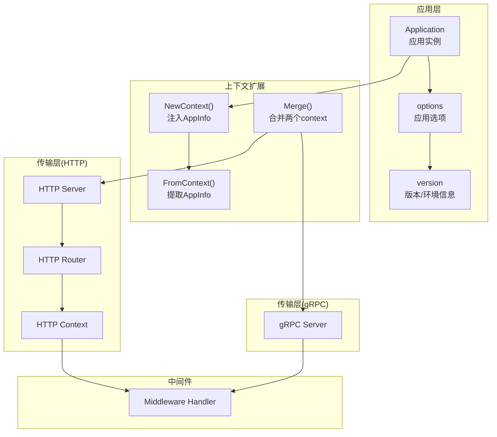
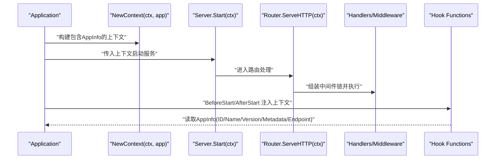
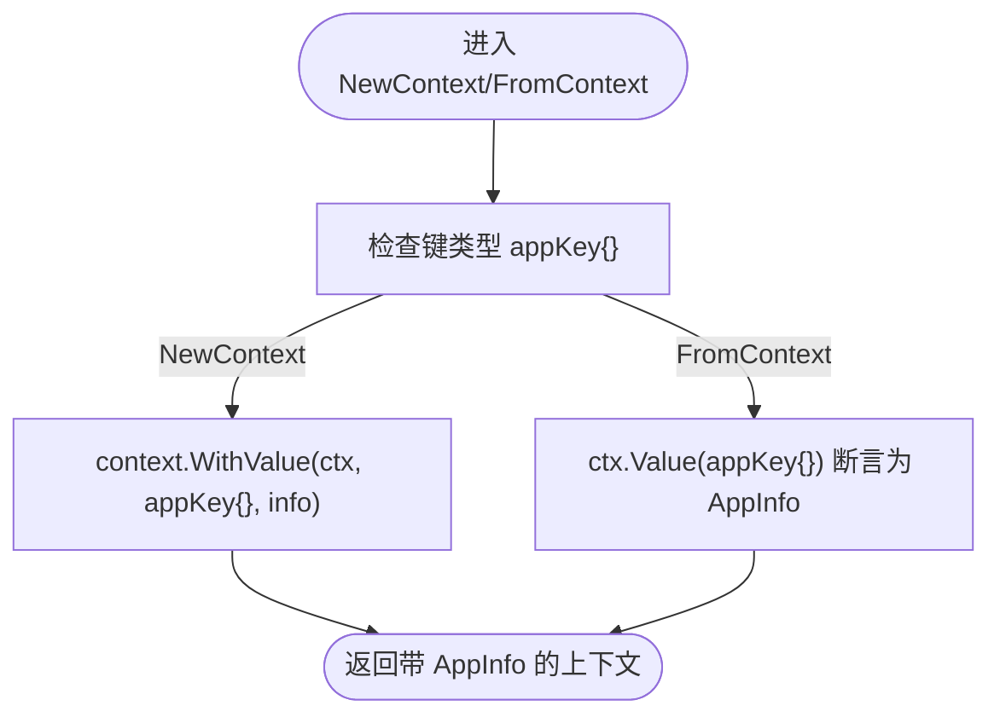
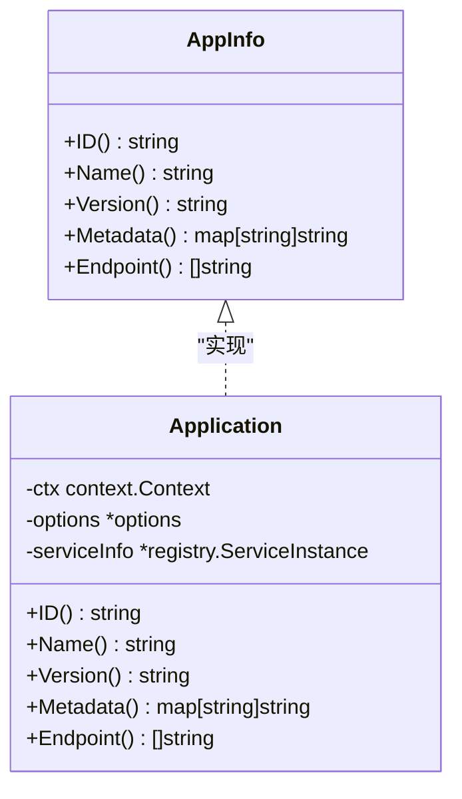
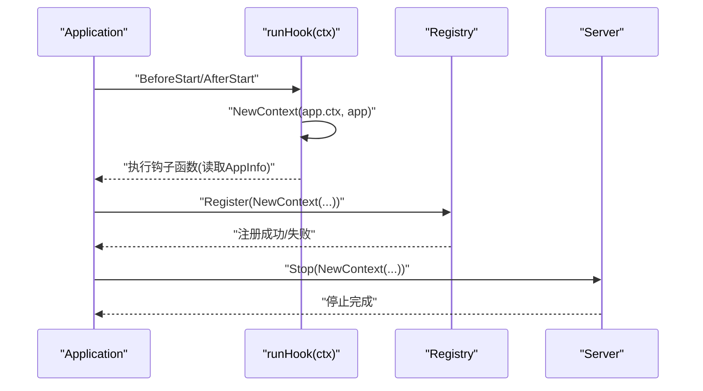
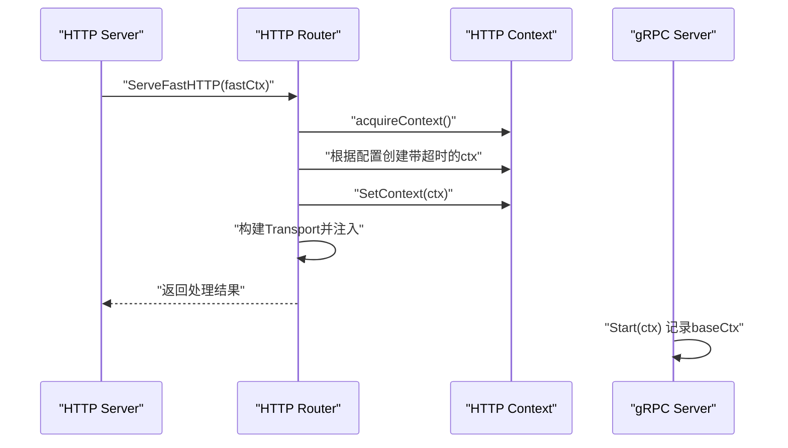
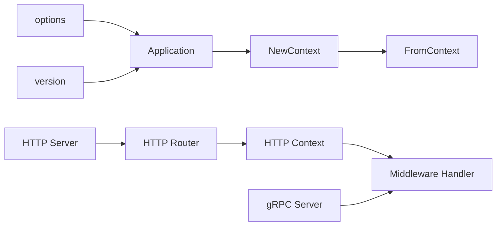

# 应用上下文管理

<cite>
**本文引用的文件**
- [app.go](file://app.go)
- [options.go](file://options.go)
- [version.go](file://version.go)
- [internal/context/context.go](file://internal/context/context.go)
- [transport/http/context.go](file://transport/http/context.go)
- [transport/http/router.go](file://transport/http/router.go)
- [transport/http/server.go](file://transport/http/server.go)
- [transport/grpc/server.go](file://transport/grpc/server.go)
- [middleware/middleware.go](file://middleware/middleware.go)
</cite>

## 目录
1. [简介](#简介)
2. [项目结构](#项目结构)
3. [核心组件](#核心组件)
4. [架构总览](#架构总览)
5. [组件详解](#组件详解)
6. [依赖关系分析](#依赖关系分析)
7. [性能考量](#性能考量)
8. [故障排查指南](#故障排查指南)
9. [结论](#结论)
10. [附录：使用示例与最佳实践](#附录使用示例与最佳实践)

## 简介
本文件系统性阐述 Go Fox 的“应用上下文管理”设计与实现，重点围绕以下主题：
- NewContext() 与 FromContext() 的设计目的、内部机制与使用方法
- 如何通过上下文在应用生命周期、中间件、服务注册与钩子函数之间传递应用信息
- AppInfo 接口的职责与方法（ID、Name、Version、Metadata、Endpoint）的实现与使用场景
- 上下文与标准库 context 包的关系与扩展方式
- 实际业务中如何在各层获取并使用应用信息

## 项目结构
围绕“应用上下文管理”，关键代码分布在如下模块：
- 应用入口与上下文注入：app.go、options.go、version.go
- 标准库 context 扩展：internal/context/context.go
- HTTP 传输层上下文桥接：transport/http/context.go、transport/http/router.go、transport/http/server.go
- gRPC 传输层上下文桥接：transport/grpc/server.go
- 中间件处理链：middleware/middleware.go



**图表来源**
- [app.go](file://app.go#L300-L311)
- [options.go](file://options.go#L54-L88)
- [version.go](file://version.go#L41-L105)
- [internal/context/context.go](file://internal/context/context.go#L46-L139)
- [transport/http/server.go](file://transport/http/server.go#L212-L234)
- [transport/http/router.go](file://transport/http/router.go#L106-L127)
- [transport/http/context.go](file://transport/http/context.go#L127-L135)
- [transport/grpc/server.go](file://transport/grpc/server.go#L139-L154)
- [middleware/middleware.go](file://middleware/middleware.go#L28-L32)

**章节来源**
- [app.go](file://app.go#L300-L311)
- [options.go](file://options.go#L54-L88)
- [version.go](file://version.go#L41-L105)
- [internal/context/context.go](file://internal/context/context.go#L46-L139)
- [transport/http/server.go](file://transport/http/server.go#L212-L234)
- [transport/http/router.go](file://transport/http/router.go#L106-L127)
- [transport/http/context.go](file://transport/http/context.go#L127-L135)
- [transport/grpc/server.go](file://transport/grpc/server.go#L139-L154)
- [middleware/middleware.go](file://middleware/middleware.go#L28-L32)

## 核心组件
- AppInfo 接口：统一抽象应用元信息，便于在任意层级通过上下文安全获取。
- NewContext()/FromContext()：在标准库 context 的基础上，以键值对形式注入/提取 AppInfo。
- 应用生命周期钩子：在启动/停止前后，将 AppInfo 注入上下文，供钩子函数使用。
- 传输层桥接：HTTP 与 gRPC 在各自请求上下文中维护标准库 context，并可与 AppInfo 上下文互通。

**章节来源**
- [app.go](file://app.go#L43-L50)
- [app.go](file://app.go#L300-L311)
- [options.go](file://options.go#L54-L88)

## 架构总览
下图展示应用上下文在启动、路由处理、中间件与服务生命周期中的流转路径。



**图表来源**
- [app.go](file://app.go#L194-L221)
- [app.go](file://app.go#L290-L298)
- [transport/http/server.go](file://transport/http/server.go#L212-L234)
- [transport/http/router.go](file://transport/http/router.go#L106-L127)
- [middleware/middleware.go](file://middleware/middleware.go#L28-L32)

## 组件详解

### 1) NewContext() 与 FromContext() 设计与使用
- 设计目的
  - 将 AppInfo 作为“应用级元信息”注入到标准库 context 中，贯穿应用生命周期与请求处理链路。
  - 通过 FromContext() 提供统一的读取入口，避免直接依赖具体实现或全局变量。
- 内部机制
  - 使用自定义键类型 appKey{} 作为唯一标识，避免与其他库的 Value 冲突。
  - NewContext() 通过 context.WithValue 注入 AppInfo；FromContext() 通过键提取并断言为 AppInfo。
- 使用场景
  - 应用启动/停止钩子：在 runHook 中通过 NewContext(app.ctx, app) 注入 AppInfo，供钩子函数读取。
  - 服务注册：在注册/注销时，使用带 AppInfo 的上下文进行注册中心交互。
  - 业务处理：在中间件或处理器中通过 FromContext() 获取应用信息，用于日志、指标、鉴权等。



**图表来源**
- [app.go](file://app.go#L300-L311)

**章节来源**
- [app.go](file://app.go#L300-L311)

### 2) AppInfo 接口与实现
- 接口方法
  - ID(): string —— 应用唯一标识
  - Name(): string —— 应用名称
  - Version(): string —— 应用版本
  - Metadata(): map[string]string —— 元数据（如 region、zone 等）
  - Endpoint(): []string —— 服务暴露的网络端点列表
- 实现与来源
  - Application 结构体实现了 AppInfo 接口，其字段来自构建的服务实例信息（buildServerInfo）。
  - 版本与环境信息由 version.go 提供默认值，可通过选项覆盖。
- 使用场景
  - 注册中心：注册服务实例时携带 Endpoint 与 Metadata。
  - 钩子函数：在启动/停止阶段输出应用信息或进行资源清理。
  - 业务逻辑：在中间件或处理器中读取应用信息，用于日志标记、限流策略、灰度发布等。



**图表来源**
- [app.go](file://app.go#L43-L50)
- [app.go](file://app.go#L80-L103)
- [app.go](file://app.go#L224-L251)
- [version.go](file://version.go#L41-L105)

**章节来源**
- [app.go](file://app.go#L43-L50)
- [app.go](file://app.go#L80-L103)
- [app.go](file://app.go#L224-L251)
- [version.go](file://version.go#L41-L105)

### 3) 上下文在中间件、服务注册与钩子中的传递机制
- 中间件
  - HTTP 路由器在每次请求进入时，若未绑定 Transport 上下文，则会基于当前上下文创建并注入。
  - 中间件链通过匹配器选择性地挂载，处理过程中可继续使用标准库 context 的取消/超时能力。
- 服务注册
  - 启动阶段：构建服务实例信息后，使用 NewContext(app.ctx, app) 注入 AppInfo，随后注册到注册中心。
  - 停止阶段：同样以带 AppInfo 的上下文执行注销与关闭流程。
- 钩子函数
  - runHook 在 BeforeStart/AfterStart/BeforeStop/AfterStop 四个阶段分别注入上下文，钩子函数可从中读取应用信息。



**图表来源**
- [app.go](file://app.go#L194-L221)
- [app.go](file://app.go#L254-L282)
- [app.go](file://app.go#L289-L298)

**章节来源**
- [app.go](file://app.go#L194-L221)
- [app.go](file://app.go#L254-L282)
- [app.go](file://app.go#L289-L298)

### 4) 上下文与标准库 context 的关系与扩展
- 关系
  - NewContext()/FromContext() 是对 context.WithValue()/ctx.Value() 的封装，确保类型安全与键隔离。
  - HTTP 与 gRPC 传输层均基于标准库 context 的 Done()/Err()/Deadline()/WithValue() 能力。
- 扩展
  - internal/context/context.go 提供了 Merge()，将两个父上下文合并为一个新上下文，任一父上下文取消或报错时，合并上下文也会被取消/报错。
  - HTTP Context 对标准库 context 进行二次封装，支持 WithValue/Value/Done/Err/Deadline 等代理。

```mermaid
classDiagram
class StdContext {
+Done() <-chan struct{}
+Err() error
+Deadline() (time.Time, bool)
+Value(key) any
}
class HTTP_Context {
+Context() context.Context
+SetContext(ctx)
+WithValue(key, value)
+Value(key) any
+Done() <-chan struct{}
+Err() error
+Deadline() (time.Time, bool)
}
class MergeCtx {
+Done() <-chan struct{}
+Err() error
+Deadline() (time.Time, bool)
+Value(key) any
+cancel()
}
HTTP_Context --> StdContext : "代理"
MergeCtx --> StdContext : "组合"
```

**图表来源**
- [internal/context/context.go](file://internal/context/context.go#L46-L139)
- [transport/http/context.go](file://transport/http/context.go#L127-L135)
- [transport/http/context.go](file://transport/http/context.go#L447-L476)

**章节来源**
- [internal/context/context.go](file://internal/context/context.go#L46-L139)
- [transport/http/context.go](file://transport/http/context.go#L127-L135)
- [transport/http/context.go](file://transport/http/context.go#L447-L476)

### 5) 传输层上下文桥接（HTTP 与 gRPC）
- HTTP
  - Server 在启动时接收外部上下文；路由处理时根据配置创建带超时的子上下文；最终将标准库上下文注入到请求上下文中。
  - Router 在首次进入时检测是否已有 Transport 上下文，若无则创建并注入。
- gRPC
  - Server 在 Start 时记录 baseCtx 为传入上下文，便于后续优雅停机与健康检查。



**图表来源**
- [transport/http/server.go](file://transport/http/server.go#L212-L234)
- [transport/http/router.go](file://transport/http/router.go#L131-L151)
- [transport/http/router.go](file://transport/http/router.go#L106-L127)
- [transport/grpc/server.go](file://transport/grpc/server.go#L139-L154)

**章节来源**
- [transport/http/server.go](file://transport/http/server.go#L212-L234)
- [transport/http/router.go](file://transport/http/router.go#L131-L151)
- [transport/http/router.go](file://transport/http/router.go#L106-L127)
- [transport/grpc/server.go](file://transport/grpc/server.go#L139-L154)

## 依赖关系分析
- 应用层依赖
  - Application 依赖 options 与 version 提供默认值与配置项。
  - 钩子函数依赖 NewContext 注入的 AppInfo。
- 传输层依赖
  - HTTP Server/Router/Context 依赖标准库 context 并与 AppInfo 上下文互通。
  - gRPC Server 依赖标准库 context 并在 Start 时保存 baseCtx。
- 中间件依赖
  - 中间件以 Handler 形式工作，接收标准库 context 与请求对象，可在其中读取 AppInfo。



**图表来源**
- [options.go](file://options.go#L54-L88)
- [app.go](file://app.go#L300-L311)
- [transport/http/server.go](file://transport/http/server.go#L212-L234)
- [transport/http/router.go](file://transport/http/router.go#L106-L127)
- [transport/http/context.go](file://transport/http/context.go#L127-L135)
- [middleware/middleware.go](file://middleware/middleware.go#L28-L32)

**章节来源**
- [options.go](file://options.go#L54-L88)
- [app.go](file://app.go#L300-L311)
- [transport/http/server.go](file://transport/http/server.go#L212-L234)
- [transport/http/router.go](file://transport/http/router.go#L106-L127)
- [transport/http/context.go](file://transport/http/context.go#L127-L135)
- [middleware/middleware.go](file://middleware/middleware.go#L28-L32)

## 性能考量
- 上下文注入/提取为 O(1) 操作，开销极低。
- HTTP Context 使用对象池减少分配，建议在高并发场景下保持复用。
- Merge() 仅在需要合并多个父上下文时使用，避免不必要的额外 goroutine 与通道操作。
- 钩子与注册流程中尽量避免阻塞，必要时使用带超时的上下文。

## 故障排查指南
- 无法从上下文读取 AppInfo
  - 确认是否在启动/钩子/注册前调用了 NewContext(app.ctx, app)。
  - 检查键类型是否一致（appKey{}），避免误用其他键。
- 注册/注销失败
  - 检查 stopCtx 是否正确传入带 AppInfo 的上下文。
  - 查看注册中心日志与超时配置。
- 中间件未生效
  - 确认路由模板与匹配器是否正确挂载。
  - 检查中间件链顺序与 Handler 返回值。

**章节来源**
- [app.go](file://app.go#L254-L282)
- [app.go](file://app.go#L289-L298)
- [transport/http/router.go](file://transport/http/router.go#L106-L127)

## 结论
Go Fox 通过 NewContext()/FromContext() 将 AppInfo 以类型安全的方式注入/提取到标准库 context 中，配合应用生命周期钩子与传输层桥接，实现了跨服务、跨中间件的一致性上下文传递。结合 internal/context/context.go 的 Merge() 能力，可进一步满足复杂场景下的上下文组合需求。在业务开发中，建议遵循“在入口处注入、在处理链中透传、在钩子与注册时使用”的原则，确保上下文信息的可用性与一致性。

## 附录：使用示例与最佳实践
- 在钩子函数中读取应用信息
  - 在 runHook 中通过 NewContext(app.ctx, app) 注入上下文，钩子函数中使用 FromContext() 获取 AppInfo。
  - 参考路径：[app.go](file://app.go#L289-L298)，[app.go](file://app.go#L300-L311)
- 在服务注册/注销中使用上下文
  - 启动阶段：NewContext(app.ctx, app) 传入注册中心注册。
  - 停止阶段：NewContext(app.ctx, app) 传入注销流程。
  - 参考路径：[app.go](file://app.go#L194-L221)，[app.go](file://app.go#L254-L282)
- 在 HTTP 中间件中获取应用信息
  - 路由器在首次进入时注入 Transport 上下文；中间件链可继续使用标准库上下文。
  - 参考路径：[transport/http/router.go](file://transport/http/router.go#L106-L127)，[transport/http/context.go](file://transport/http/context.go#L127-L135)
- 在 gRPC 中使用上下文
  - gRPC Server 在 Start 时保存 baseCtx，可用于优雅停机与健康检查。
  - 参考路径：[transport/grpc/server.go](file://transport/grpc/server.go#L139-L154)
- 合并多个父上下文
  - 使用 internal/context/context.go 的 Merge() 将多个父上下文合并为一个新上下文。
  - 参考路径：[internal/context/context.go](file://internal/context/context.go#L46-L139)