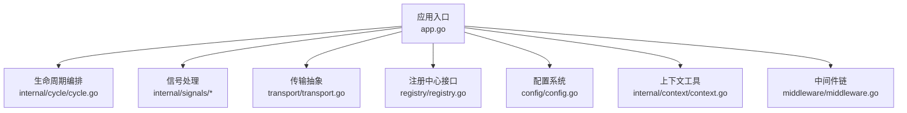
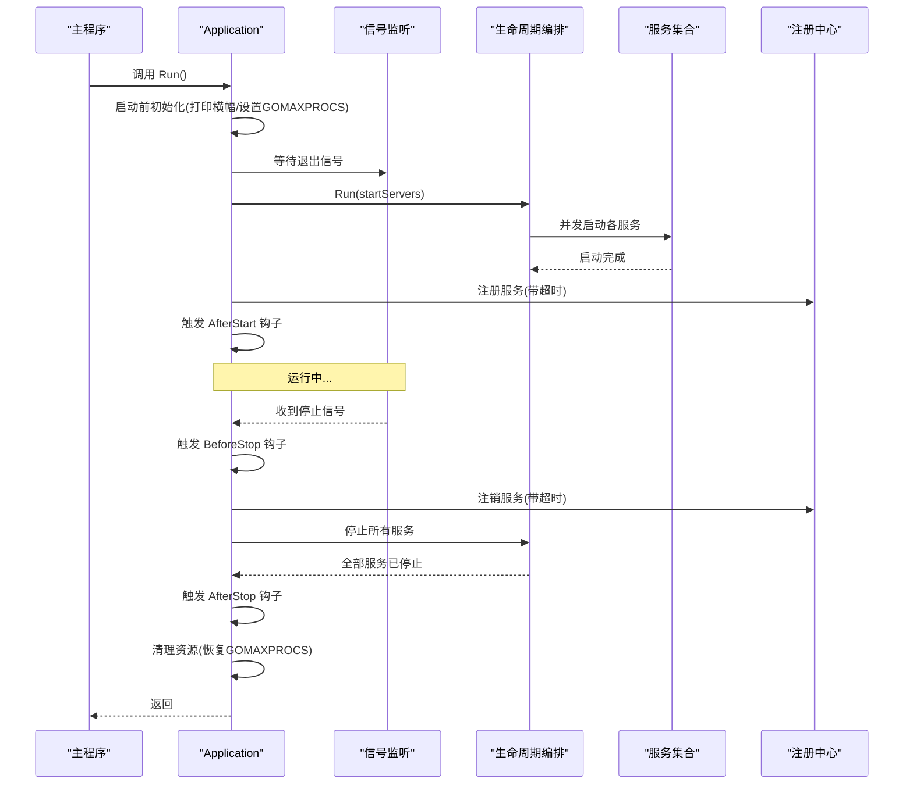
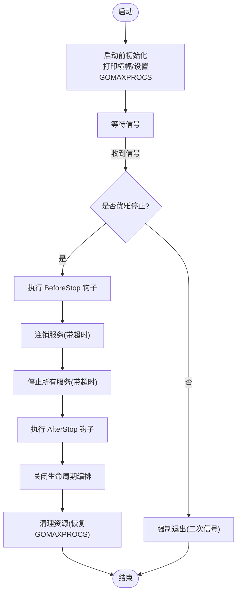
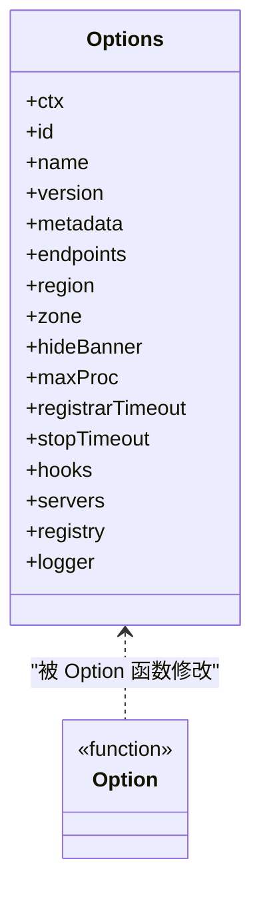
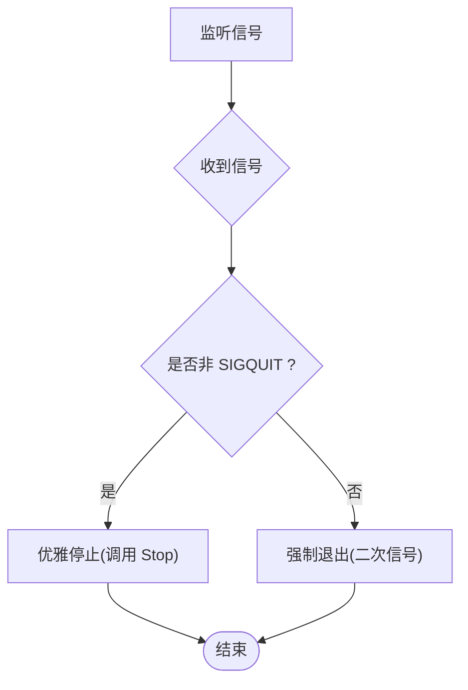
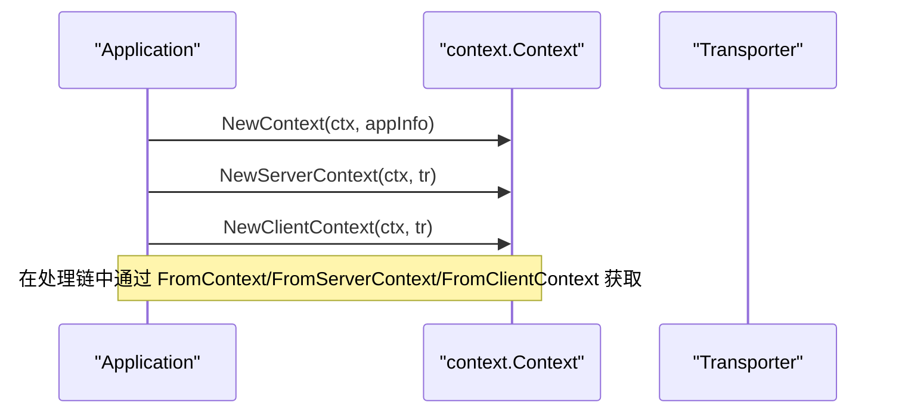
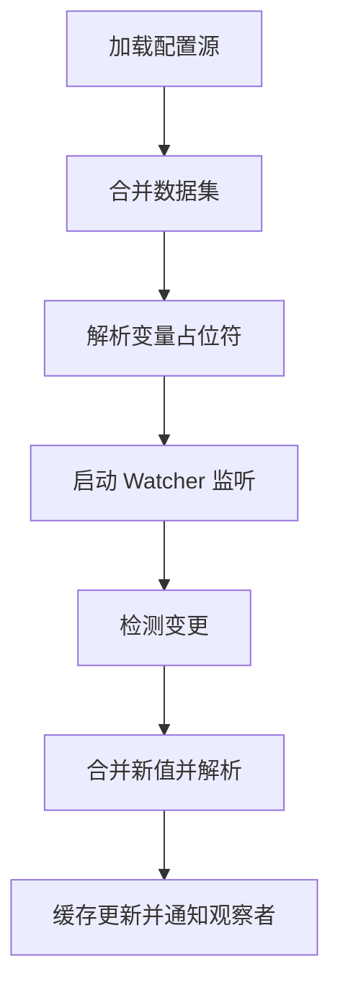
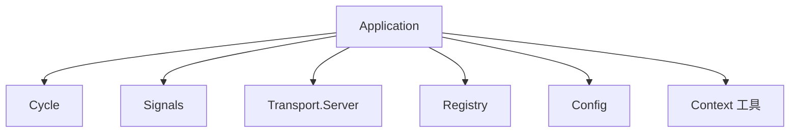

# 应用框架

<cite>
**本文引用的文件**
- [app.go](file://app.go)
- [options.go](file://options.go)
- [version.go](file://version.go)
- [internal/cycle/cycle.go](file://internal/cycle/cycle.go)
- [internal/signals/signals.go](file://internal/signals/signals.go)
- [internal/signals/signal_posix.go](file://internal/signals/signal_posix.go)
- [internal/signals/signal_windows.go](file://internal/signals/signal_windows.go)
- [transport/transport.go](file://transport/transport.go)
- [registry/registry.go](file://registry/registry.go)
- [config/config.go](file://config/config.go)
- [internal/context/context.go](file://internal/context/context.go)
- [middleware/middleware.go](file://middleware/middleware.go)
</cite>

## 目录
1. [简介](#简介)
2. [项目结构](#项目结构)
3. [核心组件](#核心组件)
4. [架构总览](#架构总览)
5. [详细组件分析](#详细组件分析)
6. [依赖关系分析](#依赖关系分析)
7. [性能考量](#性能考量)
8. [故障排查指南](#故障排查指南)
9. [结论](#结论)
10. [附录：配置与使用示例路径](#附录配置与使用示例路径)

## 简介
本文件面向Go Fox应用框架，系统性阐述应用生命周期管理（启动、运行、优雅关闭）、配置选项系统、信号处理机制、应用上下文管理，并提供可直接定位到源码的示例路径，帮助读者快速掌握框架设计与最佳实践。

## 项目结构
- 核心入口与生命周期：app.go 提供 Application 类型及 Run/Stop 流程；options.go 定义配置项与选项构造器；version.go 提供默认应用元数据。
- 生命周期与并发控制：internal/cycle/cycle.go 提供统一的并发任务编排与退出通道。
- 信号处理：internal/signals/* 提供跨平台信号监听与二次信号强制退出策略。
- 传输与服务抽象：transport/transport.go 定义 Server 接口与上下文注入工具。
- 注册与发现：registry/registry.go 定义注册中心接口与服务实例模型。
- 配置系统：config/config.go 提供多源合并、动态监听与解析能力。
- 上下文工具：internal/context/context.go 提供上下文合并与取消语义。
- 中间件：middleware/middleware.go 定义通用中间件链式组合模式。

**图表来源**
- [app.go](file://app.go#L158-L175)
- [internal/cycle/cycle.go](file://internal/cycle/cycle.go#L53-L64)
- [internal/signals/signals.go](file://internal/signals/signals.go#L32-L45)
- [transport/transport.go](file://transport/transport.go#L44-L48)
- [registry/registry.go](file://registry/registry.go#L17-L37)
- [config/config.go](file://config/config.go#L70-L86)
- [internal/context/context.go](file://internal/context/context.go#L46-L62)
- [middleware/middleware.go](file://middleware/middleware.go#L54-L66)

**章节来源**
- [app.go](file://app.go#L66-L78)
- [options.go](file://options.go#L74-L89)
- [version.go](file://version.go#L66-L82)

## 核心组件
- Application：封装应用上下文、配置、生命周期编排、信号监听、服务注册与钩子执行。
- options：集中管理应用配置，如上下文、ID/Name/Version、元数据、区域/可用区、日志、服务集合、注册中心、钩子、超时等。
- Cycle：并发任务运行器，负责 goroutine 启动、错误传播、完成通知与关闭。
- Signals：跨平台信号监听，支持优雅与强制两种停止方式。
- Transport：服务抽象接口与上下文注入工具，便于在请求链路中携带传输层信息。
- Registry：注册中心接口与服务实例模型，支持注册/更新/注销。
- Config：多源配置加载、合并、解析与热更新观察。
- Context 工具：上下文合并与取消，支持 deadline 与 value 继承。
- Middleware：中间件链式组合，便于在处理链上插入横切逻辑。

**章节来源**
- [app.go](file://app.go#L52-L63)
- [options.go](file://options.go#L53-L71)
- [internal/cycle/cycle.go](file://internal/cycle/cycle.go#L31-L51)
- [internal/signals/signals.go](file://internal/signals/signals.go#L32-L45)
- [transport/transport.go](file://transport/transport.go#L44-L86)
- [registry/registry.go](file://registry/registry.go#L17-L95)
- [config/config.go](file://config/config.go#L52-L68)
- [internal/context/context.go](file://internal/context/context.go#L33-L138)
- [middleware/middleware.go](file://middleware/middleware.go#L28-L66)

## 架构总览
下图展示了应用启动、运行、信号触发与优雅关闭的关键交互：

**图表来源**
- [app.go](file://app.go#L158-L175)
- [app.go](file://app.go#L177-L182)
- [app.go](file://app.go#L184-L221)
- [app.go](file://app.go#L253-L282)
- [internal/cycle/cycle.go](file://internal/cycle/cycle.go#L53-L64)
- [internal/signals/signals.go](file://internal/signals/signals.go#L32-L45)
- [registry/registry.go](file://registry/registry.go#L17-L37)

## 详细组件分析

### 应用生命周期管理
- 启动阶段
  - 启动前初始化：打印横幅、设置 GOMAXPROCS（显式或自动）。
  - 启动服务：构建服务实例信息、并发启动各服务、注册到注册中心、触发 AfterStart 钩子。
- 运行阶段
  - 等待信号：监听 SIGQUIT/Interrupt/SIGTERM（POSIX）或 SIGQUIT/Interrupt（Windows），区分优雅与强制停止。
- 优雅关闭
  - BeforeStop 钩子 → 注销服务（带超时）→ 停止所有服务（带超时）→ AfterStop 钩子 → 关闭生命周期编排 → 清理资源。

**图表来源**
- [app.go](file://app.go#L105-L114)
- [app.go](file://app.go#L134-L146)
- [app.go](file://app.go#L177-L182)
- [app.go](file://app.go#L253-L282)
- [internal/signals/signals.go](file://internal/signals/signals.go#L32-L45)

**章节来源**
- [app.go](file://app.go#L105-L114)
- [app.go](file://app.go#L134-L146)
- [app.go](file://app.go#L158-L175)
- [app.go](file://app.go#L177-L182)
- [app.go](file://app.go#L184-L221)
- [app.go](file://app.go#L253-L282)
- [internal/signals/signals.go](file://internal/signals/signals.go#L32-L45)
- [internal/signals/signal_posix.go](file://internal/signals/signal_posix.go#L35-L35)
- [internal/signals/signal_windows.go](file://internal/signals/signal_windows.go#L35-L35)

### 配置选项系统
- 默认配置与构造
  - defaultOptions 提供默认值（上下文、ID/Name/Version/Region/Zone、横幅隐藏、超时、钩子、服务集合、日志）。
  - 通过一系列 Option 函数（Context、Id、Name、Version、Metadata、Region、Zone、HideBanner、RegistrarTimeout、StopTimeout、Hooks、AddHooks、Registry、Server、Logger、MaxProc）对 options 进行定制。
- 使用要点
  - 优先使用 Option 函数进行配置，避免直接操作内部字段。
  - 通过 Server 选项注入多种传输层服务（HTTP/GRPC/WebSocket 等）。
  - 通过 Registry 选项接入注册中心，实现服务注册/注销。
  - 通过 Hooks/ AddHooks 注入启动/停止前后钩子，用于资源准备与清理。

**图表来源**
- [options.go](file://options.go#L53-L71)
- [options.go](file://options.go#L74-L89)

**章节来源**
- [options.go](file://options.go#L74-L89)
- [options.go](file://options.go#L91-L207)

### 信号处理机制
- 跨平台信号集
  - POSIX：SIGQUIT、Interrupt、SIGTERM
  - Windows：SIGQUIT、Interrupt
- 行为
  - 第一次信号：触发优雅停止（调用 Stop）
  - 第二次信号：直接退出进程（强制退出）

**图表来源**
- [internal/signals/signals.go](file://internal/signals/signals.go#L32-L45)
- [internal/signals/signal_posix.go](file://internal/signals/signal_posix.go#L35-L35)
- [internal/signals/signal_windows.go](file://internal/signals/signal_windows.go#L35-L35)

**章节来源**
- [internal/signals/signals.go](file://internal/signals/signals.go#L32-L45)
- [internal/signals/signal_posix.go](file://internal/signals/signal_posix.go#L35-L35)
- [internal/signals/signal_windows.go](file://internal/signals/signal_windows.go#L35-L35)

### 应用上下文管理
- 应用上下文注入
  - NewContext 将 AppInfo 注入到 context，便于在任意层级获取应用元数据。
  - FromContext 从 context 中提取 AppInfo。
- 传输上下文注入
  - NewServerContext/NewClientContext 将 Transporter 注入到请求上下文，便于在处理链中访问传输层信息。
- 上下文合并
  - internal/context/context.go 提供 Merge，将两个父上下文合并为一个，按最先完成者传播 Done 与 Err，支持取消。

**图表来源**
- [app.go](file://app.go#L302-L311)
- [transport/transport.go](file://transport/transport.go#L93-L113)
- [internal/context/context.go](file://internal/context/context.go#L46-L62)

**章节来源**
- [app.go](file://app.go#L302-L311)
- [transport/transport.go](file://transport/transport.go#L93-L113)
- [internal/context/context.go](file://internal/context/context.go#L46-L138)

### 配置系统
- 设计与实现
  - Config 接口：Load/Scan/Get/Watch/Close
  - 内部实现 config：多源加载、合并、解析、监听变更并通过观察者通知。
  - 支持多种编码格式（JSON/YAML/TOML/XML/Proto）自动初始化。
- 动态监听
  - Watch 持续监听配置源变化，合并、解析并触发观察者回调。
- 使用建议
  - 通过 Source/Watcher 实现配置源扩展（文件、Nacos 等）。
  - 使用 Scan 将配置映射到结构体，结合 Watch 实现热更新。

**图表来源**
- [config/config.go](file://config/config.go#L88-L115)
- [config/config.go](file://config/config.go#L136-L142)
- [config/config.go](file://config/config.go#L153-L185)

**章节来源**
- [config/config.go](file://config/config.go#L52-L68)
- [config/config.go](file://config/config.go#L70-L86)
- [config/config.go](file://config/config.go#L88-L115)
- [config/config.go](file://config/config.go#L136-L142)
- [config/config.go](file://config/config.go#L153-L185)

### 中间件与处理链
- 中间件链
  - Chain 将多个中间件按逆序组合，形成最终 Handler。
  - StructMiddleware 可将结构体方法包装为中间件。
- 使用场景
  - 在请求进入业务处理前统一做鉴权、限流、日志等横切逻辑。

**图表来源**
- [middleware/middleware.go](file://middleware/middleware.go#L54-L66)
- [middleware/middleware.go](file://middleware/middleware.go#L34-L52)

**章节来源**
- [middleware/middleware.go](file://middleware/middleware.go#L28-L66)

## 依赖关系分析
- Application 依赖
  - 生命周期编排：用于并发启动/停止服务与错误传播。
  - 信号监听：用于接收系统信号并触发优雅关闭。
  - 传输抽象：用于统一服务启动/停止接口。
  - 注册中心：用于服务注册/注销。
  - 配置系统：用于加载外部配置（通过具体实现注入）。
  - 上下文工具：用于上下文合并与取消。
- 循环依赖
  - 未见直接循环依赖；模块边界清晰（app → cycle/signals/transport/registry/config/context）。

**图表来源**
- [app.go](file://app.go#L184-L221)
- [internal/cycle/cycle.go](file://internal/cycle/cycle.go#L53-L64)
- [internal/signals/signals.go](file://internal/signals/signals.go#L32-L45)
- [transport/transport.go](file://transport/transport.go#L44-L48)
- [registry/registry.go](file://registry/registry.go#L17-L37)
- [config/config.go](file://config/config.go#L70-L86)
- [internal/context/context.go](file://internal/context/context.go#L46-L62)

**章节来源**
- [app.go](file://app.go#L184-L221)
- [internal/cycle/cycle.go](file://internal/cycle/cycle.go#L53-L64)
- [internal/signals/signals.go](file://internal/signals/signals.go#L32-L45)
- [transport/transport.go](file://transport/transport.go#L44-L48)
- [registry/registry.go](file://registry/registry.go#L17-L37)
- [config/config.go](file://config/config.go#L70-L86)
- [internal/context/context.go](file://internal/context/context.go#L46-L62)

## 性能考量
- 并发启动与关闭
  - 利用 Cycle 的并发模型并行启动/停止服务，缩短整体耗时。
- GOMAXPROCS 自适应
  - 未显式设置时，使用自动调整以适配容器/调度环境。
- 超时控制
  - 注册/注销与停止均采用带超时上下文，避免阻塞导致无法优雅退出。
- 编解码与配置解析
  - 多格式编解码初始化在导入时完成，减少运行时开销。

[本节为通用指导，无需特定文件来源]

## 故障排查指南
- 启动后无服务暴露
  - 检查是否正确注入 Server 选项，确认 Endpointer 实现返回有效端点。
  - 确认注册中心配置与网络连通性。
- 优雅关闭不生效
  - 确认信号是否正确发送（SIGQUIT/Interrupt/SIGTERM），Windows 下仅支持 SIGQUIT/Interrupt。
  - 检查钩子与服务 Stop 是否阻塞。
- 配置热更新无效
  - 确认 Watcher 正常工作且未报错；检查观察者是否正确注册。
- 资源清理异常
  - 确认 AfterStop 钩子中释放了必要资源；检查 Cycle 是否正常 Done/Close。

**章节来源**
- [app.go](file://app.go#L184-L221)
- [app.go](file://app.go#L253-L282)
- [internal/signals/signals.go](file://internal/signals/signals.go#L32-L45)
- [config/config.go](file://config/config.go#L153-L185)

## 结论
Go Fox 应用框架通过清晰的生命周期管理、跨平台信号处理、可插拔的服务抽象与注册中心集成、以及灵活的配置与上下文工具，提供了稳定可靠的微服务启动与关闭体验。遵循本文的最佳实践与示例路径，可快速搭建健壮的应用系统。

[本节为总结，无需特定文件来源]

## 附录：配置与使用示例路径
- 应用启动与关闭
  - 启动流程：[Run](file://app.go#L158-L175)
  - 优雅关闭：[Stop](file://app.go#L253-L282)
- 配置选项
  - 默认配置：[defaultOptions](file://options.go#L74-L89)
  - 选项构造器：[Context/Id/Name/Version/Metadata/Region/Zone/Hook/Registry/Server/Logger/MaxProc](file://options.go#L91-L207)
- 信号处理
  - 信号监听：[Shutdown](file://internal/signals/signals.go#L32-L45)
  - POSIX 信号集：[shutdownSignals](file://internal/signals/signal_posix.go#L35-L35)
  - Windows 信号集：[shutdownSignals](file://internal/signals/signal_windows.go#L35-L35)
- 传输与上下文
  - 服务接口：[Server](file://transport/transport.go#L44-L48)
  - 上下文注入：[NewContext/FromContext](file://app.go#L302-L311)
  - 传输上下文：[NewServerContext/FromServerContext](file://transport/transport.go#L93-L113)
- 注册中心
  - 接口与实例：[Registry/ServiceInstance](file://registry/registry.go#L17-L95)
- 配置系统
  - 接口与实现：[Config](file://config/config.go#L52-L68)
  - 加载与监听：[Load/Watch](file://config/config.go#L88-L115), [watch](file://config/config.go#L153-L185)
- 上下文合并
  - 合并与取消：[Merge/Done/Cancel](file://internal/context/context.go#L46-L138)
- 中间件
  - 链式组合：[Chain](file://middleware/middleware.go#L54-L66)