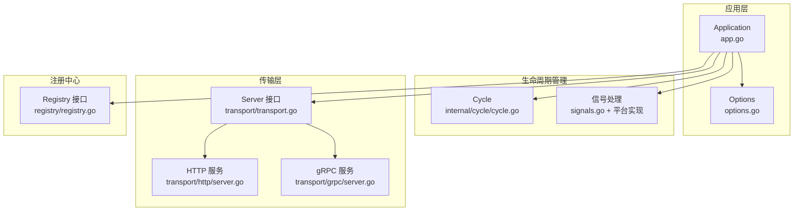
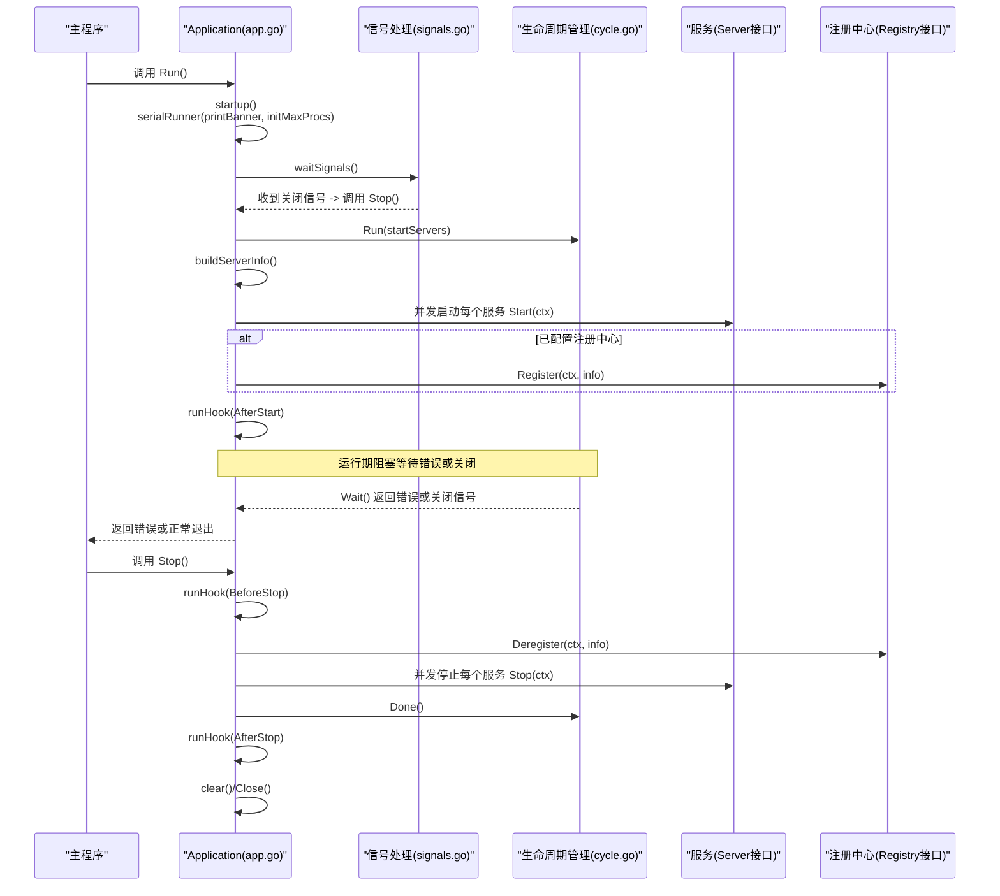
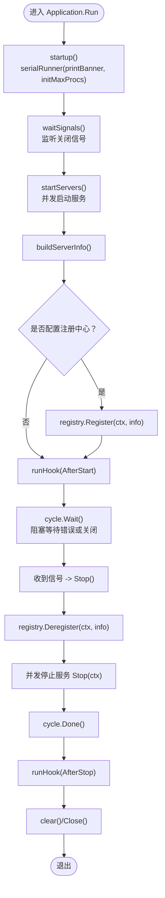
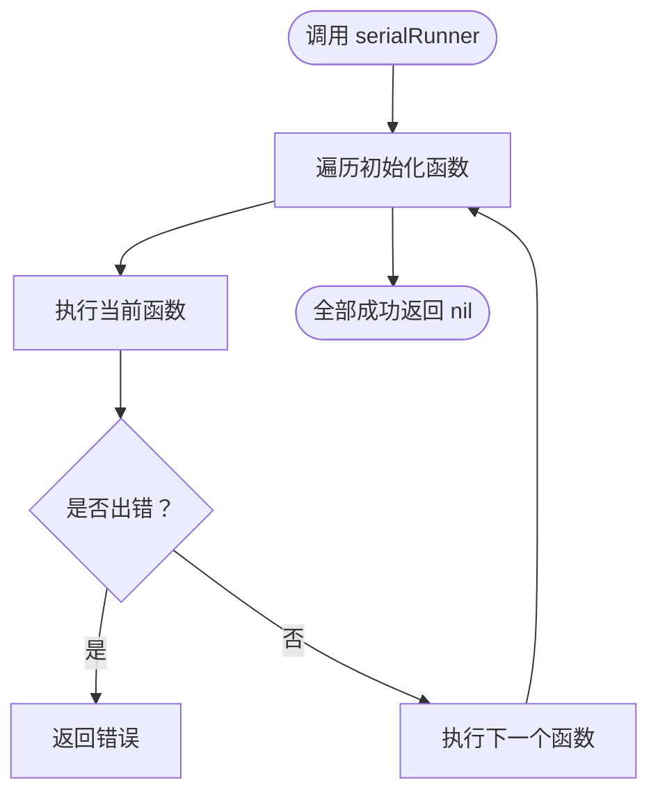
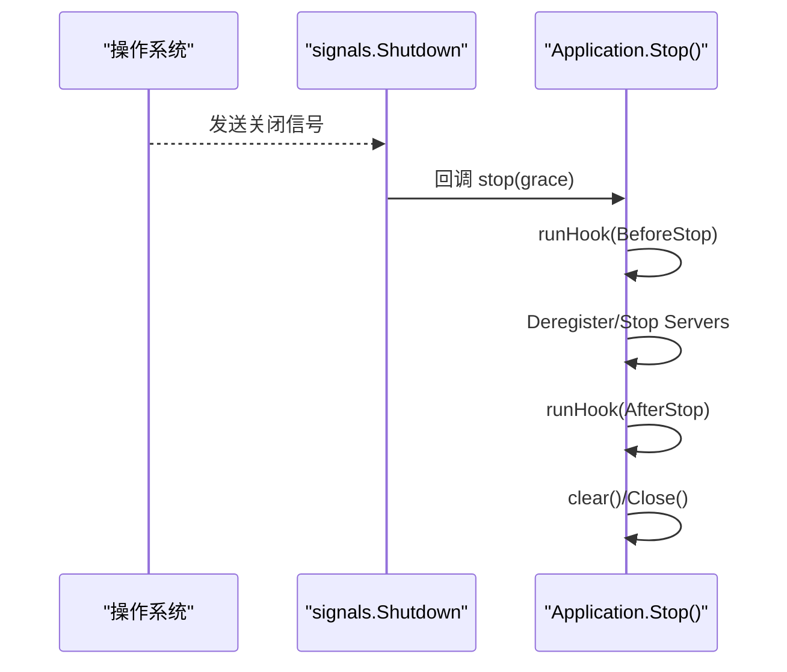
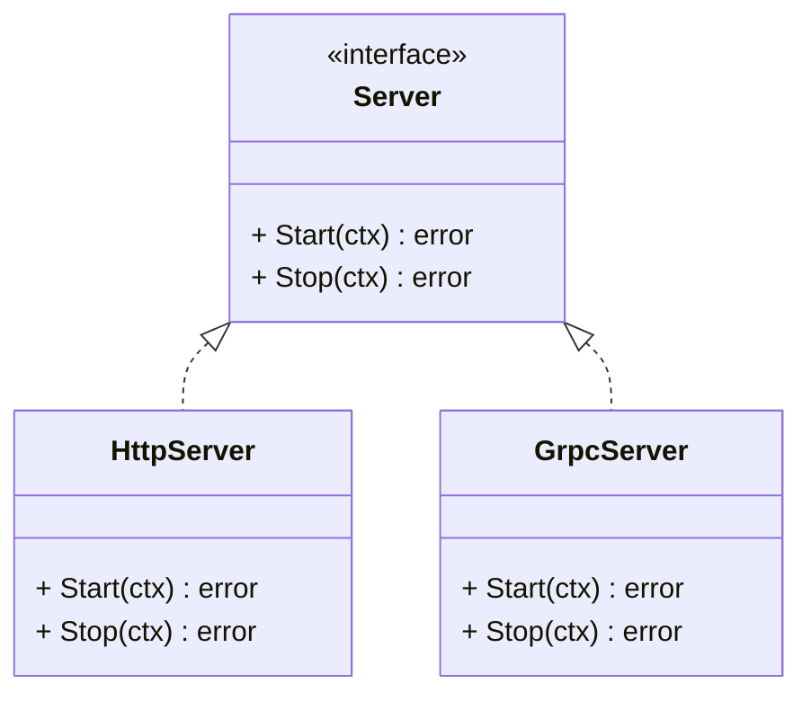
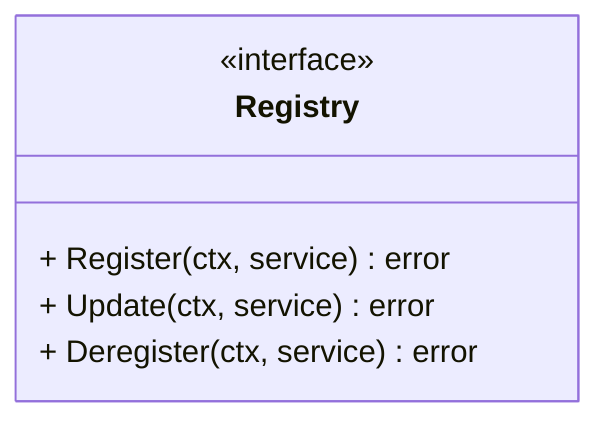
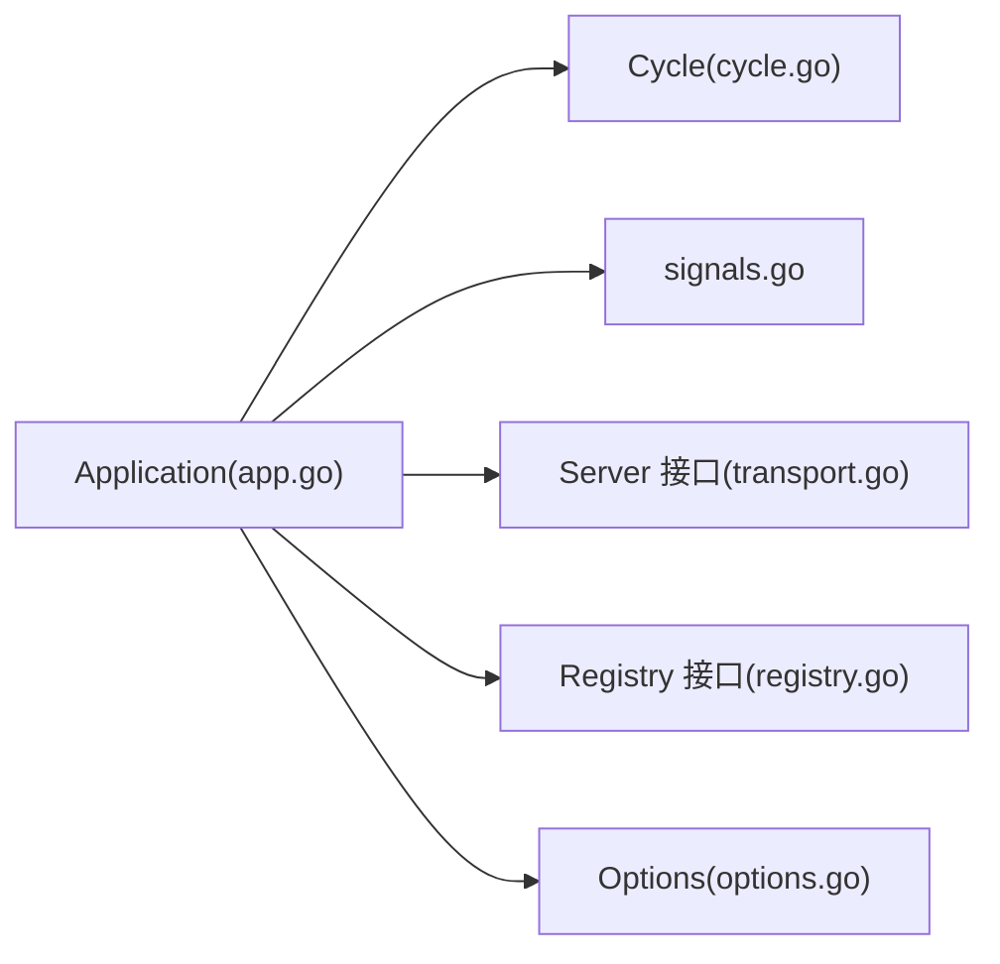

# 应用程序生命周期管理

<cite>
**本文引用的文件**
- [app.go](file://app.go)
- [options.go](file://options.go)
- [internal/cycle/cycle.go](file://internal/cycle/cycle.go)
- [internal/signals/signals.go](file://internal/signals/signals.go)
- [internal/signals/signal_posix.go](file://internal/signals/signal_posix.go)
- [internal/signals/signal_windows.go](file://internal/signals/signal_windows.go)
- [transport/transport.go](file://transport/transport.go)
- [transport/http/server.go](file://transport/http/server.go)
- [transport/grpc/server.go](file://transport/grpc/server.go)
- [registry/registry.go](file://registry/registry.go)
</cite>

## 目录
1. [简介](#简介)
2. [项目结构](#项目结构)
3. [核心组件](#核心组件)
4. [架构总览](#架构总览)
5. [详细组件分析](#详细组件分析)
6. [依赖关系分析](#依赖关系分析)
7. [性能考量](#性能考量)
8. [故障排查指南](#故障排查指南)
9. [结论](#结论)
10. [附录：调用序列与最佳实践](#附录调用序列与最佳实践)

## 简介
本文件系统性阐述 Go Fox 应用程序的生命周期管理，覆盖从启动到停止的完整流程：
- startup() 初始化阶段：打印横幅、设置 GOMAXPROCS 等一次性初始化工作
- Run() 运行阶段：等待信号、并发启动服务、注册服务、阻塞等待错误或关闭
- Stop() 停止阶段：注销服务、优雅停止所有服务、执行钩子、清理资源

同时深入解析两个关键基础设施：
- serialRunner 串行执行器：保证初始化步骤按序执行且仅一次
- Cycle 循环管理器：并发启动服务、统一等待、错误传播与优雅关闭

## 项目结构
围绕生命周期管理的关键模块如下：
- 应用入口与生命周期控制：app.go
- 生命周期管理器：internal/cycle/cycle.go
- 信号监听与优雅关闭：internal/signals/signals.go 及平台特定实现
- 传输层抽象与具体服务实现：transport/transport.go、transport/http/server.go、transport/grpc/server.go
- 注册中心接口：registry/registry.go
- 应用选项与钩子：options.go



图表来源
- [app.go](file://app.go#L52-L63)
- [internal/cycle/cycle.go](file://internal/cycle/cycle.go#L31-L39)
- [internal/signals/signals.go](file://internal/signals/signals.go#L32-L45)
- [transport/transport.go](file://transport/transport.go#L44-L48)
- [transport/http/server.go](file://transport/http/server.go#L211-L234)
- [transport/grpc/server.go](file://transport/grpc/server.go#L138-L155)
- [registry/registry.go](file://registry/registry.go#L17-L37)

章节来源
- [app.go](file://app.go#L52-L63)
- [options.go](file://options.go#L54-L71)
- [internal/cycle/cycle.go](file://internal/cycle/cycle.go#L31-L39)
- [internal/signals/signals.go](file://internal/signals/signals.go#L32-L45)
- [transport/transport.go](file://transport/transport.go#L44-L48)

## 核心组件
- Application：应用主体，负责生命周期编排、初始化、运行、停止
- Cycle：并发生命周期管理器，封装 goroutine 启动、等待、错误传播与关闭
- Signals：跨平台信号监听，触发优雅关闭
- Server 接口：统一的服务启动/停止抽象
- Registry 接口：服务注册/注销抽象

章节来源
- [app.go](file://app.go#L52-L63)
- [internal/cycle/cycle.go](file://internal/cycle/cycle.go#L31-L39)
- [internal/signals/signals.go](file://internal/signals/signals.go#L32-L45)
- [transport/transport.go](file://transport/transport.go#L44-L48)
- [registry/registry.go](file://registry/registry.go#L17-L37)

## 架构总览
下图展示了从应用启动到停止的端到端流程，包括信号监听、并发服务启动、注册与注销、错误传播与优雅关闭。



图表来源
- [app.go](file://app.go#L105-L114)
- [app.go](file://app.go#L158-L175)
- [app.go](file://app.go#L177-L182)
- [app.go](file://app.go#L184-L221)
- [app.go](file://app.go#L253-L282)
- [internal/cycle/cycle.go](file://internal/cycle/cycle.go#L53-L64)
- [internal/cycle/cycle.go](file://internal/cycle/cycle.go#L94-L97)
- [transport/transport.go](file://transport/transport.go#L44-L48)
- [registry/registry.go](file://registry/registry.go#L17-L37)

## 详细组件分析

### Application 生命周期编排
- 初始化阶段（startup）：通过 serialRunner 串行执行一次性初始化任务，避免重复执行
- 运行阶段（Run）：等待信号；并发启动服务；注册服务；阻塞等待错误或关闭
- 停止阶段（Stop）：注销服务；并发停止服务；执行钩子；清理资源



图表来源
- [app.go](file://app.go#L105-L114)
- [app.go](file://app.go#L158-L175)
- [app.go](file://app.go#L177-L182)
- [app.go](file://app.go#L184-L221)
- [app.go](file://app.go#L253-L282)

章节来源
- [app.go](file://app.go#L105-L114)
- [app.go](file://app.go#L158-L175)
- [app.go](file://app.go#L177-L182)
- [app.go](file://app.go#L184-L221)
- [app.go](file://app.go#L253-L282)

### serialRunner 串行执行器
- 设计目标：确保初始化步骤按顺序执行，且仅执行一次
- 实现要点：遍历传入的初始化函数，遇到错误立即返回，否则继续下一个
- 使用场景：startup() 中的 printBanner、initMaxProcs 等一次性初始化



图表来源
- [app.go](file://app.go#L148-L156)

章节来源
- [app.go](file://app.go#L148-L156)

### Cycle 循环管理器
- 并发启动：Run(fn) 将任务包装为 goroutine，并在内部 wg.Add/Done
- 错误传播：任一任务返回错误即通过 quit 通道传播
- 关闭策略：Done() 在首次调用时启动 goroutine 等待所有任务结束并关闭 done；Close() 关闭 quit；Wait() 暴露错误通道
- 典型用法：Run(startServers)、Run(每个服务的 Start/Stop)

```mermaid
classDiagram
class Cycle {
- locker : Mutex
- wg : WaitGroup
- done : chan struct{}
- quit : chan error
- closing : uint32
- waiting : uint32
+ Run(fn func() error)
+ Done() chan struct{}
+ Wait() chan error
+ Close()
+ DoneAndClose()
}
```

图表来源
- [internal/cycle/cycle.go](file://internal/cycle/cycle.go#L31-L39)
- [internal/cycle/cycle.go](file://internal/cycle/cycle.go#L53-L64)
- [internal/cycle/cycle.go](file://internal/cycle/cycle.go#L66-L77)
- [internal/cycle/cycle.go](file://internal/cycle/cycle.go#L94-L97)

章节来源
- [internal/cycle/cycle.go](file://internal/cycle/cycle.go#L31-L39)
- [internal/cycle/cycle.go](file://internal/cycle/cycle.go#L53-L64)
- [internal/cycle/cycle.go](file://internal/cycle/cycle.go#L66-L77)
- [internal/cycle/cycle.go](file://internal/cycle/cycle.go#L94-L97)

### 信号监听与优雅关闭
- 跨平台支持：POSIX 与 Windows 分别定义不同的关闭信号集
- 行为语义：收到第一个关闭信号后触发 Stop()；若再次收到信号则直接退出进程
- 触发路径：signals.Shutdown 回调 -> Application.Stop()



图表来源
- [internal/signals/signals.go](file://internal/signals/signals.go#L32-L45)
- [internal/signals/signal_posix.go](file://internal/signals/signal_posix.go#L35)
- [internal/signals/signal_windows.go](file://internal/signals/signal_windows.go#L35)
- [app.go](file://app.go#L253-L282)

章节来源
- [internal/signals/signals.go](file://internal/signals/signals.go#L32-L45)
- [internal/signals/signal_posix.go](file://internal/signals/signal_posix.go#L35)
- [internal/signals/signal_windows.go](file://internal/signals/signal_windows.go#L35)
- [app.go](file://app.go#L253-L282)

### 传输层服务抽象与实现
- Server 接口：统一的 Start(ctx) 与 Stop(ctx) 抽象
- HTTP 服务：Start 调用 Serve；Stop 调用 ShutdownWithContext
- gRPC 服务：Start 调用 Serve；Stop 调用 GracefulStop



图表来源
- [transport/transport.go](file://transport/transport.go#L44-L48)
- [transport/http/server.go](file://transport/http/server.go#L211-L234)
- [transport/grpc/server.go](file://transport/grpc/server.go#L138-L155)

章节来源
- [transport/transport.go](file://transport/transport.go#L44-L48)
- [transport/http/server.go](file://transport/http/server.go#L211-L234)
- [transport/grpc/server.go](file://transport/grpc/server.go#L138-L155)

### 注册中心接口与实现
- Registry 接口：Register、Update、Deregister
- 应用在启动后注册服务，在停止前注销服务



图表来源
- [registry/registry.go](file://registry/registry.go#L17-L37)

章节来源
- [registry/registry.go](file://registry/registry.go#L17-L37)
- [app.go](file://app.go#L208-L215)
- [app.go](file://app.go#L263-L267)

## 依赖关系分析
- Application 依赖 Cycle 进行并发生命周期管理
- Application 依赖 signals 进行信号监听
- Application 依赖 transport.Server 抽象进行服务启动/停止
- Application 依赖 registry.Registry 进行服务注册/注销
- Application 通过 options 配置钩子、服务集合、注册中心等



图表来源
- [app.go](file://app.go#L52-L63)
- [internal/cycle/cycle.go](file://internal/cycle/cycle.go#L31-L39)
- [internal/signals/signals.go](file://internal/signals/signals.go#L32-L45)
- [transport/transport.go](file://transport/transport.go#L44-L48)
- [registry/registry.go](file://registry/registry.go#L17-L37)
- [options.go](file://options.go#L54-L71)

章节来源
- [app.go](file://app.go#L52-L63)
- [options.go](file://options.go#L54-L71)

## 性能考量
- 并发启动服务：通过 Cycle.Run 并发启动，显著缩短启动时间
- 错误快速传播：任一服务启动失败立即通过 quit 通道返回，避免无效等待
- 优雅关闭：Stop 使用带超时的 context，确保服务在合理时间内退出
- 资源清理：maxprocs 清理、通道关闭、钩子执行，避免资源泄漏

## 故障排查指南
- 启动阶段无输出或初始化失败
  - 检查 serialRunner 是否返回错误
  - 确认 printBanner 未被隐藏，initMaxProcs 是否正确设置
- 服务启动后无法注册
  - 检查注册中心配置与网络连通性
  - 确认 buildServerInfo 生成的 endpoints 正确
- 优雅关闭不生效
  - 检查信号是否正确传递至 signals.Shutdown
  - 确认 Stop() 中的注销与停止逻辑执行
- 停止后资源未释放
  - 确认 cycle.Done() 已被消费
  - 检查钩子中是否有阻塞操作

章节来源
- [app.go](file://app.go#L105-L114)
- [app.go](file://app.go#L184-L221)
- [app.go](file://app.go#L253-L282)
- [internal/cycle/cycle.go](file://internal/cycle/cycle.go#L66-L77)

## 结论
Go Fox 的生命周期管理以 Application 为核心，结合 serialRunner 保证初始化顺序与幂等，借助 Cycle 实现并发启动与错误快速传播，配合 signals 提供跨平台优雅关闭。该设计既保证了启动效率，又提供了完善的停止与清理机制，适合生产环境的微服务部署。

## 附录：调用序列与最佳实践

### 生命周期调用顺序与关键节点
- startup()：一次性初始化（打印横幅、设置 GOMAXPROCS）
- Run()：等待信号、并发启动服务、注册、阻塞等待
- Stop()：注销、并发停止、执行钩子、清理

章节来源
- [app.go](file://app.go#L105-L114)
- [app.go](file://app.go#L158-L175)
- [app.go](file://app.go#L177-L182)
- [app.go](file://app.go#L184-L221)
- [app.go](file://app.go#L253-L282)

### 优雅关闭最佳实践
- 使用 signals.Shutdown 统一处理关闭信号
- 在 Stop() 中使用带超时的 context 控制停止时限
- 注册中心与服务停止顺序：先注销再停止，避免外部访问到已停止的服务
- 钩子中避免长时间阻塞，必要时拆分为异步任务

章节来源
- [internal/signals/signals.go](file://internal/signals/signals.go#L32-L45)
- [app.go](file://app.go#L253-L282)
- [registry/registry.go](file://registry/registry.go#L17-L37)