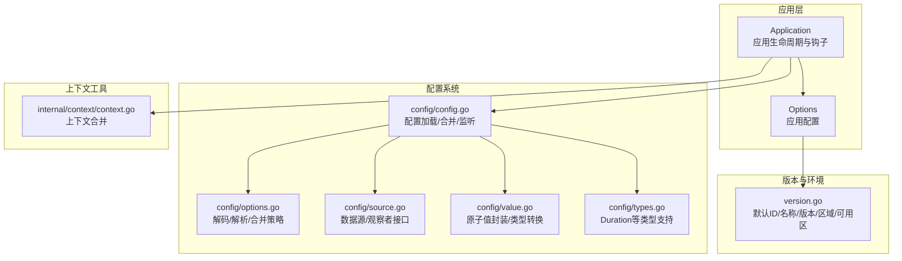
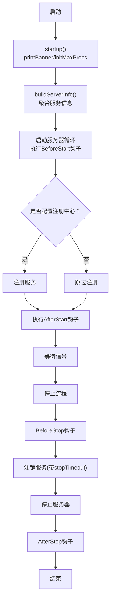
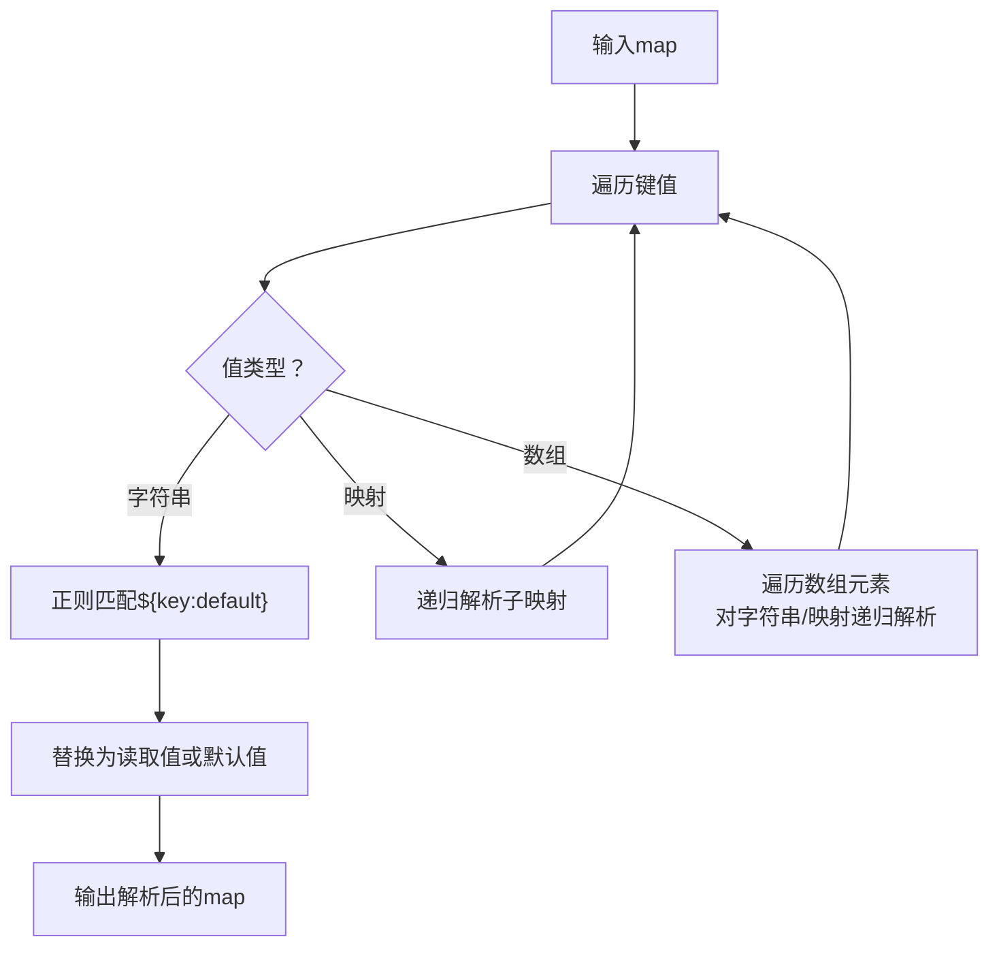
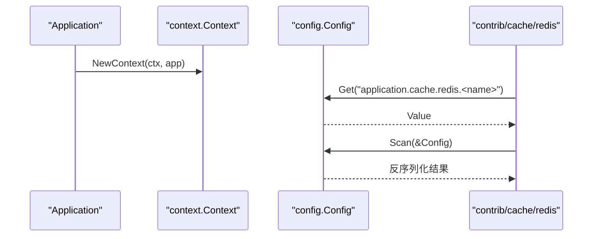
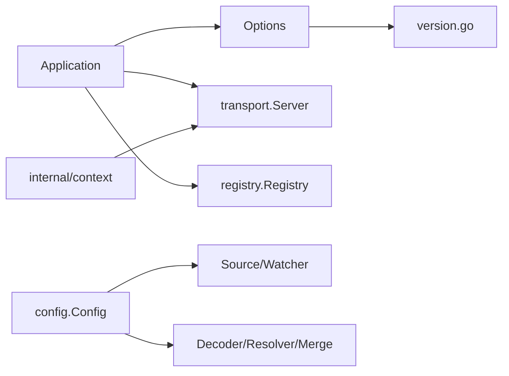

# 配置选项系统

<cite>
**本文档引用的文件**
- [options.go](file://options.go)
- [app.go](file://app.go)
- [version.go](file://version.go)
- [config.go](file://config/config.go)
- [options.go](file://config/options.go)
- [source.go](file://config/source.go)
- [value.go](file://config/value.go)
- [types.go](file://config/types.go)
- [config_test.go](file://config/config_test.go)
- [internal/context/context.go](file://internal/context/context.go)
- [contrib/cache/redis/config.go](file://contrib/cache/redis/config.go)
- [contrib/config/nacos/options.go](file://contrib/config/nacos/options.go)
- [contrib/registry/etcd/options.go](file://contrib/registry/etcd/options.go)
</cite>

## 目录
1. [简介](#简介)
2. [项目结构](#项目结构)
3. [核心组件](#核心组件)
4. [架构总览](#架构总览)
5. [详细组件分析](#详细组件分析)
6. [依赖关系分析](#依赖关系分析)
7. [性能考虑](#性能考虑)
8. [故障排查指南](#故障排查指南)
9. [结论](#结论)
10. [附录](#附录)

## 简介
本文件面向Go Fox配置选项系统，聚焦于应用级Options结构体及其在应用程序生命周期中的作用。内容涵盖：
- Options结构体设计与各配置字段含义（应用ID、名称、版本、元数据、区域、可用区等）
- 默认配置的设置机制与自定义配置的覆盖方式
- 配置选项在应用初始化过程中的影响（服务启动、注册中心配置、日志设置等）
- 配置选项与应用上下文的关系及运行时访问方式
- 使用示例与最佳实践建议

## 项目结构
围绕配置选项系统的关键模块如下：
- 应用层：应用创建、启动、停止、钩子执行、上下文传递
- 版本与环境：默认应用ID、名称、版本、区域、可用区的来源
- 配置系统：配置加载、合并、占位符解析、监听与观察者模式
- 上下文工具：多上下文合并与传播



图表来源
- [app.go](file://app.go#L52-L78)
- [options.go](file://options.go#L53-L89)
- [version.go](file://version.go#L41-L82)
- [config.go](file://config/config.go#L61-L86)
- [options.go](file://config/options.go#L43-L79)
- [source.go](file://config/source.go#L28-L50)
- [value.go](file://config/value.go#L46-L64)
- [types.go](file://config/types.go#L32-L62)
- [internal/context/context.go](file://internal/context/context.go#L45-L62)

章节来源
- [app.go](file://app.go#L52-L78)
- [options.go](file://options.go#L53-L89)
- [version.go](file://version.go#L41-L82)
- [config.go](file://config/config.go#L61-L86)
- [options.go](file://config/options.go#L43-L79)
- [source.go](file://config/source.go#L28-L50)
- [value.go](file://config/value.go#L46-L64)
- [types.go](file://config/types.go#L32-L62)
- [internal/context/context.go](file://internal/context/context.go#L45-L62)

## 核心组件
- Options结构体：承载应用启动所需的核心配置，包含上下文、ID、名称、版本、元数据、端点、区域、可用区、横幅显示、并发控制、注册与停止超时、钩子、服务器集合、注册中心、日志等。
- 默认配置：defaultOptions统一设置默认值，同时从version.go中注入默认的应用ID、名称、版本、区域、可用区等。
- 应用程序：Application负责应用生命周期管理、服务启动与注册、钩子执行、上下文传递与清理。

章节来源
- [options.go](file://options.go#L53-L89)
- [options.go](file://options.go#L74-L89)
- [version.go](file://version.go#L84-L155)
- [app.go](file://app.go#L52-L78)

## 架构总览
应用启动流程中，Options通过构造函数被应用到Application实例；随后在启动阶段：
- 打印横幅（可选）
- 设置GOMAXPROCS（自动或手动）
- 启动所有传输层服务器
- 构建服务实例信息（含ID、名称、版本、区域、可用区、元数据、端点）
- 注册到注册中心（若配置）
- 执行启动后钩子
- 监听信号并优雅停止，注销服务、停止服务器、执行停止钩子

```mermaid
sequenceDiagram
participant U as "用户代码"
participant APP as "Application"
participant OPT as "Options"
participant VER as "version.go"
participant REG as "注册中心"
participant SRV as "传输层服务器"
U->>APP : New(...Option)
APP->>OPT : defaultOptions()
OPT->>VER : AppId()/AppName()/AppVersion()/AppRegion()/AppZone()
U->>APP : Run()
APP->>APP : startup() -> printBanner/initMaxProcs
APP->>APP : buildServerInfo()
APP->>SRV : Start(ctx)
APP->>REG : Register(ctx, serviceInfo)
APP->>APP : runHook(AfterStart)
U-->>APP : 信号触发停止
APP->>REG : Deregister(ctx, serviceInfo)
APP->>SRV : Stop(ctx)
APP->>APP : runHook(AfterStop)
```

图表来源
- [app.go](file://app.go#L65-L78)
- [app.go](file://app.go#L105-L114)
- [app.go](file://app.go#L158-L175)
- [app.go](file://app.go#L184-L221)
- [app.go](file://app.go#L253-L282)
- [options.go](file://options.go#L74-L89)
- [version.go](file://version.go#L84-L155)

## 详细组件分析

### Options结构体与字段详解
- 字段与作用
  - ctx：应用上下文，用于贯穿整个生命周期与钩子回调
  - id/name/version：应用唯一标识、名称、版本，用于服务实例识别与展示
  - metadata：附加元数据，用于扩展服务属性
  - endpoints：服务暴露的端点列表，由传输层服务器收集
  - region/zone：部署地域与可用区，用于服务定位与路由
  - hideBanner：是否隐藏启动横幅
  - maxProc：GOMAXPROCS设置（0表示自动）
  - registrarTimeout：注册超时
  - stopTimeout：注销/停止超时
  - hooks：启动/停止钩子集合
  - servers：传输层服务器集合
  - registry：注册中心实现
  - logger：日志记录器

- 默认配置机制
  - defaultOptions提供默认值，并通过version.go提供的函数注入默认ID、名称、版本、区域、可用区等
  - 未显式设置的字段采用零值或预设默认值（如超时、日志器等）

- 自定义配置覆盖
  - 通过Option函数逐项覆盖默认值，最终在Application.New中应用到options

章节来源
- [options.go](file://options.go#L53-L89)
- [options.go](file://options.go#L74-L89)
- [version.go](file://version.go#L84-L155)

### 应用初始化与生命周期
- 启动阶段
  - startup串行执行打印横幅与设置GOMAXPROCS
  - buildServerInfo聚合ID、名称、版本、区域、可用区、元数据与端点
  - 启动所有服务器，执行BeforeStart钩子
  - 若配置了注册中心，则进行注册，再执行AfterStart钩子
- 停止阶段
  - BeforeStop钩子
  - 注销服务（带stopTimeout），停止所有服务器，执行AfterStop钩子
  - 清理资源（如GOMAXPROCS清理）



图表来源
- [app.go](file://app.go#L105-L114)
- [app.go](file://app.go#L184-L221)
- [app.go](file://app.go#L253-L282)
- [app.go](file://app.go#L289-L298)

章节来源
- [app.go](file://app.go#L105-L114)
- [app.go](file://app.go#L184-L221)
- [app.go](file://app.go#L253-L282)
- [app.go](file://app.go#L289-L298)

### 配置系统与Options（config包）
- 设计要点
  - 支持多数据源（Source）加载，合并（Merge）策略可自定义，默认使用覆盖合并
  - 解码（Decoder）支持格式化数据与扁平键路径
  - 占位符解析（Resolver）支持形如${key:default}的占位符替换
  - 观察者（Observer）模式支持动态监听与通知
- 关键类型
  - DataSet：单条配置数据（键、值、格式、时间戳）
  - Source/Watcher：数据源与监听器接口
  - Value：原子值封装，支持布尔、整数、字符串、浮点、时长、切片、映射、扫描等

```mermaid
classDiagram
class Config {
+Load(sources) error
+Scan(v) error
+Get(key) Value
+Watch(key, observer) error
+Close() error
}
class options {
-sources []Source
-decoder Decoder
-resolver Resolver
-merge Merge
}
class Source {
<<interface>>
+Load() []*DataSet
+Watch() Watcher
}
class Watcher {
<<interface>>
+Next() []*DataSet
+Stop() error
}
class Value {
<<interface>>
+IsEmpty() bool
+Bool() (bool, error)
+Int() (int64, error)
+String() (string, error)
+Float() (float64, error)
+Duration() (time.Duration, error)
+Slice() ([]Value, error)
+Map() (map[string]Value, error)
+Scan(v) error
+Bytes() ([]byte, error)
+Store(v)
+Load() interface{}
}
Config --> options : "持有"
Config --> Source : "使用"
Config --> Watcher : "使用"
Config --> Value : "返回"
```

图表来源
- [config.go](file://config/config.go#L52-L86)
- [options.go](file://config/options.go#L43-L79)
- [source.go](file://config/source.go#L28-L50)
- [value.go](file://config/value.go#L46-L64)

章节来源
- [config.go](file://config/config.go#L52-L86)
- [options.go](file://config/options.go#L43-L79)
- [source.go](file://config/source.go#L28-L50)
- [value.go](file://config/value.go#L46-L64)

### 配置占位符解析与默认值
- 默认解析器支持形如${key:default}的占位符，若key不存在则回退到默认值
- 支持字符串、嵌套映射、数组元素的递归解析



图表来源
- [options.go](file://config/options.go#L105-L146)
- [options.go](file://config/options.go#L148-L157)

章节来源
- [options.go](file://config/options.go#L105-L146)
- [options.go](file://config/options.go#L148-L157)

### 应用上下文与配置访问
- 应用上下文
  - Application通过NewContext将AppInfo注入到context中，便于在请求或钩子中获取应用信息
  - FromContext从上下文中提取AppInfo
- 配置访问
  - 在业务代码中可通过config.Get(key)获取Value，再通过Scan(v)反序列化到结构体
  - 示例：contrib/cache/redis通过ScanConfig按约定键空间读取Redis配置



图表来源
- [app.go](file://app.go#L302-L311)
- [contrib/cache/redis/config.go](file://contrib/cache/redis/config.go#L58-L65)
- [config.go](file://config/config.go#L125-L134)

章节来源
- [app.go](file://app.go#L302-L311)
- [contrib/cache/redis/config.go](file://contrib/cache/redis/config.go#L58-L65)
- [config.go](file://config/config.go#L125-L134)

### 配置选项使用示例与最佳实践
- 使用示例
  - 基础应用：通过New传入多个Option覆盖默认配置，例如设置应用ID、名称、版本、区域、可用区、日志器、服务器集合、注册中心等
  - 配置系统：通过New(config.Option...)创建配置实例，使用WithSources添加数据源，Load加载并合并，Watch监听变化，Get获取值
  - 运行时访问：在中间件或业务逻辑中通过FromContext获取AppInfo，或通过config.Get/Scan读取配置
- 最佳实践
  - 显式设置应用ID/名称/版本，避免使用默认生成的ID
  - 区域与可用区应与部署环境一致，便于服务发现与路由
  - 合理设置注册与停止超时，确保优雅启停
  - 使用钩子进行必要的初始化与收尾工作
  - 配置占位符统一规范，避免歧义
  - 对于外部配置中心（如Nacos、Etcd），通过对应contrib模块的Option进行配置

章节来源
- [options.go](file://options.go#L91-L208)
- [config.go](file://config/config.go#L70-L86)
- [config_test.go](file://config/config_test.go#L87-L104)
- [contrib/config/nacos/options.go](file://contrib/config/nacos/options.go#L19-L44)
- [contrib/registry/etcd/options.go](file://contrib/registry/etcd/options.go#L37-L56)

## 依赖关系分析
- 应用层依赖版本与环境信息，依赖传输层服务器与注册中心接口
- 配置系统依赖编码器、合并库、数据源与观察者接口
- 上下文工具提供多上下文合并能力，供传输层拦截器等使用



图表来源
- [app.go](file://app.go#L52-L78)
- [options.go](file://options.go#L53-L89)
- [config.go](file://config/config.go#L61-L86)
- [options.go](file://config/options.go#L43-L79)
- [internal/context/context.go](file://internal/context/context.go#L45-L62)

章节来源
- [app.go](file://app.go#L52-L78)
- [options.go](file://options.go#L53-L89)
- [config.go](file://config/config.go#L61-L86)
- [options.go](file://config/options.go#L43-L79)
- [internal/context/context.go](file://internal/context/context.go#L45-L62)

## 性能考虑
- 并发与资源
  - GOMAXPROCS可通过maxProc或自动设置，合理设置有助于CPU密集型场景下的吞吐
  - 服务器并发启动，注意资源竞争与限流
- 超时控制
  - 注册与停止超时需根据网络与注册中心性能调整，避免阻塞
- 配置加载
  - 多源合并与占位符解析存在额外开销，建议在启动阶段完成，运行时尽量减少频繁变更

## 故障排查指南
- 启动无横幅但期望显示
  - 检查是否设置了HideBanner
- 注册失败或超时
  - 检查注册中心配置、网络连通性、RegistrarTimeout设置
- 停止卡顿
  - 检查StopTimeout设置与服务器Stop实现
- 配置未生效
  - 检查数据源加载顺序、合并策略、占位符解析是否正确
  - 使用Watch确认监听是否正常，观察者是否收到更新

章节来源
- [app.go](file://app.go#L117-L132)
- [app.go](file://app.go#L209-L215)
- [app.go](file://app.go#L260-L267)
- [config.go](file://config/config.go#L88-L114)
- [config.go](file://config/config.go#L153-L185)

## 结论
Go Fox的配置选项系统以Options为核心，结合默认配置与Option函数提供了灵活而强大的应用配置能力。通过Application的生命周期管理，配置选项直接影响服务启动、注册中心行为与日志输出。配合config包的多源配置、占位符解析与观察者机制，可在运行时动态感知配置变化。建议在生产环境中明确设置关键配置项，合理规划钩子与超时，确保系统稳定与可观测。

## 附录
- 常用Option一览
  - Context、Id、Name、Version、Metadata、Region、Zone、HideBanner、RegistrarTimeout、StopTimeout、Hooks/AddHooks、Registry、Server、Logger、MaxProc
- 常用config.Option一览
  - WithSources、WithDecoder、WithResolver、WithMerge

章节来源
- [options.go](file://options.go#L91-L208)
- [options.go](file://config/options.go#L53-L79)