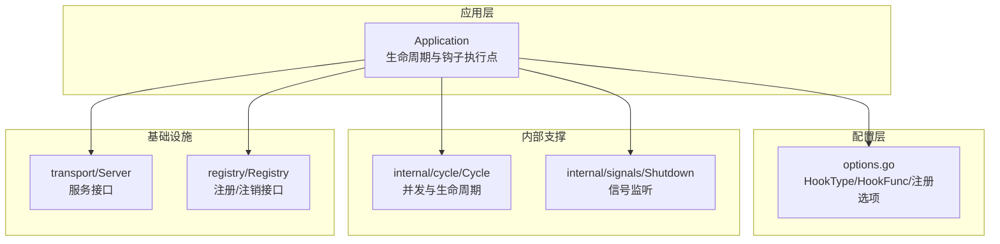
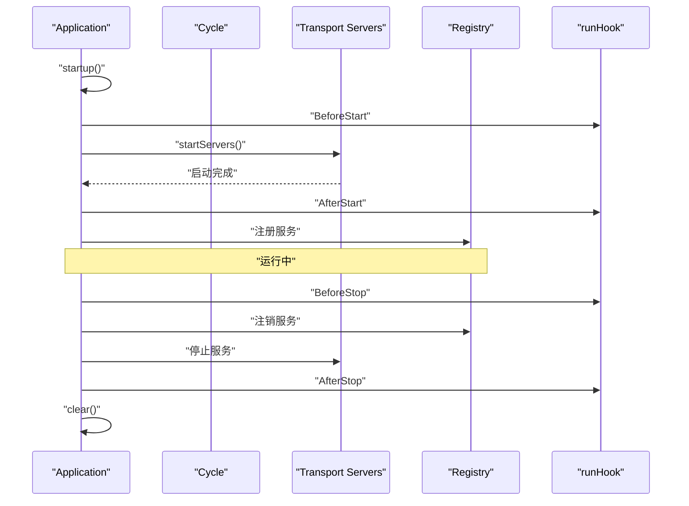
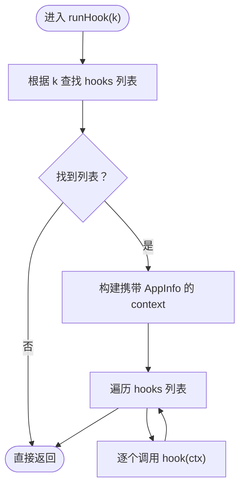
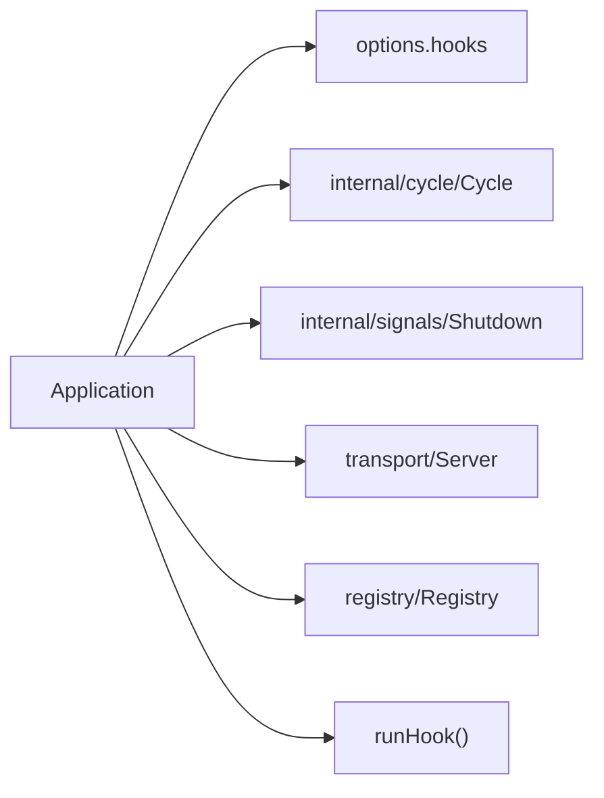

# 钩子系统

<cite>
**本文引用的文件列表**
- [app.go](file://app.go)
- [options.go](file://options.go)
- [internal/cycle/cycle.go](file://internal/cycle/cycle.go)
- [internal/signals/signals.go](file://internal/signals/signals.go)
- [transport/transport.go](file://transport/transport.go)
- [registry/registry.go](file://registry/registry.go)
</cite>

## 目录
1. [简介](#简介)
2. [项目结构](#项目结构)
3. [核心组件](#核心组件)
4. [架构总览](#架构总览)
5. [组件详解](#组件详解)
6. [依赖关系分析](#依赖关系分析)
7. [性能考量](#性能考量)
8. [故障排查指南](#故障排查指南)
9. [结论](#结论)
10. [附录：使用示例与最佳实践](#附录使用示例与最佳实践)

## 简介
本文件面向 Go Fox 微服务框架的“钩子系统”，系统性阐述以下内容：
- HookType 枚举定义与各钩子类型的作用时机（BeforeStart、AfterStart、BeforeStop、AfterStop）
- runHook() 的实现机制：注册、执行顺序、上下文传递、错误处理策略
- 钩子函数签名与参数传递机制
- 在应用生命周期中的集成方式与微服务典型用法
- 实战示例与最佳实践

## 项目结构
钩子系统位于应用主模块中，核心由以下文件构成：
- app.go：应用生命周期与钩子执行点
- options.go：钩子类型、钩子函数类型、钩子注册选项
- internal/cycle/cycle.go：并发与生命周期控制
- internal/signals/signals.go：信号监听与优雅停机
- transport/transport.go：传输层接口，用于服务启动/停止
- registry/registry.go：服务注册/注销接口

图表来源
- [app.go](file://app.go#L52-L78)
- [options.go](file://options.go#L36-L71)
- [internal/cycle/cycle.go](file://internal/cycle/cycle.go#L31-L39)
- [internal/signals/signals.go](file://internal/signals/signals.go)
- [transport/transport.go](file://transport/transport.go)
- [registry/registry.go](file://registry/registry.go)

章节来源
- [app.go](file://app.go#L52-L78)
- [options.go](file://options.go#L36-L71)

## 核心组件
- 钩子类型与函数签名
  - HookType：枚举类型，定义了四个钩子类型：BeforeStart、BeforeStop、AfterStart、AfterStop
  - HookFunc：函数签名要求为接收 context.Context 的无返回值函数
- 钩子注册与追加
  - Hooks：覆盖式设置某类钩子
  - AddHooks：向某类钩子追加多个钩子
- 钩子执行
  - runHook：按注册顺序依次执行指定类型的钩子，并传入携带应用信息的上下文

章节来源
- [options.go](file://options.go#L36-L48)
- [options.go](file://options.go#L161-L179)
- [app.go](file://app.go#L289-L298)

## 架构总览
钩子系统贯穿应用生命周期的关键节点，形成“启动前—启动后—运行中—停止前—停止后”的闭环。下图展示了钩子在应用启动与停止流程中的触发位置。

图表来源
- [app.go](file://app.go#L158-L175)
- [app.go](file://app.go#L184-L221)
- [app.go](file://app.go#L253-L282)
- [app.go](file://app.go#L289-L298)

## 组件详解

### 钩子类型与作用时机
- BeforeStart：在服务启动之前执行，适合做初始化、资源准备、健康检查前置校验等
- AfterStart：在服务启动之后执行，适合做启动后的收尾、上报、订阅等
- BeforeStop：在停止流程开始时执行，适合做清理、断开连接、释放资源等
- AfterStop：在停止流程结束时执行，适合做最终清理、日志落盘等

章节来源
- [options.go](file://options.go#L42-L48)
- [app.go](file://app.go#L196-L197)
- [app.go](file://app.go#L217-L218)
- [app.go](file://app.go#L256-L257)
- [app.go](file://app.go#L277-L278)

### runHook() 实现机制
- 数据结构
  - 钩子以“类型 -> 函数列表”的映射存储于 options.hooks 中
- 执行顺序
  - 按注册顺序依次执行，不保证并发安全；如需并发，请在钩子内部自行处理
- 上下文传递
  - runHook 会构造一个携带 AppInfo 的 context 并传入每个钩子
  - 可通过 FromContext(ctx) 获取 AppInfo，从而在钩子中访问应用元数据（ID、Name、Version、Endpoints 等）
- 错误处理
  - runHook 不对单个钩子的错误进行捕获或中断后续钩子；若需要失败即终止，应在钩子内部自行处理并返回错误
  - 应用层在关键路径（如启动/停止）处有独立的错误处理逻辑，与钩子解耦

图表来源
- [app.go](file://app.go#L289-L298)
- [app.go](file://app.go#L302-L311)

章节来源
- [app.go](file://app.go#L289-L298)
- [app.go](file://app.go#L302-L311)

### 钩子函数签名与参数传递
- 签名要求
  - 必须为 func(context.Context) 形式
- 参数传递
  - 通过 context 传递 AppInfo，可在钩子中读取应用元数据
- 注意事项
  - 钩子不应阻塞过久，避免影响应用启动/停止的时序
  - 如需并发执行，请在钩子内部自行管理 goroutine 与同步

章节来源
- [options.go](file://options.go#L39-L40)
- [app.go](file://app.go#L293-L295)
- [app.go](file://app.go#L302-L311)

### 钩子注册与追加
- 覆盖式设置：Hooks(HookType, ...HookFunc)
- 追加式设置：AddHooks(HookType, ...HookFunc)
- 使用建议
  - 将钩子按类型分组，便于维护与调试
  - 对于需要幂等的初始化/清理逻辑，确保钩子具备可重复执行的安全性

章节来源
- [options.go](file://options.go#L161-L179)

### 应用生命周期中的钩子集成
- 启动阶段
  - BeforeStart：初始化数据库连接池、缓存预热、指标采集器启动等
  - AfterStart：上报服务实例信息、订阅消息队列、启动后台任务等
- 停止阶段
  - BeforeStop：关闭外部连接、通知下游、导出统计指标等
  - AfterStop：落盘日志、释放临时资源、输出停机报告等

章节来源
- [app.go](file://app.go#L196-L197)
- [app.go](file://app.go#L217-L218)
- [app.go](file://app.go#L256-L257)
- [app.go](file://app.go#L277-L278)

## 依赖关系分析
- Application 依赖
  - options：持有钩子列表与全局配置
  - internal/cycle：并发与生命周期控制
  - internal/signals：信号监听与优雅停机
  - transport/Server：服务启动/停止接口
  - registry/Registry：服务注册/注销接口
- 关键耦合点
  - runHook 仅依赖 options.hooks 与上下文构造，耦合度低，扩展性强
  - 钩子执行发生在应用生命周期的关键节点，与业务解耦

图表来源
- [app.go](file://app.go#L52-L78)
- [app.go](file://app.go#L289-L298)
- [options.go](file://options.go#L54-L71)

章节来源
- [app.go](file://app.go#L52-L78)
- [options.go](file://options.go#L54-L71)

## 性能考量
- 执行顺序为串行，不保证并发，避免在钩子中执行耗时操作
- 若存在大量钩子或复杂初始化，建议在钩子内部采用异步/批量策略，并通过上下文传播取消信号
- 钩子不应阻塞应用启动/停止的主流程，必要时将阻塞逻辑放入后台 goroutine

## 故障排查指南
- 钩子未生效
  - 检查是否正确注册到对应 HookType
  - 确认钩子函数签名是否为 func(context.Context)
- 钩子执行顺序异常
  - 确认使用 AddHooks 进行追加而非 Hooks 覆盖
- 上下文无法获取 AppInfo
  - 确保通过 NewContext 构造上下文并在钩子中使用 FromContext 提取
- 启动/停止被阻塞
  - 检查钩子内部是否存在长时间阻塞操作，必要时改为异步执行

章节来源
- [options.go](file://options.go#L161-L179)
- [app.go](file://app.go#L289-L298)
- [app.go](file://app.go#L302-L311)

## 结论
Go Fox 的钩子系统以简洁的枚举与函数签名设计，将应用生命周期的关键节点开放给用户扩展。通过 runHook 的串行执行与上下文传递，开发者可以在不侵入核心流程的前提下完成初始化、清理、监控等通用能力。配合 AddHooks/ Hooks 的注册策略与 FromContext 的上下文提取，钩子系统在微服务场景中具备良好的可维护性与可扩展性。

## 附录：使用示例与最佳实践
- 注册自定义钩子
  - 使用 AddHooks 或 Hooks 将钩子函数注册到对应 HookType
  - 钩子函数签名必须为 func(context.Context)，并在其中读取 AppInfo
- 典型用法
  - BeforeStart：数据库连接池初始化、缓存预热、指标采集器启动
  - AfterStart：上报服务实例、订阅消息、启动后台任务
  - BeforeStop：关闭外部连接、通知下游、导出统计
  - AfterStop：落盘日志、释放临时资源
- 最佳实践
  - 钩子应幂等且尽量轻量，避免阻塞主流程
  - 对于耗时操作，使用后台 goroutine 并通过 context 传播取消信号
  - 将钩子按功能拆分，便于测试与排障

章节来源
- [options.go](file://options.go#L161-L179)
- [app.go](file://app.go#L289-L298)
- [app.go](file://app.go#L302-L311)