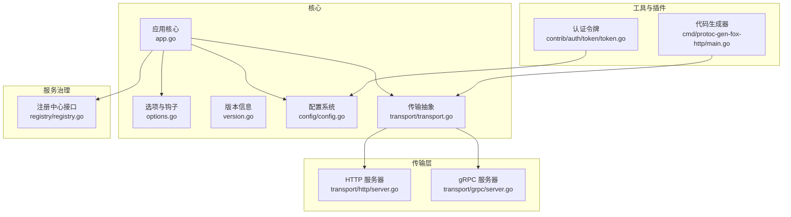
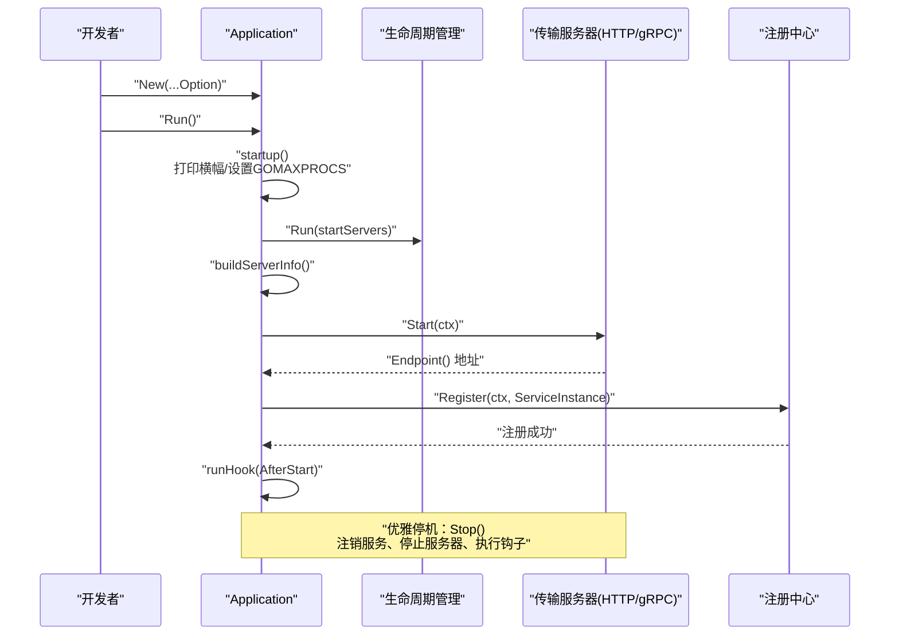
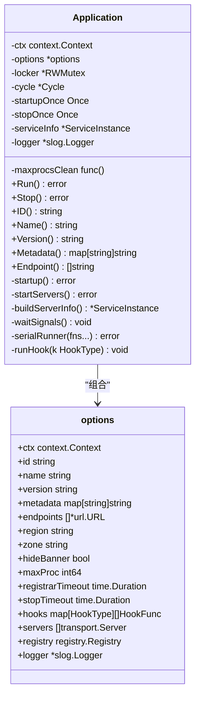
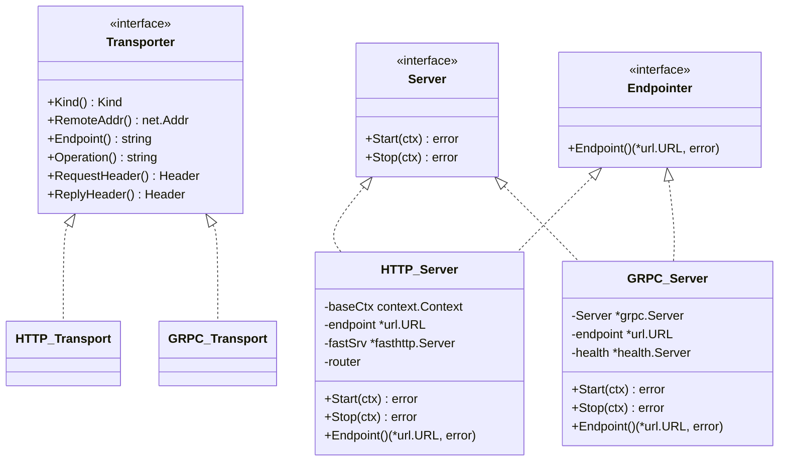
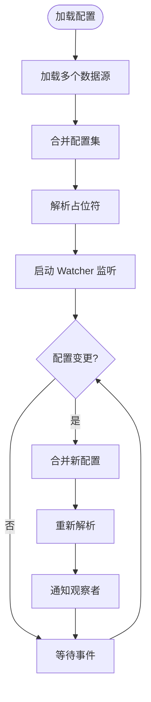
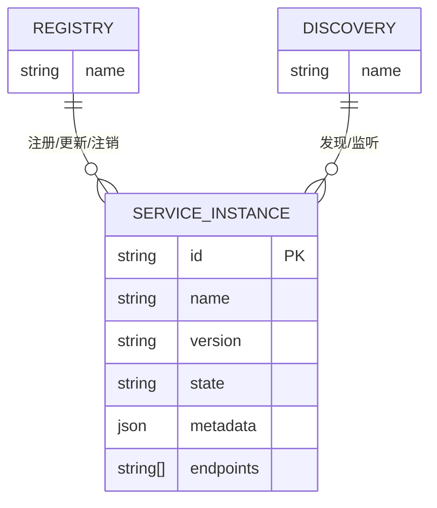
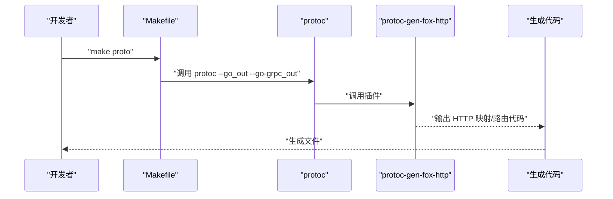
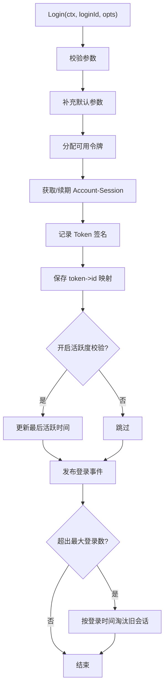
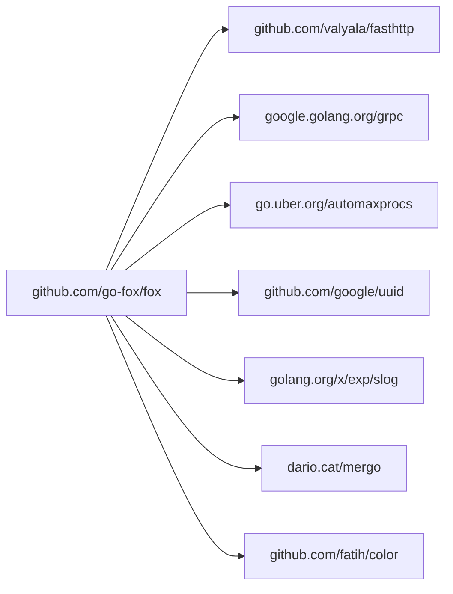

# 开发指南

<cite>
**本文引用的文件**
- [README.md](file://README.md)
- [go.mod](file://go.mod)
- [Makefile](file://Makefile)
- [app.go](file://app.go)
- [options.go](file://options.go)
- [version.go](file://version.go)
- [revive.toml](file://revive.toml)
- [config/config.go](file://config/config.go)
- [transport/transport.go](file://transport/transport.go)
- [transport/http/server.go](file://transport/http/server.go)
- [transport/grpc/server.go](file://transport/grpc/server.go)
- [registry/registry.go](file://registry/registry.go)
- [cmd/protoc-gen-fox-http/main.go](file://cmd/protoc-gen-fox-http/main.go)
- [contrib/auth/token/token.go](file://contrib/auth/token/token.go)
</cite>

## 目录
1. [简介](#简介)
2. [项目结构](#项目结构)
3. [核心组件](#核心组件)
4. [架构总览](#架构总览)
5. [详细组件分析](#详细组件分析)
6. [依赖分析](#依赖分析)
7. [性能考虑](#性能考虑)
8. [故障排查指南](#故障排查指南)
9. [结论](#结论)
10. [附录](#附录)

## 简介
本指南面向希望为 Go Fox 贡献或基于其进行二次开发的工程师，覆盖开发环境搭建、代码结构与模块组织、开发规范与最佳实践、测试策略、构建与发布流程、调试与性能分析方法，以及贡献流程。Go Fox 是一个微服务框架，提供统一的应用生命周期管理、传输层抽象（HTTP/GRPC/WebSocket）、服务注册与发现、配置中心、中间件体系与插件化扩展能力。

## 项目结构
仓库采用按功能域分层的模块化组织方式：
- 根目录：应用入口、版本信息、构建与质量规则
- cmd：协议与代码生成器插件（protoc-gen-*）
- transport：传输层实现（HTTP、gRPC、WebSocket）
- registry：服务注册与发现接口
- config：配置加载、合并、监听与解析
- codec：多种编解码器（JSON、Proto、YAML、TOML、XML、Form）
- middleware：中间件选择器与通用中间件接口
- selector：服务选择器与负载均衡
- contrib：可选生态组件（认证令牌、缓存、客户端、Nacos、i18n、恢复中间件、注册中心等）
- internal：内部工具与测试数据
- api：Protocol Buffers 定义与生成代码

图表来源
- [app.go](file://app.go#L52-L312)
- [options.go](file://options.go#L50-L208)
- [version.go](file://version.go#L38-L174)
- [config/config.go](file://config/config.go#L52-L186)
- [transport/transport.go](file://transport/transport.go#L44-L125)
- [transport/http/server.go](file://transport/http/server.go#L53-L200)
- [transport/grpc/server.go](file://transport/grpc/server.go#L50-L175)
- [registry/registry.go](file://registry/registry.go#L17-L113)
- [cmd/protoc-gen-fox-http/main.go](file://cmd/protoc-gen-fox-http/main.go#L17-L36)
- [contrib/auth/token/token.go](file://contrib/auth/token/token.go#L15-L200)

章节来源
- [README.md](file://README.md#L1-L3)
- [go.mod](file://go.mod#L1-L39)

## 核心组件
- 应用核心 Application：负责应用生命周期、信号处理、服务启动/停止、钩子执行、注册中心集成等。
- 选项与钩子 Options/Hook：通过 Option 函数式配置应用，支持 BeforeStart/AfterStart/BeforeStop/AfterStop 四类钩子。
- 版本信息 Version：内置版本、构建信息、区域/可用区等元数据。
- 传输抽象 Transport：统一 Server/Client 抽象、Header、Endpointer、上下文传递等。
- 配置系统 Config：多源合并、动态监听、键值访问与观察者模式。
- 注册中心 Registry：注册、更新、注销与服务发现接口。

章节来源
- [app.go](file://app.go#L52-L312)
- [options.go](file://options.go#L50-L208)
- [version.go](file://version.go#L38-L174)
- [transport/transport.go](file://transport/transport.go#L44-L125)
- [config/config.go](file://config/config.go#L52-L186)
- [registry/registry.go](file://registry/registry.go#L17-L113)

## 架构总览
下图展示应用启动到服务注册的关键流程，以及传输层与注册中心的交互。

图表来源
- [app.go](file://app.go#L105-L221)
- [transport/transport.go](file://transport/transport.go#L44-L86)
- [registry/registry.go](file://registry/registry.go#L17-L37)

## 详细组件分析

### 应用核心 Application
- 职责：应用生命周期管理、并发安全、信号处理、钩子机制、注册中心集成。
- 关键点：
  - 启动阶段串行执行初始化任务，随后并行启动各传输服务器。
  - 通过 Endpointer 获取各服务器监听地址，构建 ServiceInstance 并注册。
  - 支持 Before/After Start/Stop 钩子，便于扩展初始化与清理逻辑。
  - 优雅停机：先注销服务，再停止各服务器，最后执行 AfterStop 钩子。

图表来源
- [app.go](file://app.go#L52-L312)
- [options.go](file://options.go#L54-L89)

章节来源
- [app.go](file://app.go#L105-L221)
- [options.go](file://options.go#L50-L208)

### 传输抽象与服务器
- 传输抽象 Transport：统一 Server/Client 接口、Header、Endpointer、上下文传递。
- HTTP 服务器：基于 fasthttp，支持中间件、路由树、静态资源、错误处理、TLS。
- gRPC 服务器：基于 google.golang.org/grpc，支持健康检查、拦截器链、TLS。

图表来源
- [transport/transport.go](file://transport/transport.go#L44-L125)
- [transport/http/server.go](file://transport/http/server.go#L53-L200)
- [transport/grpc/server.go](file://transport/grpc/server.go#L50-L175)

章节来源
- [transport/transport.go](file://transport/transport.go#L44-L125)
- [transport/http/server.go](file://transport/http/server.go#L101-L152)
- [transport/grpc/server.go](file://transport/grpc/server.go#L121-L175)

### 配置系统
- 多源加载：支持多种格式与来源，自动初始化对应编解码器。
- 合并与解析：使用合并器合并多源配置，解析占位符。
- 动态监听：Watch 模式监听配置变更，触发观察者回调。
- 键值访问：Get(key) 提供 Value 访问，支持缓存与类型判断。

图表来源
- [config/config.go](file://config/config.go#L88-L186)

章节来源
- [config/config.go](file://config/config.go#L52-L186)

### 注册中心与服务发现
- Registry：注册、更新、注销服务。
- Discovery：获取服务列表、监听变更。
- Watcher：Next() 返回增量变更，Stop() 停止监听。
- ServiceInstance：包含服务 ID、名称、版本、状态、元数据与端点列表。

图表来源
- [registry/registry.go](file://registry/registry.go#L76-L95)

章节来源
- [registry/registry.go](file://registry/registry.go#L17-L113)

### 代码生成器与 Protobuf 工具链
- protoc-gen-fox-http：基于 protoc-gen-go，生成 HTTP 映射代码，支持 omitempty 参数与前缀过滤。
- Makefile 中提供 proto 目标，用于生成 annotations/protocol/pagination 与 errors 相关的 Go 代码。

图表来源
- [Makefile](file://Makefile#L46-L52)
- [cmd/protoc-gen-fox-http/main.go](file://cmd/protoc-gen-fox-http/main.go#L17-L36)

章节来源
- [Makefile](file://Makefile#L46-L52)
- [cmd/protoc-gen-fox-http/main.go](file://cmd/protoc-gen-fox-http/main.go#L17-L36)

### 认证令牌组件
- Token 接口：登录、登出、顶替、查询登录状态、获取会话、封禁等。
- 内部实现：参数校验、令牌分配、会话续期、映射关系维护、活跃度校验、事件发布、登录数限制等。

图表来源
- [contrib/auth/token/token.go](file://contrib/auth/token/token.go#L144-L200)

章节来源
- [contrib/auth/token/token.go](file://contrib/auth/token/token.go#L15-L200)

## 依赖分析
- 语言与工具：Go 1.23.6；构建与质量工具（revive、protoc、buf）。
- 第三方库：fasthttp、grpc、automaxprocs、slog、uuid、mergo、color 等。
- 模块化：根模块依赖 go-fox 生态组件，子模块独立构建与更新。

图表来源
- [go.mod](file://go.mod#L5-L22)

章节来源
- [go.mod](file://go.mod#L1-L39)

## 性能考虑
- 并发与调度：启用 automaxprocs 自动设置 GOMAXPROCS；必要时可通过 MaxProc 选项手动控制。
- 传输层：HTTP 使用 fasthttp，具备高性能与低内存占用特性；gRPC 默认启用拦截器链，注意自定义拦截器开销。
- 配置监听：Watch 模式采用异步合并与解析，避免阻塞主流程；建议对频繁变更的键做缓存与去抖。
- 服务注册：注册/注销超时可配置，默认 10s/3s，可根据网络与注册中心性能调整。

章节来源
- [app.go](file://app.go#L134-L146)
- [options.go](file://options.go#L147-L159)
- [transport/http/server.go](file://transport/http/server.go#L109-L125)
- [transport/grpc/server.go](file://transport/grpc/server.go#L91-L113)
- [config/config.go](file://config/config.go#L153-L185)

## 故障排查指南
- 启动失败：检查日志输出与错误返回；确认端口占用、证书路径、注册中心连通性。
- 优雅停机：若注册中心注销失败，查看 Stop() 钩子与超时设置；确认所有服务器均实现 Stop()。
- 配置不生效：确认配置源顺序与合并策略；检查 Watcher 是否正常工作；验证键名与类型。
- 传输层异常：HTTP 错误处理回调、gRPC 拦截器链顺序与异常传播；TLS 配置正确性。
- 生成器问题：protoc 插件参数与版本兼容性；Makefile 中 protoc 路径与 proto 文件路径。

章节来源
- [app.go](file://app.go#L253-L282)
- [transport/http/server.go](file://transport/http/server.go#L109-L125)
- [transport/grpc/server.go](file://transport/grpc/server.go#L149-L155)
- [config/config.go](file://config/config.go#L153-L185)
- [Makefile](file://Makefile#L46-L52)

## 结论
Go Fox 提供了清晰的模块边界与扩展点，适合在微服务场景中快速搭建高性能、可观测、可治理的服务。遵循本文的开发规范、测试策略与构建流程，可有效提升开发效率与代码质量。

## 附录

### 开发环境搭建
- Go 版本：1.23.6
- 必要工具：protoc、buf（如需 OpenAPI 生成）、revive（代码规范检查）
- IDE 建议：GoLand 或 VS Code + Go 插件；启用 vet、test、generate 等工作流
- 依赖安装：go mod tidy；如需生成 HTTP 映射，确保 protoc-gen-fox-http 可用

章节来源
- [go.mod](file://go.mod#L3-L3)
- [Makefile](file://Makefile#L42-L44)

### 代码结构与模块组织
- 按功能域划分：transport、registry、config、codec、middleware、selector、contrib 等
- 公共抽象：transport/transport.go 定义 Server/Transporter/Endpointer 等接口
- 应用入口：app.go 提供 Application 与 Option/Hook 机制
- 配置与传输：config 与 transport 子包解耦，支持多源与多编码

章节来源
- [transport/transport.go](file://transport/transport.go#L44-L125)
- [app.go](file://app.go#L52-L78)
- [config/config.go](file://config/config.go#L52-L86)

### 开发规范与最佳实践
- 代码风格：使用 revive 规则进行静态检查；关注圈复杂度、函数结果数量、命名规范等
- 命名约定：导出类型与方法使用清晰语义；常量与错误类型以语义明确的英文命名
- 注释标准：接口与公共方法提供简明注释；复杂流程在关键步骤添加注释
- 错误处理：区分业务错误与系统错误；使用 errors 包与上下文取消；避免吞掉错误

章节来源
- [revive.toml](file://revive.toml#L1-L48)

### 测试策略与框架
- 单元测试：针对核心包（config、transport、registry）编写单元测试，覆盖关键分支与边界条件
- 集成测试：通过 HTTP/gRPC 服务器与注册中心模拟真实场景；验证生命周期钩子与优雅停机
- 性能测试：利用 fasthttp 与 gRPC 的基准测试能力；评估不同负载下的延迟与吞吐
- 建议：使用 testify 或标准库 testing；为易变外部依赖（注册中心、数据库）准备 mock

章节来源
- [transport/http/server.go](file://transport/http/server.go#L186-L200)
- [transport/grpc/server.go](file://transport/grpc/server.go#L138-L175)
- [config/config.go](file://config/config.go#L117-L134)

### 构建与发布流程
- Makefile 目标：
  - revive：执行代码规范检查
  - proto：生成 Protocol Buffers 对应 Go 代码
  - mod-tidy/mod-update/mod-fox：维护多模块依赖
- 版本管理：通过环境变量与 Git 描述符控制版本号；version.go 提供构建信息
- 发布建议：打标签、更新版本、生成二进制与容器镜像、同步文档

章节来源
- [Makefile](file://Makefile#L42-L70)
- [version.go](file://version.go#L66-L82)

### 调试技巧与性能分析
- 日志：使用 slog 输出结构化日志；在关键路径增加日志上下文
- pprof：在开发与压测阶段启用 pprof，定位 CPU/内存热点
- 传输层：HTTP 使用 fasthttp 的日志与错误处理；gRPC 使用拦截器记录请求/响应
- 配置热更新：验证 Watcher 行为与观察者回调；避免重复解析与竞态

章节来源
- [transport/http/server.go](file://transport/http/server.go#L109-L125)
- [transport/grpc/server.go](file://transport/grpc/server.go#L91-L113)
- [config/config.go](file://config/config.go#L153-L185)

### 贡献指南
- 提交前：运行 make revive 与 go test；确保通过 CI 基线
- 分支策略：基于 main 分支创建功能分支；提交前执行 go mod tidy
- 文档与注释：新增功能需补充 README 示例与注释
- 问题反馈：使用 Issues 模板描述复现步骤、期望与实际行为
- 讨论与协作：通过 Discussions 或 Issue 交流设计思路与实现细节

章节来源
- [Makefile](file://Makefile#L42-L44)
- [go.mod](file://go.mod#L1-L39)