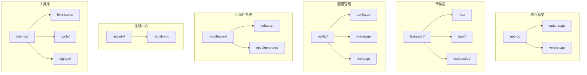
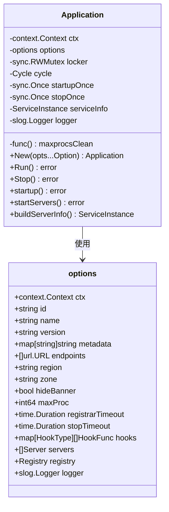
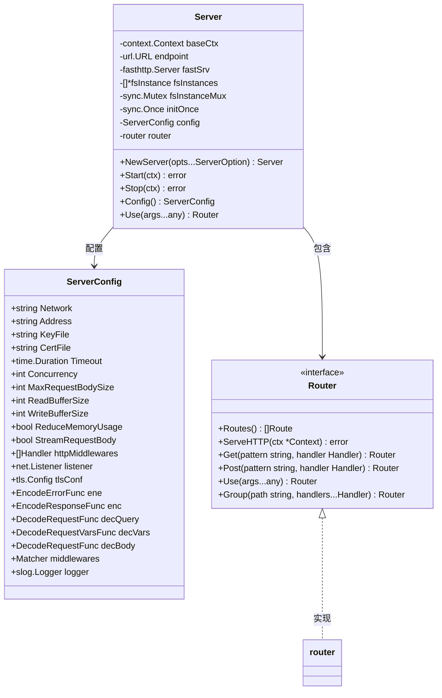
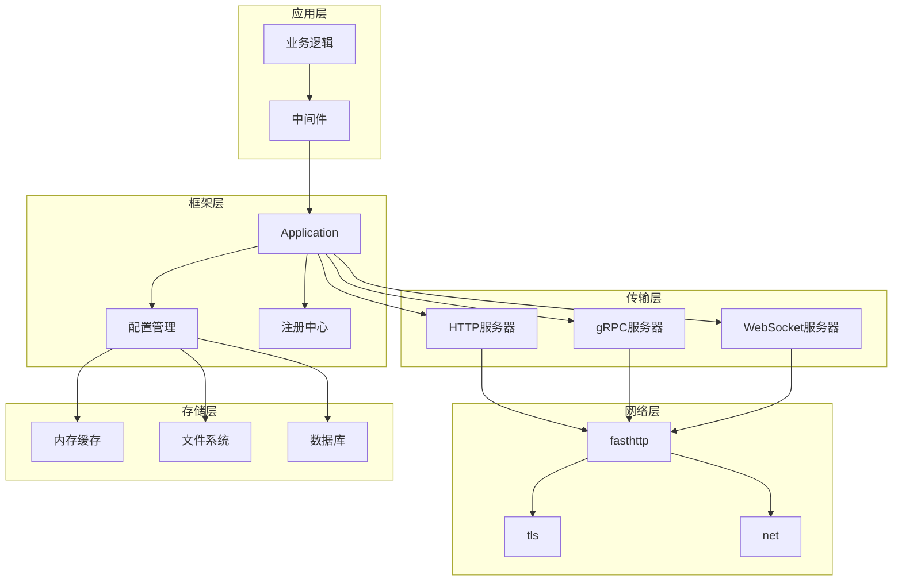
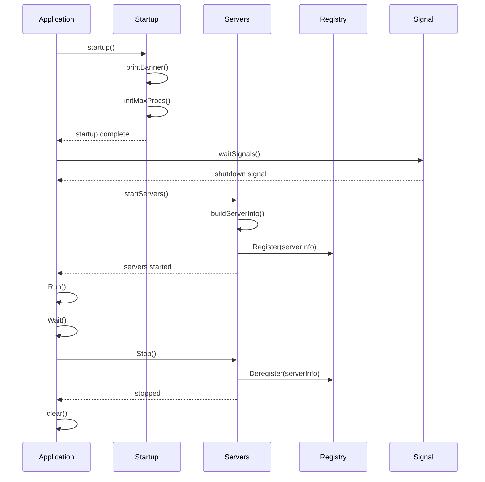
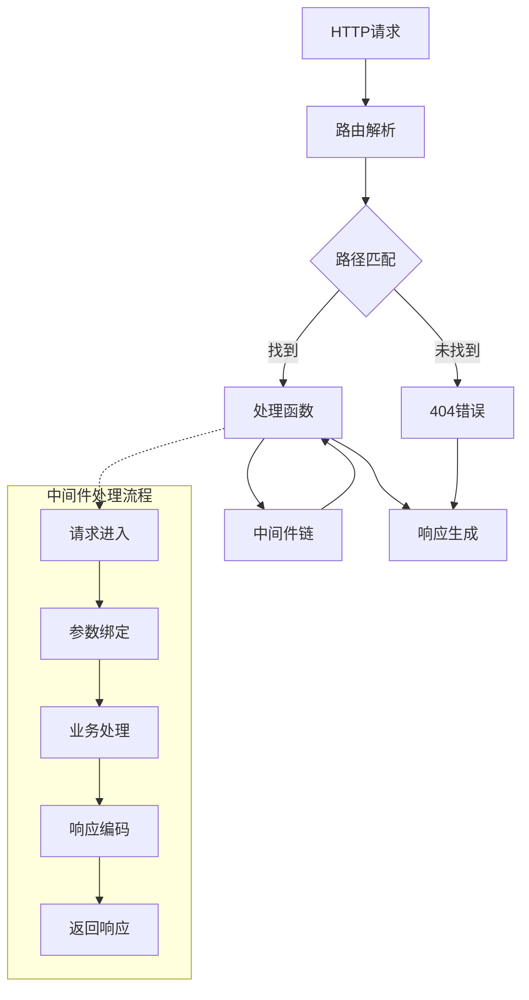
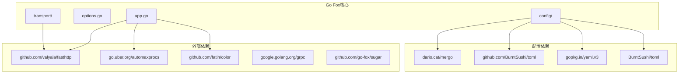

# 快速开始

<cite>
**本文档引用的文件**
- [README.md](file://README.md)
- [go.mod](file://go.mod)
- [app.go](file://app.go)
- [options.go](file://options.go)
- [version.go](file://version.go)
- [transport/http/server.go](file://transport/http/server.go)
- [transport/http/serveroptions.go](file://transport/http/serveroptions.go)
- [transport/http/router.go](file://transport/http/router.go)
- [transport/http/context.go](file://transport/http/context.go)
- [config/config.go](file://config/config.go)
</cite>

## 目录
1. [简介](#简介)
2. [项目结构](#项目结构)
3. [核心组件](#核心组件)
4. [架构概览](#架构概览)
5. [详细组件分析](#详细组件分析)
6. [依赖关系分析](#依赖关系分析)
7. [性能考虑](#性能考虑)
8. [故障排除指南](#故障排除指南)
9. [结论](#结论)

## 简介

Go Fox是一个现代化的微服务框架，专为Go语言设计，提供了完整的微服务解决方案。该框架基于高性能的fasthttp库，集成了服务发现、配置管理、中间件系统等功能，旨在简化微服务应用的开发和部署过程。

**章节来源**
- [README.md](file://README.md#L1-L3)

## 项目结构

Go Fox采用模块化的项目结构，主要分为以下几个核心目录：



**图表来源**
- [app.go](file://app.go#L24-L41)
- [transport/http/server.go](file://transport/http/server.go#L24-L42)
- [config/config.go](file://config/config.go#L24-L42)

**章节来源**
- [go.mod](file://go.mod#L1-L39)

## 核心组件

### 应用程序核心

Go Fox的核心是Application结构体，它负责管理整个应用程序的生命周期：



**图表来源**
- [app.go](file://app.go#L52-L63)
- [options.go](file://options.go#L54-L71)

### HTTP服务器组件

HTTP服务器是Go Fox的核心传输层组件，基于fasthttp实现：



**图表来源**
- [transport/http/server.go](file://transport/http/server.go#L53-L63)
- [transport/http/serveroptions.go](file://transport/http/serveroptions.go#L37-L60)
- [transport/http/router.go](file://transport/http/router.go#L41-L63)

**章节来源**
- [app.go](file://app.go#L24-L41)
- [transport/http/server.go](file://transport/http/server.go#L24-L42)

## 架构概览

Go Fox采用了分层架构设计，从底层传输层到上层业务逻辑都有清晰的职责划分：



**图表来源**
- [app.go](file://app.go#L105-L175)
- [transport/http/server.go](file://transport/http/server.go#L101-L133)

## 详细组件分析

### 应用程序生命周期管理

Go Fox的应用程序具有完整的生命周期管理机制：



**图表来源**
- [app.go](file://app.go#L105-L175)
- [app.go](file://app.go#L253-L282)

### HTTP路由系统

Go Fox的HTTP路由系统支持复杂的路径匹配和中间件链：



**图表来源**
- [transport/http/router.go](file://transport/http/router.go#L79-L128)
- [transport/http/context.go](file://transport/http/context.go#L118-L125)

**章节来源**
- [transport/http/router.go](file://transport/http/router.go#L41-L63)
- [transport/http/context.go](file://transport/http/context.go#L59-L78)

### 配置管理系统

Go Fox提供了灵活的配置管理功能：

```mermaid
classDiagram
class Config {
<<interface>>
+Load(sources...Source) error
+Scan(v interface{}) error
+Get(key string) Value
+Watch(key string, o Observer) error
+Close() error
}
class config {
-options opts
-Reader reader
-sync.Map cached
-sync.Map observers
-[]Watcher watchers
+Load() error
+Scan() error
+Get() Value
+Watch() error
+Close() error
-watch() void
}
class Source {
<<interface>>
+Load() Dataset
+Watch() Watcher
}
class Value {
<<interface>>
+Load() interface{}
+Scan(v interface{}) error
}
Config <|.. config : 实现
config --> Source : 使用
config --> Value : 缓存
```

**图表来源**
- [config/config.go](file://config/config.go#L52-L59)
- [config/config.go](file://config/config.go#L61-L68)

**章节来源**
- [config/config.go](file://config/config.go#L24-L42)

## 依赖关系分析

Go Fox的依赖关系相对简洁，主要依赖于高性能的第三方库：



**图表来源**
- [go.mod](file://go.mod#L5-L22)

**章节来源**
- [go.mod](file://go.mod#L1-L39)

## 性能考虑

Go Fox在设计时充分考虑了性能优化：

### 并发处理
- 使用fasthttp替代标准库net/http，提供更好的性能
- 支持自定义并发数配置
- 内置连接池和请求上下文复用

### 内存管理
- 使用对象池减少GC压力
- 可选的内存使用优化模式
- 流式请求体处理

### 网络优化
- 支持TCP和Unix Socket
- TLS配置支持
- 连接复用和Keep-Alive

## 故障排除指南

### 环境配置问题

**问题：Go版本不兼容**
- **症状**：编译时报错，提示Go版本过低
- **解决方案**：确保使用Go 1.23.6或更高版本
- **验证**：运行 `go version` 检查版本

**问题：依赖包下载失败**
- **症状**：go mod download报错
- **解决方案**：检查网络连接，必要时配置代理
- **验证**：尝试 `go mod tidy` 重新下载

### 服务器启动问题

**问题：端口被占用**
- **症状**：启动时显示端口冲突错误
- **解决方案**：修改服务器配置中的端口号
- **配置示例**：使用 `Address("0.0.0.0:8080")`

**问题：TLS证书加载失败**
- **症状**：启动时提示证书文件错误
- **解决方案**：确认证书文件路径正确且格式有效
- **配置示例**：设置 `KeyFile` 和 `CertFile` 参数

### 路由配置问题

**问题：路由无法匹配**
- **症状**：请求返回404错误
- **解决方案**：检查路由模式是否正确
- **调试**：使用 `Walk()` 方法查看所有已注册路由

**问题：中间件执行顺序错误**
- **症状**：中间件执行顺序不符合预期
- **解决方案**：检查中间件添加顺序
- **最佳实践**：先添加全局中间件，再添加特定路由中间件

### 性能相关问题

**问题：内存使用过高**
- **症状**：应用内存持续增长
- **解决方案**：启用内存优化模式
- **配置**：设置 `ReduceMemoryUsage(true)`

**问题：并发处理能力不足**
- **症状**：高并发场景下响应缓慢
- **解决方案**：调整并发数配置
- **配置**：设置 `Concurrency` 参数

**章节来源**
- [transport/http/serveroptions.go](file://transport/http/serveroptions.go#L107-L161)
- [transport/http/server.go](file://transport/http/server.go#L211-L234)

## 结论

Go Fox微服务框架为Go语言开发者提供了一个功能完整、性能优异的微服务解决方案。通过模块化的设计和丰富的配置选项，开发者可以快速构建可扩展的微服务应用。

### 主要优势
- 基于fasthttp的高性能HTTP处理
- 完整的微服务生命周期管理
- 灵活的配置管理和动态更新
- 丰富的中间件生态系统
- 简洁的API设计和良好的可扩展性

### 适用场景
- 微服务架构应用
- 高性能Web服务
- API网关和反向代理
- 分布式系统组件

### 下一步建议
1. 从简单的Hello World示例开始
2. 逐步添加中间件和业务逻辑
3. 配置监控和日志系统
4. 集成服务发现和配置中心
5. 部署到生产环境进行性能测试

通过遵循本指南，开发者可以快速掌握Go Fox框架的核心概念和使用方法，构建出高质量的微服务应用。