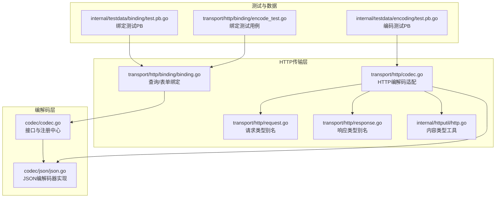
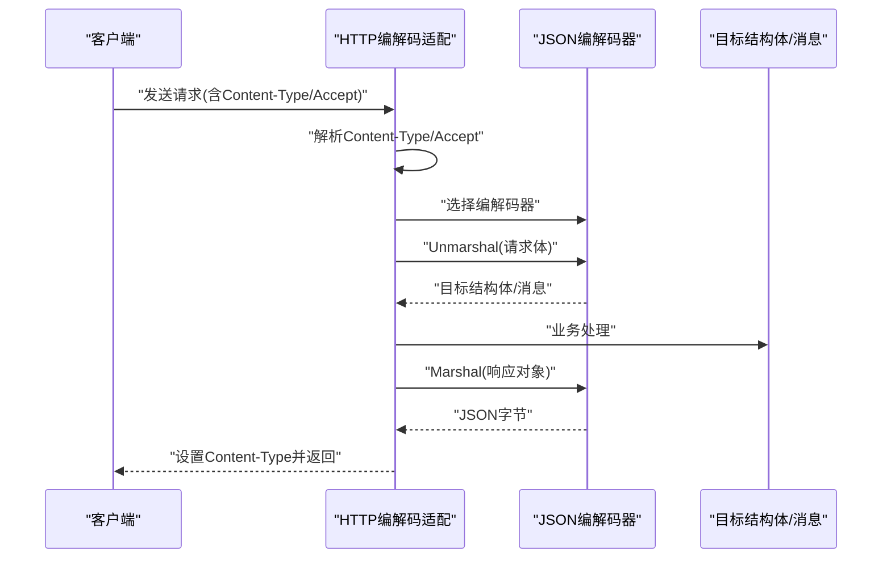
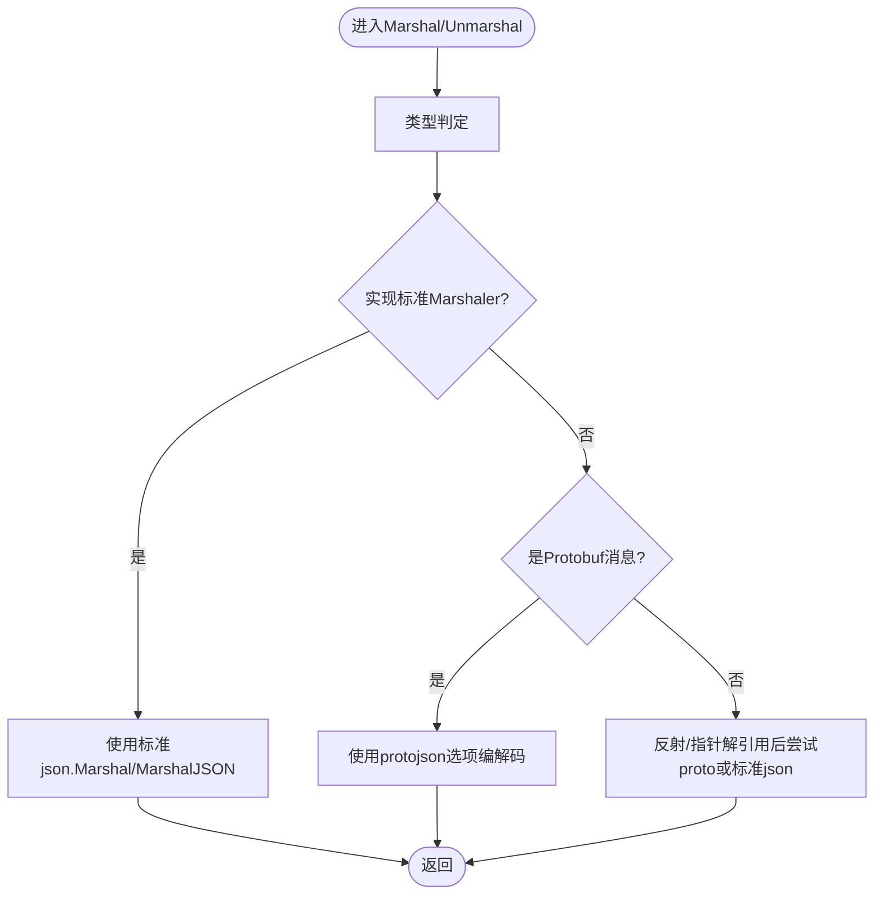
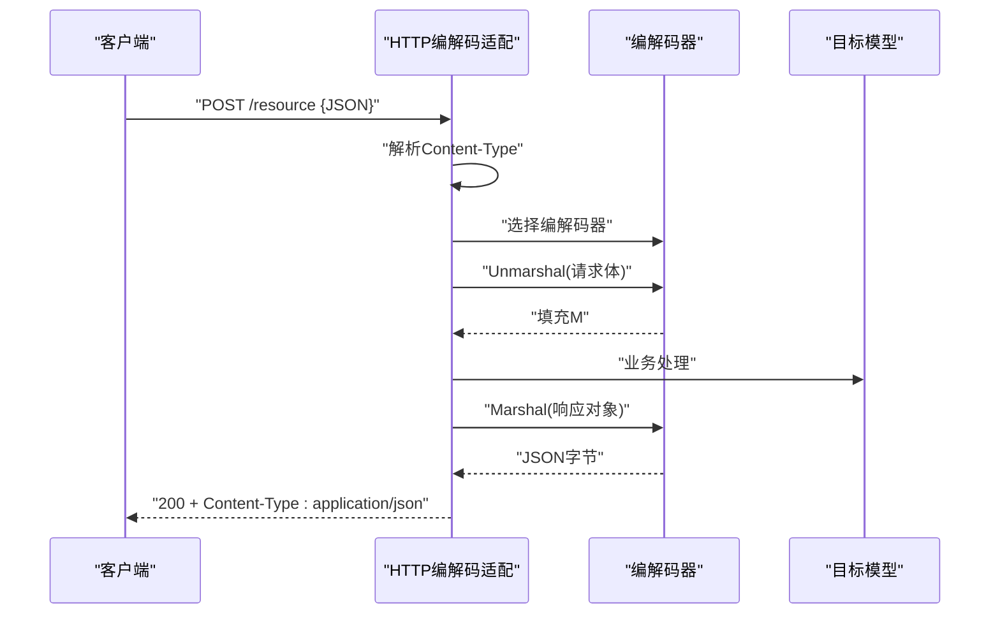
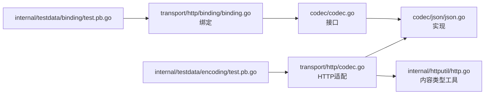

# JSON编解码器

<cite>
**本文引用的文件列表**
- [codec/json/json.go](file://codec/json/json.go)
- [codec/codec.go](file://codec/codec.go)
- [transport/http/codec.go](file://transport/http/codec.go)
- [transport/http/binding/binding.go](file://transport/http/binding/binding.go)
- [internal/httputil/http.go](file://internal/httputil/http.go)
- [transport/http/request.go](file://transport/http/request.go)
- [transport/http/response.go](file://transport/http/response.go)
- [internal/testdata/binding/test.pb.go](file://internal/testdata/binding/test.pb.go)
- [internal/testdata/encoding/test.pb.go](file://internal/testdata/encoding/test.pb.go)
- [transport/http/binding/encode_test.go](file://transport/http/binding/encode_test.go)
</cite>

## 目录
1. [简介](#简介)
2. [项目结构](#项目结构)
3. [核心组件](#核心组件)
4. [架构总览](#架构总览)
5. [组件详解](#组件详解)
6. [依赖关系分析](#依赖关系分析)
7. [性能与优化](#性能与优化)
8. [故障排查指南](#故障排查指南)
9. [结论](#结论)
10. [附录：使用示例与最佳实践](#附录使用示例与最佳实践)

## 简介
本文件面向Go Fox框架中的JSON编解码器，系统性阐述其设计与实现，覆盖以下主题：
- JSON编解码器的实现机制与扩展点（基于标准库json包与protojson）
- HTTP请求/响应中的编解码应用场景（请求体解析、响应体生成、错误处理）
- 数据结构映射规则（结构体字段映射、标签处理、嵌套对象、可选字段、Well-Known Types）
- 性能优化技巧与最佳实践
- 实际使用示例与常见错误处理方法

## 项目结构
围绕JSON编解码器的关键目录与文件如下：
- 编解码接口与注册中心：codec/codec.go
- JSON编解码器实现：codec/json/json.go
- HTTP层编解码适配：transport/http/codec.go
- 查询/表单绑定：transport/http/binding/binding.go
- 内容类型工具：internal/httputil/http.go
- HTTP请求/响应类型别名：transport/http/request.go、transport/http/response.go
- 测试数据（Protobuf消息）：internal/testdata/binding/test.pb.go、internal/testdata/encoding/test.pb.go
- 绑定单元测试：transport/http/binding/encode_test.go

图表来源
- [codec/codec.go](file://codec/codec.go#L31-L60)
- [codec/json/json.go](file://codec/json/json.go#L37-L103)
- [transport/http/codec.go](file://transport/http/codec.go#L65-L81)
- [transport/http/binding/binding.go](file://transport/http/binding/binding.go#L35-L49)
- [internal/httputil/http.go](file://internal/httputil/http.go#L37-L60)
- [transport/http/request.go](file://transport/http/request.go#L31-L39)
- [transport/http/response.go](file://transport/http/response.go#L31-L39)
- [internal/testdata/binding/test.pb.go](file://internal/testdata/binding/test.pb.go#L24-L38)
- [internal/testdata/encoding/test.pb.go](file://internal/testdata/encoding/test.pb.go#L25-L33)
- [transport/http/binding/encode_test.go](file://transport/http/binding/encode_test.go#L11-L127)

章节来源
- [codec/codec.go](file://codec/codec.go#L31-L60)
- [codec/json/json.go](file://codec/json/json.go#L37-L103)
- [transport/http/codec.go](file://transport/http/codec.go#L65-L81)
- [transport/http/binding/binding.go](file://transport/http/binding/binding.go#L35-L49)
- [internal/httputil/http.go](file://internal/httputil/http.go#L37-L60)
- [transport/http/request.go](file://transport/http/request.go#L31-L39)
- [transport/http/response.go](file://transport/http/response.go#L31-L39)
- [internal/testdata/binding/test.pb.go](file://internal/testdata/binding/test.pb.go#L24-L38)
- [internal/testdata/encoding/test.pb.go](file://internal/testdata/encoding/test.pb.go#L25-L33)
- [transport/http/binding/encode_test.go](file://transport/http/binding/encode_test.go#L11-L127)

## 核心组件
- 编解码接口与注册中心
  - 定义统一的编解码接口，提供注册与按名称获取编解码器的能力，支持多编解码器共存与动态选择。
- JSON编解码器
  - 实现标准JSON与Protobuf消息的编解码，支持自定义Marshal/Unmarshal选项（如是否输出未填充字段、是否丢弃未知字段）。
- HTTP编解码适配
  - 基于请求/响应头的Content-Type/ Accept选择具体编解码器，封装默认请求体解析、响应体生成、错误处理流程。
- 查询/表单绑定
  - 将URL查询参数或表单参数转换为目标结构体，便于HTTP路由参数与查询参数的统一处理。

章节来源
- [codec/codec.go](file://codec/codec.go#L33-L60)
- [codec/json/json.go](file://codec/json/json.go#L37-L103)
- [transport/http/codec.go](file://transport/http/codec.go#L65-L198)
- [transport/http/binding/binding.go](file://transport/http/binding/binding.go#L35-L49)

## 架构总览
JSON编解码器在HTTP传输层的典型工作流如下：
- 请求到达时，根据请求头的Content-Type选择对应编解码器，解析请求体到目标结构体（支持Protobuf消息与普通结构体）。
- 处理完成后，根据Accept头选择编解码器，将响应对象序列化为JSON并设置Content-Type返回。
- 错误发生时，根据Accept头选择编解码器，将错误对象序列化为JSON并设置状态码返回。

图表来源
- [transport/http/codec.go](file://transport/http/codec.go#L65-L100)
- [transport/http/codec.go](file://transport/http/codec.go#L124-L138)
- [transport/http/codec.go](file://transport/http/codec.go#L153-L163)
- [codec/json/json.go](file://codec/json/json.go#L71-L103)

章节来源
- [transport/http/codec.go](file://transport/http/codec.go#L65-L198)
- [codec/json/json.go](file://codec/json/json.go#L71-L103)

## 组件详解

### JSON编解码器实现机制
- 名称与注册
  - JSON编解码器名称固定为“json”，在初始化阶段通过注册中心完成注册，确保可通过名称检索。
- 编解码策略
  - Marshal优先判断是否实现了标准json.Marshaler接口；否则判断是否为Protobuf消息；否则使用标准json.Marshal。
  - Unmarshal优先判断是否实现了标准json.Unmarshaler接口；否则判断是否为Protobuf消息；否则对指针进行解引用并尝试Protobuf反序列化；最后回退到标准json.Unmarshal。
- 自定义配置
  - 提供可配置的MarshalOptions与UnmarshalOptions，分别控制是否输出未填充字段、是否丢弃未知字段等行为，满足不同场景需求。

图表来源
- [codec/json/json.go](file://codec/json/json.go#L71-L103)

章节来源
- [codec/json/json.go](file://codec/json/json.go#L37-L103)

### HTTP请求/响应中的JSON编解码
- 请求体解析
  - 根据请求头Content-Type选择编解码器，若未注册对应编解码器则报错；空请求体直接返回；解析失败返回错误。
- 路径/查询参数解析
  - 查询参数与表单参数通过绑定模块统一解析为目标结构体，支持Protobuf消息的字段映射与Well-Known Types处理。
- 响应体生成
  - 根据Accept头选择编解码器，将响应对象序列化为JSON并设置Content-Type。
- 错误处理
  - 默认错误处理器将错误对象序列化为JSON，并设置状态码返回。

图表来源
- [transport/http/codec.go](file://transport/http/codec.go#L124-L138)
- [transport/http/codec.go](file://transport/http/codec.go#L83-L100)
- [transport/http/codec.go](file://transport/http/codec.go#L153-L163)

章节来源
- [transport/http/codec.go](file://transport/http/codec.go#L65-L198)
- [transport/http/binding/binding.go](file://transport/http/binding/binding.go#L35-L49)

### 数据结构映射规则
- 结构体字段映射
  - JSON标签优先级高于字段名；Protobuf消息遵循protojson规范，字段名采用驼峰命名，且支持oneof可选字段。
- 嵌套对象处理
  - 支持嵌套结构体、切片、映射等复杂类型；Protobuf消息中map、repeated字段按protojson序列化规则处理。
- Well-Known Types
  - 对时间戳、持续时间、字节值、Struct、FieldMask等Well-Known Types提供专门的序列化/反序列化逻辑，确保与JSON规范一致。
- 查询/表单参数映射
  - 路由模板中的路径参数与查询参数通过绑定模块解析为目标结构体，支持嵌套字段与重复字段。

章节来源
- [internal/testdata/binding/test.pb.go](file://internal/testdata/binding/test.pb.go#L24-L38)
- [internal/testdata/encoding/test.pb.go](file://internal/testdata/encoding/test.pb.go#L25-L33)
- [transport/http/binding/binding.go](file://transport/http/binding/binding.go#L35-L49)
- [transport/http/binding/encode_test.go](file://transport/http/binding/encode_test.go#L11-L127)

## 依赖关系分析
- 接口与实现
  - 编解码接口定义在codec包，JSON编解码器实现遵循该接口并通过注册中心暴露能力。
- HTTP层适配
  - HTTP编解码适配依赖内容类型工具以解析Content-Type/Subtype，并通过编解码器完成请求/响应的编解码。
- 测试与数据
  - 测试数据采用Protobuf消息，验证编解码器对复杂结构体、嵌套对象、Well-Known Types的支持。

图表来源
- [codec/codec.go](file://codec/codec.go#L33-L38)
- [codec/json/json.go](file://codec/json/json.go#L54-L61)
- [transport/http/codec.go](file://transport/http/codec.go#L65-L81)
- [internal/httputil/http.go](file://internal/httputil/http.go#L37-L60)
- [transport/http/binding/binding.go](file://transport/http/binding/binding.go#L35-L49)
- [internal/testdata/binding/test.pb.go](file://internal/testdata/binding/test.pb.go#L24-L38)
- [internal/testdata/encoding/test.pb.go](file://internal/testdata/encoding/test.pb.go#L25-L33)

章节来源
- [codec/codec.go](file://codec/codec.go#L33-L60)
- [codec/json/json.go](file://codec/json/json.go#L54-L61)
- [transport/http/codec.go](file://transport/http/codec.go#L65-L81)
- [internal/httputil/http.go](file://internal/httputil/http.go#L37-L60)
- [transport/http/binding/binding.go](file://transport/http/binding/binding.go#L35-L49)
- [internal/testdata/binding/test.pb.go](file://internal/testdata/binding/test.pb.go#L24-L38)
- [internal/testdata/encoding/test.pb.go](file://internal/testdata/encoding/test.pb.go#L25-L33)

## 性能与优化
- 编解码器选择
  - 通过Content-Type/Accept快速定位编解码器，避免不必要的字符串解析与分支判断。
- 反射与指针优化
  - 在Unmarshal中对指针进行解引用，减少重复的类型断言与反射开销；仅在必要时进行反射操作。
- Protobuf选项
  - 合理配置MarshalOptions/UnmarshalOptions，避免输出过多未填充字段或处理未知字段带来的额外开销。
- 字符串与字节处理
  - 使用内部工具进行字符串与字节的高效转换，减少中间拷贝与分配。
- 并发安全
  - 注册中心使用并发安全的存储结构，确保在高并发场景下的稳定性。

章节来源
- [codec/json/json.go](file://codec/json/json.go#L71-L103)
- [transport/http/codec.go](file://transport/http/codec.go#L65-L81)
- [internal/httputil/http.go](file://internal/httputil/http.go#L37-L60)

## 故障排查指南
- 未注册的Content-Type
  - 当请求头Content-Type未注册对应编解码器时，请求体解析会返回错误；检查编解码器注册与Content-Type是否匹配。
- 请求体为空
  - 空请求体直接返回成功，无需解析；确认业务逻辑是否期望空体。
- 解析失败
  - 请求体解析失败时返回错误；检查JSON格式、字段类型与大小写、Protobuf消息版本兼容性。
- 响应头不匹配
  - 响应头Content-Type与实际编解码器不一致可能导致客户端解析异常；确保响应头与编解码器一致。
- 错误序列化失败
  - 错误处理器在序列化失败时会降级设置状态码并返回；检查错误对象结构与编解码器配置。

章节来源
- [transport/http/codec.go](file://transport/http/codec.go#L124-L138)
- [transport/http/codec.go](file://transport/http/codec.go#L153-L163)

## 结论
Go Fox的JSON编解码器通过统一接口与注册机制，结合HTTP层的编解码适配，提供了灵活、可扩展且高性能的JSON编解码能力。其对Protobuf消息与Well-Known Types的良好支持，使得在微服务与协议交互场景中具备更强的表达力与兼容性。通过合理配置编解码选项与遵循最佳实践，可在保证正确性的前提下获得更优的性能表现。

## 附录：使用示例与最佳实践

### 常见JSON编解码场景
- 请求体解析（JSON）
  - 使用HTTP默认请求体解析函数，自动根据Content-Type选择编解码器，解析到目标结构体或Protobuf消息。
- 响应体生成（JSON）
  - 使用HTTP默认响应处理器，自动根据Accept头选择编解码器，将响应对象序列化为JSON并设置Content-Type。
- 错误处理（JSON）
  - 使用HTTP默认错误处理器，将错误对象序列化为JSON并设置状态码返回。

章节来源
- [transport/http/codec.go](file://transport/http/codec.go#L83-L100)
- [transport/http/codec.go](file://transport/http/codec.go#L124-L138)
- [transport/http/codec.go](file://transport/http/codec.go#L153-L163)

### 数据结构映射示例
- Protobuf消息映射
  - 结构体字段通过JSON标签映射到JSON键；嵌套消息、map、repeated字段按protojson规则序列化。
- 查询/表单参数映射
  - 路由模板中的路径参数与查询参数通过绑定模块解析为目标结构体，支持嵌套字段与重复字段。

章节来源
- [internal/testdata/binding/test.pb.go](file://internal/testdata/binding/test.pb.go#L24-L38)
- [internal/testdata/encoding/test.pb.go](file://internal/testdata/encoding/test.pb.go#L25-L33)
- [transport/http/binding/binding.go](file://transport/http/binding/binding.go#L35-L49)
- [transport/http/binding/encode_test.go](file://transport/http/binding/encode_test.go#L11-L127)

### 最佳实践
- 明确Content-Type与Accept
  - 在客户端与服务端保持一致的Content-Type与Accept，避免编解码器选择错误。
- 合理使用Protobuf
  - 对需要强类型与跨语言兼容的场景使用Protobuf消息，并利用Well-Known Types提升表达力。
- 控制编解码选项
  - 根据业务需求调整MarshalOptions/UnmarshalOptions，平衡可读性与体积。
- 错误处理规范化
  - 使用统一的错误处理器，确保错误信息结构一致，便于客户端解析与日志记录。