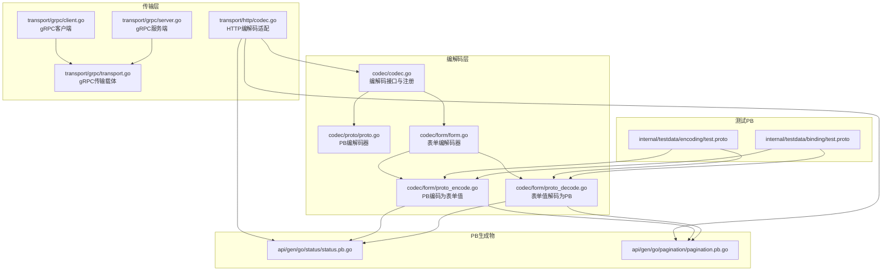
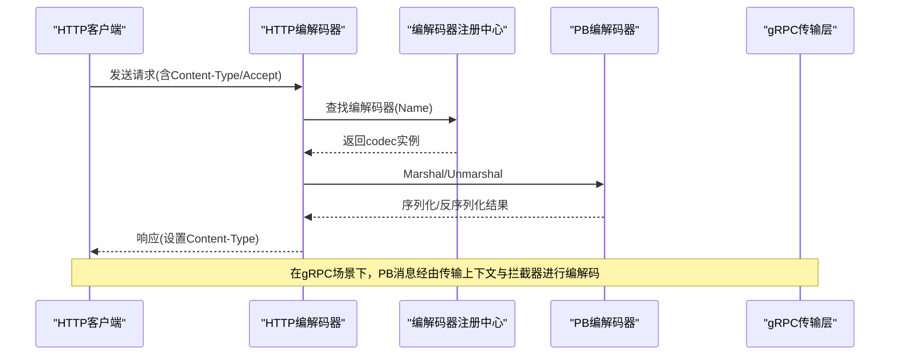
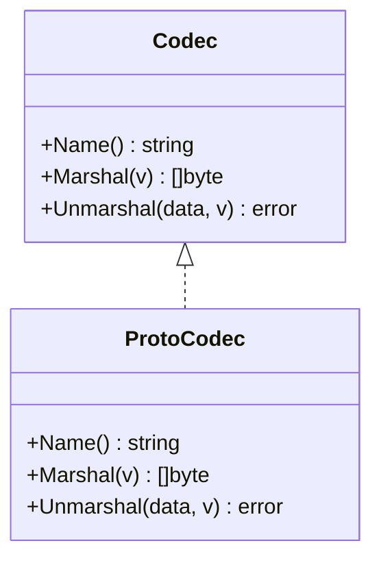
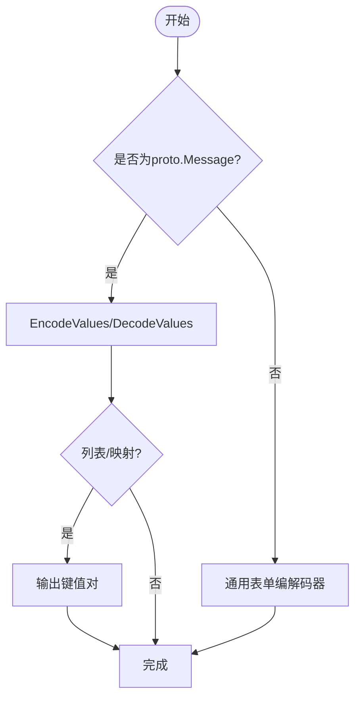
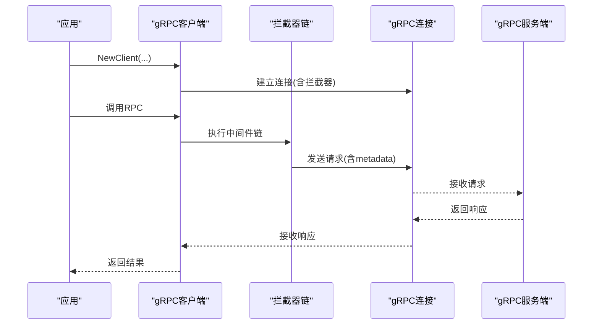
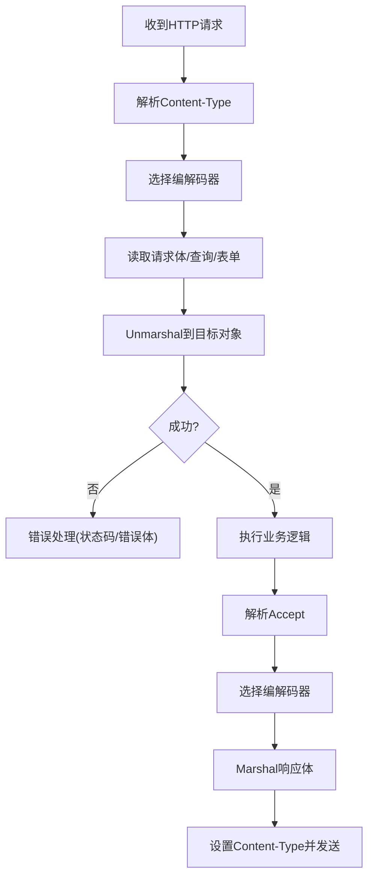
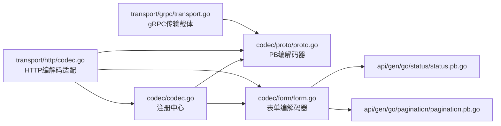

# Protocol Buffers编解码器

<cite>
**本文引用的文件**
- [codec/proto/proto.go](file://codec/proto/proto.go)
- [codec/form/form.go](file://codec/form/form.go)
- [codec/form/proto_encode.go](file://codec/form/proto_encode.go)
- [codec/form/proto_decode.go](file://codec/form/proto_decode.go)
- [codec/codec.go](file://codec/codec.go)
- [transport/grpc/client.go](file://transport/grpc/client.go)
- [transport/grpc/server.go](file://transport/grpc/server.go)
- [transport/grpc/transport.go](file://transport/grpc/transport.go)
- [transport/http/codec.go](file://transport/http/codec.go)
- [api/gen/go/status/status.pb.go](file://api/gen/go/status/status.pb.go)
- [api/gen/go/pagination/pagination.pb.go](file://api/gen/go/pagination/pagination.pb.go)
- [internal/testdata/encoding/test.proto](file://internal/testdata/encoding/test.proto)
- [internal/testdata/binding/test.proto](file://internal/testdata/binding/test.proto)
- [cmd/protoc-gen-fox-http/main.go](file://cmd/protoc-gen-fox-http/main.go)
</cite>

## 目录
1. [简介](#简介)
2. [项目结构](#项目结构)
3. [核心组件](#核心组件)
4. [架构总览](#架构总览)
5. [组件详解](#组件详解)
6. [依赖关系分析](#依赖关系分析)
7. [性能考量](#性能考量)
8. [故障排查指南](#故障排查指南)
9. [结论](#结论)
10. [附录：PB消息定义最佳实践与示例](#附录pb消息定义最佳实践与示例)

## 简介
本技术文档聚焦于Go Fox中的Protocol Buffers（PB）编解码器，系统性阐述其在框架内的集成方案、PB消息类型处理机制、序列化优化策略、在gRPC与HTTP通信中的作用与性能优势，并给出PB数据结构定义、字段映射规则、与HTTP结合使用的实践、最佳实践与性能优化建议，以及完整使用示例与常见问题解决方案。

## 项目结构
围绕PB编解码的关键模块与文件如下：
- 编解码接口与注册中心：codec/codec.go
- PB编解码器实现：codec/proto/proto.go
- 表单与PB互操作：codec/form/form.go、codec/form/proto_encode.go、codec/form/proto_decode.go
- gRPC传输层：transport/grpc/client.go、transport/grpc/server.go、transport/grpc/transport.go
- HTTP编解码适配：transport/http/codec.go
- PB生成代码示例：api/gen/go/status/status.pb.go、api/gen/go/pagination/pagination.pb.go
- 测试用PB定义：internal/testdata/encoding/test.proto、internal/testdata/binding/test.proto
- PB到HTTP代码生成插件：cmd/protoc-gen-fox-http/main.go

图表来源
- [codec/codec.go](file://codec/codec.go#L31-L60)
- [codec/proto/proto.go](file://codec/proto/proto.go#L45-L62)
- [codec/form/form.go](file://codec/form/form.go#L35-L92)
- [codec/form/proto_encode.go](file://codec/form/proto_encode.go#L16-L30)
- [codec/form/proto_decode.go](file://codec/form/proto_decode.go#L27-L35)
- [transport/grpc/client.go](file://transport/grpc/client.go#L55-L134)
- [transport/grpc/server.go](file://transport/grpc/server.go#L50-L119)
- [transport/grpc/transport.go](file://transport/grpc/transport.go#L39-L118)
- [transport/http/codec.go](file://transport/http/codec.go#L65-L198)
- [api/gen/go/status/status.pb.go](file://api/gen/go/status/status.pb.go#L25-L91)
- [api/gen/go/pagination/pagination.pb.go](file://api/gen/go/pagination/pagination.pb.go#L148-L200)
- [internal/testdata/encoding/test.proto](file://internal/testdata/encoding/test.proto#L9-L19)
- [internal/testdata/binding/test.proto](file://internal/testdata/binding/test.proto#L10-L23)

章节来源
- [codec/codec.go](file://codec/codec.go#L31-L60)
- [codec/proto/proto.go](file://codec/proto/proto.go#L45-L62)
- [codec/form/form.go](file://codec/form/form.go#L35-L92)
- [transport/grpc/client.go](file://transport/grpc/client.go#L55-L134)
- [transport/grpc/server.go](file://transport/grpc/server.go#L50-L119)
- [transport/grpc/transport.go](file://transport/grpc/transport.go#L39-L118)
- [transport/http/codec.go](file://transport/http/codec.go#L65-L198)

## 核心组件
- 编解码接口与注册中心：统一的编解码器注册与查找机制，支持按名称获取具体编解码器实例。
- PB编解码器：基于google.golang.org/protobuf，提供Marshal/Unmarshal能力，注册为“proto”名称。
- 表单编解码器：支持将PB消息编码为application/x-www-form-urlencoded或从表单解析回PB消息，兼容well-known types。
- gRPC传输层：提供gRPC客户端与服务端，内置拦截器链路，承载PB消息的传输上下文。
- HTTP编解码适配：根据Content-Type/ Accept选择编解码器，统一请求/响应编解码与错误处理。
- PB生成物与测试PB：展示PB消息结构、字段映射、枚举、oneof、optional等特性。

章节来源
- [codec/codec.go](file://codec/codec.go#L33-L60)
- [codec/proto/proto.go](file://codec/proto/proto.go#L34-L62)
- [codec/form/form.go](file://codec/form/form.go#L13-L92)
- [transport/grpc/transport.go](file://transport/grpc/transport.go#L39-L118)
- [transport/http/codec.go](file://transport/http/codec.go#L65-L198)

## 架构总览
PB编解码器在系统中承担“跨协议桥接”的角色：在HTTP层通过Content-Type选择合适的编解码器，在gRPC层通过传输上下文与拦截器传递PB消息。表单编解码器作为PB与传统Web表单交互的桥梁，支持复杂嵌套结构、列表、映射与well-known types的双向转换。

图表来源
- [transport/http/codec.go](file://transport/http/codec.go#L65-L198)
- [codec/codec.go](file://codec/codec.go#L52-L60)
- [codec/proto/proto.go](file://codec/proto/proto.go#L53-L61)

## 组件详解

### PB编解码器（codec/proto）
- 注册机制：在包初始化时注册名为“proto”的编解码器。
- 核心方法：
  - Name(): 返回编解码器名称
  - Marshal(v): 将实现了proto.Message的v序列化为字节
  - Unmarshal(data, v): 将字节反序列化到实现了proto.Message的v

图表来源
- [codec/codec.go](file://codec/codec.go#L33-L38)
- [codec/proto/proto.go](file://codec/proto/proto.go#L45-L62)

章节来源
- [codec/proto/proto.go](file://codec/proto/proto.go#L34-L62)

### 表单与PB互操作（codec/form）
- 支持对proto.Message的特殊处理：当输入为proto.Message时，使用EncodeValues/DecodeValues进行字段级编码/解码；否则委托给通用表单编解码器。
- 字段编码规则：
  - 列表：每个元素单独作为同名键值
  - 映射：使用“key[]”或“key[subkey]”形式
  - oneof：仅设置当前选中字段
  - well-known types：时间戳、持续时间、包装类型、字段掩码、结构体等有专门处理
- 字段解码规则：
  - 支持布尔、整数、浮点、字符串、字节、消息等类型
  - well-known types：解析为对应PB类型
  - 错误处理：字段路径非法、类型不匹配、枚举未注册等情况返回明确错误

图表来源
- [codec/form/form.go](file://codec/form/form.go#L41-L86)
- [codec/form/proto_encode.go](file://codec/form/proto_encode.go#L32-L97)
- [codec/form/proto_decode.go](file://codec/form/proto_decode.go#L37-L82)

章节来源
- [codec/form/form.go](file://codec/form/form.go#L13-L92)
- [codec/form/proto_encode.go](file://codec/form/proto_encode.go#L16-L177)
- [codec/form/proto_decode.go](file://codec/form/proto_decode.go#L27-L374)

### gRPC传输与拦截器（transport/grpc）
- 客户端：
  - 创建gRPC连接，注入拦截器链，将请求头写入metadata
  - 支持超时、中间件链、过滤器、负载均衡配置
- 服务端：
  - 创建gRPC服务，注册健康检查
  - 提供中间件匹配器，按路径/服务维度应用中间件
- 传输载体：
  - 实现统一的Transporter接口，封装endpoint、operation、headers、节点过滤器等

图表来源
- [transport/grpc/client.go](file://transport/grpc/client.go#L61-L134)
- [transport/grpc/server.go](file://transport/grpc/server.go#L60-L119)
- [transport/grpc/transport.go](file://transport/grpc/transport.go#L39-L118)

章节来源
- [transport/grpc/client.go](file://transport/grpc/client.go#L55-L134)
- [transport/grpc/server.go](file://transport/grpc/server.go#L50-L119)
- [transport/grpc/transport.go](file://transport/grpc/transport.go#L39-L118)

### HTTP编解码适配（transport/http）
- 请求解码：
  - 根据Content-Type选择编解码器，默认JSON
  - 支持查询参数、路径参数、表单、请求体解码
- 响应编码：
  - 根据Accept选择编解码器，默认JSON
  - 设置Content-Type并发送数据
- 错误处理：
  - 将错误转换为统一错误结构，按Accept选择编码器返回

图表来源
- [transport/http/codec.go](file://transport/http/codec.go#L65-L198)

章节来源
- [transport/http/codec.go](file://transport/http/codec.go#L65-L198)

## 依赖关系分析
- 编解码器注册中心（codec/codec.go）是所有编解码器的统一入口，PB与表单编解码器均在此注册。
- HTTP编解码器依赖编解码器注册中心按Content-Type/Accept动态选择具体编解码器。
- gRPC传输层通过拦截器链与传输载体，将PB消息以高效二进制形式在网络上传输。
- 表单编解码器与PB生成物（status、pagination）及测试PB紧密配合，确保字段映射与well-known types的正确处理。

图表来源
- [codec/codec.go](file://codec/codec.go#L40-L60)
- [codec/proto/proto.go](file://codec/proto/proto.go#L39-L43)
- [codec/form/form.go](file://codec/form/form.go#L29-L33)
- [transport/http/codec.go](file://transport/http/codec.go#L65-L81)
- [transport/grpc/transport.go](file://transport/grpc/transport.go#L39-L47)
- [api/gen/go/status/status.pb.go](file://api/gen/go/status/status.pb.go#L25-L33)
- [api/gen/go/pagination/pagination.pb.go](file://api/gen/go/pagination/pagination.pb.go#L148-L159)

章节来源
- [codec/codec.go](file://codec/codec.go#L40-L60)
- [transport/http/codec.go](file://transport/http/codec.go#L65-L81)
- [transport/grpc/transport.go](file://transport/grpc/transport.go#L39-L47)

## 性能考量
- PB序列化/反序列化性能优势：
  - 二进制格式紧凑，解析速度快，适合高吞吐量场景
  - 与gRPC默认编解码一致，避免额外转换开销
- HTTP场景下的优化：
  - 优先使用PB作为Content-Type，减少序列化成本
  - 对大对象采用分页/字段投影（参考pagination.pb）降低带宽
- 表单与PB互操作：
  - EncodeValues/DecodeValues按字段递归处理，避免不必要的反射开销
  - well-known types直接映射，减少字符串解析次数
- 并发安全：
  - 注册中心使用并发安全的map，编解码器实例无状态，可安全复用

## 故障排查指南
- 编解码器未注册：
  - 现象：HTTP请求报错“unregister Content-Type”
  - 处理：确认已注册相应编解码器（如“proto”）
- PB消息字段缺失或类型不匹配：
  - 现象：Unmarshal失败或字段为空
  - 处理：检查PB定义、字段映射、oneof是否冲突
- 表单解析异常：
  - 现象：DecodeValues报错“invalid path”或“too many values”
  - 处理：核对字段路径、列表/映射语法、枚举值是否注册
- well-known types解析失败：
  - 现象：时间戳/持续时间/字节数组解析错误
  - 处理：确认输入格式符合规范（RFC3339、Base64等）

章节来源
- [transport/http/codec.go](file://transport/http/codec.go#L124-L138)
- [codec/form/proto_decode.go](file://codec/form/proto_decode.go#L37-L82)
- [codec/form/proto_decode.go](file://codec/form/proto_decode.go#L157-L234)

## 结论
Go Fox的PB编解码器通过统一的注册与适配机制，无缝衔接gRPC与HTTP两大传输层，既保证了PB二进制编解码的高性能，又提供了与表单等传统协议的互操作能力。借助well-known types与完善的字段映射规则，开发者可以快速构建高性能、可维护的微服务通信层。

## 附录：PB消息定义最佳实践与示例

### PB数据结构定义与字段映射规则
- 字段编号与可选性：
  - 使用稳定的字段编号，避免修改已有编号
  - optional用于可选字段，提升向前/向后兼容性
- oneof使用：
  - 互斥字段使用oneof，避免同时设置多个字段
- 列表与映射：
  - 列表字段使用repeated，映射字段使用map<key, value>
- well-known types：
  - 时间戳、持续时间、包装类型、字段掩码、结构体等优先使用
- JSON命名：
  - 通过json_name选项控制JSON字段名，保持与前端约定一致

章节来源
- [internal/testdata/binding/test.proto](file://internal/testdata/binding/test.proto#L10-L23)
- [internal/testdata/encoding/test.proto](file://internal/testdata/encoding/test.proto#L9-L19)
- [api/gen/go/pagination/pagination.pb.go](file://api/gen/go/pagination/pagination.pb.go#L148-L200)

### PB编解码器与HTTP结合使用
- 请求体编解码：
  - Content-Type: application/protobuf 或 application/json
  - 通过HTTP编解码器自动选择编解码器并解析请求体
- 响应体编解码：
  - Accept: application/protobuf 或 application/json
  - 自动设置Content-Type并序列化响应
- 错误处理：
  - 统一错误结构，按Accept返回对应格式

章节来源
- [transport/http/codec.go](file://transport/http/codec.go#L65-L198)

### PB编解码器在gRPC中的作用与性能优势
- 默认编解码：
  - gRPC默认使用PB，无需额外转换，减少CPU与内存消耗
- 元数据传递：
  - 通过拦截器将自定义头部写入metadata，PB消息与元数据高效传输
- 负载均衡与发现：
  - 集成负载均衡与服务发现，PB消息在多节点间稳定传输

章节来源
- [transport/grpc/client.go](file://transport/grpc/client.go#L136-L169)
- [transport/grpc/server.go](file://transport/grpc/server.go#L91-L118)
- [transport/grpc/transport.go](file://transport/grpc/transport.go#L39-L118)

### PB消息定义最佳实践
- 字段命名：
  - 使用snake_case命名，保持一致性
- 枚举与扩展：
  - 使用枚举替代字符串常量，必要时使用扩展字段
- 版本兼容：
  - 新增字段使用新编号，避免删除或重用旧编号
- oneof与optional：
  - 互斥字段使用oneof，可选字段使用optional
- well-known types：
  - 优先使用标准类型，减少自定义类型带来的兼容性问题

章节来源
- [internal/testdata/binding/test.proto](file://internal/testdata/binding/test.proto#L26-L43)
- [api/gen/go/status/status.pb.go](file://api/gen/go/status/status.pb.go#L25-L33)

### PB编解码使用示例（步骤说明）
- 定义PB消息：
  - 参考测试PB定义，编写proto文件并生成Go代码
- 注册编解码器：
  - PB编解码器在包初始化时自动注册，无需手动调用
- HTTP请求：
  - 设置Content-Type为application/protobuf或application/json
  - 使用HTTP编解码器自动选择编解码器并处理请求/响应
- gRPC调用：
  - 通过gRPC客户端发起RPC，PB消息自动序列化/反序列化
- 表单互操作：
  - 对于需要与表单交互的场景，使用表单编解码器将PB编码为表单值或从表单解析为PB

章节来源
- [internal/testdata/encoding/test.proto](file://internal/testdata/encoding/test.proto#L1-L20)
- [codec/proto/proto.go](file://codec/proto/proto.go#L39-L43)
- [transport/http/codec.go](file://transport/http/codec.go#L65-L198)
- [transport/grpc/client.go](file://transport/grpc/client.go#L136-L169)

### 常见问题与解决方案
- Content-Type未注册：
  - 确认编解码器已注册，或使用受支持的Content-Type
- 字段路径错误：
  - 检查表单字段路径与PB字段层级是否一致
- 枚举未注册：
  - 确保枚举已在全局类型注册表中
- well-known types格式错误：
  - 按规范提供时间戳(RFC3339)、字节(Base64)等格式

章节来源
- [transport/http/codec.go](file://transport/http/codec.go#L124-L138)
- [codec/form/proto_decode.go](file://codec/form/proto_decode.go#L157-L234)
- [codec/form/proto_decode.go](file://codec/form/proto_decode.go#L353-L374)