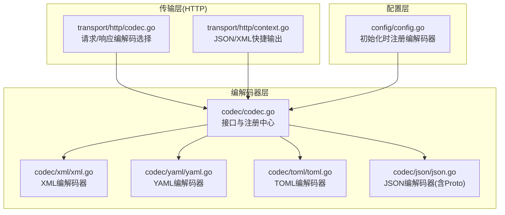
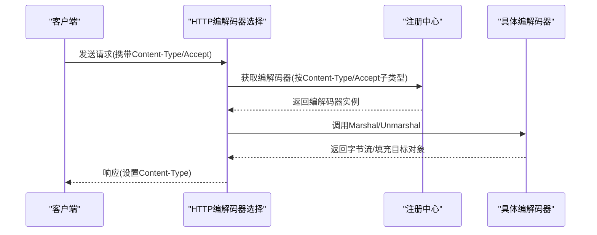
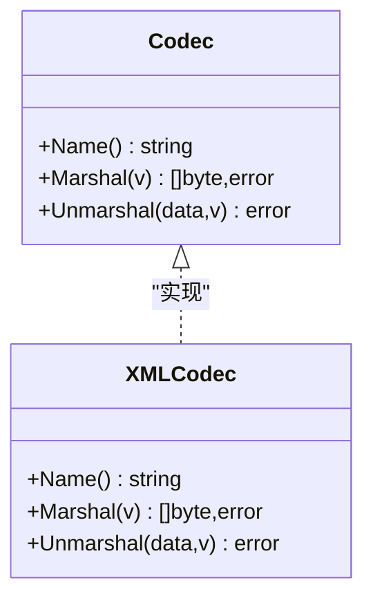
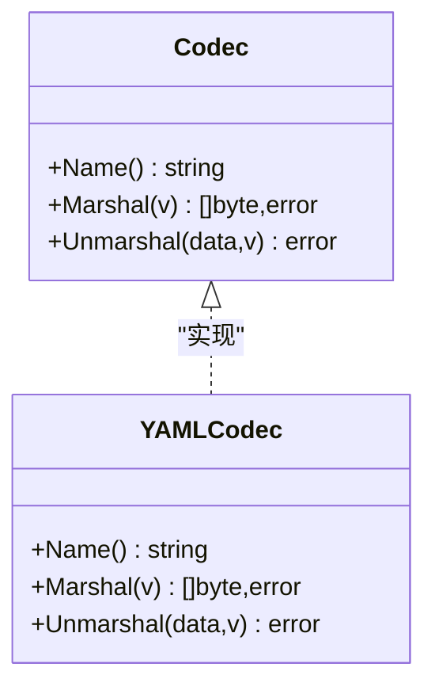
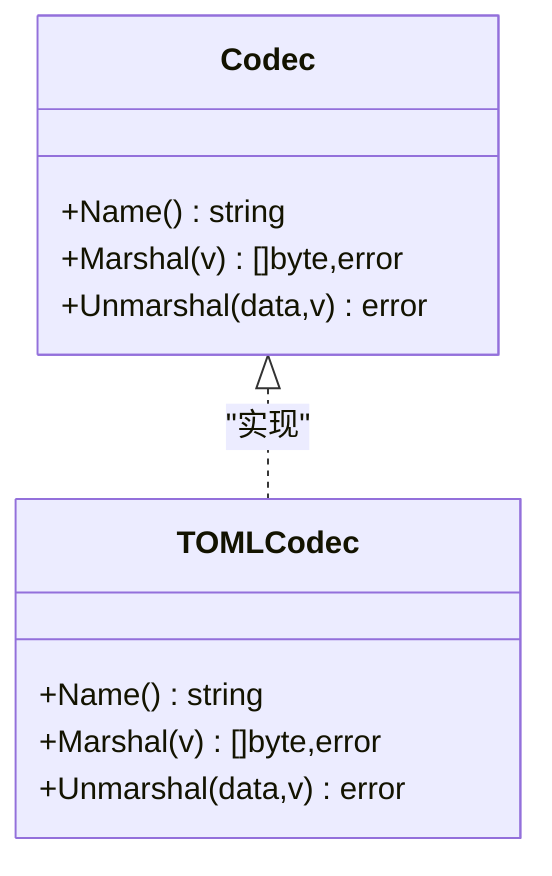
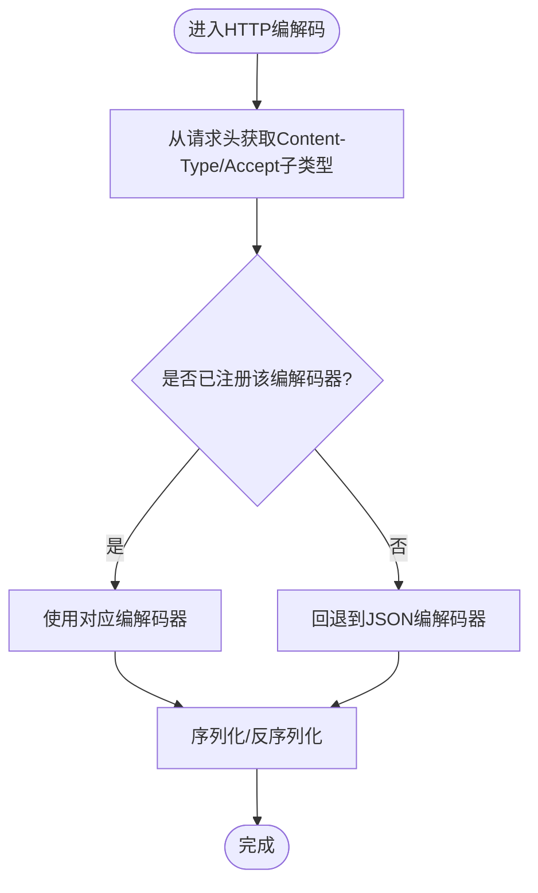
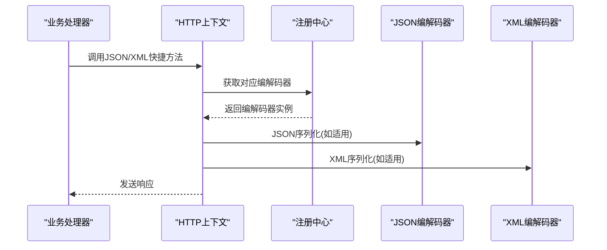
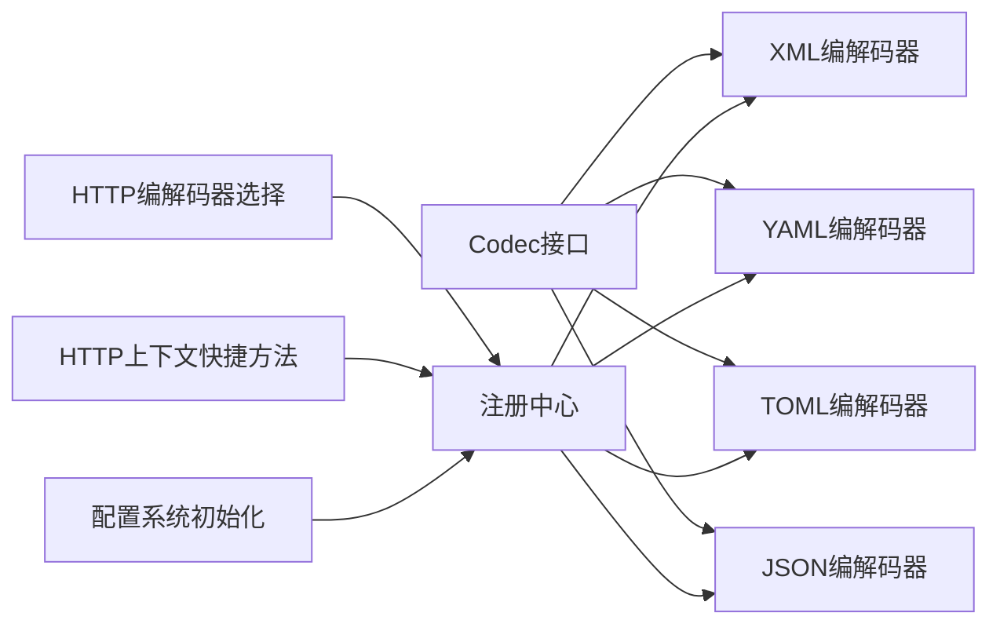

# XML、YAML、TOML编解码器

<cite>
**本文引用的文件**
- [codec/codec.go](file://codec/codec.go)
- [codec/xml/xml.go](file://codec/xml/xml.go)
- [codec/yaml/yaml.go](file://codec/yaml/yaml.go)
- [codec/toml/toml.go](file://codec/toml/toml.go)
- [codec/json/json.go](file://codec/json/json.go)
- [transport/http/codec.go](file://transport/http/codec.go)
- [transport/http/context.go](file://transport/http/context.go)
- [config/config.go](file://config/config.go)
</cite>

## 目录
1. [简介](#简介)
2. [项目结构](#项目结构)
3. [核心组件](#核心组件)
4. [架构总览](#架构总览)
5. [组件详解](#组件详解)
6. [依赖关系分析](#依赖关系分析)
7. [性能与特性对比](#性能与特性对比)
8. [故障排查指南](#故障排查指南)
9. [结论](#结论)
10. [附录：选择指南与最佳实践](#附录选择指南与最佳实践)

## 简介
本文件面向 Go Fox 框架中的 XML、YAML、TOML 编解码器，系统性梳理其接口设计、实现机制、运行时集成方式与典型使用场景，并提供跨格式的对比分析与选型建议。读者无需深入底层即可理解如何在 HTTP 请求/响应、配置加载、缓存序列化等场景中正确选择与使用这些编解码器。

## 项目结构
围绕编解码器的关键目录与文件如下：
- codec 接口与注册中心：codec/codec.go
- 各格式编解码器实现：codec/xml、codec/yaml、codec/toml
- JSON 特殊处理（含 Protobuf 支持）：codec/json
- HTTP 层编解码器选择与默认编解码流程：transport/http/codec.go
- HTTP 上下文便捷方法（JSON/XML 快捷输出）：transport/http/context.go
- 配置系统初始化时自动注册各编解码器：config/config.go

图表来源
- [codec/codec.go](file://codec/codec.go#L31-L60)
- [codec/xml/xml.go](file://codec/xml/xml.go#L36-L42)
- [codec/yaml/yaml.go](file://codec/yaml/yaml.go#L37-L42)
- [codec/toml/toml.go](file://codec/toml/toml.go#L38-L46)
- [codec/json/json.go](file://codec/json/json.go#L51-L60)
- [transport/http/codec.go](file://transport/http/codec.go#L65-L81)
- [transport/http/context.go](file://transport/http/context.go#L380-L402)
- [config/config.go](file://config/config.go#L36-L41)

章节来源
- [codec/codec.go](file://codec/codec.go#L31-L60)
- [transport/http/codec.go](file://transport/http/codec.go#L65-L81)
- [transport/http/context.go](file://transport/http/context.go#L380-L402)
- [config/config.go](file://config/config.go#L36-L41)

## 核心组件
- Codec 接口：统一的编解码器抽象，定义名称、序列化、反序列化三个方法。
- 注册中心：通过字符串键名注册与获取编解码器实例，大小写不敏感。
- 具体编解码器：
  - XML：基于标准库 encoding/xml 的轻量封装。
  - YAML：基于 gopkg.in/yaml.v3 的轻量封装。
  - TOML：基于 github.com/BurntSushi/toml 的轻量封装。
  - JSON：基于标准库 encoding/json，并扩展对 proto.Message 的支持与选项控制。

章节来源
- [codec/codec.go](file://codec/codec.go#L33-L38)
- [codec/codec.go](file://codec/codec.go#L40-L60)
- [codec/xml/xml.go](file://codec/xml/xml.go#L44-L60)
- [codec/yaml/yaml.go](file://codec/yaml/yaml.go#L45-L61)
- [codec/toml/toml.go](file://codec/toml/toml.go#L40-L64)
- [codec/json/json.go](file://codec/json/json.go#L63-L103)

## 架构总览
编解码器采用“接口 + 注册中心”的统一抽象，HTTP 层根据请求头或响应头动态选择具体编解码器；配置系统在初始化阶段自动注册所有可用编解码器，确保运行时可按需获取。

图表来源
- [transport/http/codec.go](file://transport/http/codec.go#L65-L81)
- [codec/codec.go](file://codec/codec.go#L52-L60)

章节来源
- [transport/http/codec.go](file://transport/http/codec.go#L65-L81)
- [codec/codec.go](file://codec/codec.go#L52-L60)

## 组件详解

### XML 编解码器
- 实现要点
  - 通过 init 钩子注册到全局注册中心。
  - Name 返回固定字符串标识。
  - Marshal/Unmarshal 直接委托给标准库 encoding/xml。
- 适用场景
  - 与遗留系统交互、需要明确的树形结构与命名空间语义。
  - 对人类可读性要求高且结构相对稳定的配置或消息。
- 注意事项
  - 结构体字段需配合 XML 标签进行映射（由标准库反射解析）。
  - 大量嵌套或复杂命名空间时，建议在应用层做预处理或转换。

图表来源
- [codec/xml/xml.go](file://codec/xml/xml.go#L44-L60)
- [codec/codec.go](file://codec/codec.go#L33-L38)

章节来源
- [codec/xml/xml.go](file://codec/xml/xml.go#L36-L60)

### YAML 编解码器
- 实现要点
  - 通过 init 钩子注册到全局注册中心。
  - Name 返回固定字符串标识。
  - Marshal/Unmarshal 直接委托给 gopkg.in/yaml.v3。
- 适用场景
  - 配置文件、声明式资源描述、CI/CD 配置。
  - 对缩进与注释有需求的场景。
- 注意事项
  - 缩进必须严格一致，否则解析失败。
  - 数据类型推断依赖 YAML 语义，复杂类型需显式标注或保证一致性。

图表来源
- [codec/yaml/yaml.go](file://codec/yaml/yaml.go#L45-L61)
- [codec/codec.go](file://codec/codec.go#L33-L38)

章节来源
- [codec/yaml/yaml.go](file://codec/yaml/yaml.go#L37-L61)

### TOML 编解码器
- 实现要点
  - 通过 init 钩子注册到全局注册中心。
  - Name 返回固定字符串标识。
  - Marshal 使用 toml.Encoder 写入缓冲区；Unmarshal 直接委托给 toml。
- 适用场景
  - 配置文件、跨语言配置交换、强调简洁与一致性。
- 注意事项
  - 语法简洁但约束严格，不支持注释（取决于具体实现版本）。
  - 复杂嵌套结构在 TOML 中可能不如 JSON/YAML 直观。

图表来源
- [codec/toml/toml.go](file://codec/toml/toml.go#L40-L64)
- [codec/codec.go](file://codec/codec.go#L33-L38)

章节来源
- [codec/toml/toml.go](file://codec/toml/toml.go#L38-L64)

### JSON 编解码器（对比参考）
- 实现要点
  - 通过 init 钩子注册到全局注册中心。
  - Name 返回固定字符串标识。
  - 支持标准 JSON、以及 proto.Message 的特殊处理与选项控制。
- 适用场景
  - API 通信、微服务间数据交换、与前端/SDK 互操作。
- 注意事项
  - 对 proto.Message 提供专用的 Marshal/Unmarshal 选项，便于兼容 Protobuf 生态。

章节来源
- [codec/json/json.go](file://codec/json/json.go#L51-L103)

### HTTP 层编解码器选择与默认行为
- 请求编解码选择
  - 根据请求头中的 Content-Type 子类型选择编解码器；若未注册则回退到 JSON。
- 响应编解码选择
  - 根据响应头中的 Content-Type 子类型选择编解码器；若未注册则回退到 JSON。
- 默认响应处理器
  - 将返回值按所选编解码器序列化，并设置对应的 Content-Type。
- 错误处理
  - 当请求体无法识别的 Content-Type 时，返回错误；错误体同样按 Accept 选择的编解码器序列化。

图表来源
- [transport/http/codec.go](file://transport/http/codec.go#L65-L81)
- [transport/http/codec.go](file://transport/http/codec.go#L124-L138)
- [transport/http/codec.go](file://transport/http/codec.go#L178-L182)

章节来源
- [transport/http/codec.go](file://transport/http/codec.go#L65-L81)
- [transport/http/codec.go](file://transport/http/codec.go#L124-L138)
- [transport/http/codec.go](file://transport/http/codec.go#L178-L182)

### HTTP 上下文快捷方法（JSON/XML）
- JSON 快捷输出
  - 自动设置 Content-Type 为 application/json，并调用 JSON 编解码器序列化。
- XML 快捷输出
  - 自动设置 Content-Type 为 application/xml，并调用 XML 编解码器序列化。

图表来源
- [transport/http/context.go](file://transport/http/context.go#L380-L402)
- [codec/codec.go](file://codec/codec.go#L52-L60)

章节来源
- [transport/http/context.go](file://transport/http/context.go#L380-L402)

### 配置系统中的编解码器注册
- 初始化阶段
  - 在配置模块初始化时，通过空白导入触发各编解码器的 init 钩子，从而完成注册。
- 影响范围
  - 任何需要通过名称获取编解码器的模块均可直接使用。

章节来源
- [config/config.go](file://config/config.go#L36-L41)

## 依赖关系分析
- 接口与注册中心
  - 所有编解码器均实现统一接口并通过注册中心集中管理。
- HTTP 层依赖
  - HTTP 编解码器选择依赖注册中心；默认处理器与错误处理器均依赖注册中心获取编解码器。
- 配置层依赖
  - 配置系统在启动时自动注册所有编解码器，确保后续模块可按需获取。

图表来源
- [codec/codec.go](file://codec/codec.go#L33-L38)
- [codec/codec.go](file://codec/codec.go#L40-L60)
- [transport/http/codec.go](file://transport/http/codec.go#L65-L81)
- [transport/http/context.go](file://transport/http/context.go#L380-L402)
- [config/config.go](file://config/config.go#L36-L41)

章节来源
- [codec/codec.go](file://codec/codec.go#L33-L38)
- [codec/codec.go](file://codec/codec.go#L40-L60)
- [transport/http/codec.go](file://transport/http/codec.go#L65-L81)
- [transport/http/context.go](file://transport/http/context.go#L380-L402)
- [config/config.go](file://config/config.go#L36-L41)

## 性能与特性对比
- 序列化/反序列化复杂度
  - 三者均为轻量封装，复杂度主要受底层库影响：XML/YAML/TOML 均为 O(n) 级别，n 为输入数据规模。
- 内存与缓冲
  - TOML 的 Marshal 使用 bytes.Buffer 进行编码，避免额外拷贝；XML/YAML 的 Marshal 直接委托标准库，通常也具备良好内存表现。
- 适用性与约束
  - XML：结构清晰、命名空间丰富，适合与遗留系统对接；大体量嵌套时注意解析成本。
  - YAML：人类可读性强、缩进敏感，适合配置文件；需严格维护缩进与类型一致性。
  - TOML：语法简洁、强调一致性，适合跨语言配置；不支持注释（取决于实现版本）。
- HTTP 场景下的选择
  - JSON 作为默认首选；XML/YAML/TOML 可通过 Content-Type 明确指定，HTTP 层会按请求头选择对应编解码器。

[本节为通用性能讨论，不直接分析具体文件]

## 故障排查指南
- 未注册的 Content-Type
  - 现象：请求体反序列化报错，提示未注册的 Content-Type。
  - 处理：确认客户端发送的 Content-Type 是否为已注册的格式；或在初始化阶段确保相应编解码器被导入。
- 缩进/语法错误（YAML/TOML）
  - 现象：反序列化失败，提示语法错误或缩进不匹配。
  - 处理：检查 YAML/TOML 文件的缩进与类型一致性；必要时在应用层进行预处理。
- 命名空间/标签问题（XML）
  - 现象：XML 字段映射失败或缺失。
  - 处理：确保结构体字段与 XML 标签一致；必要时在应用层进行转换。
- 回退到 JSON
  - 现象：未命中特定编解码器时，HTTP 层会回退到 JSON。
  - 处理：确认客户端是否期望 JSON；或显式设置 Content-Type/Accept。

章节来源
- [transport/http/codec.go](file://transport/http/codec.go#L124-L138)
- [transport/http/codec.go](file://transport/http/codec.go#L178-L182)

## 结论
- XML、YAML、TOML 编解码器在 Go Fox 中以统一接口与注册中心实现，具备良好的可扩展性与运行时选择能力。
- HTTP 层通过 Content-Type/Accept 自动选择编解码器，JSON 作为默认回退策略，确保兼容性。
- 选择建议：优先考虑 JSON；需要与遗留系统或人类可读配置交互时选用 XML/YAML；需要跨语言简洁配置时选用 TOML。

[本节为总结性内容，不直接分析具体文件]

## 附录：选择指南与最佳实践

### 选择指南
- API 通信与微服务
  - 优先选择 JSON，兼容性好、生态完善。
- 配置文件与声明式资源
  - YAML：人类可读、注释友好；注意缩进与类型一致性。
  - TOML：语法简洁、强调一致性；注意不支持注释（取决于实现版本）。
- 与遗留系统交互
  - XML：结构清晰、命名空间丰富；注意标签与属性映射。

### 最佳实践
- 显式设置 Content-Type/Accept
  - 在 HTTP 请求中明确指定编解码器类型，避免回退到 JSON。
- 预处理与转换
  - 对于复杂结构或历史遗留格式，可在应用层进行预处理或转换，减少底层编解码器负担。
- 错误处理
  - 对于未知 Content-Type 或解析失败的情况，提供明确的错误信息与回退策略。

[本节为通用实践建议，不直接分析具体文件]