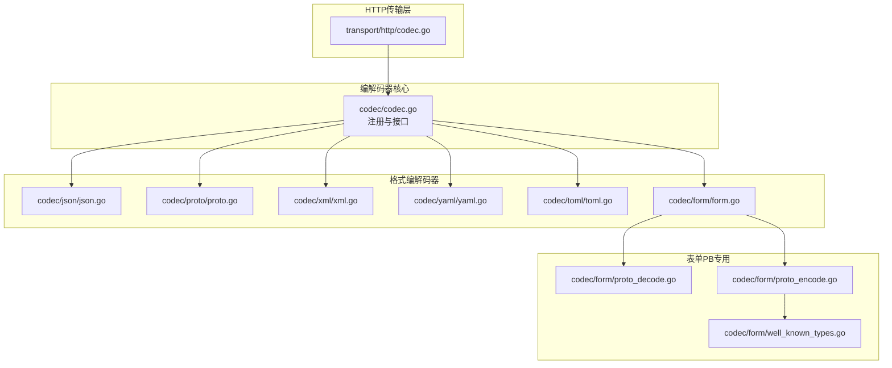
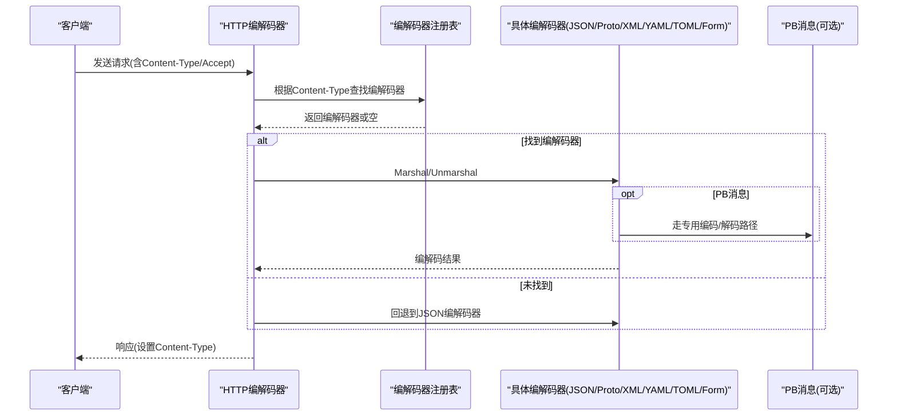
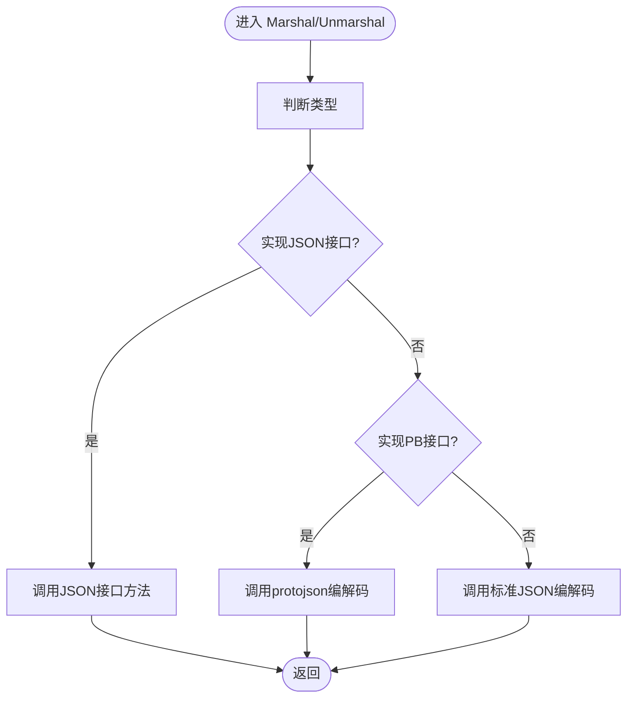
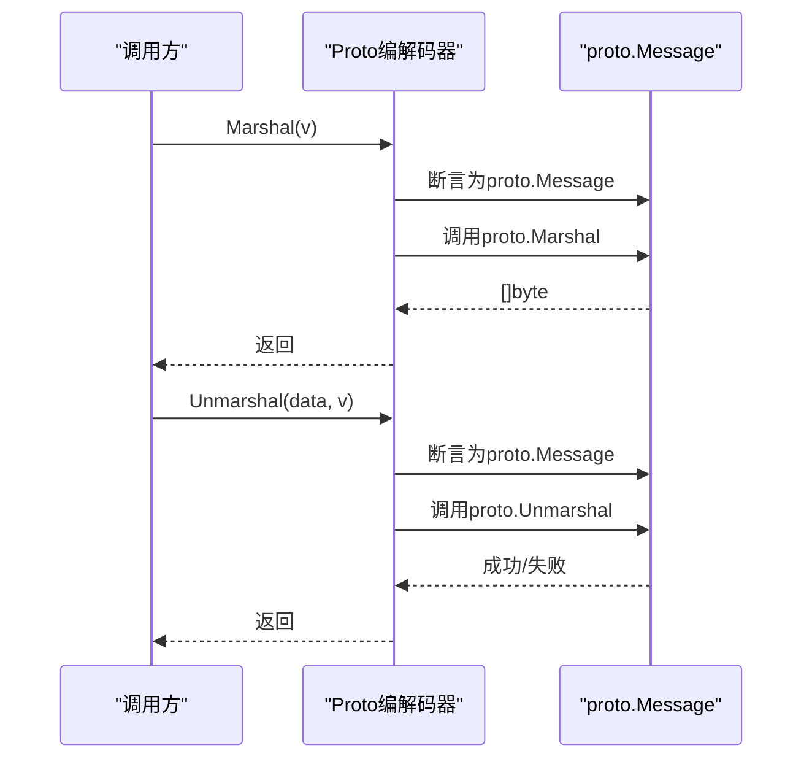
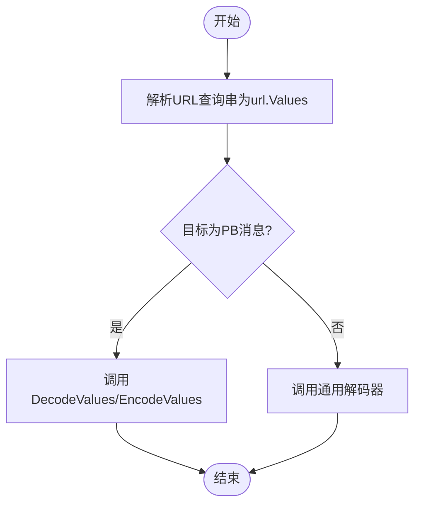
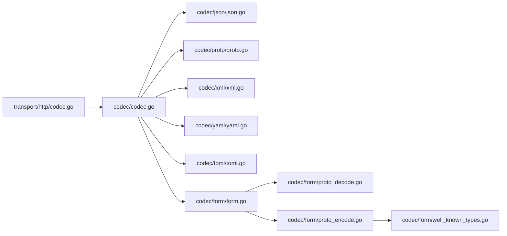

# 数据编解码器

<cite>
**本文引用的文件**
- [codec.go](file://codec/codec.go)
- [json.go](file://codec/json/json.go)
- [proto.go](file://codec/proto/proto.go)
- [xml.go](file://codec/xml/xml.go)
- [yaml.go](file://codec/yaml/yaml.go)
- [toml.go](file://codec/toml/toml.go)
- [form.go](file://codec/form/form.go)
- [proto_decode.go](file://codec/form/proto_decode.go)
- [proto_encode.go](file://codec/form/proto_encode.go)
- [well_known_types.go](file://codec/form/well_known_types.go)
- [codec.go](file://transport/http/codec.go)
- [test.proto（编码测试）](file://internal/testdata/encoding/test.proto)
- [test.proto（绑定测试）](file://internal/testdata/binding/test.proto)
</cite>

## 目录
1. [简介](#简介)
2. [项目结构](#项目结构)
3. [核心组件](#核心组件)
4. [架构总览](#架构总览)
5. [详细组件分析](#详细组件分析)
6. [依赖关系分析](#依赖关系分析)
7. [性能考量](#性能考量)
8. [故障排查指南](#故障排查指南)
9. [结论](#结论)
10. [附录：使用示例与最佳实践](#附录使用示例与最佳实践)

## 简介
本文件面向 Go Fox 数据编解码器系统，系统性阐述编解码器接口设计理念与实现机制，覆盖标准编解码流程、JSON/Protocol Buffers/XML/YAML/TOML 表单等格式的实现细节与使用场景，并提供自定义编解码器的开发指南与最佳实践。读者可据此在 HTTP/WebSocket 等传输层中正确选择与扩展编解码能力。

## 项目结构
编解码器模块位于 codec 子目录，按格式拆分具体实现；HTTP 层通过统一的编解码器选择器对接不同格式；表单编解码器对 Protocol Buffers 消息提供专门的序列化/反序列化支持。

图表来源
- [codec.go](file://codec/codec.go#L33-L61)
- [json.go](file://codec/json/json.go#L37-L61)
- [proto.go](file://codec/proto/proto.go#L34-L43)
- [xml.go](file://codec/xml/xml.go#L33-L42)
- [yaml.go](file://codec/yaml/yaml.go#L34-L43)
- [toml.go](file://codec/toml/toml.go#L35-L47)
- [form.go](file://codec/form/form.go#L13-L33)
- [proto_decode.go](file://codec/form/proto_decode.go#L27-L35)
- [proto_encode.go](file://codec/form/proto_encode.go#L16-L30)
- [well_known_types.go](file://codec/form/well_known_types.go#L13-L36)
- [codec.go](file://transport/http/codec.go#L65-L81)

章节来源
- [codec.go](file://codec/codec.go#L33-L61)
- [json.go](file://codec/json/json.go#L37-L61)
- [proto.go](file://codec/proto/proto.go#L34-L43)
- [xml.go](file://codec/xml/xml.go#L33-L42)
- [yaml.go](file://codec/yaml/yaml.go#L34-L43)
- [toml.go](file://codec/toml/toml.go#L35-L47)
- [form.go](file://codec/form/form.go#L13-L33)
- [codec.go](file://transport/http/codec.go#L65-L81)

## 核心组件
- 接口设计
  - 名称、编码、解码三要素，统一注册与查找机制，便于扩展新格式。
- 注册与查找
  - 通过名称小写化后存入并发安全映射，GetCodec 支持按名称检索已注册编解码器。
- 初始化
  - 各格式编解码器在 init 中完成注册，避免重复注册与遗漏。

章节来源
- [codec.go](file://codec/codec.go#L33-L61)

## 架构总览
HTTP 层根据请求头中的内容类型动态选择编解码器，优先从已注册集合中匹配，否则回退到 JSON。表单编解码器对 PB 消息提供专用编码/解码逻辑，兼容常见 PB 原生类型与时间戳、时长、字节、包装类型、字段掩码等“常用类型”。

图表来源
- [codec.go](file://codec/codec.go#L52-L61)
- [codec.go](file://transport/http/codec.go#L65-L81)
- [json.go](file://codec/json/json.go#L71-L103)
- [proto.go](file://codec/proto/proto.go#L53-L61)
- [xml.go](file://codec/xml/xml.go#L47-L60)
- [yaml.go](file://codec/yaml/yaml.go#L48-L61)
- [toml.go](file://codec/toml/toml.go#L54-L64)
- [form.go](file://codec/form/form.go#L41-L86)

## 详细组件分析

### JSON 编解码器
- 设计要点
  - 自动识别是否实现了标准接口或为 PB 消息，分别走 protojson 或标准 JSON 流程。
  - 提供可配置的 Marshal/Unmarshal 选项，如 EmitUnpopulated、DiscardUnknown。
- 使用场景
  - REST API 默认首选，PB 消息与普通结构体均可无缝处理。
- 复杂度与性能
  - 标准 JSON 在大对象上开销较高；PB 路径利用 protojson，避免反射成本。
- 错误处理
  - 非 PB 非标准接口时，解码前会确保指针非空并尝试 PB 类型间接解析。

图表来源
- [json.go](file://codec/json/json.go#L71-L103)

章节来源
- [json.go](file://codec/json/json.go#L37-L61)
- [json.go](file://codec/json/json.go#L71-L103)

### Protocol Buffers 编解码器
- 设计要点
  - 严格约束为 proto.Message，直接使用 google.golang.org/protobuf/proto 的 Marshal/Unmarshal。
- 使用场景
  - 微服务间高效通信、RPC 场景、二进制体积敏感。
- 性能特性
  - 二进制序列化，吞吐高、体积小；适合高并发与跨语言互操作。
- 注意事项
  - 必须传入实现了 proto.Message 的实例，否则会报错。

图表来源
- [proto.go](file://codec/proto/proto.go#L53-L61)

章节来源
- [proto.go](file://codec/proto/proto.go#L34-L43)
- [proto.go](file://codec/proto/proto.go#L53-L61)

### XML 编解码器
- 设计要点
  - 直接委托 encoding/xml，简单稳定。
- 使用场景
  - 兼容历史系统或特定协议要求。
- 注意事项
  - 字段标签需遵循 encoding/xml 规范。

章节来源
- [xml.go](file://codec/xml/xml.go#L33-L42)
- [xml.go](file://codec/xml/xml.go#L47-L60)

### YAML 编解码器
- 设计要点
  - 委托 gopkg.in/yaml.v3，支持复杂结构与注释保留。
- 使用场景
  - 配置文件、声明式资源描述。
- 注意事项
  - 与 JSON 的字段标签体系不同，注意字段命名策略。

章节来源
- [yaml.go](file://codec/yaml/yaml.go#L34-L43)
- [yaml.go](file://codec/yaml/yaml.go#L48-L61)

### TOML 编解码器
- 设计要点
  - 使用 github.com/BurntSushi/toml，编码通过缓冲区输出。
- 使用场景
  - 配置文件、简洁键值结构。
- 注意事项
  - 不支持复杂对象内联，建议扁平化结构。

章节来源
- [toml.go](file://codec/toml/toml.go#L35-L47)
- [toml.go](file://codec/toml/toml.go#L54-L64)

### 表单数据编解码器（x-www-form-urlencoded）
- 设计要点
  - 使用 github.com/go-playground/form/v4 进行通用结构体的编码/解码。
  - 对 PB 消息提供专用编码/解码函数，支持列表、映射、常用 PB 原生类型。
  - 可通过构建标签名（默认 json）控制字段映射。
- 关键流程
  - 编码：优先 PB 路径，再回退通用编码；移除空值项。
  - 解码：解析查询串，优先 PB 路径，再回退通用解码。
- 常见 PB 类型支持
  - 时间戳、时长、字节、包装类型、字段掩码、Struct 等。

图表来源
- [form.go](file://codec/form/form.go#L64-L86)
- [proto_decode.go](file://codec/form/proto_decode.go#L27-L35)
- [proto_encode.go](file://codec/form/proto_encode.go#L16-L30)

章节来源
- [form.go](file://codec/form/form.go#L13-L33)
- [form.go](file://codec/form/form.go#L41-L86)
- [proto_decode.go](file://codec/form/proto_decode.go#L27-L35)
- [proto_decode.go](file://codec/form/proto_decode.go#L117-L127)
- [proto_decode.go](file://codec/form/proto_decode.go#L157-L234)
- [proto_decode.go](file://codec/form/proto_decode.go#L236-L331)
- [proto_encode.go](file://codec/form/proto_encode.go#L16-L30)
- [proto_encode.go](file://codec/form/proto_encode.go#L129-L147)
- [proto_encode.go](file://codec/form/proto_encode.go#L149-L177)
- [well_known_types.go](file://codec/form/well_known_types.go#L38-L61)
- [well_known_types.go](file://codec/form/well_known_types.go#L63-L86)
- [well_known_types.go](file://codec/form/well_known_types.go#L88-L94)

## 依赖关系分析
- 组件耦合
  - 各格式编解码器均实现统一接口并注册到全局表，HTTP 层仅依赖接口与注册表。
- 外部依赖
  - JSON/PB：google.golang.org/protobuf
  - YAML：gopkg.in/yaml.v3
  - TOML：github.com/BurntSushi/toml
  - 表单：github.com/go-playground/form/v4
- 潜在循环
  - 无直接循环依赖；HTTP 层依赖 codec 接口，codec 实现不反向依赖 HTTP。

图表来源
- [codec.go](file://codec/codec.go#L33-L61)
- [codec.go](file://transport/http/codec.go#L65-L81)
- [json.go](file://codec/json/json.go#L37-L61)
- [proto.go](file://codec/proto/proto.go#L34-L43)
- [xml.go](file://codec/xml/xml.go#L33-L42)
- [yaml.go](file://codec/yaml/yaml.go#L34-L43)
- [toml.go](file://codec/toml/toml.go#L35-L47)
- [form.go](file://codec/form/form.go#L13-L33)
- [proto_decode.go](file://codec/form/proto_decode.go#L27-L35)
- [proto_encode.go](file://codec/form/proto_encode.go#L16-L30)
- [well_known_types.go](file://codec/form/well_known_types.go#L13-L36)

## 性能考量
- 二进制优先
  - Proto 编解码器在吞吐与体积上优于 JSON/XML/YAML/TOML，推荐 RPC/微服务间通信。
- JSON 优化
  - 合理使用 EmitUnpopulated 与 DiscardUnknown 控制输出与容错行为，减少无效字段。
- 表单 PB
  - 列表/映射编码采用扁平键路径，避免深层嵌套导致的解析复杂度上升。
- 缓冲与分配
  - TOML 编码使用缓冲区输出，减少多次分配；表单编码移除空值项，降低带宽占用。

## 故障排查指南
- 未注册编解码器
  - 现象：HTTP 请求因 Content-Type 未识别而报错。
  - 处理：确认对应格式编解码器已在 init 中注册，或手动注册。
- PB 类型不匹配
  - 现象：Unmarshal 报类型错误。
  - 处理：确保传入实现了 proto.Message 的实例；检查消息版本与字段编号。
- 表单字段缺失/冲突
  - 现象：oneof 字段冲突或未知字段被忽略。
  - 处理：oneof 仅允许一个字段赋值；未知字段在 JSON/PB 路径下会被丢弃。
- 时间戳/时长范围
  - 现象：超出范围时报错。
  - 处理：确保时间戳与持续时间在允许范围内。

章节来源
- [codec.go](file://transport/http/codec.go#L124-L138)
- [proto_decode.go](file://codec/form/proto_decode.go#L67-L71)
- [proto_decode.go](file://codec/form/proto_decode.go#L47-L50)
- [well_known_types.go](file://codec/form/well_known_types.go#L47-L52)
- [well_known_types.go](file://codec/form/well_known_types.go#L77-L84)

## 结论
该编解码器体系以统一接口为核心，通过注册机制实现多格式并存与灵活切换；针对 PB 提供专用优化路径，兼顾易用性与高性能。HTTP 层通过内容类型自动选择编解码器，简化了上层调用。建议在微服务与 RPC 场景优先选用 Proto，在配置与兼容性场景选用 JSON/YAML/TOML/XML，并结合表单 PB 的专用能力处理 Web 表单与 PB 消息的混合需求。

## 附录：使用示例与最佳实践
- 选择编解码器
  - 依据请求头 Content-Type/Accept 动态选择；未识别时回退 JSON。
- PB 消息
  - 使用 JSON 编解码器时，PB 消息将走 protojson 路径；表单场景使用专用 EncodeValues/DecodeValues。
- 字段标签
  - 表单编解码器可通过构建标签名控制字段映射，默认使用 json 标签。
- 最佳实践
  - RPC/服务间通信优先 Proto；对外 API 优先 JSON；配置文件优先 YAML/TOML；历史系统兼容 XML。
  - 对 PB 消息进行必要的字段校验与范围检查，避免越界与类型不匹配。
  - 表单场景尽量保持扁平结构，减少深层嵌套带来的解析成本。

章节来源
- [codec.go](file://transport/http/codec.go#L65-L81)
- [json.go](file://codec/json/json.go#L71-L103)
- [form.go](file://codec/form/form.go#L25-L33)
- [proto_decode.go](file://codec/form/proto_decode.go#L27-L35)
- [proto_encode.go](file://codec/form/proto_encode.go#L16-L30)
- [test.proto（编码测试）](file://internal/testdata/encoding/test.proto#L9-L19)
- [test.proto（绑定测试）](file://internal/testdata/binding/test.proto#L10-L23)