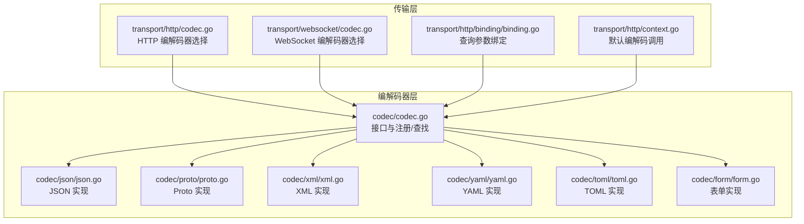
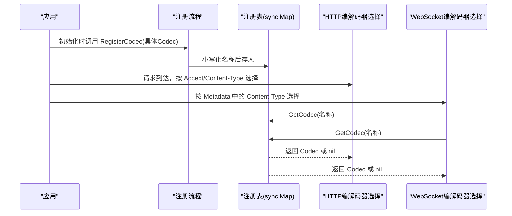
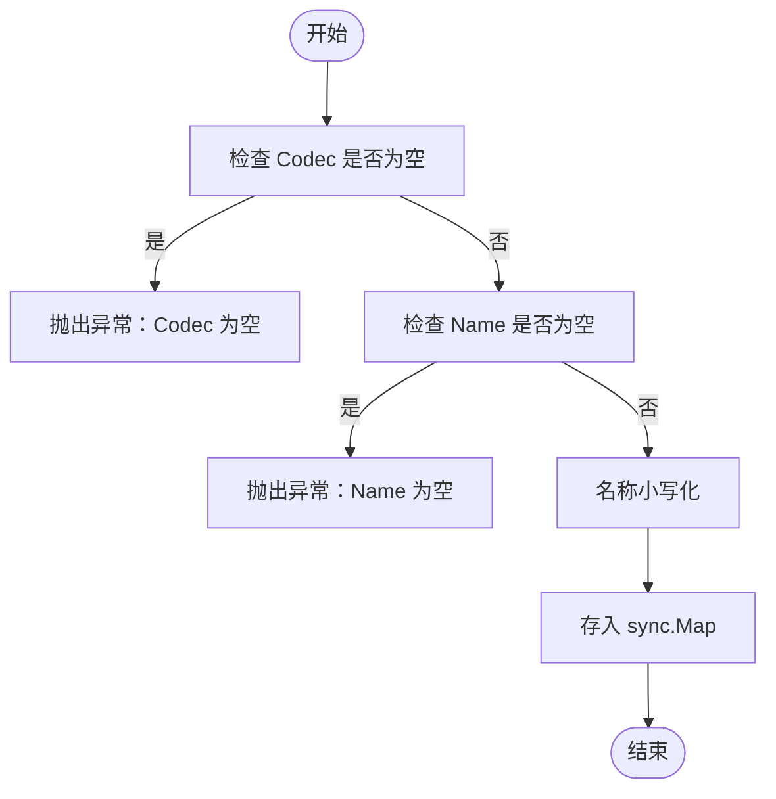
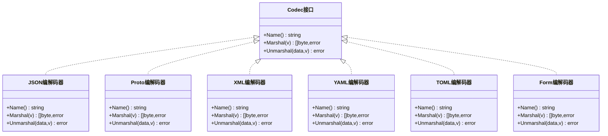
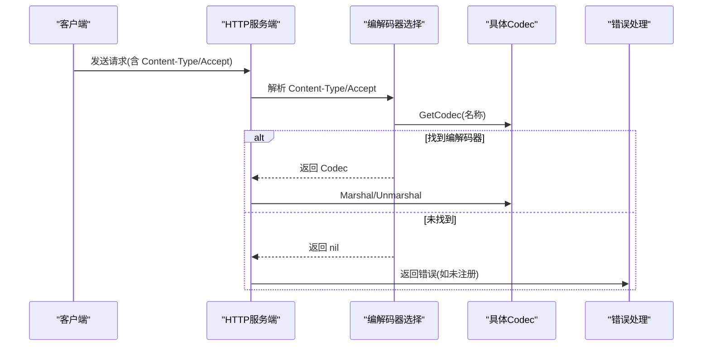
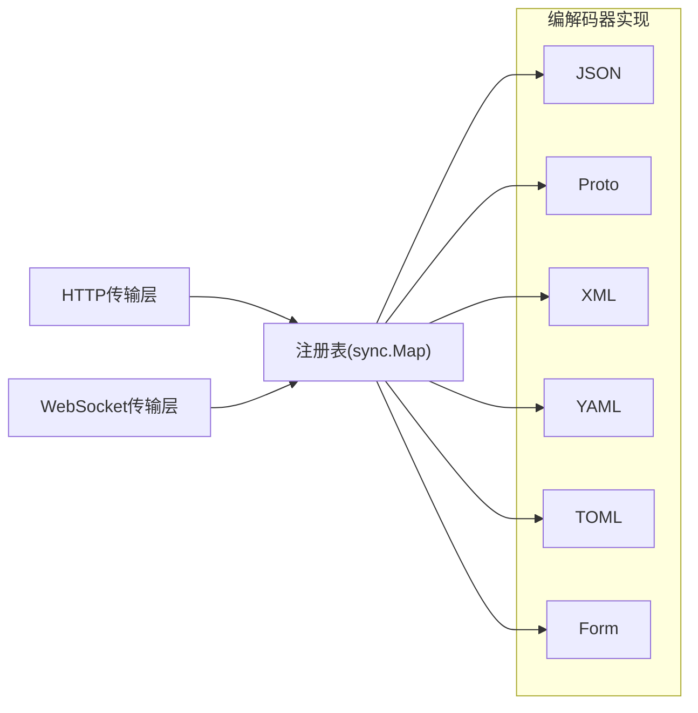

# 编解码器接口设计

<cite>
**本文引用的文件**
- [codec.go](file://codec/codec.go)
- [json.go](file://codec/json/json.go)
- [proto.go](file://codec/proto/proto.go)
- [xml.go](file://codec/xml/xml.go)
- [yaml.go](file://codec/yaml/yaml.go)
- [toml.go](file://codec/toml/toml.go)
- [form.go](file://codec/form/form.go)
- [codec.go（HTTP传输层）](file://transport/http/codec.go)
- [codec.go（WebSocket传输层）](file://transport/websocket/codec.go)
- [binding.go](file://transport/http/binding/binding.go)
- [context.go](file://transport/http/context.go)
- [clientoption.go](file://transport/websocket/clientoption.go)
</cite>

## 目录
1. [引言](#引言)
2. [项目结构](#项目结构)
3. [核心组件](#核心组件)
4. [架构总览](#架构总览)
5. [详细组件分析](#详细组件分析)
6. [依赖关系分析](#依赖关系分析)
7. [性能考量](#性能考量)
8. [故障排查指南](#故障排查指南)
9. [结论](#结论)
10. [附录：使用示例与最佳实践](#附录使用示例与最佳实践)

## 引言
本文件系统性阐述 Go Fox 的编解码器接口设计，围绕 Codec 接口的三个核心方法（Name、Marshal、Unmarshal）进行深入解析，并详细说明编解码器注册与查找机制（RegisterCodec、GetCodec），涵盖并发安全、名称标准化、错误处理与最佳实践。同时给出在 HTTP 与 WebSocket 传输层中的典型使用场景与常见问题解决方案。

## 项目结构
编解码器能力主要位于 codec 包中，提供统一接口与多种内置实现；传输层（HTTP/WebSocket）通过该接口完成请求/响应体的编解码。

图表来源
- [codec.go](file://codec/codec.go#L31-L60)
- [json.go](file://codec/json/json.go#L57-L61)
- [proto.go](file://codec/proto/proto.go#L39-L43)
- [xml.go](file://codec/xml/xml.go#L38-L42)
- [yaml.go](file://codec/yaml/yaml.go#L39-L43)
- [toml.go](file://codec/toml/toml.go#L43-L47)
- [form.go](file://codec/form/form.go#L29-L33)
- [codec.go（HTTP传输层）](file://transport/http/codec.go#L65-L81)
- [codec.go（WebSocket传输层）](file://transport/websocket/codec.go#L81-L88)
- [binding.go](file://transport/http/binding/binding.go#L36-L44)
- [context.go](file://transport/http/context.go#L383-L395)

章节来源
- [codec.go](file://codec/codec.go#L31-L60)
- [json.go](file://codec/json/json.go#L57-L61)
- [proto.go](file://codec/proto/proto.go#L39-L43)
- [xml.go](file://codec/xml/xml.go#L38-L42)
- [yaml.go](file://codec/yaml/yaml.go#L39-L43)
- [toml.go](file://codec/toml/toml.go#L43-L47)
- [form.go](file://codec/form/form.go#L29-L33)
- [codec.go（HTTP传输层）](file://transport/http/codec.go#L65-L81)
- [codec.go（WebSocket传输层）](file://transport/websocket/codec.go#L81-L88)
- [binding.go](file://transport/http/binding/binding.go#L36-L44)
- [context.go](file://transport/http/context.go#L383-L395)

## 核心组件
- Codec 接口
  - Name(): 返回编解码器标识字符串，用于注册与查找。
  - Marshal(v): 将任意对象序列化为字节流。
  - Unmarshal(data, v): 将字节流反序列化到目标对象。
- 注册与查找
  - RegisterCodec(codec Codec): 注册编解码器，内部对名称进行小写标准化并存入并发安全的映射。
  - GetCodec(name string): 查找已注册编解码器，返回 nil 表示未找到。

章节来源
- [codec.go](file://codec/codec.go#L33-L38)
- [codec.go](file://codec/codec.go#L40-L50)
- [codec.go](file://codec/codec.go#L52-L60)

## 架构总览
编解码器采用“接口 + 工厂式注册”的模式：各具体编解码器在初始化阶段通过 RegisterCodec 完成注册；传输层根据内容类型或协议约定选择合适的 Codec 执行编解码。

图表来源
- [codec.go](file://codec/codec.go#L40-L50)
- [codec.go](file://codec/codec.go#L52-L60)
- [codec.go（HTTP传输层）](file://transport/http/codec.go#L65-L81)
- [codec.go（WebSocket传输层）](file://transport/websocket/codec.go#L81-L88)

## 详细组件分析

### Codec 接口与注册/查找机制
- 设计理念
  - 统一抽象：所有编解码器遵循相同的接口契约，便于替换与扩展。
  - 名称驱动：通过 Name() 唯一定位编解码器，避免硬编码类型判断。
  - 并发安全：使用 sync.Map 存储，支持高并发读写。
- 关键实现要点
  - 注册前校验：禁止注册 nil 或空名称，防止运行期错误。
  - 名称标准化：统一转为小写，屏蔽大小写差异。
  - 查找策略：GetCodec 同样进行小写化匹配，未命中返回 nil。
- 错误处理
  - 未注册的内容类型在 HTTP 层会返回明确的错误提示。
  - WebSocket 层若未指定或未知 Content-Type，默认回退到 proto 编解码器。

图表来源
- [codec.go](file://codec/codec.go#L40-L50)

章节来源
- [codec.go](file://codec/codec.go#L33-L38)
- [codec.go](file://codec/codec.go#L40-L50)
- [codec.go](file://codec/codec.go#L52-L60)

### 具体编解码器实现概览
- JSON
  - 支持标准 JSON、protojson（带 proto.Message）两种路径。
  - 在 init 阶段自动注册自身。
- Proto
  - 专用于 protobuf Message 的编解码。
  - 在 init 阶段自动注册自身。
- XML/YAML/TOML
  - 分别基于对应库实现编解码。
  - 在 init 阶段自动注册自身。
- Form（application/x-www-form-urlencoded）
  - 使用 form 库进行编码/解码，支持 proto 与普通结构体。
  - 在 init 阶段注册自身。

图表来源
- [codec.go](file://codec/codec.go#L33-L38)
- [json.go](file://codec/json/json.go#L63-L104)
- [proto.go](file://codec/proto/proto.go#L45-L62)
- [xml.go](file://codec/xml/xml.go#L44-L61)
- [yaml.go](file://codec/yaml/yaml.go#L45-L62)
- [toml.go](file://codec/toml/toml.go#L40-L65)
- [form.go](file://codec/form/form.go#L35-L92)

章节来源
- [json.go](file://codec/json/json.go#L37-L104)
- [proto.go](file://codec/proto/proto.go#L34-L62)
- [xml.go](file://codec/xml/xml.go#L33-L61)
- [yaml.go](file://codec/yaml/yaml.go#L34-L62)
- [toml.go](file://codec/toml/toml.go#L35-L65)
- [form.go](file://codec/form/form.go#L13-L92)

### 传输层中的编解码器选择
- HTTP
  - 根据 Accept 或 Content-Type 头部子类型选择编解码器；未识别则回退到 JSON。
  - 默认请求/响应编解码器在失败时返回结构化错误。
- WebSocket
  - 优先从请求元数据中读取 Content-Type，否则回退到 proto。
  - 默认响应编码器将数据写入会话并设置 Content-Type。

图表来源
- [codec.go（HTTP传输层）](file://transport/http/codec.go#L65-L81)
- [codec.go（HTTP传输层）](file://transport/http/codec.go#L124-L138)
- [codec.go（HTTP传输层）](file://transport/http/codec.go#L178-L182)
- [codec.go（HTTP传输层）](file://transport/http/codec.go#L184-L197)

章节来源
- [codec.go（HTTP传输层）](file://transport/http/codec.go#L65-L81)
- [codec.go（HTTP传输层）](file://transport/http/codec.go#L124-L138)
- [codec.go（HTTP传输层）](file://transport/http/codec.go#L178-L182)
- [codec.go（HTTP传输层）](file://transport/http/codec.go#L184-L197)
- [codec.go（WebSocket传输层）](file://transport/websocket/codec.go#L68-L88)

## 依赖关系分析
- 内聚性
  - codec 包内各实现均实现同一接口，内聚度高。
- 耦合性
  - 传输层仅依赖 codec 接口与注册表，耦合度低，易于替换。
- 并发安全
  - 注册表使用 sync.Map，读多写少场景下性能稳定。
- 循环依赖
  - 无循环依赖，注册发生在各自包的 init 中，避免了导入顺序问题。

图表来源
- [codec.go](file://codec/codec.go#L31-L31)
- [codec.go](file://codec/codec.go#L40-L50)
- [codec.go（HTTP传输层）](file://transport/http/codec.go#L65-L81)
- [codec.go（WebSocket传输层）](file://transport/websocket/codec.go#L81-L88)

章节来源
- [codec.go](file://codec/codec.go#L31-L31)
- [codec.go](file://codec/codec.go#L40-L50)
- [codec.go（HTTP传输层）](file://transport/http/codec.go#L65-L81)
- [codec.go（WebSocket传输层）](file://transport/websocket/codec.go#L81-L88)

## 性能考量
- 注册时机
  - 各实现均在 init 中注册，避免重复注册与竞态。
- 名称标准化
  - 小写化一次即可，查找时亦为 O(1) 平均复杂度。
- 反射与第三方库
  - JSON/XML/YAML/TOML 等直接委托给相应库；Form 使用反射辅助 proto 消息解码，注意在高频场景下可考虑缓存标签或减少反射开销。
- 并发读写
  - sync.Map 适合高并发读取，写入次数较少，整体性能良好。

## 故障排查指南
- “未注册的内容类型”
  - 现象：HTTP 请求因 Content-Type 未识别而报错。
  - 处理：确认客户端发送的 Content-Type 是否与服务端注册的名称一致（大小写不敏感），或在服务端显式注册对应编解码器。
  - 参考位置
    - [codec.go（HTTP传输层）](file://transport/http/codec.go#L126-L129)
    - [codec.go（HTTP传输层）](file://transport/http/codec.go#L166-L170)
- “编解码失败”
  - 现象：Marshal/Unmarshal 抛错。
  - 处理：检查输入对象是否满足目标格式要求（如 proto.Message 必须可序列化），或目标指针是否正确初始化。
  - 参考位置
    - [json.go](file://codec/json/json.go#L72-L81)
    - [json.go](file://codec/json/json.go#L84-L103)
    - [form.go](file://codec/form/form.go#L42-L62)
    - [form.go](file://codec/form/form.go#L65-L86)
- “默认回退到 JSON”
  - 现象：未识别的 Accept/Content-Type 回退到 JSON。
  - 处理：建议在客户端显式设置 Accept/Content-Type，或在服务端注册更多编解码器以覆盖业务场景。
  - 参考位置
    - [codec.go（HTTP传输层）](file://transport/http/codec.go#L67-L71)
    - [codec.go（HTTP传输层）](file://transport/http/codec.go#L75-L81)
- “WebSocket 默认使用 Proto”
  - 现象：未指定 Content-Type 时默认使用 proto。
  - 处理：在 Metadata 中设置正确的 Content-Type，或确保客户端与服务端约定一致。
  - 参考位置
    - [codec.go（WebSocket传输层）](file://transport/websocket/codec.go#L70-L78)
    - [codec.go（WebSocket传输层）](file://transport/websocket/codec.go#L82-L88)

章节来源
- [codec.go（HTTP传输层）](file://transport/http/codec.go#L124-L138)
- [codec.go（HTTP传输层）](file://transport/http/codec.go#L165-L176)
- [codec.go（HTTP传输层）](file://transport/http/codec.go#L65-L81)
- [codec.go（WebSocket传输层）](file://transport/websocket/codec.go#L68-L88)

## 结论
Go Fox 的编解码器接口设计以简洁统一为核心，结合注册/查找机制与传输层的灵活选择策略，实现了良好的可扩展性与可维护性。通过名称标准化与并发安全存储，既保证了易用性也兼顾了性能。实际使用中应关注内容类型的约定与错误处理策略，确保在多协议共存场景下的稳定性。

## 附录：使用示例与最佳实践
- 最佳实践
  - 命名规范：编解码器名称建议使用小写、语义清晰的字符串，避免特殊字符。
  - 错误处理：在传输层统一捕获编解码错误并转换为结构化错误返回。
  - 注册时机：在 init 中注册，避免重复注册与竞态。
  - 并发安全：不要在外部直接修改注册表，依赖 RegisterCodec 与 GetCodec。
- 使用示例（路径指引）
  - HTTP 默认请求解码
    - [transport/http/codec.go](file://transport/http/codec.go#L124-L138)
  - HTTP 默认响应编码
    - [transport/http/codec.go](file://transport/http/codec.go#L83-L100)
  - HTTP 错误编码
    - [transport/http/codec.go](file://transport/http/codec.go#L153-L163)
  - 查询参数绑定（Form）
    - [transport/http/binding/binding.go](file://transport/http/binding/binding.go#L36-L44)
  - WebSocket 请求解码
    - [transport/websocket/codec.go](file://transport/websocket/codec.go#L68-L79)
  - WebSocket 响应编码
    - [transport/websocket/codec.go](file://transport/websocket/codec.go#L42-L57)
  - JSON 编解码（含 proto.Message）
    - [codec/json/json.go](file://codec/json/json.go#L71-L103)
  - Proto 编解码
    - [codec/proto/proto.go](file://codec/proto/proto.go#L53-L61)
  - XML/YAML/TOML 编解码
    - [codec/xml/xml.go](file://codec/xml/xml.go#L47-L55)
    - [codec/yaml/yaml.go](file://codec/yaml/yaml.go#L48-L56)
    - [codec/toml/toml.go](file://codec/toml/toml.go#L54-L63)
  - Form 编解码
    - [codec/form/form.go](file://codec/form/form.go#L41-L86)