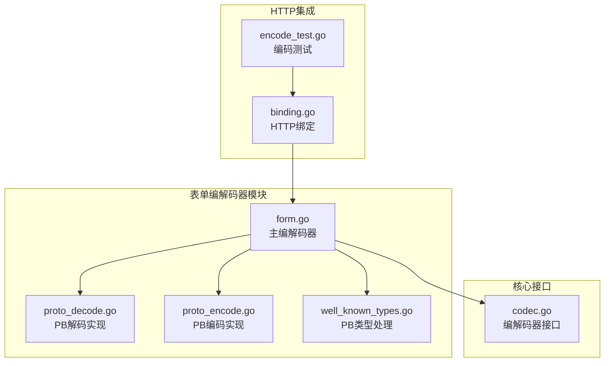
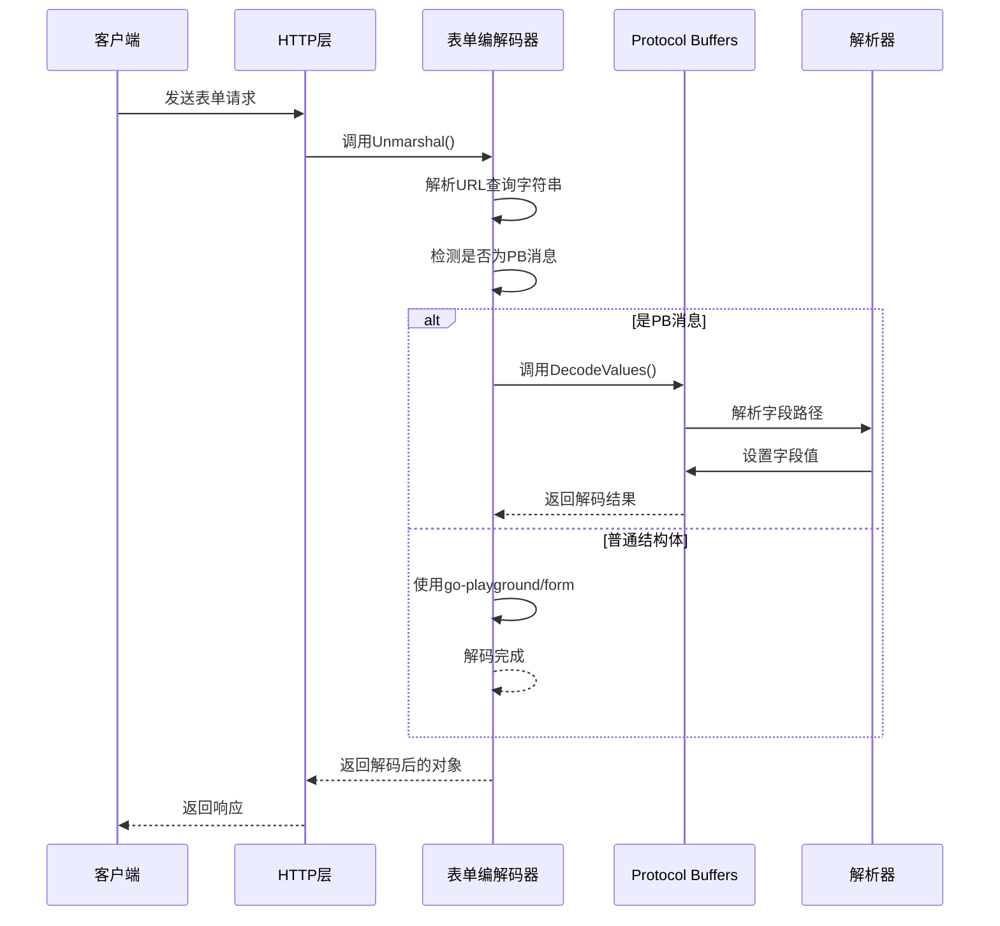
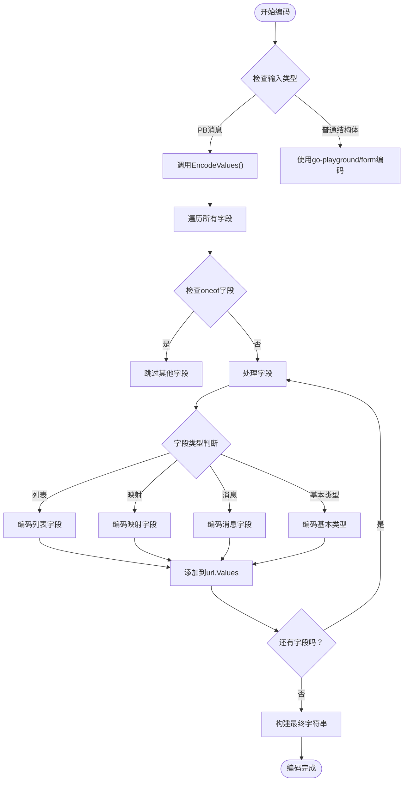
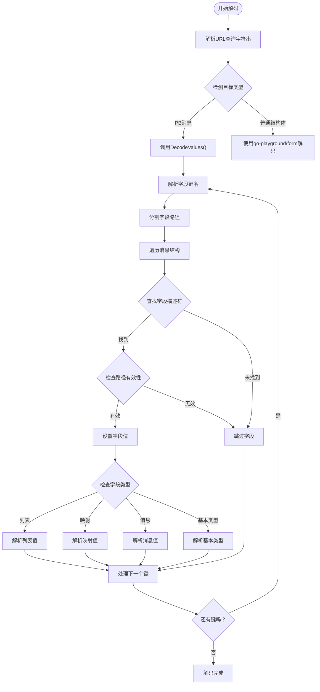
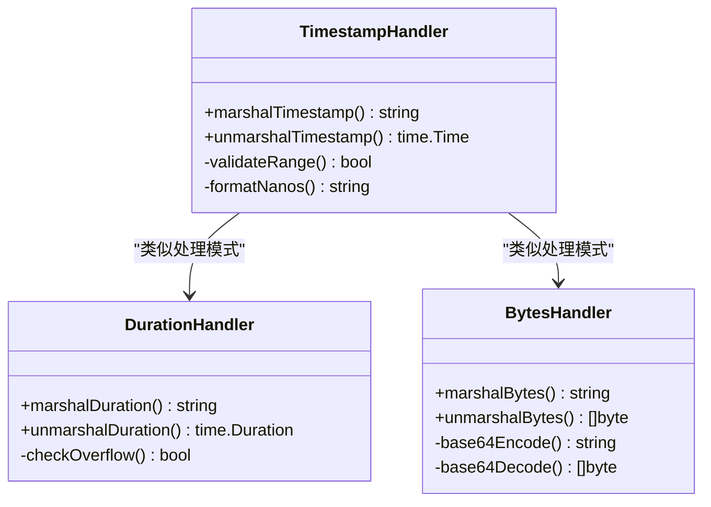
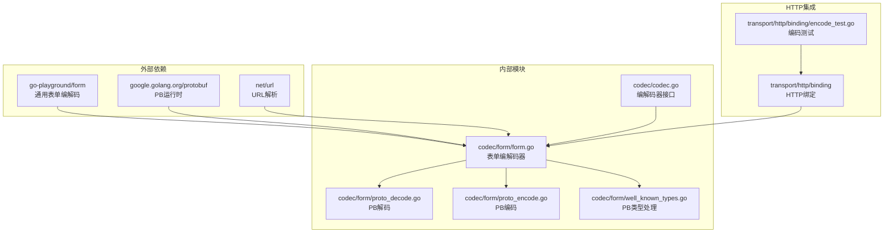

# 表单数据编解码器

<cite>
**本文档引用的文件**
- [codec/form/form.go](file://codec/form/form.go)
- [codec/form/proto_decode.go](file://codec/form/proto_decode.go)
- [codec/form/proto_encode.go](file://codec/form/proto_encode.go)
- [codec/form/well_known_types.go](file://codec/form/well_known_types.go)
- [codec/codec.go](file://codec/codec.go)
- [transport/http/binding/binding.go](file://transport/http/binding/binding.go)
- [transport/http/binding/encode_test.go](file://transport/http/binding/encode_test.go)
- [internal/testdata/binding/test.proto](file://internal/testdata/binding/test.proto)
- [internal/testdata/binding/test.pb.go](file://internal/testdata/binding/test.pb.go)
</cite>

## 目录
1. [简介](#简介)
2. [项目结构](#项目结构)
3. [核心组件](#核心组件)
4. [架构概览](#架构概览)
5. [详细组件分析](#详细组件分析)
6. [依赖关系分析](#依赖关系分析)
7. [性能考虑](#性能考虑)
8. [故障排除指南](#故障排除指南)
9. [结论](#结论)
10. [附录](#附录)

## 简介

Go Fox表单数据编解码器是一个专门用于处理HTTP表单数据的高性能编解码器，支持Protocol Buffers消息的双向转换。该编解码器实现了标准的`x-www-form-urlencoded`格式，能够无缝处理复杂的嵌套结构、数组、映射以及Protocol Buffers的常用类型（如时间戳、持续时间、包装器类型等）。

该编解码器的核心特性包括：
- 完整的Protocol Buffers集成支持
- 标准URL编码格式处理
- 嵌套结构和复杂数据类型的解析
- 内置的常用PB类型特殊处理
- 高性能的内存管理和错误处理

## 项目结构

表单编解码器位于`codec/form/`目录下，采用模块化设计，包含以下核心文件：



**图表来源**
- [codec/form/form.go](file://codec/form/form.go#L1-L92)
- [codec/form/proto_decode.go](file://codec/form/proto_decode.go#L1-L374)
- [codec/form/proto_encode.go](file://codec/form/proto_encode.go#L1-L223)
- [codec/form/well_known_types.go](file://codec/form/well_known_types.go#L1-L95)

**章节来源**
- [codec/form/form.go](file://codec/form/form.go#L1-L92)
- [codec/codec.go](file://codec/codec.go#L1-L61)

## 核心组件

### 主编解码器（Codec）

主编解码器实现了`Codec`接口，提供了表单数据的编解码功能。它支持两种模式：普通结构体和Protocol Buffers消息。

关键特性：
- 使用`go-playground/form`库进行通用结构体的编解码
- 针对Protocol Buffers消息的特殊处理
- 支持自定义标签名（默认使用JSON标签）
- 注册到全局编解码器注册表

### 协议缓冲区集成

编解码器通过三个核心文件实现了完整的Protocol Buffers支持：

1. **proto_decode.go**: 实现PB消息的解码逻辑
2. **proto_encode.go**: 实现PB消息的编码逻辑  
3. **well_known_types.go**: 处理PB常用类型的特殊序列化

**章节来源**
- [codec/form/form.go](file://codec/form/form.go#L35-L91)
- [codec/codec.go](file://codec/codec.go#L33-L60)

## 架构概览

表单编解码器采用分层架构设计，确保了良好的可扩展性和维护性：



**图表来源**
- [codec/form/form.go](file://codec/form/form.go#L64-L86)
- [codec/form/proto_decode.go](file://codec/form/proto_decode.go#L27-L35)

## 详细组件分析

### 编码器实现

编码器负责将结构体或PB消息转换为URL编码格式：



**图表来源**
- [codec/form/proto_encode.go](file://codec/form/proto_encode.go#L16-L97)
- [codec/form/proto_encode.go](file://codec/form/proto_encode.go#L129-L147)

**章节来源**
- [codec/form/proto_encode.go](file://codec/form/proto_encode.go#L16-L223)

### 解码器实现

解码器负责将URL编码的数据转换为结构体或PB消息：



**图表来源**
- [codec/form/proto_decode.go](file://codec/form/proto_decode.go#L27-L82)
- [codec/form/proto_decode.go](file://codec/form/proto_decode.go#L37-L82)

**章节来源**
- [codec/form/proto_decode.go](file://codec/form/proto_decode.go#L27-L374)

### 常用PB类型处理

编解码器对Protocol Buffers的常用类型提供了特殊的处理逻辑：

#### 时间戳处理
时间戳类型使用RFC 3339格式进行序列化和反序列化，支持纳秒精度：



**图表来源**
- [codec/form/well_known_types.go](file://codec/form/well_known_types.go#L38-L94)

**章节来源**
- [codec/form/well_known_types.go](file://codec/form/well_known_types.go#L13-L95)

### 字段映射规则

表单字段到结构体字段的映射遵循以下规则：

1. **标签优先级**：优先使用JSON标签名，其次使用字段名
2. **嵌套访问**：使用点号`.`表示嵌套字段访问
3. **数组处理**：支持重复字段的数组映射
4. **映射处理**：使用方括号`[]`表示映射键值
5. **oneof处理**：自动处理oneof字段的互斥性

**章节来源**
- [codec/form/proto_decode.go](file://codec/form/proto_decode.go#L84-L115)
- [codec/form/proto_decode.go](file://codec/form/proto_decode.go#L353-L373)

## 依赖关系分析

表单编解码器的依赖关系清晰明确，采用了松耦合的设计：



**图表来源**
- [codec/form/form.go](file://codec/form/form.go#L3-L11)
- [codec/form/proto_decode.go](file://codec/form/proto_decode.go#L3-L21)

**章节来源**
- [codec/form/form.go](file://codec/form/form.go#L1-L11)
- [codec/form/proto_decode.go](file://codec/form/proto_decode.go#L1-L21)

## 性能考虑

### 内存管理优化

1. **零拷贝设计**：尽量避免不必要的数据复制
2. **缓存机制**：复用URL解析结果和字段描述符
3. **批量操作**：支持批量字段处理以减少系统调用

### 编码性能优化

1. **延迟初始化**：编码器和解码器在首次使用时才初始化
2. **类型特化**：针对常用类型提供专门的处理函数
3. **错误早返回**：遇到错误立即停止处理，避免无谓计算

### 解码性能优化

1. **路径预解析**：预先解析字段路径以避免重复计算
2. **类型缓存**：缓存字段描述符以提高查找效率
3. **批量赋值**：支持批量字段赋值操作

## 故障排除指南

### 常见错误类型

1. **字段路径错误**：字段路径格式不正确导致解析失败
2. **类型不匹配**：提供的值类型与字段类型不兼容
3. **枚举值无效**：枚举值不在允许范围内
4. **映射键格式错误**：映射键的格式不符合要求

### 调试技巧

1. **启用详细日志**：检查字段路径解析过程
2. **验证数据格式**：确认输入数据符合预期格式
3. **逐步排查**：从简单字段开始，逐步增加复杂度
4. **单元测试**：编写针对性的测试用例验证功能

**章节来源**
- [codec/form/proto_decode.go](file://codec/form/proto_decode.go#L25-L25)
- [codec/form/proto_decode.go](file://codec/form/proto_decode.go#L353-L373)

## 结论

Go Fox表单数据编解码器提供了一个完整、高效且易于使用的解决方案，专门用于处理HTTP表单数据与Protocol Buffers消息之间的转换。其设计特点包括：

1. **完整性**：支持所有Protocol Buffers数据类型和复杂结构
2. **性能**：优化的内存管理和算法设计
3. **易用性**：简洁的API和强大的功能
4. **可靠性**：完善的错误处理和类型安全保证

该编解码器特别适用于需要处理复杂表单数据的微服务架构，能够有效简化数据传输层的开发工作。

## 附录

### 使用示例

#### 基本表单解码
```go
// 创建表单数据
formData := url.Values{
    "name": []string{"张三"},
    "age": []string{"25"},
}

// 解码到结构体
var user User
err := codec.GetCodec("x-www-form-urlencoded").Unmarshal([]byte(formData.Encode()), &user)
```

#### PB消息编码
```go
// 创建PB消息
request := &HelloRequest{
    Name: "张三",
    Sub: &Sub{
        Name: "子对象",
    },
}

// 编码为表单数据
values, err := codec.GetCodec("x-www-form-urlencoded").Marshal(request)
```

#### HTTP集成使用
```go
// 在HTTP处理器中使用
func handler(ctx *Context) error {
    var request HelloRequest
    if err := ctx.BindForm(&request); err != nil {
        return err
    }
    
    // 处理请求...
    
    return ctx.JSON(response)
}
```

### 配置选项

1. **标签名配置**：可通过编译标志自定义标签名
2. **编码格式**：支持多种编码格式的灵活配置
3. **错误处理**：可配置详细的错误信息和处理策略