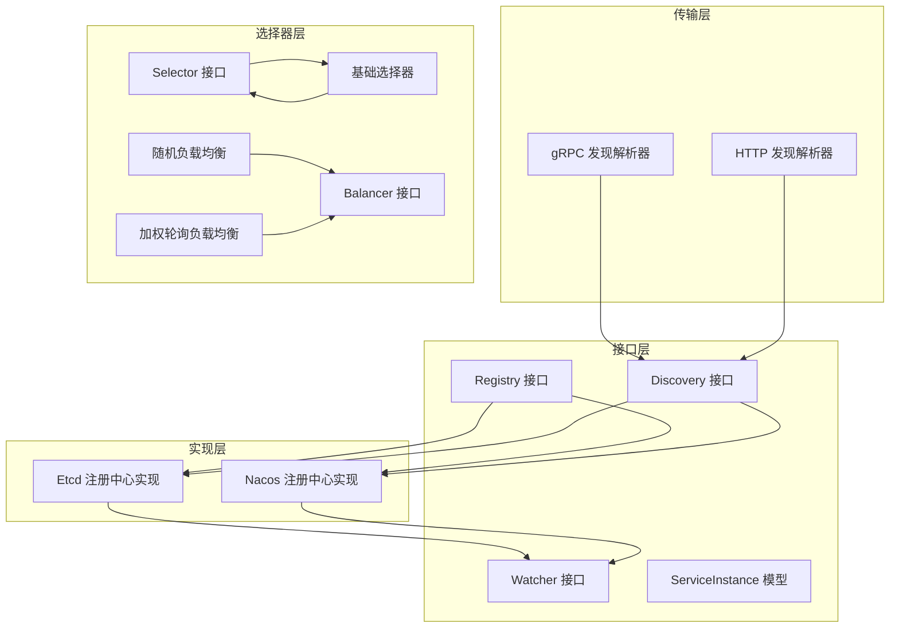
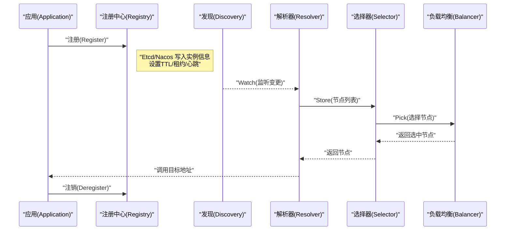
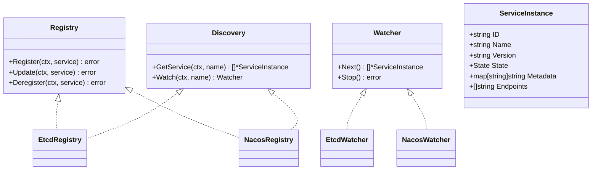
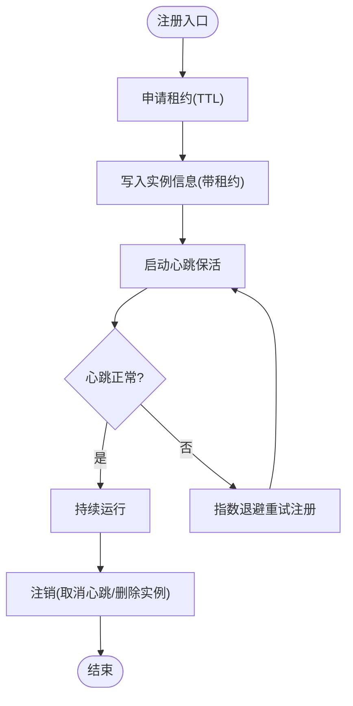
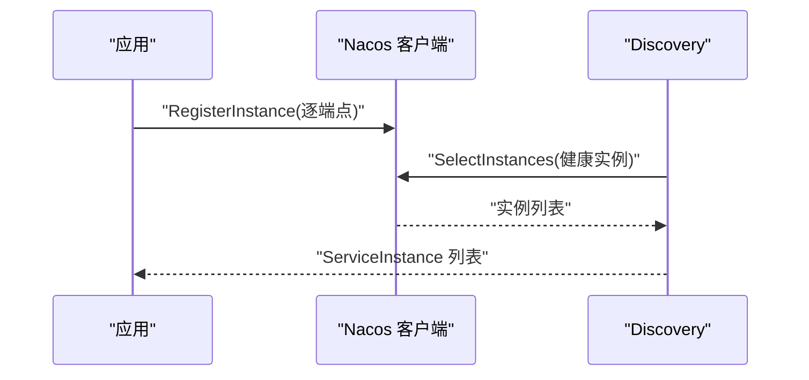
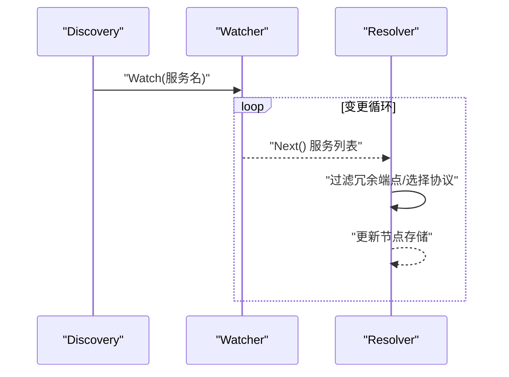
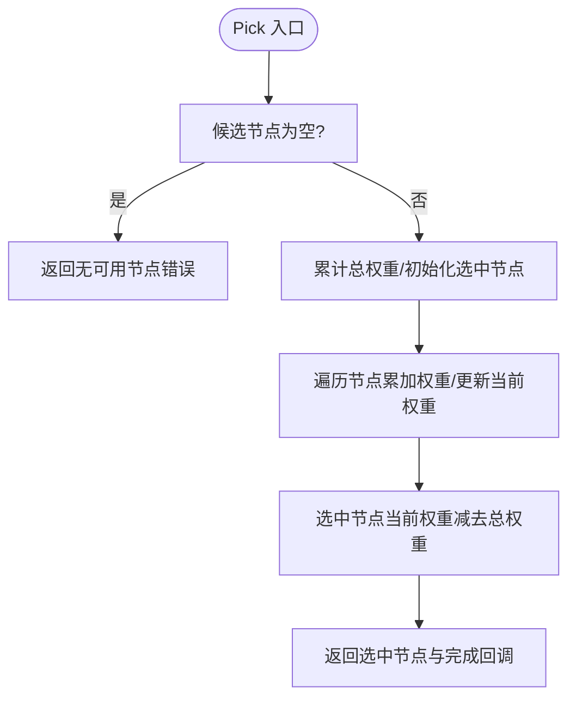
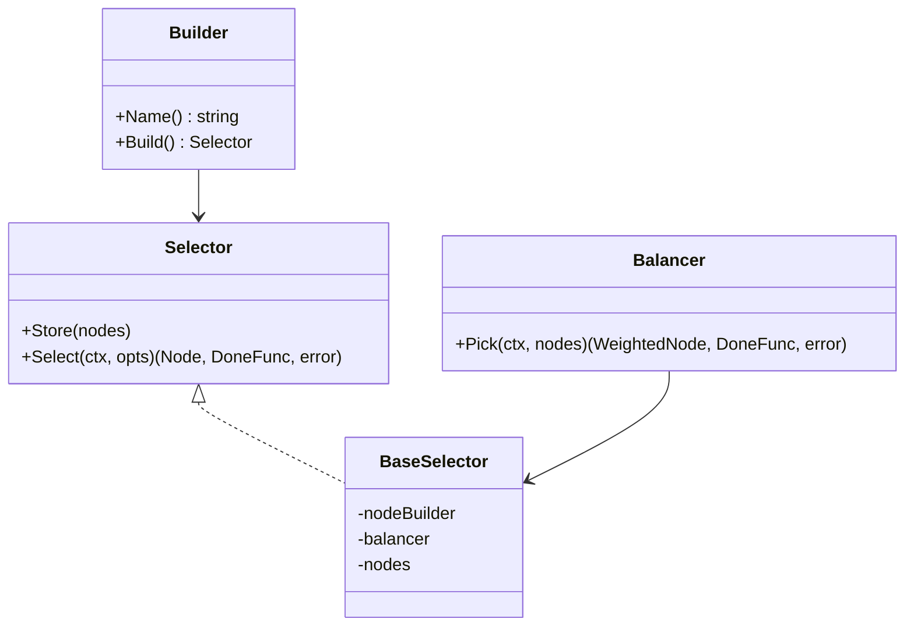
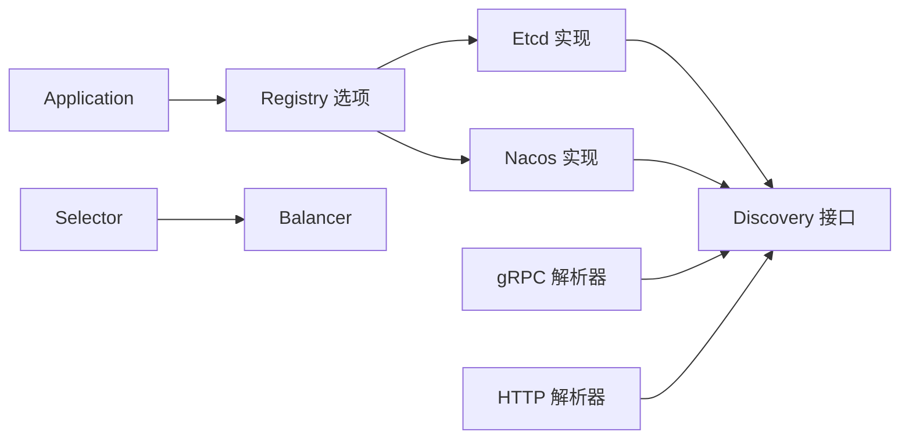

# 服务治理

<cite>
**本文引用的文件**
- [registry.go](file://registry/registry.go)
- [app.go](file://app.go)
- [options.go](file://options.go)
- [contrib/registry/etcd/registry.go](file://contrib/registry/etcd/registry.go)
- [contrib/registry/etcd/config.go](file://contrib/registry/etcd/config.go)
- [contrib/registry/nacos/registry.go](file://contrib/registry/nacos/registry.go)
- [contrib/registry/nacos/config.go](file://contrib/registry/nacos/config.go)
- [contrib/config/nacos/nacos.go](file://contrib/config/nacos/nacos.go)
- [contrib/config/nacos/options.go](file://contrib/config/nacos/options.go)
- [selector/selector.go](file://selector/selector.go)
- [selector/balancer.go](file://selector/balancer.go)
- [selector/balancer/random/random.go](file://selector/balancer/random/random.go)
- [selector/balancer/wrr/wrr.go](file://selector/balancer/wrr/wrr.go)
- [selector/base/selector.go](file://selector/base/selector.go)
- [transport/grpc/resolver/discovery/resolver.go](file://transport/grpc/resolver/discovery/resolver.go)
- [transport/grpc/resolver/discovery/builder.go](file://transport/grpc/resolver/discovery/builder.go)
- [transport/http/resolver.go](file://transport/http/resolver.go)
- [middleware/selector/selector.go](file://middleware/selector/selector.go)
</cite>

## 目录
1. [引言](#引言)
2. [项目结构](#项目结构)
3. [核心组件](#核心组件)
4. [架构总览](#架构总览)
5. [组件详解](#组件详解)
6. [依赖关系分析](#依赖关系分析)
7. [性能考量](#性能考量)
8. [故障排查指南](#故障排查指南)
9. [结论](#结论)
10. [附录](#附录)

## 引言
本技术文档围绕 Go Fox 的服务治理体系，系统阐述服务注册与发现、Etcd/Nacos 注册中心集成、服务发现机制、负载均衡算法（随机、加权轮询）、服务选择器使用与配置、以及最佳实践与故障排查。文档面向不同层次读者，既提供高层架构视图，也给出代码级关系与流程图，帮助快速理解与落地。

## 项目结构
Go Fox 将服务治理能力按“接口抽象—具体实现—传输层集成—选择器—中间件”的层次组织：
- 接口层：统一的注册中心与服务发现接口定义
- 实现层：Etcd 与 Nacos 的注册中心实现
- 传输层：gRPC/HTTP 对服务发现的集成
- 选择器层：节点存储、过滤与负载均衡策略
- 中间件层：基于匹配规则的选择器中间件

图表来源
- [registry.go](file://registry/registry.go#L17-L95)
- [contrib/registry/etcd/registry.go](file://contrib/registry/etcd/registry.go#L46-L110)
- [contrib/registry/nacos/registry.go](file://contrib/registry/nacos/registry.go#L44-L108)
- [transport/grpc/resolver/discovery/resolver.go](file://transport/grpc/resolver/discovery/resolver.go#L43-L130)
- [transport/http/resolver.go](file://transport/http/resolver.go#L75-L173)
- [selector/selector.go](file://selector/selector.go#L84-L95)
- [selector/balancer.go](file://selector/balancer.go#L28-L36)
- [selector/balancer/random/random.go](file://selector/balancer/random/random.go#L35-L67)
- [selector/balancer/wrr/wrr.go](file://selector/balancer/wrr/wrr.go#L12-L68)
- [selector/base/selector.go](file://selector/base/selector.go#L39-L110)

章节来源
- [registry.go](file://registry/registry.go#L17-L113)
- [contrib/registry/etcd/registry.go](file://contrib/registry/etcd/registry.go#L46-L110)
- [contrib/registry/nacos/registry.go](file://contrib/registry/nacos/registry.go#L44-L108)
- [transport/grpc/resolver/discovery/resolver.go](file://transport/grpc/resolver/discovery/resolver.go#L43-L130)
- [transport/http/resolver.go](file://transport/http/resolver.go#L75-L173)
- [selector/selector.go](file://selector/selector.go#L84-L95)
- [selector/balancer.go](file://selector/balancer.go#L28-L36)
- [selector/balancer/random/random.go](file://selector/balancer/random/random.go#L35-L67)
- [selector/balancer/wrr/wrr.go](file://selector/balancer/wrr/wrr.go#L12-L68)
- [selector/base/selector.go](file://selector/base/selector.go#L39-L110)

## 核心组件
- 注册中心接口与模型
  - Registry：提供 Register、Update、Deregister
  - Discovery：提供 GetService、Watch
  - Watcher：提供 Next、Stop
  - ServiceInstance：服务实例模型，包含元数据、端点、状态等
- 应用生命周期与注册
  - Application 在启动阶段构建服务实例并注册到注册中心；停止阶段注销
- 传输层发现集成
  - gRPC：通过 discovery 解析器订阅服务变更并更新连接
  - HTTP：通过 http 解析器订阅服务变更并注入选择器
- 选择器与负载均衡
  - Selector：存储节点、过滤节点、选择节点
  - Balancer：随机、加权轮询等策略
  - BaseSelector：组合节点构建器与负载均衡器

章节来源
- [registry.go](file://registry/registry.go#L17-L113)
- [app.go](file://app.go#L223-L251)
- [transport/grpc/resolver/discovery/resolver.go](file://transport/grpc/resolver/discovery/resolver.go#L43-L130)
- [transport/http/resolver.go](file://transport/http/resolver.go#L75-L173)
- [selector/selector.go](file://selector/selector.go#L84-L95)
- [selector/balancer.go](file://selector/balancer.go#L28-L36)
- [selector/base/selector.go](file://selector/base/selector.go#L39-L110)

## 架构总览
下图展示从应用启动到服务调用的关键路径：应用构建服务实例并注册；客户端通过传输层解析器订阅服务变更；选择器根据策略挑选节点；调用完成后回调记录。

图表来源
- [app.go](file://app.go#L208-L221)
- [contrib/registry/etcd/registry.go](file://contrib/registry/etcd/registry.go#L112-L163)
- [contrib/registry/nacos/registry.go](file://contrib/registry/nacos/registry.go#L110-L239)
- [transport/grpc/resolver/discovery/resolver.go](file://transport/grpc/resolver/discovery/resolver.go#L66-L130)
- [transport/http/resolver.go](file://transport/http/resolver.go#L137-L173)
- [selector/base/selector.go](file://selector/base/selector.go#L54-L91)

## 组件详解

### 服务注册接口设计与实现
- 设计理念
  - 抽象出统一的 Registry/Discovery/Watcher 接口，屏蔽 Etcd/Nacos 差异
  - ServiceInstance 模型标准化服务元数据、端点与状态
- 关键流程
  - 注册：写入实例信息，建立租约/心跳
  - 更新：按需更新实例元数据
  - 注销：取消心跳、删除实例
- 错误处理
  - Watcher.Next 返回错误时进行重试或降级
  - 心跳异常时自动重试注册

图表来源
- [registry.go](file://registry/registry.go#L17-L113)
- [contrib/registry/etcd/registry.go](file://contrib/registry/etcd/registry.go#L46-L110)
- [contrib/registry/nacos/registry.go](file://contrib/registry/nacos/registry.go#L44-L108)

章节来源
- [registry.go](file://registry/registry.go#L17-L113)
- [contrib/registry/etcd/registry.go](file://contrib/registry/etcd/registry.go#L112-L163)
- [contrib/registry/nacos/registry.go](file://contrib/registry/nacos/registry.go#L110-L239)

### Etcd 注册中心集成
- 配置项
  - 前缀、TTL、最大重试次数、Etcd 客户端
- 注册与心跳
  - 注册时申请租约并写入实例信息
  - 心跳保活失败时进行指数退避重试
- 服务发现
  - 前缀扫描获取同名服务实例
  - Watch 监听变更并触发更新

图表来源
- [contrib/registry/etcd/registry.go](file://contrib/registry/etcd/registry.go#L165-L175)
- [contrib/registry/etcd/registry.go](file://contrib/registry/etcd/registry.go#L177-L242)
- [contrib/registry/etcd/config.go](file://contrib/registry/etcd/config.go#L34-L54)

章节来源
- [contrib/registry/etcd/registry.go](file://contrib/registry/etcd/registry.go#L84-L163)
- [contrib/registry/etcd/registry.go](file://contrib/registry/etcd/registry.go#L177-L242)
- [contrib/registry/etcd/config.go](file://contrib/registry/etcd/config.go#L34-L54)

### Nacos 注册中心支持
- 配置项
  - 前缀、权重、集群、分组、Nacos 客户端
- 注册/更新/注销
  - 解析每个端点，构造实例参数并调用 SDK
  - 支持元数据透传（版本、状态、协议）
- 服务发现
  - 仅返回健康实例，按元数据组装 ServiceInstance

图表来源
- [contrib/registry/nacos/registry.go](file://contrib/registry/nacos/registry.go#L110-L161)
- [contrib/registry/nacos/registry.go](file://contrib/registry/nacos/registry.go#L163-L210)
- [contrib/registry/nacos/registry.go](file://contrib/registry/nacos/registry.go#L212-L239)
- [contrib/registry/nacos/registry.go](file://contrib/registry/nacos/registry.go#L77-L103)

章节来源
- [contrib/registry/nacos/registry.go](file://contrib/registry/nacos/registry.go#L77-L103)
- [contrib/registry/nacos/registry.go](file://contrib/registry/nacos/registry.go#L110-L239)
- [contrib/registry/nacos/config.go](file://contrib/registry/nacos/config.go#L33-L54)

### 服务发现机制工作原理
- gRPC 发现解析器
  - 构建 Watcher 并在后台循环拉取变更
  - 过滤冗余端点，按安全模式选择协议端点
  - 更新连接状态
- HTTP 发现解析器
  - 通过 Watcher 获取服务列表，转换为选择器节点
  - 存储到 Selector，供后续调用选择

图表来源
- [transport/grpc/resolver/discovery/resolver.go](file://transport/grpc/resolver/discovery/resolver.go#L66-L130)
- [transport/http/resolver.go](file://transport/http/resolver.go#L137-L173)

章节来源
- [transport/grpc/resolver/discovery/resolver.go](file://transport/grpc/resolver/discovery/resolver.go#L66-L130)
- [transport/http/resolver.go](file://transport/http/resolver.go#L137-L173)

### 负载均衡算法实现
- 随机选择
  - 从候选节点中等概率随机选取
- 加权轮询（WRR）
  - 基于有效权重与当前权重的 nginx 风格算法
  - 每次选择后调整对应节点的当前权重

图表来源
- [selector/balancer/random/random.go](file://selector/balancer/random/random.go#L53-L61)
- [selector/balancer/wrr/wrr.go](file://selector/balancer/wrr/wrr.go#L33-L59)

章节来源
- [selector/balancer/random/random.go](file://selector/balancer/random/random.go#L53-L61)
- [selector/balancer/wrr/wrr.go](file://selector/balancer/wrr/wrr.go#L33-L59)

### 服务选择器使用与配置
- 选择器接口
  - Store：批量存储节点
  - Select：根据过滤器与负载均衡策略选择节点
- 基础选择器
  - 组合 WeightedNodeBuilder 与 Balancer
  - 支持多过滤器链式过滤
- 选择器中间件
  - 基于前缀/正则/路径/自定义匹配函数
  - 作用于服务端或客户端传输层

图表来源
- [selector/selector.go](file://selector/selector.go#L84-L95)
- [selector/base/selector.go](file://selector/base/selector.go#L39-L110)
- [selector/balancer.go](file://selector/balancer.go#L28-L36)

章节来源
- [selector/selector.go](file://selector/selector.go#L84-L95)
- [selector/base/selector.go](file://selector/base/selector.go#L54-L91)
- [middleware/selector/selector.go](file://middleware/selector/selector.go#L74-L127)

### Nacos 配置管理与服务治理能力
- 配置源
  - 通过 Nacos SDK 动态拉取配置，支持监听变更
- 服务治理
  - 通过注册中心实现服务注册、发现与健康检查
  - 结合选择器实现路由与灰度发布

章节来源
- [contrib/config/nacos/nacos.go](file://contrib/config/nacos/nacos.go#L58-L94)
- [contrib/config/nacos/options.go](file://contrib/config/nacos/options.go#L19-L114)
- [contrib/registry/nacos/registry.go](file://contrib/registry/nacos/registry.go#L77-L103)

## 依赖关系分析
- 组件耦合
  - 传输层解析器依赖 Discovery 接口，解耦具体注册中心
  - 选择器依赖抽象的节点与权重接口，便于扩展策略
- 外部依赖
  - Etcd：租约与心跳保活
  - Nacos：命名客户端与实例管理
- 循环依赖
  - 未见直接循环依赖；模块边界清晰

图表来源
- [options.go](file://options.go#L181-L186)
- [contrib/registry/etcd/registry.go](file://contrib/registry/etcd/registry.go#L46-L110)
- [contrib/registry/nacos/registry.go](file://contrib/registry/nacos/registry.go#L44-L108)
- [transport/grpc/resolver/discovery/resolver.go](file://transport/grpc/resolver/discovery/resolver.go#L43-L130)
- [transport/http/resolver.go](file://transport/http/resolver.go#L75-L173)
- [selector/base/selector.go](file://selector/base/selector.go#L39-L110)

章节来源
- [options.go](file://options.go#L181-L186)
- [transport/grpc/resolver/discovery/builder.go](file://transport/grpc/resolver/discovery/builder.go#L62-L99)
- [transport/http/resolver.go](file://transport/http/resolver.go#L85-L135)

## 性能考量
- 心跳与租约
  - Etcd 使用租约与心跳保活，建议合理设置 TTL 与最大重试次数
- 服务发现频率
  - Watcher 采用阻塞等待，减少无效轮询
- 负载均衡
  - WRR 在高并发场景具备更好的资源利用；随机策略简单低开销
- 传输层更新
  - gRPC/HTTP 解析器在收到变更后批量更新，避免频繁重建连接

## 故障排查指南
- 注册失败
  - 检查注册中心客户端配置与网络连通性
  - 查看注册/更新/注销返回的错误码
- 心跳中断
  - Etcd 心跳保活失败时会自动重试，若持续失败需检查网络抖动与 Etcd 集群状态
- 服务发现无结果
  - 确认服务名、分组、集群配置一致
  - 检查健康检查开关与端点协议匹配
- 选择器无可用节点
  - 检查过滤器是否过于严格
  - 确认 Watcher 是否成功拉取到实例列表

章节来源
- [contrib/registry/etcd/registry.go](file://contrib/registry/etcd/registry.go#L177-L242)
- [transport/grpc/resolver/discovery/resolver.go](file://transport/grpc/resolver/discovery/resolver.go#L73-L83)
- [transport/http/resolver.go](file://transport/http/resolver.go#L137-L173)
- [selector/selector.go](file://selector/selector.go#L35-L36)

## 结论
Go Fox 的服务治理体系通过统一接口抽象与传输层集成，实现了对 Etcd/Nacos 的无缝支持，并提供了可扩展的选择器与负载均衡策略。结合中间件的匹配机制，可在不侵入业务代码的前提下实现灵活的服务治理与流量控制。

## 附录

### 部署示例（步骤要点）
- Etcd
  - 配置前缀、TTL、最大重试次数
  - 启动服务后自动注册，停止时自动注销
- Nacos
  - 配置集群、分组、权重
  - 注册时按端点逐一注册，注销时逐一移除
- 传输层
  - gRPC：使用 discovery 解析器
  - HTTP：使用 http 解析器

章节来源
- [contrib/registry/etcd/config.go](file://contrib/registry/etcd/config.go#L47-L54)
- [contrib/registry/nacos/config.go](file://contrib/registry/nacos/config.go#L47-L54)
- [transport/grpc/resolver/discovery/builder.go](file://transport/grpc/resolver/discovery/builder.go#L48-L60)
- [transport/http/resolver.go](file://transport/http/resolver.go#L85-L135)

### 监控方案（建议）
- 注册中心指标
  - 注册/注销成功率、心跳保活率、Watch 变更延迟
- 传输层指标
  - 解析器更新耗时、节点可用性、连接重建次数
- 选择器指标
  - 选择耗时、命中率、各策略命中分布
- 告警阈值
  - 心跳失败连续次数、解析器更新超时、节点可用率低于阈值