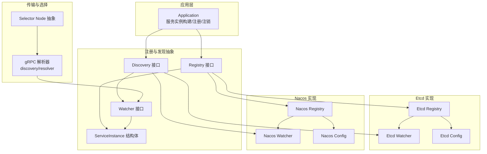
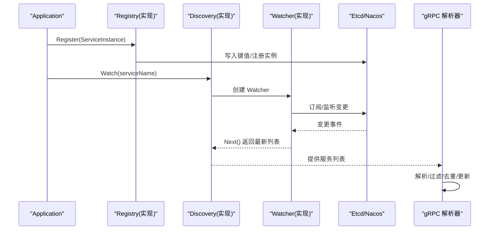
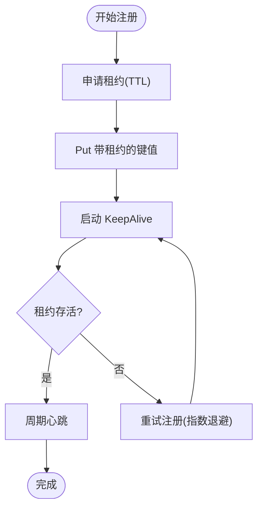
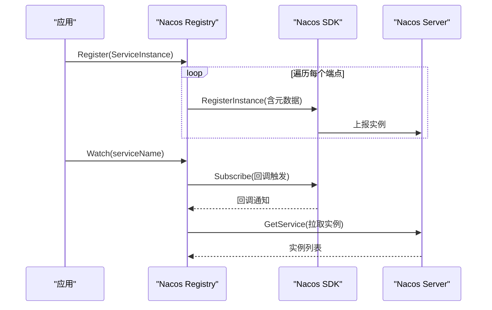
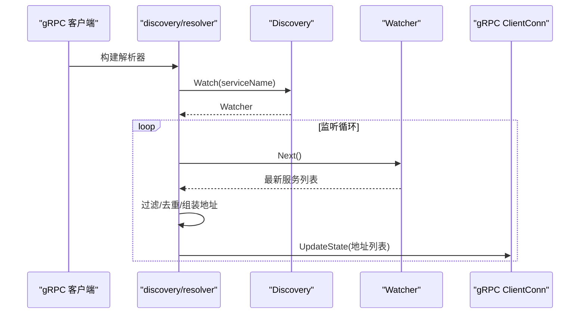
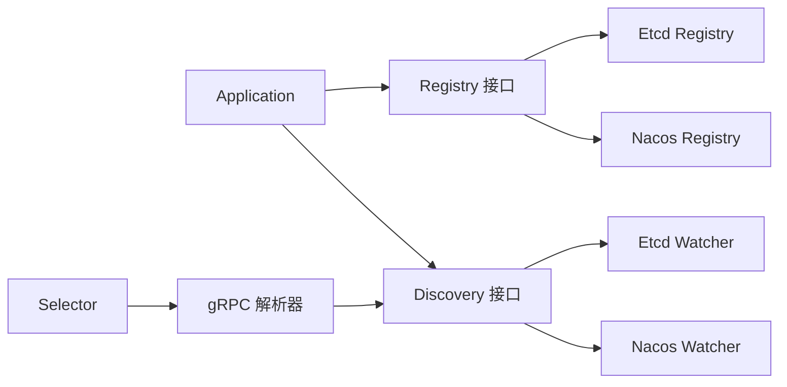

# 服务注册与发现

<cite>
**本文引用的文件**
- [registry.go](file://registry/registry.go)
- [app.go](file://app.go)
- [options.go](file://options.go)
- [config.go](file://config/config.go)
- [registry.go（Etcd）](file://contrib/registry/etcd/registry.go)
- [config.go（Etcd）](file://contrib/registry/etcd/config.go)
- [watcher.go（Etcd）](file://contrib/registry/etcd/watcher.go)
- [registry.go（Nacos）](file://contrib/registry/nacos/registry.go)
- [config.go（Nacos）](file://contrib/registry/nacos/config.go)
- [watcher.go（Nacos）](file://contrib/registry/nacos/watcher.go)
- [resolver.go（gRPC 解析器）](file://transport/grpc/resolver/discovery/resolver.go)
- [node.go](file://selector/node.go)
- [register_test.go（Etcd 测试）](file://contrib/registry/etcd/register_test.go)
- [options.go（Nacos 配置项）](file://contrib/config/nacos/options.go)
</cite>

## 目录
1. [引言](#引言)
2. [项目结构](#项目结构)
3. [核心组件](#核心组件)
4. [架构总览](#架构总览)
5. [详细组件分析](#详细组件分析)
6. [依赖关系分析](#依赖关系分析)
7. [性能考量](#性能考量)
8. [故障排查指南](#故障排查指南)
9. [结论](#结论)
10. [附录：配置示例与监控方案](#附录配置示例与监控方案)

## 引言
本文件系统性梳理 Go Fox 的服务注册与发现机制，围绕 Registry 接口（Register、Update、Deregister）、Discovery 接口（GetService、Watch）、ServiceInstance 数据模型，以及 Etcd 与 Nacos 两种注册中心的实现进行深入解析；并结合 gRPC 解析器与选择器，给出端到端的服务发现工作流、最佳实践与运维建议。

## 项目结构
- 注册中心抽象位于 registry 包，定义了统一的接口与数据模型。
- 应用生命周期在 app 包中完成服务实例构建、注册与注销。
- 具体注册中心实现分别位于 contrib/registry/etcd 与 contrib/registry/nacos。
- gRPC 解析器通过 Watcher 将远端服务列表转换为 gRPC 可消费的地址列表。
- 选择器层提供节点抽象与权重计算能力，支撑负载均衡策略。

图表来源
- [registry.go](file://registry/registry.go#L17-L95)
- [app.go](file://app.go#L223-L251)
- [registry.go（Etcd）](file://contrib/registry/etcd/registry.go#L46-L82)
- [watcher.go（Etcd）](file://contrib/registry/etcd/watcher.go#L39-L67)
- [config.go（Etcd）](file://contrib/registry/etcd/config.go#L34-L54)
- [registry.go（Nacos）](file://contrib/registry/nacos/registry.go#L44-L75)
- [watcher.go（Nacos）](file://contrib/registry/nacos/watcher.go#L39-L79)
- [config.go（Nacos）](file://contrib/registry/nacos/config.go#L33-L54)
- [resolver.go（gRPC 解析器）](file://transport/grpc/resolver/discovery/resolver.go#L43-L52)
- [node.go](file://selector/node.go#L28-L49)

章节来源
- [registry.go](file://registry/registry.go#L17-L95)
- [app.go](file://app.go#L223-L251)

## 核心组件
- Registry 接口：定义服务注册、更新、注销三类操作，面向上层屏蔽底层差异。
- Discovery 接口：提供服务列表查询与变更监听能力。
- Watcher 接口：Next 阻塞式获取变更后的服务列表，Stop 停止监听。
- ServiceInstance：承载服务实例的唯一标识、名称、版本、状态、元数据与端点列表。

章节来源
- [registry.go](file://registry/registry.go#L17-L95)

## 架构总览
下图展示从应用启动到服务注册、监听变更、gRPC 解析器消费服务列表的全链路：

图表来源
- [app.go](file://app.go#L208-L221)
- [registry.go（Etcd）](file://contrib/registry/etcd/registry.go#L112-L132)
- [watcher.go（Etcd）](file://contrib/registry/etcd/watcher.go#L69-L89)
- [registry.go（Nacos）](file://contrib/registry/nacos/registry.go#L105-L110)
- [watcher.go（Nacos）](file://contrib/registry/nacos/watcher.go#L81-L110)
- [resolver.go（gRPC 解析器）](file://transport/grpc/resolver/discovery/resolver.go#L66-L84)

## 详细组件分析

### Registry 接口与 ServiceInstance 模型
- 设计理念
  - 统一抽象：通过 Registry/Discovery/Watcher 三者协作，屏蔽底层注册中心差异。
  - 数据模型：ServiceInstance 聚合服务身份、版本、状态、元数据与多协议端点，便于跨传输层使用。
- 关键字段语义
  - ID：服务实例唯一标识
  - Name：服务名
  - Version：服务版本
  - State：服务状态（Disallow/Down/Up）
  - Metadata：键值对元数据（如 region、zone、kind、version、state 等）
  - Endpoints：多协议端点数组（http、grpc、ws、tcp 等），由解析器按协议筛选
- 方法职责
  - Register：首次注册服务实例
  - Update：更新实例信息（如状态、元数据）
  - Deregister：注销实例并清理资源

章节来源
- [registry.go](file://registry/registry.go#L76-L95)
- [registry.go](file://registry/registry.go#L17-L37)

### Discovery 与 Watcher：服务发现与变更监听
- GetService：根据服务名返回当前可用实例列表
- Watch：创建 Watcher，首次返回非空列表或有实例变更时唤醒
- Watcher.Next：阻塞等待下一次变更；Watcher.Stop：停止监听并释放资源

章节来源
- [registry.go](file://registry/registry.go#L39-L71)

### Etcd 注册中心实现
- 注册流程
  - 生成键：前缀/服务名/实例ID
  - 使用 JSON 编解码序列化 ServiceInstance
  - 申请租约（TTL），写入带租约的键值，实现自动过期
- 心跳检测机制
  - 启动 KeepAlive 协程，维护租约
  - 若租约失效，进入重试注册流程（指数退避+最大重试次数）
- 服务注销
  - 取消对应实例的上下文，删除键值，关闭租约
- 监听实现
  - 使用 clientv3.Watcher 订阅前缀，首次直接拉取全量列表
  - 监听事件后重新拉取全量，避免增量事件丢失
  - 断连时重建 Watcher 并请求进度

图表来源
- [registry.go（Etcd）](file://contrib/registry/etcd/registry.go#L165-L175)
- [registry.go（Etcd）](file://contrib/registry/etcd/registry.go#L177-L242)
- [config.go（Etcd）](file://contrib/registry/etcd/config.go#L34-L54)

章节来源
- [registry.go（Etcd）](file://contrib/registry/etcd/registry.go#L112-L163)
- [watcher.go（Etcd）](file://contrib/registry/etcd/watcher.go#L69-L121)
- [config.go（Etcd）](file://contrib/registry/etcd/config.go#L34-L73)

### Nacos 注册中心实现
- 注册/更新/注销
  - 对每个端点解析协议、IP、端口，构造元数据（kind/version/state）
  - 使用 SDK 的 RegisterInstance/UpdateInstance/DeregisterInstance
- 监听实现
  - 通过 Subscribe 回调触发 Next，随后主动拉取服务实例列表
  - 支持集群与分组参数，适配多环境部署

图表来源
- [registry.go（Nacos）](file://contrib/registry/nacos/registry.go#L110-L161)
- [watcher.go（Nacos）](file://contrib/registry/nacos/watcher.go#L51-L110)
- [config.go（Nacos）](file://contrib/registry/nacos/config.go#L33-L54)

章节来源
- [registry.go（Nacos）](file://contrib/registry/nacos/registry.go#L77-L239)
- [watcher.go（Nacos）](file://contrib/registry/nacos/watcher.go#L39-L117)
- [config.go（Nacos）](file://contrib/registry/nacos/config.go#L33-L74)

### gRPC 解析器与服务发现联动
- 解析器职责
  - 通过 Discovery.Watcher 获取服务列表
  - 基于协议（如 grpc）挑选端点，去重并构建 resolver.Address
  - 将地址列表更新至 gRPC 客户端连接状态
- 错误处理
  - 监听异常时记录错误并短暂退避重试
  - 无可用端点时发出告警

图表来源
- [resolver.go（gRPC 解析器）](file://transport/grpc/resolver/discovery/resolver.go#L66-L130)

章节来源
- [resolver.go（gRPC 解析器）](file://transport/grpc/resolver/discovery/resolver.go#L43-L139)

### 选择器与节点抽象
- Node/WeightedNode 抽象
  - 提供 Scheme、Address、ServiceName、InitialWeight、Version、Metadata 等能力
  - WeightedNode 支持动态权重与 Pick 能力，配合负载均衡策略
- 与注册中心的关系
  - 选择器消费 Discovery 返回的 ServiceInstance，封装为 Node/WeightedNode
  - 通过元数据（如 version、region、zone）参与调度决策

章节来源
- [node.go](file://selector/node.go#L28-L71)

## 依赖关系分析
- 应用层依赖 Registry/Discovery 接口，不直接耦合具体实现
- Etcd/Nacos 实现均满足 Registry/Discovery/Watcher 接口契约
- gRPC 解析器依赖 Discovery.Watcher，将服务列表映射为 gRPC 地址
- 选择器层依赖 Node/WeightedNode 抽象，实现灵活的负载均衡

图表来源
- [app.go](file://app.go#L208-L221)
- [registry.go（Etcd）](file://contrib/registry/etcd/registry.go#L40-L44)
- [registry.go（Nacos）](file://contrib/registry/nacos/registry.go#L39-L42)
- [resolver.go（gRPC 解析器）](file://transport/grpc/resolver/discovery/resolver.go#L41-L42)
- [node.go](file://selector/node.go#L28-L49)

章节来源
- [app.go](file://app.go#L208-L221)
- [registry.go（Etcd）](file://contrib/registry/etcd/registry.go#L40-L44)
- [registry.go（Nacos）](file://contrib/registry/nacos/registry.go#L39-L42)
- [resolver.go（gRPC 解析器）](file://transport/grpc/resolver/discovery/resolver.go#L41-L42)
- [node.go](file://selector/node.go#L28-L49)

## 性能考量
- Etcd
  - TTL 与心跳：合理设置 TTL 与最大重试次数，避免频繁重建租约
  - 监听一致性：使用 WithPrefix + WithKeysOnly + RequestProgress，降低事件风暴
  - 退避策略：指数退避可平滑网络抖动带来的重试压力
- Nacos
  - 订阅回调：回调触发后主动 GetService，确保列表一致性
  - 元数据精简：仅保留必要键值，减少序列化与传输开销
- gRPC 解析器
  - 去重与过滤：按协议筛选端点，避免重复地址导致连接浪费
  - 更新频率：变更驱动更新，避免高频轮询

[本节为通用指导，无需特定文件引用]

## 故障排查指南
- 注册失败
  - 检查客户端连接与鉴权配置（Etcd/Nacos）
  - 校验 ServiceInstance 字段完整性（Name、Endpoints、Metadata）
- 心跳中断
  - Etcd：查看 KeepAlive 是否持续，租约是否被外部回收
  - 观察重试日志与指数退避行为
- 监听异常
  - Etcd：确认 Watcher 是否重建成功，RequestProgress 是否返回
  - Nacos：确认 Subscribe 回调是否触发，GetService 是否返回最新列表
- gRPC 连接失败
  - 检查解析器日志，确认地址列表是否为空或重复
  - 校验端点协议与安全模式（insecure）

章节来源
- [watcher.go（Etcd）](file://contrib/registry/etcd/watcher.go#L116-L121)
- [resolver.go（gRPC 解析器）](file://transport/grpc/resolver/discovery/resolver.go#L66-L84)

## 结论
Go Fox 的注册与发现体系以 Registry/Discovery/Watcher 为核心抽象，结合 Etcd 与 Nacos 的具体实现，提供了高可用、可扩展的服务治理能力。通过应用层在启动阶段完成注册、在停止阶段完成注销，配合 gRPC 解析器与选择器，形成从“服务上线”到“流量接入”的闭环。生产环境中建议结合配置中心与可观测性体系，完善错误处理、重试与故障恢复策略。

[本节为总结性内容，无需特定文件引用]

## 附录：配置示例与监控方案

### 配置示例（Etcd）
- 关键配置项
  - prefix：键空间前缀
  - ttl：租约有效期
  - max_retry：心跳失败最大重试次数
- 加载方式
  - 通过配置系统扫描键路径，生成 Config 并构建 Registry

章节来源
- [config.go（Etcd）](file://contrib/registry/etcd/config.go#L34-L73)
- [config.go](file://config/config.go#L117-L134)

### 配置示例（Nacos）
- 关键配置项
  - prefix：命名空间/前缀
  - cluster：集群
  - group：分组
  - weight：权重
- 加载方式
  - 通过配置系统扫描键路径，生成 Config 并构建 Registry

章节来源
- [config.go（Nacos）](file://contrib/registry/nacos/config.go#L33-L74)
- [config.go](file://config/config.go#L117-L134)

### Nacos 客户端参数（选项）
- 服务端地址、命名空间、超时、日志、缓存、用户名/密码等
- 用于构建 Nacos SDK 客户端配置

章节来源
- [options.go（Nacos 配置项）](file://contrib/config/nacos/options.go#L10-L115)

### 监控方案建议
- 注册中心指标
  - 注册/更新/注销成功率与耗时
  - 租约续期失败率（Etcd）
  - 订阅回调触发次数与延迟（Nacos）
- gRPC 解析器指标
  - 地址列表变更次数、去重后地址数
  - 更新状态失败次数
- 应用层指标
  - 启停钩子耗时、注册/注销超时比例

[本节为通用指导，无需特定文件引用]

### 最佳实践清单
- 错误处理
  - 注册/注销失败时重试并记录上下文
  - 监听异常时退避重试并上报
- 重试机制
  - 指数退避，设置最大重试次数与超时上限
- 故障恢复
  - 心跳中断自动重建租约/订阅
  - 注销阶段使用带超时的上下文，确保优雅停机
- 配置管理
  - 使用配置中心集中管理注册中心参数
  - 分环境分组/集群隔离，最小化变更影响面

[本节为通用指导，无需特定文件引用]