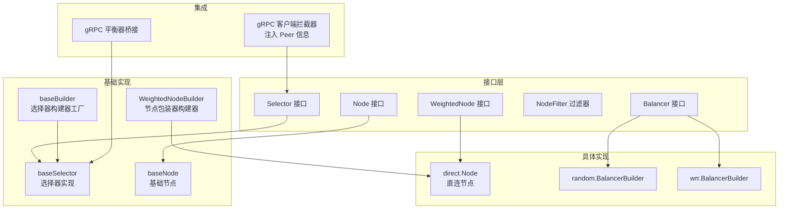
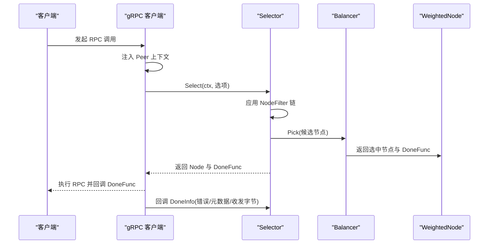
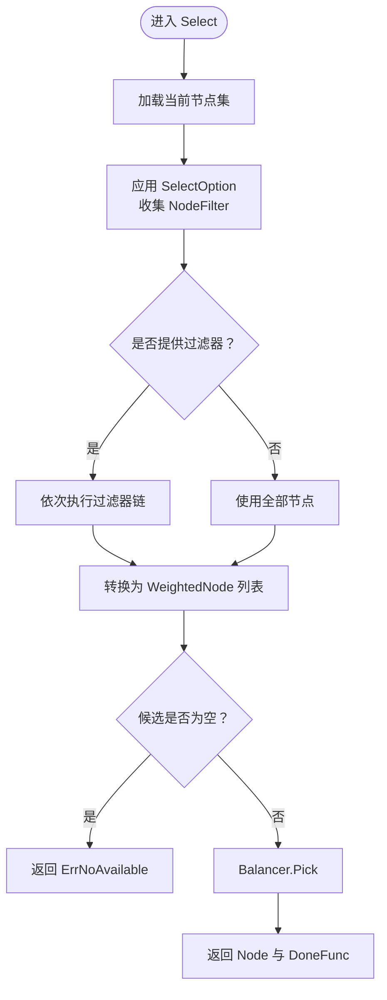
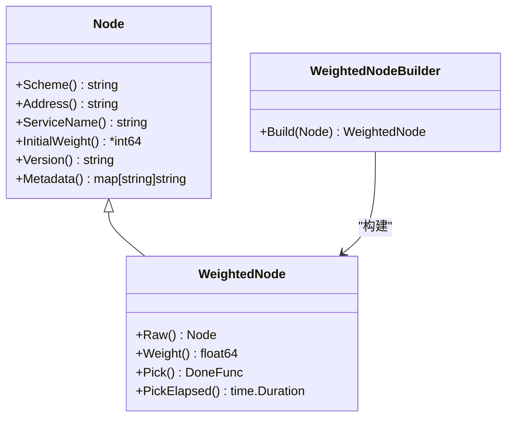
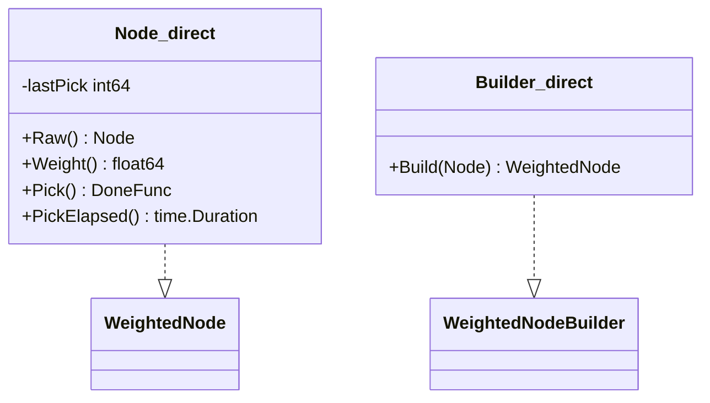
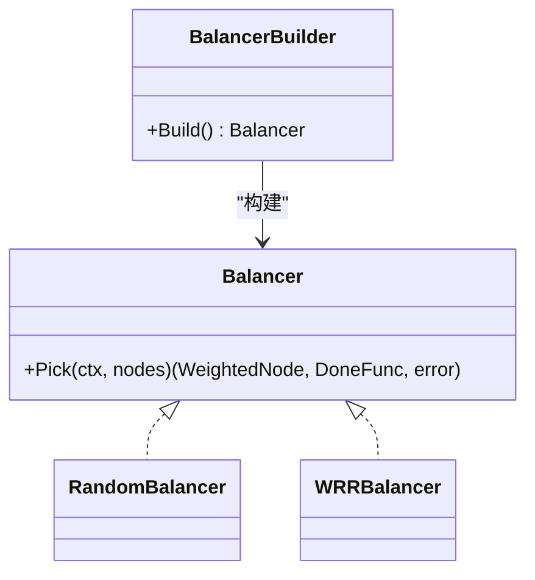
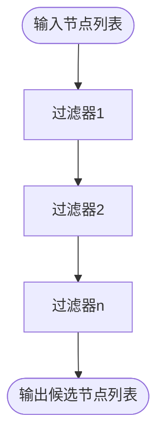
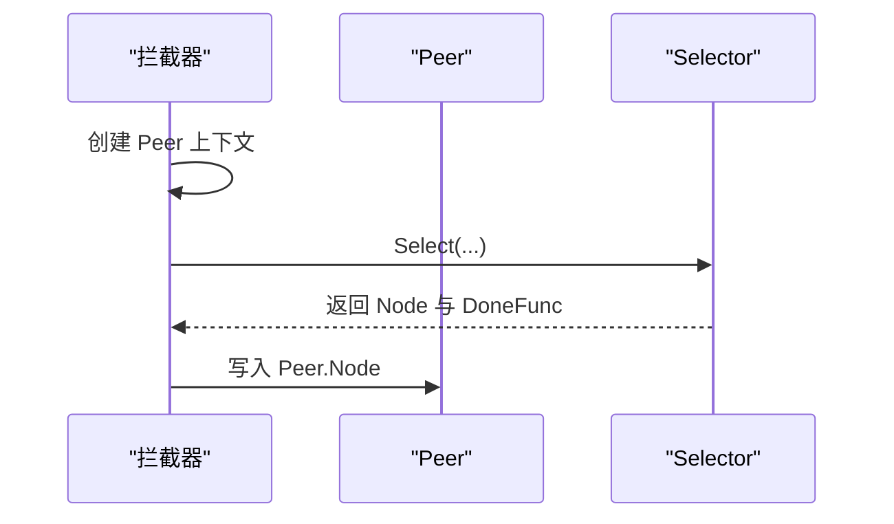
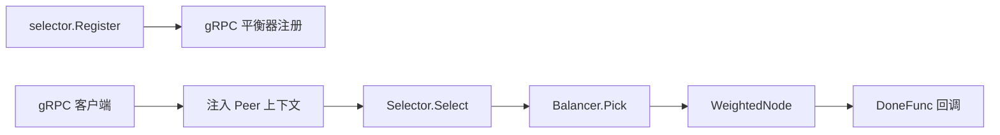

# 服务选择器

<cite>
**本文引用的文件**
- [selector.go](file://selector/selector.go)
- [node.go](file://selector/node.go)
- [filter.go](file://selector/filter.go)
- [peer.go](file://selector/peer.go)
- [options.go](file://selector/options.go)
- [balancer.go](file://selector/balancer.go)
- [base.go](file://selector/base/base.go)
- [selector.go（基础选择器）](file://selector/base/selector.go)
- [node.go（基础节点）](file://selector/base/node.go)
- [direct.go（直连节点）](file://selector/node/direct/direct.go)
- [random.go（随机负载均衡）](file://selector/balancer/random/random.go)
- [wrr.go（加权轮询负载均衡）](file://selector/balancer/wrr/wrr.go)
- [client.go（gRPC 客户端）](file://transport/grpc/client.go)
- [balancer.go（gRPC 平衡器桥接）](file://transport/grpc/balancer.go)
- [transport.go（传输层抽象）](file://transport/grpc/transport.go)
</cite>

## 目录
1. [简介](#简介)
2. [项目结构](#项目结构)
3. [核心组件](#核心组件)
4. [架构总览](#架构总览)
5. [组件详解](#组件详解)
6. [依赖关系分析](#依赖关系分析)
7. [性能考量](#性能考量)
8. [故障排查指南](#故障排查指南)
9. [结论](#结论)
10. [附录：使用示例与最佳实践](#附录使用示例与最佳实践)

## 简介
本技术文档围绕 Go Fox 的服务选择器系统，系统性阐述 Selector 接口的设计理念与实现机制，覆盖服务实例选择、节点过滤、负载均衡策略；同时详解 Node 接口的节点抽象、状态与连接池管理；Direct 节点的直接连接与复用策略；Filter 过滤器链与策略配置；Peer 对等节点在 RPC 上下文中的作用；以及选择器的使用指南、性能监控与故障排查方法。

## 项目结构
服务选择器位于 selector 子模块，采用“接口 + 组合 + 工厂”的分层设计：
- 接口层：Selector、Node、Balancer、Filter 等定义跨传输层的统一抽象
- 基础实现层：base 包提供通用的 Selector 构建器、节点包装器与基础节点
- 具体实现层：node/direct 提供直连节点；balancer 下的 random/wrr 提供负载均衡策略
- 集成层：transport/grpc 将选择器注册到 gRPC 平衡器体系，并在拦截器中注入 Peer 信息

图表来源
- [selector.go](file://selector/selector.go#L84-L96)
- [node.go](file://selector/node.go#L28-L72)
- [balancer.go](file://selector/balancer.go#L28-L37)
- [base.go](file://selector/base/base.go#L28-L40)
- [selector.go（基础选择器）](file://selector/base/selector.go#L39-L111)
- [node.go（基础节点）](file://selector/base/node.go#L37-L88)
- [direct.go（直连节点）](file://selector/node/direct/direct.go#L43-L82)
- [random.go（随机负载均衡）](file://selector/balancer/random/random.go#L35-L68)
- [wrr.go（加权轮询负载均衡）](file://selector/balancer/wrr/wrr.go#L12-L69)
- [client.go（gRPC 客户端）](file://transport/grpc/client.go#L136-L184)
- [balancer.go（gRPC 平衡器桥接）](file://transport/grpc/balancer.go#L1-L36)

章节来源
- [selector.go](file://selector/selector.go#L1-L96)
- [node.go](file://selector/node.go#L1-L72)
- [balancer.go](file://selector/balancer.go#L1-L37)
- [base.go](file://selector/base/base.go#L1-L40)
- [selector.go（基础选择器）](file://selector/base/selector.go#L1-L111)
- [node.go（基础节点）](file://selector/base/node.go#L1-L88)
- [direct.go（直连节点）](file://selector/node/direct/direct.go#L1-L82)
- [random.go（随机负载均衡）](file://selector/balancer/random/random.go#L1-L68)
- [wrr.go（加权轮询负载均衡）](file://selector/balancer/wrr/wrr.go#L1-L69)
- [client.go（gRPC 客户端）](file://transport/grpc/client.go#L1-L184)
- [balancer.go（gRPC 平衡器桥接）](file://transport/grpc/balancer.go#L1-L36)

## 核心组件
- Selector 接口：统一的服务实例选择入口，支持存储节点集合与按选项选择节点
- Node 接口：服务实例抽象，提供 Scheme、Address、ServiceName、InitialWeight、Version、Metadata 等能力
- WeightedNode：运行时可计算权重的节点，提供 Pick、Weight、PickElapsed 等调度相关能力
- Balancer/BalancerBuilder：负载均衡策略接口与构建器，负责从候选节点中挑选一个
- Filter：节点过滤器，接收上下文与节点列表，返回过滤后的节点列表
- Peer：RPC 上下文中的对等节点信息，用于记录本次调用所选节点
- 选择器构建器：通过 baseBuilder 组合 WeightedNodeBuilder 与 BalancerBuilder，生成可注册的 Selector

章节来源
- [selector.go](file://selector/selector.go#L84-L96)
- [node.go](file://selector/node.go#L28-L72)
- [balancer.go](file://selector/balancer.go#L28-L37)
- [filter.go](file://selector/filter.go#L28-L30)
- [peer.go](file://selector/peer.go#L30-L49)
- [base.go](file://selector/base/base.go#L28-L40)

## 架构总览
服务选择器以“可插拔”为目标，通过 Builder 模式注册不同策略组合。gRPC 客户端在每次调用前注入 Peer 上下文，选择器完成节点选择后，将被选节点回填到 Peer 中，便于后续中间件或日志记录使用。

图表来源
- [client.go（gRPC 客户端）](file://transport/grpc/client.go#L136-L184)
- [selector.go（基础选择器）](file://selector/base/selector.go#L54-L91)
- [balancer.go](file://selector/balancer.go#L28-L37)
- [peer.go](file://selector/peer.go#L39-L48)

## 组件详解

### Selector 接口与选择流程
- 存储与选择：Selector 实现 Storage 接口，负责接收节点集合；Select(ctx, opts...) 支持传入选项（如 NodeFilter）
- 过滤链：若提供 NodeFilter 列表，则依次对候选节点进行过滤，最终交由 Balancer 决策
- 错误处理：当候选为空时返回“无可用节点”错误
- Peer 回填：若上下文中存在 Peer，选择完成后将原始 Node 写入 Peer

图表来源
- [selector.go（基础选择器）](file://selector/base/selector.go#L54-L91)

章节来源
- [selector.go（基础选择器）](file://selector/base/selector.go#L39-L111)
- [options.go](file://selector/options.go#L26-L40)
- [selector.go](file://selector/selector.go#L84-L96)

### Node 接口与节点抽象
- Node：描述服务实例的基本属性（协议方案、地址、服务名、初始权重、版本、元数据）
- WeightedNode：在 Node 基础上增加运行时权重、Pick、PickElapsed 等调度能力
- WeightedNodeBuilder：将 Node 包装为 WeightedNode，例如直连节点的默认权重策略

图表来源
- [node.go](file://selector/node.go#L28-L72)

章节来源
- [node.go](file://selector/node.go#L28-L72)

### 直连节点（Direct Node）
- 默认权重：若未设置初始权重，使用固定默认值
- Pick 行为：记录最近一次选择时间戳，返回空回调（表示无需额外清理）
- PickElapsed：计算自上次选择以来的时间间隔，可用于健康/重试策略

图表来源
- [direct.go（直连节点）](file://selector/node/direct/direct.go#L43-L82)

章节来源
- [direct.go（直连节点）](file://selector/node/direct/direct.go#L1-L82)

### 负载均衡策略
- Balancer 接口：根据候选 WeightedNode 列表选择一个节点并返回 DoneFunc
- 随机策略：从候选中随机选取，适合简单场景
- 加权轮询（WRR）：基于有效权重的 nginx 风格算法，维护每个节点的 currentWeight，选中后减去总权重

图表来源
- [balancer.go](file://selector/balancer.go#L28-L37)
- [random.go（随机负载均衡）](file://selector/balancer/random/random.go#L51-L68)
- [wrr.go（加权轮询负载均衡）](file://selector/balancer/wrr/wrr.go#L28-L69)

章节来源
- [balancer.go](file://selector/balancer.go#L1-L37)
- [random.go（随机负载均衡）](file://selector/balancer/random/random.go#L1-L68)
- [wrr.go（加权轮询负载均衡）](file://selector/balancer/wrr/wrr.go#L1-L69)

### 过滤器（Filter）机制
- NodeFilter：接收上下文与节点切片，返回过滤后的节点切片
- 选择器在 Select 时按顺序执行过滤器链，形成候选集
- 可用于按区域、版本、标签等条件筛选节点

图表来源
- [filter.go](file://selector/filter.go#L28-L30)
- [options.go](file://selector/options.go#L26-L40)
- [selector.go（基础选择器）](file://selector/base/selector.go#L63-L77)

章节来源
- [filter.go](file://selector/filter.go#L1-L30)
- [options.go](file://selector/options.go#L1-L40)
- [selector.go（基础选择器）](file://selector/base/selector.go#L54-L91)

### Peer 对等节点
- 在 gRPC 客户端拦截器中创建 Peer 上下文，选择器在 Select 成功后将被选 Node 写入 Peer
- 便于后续中间件、日志或指标采集记录对等节点信息

图表来源
- [peer.go](file://selector/peer.go#L39-L48)
- [client.go（gRPC 客户端）](file://transport/grpc/client.go#L164-L166)
- [selector.go（基础选择器）](file://selector/base/selector.go#L86-L90)

章节来源
- [peer.go](file://selector/peer.go#L1-L49)
- [client.go（gRPC 客户端）](file://transport/grpc/client.go#L136-L184)
- [selector.go（基础选择器）](file://selector/base/selector.go#L54-L91)

### 选择器构建与注册
- base.NewSelectorBuilder：组合名称、WeightedNodeBuilder、BalancerBuilder，生成可注册的 Builder
- random/wrr 在 init 中通过 selector.Register 注册自身，供 gRPC 平衡器体系使用

章节来源
- [base.go](file://selector/base/base.go#L28-L40)
- [random.go（随机负载均衡）](file://selector/balancer/random/random.go#L41-L49)
- [wrr.go（加权轮询负载均衡）](file://selector/balancer/wrr/wrr.go#L18-L26)
- [selector.go](file://selector/selector.go#L61-L77)

## 依赖关系分析
- gRPC 客户端在初始化时遍历所有已注册的 Selector Builder，并向 gRPC 平衡器注册同名 Balancer
- gRPC 客户端拦截器在每次调用前创建 Peer 上下文，调用完成后通过 DoneFunc 回传结果
- 选择器内部通过 Balancer 与 WeightedNode 协作，实现可插拔的调度策略

图表来源
- [client.go（gRPC 客户端）](file://transport/grpc/client.go#L44-L53)
- [client.go（gRPC 客户端）](file://transport/grpc/client.go#L136-L184)
- [selector.go（基础选择器）](file://selector/base/selector.go#L54-L91)
- [balancer.go](file://selector/balancer.go#L28-L37)

章节来源
- [client.go（gRPC 客户端）](file://transport/grpc/client.go#L1-L184)
- [balancer.go（gRPC 平衡器桥接）](file://transport/grpc/balancer.go#L1-L36)
- [selector.go](file://selector/selector.go#L61-L77)

## 性能考量
- 选择开销：随机策略常数级；WRR 需要遍历候选并维护 currentWeight，复杂度 O(n)
- 过滤链：过滤器链越长，每次选择的 CPU 开销越大，建议仅保留必要过滤条件
- PickElapsed：可用于实现“冷热感知”或“重试退避”，但需避免过度频繁的重选
- 并发安全：WRR 使用互斥锁保护 currentWeight，注意在高并发场景下的锁竞争
- 连接复用：直连节点的 Pick 返回空回调，实际连接复用由上层传输层（如 gRPC）管理

章节来源
- [wrr.go（加权轮询负载均衡）](file://selector/balancer/wrr/wrr.go#L28-L69)
- [direct.go（直连节点）](file://selector/node/direct/direct.go#L63-L73)

## 故障排查指南
- 无可用节点
  - 现象：选择器返回“无可用节点”
  - 排查：确认节点存储是否正确更新；检查过滤器链是否过于严格导致候选为空
- 选择结果不符合预期
  - 现象：流量集中在少数节点
  - 排查：检查权重配置与初始权重；确认 WRR currentWeight 是否异常；验证过滤器是否意外剔除了目标节点
- Peer 信息缺失
  - 现象：下游中间件无法获取对等节点
  - 排查：确认拦截器是否成功创建 Peer 上下文；检查选择器是否成功回填 Peer.Node
- gRPC 平衡器不生效
  - 现象：指定的负载均衡策略未被使用
  - 排查：确认 selector.Register 是否在 init 中执行；确认 gRPC 客户端是否注册了同名 Balancer

章节来源
- [selector.go（基础选择器）](file://selector/base/selector.go#L79-L85)
- [peer.go](file://selector/peer.go#L39-L48)
- [client.go（gRPC 客户端）](file://transport/grpc/client.go#L44-L53)

## 结论
该服务选择器系统以清晰的接口分层与可插拔的策略组合，实现了对多传输层的一致抽象。通过 Peer 上下文与 DoneFunc 回调，系统在保证扩展性的同时提供了可观测性与可观测数据的落点。结合合理的过滤器与负载均衡策略，可在不同业务场景下取得良好的吞吐与延迟表现。

## 附录：使用示例与最佳实践
- 选择器配置
  - 通过 base.NewSelectorBuilder 组合 WeightedNodeBuilder 与 BalancerBuilder
  - 使用 selector.Register 注册选择器名称与构建器
- 节点管理
  - 使用 Selector.Store 更新节点集合；确保 Metadata 中包含必要的调度元信息（如权重）
- 负载均衡策略
  - 随机策略适合简单场景；WRR 更适合需要按权重分配流量的场景
- 节点过滤
  - 使用 WithNodeFilter 注入过滤器链，按区域、版本、标签等条件筛选
- 性能监控
  - 通过 DoneFunc 回传的错误、元数据、收发字节数等指标进行统计
  - 使用 PickElapsed 观察节点选择频率与热点

章节来源
- [base.go](file://selector/base/base.go#L28-L40)
- [selector.go](file://selector/selector.go#L61-L77)
- [options.go](file://selector/options.go#L26-L40)
- [client.go（gRPC 客户端）](file://transport/grpc/client.go#L136-L184)