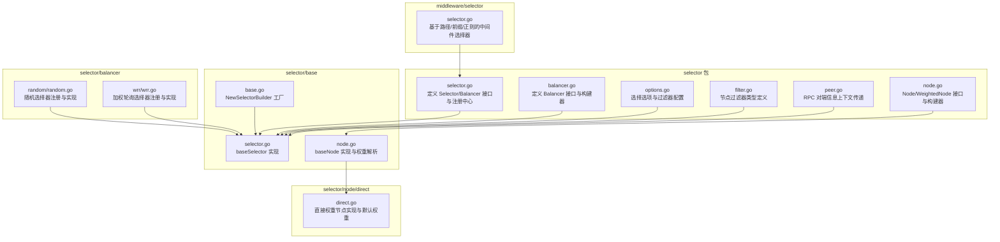
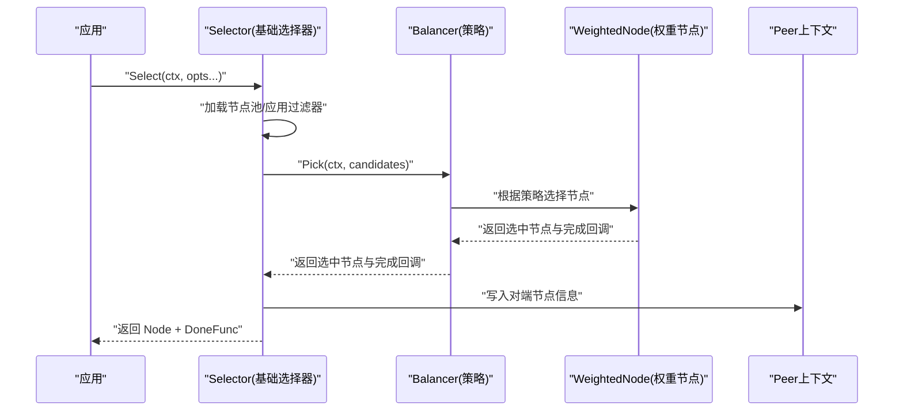
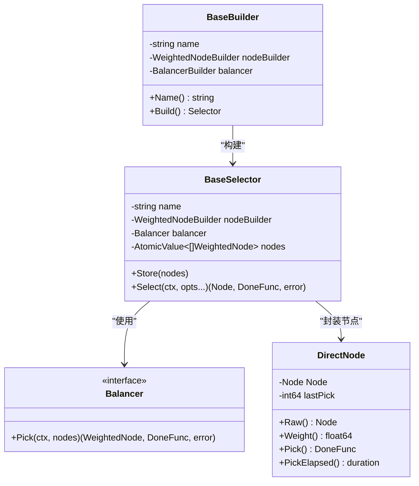
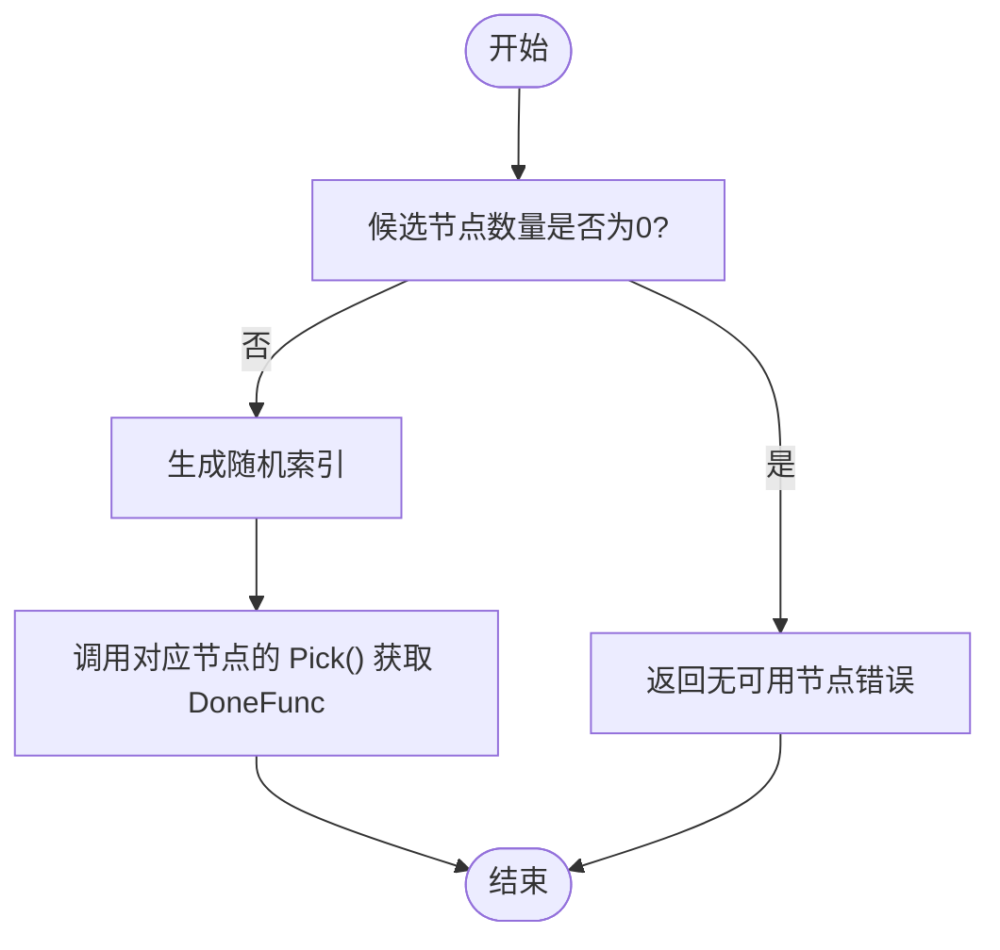
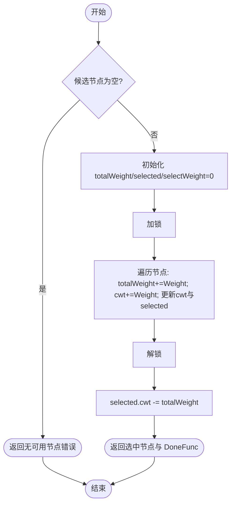
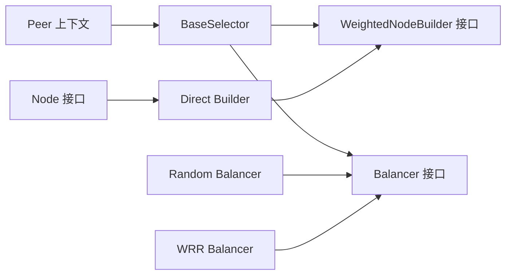

# 负载均衡

<cite>
**本文引用的文件**
- [selector.go](file://selector/selector.go)
- [balancer.go](file://selector/balancer.go)
- [options.go](file://selector/options.go)
- [filter.go](file://selector/filter.go)
- [peer.go](file://selector/peer.go)
- [node.go](file://selector/node.go)
- [base/selector.go](file://selector/base/selector.go)
- [base/base.go](file://selector/base/base.go)
- [base/node.go](file://selector/base/node.go)
- [node/direct/direct.go](file://selector/node/direct/direct.go)
- [balancer/random/random.go](file://selector/balancer/random/random.go)
- [balancer/wrr/wrr.go](file://selector/balancer/wrr/wrr.go)
- [middleware/selector/selector.go](file://middleware/selector/selector.go)
</cite>

## 目录
1. [简介](#简介)
2. [项目结构](#项目结构)
3. [核心组件](#核心组件)
4. [架构总览](#架构总览)
5. [详细组件分析](#详细组件分析)
6. [依赖分析](#依赖分析)
7. [性能考虑](#性能考虑)
8. [故障排查指南](#故障排查指南)
9. [结论](#结论)
10. [附录](#附录)

## 简介
本技术文档围绕 Go Fox 负载均衡系统，系统性阐述以下内容：
- 负载均衡器接口设计与实现机制
- 随机负载均衡算法（random）的实现逻辑：权重计算与节点选择策略
- 加权轮询负载均衡算法（wrr）的工作原理：权重分配、轮询计数与节点调度机制
- Selector 接口的使用方法与配置选项：初始化、节点管理、策略切换
- BaseSelector 基础选择器的实现细节：节点池管理、状态维护、性能优化
- 最佳实践：权重设置、健康检查、故障转移策略
- 实际配置示例与性能调优建议

## 项目结构
本节聚焦于负载均衡相关的核心目录与文件，展示模块化组织方式与职责划分。

图表来源
- [selector.go](file://selector/selector.go#L84-L96)
- [balancer.go](file://selector/balancer.go#L28-L37)
- [options.go](file://selector/options.go#L26-L40)
- [filter.go](file://selector/filter.go#L28-L30)
- [peer.go](file://selector/peer.go#L30-L49)
- [node.go](file://selector/node.go#L28-L72)
- [base/base.go](file://selector/base/base.go#L28-L40)
- [base/selector.go](file://selector/base/selector.go#L39-L111)
- [base/node.go](file://selector/base/node.go#L37-L88)
- [node/direct/direct.go](file://selector/node/direct/direct.go#L34-L82)
- [balancer/random/random.go](file://selector/balancer/random/random.go#L35-L68)
- [balancer/wrr/wrr.go](file://selector/balancer/wrr/wrr.go#L12-L69)
- [middleware/selector/selector.go](file://middleware/selector/selector.go#L27-L144)

章节来源
- [selector.go](file://selector/selector.go#L1-L96)
- [balancer.go](file://selector/balancer.go#L1-L37)
- [options.go](file://selector/options.go#L1-L40)
- [filter.go](file://selector/filter.go#L1-L30)
- [peer.go](file://selector/peer.go#L1-L49)
- [node.go](file://selector/node.go#L1-L72)
- [base/base.go](file://selector/base/base.go#L1-L40)
- [base/selector.go](file://selector/base/selector.go#L1-L111)
- [base/node.go](file://selector/base/node.go#L1-L88)
- [node/direct/direct.go](file://selector/node/direct/direct.go#L1-L82)
- [balancer/random/random.go](file://selector/balancer/random/random.go#L1-L68)
- [balancer/wrr/wrr.go](file://selector/balancer/wrr/wrr.go#L1-L69)
- [middleware/selector/selector.go](file://middleware/selector/selector.go#L1-L144)

## 核心组件
- Selector 接口：统一的节点选择抽象，支持存储节点集合与按策略选择节点，并返回完成回调。
- Balancer 接口：具体负载均衡算法的抽象，负责从候选节点中挑选一个并返回完成回调。
- WeightedNode/Node：节点抽象，支持运行时权重计算、原始节点访问、Pick 计时等能力。
- BaseSelector：通用选择器实现，封装节点池、过滤器链、策略分发与上下文对端信息写入。
- Direct 节点构建器：将普通 Node 封装为 WeightedNode，默认权重与 Pick 时间记录。
- Random/WRR 策略：内置两种负载均衡策略，通过注册中心注册并可被选择器使用。

章节来源
- [selector.go](file://selector/selector.go#L84-L96)
- [balancer.go](file://selector/balancer.go#L28-L37)
- [node.go](file://selector/node.go#L28-L72)
- [base/selector.go](file://selector/base/selector.go#L39-L111)
- [node/direct/direct.go](file://selector/node/direct/direct.go#L34-L82)
- [balancer/random/random.go](file://selector/balancer/random/random.go#L35-L68)
- [balancer/wrr/wrr.go](file://selector/balancer/wrr/wrr.go#L12-L69)

## 架构总览
下图展示了从应用侧到传输层的调用链路，以及负载均衡在其中的位置。

图表来源
- [base/selector.go](file://selector/base/selector.go#L54-L91)
- [balancer.go](file://selector/balancer.go#L28-L31)
- [node/direct/direct.go](file://selector/node/direct/direct.go#L64-L68)
- [peer.go](file://selector/peer.go#L40-L48)

## 详细组件分析

### Selector 接口与注册中心
- Selector 接口：提供存储节点集合与选择节点的能力；选择时返回原始 Node 与完成回调函数，便于统计与清理。
- 注册中心：通过名称注册不同策略的 Builder，支持动态获取与遍历所有可用选择器。

章节来源
- [selector.go](file://selector/selector.go#L84-L96)
- [selector.go](file://selector/selector.go#L61-L77)

### Balancer 接口与策略构建
- Balancer 接口：定义 Pick(ctx, nodes) 选择逻辑，返回 WeightedNode 与 DoneFunc。
- BalancerBuilder：用于构建具体 Balancer 实例，配合选择器工厂统一装配。

章节来源
- [balancer.go](file://selector/balancer.go#L28-L37)

### 节点抽象与权重节点
- Node：描述服务实例的基本属性（协议、地址、服务名、初始权重、版本、元数据）。
- WeightedNode：在 Node 基础上扩展运行时权重、Pick 行为与 PickElapsed 统计。
- WeightedNodeBuilder：将 Node 转换为 WeightedNode 的构建器。

章节来源
- [node.go](file://selector/node.go#L28-L72)

### Direct 节点构建器
- 默认权重：当未设置初始权重时，采用固定默认权重。
- Pick 行为：记录最近一次 Pick 的时间戳，便于后续统计与观察。
- 构建流程：将 Node 封装为 WeightedNode 并初始化 lastPick。

章节来源
- [node/direct/direct.go](file://selector/node/direct/direct.go#L34-L82)

### BaseSelector 基础选择器
- 节点池管理：使用原子值保存当前节点切片，支持并发安全的替换与读取。
- 过滤器链：可选地对候选节点进行过滤，形成最终候选集。
- 策略分发：将候选节点交给 Balancer 执行 Pick。
- 上下文集成：将选中的原始节点写入 Peer 上下文，便于后续中间件或日志使用。

图表来源
- [base/selector.go](file://selector/base/selector.go#L39-L111)
- [node/direct/direct.go](file://selector/node/direct/direct.go#L43-L82)

章节来源
- [base/selector.go](file://selector/base/selector.go#L39-L111)
- [base/base.go](file://selector/base/base.go#L28-L40)
- [base/node.go](file://selector/base/node.go#L37-L88)

### 随机负载均衡算法（random）
- 策略要点：从候选节点中以相等概率随机选择一个。
- 权重处理：该策略不使用运行时权重，直接随机索引选择。
- 完成回调：调用选中节点的 Pick 返回 DoneFunc，用于后续统计或清理。

图表来源
- [balancer/random/random.go](file://selector/balancer/random/random.go#L53-L61)

章节来源
- [balancer/random/random.go](file://selector/balancer/random/random.go#L35-L68)

### 加权轮询负载均衡算法（wrr）
- 算法来源：参考 Nginx 加权轮询思想，维护每个节点的当前权重与总权重。
- 关键步骤：
  - 遍历候选节点，累加总权重，并为每个节点增加其有效权重到当前权重。
  - 选择当前权重最大的节点作为本次目标。
  - 将目标节点的当前权重减去总权重，其余节点的当前权重保持不变。
- 线程安全：使用互斥锁保护当前权重映射表的读写。

图表来源
- [balancer/wrr/wrr.go](file://selector/balancer/wrr/wrr.go#L33-L59)

章节来源
- [balancer/wrr/wrr.go](file://selector/balancer/wrr/wrr.go#L12-L69)

### 选择器配置与节点过滤
- 选择选项：支持设置 NodeFilter 列表，对候选节点进行多步过滤。
- 过滤器类型：NodeFilter 函数签名接收上下文与节点切片，返回过滤后的节点切片。
- 使用场景：可用于健康检查过滤、区域/版本过滤、标签匹配等。

章节来源
- [options.go](file://selector/options.go#L26-L40)
- [filter.go](file://selector/filter.go#L28-L30)

### Peer 上下文与对端信息
- Peer 结构：封装一次 RPC 的对端节点信息。
- 上下文工具：提供上下文读写工具，便于在中间件或拦截器中获取对端节点。

章节来源
- [peer.go](file://selector/peer.go#L30-L49)

### 中间件选择器（按路径/前缀/正则匹配）
- 功能：在客户端或服务端中间件中，基于操作名（Operation）匹配前缀、路径或正则表达式，决定是否应用选择器中间件链。
- 支持：提供 Server()/Client() 构造器，以及 Prefix()/Path()/Regex()/Match() 配置方法。

章节来源
- [middleware/selector/selector.go](file://middleware/selector/selector.go#L27-L144)

## 依赖分析
- 组件耦合：
  - BaseSelector 依赖 Balancer 与 WeightedNodeBuilder，解耦了策略与节点封装。
  - Direct 节点构建器与 Node 抽象解耦，便于扩展其他权重策略。
  - Random/WRR 策略通过注册中心与选择器工厂装配，支持动态切换。
- 外部依赖：
  - 原子容器用于节点池的并发安全更新。
  - 上下文用于传递 Peer 信息，贯穿选择器与中间件。

图表来源
- [base/selector.go](file://selector/base/selector.go#L39-L111)
- [balancer.go](file://selector/balancer.go#L28-L37)
- [node/direct/direct.go](file://selector/node/direct/direct.go#L75-L82)
- [node.go](file://selector/node.go#L28-L72)
- [peer.go](file://selector/peer.go#L40-L48)

章节来源
- [base/selector.go](file://selector/base/selector.go#L39-L111)
- [balancer.go](file://selector/balancer.go#L28-L37)
- [node/direct/direct.go](file://selector/node/direct/direct.go#L34-L82)
- [node.go](file://selector/node.go#L28-L72)
- [peer.go](file://selector/peer.go#L30-L49)

## 性能考虑
- 节点池并发更新：使用原子值保存节点切片，避免频繁拷贝与锁竞争。
- 选择过程轻量：Random 为 O(1)，WRR 在节点数量较多时为 O(n)；建议控制节点规模或引入缓存。
- 锁粒度：WRR 使用互斥锁保护当前权重映射，建议在高并发场景评估锁开销。
- 过滤器链：尽量减少过滤器数量与复杂度，必要时在上游缓存过滤结果。
- 默认权重：Direct 默认权重可作为基线，结合业务场景调整以平衡流量分布。

## 故障排查指南
- 无可用节点：当节点池为空或全部被过滤后，选择器会返回“无可用节点”错误。请检查节点注册、健康检查与过滤器配置。
- 选择器未生效：确认已通过注册中心注册所需策略，并在选择器工厂中正确装配。
- Peer 信息缺失：若需要在下游中间件中获取对端节点，请确保选择器执行后上下文已写入 Peer 信息。
- WRR 权重异常：检查节点元数据中的权重字段是否可解析为整数，以及是否与期望一致。

章节来源
- [selector.go](file://selector/selector.go#L35-L36)
- [base/selector.go](file://selector/base/selector.go#L79-L81)
- [peer.go](file://selector/peer.go#L40-L48)

## 结论
Go Fox 负载均衡系统通过清晰的接口分层与可插拔的策略机制，提供了灵活且高性能的节点选择能力。Random 与 WRR 两种策略覆盖了简单均匀与公平调度的典型需求；BaseSelector 将节点封装、过滤与策略分发整合为一体，便于扩展与维护。结合中间件选择器与 Peer 上下文，系统可在不同传输层与中间件生态中无缝集成。

## 附录

### 配置示例与最佳实践
- 初始化选择器（以随机策略为例）：
  - 通过工厂创建选择器，注入 Direct 节点构建器与 Random 策略构建器。
  - 将节点集合写入选择器（Store），随后在请求中调用 Select 获取节点与完成回调。
- 权重设置：
  - 在服务实例元数据中设置权重键值，Direct 节点构建器会解析为初始权重；未设置时使用默认权重。
- 健康检查与故障转移：
  - 使用 NodeFilter 对不可用节点进行过滤，实现健康检查与快速故障转移。
- 性能调优建议：
  - 控制节点数量，避免 WRR 的线性扫描开销过大。
  - 合理设置默认权重与业务权重，确保流量分布符合预期。
  - 在高并发场景评估锁竞争，必要时引入更细粒度的同步策略或缓存热点节点。

章节来源
- [base/base.go](file://selector/base/base.go#L28-L40)
- [base/selector.go](file://selector/base/selector.go#L46-L91)
- [node/direct/direct.go](file://selector/node/direct/direct.go#L34-L61)
- [balancer/random/random.go](file://selector/balancer/random/random.go#L35-L68)
- [balancer/wrr/wrr.go](file://selector/balancer/wrr/wrr.go#L12-L69)
- [options.go](file://selector/options.go#L26-L40)