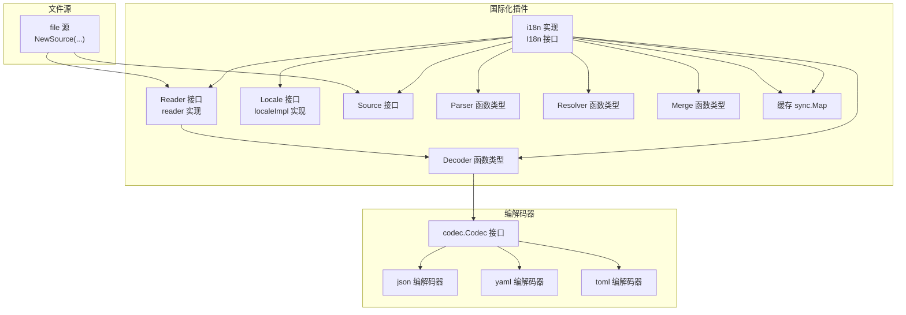
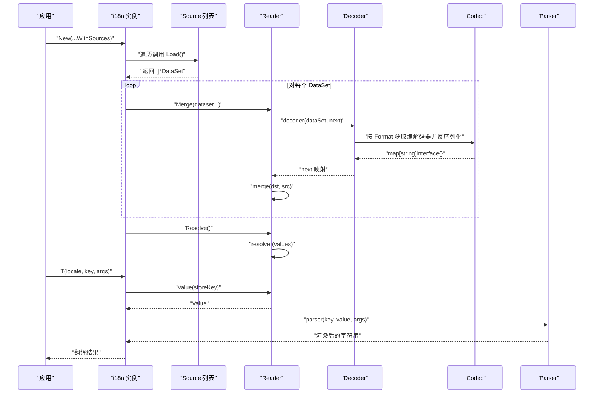
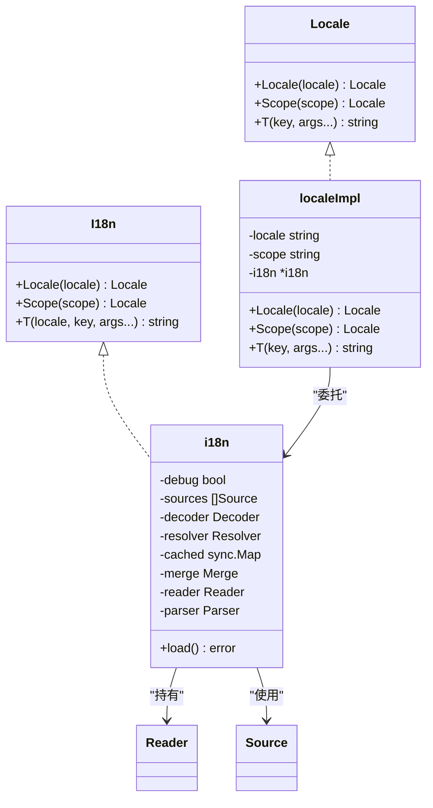
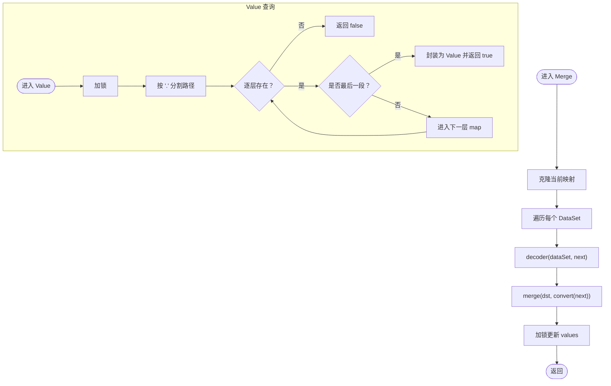
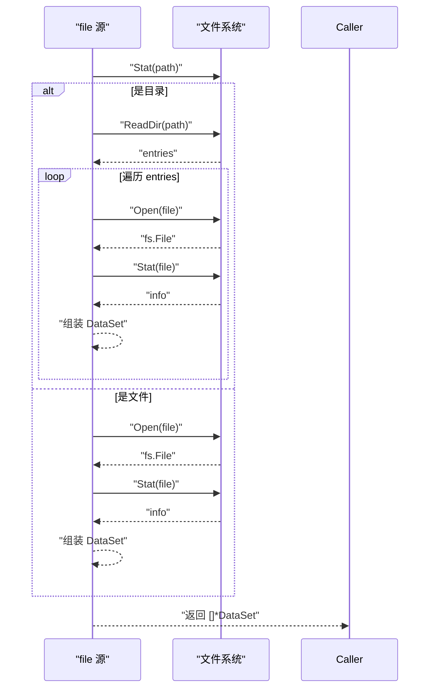
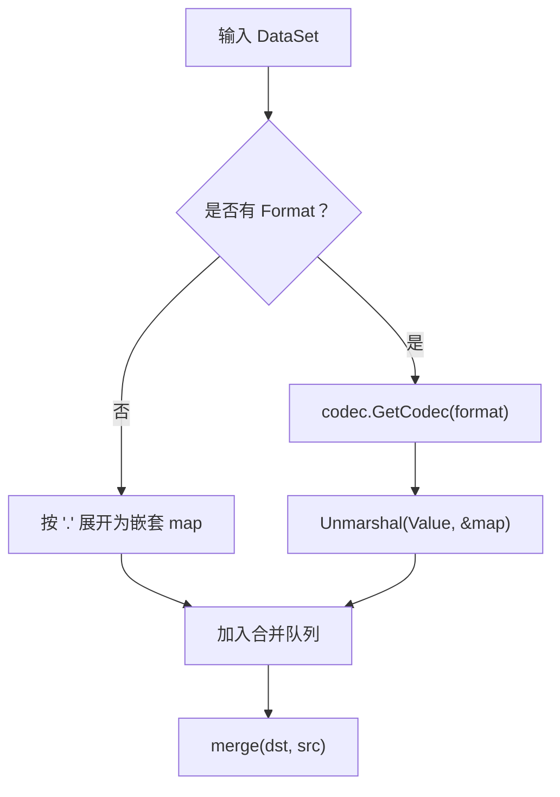
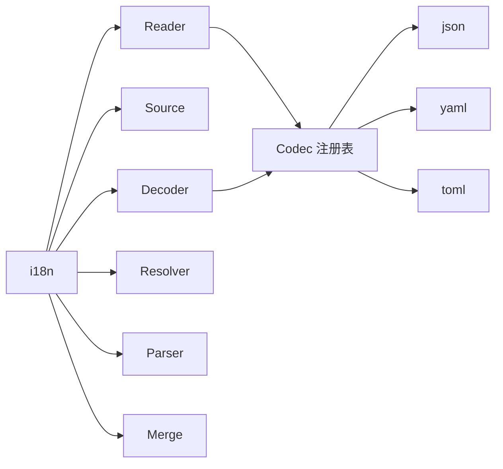

# 国际化插件

<cite>
**本文引用的文件**
- [contrib/i18n/i18n.go](file://contrib/i18n/i18n.go)
- [contrib/i18n/options.go](file://contrib/i18n/options.go)
- [contrib/i18n/translate.go](file://contrib/i18n/translate.go)
- [contrib/i18n/source.go](file://contrib/i18n/source.go)
- [contrib/i18n/reader.go](file://contrib/i18n/reader.go)
- [contrib/i18n/file.go](file://contrib/i18n/file.go)
- [contrib/i18n/value.go](file://contrib/i18n/value.go)
- [contrib/i18n/i18n_test.go](file://contrib/i18n/i18n_test.go)
- [contrib/i18n/README.md](file://contrib/i18n/README.md)
- [codec/codec.go](file://codec/codec.go)
- [codec/json/json.go](file://codec/json/json.go)
- [codec/yaml/yaml.go](file://codec/yaml/yaml.go)
- [codec/toml/toml.go](file://codec/toml/toml.go)
- [go.mod](file://go.mod)
</cite>

## 目录
1. [简介](#简介)
2. [项目结构](#项目结构)
3. [核心组件](#核心组件)
4. [架构总览](#架构总览)
5. [组件详解](#组件详解)
6. [依赖关系分析](#依赖关系分析)
7. [性能与缓存](#性能与缓存)
8. [故障排查指南](#故障排查指南)
9. [结论](#结论)
10. [附录](#附录)

## 简介
本文件面向希望在 Go Fox 生态中集成多语言能力的开发者，系统性阐述国际化插件的设计理念、架构与实现细节。内容涵盖：
- 多语言支持与翻译加载流程
- 翻译文件组织与加载机制（文件读取器、翻译源、语言包管理）
- 翻译 API 的使用方式（文本翻译、参数替换、占位符解析）
- 配置项与扩展点（语言切换、默认语言、解析器、合并策略、调试模式）
- 最佳实践与使用示例（多语言应用开发、翻译管理、性能优化）

## 项目结构
国际化插件位于 contrib/i18n 目录，围绕“源(Source)”“读取器(Reader)”“解析器(Parser)”“接口(I18n/Locale)”四大模块协作，配合通用编解码器(codec)完成多格式翻译文件的读取与合并。

图表来源
- [contrib/i18n/i18n.go](file://contrib/i18n/i18n.go#L44-L138)
- [contrib/i18n/reader.go](file://contrib/i18n/reader.go#L40-L98)
- [contrib/i18n/translate.go](file://contrib/i18n/translate.go#L32-L73)
- [contrib/i18n/source.go](file://contrib/i18n/source.go#L30-L43)
- [contrib/i18n/file.go](file://contrib/i18n/file.go#L34-L74)
- [codec/codec.go](file://codec/codec.go#L33-L60)
- [codec/json/json.go](file://codec/json/json.go#L63-L103)
- [codec/yaml/yaml.go](file://codec/yaml/yaml.go#L45-L61)
- [codec/toml/toml.go](file://codec/toml/toml.go#L40-L64)

章节来源
- [contrib/i18n/i18n.go](file://contrib/i18n/i18n.go#L1-L138)
- [contrib/i18n/options.go](file://contrib/i18n/options.go#L1-L191)
- [contrib/i18n/reader.go](file://contrib/i18n/reader.go#L1-L173)
- [contrib/i18n/translate.go](file://contrib/i18n/translate.go#L1-L73)
- [contrib/i18n/source.go](file://contrib/i18n/source.go#L1-L43)
- [contrib/i18n/file.go](file://contrib/i18n/file.go#L1-L124)
- [codec/codec.go](file://codec/codec.go#L1-L61)
- [codec/json/json.go](file://codec/json/json.go#L1-L104)
- [codec/yaml/yaml.go](file://codec/yaml/yaml.go#L1-L62)
- [codec/toml/toml.go](file://codec/toml/toml.go#L1-L65)

## 核心组件
- I18n 接口与实现：提供 Locale/Scope/T 等入口，负责加载数据源、合并与解析、缓存与模板解析。
- Reader 接口与实现：负责将 DataSet 合并为内存映射，并支持路径查询与最终解析。
- Source 接口与 file 源：抽象翻译文件来源，file 源支持单文件、目录扫描、自动识别语言与格式。
- Options 与默认策略：包含 Decoder、Resolver、Parser、Merge、WithDebug 等可插拔扩展点。
- Value 原子包装：对最终值进行线程安全字符串化访问。

章节来源
- [contrib/i18n/i18n.go](file://contrib/i18n/i18n.go#L44-L138)
- [contrib/i18n/reader.go](file://contrib/i18n/reader.go#L40-L98)
- [contrib/i18n/translate.go](file://contrib/i18n/translate.go#L32-L73)
- [contrib/i18n/source.go](file://contrib/i18n/source.go#L30-L43)
- [contrib/i18n/options.go](file://contrib/i18n/options.go#L36-L191)
- [contrib/i18n/value.go](file://contrib/i18n/value.go#L28-L44)

## 架构总览
国际化插件采用“源-读取-解析-缓存”的流水线式设计：
- 初始化阶段：通过 New 构造实例，注册默认编解码器，创建 Reader 并加载所有 Source。
- 加载阶段：每个 Source 返回若干 DataSet，Reader 调用 Decoder 将其转换为嵌套映射，再由 Merge 合并到共享内存。
- 解析阶段：Resolver 对嵌套映射中的占位符进行替换；Reader.Resolve 触发解析。
- 查询阶段：T 或 Locale.Scope.T 通过 Reader.Value 查找路径值，Parser 执行模板渲染，缓存结果以提升后续访问性能。

图表来源
- [contrib/i18n/i18n.go](file://contrib/i18n/i18n.go#L63-L100)
- [contrib/i18n/reader.go](file://contrib/i18n/reader.go#L62-L98)
- [contrib/i18n/options.go](file://contrib/i18n/options.go#L93-L191)
- [codec/codec.go](file://codec/codec.go#L52-L60)

章节来源
- [contrib/i18n/i18n.go](file://contrib/i18n/i18n.go#L63-L100)
- [contrib/i18n/reader.go](file://contrib/i18n/reader.go#L62-L98)
- [contrib/i18n/options.go](file://contrib/i18n/options.go#L93-L191)

## 组件详解

### I18n 接口与实现
- 提供三类入口：
  - Locale(locale)：指定语言上下文
  - Scope(scope)：设置命名空间前缀
  - T(locale, key, args...)：执行翻译与模板渲染
- 内部状态：
  - sources：数据源列表
  - decoder/resolver/parser/merge：可替换的策略
  - cached：键为“locale.key”的原子缓存
  - reader：统一的数据读取与解析器
- 生命周期：
  - New 初始化后立即加载并解析
  - load 遍历 Source，调用 Reader.Merge/Resolve
  - T 先查缓存，再查 Reader.Value，最后 Parser 渲染

图表来源
- [contrib/i18n/i18n.go](file://contrib/i18n/i18n.go#L44-L138)
- [contrib/i18n/translate.go](file://contrib/i18n/translate.go#L32-L73)

章节来源
- [contrib/i18n/i18n.go](file://contrib/i18n/i18n.go#L44-L138)
- [contrib/i18n/translate.go](file://contrib/i18n/translate.go#L32-L73)

### Reader 接口与实现
- 职责：
  - Merge：将多个 DataSet 合并到共享映射
  - Value：按“a.b.c”路径查找值，返回 Value 包装
  - Resolve：对映射中的字符串进行占位符替换
  - Source：导出当前映射为 JSON/ProtoJSON
- 并发：
  - 使用互斥锁保护共享映射
  - cloneMap 使用深拷贝避免并发读写问题
- 类型转换：
  - convertMap 支持 map[interface{}]、[]interface{} 等不规范键类型转换

图表来源
- [contrib/i18n/reader.go](file://contrib/i18n/reader.go#L62-L158)

章节来源
- [contrib/i18n/reader.go](file://contrib/i18n/reader.go#L40-L173)

### Source 接口与 file 源
- DataSet 结构：
  - Locale：语言标识（如 zh_CN、en_US）
  - Format：文件格式（如 json、yaml、toml）
  - Value：文件字节内容
  - Timestamp：修改时间
- file 源：
  - 支持传入字符串路径或 fs.File
  - 目录时递归扫描，忽略隐藏文件
  - 自动从文件名推断 Locale 与 Format

图表来源
- [contrib/i18n/file.go](file://contrib/i18n/file.go#L49-L124)
- [contrib/i18n/source.go](file://contrib/i18n/source.go#L30-L43)

章节来源
- [contrib/i18n/source.go](file://contrib/i18n/source.go#L30-L43)
- [contrib/i18n/file.go](file://contrib/i18n/file.go#L34-L124)

### Options 与默认策略
- Decoder：将 DataSet 反序列化为 map[string]interface{}，若无 Format 则按“.”展开为嵌套 map
- Resolver：对字符串中的 ${key:default} 进行占位符替换
- Parser：基于 yamltemplate 对模板字符串进行渲染
- Merge：默认使用 mergo.WithOverride 合并映射
- WithDebug：开启调试日志

图表来源
- [contrib/i18n/options.go](file://contrib/i18n/options.go#L93-L121)

章节来源
- [contrib/i18n/options.go](file://contrib/i18n/options.go#L36-L191)

### 编解码器与格式支持
- codec.Codec 接口：Name/Marshal/Unmarshal
- 已注册的格式：
  - JSON：支持 proto.Message 与标准 JSON
  - YAML：标准 YAML
  - TOML：BurntSushi/toml
- 默认初始化会引入 json、proto、toml、xml、yaml 编解码器

章节来源
- [codec/codec.go](file://codec/codec.go#L33-L60)
- [codec/json/json.go](file://codec/json/json.go#L63-L103)
- [codec/yaml/yaml.go](file://codec/yaml/yaml.go#L45-L61)
- [codec/toml/toml.go](file://codec/toml/toml.go#L40-L64)
- [contrib/i18n/i18n.go](file://contrib/i18n/i18n.go#L34-L40)

### 翻译 API 使用
- 原始 API：T(locale, key, args...)
- 作用域 API：Locale(locale).Scope(scope).T(key, args...)
- 参数替换：默认使用 yamltemplate，键名为 {{.Name}}
- 占位符解析：Resolver 支持 ${key:default} 语法

章节来源
- [contrib/i18n/i18n.go](file://contrib/i18n/i18n.go#L118-L138)
- [contrib/i18n/translate.go](file://contrib/i18n/translate.go#L66-L73)
- [contrib/i18n/options.go](file://contrib/i18n/options.go#L165-L179)

## 依赖关系分析
- 内聚性：i18n 与 reader 耦合度低，通过接口交互；localeImpl 仅作为上下文代理。
- 扩展点：Decoder/Resolver/Parser/Merge/WithDebug 可替换，Source 可自定义。
- 外部依赖：mergo 用于映射合并；yamltemplate 用于模板渲染；codec 注册表提供格式编解码。

图表来源
- [contrib/i18n/i18n.go](file://contrib/i18n/i18n.go#L63-L82)
- [contrib/i18n/options.go](file://contrib/i18n/options.go#L93-L121)
- [codec/codec.go](file://codec/codec.go#L52-L60)

章节来源
- [contrib/i18n/i18n.go](file://contrib/i18n/i18n.go#L63-L82)
- [contrib/i18n/options.go](file://contrib/i18n/options.go#L93-L121)
- [codec/codec.go](file://codec/codec.go#L52-L60)

## 性能与缓存
- 缓存策略：以“locale.key”为键，Value 为值，命中后直接返回字符串，避免重复解析与模板渲染。
- 并发安全：Reader 使用互斥锁保护共享映射；Value 返回原子包装，确保字符串化过程安全。
- 合并成本：Merge 在加载阶段一次性完成，运行时只做查询与渲染。
- 建议：
  - 将常用键预热到缓存（例如应用启动时批量调用 T）
  - 控制 Scope 层级深度，避免过长路径导致查找开销增加
  - 合理拆分语言包，减少单文件体积与解析压力

章节来源
- [contrib/i18n/i18n.go](file://contrib/i18n/i18n.go#L118-L138)
- [contrib/i18n/reader.go](file://contrib/i18n/reader.go#L82-L98)
- [contrib/i18n/value.go](file://contrib/i18n/value.go#L28-L44)

## 故障排查指南
- 加载失败：
  - 检查 Source.Load 是否正确返回 DataSet（Locale/Format/Value）
  - 确认 Format 对应的编解码器已注册
- 解析异常：
  - 检查模板语法与参数键名是否匹配
  - 开启 WithDebug 查看错误日志
- 占位符未替换：
  - 确认 Resolver 正常工作，检查 ${key:default} 语法
- 性能问题：
  - 检查是否存在大量深层路径查询
  - 调整 Scope 设计，减少不必要的层级

章节来源
- [contrib/i18n/options.go](file://contrib/i18n/options.go#L123-L179)
- [contrib/i18n/i18n.go](file://contrib/i18n/i18n.go#L118-L138)

## 结论
该国际化插件通过清晰的职责分离与可插拔策略，提供了稳定、易扩展的多语言支持能力。结合文件源、编解码器与模板解析，开发者可以快速搭建多语言应用，并通过缓存与并发控制保障性能。

## 附录

### 配置选项与扩展机制
- WithSources：注入一个或多个 Source
- WithDecoder：自定义解码策略
- WithResolver：自定义占位符解析策略
- WithParse：自定义模板解析策略
- WithMerge：自定义合并策略
- WithDebug：开启调试日志

章节来源
- [contrib/i18n/options.go](file://contrib/i18n/options.go#L51-L91)

### 翻译文件组织与加载示例
- 文件命名规则：文件名即 Locale（不含扩展名），扩展名即 Format
- 支持格式：json、yaml、toml 等
- 目录扫描：自动遍历目录并过滤隐藏文件
- 示例参考：README 中的示例与测试用例

章节来源
- [contrib/i18n/README.md](file://contrib/i18n/README.md#L1-L73)
- [contrib/i18n/i18n_test.go](file://contrib/i18n/i18n_test.go#L32-L89)
- [contrib/i18n/file.go](file://contrib/i18n/file.go#L117-L123)

### 使用示例（步骤说明）
- 创建语言包目录与文件（如 zh_cn.toml、en_us.json）
- 通过 New + WithSources 指定 file 源
- 使用 T 或 Locale.Scope.T 进行翻译
- 如需参数化，传入 map[string]any 作为模板数据

章节来源
- [contrib/i18n/README.md](file://contrib/i18n/README.md#L34-L71)
- [contrib/i18n/i18n_test.go](file://contrib/i18n/i18n_test.go#L69-L88)