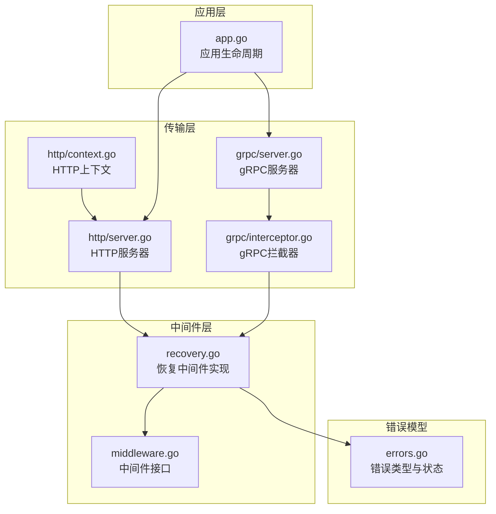
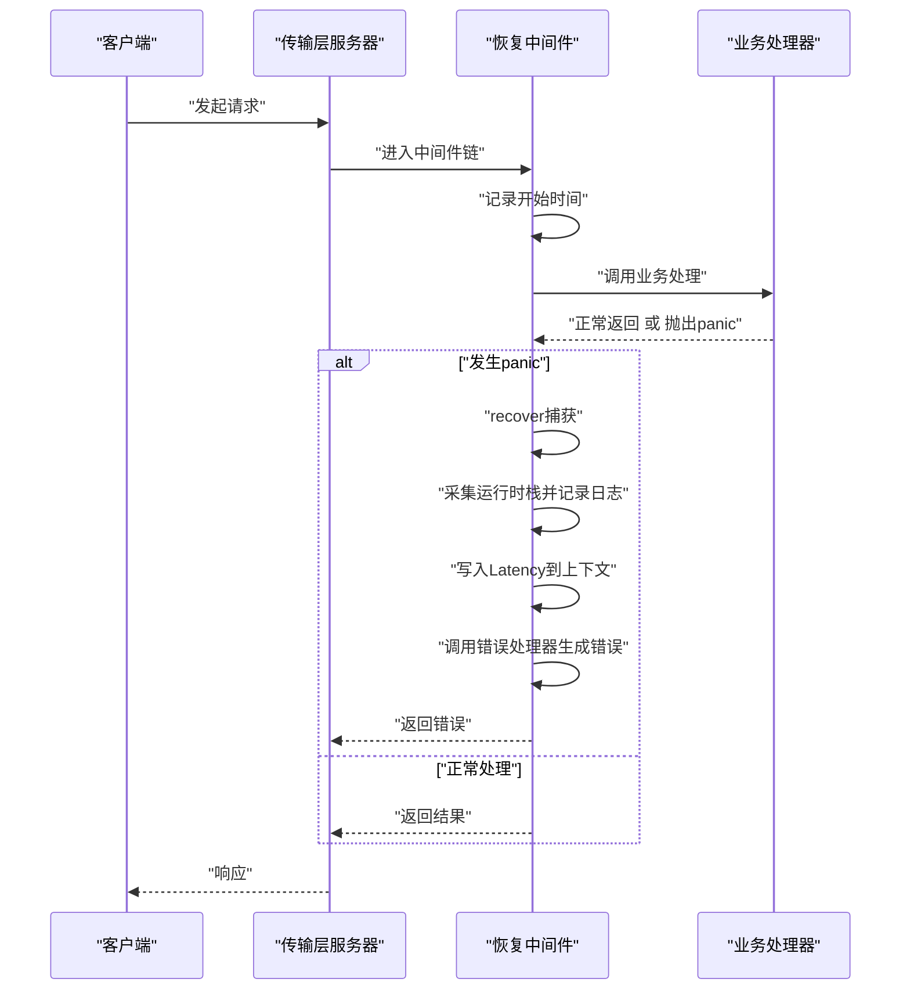
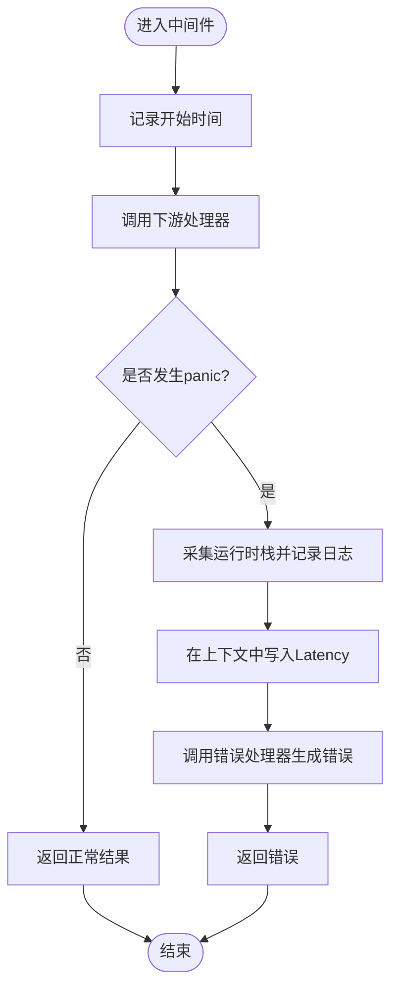
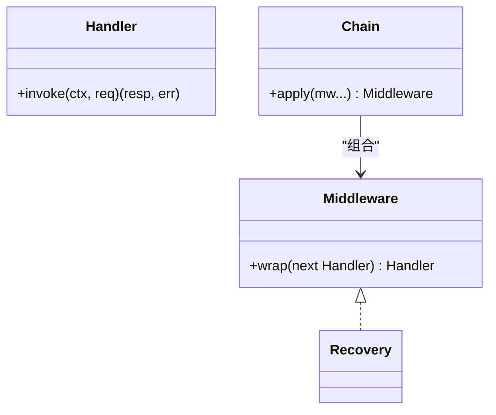
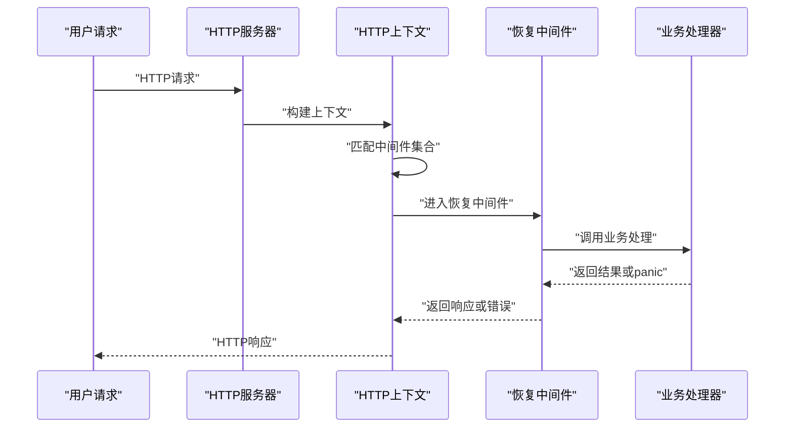
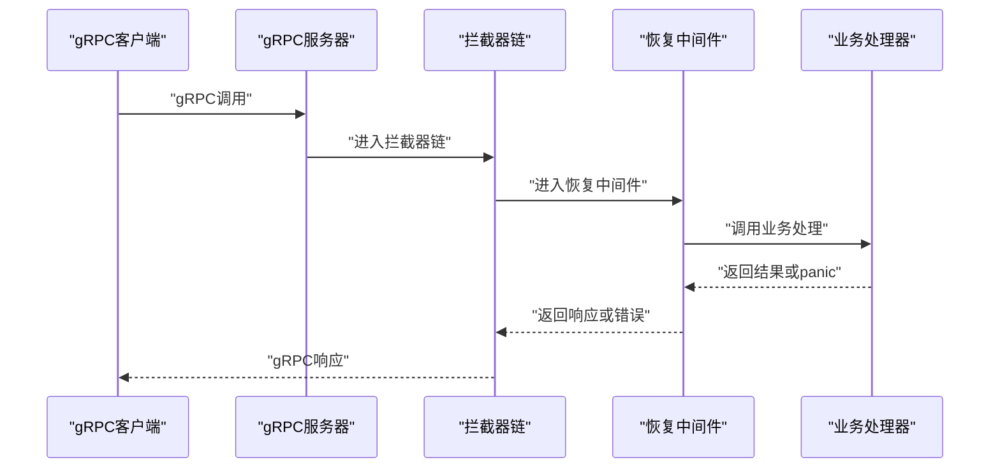
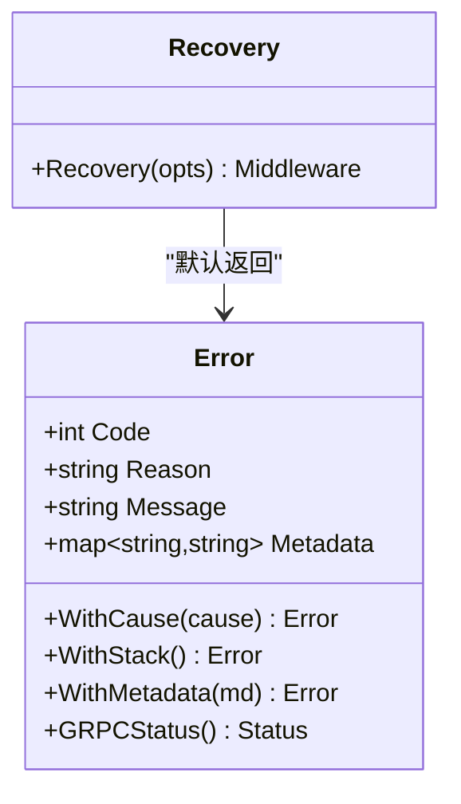
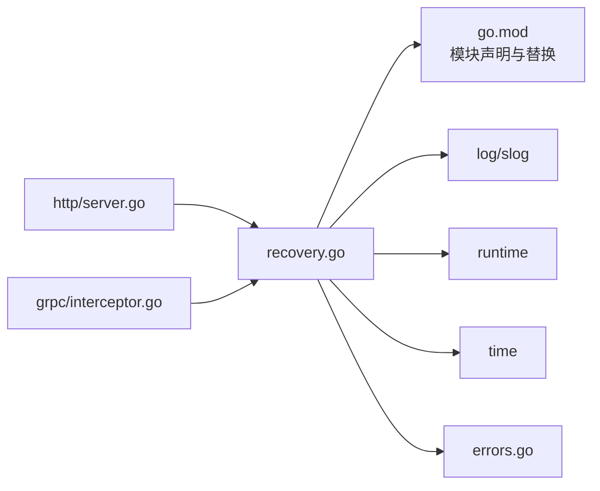

# 恢复中间件

<cite>
**本文引用的文件**
- [contrib/middleware/recovery/recovery.go](file://contrib/middleware/recovery/recovery.go)
- [contrib/middleware/recovery/go.mod](file://contrib/middleware/recovery/go.mod)
- [middleware/middleware.go](file://middleware/middleware.go)
- [errors/errors.go](file://errors/errors.go)
- [transport/http/server.go](file://transport/http/server.go)
- [transport/http/context.go](file://transport/http/context.go)
- [transport/grpc/server.go](file://transport/grpc/server.go)
- [transport/grpc/interceptor.go](file://transport/grpc/interceptor.go)
- [app.go](file://app.go)
</cite>

## 目录
1. [简介](#简介)
2. [项目结构](#项目结构)
3. [核心组件](#核心组件)
4. [架构总览](#架构总览)
5. [组件详解](#组件详解)
6. [依赖关系分析](#依赖关系分析)
7. [性能考量](#性能考量)
8. [故障排查指南](#故障排查指南)
9. [结论](#结论)
10. [附录](#附录)

## 简介
本文件面向Go Fox框架的“恢复中间件”，系统性阐述其设计目标、实现原理与最佳实践。恢复中间件的核心职责是在请求处理过程中捕获panic，进行日志记录、上下文注入（如耗时）、以及通过可插拔的错误处理器统一返回错误，从而提升服务在异常情况下的稳定性与可观测性。本文同时覆盖HTTP、gRPC等传输层的集成方式，并给出配置建议、使用示例与性能优化要点。

## 项目结构
恢复中间件位于contrib子模块中，遵循Go Fox的中间件接口规范，可被HTTP与gRPC服务器按需挂载。整体目录组织如下：
- 中间件实现：contrib/middleware/recovery
- 中间件通用接口：middleware/middleware.go
- 错误模型与状态码：errors/errors.go
- HTTP服务器与路由：transport/http/server.go、transport/http/context.go
- gRPC服务器与拦截器：transport/grpc/server.go、transport/grpc/interceptor.go
- 应用生命周期与服务编排：app.go

**图示来源**
- [contrib/middleware/recovery/recovery.go](file://contrib/middleware/recovery/recovery.go#L54-L79)
- [middleware/middleware.go](file://middleware/middleware.go#L28-L32)
- [errors/errors.go](file://errors/errors.go#L27-L32)
- [transport/http/server.go](file://transport/http/server.go#L101-L133)
- [transport/http/context.go](file://transport/http/context.go#L137-L150)
- [transport/grpc/server.go](file://transport/grpc/server.go#L91-L118)
- [transport/grpc/interceptor.go](file://transport/grpc/interceptor.go#L40-L77)
- [app.go](file://app.go#L184-L221)

**章节来源**
- [contrib/middleware/recovery/recovery.go](file://contrib/middleware/recovery/recovery.go#L54-L79)
- [middleware/middleware.go](file://middleware/middleware.go#L28-L32)
- [errors/errors.go](file://errors/errors.go#L27-L32)
- [transport/http/server.go](file://transport/http/server.go#L101-L133)
- [transport/http/context.go](file://transport/http/context.go#L137-L150)
- [transport/grpc/server.go](file://transport/grpc/server.go#L91-L118)
- [transport/grpc/interceptor.go](file://transport/grpc/interceptor.go#L40-L77)
- [app.go](file://app.go#L184-L221)

## 核心组件
- 恢复中间件入口：Recovery(opts ...Option) 返回一个符合中间件签名的函数，内部通过defer + recover捕获panic。
- 可选错误处理器：通过Option注入自定义HandlerFunc，用于在捕获panic后生成统一错误响应。
- 上下文扩展：在捕获panic时向context写入Latency键值，便于后续统计或日志追踪。
- 默认错误：若未提供自定义处理器，默认返回内部错误对象（包含默认错误码与原因）。

关键点：
- panic捕获与栈打印：使用运行时栈采集，输出到结构化日志。
- 统一错误模型：返回值遵循框架错误类型，便于上层转换为HTTP或gRPC响应。
- 中间件链路：HTTP与gRPC均支持挂载该中间件，形成统一的异常恢复能力。

**章节来源**
- [contrib/middleware/recovery/recovery.go](file://contrib/middleware/recovery/recovery.go#L54-L79)
- [errors/errors.go](file://errors/errors.go#L94-L104)

## 架构总览
恢复中间件作为横切关注点，贯穿HTTP与gRPC两类传输层。其工作流如下：

**图示来源**
- [contrib/middleware/recovery/recovery.go](file://contrib/middleware/recovery/recovery.go#L64-L77)
- [transport/http/context.go](file://transport/http/context.go#L137-L150)
- [transport/grpc/interceptor.go](file://transport/grpc/interceptor.go#L65-L76)

## 组件详解

### 恢复中间件实现
- 设计目标
  - 在业务逻辑不可预期崩溃时，避免进程退出，转而记录堆栈并返回统一错误。
  - 提供可插拔的错误处理器，以适配不同传输层或业务场景。
  - 通过上下文注入关键指标（如耗时），辅助监控与排障。
- 关键机制
  - 使用defer + recover在中间件包裹的处理器外层捕获panic。
  - 采集运行时栈并输出到结构化日志，便于定位问题。
  - 将捕获到的panic与请求对象、上下文一并传给错误处理器，生成最终错误。
  - 在上下文中写入Latency键值，表示从进入中间件到结束的耗时（秒）。
- 默认行为
  - 若未提供自定义处理器，则返回内部错误对象（包含默认错误码与原因）。

**图示来源**
- [contrib/middleware/recovery/recovery.go](file://contrib/middleware/recovery/recovery.go#L64-L77)

**章节来源**
- [contrib/middleware/recovery/recovery.go](file://contrib/middleware/recovery/recovery.go#L54-L79)

### 中间件接口与链式组合
- 接口定义
  - Handler：接收上下文与请求，返回响应与错误。
  - Middleware：对Handler进行包装，返回新的Handler。
  - Chain：将多个中间件按序组合，形成链式调用。
- 作用
  - 为HTTP与gRPC提供一致的中间件接入方式，恢复中间件可插入任意位置，优先级由挂载顺序决定。

**图示来源**
- [middleware/middleware.go](file://middleware/middleware.go#L28-L32)
- [middleware/middleware.go](file://middleware/middleware.go#L54-L66)
- [contrib/middleware/recovery/recovery.go](file://contrib/middleware/recovery/recovery.go#L54-L54)

**章节来源**
- [middleware/middleware.go](file://middleware/middleware.go#L28-L32)
- [middleware/middleware.go](file://middleware/middleware.go#L54-L66)

### HTTP传输层集成
- 服务器初始化
  - HTTP服务器在初始化阶段配置中间件列表，并在路由匹配后按选择器挂载。
- 中间件挂载
  - 支持按路径前缀或子路由挂载，恢复中间件可针对特定路由生效。
- 请求处理
  - HTTP上下文在执行中间件链时，会根据操作名或路径模板匹配对应中间件集合，再依次执行。

**图示来源**
- [transport/http/server.go](file://transport/http/server.go#L101-L133)
- [transport/http/server.go](file://transport/http/server.go#L186-L204)
- [transport/http/context.go](file://transport/http/context.go#L137-L150)

**章节来源**
- [transport/http/server.go](file://transport/http/server.go#L101-L133)
- [transport/http/server.go](file://transport/http/server.go#L186-L204)
- [transport/http/context.go](file://transport/http/context.go#L137-L150)

### gRPC传输层集成
- 拦截器链
  - 服务器在初始化时注册一元与流式拦截器链，恢复中间件可作为其中一项加入。
- 上下文与操作名
  - 拦截器基于gRPC的FullMethod构造传输上下文，恢复中间件通过匹配操作名选择性应用。
- 调用流程
  - 恢复中间件包裹业务处理器，捕获panic并生成错误；随后将响应头设置回gRPC上下文。

**图示来源**
- [transport/grpc/server.go](file://transport/grpc/server.go#L91-L118)
- [transport/grpc/interceptor.go](file://transport/grpc/interceptor.go#L40-L77)
- [transport/grpc/interceptor.go](file://transport/grpc/interceptor.go#L98-L119)

**章节来源**
- [transport/grpc/server.go](file://transport/grpc/server.go#L91-L118)
- [transport/grpc/interceptor.go](file://transport/grpc/interceptor.go#L40-L77)
- [transport/grpc/interceptor.go](file://transport/grpc/interceptor.go#L98-L119)

### 错误模型与统一返回
- 错误类型
  - 内部错误类型包含状态码、原因、消息、元数据与堆栈信息，支持克隆、堆栈附加、元数据设置与gRPC状态转换。
- 默认错误
  - 恢复中间件在未提供自定义处理器时，返回内部错误对象，确保对外统一的错误格式。
- 与传输层的映射
  - HTTP与gRPC均可基于统一错误类型生成相应响应；gRPC还支持将错误转换为标准状态码与详情。

**图示来源**
- [errors/errors.go](file://errors/errors.go#L27-L32)
- [errors/errors.go](file://errors/errors.go#L94-L104)
- [contrib/middleware/recovery/recovery.go](file://contrib/middleware/recovery/recovery.go#L37-L38)

**章节来源**
- [errors/errors.go](file://errors/errors.go#L27-L32)
- [errors/errors.go](file://errors/errors.go#L94-L104)
- [contrib/middleware/recovery/recovery.go](file://contrib/middleware/recovery/recovery.go#L37-L38)

## 依赖关系分析
- 模块依赖
  - 恢复中间件模块显式依赖框架主模块，替换为主仓库路径，确保本地开发一致性。
- 运行时依赖
  - log/slog用于结构化日志输出；runtime用于栈采集；time用于耗时统计。
- 传输层耦合
  - HTTP与gRPC分别通过各自的上下文与拦截器机制，将恢复中间件纳入中间件链，保持一致的行为语义。

**图示来源**
- [contrib/middleware/recovery/go.mod](file://contrib/middleware/recovery/go.mod#L1-L15)
- [contrib/middleware/recovery/recovery.go](file://contrib/middleware/recovery/recovery.go#L26-L35)
- [transport/http/server.go](file://transport/http/server.go#L101-L133)
- [transport/grpc/interceptor.go](file://transport/grpc/interceptor.go#L40-L77)

**章节来源**
- [contrib/middleware/recovery/go.mod](file://contrib/middleware/recovery/go.mod#L1-L15)
- [contrib/middleware/recovery/recovery.go](file://contrib/middleware/recovery/recovery.go#L26-L35)
- [transport/http/server.go](file://transport/http/server.go#L101-L133)
- [transport/grpc/interceptor.go](file://transport/grpc/interceptor.go#L40-L77)

## 性能考量
- panic捕获成本
  - 恢复中间件仅在defer中执行，开销主要来自栈采集与日志输出；对正常路径无额外负担。
- 日志与栈大小
  - 栈缓冲区大小固定，避免过大分配；建议结合日志级别与采样策略控制输出量。
- 中间件链长度
  - 链越长，每次请求的包裹与解包开销越大；建议将恢复中间件置于链路前端，尽早捕获异常。
- 上下文写入
  - 仅在panic发生时写入Latency键值，正常路径不产生额外开销。
- 传输层影响
  - HTTP与gRPC均采用拦截/中间件链机制，性能瓶颈通常不在恢复中间件本身，而在业务处理与序列化环节。

[本节为通用性能讨论，无需具体文件分析]

## 故障排查指南
- 现象
  - 请求异常导致服务崩溃或返回非预期错误。
- 定位步骤
  - 检查日志：恢复中间件会在捕获panic时输出错误与完整栈信息，优先查看该类日志。
  - 检查上下文：确认是否正确注入了Latency键值，以便评估异常发生时的处理耗时。
  - 检查错误处理器：确认是否提供了自定义HandlerFunc，以及其返回的错误是否符合预期。
- 建议
  - 对高频panic场景增加采样与告警，避免日志风暴。
  - 在业务侧补充边界检查与防御性编程，降低panic概率。
  - 对关键路径启用更严格的超时与熔断策略，配合恢复中间件形成双重保障。

**章节来源**
- [contrib/middleware/recovery/recovery.go](file://contrib/middleware/recovery/recovery.go#L64-L77)

## 结论
恢复中间件通过统一的panic捕获与错误处理机制，显著提升了Go Fox服务在异常情况下的稳定性与可观测性。结合HTTP与gRPC的中间件/拦截器链，可在不侵入业务代码的前提下，实现一致的异常恢复策略。建议在生产环境中将其置于中间件链前端，并配合完善的日志与监控体系，持续优化异常处理策略与性能表现。

[本节为总结性内容，无需具体文件分析]

## 附录

### 配置选项与使用方法
- 恢复中间件选项
  - 自定义错误处理器：通过Option注入HandlerFunc，用于在捕获panic后生成统一错误。
  - 默认行为：未提供处理器时，返回内部错误对象。
- 在HTTP中使用
  - 通过服务器的Use方法按路径前缀挂载恢复中间件，使其仅对指定路由生效。
- 在gRPC中使用
  - 在服务器初始化时将恢复中间件加入拦截器链，或通过匹配器按服务/方法维度应用。
- 最佳实践
  - 将恢复中间件置于中间件链前端，确保尽早捕获异常。
  - 结合业务错误模型，统一错误码与原因，便于客户端与监控系统识别。
  - 对关键路径开启超时与重试策略，减少长时间阻塞带来的风险。
  - 定期审查日志与告警，逐步降低panic发生频率。

**章节来源**
- [contrib/middleware/recovery/recovery.go](file://contrib/middleware/recovery/recovery.go#L54-L58)
- [transport/http/server.go](file://transport/http/server.go#L186-L204)
- [transport/grpc/server.go](file://transport/grpc/server.go#L134-L136)