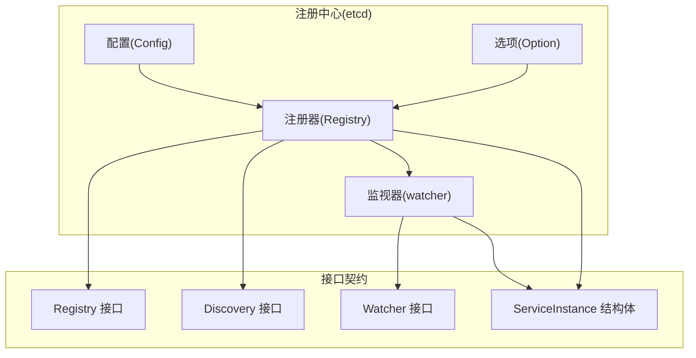
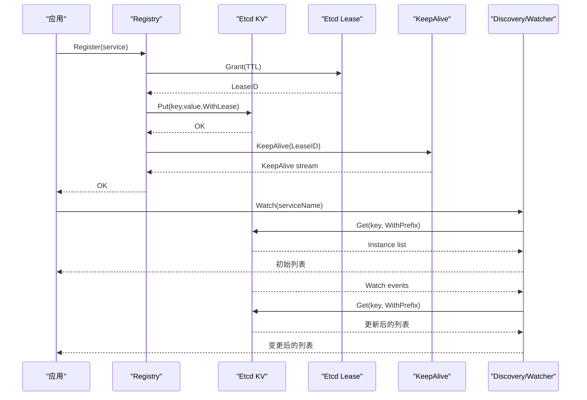
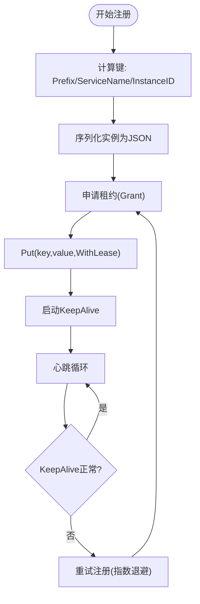
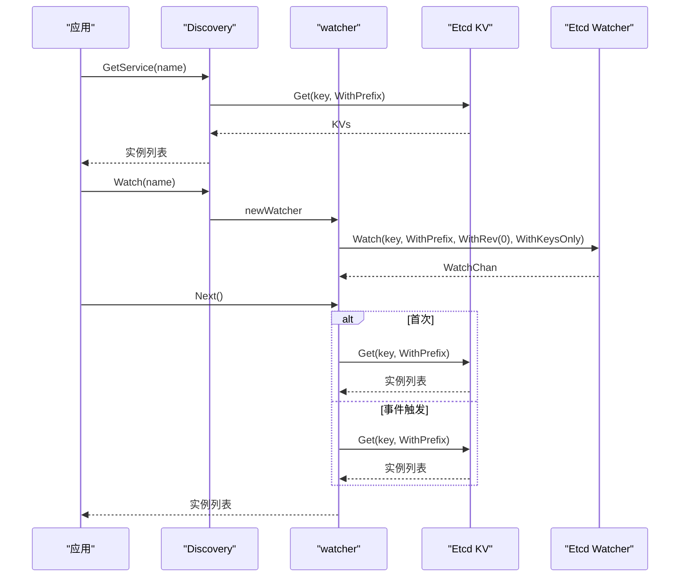
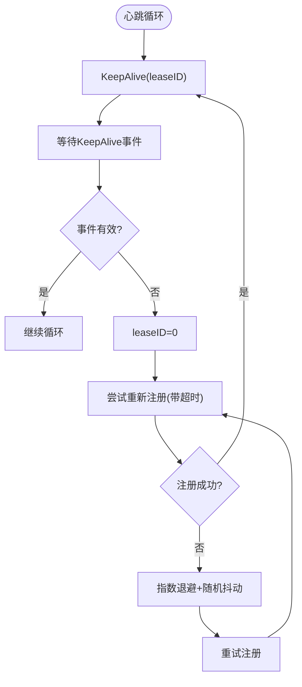
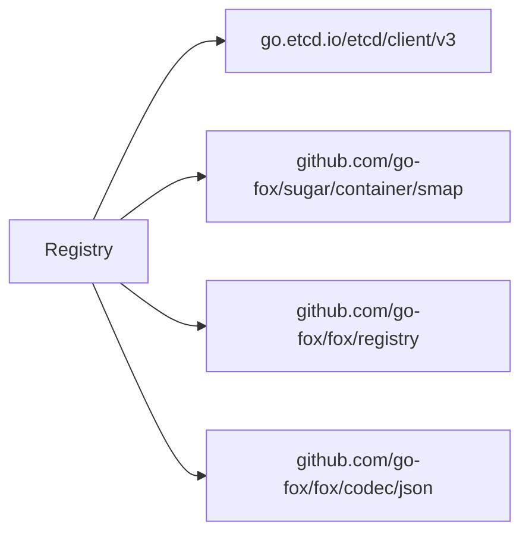

# Etcd注册中心

<cite>
**本文引用的文件**
- [contrib/registry/etcd/registry.go](file://contrib/registry/etcd/registry.go)
- [contrib/registry/etcd/config.go](file://contrib/registry/etcd/config.go)
- [contrib/registry/etcd/options.go](file://contrib/registry/etcd/options.go)
- [contrib/registry/etcd/watcher.go](file://contrib/registry/etcd/watcher.go)
- [contrib/registry/etcd/register_test.go](file://contrib/registry/etcd/register_test.go)
- [registry/registry.go](file://registry/registry.go)
- [go.mod](file://go.mod)
</cite>

## 目录
1. [简介](#简介)
2. [项目结构](#项目结构)
3. [核心组件](#核心组件)
4. [架构总览](#架构总览)
5. [详细组件分析](#详细组件分析)
6. [依赖关系分析](#依赖关系分析)
7. [性能与可靠性考量](#性能与可靠性考量)
8. [故障排查指南](#故障排查指南)
9. [结论](#结论)
10. [附录：使用示例与最佳实践](#附录使用示例与最佳实践)

## 简介
本文件面向Go Fox框架中的Etcd注册中心插件，系统性阐述其架构设计与实现细节，覆盖服务注册、服务发现、租约管理与心跳保活机制。重点解析Registry结构体的设计与职责边界，包括客户端连接管理、租约分配、服务实例存储、键值空间组织方式、TTL与自动续租策略、Watcher监听机制以及故障恢复与重试策略。同时提供Etcd配置项详解与完整使用示例及最佳实践建议，帮助读者在生产环境中安全、稳定地集成与使用Etcd作为注册中心。

## 项目结构
Etcd注册中心位于contrib子模块下，采用“按功能域分层”的组织方式：
- 配置与选项：负责构建与扫描Etcd配置，提供默认值与外部化配置入口
- 注册器实现：封装Etcd KV与Lease操作，提供注册、更新、注销、发现与监听能力
- 监视器实现：基于Etcd Watcher实现服务变更的增量通知与全量刷新
- 接口契约：统一注册中心与发现的抽象，确保可替换性与一致性



图表来源
- [contrib/registry/etcd/config.go](file://contrib/registry/etcd/config.go#L34-L54)
- [contrib/registry/etcd/options.go](file://contrib/registry/etcd/options.go#L34-L63)
- [contrib/registry/etcd/registry.go](file://contrib/registry/etcd/registry.go#L46-L54)
- [contrib/registry/etcd/watcher.go](file://contrib/registry/etcd/watcher.go#L39-L49)
- [registry/registry.go](file://registry/registry.go#L17-L95)

章节来源
- [contrib/registry/etcd/config.go](file://contrib/registry/etcd/config.go#L34-L54)
- [contrib/registry/etcd/options.go](file://contrib/registry/etcd/options.go#L34-L63)
- [contrib/registry/etcd/registry.go](file://contrib/registry/etcd/registry.go#L46-L54)
- [contrib/registry/etcd/watcher.go](file://contrib/registry/etcd/watcher.go#L39-L49)
- [registry/registry.go](file://registry/registry.go#L17-L95)

## 核心组件
- Registry：Etcd注册中心的核心实现，承载注册、更新、注销、发现与心跳保活逻辑；持有Etcd客户端、KV接口、Lease接口与配置对象，并维护每个服务实例的心跳上下文取消函数映射
- Config：Etcd注册中心配置对象，包含命名空间前缀、TTL时长、最大重试次数与Etcd客户端实例
- Option：配置选项函数集合，用于动态装配Config（如设置客户端、前缀、TTL、最大重试）
- watcher：Etcd Watcher包装器，提供Next()阻塞式增量通知与Stop()停止监听的能力，内部维护Etcd KV与Watcher句柄

章节来源
- [contrib/registry/etcd/registry.go](file://contrib/registry/etcd/registry.go#L46-L54)
- [contrib/registry/etcd/config.go](file://contrib/registry/etcd/config.go#L34-L54)
- [contrib/registry/etcd/options.go](file://contrib/registry/etcd/options.go#L34-L63)
- [contrib/registry/etcd/watcher.go](file://contrib/registry/etcd/watcher.go#L39-L49)

## 架构总览
Etcd注册中心通过以下关键路径完成服务生命周期管理：
- 服务注册：序列化服务实例为JSON，向Etcd写入带Lease的键值对，随后启动心跳协程以保持租约有效
- 服务发现：通过前缀匹配读取所有实例，反序列化为ServiceInstance列表
- 监听机制：基于Etcd Watcher监听指定前缀，首次返回全量列表，后续事件触发增量刷新
- 心跳保活：持续调用KeepAlive维持租约，异常时进行指数退避重试注册，直至成功或上下文取消



图表来源
- [contrib/registry/etcd/registry.go](file://contrib/registry/etcd/registry.go#L112-L132)
- [contrib/registry/etcd/registry.go](file://contrib/registry/etcd/registry.go#L165-L175)
- [contrib/registry/etcd/registry.go](file://contrib/registry/etcd/registry.go#L177-L242)
- [contrib/registry/etcd/registry.go](file://contrib/registry/etcd/registry.go#L84-L104)
- [contrib/registry/etcd/watcher.go](file://contrib/registry/etcd/watcher.go#L51-L67)
- [contrib/registry/etcd/watcher.go](file://contrib/registry/etcd/watcher.go#L69-L89)

## 详细组件分析

### Registry结构体与职责
- 字段与职责
  - ctx：根级上下文，用于派生心跳协程的取消上下文
  - kv：Etcd KV接口，用于读写服务实例数据
  - client：Etcd客户端实例，提供KV与Lease能力
  - lease：Etcd Lease接口，用于租约发放与续期
  - config：注册中心配置，包含命名空间前缀、TTL、最大重试次数
  - cancelMap：并发安全映射，保存每个服务实例ID对应的取消函数，便于注销时快速停止心跳
- 关键方法
  - Register：生成键路径，序列化实例，发放租约并写入KV，随后启动心跳协程
  - Update：直接PUT更新实例值
  - Deregister：取消心跳、关闭租约、删除键
  - GetService：前缀查询，反序列化得到实例列表
  - Watch：构造watcher并返回

```mermaid
classDiagram
class Registry {
-ctx : context.Context
-kv : clientv3.KV
-client : clientv3.Client
-lease : clientv3.Lease
-config : Config
-cancelMap : smap.Map[string, context.CancelFunc]
+Register(ctx, service) error
+Update(ctx, service) error
+Deregister(ctx, service) error
+GetService(ctx, serviceName) []*ServiceInstance
+Watch(ctx, serviceName) Watcher
}
class Config {
+Prefix : string
+TTL : config.Duration
+MaxRetry : int
+Client : clientv3.Client
+Build() *Registry
}
class watcher {
-key : string
-ctx : context.Context
-cancel : context.CancelFunc
-client : clientv3.Client
-watchChan : clientv3.WatchChan
-watcher : clientv3.Watcher
-kv : clientv3.KV
-first : bool
-serviceName : string
+Next() []*ServiceInstance
+Stop() error
}
Registry --> Config : "使用"
Registry --> watcher : "创建"
Registry --> "Etcd KV/Lease" : "依赖"
```

图表来源
- [contrib/registry/etcd/registry.go](file://contrib/registry/etcd/registry.go#L46-L54)
- [contrib/registry/etcd/config.go](file://contrib/registry/etcd/config.go#L34-L40)
- [contrib/registry/etcd/watcher.go](file://contrib/registry/etcd/watcher.go#L39-L49)

章节来源
- [contrib/registry/etcd/registry.go](file://contrib/registry/etcd/registry.go#L46-L54)
- [contrib/registry/etcd/config.go](file://contrib/registry/etcd/config.go#L34-L40)
- [contrib/registry/etcd/watcher.go](file://contrib/registry/etcd/watcher.go#L39-L49)

### 服务注册流程与键值存储
- 键空间组织
  - 前缀由Config.Prefix决定，默认为"/fox"
  - 实例键格式为：{Prefix}/{ServiceName}/{InstanceID}
- 注册步骤
  - 序列化ServiceInstance为JSON字节
  - 调用Lease.Grant设置TTL
  - 使用clientv3.WithLease将租约ID绑定到Put请求
  - 启动心跳协程，持续KeepAlive
- TTL与租约
  - TTL来源于Config.TTL，默认15秒
  - 租约过期后Etcd自动清理键，实现服务实例的自动摘除



图表来源
- [contrib/registry/etcd/registry.go](file://contrib/registry/etcd/registry.go#L112-L132)
- [contrib/registry/etcd/registry.go](file://contrib/registry/etcd/registry.go#L165-L175)
- [contrib/registry/etcd/registry.go](file://contrib/registry/etcd/registry.go#L177-L242)

章节来源
- [contrib/registry/etcd/registry.go](file://contrib/registry/etcd/registry.go#L112-L132)
- [contrib/registry/etcd/registry.go](file://contrib/registry/etcd/registry.go#L165-L175)

### 服务发现与Watcher监听机制
- 发现(GetService)
  - 使用clientv3.WithPrefix前缀查询
  - 对每个KVs条目反序列化为ServiceInstance
  - 过滤非目标服务名的实例
- 监听(Watch)
  - 初始化Etcd Watcher，设置WithPrefix、WithRev(0)、WithKeysOnly
  - 首次Next()直接拉取全量列表
  - 后续事件触发后重新全量拉取，保证一致性
  - Stop()关闭Watcher并取消上下文



图表来源
- [contrib/registry/etcd/registry.go](file://contrib/registry/etcd/registry.go#L84-L104)
- [contrib/registry/etcd/watcher.go](file://contrib/registry/etcd/watcher.go#L51-L67)
- [contrib/registry/etcd/watcher.go](file://contrib/registry/etcd/watcher.go#L69-L89)
- [contrib/registry/etcd/watcher.go](file://contrib/registry/etcd/watcher.go#L96-L114)

章节来源
- [contrib/registry/etcd/registry.go](file://contrib/registry/etcd/registry.go#L84-L104)
- [contrib/registry/etcd/watcher.go](file://contrib/registry/etcd/watcher.go#L51-L67)
- [contrib/registry/etcd/watcher.go](file://contrib/registry/etcd/watcher.go#L69-L89)
- [contrib/registry/etcd/watcher.go](file://contrib/registry/etcd/watcher.go#L96-L114)

### 心跳保活与故障恢复
- 续租流程
  - 注册成功后调用client.KeepAlive(leaseID)，获得KeepAlive通道
  - 在心跳循环中等待通道事件，若通道关闭则进入故障恢复
- 故障恢复与重试
  - 将当前leaseID置零，尝试重新注册（带超时保护）
  - 失败时记录退避时间，采用指数回退策略（随机抖动）
  - 达到最大重试次数仍未成功则退出
- 上下文与取消
  - 每个实例心跳独立派生取消上下文，注销时通过cancelMap取消对应协程
  - 若KeepAlive通道因上下文取消而关闭，直接退出



图表来源
- [contrib/registry/etcd/registry.go](file://contrib/registry/etcd/registry.go#L177-L242)

章节来源
- [contrib/registry/etcd/registry.go](file://contrib/registry/etcd/registry.go#L177-L242)

### 配置项详解
- Prefix：命名空间前缀，默认"/fox"，用于隔离不同环境或业务域的服务实例键空间
- TTL：实例存活时间，默认15秒，影响心跳频率与故障感知延迟
- MaxRetry：心跳失败时的最大重试次数，默认5次，配合指数退避降低抖动
- Client：Etcd客户端实例，需由调用方提供（可注入已有客户端）

章节来源
- [contrib/registry/etcd/config.go](file://contrib/registry/etcd/config.go#L34-L54)
- [contrib/registry/etcd/options.go](file://contrib/registry/etcd/options.go#L34-L63)

## 依赖关系分析
- 内部依赖
  - Registry依赖Etcd客户端v3（KV、Lease、Watcher）能力
  - 使用并发安全映射保存实例ID到取消函数的映射，避免竞态
  - 使用JSON编解码ServiceInstance，确保跨语言与版本兼容
- 外部依赖
  - go.etcd.io/etcd/client/v3：Etcd官方客户端
  - github.com/go-fox/sugar/container/smap：并发安全映射
  - github.com/go-fox/fox/registry：注册中心接口契约
  - github.com/go-fox/fox/codec/json：JSON编解码器



图表来源
- [contrib/registry/etcd/registry.go](file://contrib/registry/etcd/registry.go#L26-L38)
- [go.mod](file://go.mod#L11-L19)

章节来源
- [contrib/registry/etcd/registry.go](file://contrib/registry/etcd/registry.go#L26-L38)
- [go.mod](file://go.mod#L11-L19)

## 性能与可靠性考量
- TTL与心跳频率
  - TTL越短，故障感知越快但心跳开销越大；建议结合网络与实例规模调整
- 并发与资源
  - 每个实例独立心跳协程，cancelMap避免泄漏；注意实例数量增长带来的goroutine与KeepAlive通道压力
- 重试策略
  - 指数退避+随机抖动可缓解雪崩效应；MaxRetry限制上限，防止无限重试
- 监听一致性
  - Watcher首次返回全量，事件后也做全量刷新，避免中间状态不一致
- 客户端复用
  - 建议在应用层复用Etcd客户端，减少连接与TLS握手成本

[本节为通用指导，无需特定文件引用]

## 故障排查指南
- 注册失败
  - 检查Etcd客户端连接与Endpoint可达性
  - 确认Prefix与TTL配置合理，租约发放是否成功
- 心跳中断
  - 观察KeepAlive通道是否被关闭；检查网络抖动与Etcd负载
  - 查看重试日志与退避间隔，确认MaxRetry是否过小
- 监听失效
  - Watcher事件错误或通道关闭时会自动重建；检查Rebuild流程是否成功
- 实例未下线
  - 确认TTL已到期且Etcd已清理键；检查租约是否被意外续期
- 单元测试参考
  - 提供了从注册、监听、更新到注销的完整链路测试，可作为问题定位的对照样例

章节来源
- [contrib/registry/etcd/register_test.go](file://contrib/registry/etcd/register_test.go#L15-L88)
- [contrib/registry/etcd/registry.go](file://contrib/registry/etcd/registry.go#L177-L242)
- [contrib/registry/etcd/watcher.go](file://contrib/registry/etcd/watcher.go#L116-L121)

## 结论
Etcd注册中心插件以清晰的职责划分与稳健的容错机制实现了服务注册、发现与心跳保活的完整闭环。通过前缀隔离、TTL租约与KeepAlive续期，结合指数退避与全量刷新策略，既保证了高可用，又兼顾了性能与一致性。建议在生产环境中根据实例规模与网络状况调优TTL与重试参数，并在应用层复用Etcd客户端以降低资源消耗。

[本节为总结性内容，无需特定文件引用]

## 附录：使用示例与最佳实践

### 使用示例
- 创建Etcd客户端并初始化注册中心
  - 参考路径：[contrib/registry/etcd/register_test.go](file://contrib/registry/etcd/register_test.go#L15-L33)
- 注册服务并启动监听
  - 参考路径：[contrib/registry/etcd/register_test.go](file://contrib/registry/etcd/register_test.go#L33-L57)
- 更新实例状态
  - 参考路径：[contrib/registry/etcd/register_test.go](file://contrib/registry/etcd/register_test.go#L60-L64)
- 获取服务列表与注销
  - 参考路径：[contrib/registry/etcd/register_test.go](file://contrib/registry/etcd/register_test.go#L66-L88)

### 最佳实践
- 配置建议
  - Prefix：按环境/业务域划分，避免冲突
  - TTL：建议15~30秒，结合实例数量与网络稳定性评估
  - MaxRetry：建议3~5次，避免过度重试造成Etcd压力
- 客户端与资源
  - 复用Etcd客户端，避免频繁建立连接
  - 控制实例数量增长，必要时拆分服务或引入多租户前缀
- 监控与告警
  - 监控注册成功率、心跳失败率、Watcher重建次数
  - 关注Etcd集群健康与网络延迟
- 版本与兼容
  - 使用稳定的Etcd客户端版本，遵循接口契约，避免直接依赖具体实现细节

[本节为通用指导，无需特定文件引用]