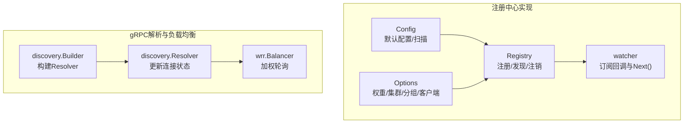
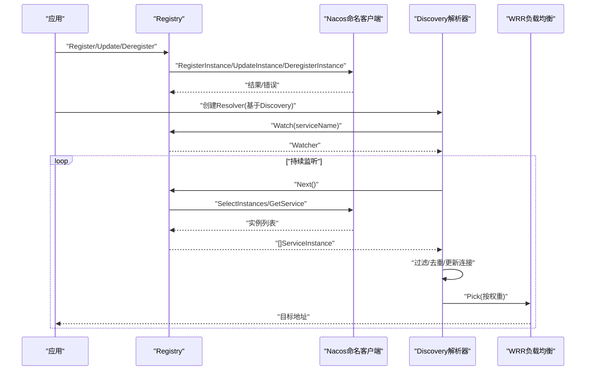
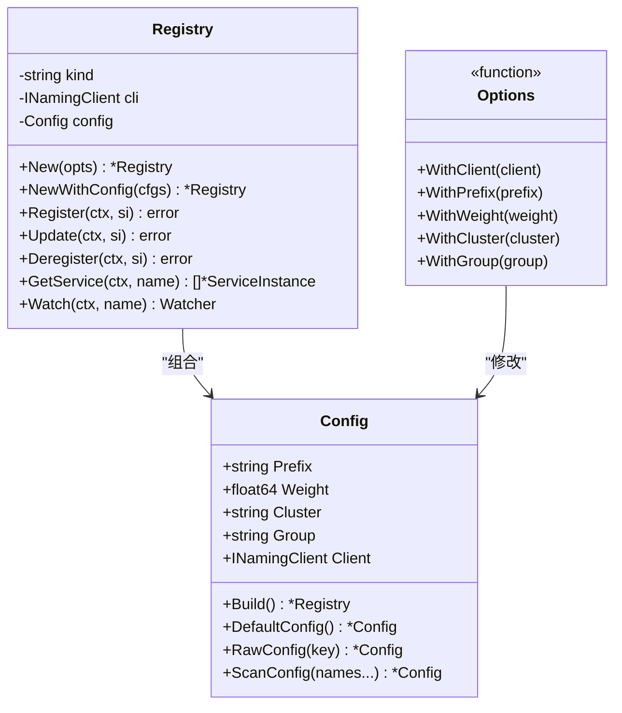
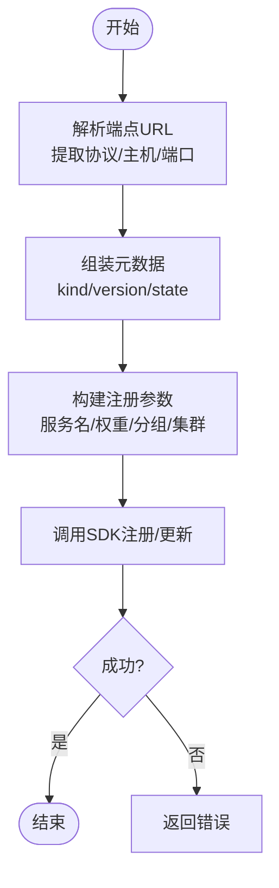
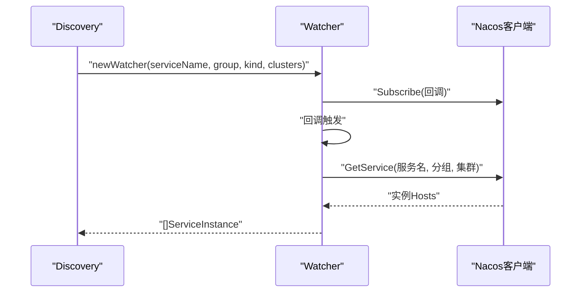
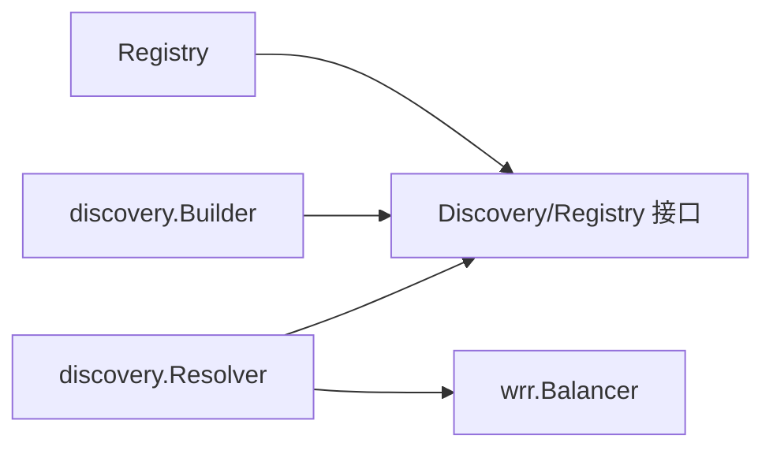

# Nacos注册中心

<cite>
**本文引用的文件**
- [contrib/registry/nacos/registry.go](file://contrib/registry/nacos/registry.go)
- [contrib/registry/nacos/options.go](file://contrib/registry/nacos/options.go)
- [contrib/registry/nacos/config.go](file://contrib/registry/nacos/config.go)
- [contrib/registry/nacos/watcher.go](file://contrib/registry/nacos/watcher.go)
- [registry/registry.go](file://registry/registry.go)
- [transport/grpc/resolver/discovery/builder.go](file://transport/grpc/resolver/discovery/builder.go)
- [transport/grpc/resolver/discovery/resolver.go](file://transport/grpc/resolver/discovery/resolver.go)
- [selector/balancer/wrr/wrr.go](file://selector/balancer/wrr/wrr.go)
- [contrib/config/nacos/nacos.go](file://contrib/config/nacos/nacos.go)
- [contrib/config/nacos/options.go](file://contrib/config/nacos/options.go)
- [contrib/config/nacos/watcher.go](file://contrib/config/nacos/watcher.go)
</cite>

## 目录
1. [简介](#简介)
2. [项目结构](#项目结构)
3. [核心组件](#核心组件)
4. [架构总览](#架构总览)
5. [组件详细分析](#组件详细分析)
6. [依赖关系分析](#依赖关系分析)
7. [性能考量](#性能考量)
8. [故障排查指南](#故障排查指南)
9. [结论](#结论)
10. [附录：配置与使用示例](#附录配置与使用示例)

## 简介
本文件面向Go Fox框架的Nacos注册中心插件，系统性阐述其集成方案与实现细节，覆盖服务注册、服务发现、命名空间与分组管理、权重路由、健康检查等能力。文档同时给出Registry结构体的实现要点（Nacos客户端初始化、服务实例管理、监听器配置）、Nacos特有参数（命名空间、分组、集群、权重）的使用方式，并提供基于gRPC的解析与负载均衡链路说明，以及配置项与部署建议。

## 项目结构
Nacos注册中心位于contrib/registry/nacos目录，围绕以下模块组织：
- registry.go：实现注册与发现接口，封装Nacos SDK调用
- options.go：注册中心配置选项（权重、集群、分组、客户端注入）
- config.go：注册中心配置对象与默认值、配置扫描
- watcher.go：服务变更监听器，封装订阅回调与实例列表转换
- 与之配套的gRPC解析器discovery.builder与resolver，负责从注册中心拉取实例并更新连接

图表来源
- [contrib/registry/nacos/registry.go](file://contrib/registry/nacos/registry.go#L44-L75)
- [contrib/registry/nacos/watcher.go](file://contrib/registry/nacos/watcher.go#L39-L79)
- [contrib/registry/nacos/config.go](file://contrib/registry/nacos/config.go#L33-L55)
- [contrib/registry/nacos/options.go](file://contrib/registry/nacos/options.go#L31-L60)
- [transport/grpc/resolver/discovery/builder.go](file://transport/grpc/resolver/discovery/builder.go#L48-L99)
- [transport/grpc/resolver/discovery/resolver.go](file://transport/grpc/resolver/discovery/resolver.go#L43-L138)
- [selector/balancer/wrr/wrr.go](file://selector/balancer/wrr/wrr.go#L28-L69)

章节来源
- [contrib/registry/nacos/registry.go](file://contrib/registry/nacos/registry.go#L44-L75)
- [contrib/registry/nacos/watcher.go](file://contrib/registry/nacos/watcher.go#L39-L79)
- [contrib/registry/nacos/config.go](file://contrib/registry/nacos/config.go#L33-L55)
- [contrib/registry/nacos/options.go](file://contrib/registry/nacos/options.go#L31-L60)
- [transport/grpc/resolver/discovery/builder.go](file://transport/grpc/resolver/discovery/builder.go#L48-L99)
- [transport/grpc/resolver/discovery/resolver.go](file://transport/grpc/resolver/discovery/resolver.go#L43-L138)
- [selector/balancer/wrr/wrr.go](file://selector/balancer/wrr/wrr.go#L28-L69)

## 核心组件
- Registry：实现注册、更新、注销、发现与监听，内部持有Nacos命名客户端与配置对象
- Config：定义前缀、权重、集群、分组、客户端等字段，提供默认值与配置扫描方法
- Options：注册中心可选配置，支持注入已有客户端、设置权重、集群、分组等
- watcher：封装订阅参数与回调，Next()返回当前实例列表，Stop()取消订阅
- Discovery接口与ServiceInstance模型：统一的服务抽象，用于跨实现的兼容

章节来源
- [contrib/registry/nacos/registry.go](file://contrib/registry/nacos/registry.go#L44-L161)
- [contrib/registry/nacos/config.go](file://contrib/registry/nacos/config.go#L33-L74)
- [contrib/registry/nacos/options.go](file://contrib/registry/nacos/options.go#L31-L60)
- [contrib/registry/nacos/watcher.go](file://contrib/registry/nacos/watcher.go#L39-L117)
- [registry/registry.go](file://registry/registry.go#L17-L95)

## 架构总览
下图展示从应用到Nacos注册中心的调用路径，以及gRPC侧如何通过discovery解析器消费注册中心实例并进行加权轮询：

图表来源
- [contrib/registry/nacos/registry.go](file://contrib/registry/nacos/registry.go#L77-L161)
- [contrib/registry/nacos/watcher.go](file://contrib/registry/nacos/watcher.go#L81-L110)
- [transport/grpc/resolver/discovery/builder.go](file://transport/grpc/resolver/discovery/builder.go#L62-L99)
- [transport/grpc/resolver/discovery/resolver.go](file://transport/grpc/resolver/discovery/resolver.go#L66-L130)
- [selector/balancer/wrr/wrr.go](file://selector/balancer/wrr/wrr.go#L33-L59)

## 组件详细分析

### Registry结构体与生命周期
- 结构体字段
  - kind：协议类型（如“grpc”），用于构造Endpoint
  - cli：Nacos命名客户端
  - config：注册中心配置（权重、集群、分组、前缀、客户端）
- 初始化
  - New/NewWithConfig：合并默认配置与用户选项，校验客户端非空
  - 默认配置：前缀“/fox”、集群“DEFAULT”、分组使用SDK默认常量、权重100
- 重要方法
  - Register/Update/Deregister：解析端点、填充元数据（kind/version/state）、调用SDK注册/更新/注销
  - GetService：按服务名+分组查询健康实例，转换为统一模型
  - Watch：创建watcher，订阅服务变更

图表来源
- [contrib/registry/nacos/registry.go](file://contrib/registry/nacos/registry.go#L44-L75)
- [contrib/registry/nacos/config.go](file://contrib/registry/nacos/config.go#L33-L55)
- [contrib/registry/nacos/options.go](file://contrib/registry/nacos/options.go#L31-L60)

章节来源
- [contrib/registry/nacos/registry.go](file://contrib/registry/nacos/registry.go#L44-L161)
- [contrib/registry/nacos/config.go](file://contrib/registry/nacos/config.go#L33-L74)
- [contrib/registry/nacos/options.go](file://contrib/registry/nacos/options.go#L31-L60)

### 服务注册流程（含Nacos特有参数）
- 元数据设置
  - 若未提供Metadata，则自动写入kind、version、state
  - 若已提供Metadata，则合并并覆盖上述键
- 分组与集群
  - 使用Config.Group作为分组；Config.Cluster作为集群名
- 服务名规范
  - 实际注册的服务名为“服务名.协议”，例如“users.grpc”
- 健康与持久化
  - 注册时启用健康检查、持久化实例（Ephemeral=true）

图表来源
- [contrib/registry/nacos/registry.go](file://contrib/registry/nacos/registry.go#L111-L161)

章节来源
- [contrib/registry/nacos/registry.go](file://contrib/registry/nacos/registry.go#L111-L161)

### 服务发现机制（命名空间/分组/实例列表）
- 健康实例筛选：GetService默认仅返回健康实例
- 分组匹配：查询与订阅均使用Config.Group
- 实例转换：将SDK实例映射为统一的ServiceInstance模型，保留元数据与状态
- 监听器：watcher封装订阅回调，Next()触发后调用GetService获取最新实例列表

图表来源
- [contrib/registry/nacos/watcher.go](file://contrib/registry/nacos/watcher.go#L51-L110)
- [contrib/registry/nacos/registry.go](file://contrib/registry/nacos/registry.go#L77-L108)

章节来源
- [contrib/registry/nacos/registry.go](file://contrib/registry/nacos/registry.go#L77-L108)
- [contrib/registry/nacos/watcher.go](file://contrib/registry/nacos/watcher.go#L51-L110)

### 权重路由与健康检查
- 权重：Config.Weight影响后续负载均衡权重（默认100）
- 健康：注册时标记healthy=true；查询时默认只返回健康实例
- 负载均衡：wrr实现按权重轮询，结合解析器更新的地址列表进行选择

章节来源
- [contrib/registry/nacos/config.go](file://contrib/registry/nacos/config.go#L47-L55)
- [contrib/registry/nacos/registry.go](file://contrib/registry/nacos/registry.go#L144-L155)
- [transport/grpc/resolver/discovery/resolver.go](file://transport/grpc/resolver/discovery/resolver.go#L86-L130)
- [selector/balancer/wrr/wrr.go](file://selector/balancer/wrr/wrr.go#L33-L59)

### Nacos配置详解（注册中心）
- 客户端初始化
  - 支持注入已有INamingClient（WithClient）
  - 默认客户端由SDK创建，需提供服务端地址、鉴权、命名空间等
- 核心配置项
  - 权重：WithWeight
  - 集群：WithCluster
  - 分组：WithGroup
  - 前缀：WithPrefix（用于命名空间/路径前缀）
- 默认值
  - 前缀“/fox”、集群“DEFAULT”、分组使用SDK默认常量、权重100

章节来源
- [contrib/registry/nacos/options.go](file://contrib/registry/nacos/options.go#L31-L60)
- [contrib/registry/nacos/config.go](file://contrib/registry/nacos/config.go#L47-L55)

### Nacos配置详解（配置中心）
- 服务端地址：WithServer，支持指定HTTP端口与gRPC端口参数
- 命名空间：WithNamespaceID
- 认证：WithUsername/WithPassword
- 超时与缓存：WithTimeoutMs、WithNotLoadCacheAtStart、WithCacheDir、WithLogDir、WithLogLevel
- 配置分组与DataID：WithGroup/WithDataID
- 行为：NewSource创建配置客户端；Load获取内容；Watch开启变更监听

章节来源
- [contrib/config/nacos/options.go](file://contrib/config/nacos/options.go#L19-L115)
- [contrib/config/nacos/nacos.go](file://contrib/config/nacos/nacos.go#L22-L94)
- [contrib/config/nacos/watcher.go](file://contrib/config/nacos/watcher.go#L23-L67)

## 依赖关系分析
- Registry依赖Nacos命名客户端与统一的Discovery/Registry接口
- discovery.Builder基于Discovery接口创建Resolver
- Resolver在后台循环调用Watcher.Next()，并将实例映射为gRPC地址
- wrr.Balancer根据权重选择节点

图表来源
- [contrib/registry/nacos/registry.go](file://contrib/registry/nacos/registry.go#L39-L42)
- [transport/grpc/resolver/discovery/builder.go](file://transport/grpc/resolver/discovery/builder.go#L48-L99)
- [transport/grpc/resolver/discovery/resolver.go](file://transport/grpc/resolver/discovery/resolver.go#L43-L138)
- [selector/balancer/wrr/wrr.go](file://selector/balancer/wrr/wrr.go#L28-L69)

章节来源
- [contrib/registry/nacos/registry.go](file://contrib/registry/nacos/registry.go#L39-L42)
- [transport/grpc/resolver/discovery/builder.go](file://transport/grpc/resolver/discovery/builder.go#L48-L99)
- [transport/grpc/resolver/discovery/resolver.go](file://transport/grpc/resolver/discovery/resolver.go#L43-L138)
- [selector/balancer/wrr/wrr.go](file://selector/balancer/wrr/wrr.go#L28-L69)

## 性能考量
- 健康实例查询：GetService默认仅返回健康实例，减少无效连接尝试
- 监听回调：watcher使用通道触发，避免轮询带来的CPU消耗
- 负载均衡：wrr按权重轮询，适合多实例场景下的流量分配
- 配置中心：支持缓存目录与日志级别控制，降低启动与运行开销

## 故障排查指南
- 注册失败
  - 检查服务名是否为空（注册前校验）
  - 确认端点URL格式正确、端口可解析
  - 核对分组与集群配置是否与Nacos侧一致
- 发现异常
  - Watcher回调是否触发；确认订阅参数（服务名、分组、集群）
  - GetService返回为空时，检查实例健康状态与分组匹配
- gRPC解析器
  - Resolver是否成功创建Watcher；超时或取消时检查Discovery实现
  - 地址映射是否包含目标协议（如grpc），必要时调整安全模式

章节来源
- [contrib/registry/nacos/registry.go](file://contrib/registry/nacos/registry.go#L111-L161)
- [contrib/registry/nacos/watcher.go](file://contrib/registry/nacos/watcher.go#L81-L110)
- [transport/grpc/resolver/discovery/builder.go](file://transport/grpc/resolver/discovery/builder.go#L62-L99)
- [transport/grpc/resolver/discovery/resolver.go](file://transport/grpc/resolver/discovery/resolver.go#L66-L130)

## 结论
该Nacos注册中心插件以轻量实现对接统一的注册/发现接口，复用gRPC解析器与负载均衡器，形成从注册中心到客户端的完整链路。通过分组、集群、权重与健康检查等Nacos特性，满足多环境、多协议、多实例的生产级需求。配合配置中心能力，可进一步完善动态配置与灰度发布场景。

## 附录：配置与使用示例
- 注册中心配置要点
  - 注入客户端：WithClient
  - 设置权重：WithWeight
  - 设置集群：WithCluster
  - 设置分组：WithGroup
  - 默认值参考：DefaultConfig
- 配置中心配置要点
  - 服务端地址：WithServer（支持HTTP端口与gRPC端口参数）
  - 命名空间：WithNamespaceID
  - 认证：WithUsername/WithPassword
  - 超时与缓存：WithTimeoutMs、WithNotLoadCacheAtStart、WithCacheDir、WithLogDir、WithLogLevel
  - 配置分组与DataID：WithGroup/WithDataID
- 使用步骤建议
  - 初始化Nacos命名客户端（或直接注入）
  - 构建Config并调用Build/DefaultConfig/ScanConfig
  - 将Registry接入应用的注册/发现流程
  - 在gRPC侧使用discovery.Builder创建Resolver并启用对应负载均衡策略

章节来源
- [contrib/registry/nacos/options.go](file://contrib/registry/nacos/options.go#L31-L60)
- [contrib/registry/nacos/config.go](file://contrib/registry/nacos/config.go#L47-L74)
- [contrib/config/nacos/options.go](file://contrib/config/nacos/options.go#L19-L115)
- [contrib/config/nacos/nacos.go](file://contrib/config/nacos/nacos.go#L22-L94)