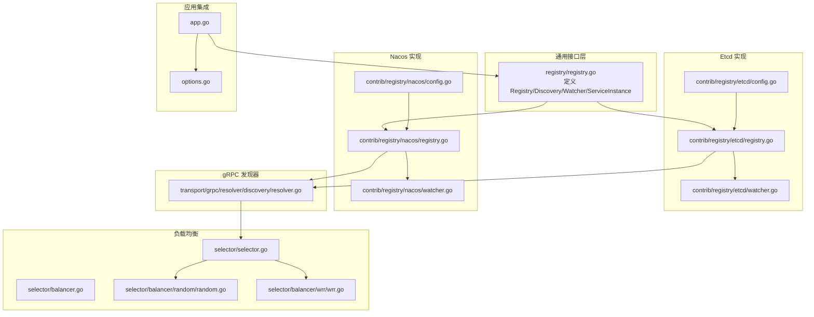
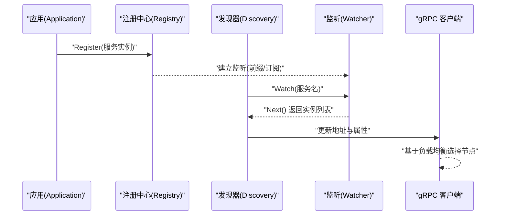
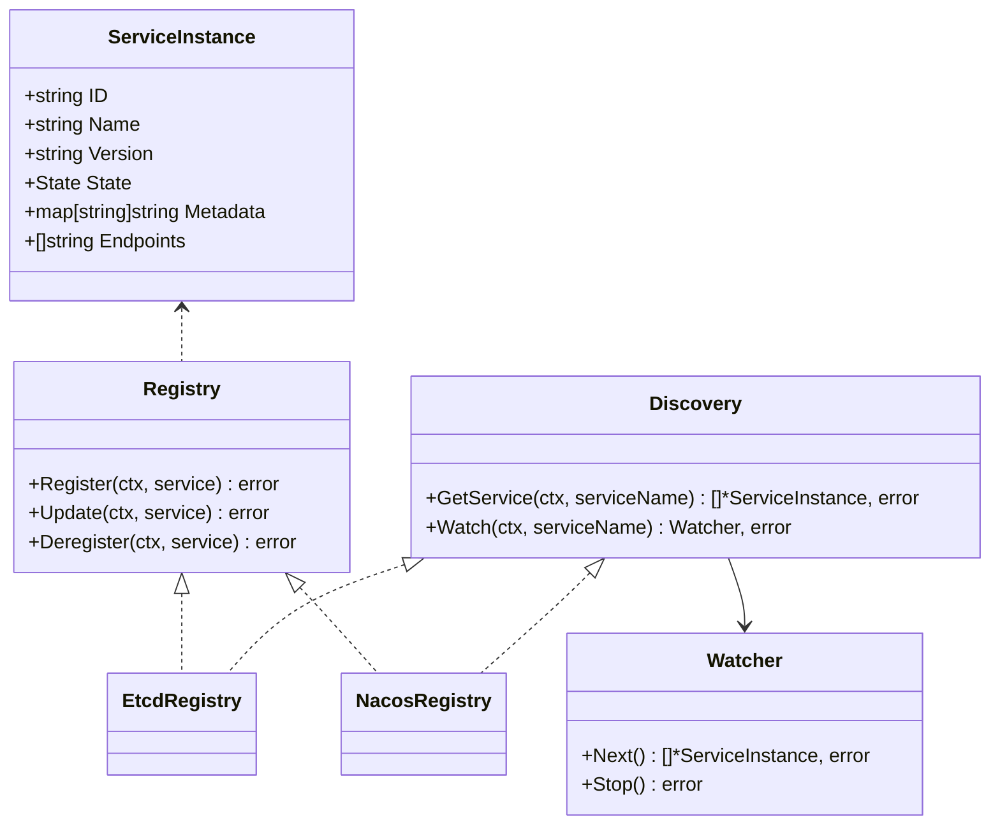
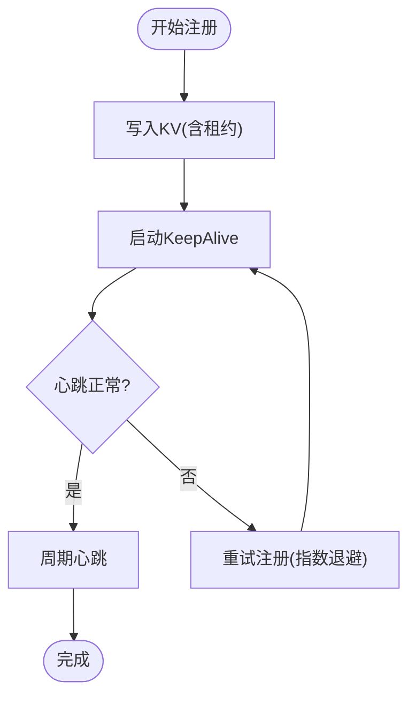
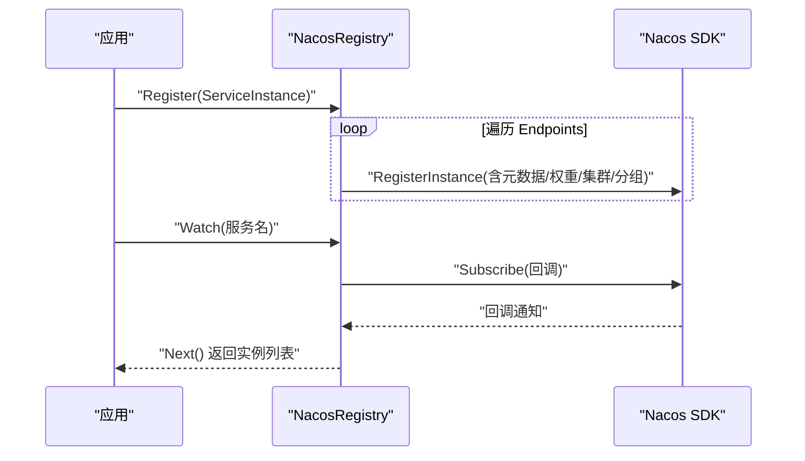
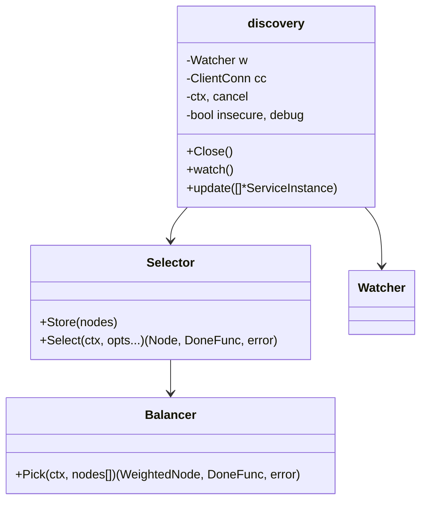
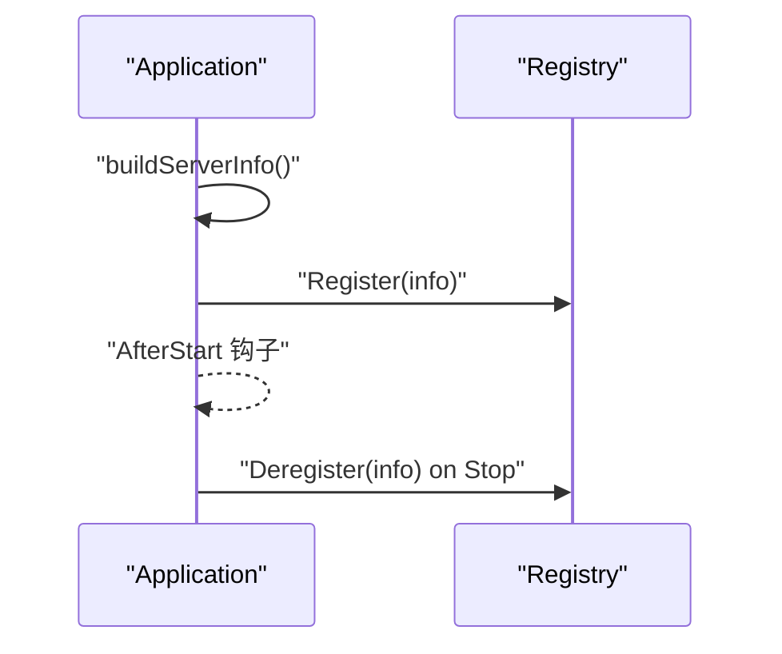
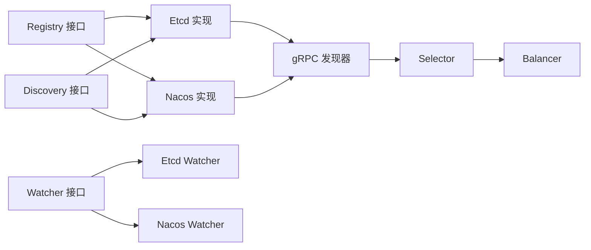

# 注册中心插件

<cite>
**本文引用的文件**
- [registry.go](file://registry/registry.go)
- [config.go（Etcd）](file://contrib/registry/etcd/config.go)
- [registry.go（Etcd 实现）](file://contrib/registry/etcd/registry.go)
- [watcher.go（Etcd 实现）](file://contrib/registry/etcd/watcher.go)
- [config.go（Nacos）](file://contrib/registry/nacos/config.go)
- [registry.go（Nacos 实现）](file://contrib/registry/nacos/registry.go)
- [watcher.go（Nacos 实现）](file://contrib/registry/nacos/watcher.go)
- [resolver.go（gRPC 发现器）](file://transport/grpc/resolver/discovery/resolver.go)
- [selector.go（选择器接口）](file://selector/selector.go)
- [balancer.go（平衡器接口）](file://selector/balancer.go)
- [random.go（随机负载均衡）](file://selector/balancer/random/random.go)
- [wrr.go（加权轮询负载均衡）](file://selector/balancer/wrr/wrr.go)
- [app.go（应用生命周期与注册）](file://app.go)
- [options.go（应用选项）](file://options.go)
- [register_test.go（Etcd 测试示例）](file://contrib/registry/etcd/register_test.go)
</cite>

## 目录
1. [简介](#简介)
2. [项目结构](#项目结构)
3. [核心组件](#核心组件)
4. [架构总览](#架构总览)
5. [详细组件分析](#详细组件分析)
6. [依赖关系分析](#依赖关系分析)
7. [性能考量](#性能考量)
8. [故障排查指南](#故障排查指南)
9. [结论](#结论)
10. [附录：配置与使用示例](#附录配置与使用示例)

## 简介
本文件面向 Go Fox 微服务框架中的“注册中心插件”，系统性阐述其架构设计、扩展机制与实现细节，覆盖服务注册、服务发现、健康检查、监听与故障恢复等核心能力；重点解析 Etcd 与 Nacos 两种注册中心的实现差异与集成方式，并给出通用接口设计、负载均衡集成、配置与使用示例以及高可用与性能调优建议，帮助开发者在不同场景下选择与落地合适的注册中心解决方案。

## 项目结构
围绕注册中心插件的关键目录与文件如下：
- 通用接口与模型定义：registry/registry.go
- Etcd 注册中心实现：contrib/registry/etcd/*
- Nacos 注册中心实现：contrib/registry/nacos/*
- gRPC 服务发现集成：transport/grpc/resolver/discovery/resolver.go
- 负载均衡与节点选择：selector/*
- 应用生命周期与注册入口：app.go、options.go
- 示例与测试：contrib/registry/etcd/register_test.go

图表来源
- [registry.go](file://registry/registry.go#L17-L113)
- [config.go（Etcd）](file://contrib/registry/etcd/config.go#L34-L73)
- [registry.go（Etcd 实现）](file://contrib/registry/etcd/registry.go#L46-L243)
- [watcher.go（Etcd 实现）](file://contrib/registry/etcd/watcher.go#L39-L122)
- [config.go（Nacos）](file://contrib/registry/nacos/config.go#L33-L74)
- [registry.go（Nacos 实现）](file://contrib/registry/nacos/registry.go#L44-L240)
- [watcher.go（Nacos 实现）](file://contrib/registry/nacos/watcher.go#L39-L117)
- [resolver.go（gRPC 发现器）](file://transport/grpc/resolver/discovery/resolver.go#L43-L139)
- [selector.go（选择器接口）](file://selector/selector.go#L61-L96)
- [balancer.go（平衡器接口）](file://selector/balancer.go#L28-L37)
- [random.go（随机负载均衡）](file://selector/balancer/random/random.go#L35-L68)
- [wrr.go（加权轮询负载均衡）](file://selector/balancer/wrr/wrr.go#L12-L69)
- [app.go（应用生命周期与注册）](file://app.go#L208-L221)
- [options.go（应用选项）](file://options.go#L54-L71)

章节来源
- [registry.go](file://registry/registry.go#L17-L113)
- [config.go（Etcd）](file://contrib/registry/etcd/config.go#L34-L73)
- [registry.go（Etcd 实现）](file://contrib/registry/etcd/registry.go#L46-L243)
- [watcher.go（Etcd 实现）](file://contrib/registry/etcd/watcher.go#L39-L122)
- [config.go（Nacos）](file://contrib/registry/nacos/config.go#L33-L74)
- [registry.go（Nacos 实现）](file://contrib/registry/nacos/registry.go#L44-L240)
- [watcher.go（Nacos 实现）](file://contrib/registry/nacos/watcher.go#L39-L117)
- [resolver.go（gRPC 发现器）](file://transport/grpc/resolver/discovery/resolver.go#L43-L139)
- [selector.go（选择器接口）](file://selector/selector.go#L61-L96)
- [balancer.go（平衡器接口）](file://selector/balancer.go#L28-L37)
- [random.go（随机负载均衡）](file://selector/balancer/random/random.go#L35-L68)
- [wrr.go（加权轮询负载均衡）](file://selector/balancer/wrr/wrr.go#L12-L69)
- [app.go（应用生命周期与注册）](file://app.go#L208-L221)
- [options.go（应用选项）](file://options.go#L54-L71)

## 核心组件
- 通用接口与模型
  - Registry：定义 Register、Update、Deregister 三类服务治理操作。
  - Discovery：定义 GetService 与 Watch 两类发现能力。
  - Watcher：定义 Next 与 Stop 的监听生命周期。
  - ServiceInstance：统一的服务实例模型，包含 ID、Name、Version、State、Metadata、Endpoints 等字段。
- Etcd 注册中心
  - 通过 KV 存储服务实例，结合租约 TTL 与心跳保活，实现服务注册与健康检查。
  - Watcher 基于 etcd 前缀监听，支持断连重连与增量更新。
- Nacos 注册中心
  - 通过 Nacos SDK 提供注册、更新、注销与订阅能力，支持分组、集群、权重等特性。
  - Watcher 基于订阅回调触发，按需拉取最新实例列表。
- gRPC 发现器
  - 将 Watcher 输出的 ServiceInstance 列表转换为 gRPC 地址与属性，驱动客户端连接与负载均衡。
- 负载均衡与节点选择
  - Selector 抽象节点存储与选择；内置随机与加权轮询两种策略，可扩展接入更多算法。

章节来源
- [registry.go](file://registry/registry.go#L17-L113)
- [registry.go（Etcd 实现）](file://contrib/registry/etcd/registry.go#L46-L243)
- [watcher.go（Etcd 实现）](file://contrib/registry/etcd/watcher.go#L39-L122)
- [registry.go（Nacos 实现）](file://contrib/registry/nacos/registry.go#L44-L240)
- [watcher.go（Nacos 实现）](file://contrib/registry/nacos/watcher.go#L39-L117)
- [resolver.go（gRPC 发现器）](file://transport/grpc/resolver/discovery/resolver.go#L43-L139)
- [selector.go（选择器接口）](file://selector/selector.go#L61-L96)
- [balancer.go（平衡器接口）](file://selector/balancer.go#L28-L37)
- [random.go（随机负载均衡）](file://selector/balancer/random/random.go#L35-L68)
- [wrr.go（加权轮询负载均衡）](file://selector/balancer/wrr/wrr.go#L12-L69)

## 架构总览
下图展示从应用启动到服务注册、发现与调用的整体流程：

图表来源
- [app.go（应用生命周期与注册）](file://app.go#L208-L221)
- [registry.go（Etcd 实现）](file://contrib/registry/etcd/registry.go#L112-L132)
- [registry.go（Nacos 实现）](file://contrib/registry/nacos/registry.go#L110-L161)
- [watcher.go（Etcd 实现）](file://contrib/registry/etcd/watcher.go#L69-L89)
- [watcher.go（Nacos 实现）](file://contrib/registry/nacos/watcher.go#L81-L110)
- [resolver.go（gRPC 发现器）](file://transport/grpc/resolver/discovery/resolver.go#L66-L130)

## 详细组件分析

### 通用接口设计
- 接口职责清晰：Registry 负责服务治理，Discovery 负责服务发现，Watcher 负责事件监听。
- 模型抽象统一：ServiceInstance 统一承载实例标识、版本、状态、元数据与多协议端点，便于跨注册中心与传输层复用。

图表来源
- [registry.go](file://registry/registry.go#L17-L113)

章节来源
- [registry.go](file://registry/registry.go#L17-L113)

### Etcd 注册中心实现
- 连接与配置
  - 通过 Config 持有 etcd 客户端、TTL、最大重试次数与键前缀；默认前缀为 /fox，TTL 15 秒，最大重试 5 次。
- 服务注册
  - 使用 KV 写入服务实例，结合租约 TTL 与 KeepAlive 心跳维持；失败时自动重试并重建租约。
- 服务发现与监听
  - 基于前缀前缀扫描与 Watch 监听，首次直接拉取全量，后续变更事件触发增量更新。
  - 断链时主动重建 Watcher 并请求进度，保证一致性。
- 故障处理
  - 心跳中断或租约失效时，进入指数退避重试注册流程，直至成功或上下文取消。
  - 注销时取消对应心跳协程并删除键值。

图表来源
- [registry.go（Etcd 实现）](file://contrib/registry/etcd/registry.go#L165-L175)
- [registry.go（Etcd 实现）](file://contrib/registry/etcd/registry.go#L177-L242)
- [watcher.go（Etcd 实现）](file://contrib/registry/etcd/watcher.go#L116-L121)

章节来源
- [config.go（Etcd）](file://contrib/registry/etcd/config.go#L34-L73)
- [registry.go（Etcd 实现）](file://contrib/registry/etcd/registry.go#L112-L163)
- [watcher.go（Etcd 实现）](file://contrib/registry/etcd/watcher.go#L69-L121)

### Nacos 注册中心实现
- 配置与命名空间
  - 支持 Group、Cluster、权重 Weight 与前缀；默认 Group 为 DEFAULT_GROUP，Cluster 为 DEFAULT。
- 服务注册/更新/注销
  - 解析每个 Endpoints 中的 scheme/host/port，构造元数据（kind/version/state），按协议维度注册。
- 订阅与监听
  - 基于 Subscribe 回调触发，Next 时主动拉取最新实例列表，过滤非健康实例。
- 健康检查
  - GetService 默认仅返回健康实例；注销时按实例维度逐一移除。

图表来源
- [registry.go（Nacos 实现）](file://contrib/registry/nacos/registry.go#L110-L161)
- [watcher.go（Nacos 实现）](file://contrib/registry/nacos/watcher.go#L51-L110)

章节来源
- [config.go（Nacos）](file://contrib/registry/nacos/config.go#L33-L74)
- [registry.go（Nacos 实现）](file://contrib/registry/nacos/registry.go#L77-L239)
- [watcher.go（Nacos 实现）](file://contrib/registry/nacos/watcher.go#L51-L117)

### gRPC 发现器与负载均衡集成
- 发现器职责
  - 从 Watcher 获取实例列表，筛选匹配协议的端点，去重并注入元数据，更新 gRPC 客户端连接状态。
- 负载均衡
  - Selector 抽象节点存储与选择；内置随机与加权轮询两种策略，可按需扩展。
  - 通过选择器构建器注册与获取，实现策略可插拔。

图表来源
- [resolver.go（gRPC 发现器）](file://transport/grpc/resolver/discovery/resolver.go#L43-L139)
- [selector.go（选择器接口）](file://selector/selector.go#L61-L96)
- [balancer.go（平衡器接口）](file://selector/balancer.go#L28-L37)
- [random.go（随机负载均衡）](file://selector/balancer/random/random.go#L35-L68)
- [wrr.go（加权轮询负载均衡）](file://selector/balancer/wrr/wrr.go#L12-L69)

章节来源
- [resolver.go（gRPC 发现器）](file://transport/grpc/resolver/discovery/resolver.go#L66-L130)
- [selector.go（选择器接口）](file://selector/selector.go#L61-L96)
- [balancer.go（平衡器接口）](file://selector/balancer.go#L28-L37)
- [random.go（随机负载均衡）](file://selector/balancer/random/random.go#L35-L68)
- [wrr.go（加权轮询负载均衡）](file://selector/balancer/wrr/wrr.go#L12-L69)

### 应用生命周期与注册入口
- 应用启动阶段
  - 构建服务实例信息（ID、Name、Version、Metadata、Endpoints），在启动完成后向注册中心注册。
- 应用停止阶段
  - 在超时上下文中调用 Deregister 注销服务，确保优雅下线。

图表来源
- [app.go（应用生命周期与注册）](file://app.go#L208-L221)
- [app.go（应用生命周期与注册）](file://app.go#L253-L282)
- [options.go（应用选项）](file://options.go#L54-L71)

章节来源
- [app.go（应用生命周期与注册）](file://app.go#L208-L221)
- [app.go（应用生命周期与注册）](file://app.go#L253-L282)
- [options.go（应用选项）](file://options.go#L54-L71)

## 依赖关系分析
- 松耦合接口：Registry/Discovery/Watcher 与具体实现解耦，便于替换 Etcd/Nacos。
- 传输层集成：gRPC 发现器依赖 Watcher 输出，实现地址与属性的动态更新。
- 负载均衡扩展：Selector/Builder 模式支持多种策略注册与选择。
- 应用层集成：Application 通过选项注入 Registry，贯穿启动/停止生命周期。

图表来源
- [registry.go](file://registry/registry.go#L17-L113)
- [registry.go（Etcd 实现）](file://contrib/registry/etcd/registry.go#L46-L243)
- [watcher.go（Etcd 实现）](file://contrib/registry/etcd/watcher.go#L39-L122)
- [registry.go（Nacos 实现）](file://contrib/registry/nacos/registry.go#L44-L240)
- [watcher.go（Nacos 实现）](file://contrib/registry/nacos/watcher.go#L39-L117)
- [resolver.go（gRPC 发现器）](file://transport/grpc/resolver/discovery/resolver.go#L43-L139)
- [selector.go（选择器接口）](file://selector/selector.go#L61-L96)
- [balancer.go（平衡器接口）](file://selector/balancer.go#L28-L37)

章节来源
- [registry.go](file://registry/registry.go#L17-L113)
- [registry.go（Etcd 实现）](file://contrib/registry/etcd/registry.go#L46-L243)
- [watcher.go（Etcd 实现）](file://contrib/registry/etcd/watcher.go#L39-L122)
- [registry.go（Nacos 实现）](file://contrib/registry/nacos/registry.go#L44-L240)
- [watcher.go（Nacos 实现）](file://contrib/registry/nacos/watcher.go#L39-L117)
- [resolver.go（gRPC 发现器）](file://transport/grpc/resolver/discovery/resolver.go#L43-L139)
- [selector.go（选择器接口）](file://selector/selector.go#L61-L96)
- [balancer.go（平衡器接口）](file://selector/balancer.go#L28-L37)

## 性能考量
- Etcd
  - TTL 与心跳：合理设置 TTL 与 MaxRetry，避免频繁重建租约；心跳通道关闭时快速重试并指数退避。
  - 监听：前缀扫描与 Watch 结合，首次全量拉取，后续增量更新；断链重连请求进度，降低数据不一致窗口。
- Nacos
  - 分组/集群/权重：利用 Group/Cluster/Weight 精细化路由与隔离，减少跨域网络开销。
  - 健康过滤：默认仅返回健康实例，降低无效连接尝试。
- gRPC 客户端
  - 发现器去重与属性注入，避免重复地址；结合负载均衡策略提升吞吐与公平性。
- 负载均衡
  - 随机策略简单低开销；加权轮询适合多实例权重差异化场景。

[本节为通用指导，无需列出章节来源]

## 故障排查指南
- 注册失败
  - 检查 etcd 客户端连接参数与鉴权；确认键前缀与 TTL 配置是否合理。
  - 对于 Nacos，确认 Group/Cluster/权重配置与目标命名空间一致。
- 心跳异常
  - Etcd：观察 KeepAlive 是否持续；若通道关闭，查看重试日志与指数退避是否生效。
- 发现无实例
  - 检查服务名与前缀是否匹配；确认 Watcher 是否已建立；验证健康过滤条件。
- gRPC 连接失败
  - 检查发现器输出的端点协议与安全模式（insecure）是否匹配；确认元数据注入是否正确。

章节来源
- [registry.go（Etcd 实现）](file://contrib/registry/etcd/registry.go#L177-L242)
- [watcher.go（Etcd 实现）](file://contrib/registry/etcd/watcher.go#L69-L89)
- [registry.go（Nacos 实现）](file://contrib/registry/nacos/registry.go#L110-L161)
- [watcher.go（Nacos 实现）](file://contrib/registry/nacos/watcher.go#L81-L110)
- [resolver.go（gRPC 发现器）](file://transport/grpc/resolver/discovery/resolver.go#L66-L130)

## 结论
Go Fox 注册中心插件以统一接口抽象实现跨注册中心扩展，Etcd 与 Nacos 各具优势：Etcd 更偏向轻量 KV 与强一致场景，Nacos 更强调生态化配置与多维度路由。配合 gRPC 发现器与可插拔负载均衡，可在不同规模与复杂度的微服务体系中灵活选型与演进。

[本节为总结，无需列出章节来源]

## 附录：配置与使用示例

### 配置项概览
- Etcd
  - prefix：键前缀，默认 /fox
  - ttl：租约 TTL，默认 15s
  - max_retry：最大重试次数，默认 5
  - client：etcd 客户端实例
- Nacos
  - prefix：前缀，默认 /fox
  - group：分组，默认 DEFAULT_GROUP
  - cluster：集群，默认 DEFAULT
  - weight：权重，默认 100
  - client：Nacos 命名客户端实例

章节来源
- [config.go（Etcd）](file://contrib/registry/etcd/config.go#L34-L73)
- [config.go（Nacos）](file://contrib/registry/nacos/config.go#L33-L74)

### 使用示例（Etcd）
- 构造注册中心：传入 etcd 客户端与可选配置，创建 Registry。
- 注册服务：在应用启动后调用 Register，随后可通过 Watch 获取实例变化。
- 更新/注销：根据运行态更新实例状态或在停止时注销。

章节来源
- [register_test.go（Etcd 测试示例）](file://contrib/registry/etcd/register_test.go#L15-L89)
- [app.go（应用生命周期与注册）](file://app.go#L208-L221)

### 高可用与性能调优建议
- Etcd
  - 合理设置 TTL 与网络延迟，避免频繁心跳超时；启用断链重试并控制退避上限。
  - 使用前缀隔离多环境/多业务，避免键冲突与扫描压力。
- Nacos
  - 利用 Group/Cluster 实现多环境/多区域隔离；通过权重实现灰度流量分配。
  - 关注订阅回调频率与实例数量，避免过度刷新。
- gRPC
  - 发现器开启调试日志定位端点问题；结合负载均衡策略提升稳定性与吞吐。
- 负载均衡
  - 小规模或均匀流量优先随机策略；大规模或差异化实例采用加权轮询。

[本节为通用指导，无需列出章节来源]