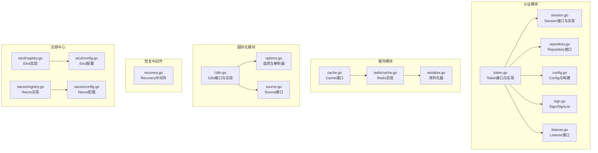
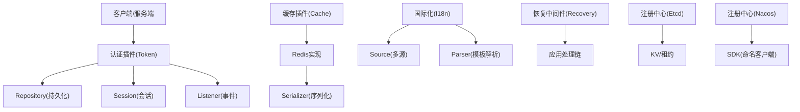
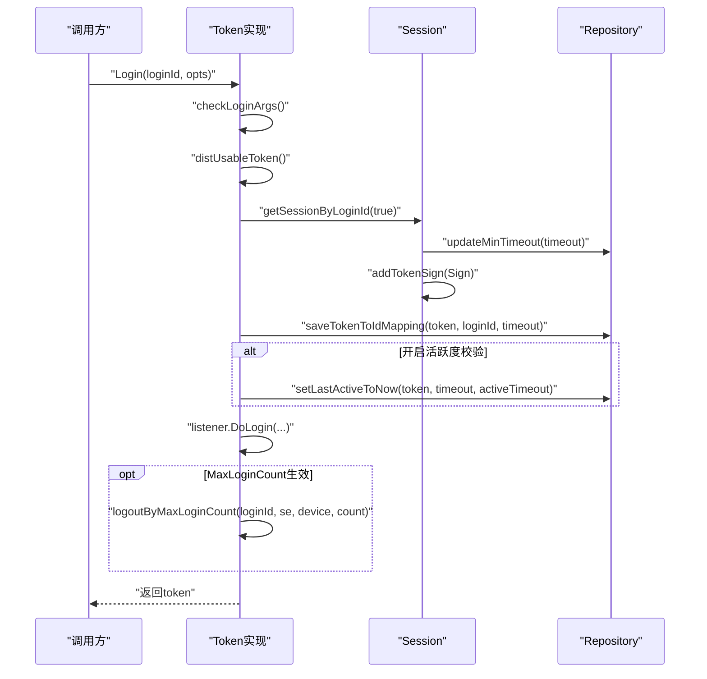
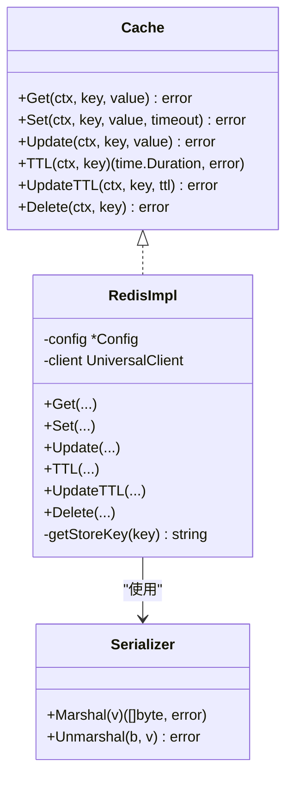
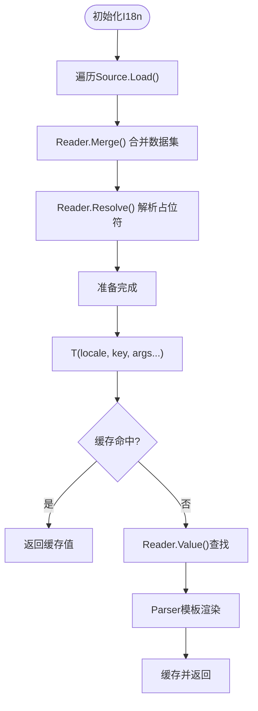
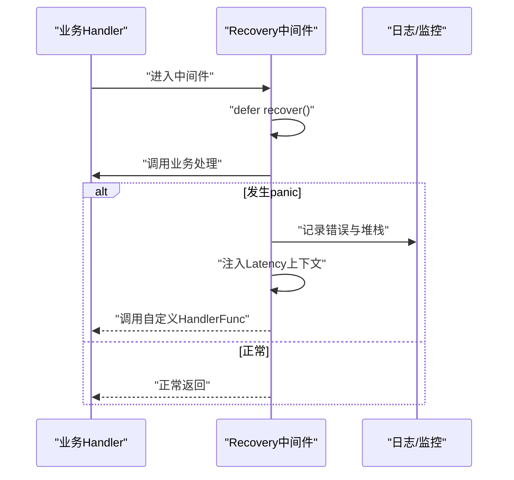
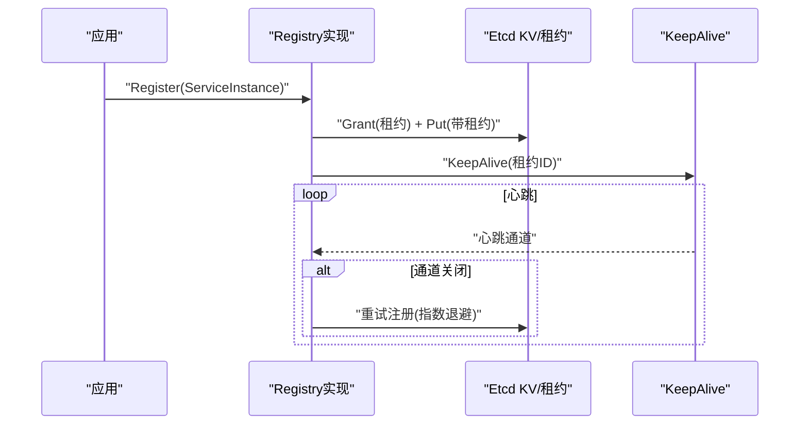
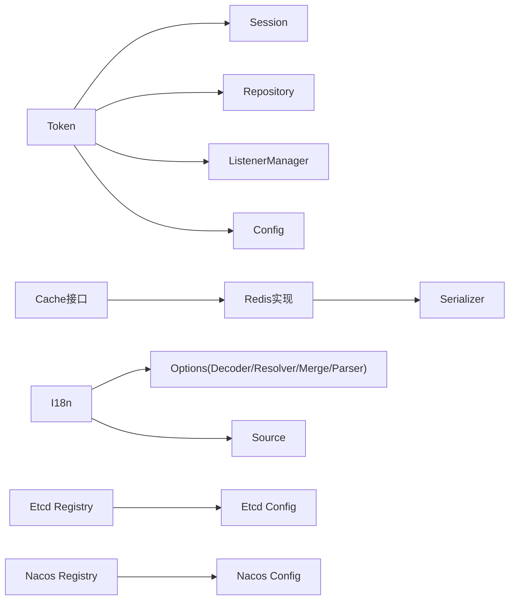

# 第三方集成插件

<cite>
**本文引用的文件**
- [contrib/auth/token/token.go](file://contrib/auth/token/token.go)
- [contrib/auth/token/config.go](file://contrib/auth/token/config.go)
- [contrib/auth/token/session.go](file://contrib/auth/token/session.go)
- [contrib/auth/token/repository.go](file://contrib/auth/token/repository.go)
- [contrib/auth/token/sign.go](file://contrib/auth/token/sign.go)
- [contrib/auth/token/listener.go](file://contrib/auth/token/listener.go)
- [contrib/cache/cache.go](file://contrib/cache/cache.go)
- [contrib/cache/redis/cache.go](file://contrib/cache/redis/cache.go)
- [contrib/cache/serialize.go](file://contrib/cache/serialize.go)
- [contrib/i18n/i18n.go](file://contrib/i18n/i18n.go)
- [contrib/i18n/options.go](file://contrib/i18n/options.go)
- [contrib/i18n/source.go](file://contrib/i18n/source.go)
- [contrib/middleware/recovery/recovery.go](file://contrib/middleware/recovery/recovery.go)
- [contrib/registry/etcd/registry.go](file://contrib/registry/etcd/registry.go)
- [contrib/registry/etcd/config.go](file://contrib/registry/etcd/config.go)
- [contrib/registry/nacos/registry.go](file://contrib/registry/nacos/registry.go)
- [contrib/registry/nacos/config.go](file://contrib/registry/nacos/config.go)
</cite>

## 目录
1. [引言](#引言)
2. [项目结构](#项目结构)
3. [核心组件](#核心组件)
4. [架构总览](#架构总览)
5. [详细组件分析](#详细组件分析)
6. [依赖分析](#依赖分析)
7. [性能考量](#性能考量)
8. [故障排查指南](#故障排查指南)
9. [结论](#结论)
10. [附录](#附录)

## 引言
本技术文档面向Go Fox第三方集成插件，围绕以下主题展开：认证插件（Token验证、会话管理、权限控制）、缓存插件（含Redis集成与序列化策略）、国际化插件（多语言、翻译加载与解析）、恢复中间件（错误处理与最佳实践）、注册中心插件（Etcd与Nacos扩展机制）。文档提供代码级架构图、流程图与类图，帮助开发者理解实现原理、掌握扩展方式，并给出实际使用示例与配置模板。

## 项目结构
本仓库采用按功能域划分的模块化组织方式，第三方集成相关能力集中在contrib目录下：
- 认证：contrib/auth/token
- 缓存：contrib/cache 与 contrib/cache/redis
- 国际化：contrib/i18n
- 恢复中间件：contrib/middleware/recovery
- 注册中心：contrib/registry/etcd 与 contrib/registry/nacos

**图表来源**
- [contrib/auth/token/token.go](file://contrib/auth/token/token.go#L1-L1130)
- [contrib/auth/token/session.go](file://contrib/auth/token/session.go#L1-L578)
- [contrib/auth/token/repository.go](file://contrib/auth/token/repository.go#L1-L40)
- [contrib/auth/token/config.go](file://contrib/auth/token/config.go#L1-L82)
- [contrib/auth/token/sign.go](file://contrib/auth/token/sign.go#L1-L26)
- [contrib/auth/token/listener.go](file://contrib/auth/token/listener.go#L1-L59)
- [contrib/cache/cache.go](file://contrib/cache/cache.go#L1-L48)
- [contrib/cache/redis/cache.go](file://contrib/cache/redis/cache.go#L1-L163)
- [contrib/cache/serialize.go](file://contrib/cache/serialize.go#L1-L273)
- [contrib/i18n/i18n.go](file://contrib/i18n/i18n.go#L1-L138)
- [contrib/i18n/options.go](file://contrib/i18n/options.go#L1-L191)
- [contrib/i18n/source.go](file://contrib/i18n/source.go#L1-L43)
- [contrib/middleware/recovery/recovery.go](file://contrib/middleware/recovery/recovery.go#L1-L80)
- [contrib/registry/etcd/registry.go](file://contrib/registry/etcd/registry.go#L1-L243)
- [contrib/registry/etcd/config.go](file://contrib/registry/etcd/config.go#L1-L73)
- [contrib/registry/nacos/registry.go](file://contrib/registry/nacos/registry.go#L1-L240)
- [contrib/registry/nacos/config.go](file://contrib/registry/nacos/config.go#L1-L74)

**章节来源**
- [contrib/auth/token/token.go](file://contrib/auth/token/token.go#L1-L1130)
- [contrib/cache/cache.go](file://contrib/cache/cache.go#L1-L48)
- [contrib/i18n/i18n.go](file://contrib/i18n/i18n.go#L1-L138)
- [contrib/middleware/recovery/recovery.go](file://contrib/middleware/recovery/recovery.go#L1-L80)
- [contrib/registry/etcd/registry.go](file://contrib/registry/etcd/registry.go#L1-L243)
- [contrib/registry/nacos/registry.go](file://contrib/registry/nacos/registry.go#L1-L240)

## 核心组件
- 认证插件：提供Token登录、登出、顶人下线、封禁、会话管理与事件监听；通过Repository抽象实现持久化，支持活跃度冻结与自动续签。
- 缓存插件：统一Cache接口，Redis实现负责键空间前缀、TTL更新与序列化；内置Serializer支持基础类型与通用编解码。
- 国际化插件：I18n接口与实现，支持多源加载、合并、占位符解析与模板渲染，具备缓存与调试开关。
- 恢复中间件：统一recover逻辑，输出堆栈与请求信息，支持自定义错误处理器与延迟上下文注入。
- 注册中心插件：Etcd与Nacos实现，分别基于KV/租约与SDK，提供服务注册、发现、心跳与变更监听。

**章节来源**
- [contrib/auth/token/token.go](file://contrib/auth/token/token.go#L15-L116)
- [contrib/cache/cache.go](file://contrib/cache/cache.go#L39-L47)
- [contrib/i18n/i18n.go](file://contrib/i18n/i18n.go#L44-L49)
- [contrib/middleware/recovery/recovery.go](file://contrib/middleware/recovery/recovery.go#L53-L79)
- [contrib/registry/etcd/registry.go](file://contrib/registry/etcd/registry.go#L46-L54)
- [contrib/registry/nacos/registry.go](file://contrib/registry/nacos/registry.go#L44-L49)

## 架构总览
认证插件以Token为核心，围绕登录、会话与持久化展开；缓存插件为认证与注册中心提供高性能存储；国际化插件贯穿应用层消息与日志；恢复中间件保障运行期稳定性；注册中心插件提供服务治理能力。

**图表来源**
- [contrib/auth/token/token.go](file://contrib/auth/token/token.go#L118-L142)
- [contrib/auth/token/session.go](file://contrib/auth/token/session.go#L47-L64)
- [contrib/auth/token/repository.go](file://contrib/auth/token/repository.go#L31-L39)
- [contrib/cache/cache.go](file://contrib/cache/cache.go#L39-L47)
- [contrib/cache/redis/cache.go](file://contrib/cache/redis/cache.go#L38-L66)
- [contrib/cache/serialize.go](file://contrib/cache/serialize.go#L49-L127)
- [contrib/i18n/i18n.go](file://contrib/i18n/i18n.go#L44-L60)
- [contrib/i18n/options.go](file://contrib/i18n/options.go#L48-L91)
- [contrib/middleware/recovery/recovery.go](file://contrib/middleware/recovery/recovery.go#L53-L79)
- [contrib/registry/etcd/registry.go](file://contrib/registry/etcd/registry.go#L46-L54)
- [contrib/registry/nacos/registry.go](file://contrib/registry/nacos/registry.go#L44-L49)

## 详细组件分析

### 认证插件（Token）
- 接口与职责
  - Token接口：登录、登出、顶人下线、封禁、会话查询、活跃度冻结与续签等。
  - Session接口：会话读写、TTL更新、签名列表维护。
  - Repository接口：键值读写、TTL查询与更新、删除。
  - Sign/SignList：记录token签名、设备与附加数据。
  - Listener接口：登录、登出、顶下线、封禁事件发布。
- 关键流程
  - 登录流程：参数校验、唯一Token生成、Account-Session续期、签名记录、映射关系保存、活跃度初始化、事件发布、最大登录数控制。
  - 登出/顶下线：按账号或Token维度清理签名、活跃度、映射与会话。
  - 活跃度冻结：基于最后活跃时间与允许阈值判定，支持自动续签。
- 配置要点
  - 登录类型、Token名称、并发与共享策略、超时、活跃度、最大重试次数、最大登录数、样式、自动续签等。
  - 支持从配置中心扫描构建。

**图表来源**
- [contrib/auth/token/token.go](file://contrib/auth/token/token.go#L144-L207)
- [contrib/auth/token/session.go](file://contrib/auth/token/session.go#L86-L104)
- [contrib/auth/token/repository.go](file://contrib/auth/token/repository.go#L32-L38)

**章节来源**
- [contrib/auth/token/token.go](file://contrib/auth/token/token.go#L15-L116)
- [contrib/auth/token/session.go](file://contrib/auth/token/session.go#L47-L64)
- [contrib/auth/token/repository.go](file://contrib/auth/token/repository.go#L31-L39)
- [contrib/auth/token/sign.go](file://contrib/auth/token/sign.go#L3-L26)
- [contrib/auth/token/listener.go](file://contrib/auth/token/listener.go#L26-L58)
- [contrib/auth/token/config.go](file://contrib/auth/token/config.go#L9-L29)

### 缓存插件（Cache与Redis）
- 接口与实现
  - Cache接口：Get/Set/Update/TTL/UpdateTTL/Delete。
  - Redis实现：键前缀拼接、TTL查询与更新、删除、默认序列化器。
- 序列化策略
  - Serializer内置对基础类型（字符串、整型、浮点、布尔、时间等）的高效编解码，其余类型回退至默认编解码器。
- 使用建议
  - 为不同业务键空间设置前缀，避免冲突。
  - 合理设置TTL与UpdateTTL，结合业务生命周期管理。

**图表来源**
- [contrib/cache/cache.go](file://contrib/cache/cache.go#L39-L47)
- [contrib/cache/redis/cache.go](file://contrib/cache/redis/cache.go#L38-L66)
- [contrib/cache/serialize.go](file://contrib/cache/serialize.go#L49-L127)

**章节来源**
- [contrib/cache/cache.go](file://contrib/cache/cache.go#L39-L47)
- [contrib/cache/redis/cache.go](file://contrib/cache/redis/cache.go#L68-L110)
- [contrib/cache/serialize.go](file://contrib/cache/serialize.go#L52-L127)

### 国际化插件（I18n）
- 接口与职责
  - I18n接口：Locale/Sope/T方法；Locale实现支持区域与作用域切换。
  - Options：Decoder/Resolver/Merge/Parser可插拔扩展。
  - Source：多源加载DataSet（locale、format、value、timestamp）。
- 加载与解析流程
  - 初始化Reader，逐源Load并Merge，Resolver解析占位符，Parser执行模板渲染，结果缓存于sync.Map。
- 使用建议
  - 使用WithSources注入多源（文件、远程配置等）。
  - WithParse结合yamltemplate实现参数化文案。
  - WithResolver支持默认值与嵌套结构占位符替换。

**图表来源**
- [contrib/i18n/i18n.go](file://contrib/i18n/i18n.go#L84-L100)
- [contrib/i18n/i18n.go](file://contrib/i18n/i18n.go#L118-L137)
- [contrib/i18n/options.go](file://contrib/i18n/options.go#L93-L121)
- [contrib/i18n/options.go](file://contrib/i18n/options.go#L123-L163)
- [contrib/i18n/options.go](file://contrib/i18n/options.go#L165-L179)
- [contrib/i18n/source.go](file://contrib/i18n/source.go#L30-L42)

**章节来源**
- [contrib/i18n/i18n.go](file://contrib/i18n/i18n.go#L44-L82)
- [contrib/i18n/options.go](file://contrib/i18n/options.go#L48-L91)
- [contrib/i18n/source.go](file://contrib/i18n/source.go#L30-L42)

### 恢复中间件（Recovery）
- 能力概述
  - 捕获panic，记录错误与堆栈，注入Latency上下文，调用自定义HandlerFunc进行错误处理。
- 使用建议
  - 提供统一的HandlerFunc，将错误映射为标准响应。
  - 结合日志与监控上报，便于定位问题。

**图表来源**
- [contrib/middleware/recovery/recovery.go](file://contrib/middleware/recovery/recovery.go#L63-L78)

**章节来源**
- [contrib/middleware/recovery/recovery.go](file://contrib/middleware/recovery/recovery.go#L53-L79)

### 注册中心插件（Etcd与Nacos）
- Etcd实现
  - 基于KV与租约（Lease），注册时申请租约并写入带租约的键，心跳通过KeepAlive维持；断连后指数退避重试注册。
  - Watch基于客户端监听通道实现增量变更。
- Nacos实现
  - 基于SDK的INamingClient，Register/Update/Deregister封装Endpoint元数据（scheme、version、state等），支持集群与分组。
- 配置要点
  - Etcd：前缀、TTL、最大重试次数、客户端。
  - Nacos：前缀、权重、集群、分组、客户端。

**图表来源**
- [contrib/registry/etcd/registry.go](file://contrib/registry/etcd/registry.go#L112-L132)
- [contrib/registry/etcd/registry.go](file://contrib/registry/etcd/registry.go#L177-L242)

**章节来源**
- [contrib/registry/etcd/registry.go](file://contrib/registry/etcd/registry.go#L46-L82)
- [contrib/registry/etcd/config.go](file://contrib/registry/etcd/config.go#L34-L54)
- [contrib/registry/nacos/registry.go](file://contrib/registry/nacos/registry.go#L44-L75)
- [contrib/registry/nacos/config.go](file://contrib/registry/nacos/config.go#L33-L54)

## 依赖分析
- 认证插件内部耦合清晰：Token依赖Session与Repository，事件通过ListenerManager发布；配置通过DefaultConfig与ScanConfig注入。
- 缓存插件通过接口解耦：Cache接口与Redis实现分离，Serializer作为通用编解码器。
- 国际化插件通过Options扩展：Decoder/Resolver/Merge/Parser均可替换，Source抽象多源加载。
- 注册中心插件分别对接Etcd与Nacos SDK，配置独立，互不影响。

**图表来源**
- [contrib/auth/token/token.go](file://contrib/auth/token/token.go#L118-L142)
- [contrib/auth/token/session.go](file://contrib/auth/token/session.go#L47-L64)
- [contrib/auth/token/config.go](file://contrib/auth/token/config.go#L31-L50)
- [contrib/cache/cache.go](file://contrib/cache/cache.go#L39-L47)
- [contrib/cache/redis/cache.go](file://contrib/cache/redis/cache.go#L38-L66)
- [contrib/cache/serialize.go](file://contrib/cache/serialize.go#L49-L127)
- [contrib/i18n/i18n.go](file://contrib/i18n/i18n.go#L62-L82)
- [contrib/i18n/options.go](file://contrib/i18n/options.go#L48-L91)
- [contrib/registry/etcd/registry.go](file://contrib/registry/etcd/registry.go#L56-L82)
- [contrib/registry/nacos/registry.go](file://contrib/registry/nacos/registry.go#L51-L75)

**章节来源**
- [contrib/auth/token/token.go](file://contrib/auth/token/token.go#L118-L142)
- [contrib/cache/cache.go](file://contrib/cache/cache.go#L39-L47)
- [contrib/i18n/i18n.go](file://contrib/i18n/i18n.go#L62-L82)
- [contrib/registry/etcd/registry.go](file://contrib/registry/etcd/registry.go#L56-L82)
- [contrib/registry/nacos/registry.go](file://contrib/registry/nacos/registry.go#L51-L75)

## 性能考量
- 认证插件
  - 并发登录与共享Token策略影响唯一Token生成与查询成本；合理设置MaxTryCount与MaxLoginCount可降低冲突与清理开销。
  - 活跃度冻结与自动续签需权衡TTL更新频率与存储压力。
- 缓存插件
  - Redis实现使用键前缀避免冲突；Serializer对基础类型快速路径提升吞吐；建议批量操作与合理TTL减少网络往返。
- 国际化插件
  - Reader.Merge与Resolver解析在初始化阶段完成，运行期主要走缓存；模板解析可结合参数化减少重复计算。
- 注册中心插件
  - Etcd心跳与KeepAlive通道频繁重试需指数退避；Nacos SDK调用应关注Endpoint解析与元数据一致性。

[本节为通用指导，无需具体文件分析]

## 故障排查指南
- 认证插件
  - 无效Token/冻结/被顶下线：通过错误构造与状态码区分，结合日志定位。
  - 活跃度冻结：检查ActiveTimeout与LastActive时间，确认AutoRenew配置。
- 缓存插件
  - Redis连接失败：检查Client配置与网络；键前缀冲突导致读写异常。
  - 序列化失败：确认目标类型与Serializer支持范围。
- 国际化插件
  - 占位符未解析：检查Resolver与Parser配置；确认DataSet格式与编码。
- 恢复中间件
  - panic未被捕获：确认中间件顺序与HandlerFunc实现。
- 注册中心插件
  - Etcd租约失效：查看KeepAlive通道与重试逻辑；核对TTL与MaxRetry。
  - Nacos注册失败：检查Endpoint解析、集群/分组与元数据字段。

**章节来源**
- [contrib/auth/token/token.go](file://contrib/auth/token/token.go#L412-L446)
- [contrib/cache/redis/cache.go](file://contrib/cache/redis/cache.go#L68-L78)
- [contrib/i18n/options.go](file://contrib/i18n/options.go#L123-L163)
- [contrib/middleware/recovery/recovery.go](file://contrib/middleware/recovery/recovery.go#L63-L78)
- [contrib/registry/etcd/registry.go](file://contrib/registry/etcd/registry.go#L177-L242)
- [contrib/registry/nacos/registry.go](file://contrib/registry/nacos/registry.go#L110-L160)

## 结论
本插件体系以清晰的接口抽象与模块化设计实现了认证、缓存、国际化、恢复中间件与注册中心的核心能力。通过可插拔的配置与扩展点，开发者可在不破坏契约的前提下灵活定制行为。建议在生产环境中结合监控与日志完善可观测性，并遵循各模块的最佳实践以获得稳定与高性能表现。

[本节为总结，无需具体文件分析]

## 附录

### 插件开发指南（接口规范、配置管理、错误处理）
- 接口规范
  - 认证：实现Token、Session、Repository、Listener接口，确保幂等与一致性。
  - 缓存：实现Cache接口，提供前缀与TTL策略。
  - 国际化：实现Source接口，支持多格式DataSet；通过Options扩展解析器。
  - 注册中心：实现Registry/Discovery接口，封装SDK差异。
- 配置管理
  - 使用DefaultConfig与RawConfig/ScanConfig从配置中心加载；支持命名空间隔离。
- 错误处理
  - 认证：通过错误类型区分未登录、冻结、顶下线等状态。
  - 缓存：对nil与编解码错误进行显式处理。
  - 国际化：Parser错误可记录并返回空字符串，避免中断流程。
  - 注册中心：Etcd心跳失败需指数退避与重试；Nacos注册失败需检查Endpoint与元数据。

**章节来源**
- [contrib/auth/token/config.go](file://contrib/auth/token/config.go#L52-L68)
- [contrib/cache/cache.go](file://contrib/cache/cache.go#L39-L47)
- [contrib/i18n/options.go](file://contrib/i18n/options.go#L48-L91)
- [contrib/registry/etcd/config.go](file://contrib/registry/etcd/config.go#L56-L72)
- [contrib/registry/nacos/config.go](file://contrib/registry/nacos/config.go#L57-L73)

### 集成场景与配置模板（示例路径）
- 认证插件
  - 登录与会话：参考登录流程与会话更新路径。
    - [contrib/auth/token/token.go](file://contrib/auth/token/token.go#L144-L207)
    - [contrib/auth/token/session.go](file://contrib/auth/token/session.go#L86-L104)
  - 封禁与事件：参考封禁与监听器发布路径。
    - [contrib/auth/token/token.go](file://contrib/auth/token/token.go#L476-L506)
    - [contrib/auth/token/listener.go](file://contrib/auth/token/listener.go#L26-L58)
- 缓存插件
  - Redis读写与TTL：参考Get/Set/TTL/UpdateTTL/Delete路径。
    - [contrib/cache/redis/cache.go](file://contrib/cache/redis/cache.go#L68-L110)
  - 序列化策略：参考Serializer的Marshal/Unmarshal路径。
    - [contrib/cache/serialize.go](file://contrib/cache/serialize.go#L52-L127)
- 国际化插件
  - 多源加载与解析：参考Load/Merge/Resolve/T路径。
    - [contrib/i18n/i18n.go](file://contrib/i18n/i18n.go#L84-L100)
    - [contrib/i18n/i18n.go](file://contrib/i18n/i18n.go#L118-L137)
    - [contrib/i18n/options.go](file://contrib/i18n/options.go#L93-L163)
- 恢复中间件
  - 中间件使用与HandlerFunc：参考Recovery与HandlerFunc路径。
    - [contrib/middleware/recovery/recovery.go](file://contrib/middleware/recovery/recovery.go#L53-L79)
- 注册中心插件
  - Etcd注册与心跳：参考Register与heartBeat路径。
    - [contrib/registry/etcd/registry.go](file://contrib/registry/etcd/registry.go#L112-L132)
    - [contrib/registry/etcd/registry.go](file://contrib/registry/etcd/registry.go#L177-L242)
  - Nacos注册与更新：参考Register/Update路径。
    - [contrib/registry/nacos/registry.go](file://contrib/registry/nacos/registry.go#L110-L160)